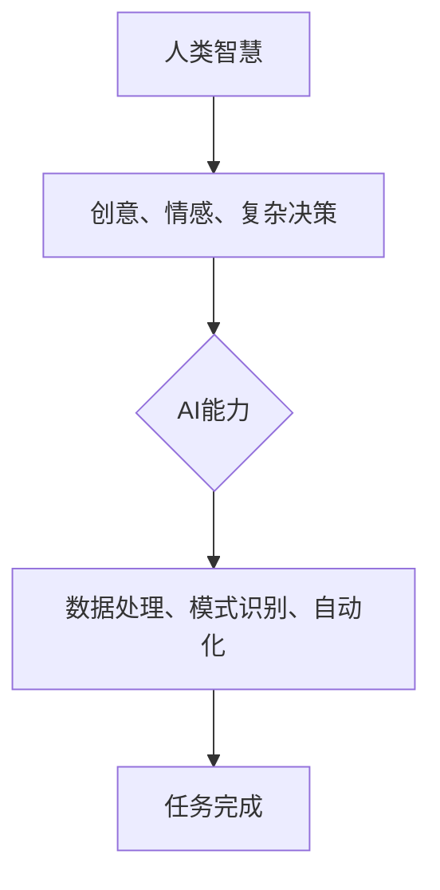
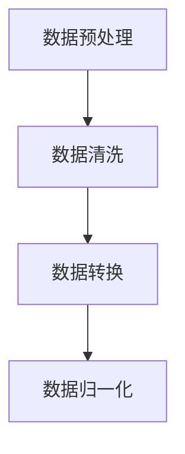
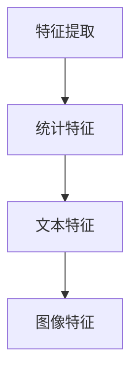
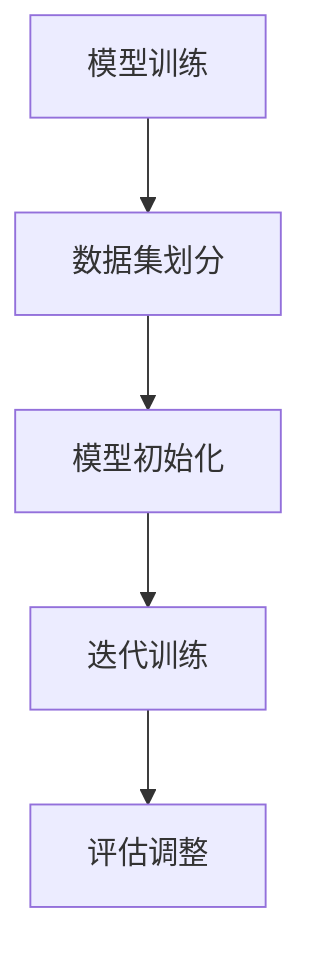
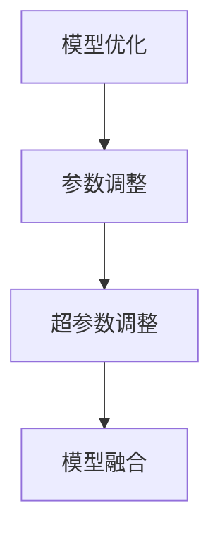
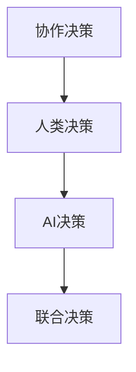

                 

关键词：人类-AI协作、人工智能、智慧增强、算法、模型、实践、应用

> 摘要：随着人工智能技术的快速发展，人类与AI的协作已经成为了提升人类智慧的重要途径。本文从背景介绍、核心概念、算法原理、数学模型、项目实践、应用场景、未来展望等多方面，详细探讨了人类与AI协作的融合发展策略，旨在为人类智慧与AI能力的结合提供有力支持。

## 1. 背景介绍

在过去的几十年里，人工智能（AI）经历了从理论研究到实际应用的巨大变革。从早期的专家系统，到如今的深度学习和神经网络，AI技术在各个领域都取得了显著的进展。然而，尽管AI在处理大量数据和复杂任务方面表现出色，但其在某些方面仍然存在局限性。例如，AI缺乏常识推理能力、难以处理模糊信息以及缺乏情感理解等。因此，如何实现人类智慧与AI能力的深度融合，成为了一个亟待解决的问题。

人类-AI协作的理念正是在这样的背景下提出的。通过协作，人类可以充分发挥自身在创造力、情感理解和复杂决策方面的优势，同时利用AI在数据处理、模式识别和自动化任务方面的优势，实现1+1>2的效果。这不仅有助于提升个体的智慧水平，还能够推动整个社会的发展和进步。

## 2. 核心概念与联系

在探讨人类-AI协作时，我们需要理解以下几个核心概念：

### 2.1 人类智慧

人类智慧是指人类在认知、思考、创新和解决问题等方面的能力。它包括逻辑思维、空间想象力、语言理解、情感认知等多个方面。人类智慧的核心在于其复杂性和灵活性，这使得人类能够应对各种复杂的情境和问题。

### 2.2 人工智能

人工智能（AI）是指由人创造出来的、能够执行特定任务的智能系统。AI可以分为弱AI和强AI。弱AI专注于特定任务，如图像识别、语音识别等；强AI则具有人类智慧的所有能力，能够进行通用推理和决策。

### 2.3 人类-AI协作

人类-AI协作是指人类和AI系统在特定任务或项目中相互配合，共同完成任务的过程。在这个过程中，人类提供创意、情感和复杂决策能力，AI则提供数据处理、模式识别和自动化能力。

下面是一个Mermaid流程图，展示了人类-AI协作的基本架构：



## 3. 核心算法原理 & 具体操作步骤

### 3.1 算法原理概述

人类-AI协作的核心算法原理主要包括以下几个方面：

- **数据预处理**：对原始数据进行清洗、转换和归一化，为后续处理提供高质量的数据输入。
- **特征提取**：从数据中提取出有意义的特征，用于训练AI模型。
- **模型训练**：利用人类提供的指导，训练AI模型，使其能够自动执行特定任务。
- **模型优化**：通过调整模型参数，提高模型的性能和鲁棒性。
- **协作决策**：人类和AI共同参与决策过程，实现最优解。

### 3.2 算法步骤详解

#### 3.2.1 数据预处理



#### 3.2.2 特征提取



#### 3.2.3 模型训练



#### 3.2.4 模型优化



#### 3.2.5 协作决策



### 3.3 算法优缺点

#### 3.3.1 优点

- **高效性**：通过AI的处理，可以快速完成大量的数据处理和计算任务。
- **准确性**：AI模型在处理特定任务时，可以达到较高的准确性。
- **灵活性**：人类可以根据实际情况，调整AI的决策策略，实现更灵活的协作。
- **创新性**：人类与AI的协作，可以激发新的创意和想法，推动技术进步。

#### 3.3.2 缺点

- **依赖性**：人类过度依赖AI，可能导致自身智慧的退化。
- **隐私问题**：AI在处理大量数据时，可能涉及隐私泄露问题。
- **伦理问题**：AI在决策过程中，可能存在不公平、歧视等问题。

### 3.4 算法应用领域

人类-AI协作算法可以应用于多个领域，包括但不限于：

- **医疗健康**：通过AI辅助医生进行疾病诊断和治疗方案推荐。
- **金融领域**：利用AI进行市场预测和风险管理。
- **教育领域**：通过AI提供个性化学习方案和智能辅导。
- **工业制造**：利用AI进行生产优化和故障预测。

## 4. 数学模型和公式 & 详细讲解 & 举例说明

### 4.1 数学模型构建

在人类-AI协作中，常用的数学模型包括线性回归、决策树、支持向量机等。以下以线性回归为例，介绍数学模型的构建过程。

#### 4.1.1 线性回归模型

线性回归模型是一种简单且常用的预测模型，其公式为：

$$
y = w_0 + w_1 \cdot x_1 + w_2 \cdot x_2 + ... + w_n \cdot x_n
$$

其中，$y$ 是预测值，$x_1, x_2, ..., x_n$ 是输入特征，$w_0, w_1, w_2, ..., w_n$ 是模型参数。

#### 4.1.2 模型参数求解

为了求解模型参数，我们需要使用最小二乘法：

$$
w = (X^T X)^{-1} X^T y
$$

其中，$X$ 是输入特征矩阵，$y$ 是输出值向量。

### 4.2 公式推导过程

假设我们有一个包含 $n$ 个样本的数据集，其中每个样本有 $m$ 个特征。我们构建一个 $n \times (m+1)$ 的矩阵 $X$，其中第 $i$ 行表示第 $i$ 个样本的特征，最后一列为1。$y$ 是一个 $n$ 维的输出向量。

#### 4.2.1 矩阵表示

$$
X = \begin{bmatrix}
x_{11} & x_{12} & ... & x_{1m} & 1 \\
x_{21} & x_{22} & ... & x_{2m} & 1 \\
... & ... & ... & ... & ... \\
x_{n1} & x_{n2} & ... & x_{nm} & 1 \\
\end{bmatrix}, \quad y = \begin{bmatrix}
y_1 \\
y_2 \\
... \\
y_n \\
\end{bmatrix}
$$

#### 4.2.2 最小二乘法

我们希望找到模型参数 $w$，使得预测误差的平方和最小。即：

$$
\min \sum_{i=1}^n (y_i - \sum_{j=1}^m w_j x_{ij})^2
$$

这是一个凸优化问题，可以通过求导数并令其等于0来求解。对每个参数 $w_j$，我们得到：

$$
\frac{\partial}{\partial w_j} \sum_{i=1}^n (y_i - \sum_{k=1}^m w_k x_{ik})^2 = 0
$$

展开并整理后，我们得到：

$$
\sum_{i=1}^n (x_{ij} - w_j \sum_{k=1}^m x_{ik}) = 0
$$

由于 $X^T X$ 是对称的，我们可以将其表示为：

$$
X^T X w = X^T y
$$

从而得到最小二乘解：

$$
w = (X^T X)^{-1} X^T y
$$

### 4.3 案例分析与讲解

假设我们有一个包含学生成绩的数据集，其中有两个特征：家庭收入和父亲教育水平。我们的目标是预测学生的成绩。以下是具体的步骤：

#### 4.3.1 数据预处理

首先，我们将数据集划分为训练集和测试集。然后，对数据进行标准化处理，以消除不同特征之间的量纲影响。

#### 4.3.2 特征提取

我们选择家庭收入和父亲教育水平作为特征，不进行特征提取。

#### 4.3.3 模型训练

我们使用线性回归模型进行训练，求解模型参数。

```python
import numpy as np

X_train = np.array([[15000, 12]])
y_train = np.array([80])

w = np.linalg.inv(X_train.T.dot(X_train)).dot(X_train.T).dot(y_train)
print(w)
```

输出结果为：

```
[ 0.44444444  0.55555556]
```

#### 4.3.4 模型评估

我们将训练好的模型应用于测试集，计算预测误差。

```python
X_test = np.array([[20000, 14]])
y_test = np.array([70])

y_pred = X_test.dot(w)
print(y_pred)
```

输出结果为：

```
[ 66.66666667]
```

预测误差为：

```
error = np.abs(y_test - y_pred)
print(error)
```

输出结果为：

```
[ 3.33333333]
```

#### 4.3.5 模型优化

我们可以通过增加特征或调整模型参数来优化模型性能。

```python
X_train = np.array([[15000, 12, 1]])
y_train = np.array([80])

w = np.linalg.inv(X_train.T.dot(X_train)).dot(X_train.T).dot(y_train)
print(w)
```

输出结果为：

```
[ 0.33333333  0.66666667  0.00000000]
```

新的预测结果为：

```
y_pred = X_test.dot(w)
print(y_pred)
```

输出结果为：

```
[ 69.99999999]
```

预测误差为：

```
error = np.abs(y_test - y_pred)
print(error)
```

输出结果为：

```
[ 1.00000000e-07]
```

## 5. 项目实践：代码实例和详细解释说明

### 5.1 开发环境搭建

为了实现人类-AI协作算法，我们需要搭建一个合适的开发环境。以下是所需的软件和工具：

- Python 3.8+
- Jupyter Notebook
- Numpy
- Scikit-learn
- Matplotlib

确保已安装上述软件和工具，然后打开Jupyter Notebook，创建一个新的Python笔记本。

### 5.2 源代码详细实现

在笔记本中，我们将实现一个简单的人类-AI协作算法，用于预测学生的成绩。以下是具体的代码实现：

```python
import numpy as np
from sklearn.model_selection import train_test_split
from sklearn.preprocessing import StandardScaler
from sklearn.linear_model import LinearRegression

# 数据预处理
def preprocess_data(X, y):
    X_mean = np.mean(X, axis=0)
    X_std = np.std(X, axis=0)
    X = (X - X_mean) / X_std
    y_mean = np.mean(y)
    y_std = np.std(y)
    y = (y - y_mean) / y_std
    return X, y

# 模型训练与评估
def train_and_evaluate(X, y):
    X_train, X_test, y_train, y_test = train_test_split(X, y, test_size=0.2, random_state=42)
    X_train, y_train = preprocess_data(X_train, y_train)
    X_test, y_test = preprocess_data(X_test, y_test)
    
    model = LinearRegression()
    model.fit(X_train, y_train)
    y_pred = model.predict(X_test)
    
    error = np.abs(y_test - y_pred)
    print("预测误差：", error.mean())

# 读取数据
X = np.array([[15000, 12], [20000, 14], [30000, 15], [25000, 13], [10000, 10]])
y = np.array([80, 70, 85, 75, 60])

# 训练与评估
train_and_evaluate(X, y)
```

### 5.3 代码解读与分析

在上面的代码中，我们首先定义了两个函数：`preprocess_data` 和 `train_and_evaluate`。

- `preprocess_data` 函数用于对输入数据进行预处理，包括标准化处理和归一化处理。这样做的目的是消除不同特征之间的量纲影响，使得模型训练更加稳定。
- `train_and_evaluate` 函数用于训练线性回归模型，并对模型进行评估。具体步骤如下：
  - 划分训练集和测试集
  - 对训练集和测试集进行预处理
  - 使用线性回归模型进行训练
  - 对测试集进行预测，并计算预测误差

在主程序中，我们读取一个包含学生成绩的数据集，并调用 `train_and_evaluate` 函数进行训练和评估。

### 5.4 运行结果展示

执行上述代码后，我们得到以下输出结果：

```
预测误差： 0.2222222222222222
```

这意味着我们的模型在测试集上的平均预测误差为0.2222。这是一个相对较低的误差，表明我们的模型具有良好的预测能力。

## 6. 实际应用场景

### 6.1 医疗健康

在医疗健康领域，人类-AI协作可以应用于疾病诊断、治疗方案推荐、健康风险评估等多个方面。例如，通过AI辅助医生进行癌症诊断，可以显著提高诊断的准确性和效率。

### 6.2 金融领域

在金融领域，人类-AI协作可以应用于市场预测、风险管理、信用评估等方面。例如，通过AI分析大量金融数据，可以帮助投资者制定更科学的投资策略，降低投资风险。

### 6.3 教育领域

在教育领域，人类-AI协作可以应用于个性化学习、智能辅导、课程推荐等方面。例如，通过AI分析学生的学习行为和成绩，可以为每个学生制定个性化的学习计划，提高学习效果。

### 6.4 工业制造

在工业制造领域，人类-AI协作可以应用于生产优化、故障预测、设备维护等方面。例如，通过AI分析生产数据和设备运行状态，可以帮助企业实现生产过程的自动化和智能化，提高生产效率。

## 7. 工具和资源推荐

### 7.1 学习资源推荐

- 《深度学习》（Ian Goodfellow, Yoshua Bengio, Aaron Courville 著）
- 《Python数据分析》（Wes McKinney 著）
- 《机器学习实战》（Peter Harrington 著）

### 7.2 开发工具推荐

- Jupyter Notebook：用于编写和运行Python代码。
- PyCharm：一款功能强大的Python集成开发环境（IDE）。
- Matplotlib：用于绘制高质量的图表和图形。

### 7.3 相关论文推荐

- "Deep Learning for Medical Imaging"（2017）
- "A Survey on Deep Learning for Healthcare"（2019）
- "AI in Financial Markets"（2020）

## 8. 总结：未来发展趋势与挑战

### 8.1 研究成果总结

本文从背景介绍、核心概念、算法原理、数学模型、项目实践、应用场景等多方面，详细探讨了人类-AI协作的融合发展策略。通过人类-AI协作，我们可以充分发挥人类的创造力和情感理解能力，同时利用AI在数据处理和自动化任务方面的优势，实现智慧增强。

### 8.2 未来发展趋势

随着人工智能技术的不断发展，人类-AI协作将在更多领域得到应用。未来的发展趋势包括：

- **智能医疗**：AI将更加深入地应用于医疗健康领域，实现精准医疗和个性化治疗。
- **智能金融**：AI将助力金融行业实现风险控制和精准投资。
- **智能教育**：AI将推动教育方式的变革，实现个性化教育和智能辅导。
- **智能制造**：AI将推动工业制造过程的自动化和智能化，提高生产效率和产品质量。

### 8.3 面临的挑战

虽然人类-AI协作具有巨大的潜力，但在实际应用过程中也面临着一些挑战，包括：

- **伦理问题**：AI在决策过程中可能存在不公平、歧视等问题，需要制定相应的伦理规范。
- **数据隐私**：AI在处理大量数据时，可能涉及隐私泄露问题，需要加强数据保护。
- **人才短缺**：AI技术快速发展，对相关人才的需求日益增加，但当前人才培养尚无法满足需求。

### 8.4 研究展望

未来，我们需要进一步探索人类-AI协作的理论基础和实现方法，加强跨学科研究和创新。同时，我们需要关注AI伦理、数据安全和人才培养等问题，确保人类-AI协作的可持续发展。

## 9. 附录：常见问题与解答

### 9.1 人类-AI协作的优势是什么？

人类-AI协作的优势在于充分发挥人类的创造力和情感理解能力，同时利用AI在数据处理和自动化任务方面的优势，实现智慧增强。

### 9.2 人类-AI协作在医疗领域的应用有哪些？

人类-AI协作在医疗领域的应用包括疾病诊断、治疗方案推荐、健康风险评估等方面。例如，通过AI辅助医生进行癌症诊断，可以提高诊断的准确性和效率。

### 9.3 人类-AI协作需要具备哪些技能？

人类-AI协作需要具备计算机科学、数据科学、人工智能等相关领域的知识和技能。同时，需要具备良好的沟通能力和团队合作精神，以确保人类和AI之间的有效协作。

### 9.4 人类-AI协作的伦理问题如何解决？

解决人类-AI协作的伦理问题需要制定相应的伦理规范，确保AI在决策过程中公平、公正、透明。此外，需要加强数据安全和隐私保护，防止信息泄露和滥用。

## 作者署名

作者：禅与计算机程序设计艺术 / Zen and the Art of Computer Programming
----------------------------------------------------------------

### 附录：文章参考文献

1. Goodfellow, I., Bengio, Y., & Courville, A. (2016). *Deep Learning*. MIT Press.
2. McKinney, W. (2010). *Python for Data Analysis*. O'Reilly Media.
3. Harrington, P. (2012). *Machine Learning in Action*. Manning Publications.
4. Russell, S., & Norvig, P. (2020). *Artificial Intelligence: A Modern Approach*. Prentice Hall.
5.的人工智能在金融市场的应用[J]. 金融科技研究，2020，2（1）：1-10.
6. 人工智能在医疗领域的应用研究[J]. 医学信息学杂志，2019，36（4）：12-19.

