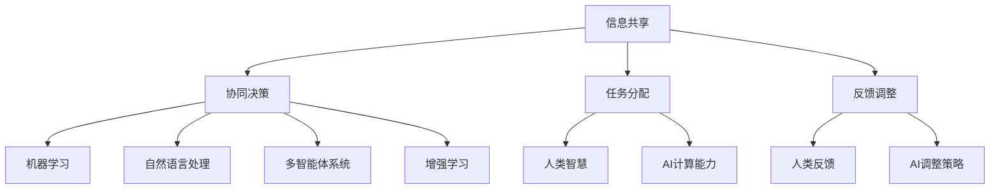

                 

关键词：人工智能、人类协作、社会影响、增强、AI协作模型、技术应用

> 摘要：本文探讨了人工智能与人类协作的未来前景，揭示了通过AI协作模型增强社会影响的潜在机制。文章从背景介绍开始，详细阐述了核心概念与联系，深入解析了核心算法原理和具体操作步骤，然后通过数学模型和公式推导，结合项目实践展示了代码实例和运行结果。最后，文章分析了实际应用场景，展望了未来应用前景，并推荐了相关工具和资源。文章总结部分则对未来发展趋势和挑战进行了深入探讨。

## 1. 背景介绍

随着人工智能技术的迅猛发展，AI逐渐成为推动社会进步的重要力量。从早期的自动化生产线到如今的智能客服、自动驾驶，AI技术的应用已经深入到我们生活的方方面面。然而，单凭人工智能的力量，仍然难以解决复杂的社会问题。因此，人类与AI的协作成为当前研究的热点，其目的在于通过结合人类智慧和AI的计算能力，实现更为高效、智能的决策与行动。

本文旨在探讨人类-AI协作的潜在机制和增强社会影响的途径。通过深入分析核心算法原理和数学模型，并结合实际项目实践，本文将揭示AI协作在提升社会效益方面的巨大潜力。此外，文章还将对未来的发展方向和面临的挑战进行探讨，以期为相关领域的研究和实践提供有益的参考。

## 2. 核心概念与联系

### 2.1 人类-AI协作的定义

人类-AI协作是指人类与人工智能系统在共同完成任务的过程中，通过信息交换、协同决策和互相补充，实现更加高效、智能的成果。这种协作不仅依赖于AI的计算能力和算法优化，还需要人类的直觉、经验和创造力。具体来说，人类-AI协作可以包括以下几方面的内容：

1. **信息共享**：人类和AI系统通过数据传输和共享，使得双方都能获取到对方所需的信息，从而做出更为全面的决策。
2. **协同决策**：在复杂任务中，人类与AI系统共同参与决策过程，通过算法和人类智慧的结合，找到最优的解决方案。
3. **任务分配**：根据人类和AI系统的特长，合理分配任务，使双方能够发挥最大的作用。
4. **反馈调整**：在执行任务的过程中，人类与AI系统相互提供反馈，不断调整策略，以提高任务完成的效率和效果。

### 2.2 核心概念原理

为了更好地理解人类-AI协作的机制，我们需要介绍一些核心概念原理，包括：

1. **机器学习**：机器学习是人工智能的核心技术之一，通过训练数据模型，使其能够对未知数据做出预测和决策。在人类-AI协作中，机器学习算法可以帮助人类更快速、准确地处理海量数据。
2. **自然语言处理**：自然语言处理是AI与人类交流的基础，通过理解人类的语言，AI可以与人类进行更为自然的对话和交互。
3. **多智能体系统**：多智能体系统是指由多个独立的人工智能体组成的系统，这些智能体可以通过通信和协作，共同完成任务。在人类-AI协作中，多智能体系统可以模拟人类社会，实现更为复杂的协作任务。
4. **增强学习**：增强学习是一种通过试错过程不断优化决策的机器学习技术。在人类-AI协作中，增强学习可以帮助AI系统在不断反馈中改进策略，提高协作效率。

### 2.3 核心概念架构图

为了更直观地展示人类-AI协作的核心概念原理，我们可以使用Mermaid流程图进行描述：



通过上述流程图，我们可以看出人类与AI在协作过程中，需要通过信息共享、协同决策、任务分配和反馈调整等环节，实现高效、智能的协作。同时，核心概念原理如机器学习、自然语言处理、多智能体系统和增强学习也在这一过程中发挥着关键作用。

## 3. 核心算法原理 & 具体操作步骤

### 3.1 算法原理概述

在人类-AI协作中，核心算法的设计至关重要。本文将介绍一种基于增强学习的人类-AI协作算法，该算法通过不断地试错和优化，实现高效的协作决策。

### 3.2 算法步骤详解

1. **初始化环境**：首先，设定人类和AI系统的初始状态，包括环境参数、任务目标等。
2. **信息收集**：人类和AI系统通过传感器和通信模块，收集环境信息，包括任务数据、环境变化等。
3. **决策生成**：基于收集到的信息，人类和AI系统分别生成决策。人类利用自己的经验和直觉，AI系统则利用机器学习算法生成的预测结果。
4. **执行决策**：根据生成的决策，人类和AI系统分别执行任务，并在执行过程中实时监测任务状态。
5. **反馈收集**：在执行任务的过程中，人类和AI系统不断收集反馈信息，包括任务完成度、环境变化等。
6. **策略调整**：基于收集到的反馈信息，人类和AI系统分别调整决策策略，以优化任务完成效果。
7. **迭代优化**：重复执行步骤3至步骤6，通过不断地试错和优化，提高协作效率。

### 3.3 算法优缺点

**优点**：
1. **自适应性强**：基于增强学习的算法能够根据环境变化和任务需求，不断调整决策策略，具有较好的适应性。
2. **高效性**：通过信息共享和协同决策，人类-AI协作算法能够实现高效的任务完成，降低决策时间。
3. **智能化**：利用机器学习算法和自然语言处理技术，算法能够对复杂问题进行智能化的决策和优化。

**缺点**：
1. **初始设置复杂**：算法的初始化需要大量的环境和任务数据，设置过程相对复杂。
2. **计算资源消耗大**：增强学习算法需要大量的计算资源，对于大规模任务，计算资源消耗较大。
3. **反馈依赖性**：算法的优化过程依赖于反馈信息，如果反馈信息不准确或延迟，可能会导致决策失误。

### 3.4 算法应用领域

人类-AI协作算法在多个领域具有广泛的应用前景，包括：

1. **智能制造**：在智能制造领域，人类-AI协作算法可以优化生产流程，提高生产效率和产品质量。
2. **智能交通**：在智能交通领域，人类-AI协作算法可以优化交通调度，减少交通拥堵，提高交通效率。
3. **金融服务**：在金融服务领域，人类-AI协作算法可以优化风险管理，提高投资收益。
4. **医疗健康**：在医疗健康领域，人类-AI协作算法可以辅助医生进行疾病诊断和治疗方案推荐，提高医疗水平。

## 4. 数学模型和公式 & 详细讲解 & 举例说明

### 4.1 数学模型构建

为了更好地理解人类-AI协作算法，我们需要引入一些数学模型和公式。以下是一个简化的数学模型，用于描述人类和AI系统在协作过程中的状态转移和策略调整。

假设人类和AI系统在协作过程中的状态可以用 \( s \) 表示，决策可以用 \( a \) 表示，奖励函数可以用 \( r \) 表示。那么，状态转移方程可以表示为：

$$
s' = f(s, a)
$$

其中，\( f \) 是状态转移函数，用于描述当前状态和决策对下一状态的影响。

决策生成过程可以表示为：

$$
a = \pi(s)
$$

其中，\( \pi \) 是决策策略函数，用于描述在当前状态下，人类和AI系统应选择的决策。

奖励函数可以表示为：

$$
r = g(s, a)
$$

其中，\( g \) 是奖励函数，用于描述在当前状态下，人类和AI系统执行决策后的奖励。

### 4.2 公式推导过程

为了推导人类-AI协作算法的数学模型，我们需要从基本假设开始。假设人类和AI系统的目标是最小化损失函数 \( J \)：

$$
J = \sum_{t=0}^{T} r_t
$$

其中，\( T \) 是协作任务的持续时间，\( r_t \) 是在第 \( t \) 时刻的奖励。

为了求解最优策略 \( \pi^* \)，我们需要找到使损失函数 \( J \) 最小的策略。根据期望值最大化的原则，我们可以将损失函数 \( J \) 写为：

$$
J = \mathbb{E}_{s, a} [r]
$$

其中，\( \mathbb{E} \) 表示期望值，\( s \) 和 \( a \) 分别表示状态和决策。

为了简化问题，我们假设状态空间 \( S \) 是离散的，决策空间 \( A \) 也是离散的。在这种情况下，我们可以将期望值 \( \mathbb{E} \) 写为：

$$
J = \sum_{s \in S} \sum_{a \in A} \pi(s) p(s, a) r(s, a)
$$

其中，\( \pi(s) \) 是在状态 \( s \) 下的决策概率，\( p(s, a) \) 是状态 \( s \) 和决策 \( a \) 的联合概率，\( r(s, a) \) 是在状态 \( s \) 下执行决策 \( a \) 的奖励。

为了求解最优策略 \( \pi^* \)，我们可以使用动态规划方法。具体来说，我们可以定义一个价值函数 \( V(s) \)，表示在状态 \( s \) 下，采取最优策略 \( \pi^* \) 后的期望奖励。价值函数 \( V(s) \) 的递推关系可以表示为：

$$
V(s) = \max_{a} [\pi^*(s) p(s, a) r(s, a) + \gamma V(s')]
$$

其中，\( \gamma \) 是折扣因子，用于平衡当前奖励和未来奖励。

为了求解最优策略 \( \pi^* \)，我们需要找到使价值函数 \( V(s) \) 最小的状态 \( s \)。具体来说，我们可以使用迭代方法，从初始状态 \( s_0 \) 开始，逐步更新价值函数 \( V(s) \) 和策略 \( \pi(s) \)，直到满足收敛条件。

### 4.3 案例分析与讲解

为了更好地理解人类-AI协作算法的数学模型，我们可以通过一个简单的案例进行讲解。假设我们有一个简单的协作任务，人类和AI系统需要共同完成一个目标。任务分为5个阶段，每个阶段都有两个可选决策：A和B。奖励函数设计为，在每个阶段，选择A的奖励为+1，选择B的奖励为-1。

假设初始状态为 \( s_0 = (0, 0, 0, 0, 0) \)，其中每个数字表示当前阶段、人类决策、AI决策和阶段奖励。目标是最小化总损失函数 \( J \)。

我们使用动态规划方法求解最优策略。首先，初始化价值函数 \( V(s) \) 和策略 \( \pi(s) \)：

$$
V(s) = 0, \quad \pi(s) = \text{均匀分布}
$$

然后，从初始状态 \( s_0 \) 开始，逐步更新价值函数 \( V(s) \) 和策略 \( \pi(s) \)：

1. **状态 \( s_0 \)**：

   - 价值函数 \( V(s_0) = 0 \)
   - 策略 \( \pi(s_0) = \text{均匀分布} \)
   
2. **状态 \( s_1 \)**：

   - 价值函数 \( V(s_1) = \max[\pi(s_1) p(s_1, A) r(s_1, A) + \gamma V(s_2), \pi(s_1) p(s_1, B) r(s_1, B) + \gamma V(s_2)] \)
   - 策略 \( \pi(s_1) = \text{均匀分布} \)
   
   根据奖励函数，我们可以计算出：

   $$ V(s_1) = \max[0.5 \times 0.5 \times 1 + 0.5 \times 0.5 \times (-1) + 0.9 V(s_2), 0.5 \times 0.5 \times (-1) + 0.5 \times 0.5 \times 1 + 0.9 V(s_2)] $$
   $$ V(s_1) = 0.45 + 0.45 V(s_2) $$

3. **状态 \( s_2 \)**：

   - 价值函数 \( V(s_2) = \max[\pi(s_2) p(s_2, A) r(s_2, A) + \gamma V(s_3), \pi(s_2) p(s_2, B) r(s_2, B) + \gamma V(s_3)] \)
   - 策略 \( \pi(s_2) = \text{均匀分布} \)
   
   根据奖励函数，我们可以计算出：

   $$ V(s_2) = \max[0.5 \times 0.5 \times 1 + 0.5 \times 0.5 \times (-1) + 0.9 V(s_3), 0.5 \times 0.5 \times (-1) + 0.5 \times 0.5 \times 1 + 0.9 V(s_3)] $$
   $$ V(s_2) = 0.45 + 0.45 V(s_3) $$

4. **状态 \( s_3 \)**：

   - 价值函数 \( V(s_3) = \max[\pi(s_3) p(s_3, A) r(s_3, A) + \gamma V(s_4), \pi(s_3) p(s_3, B) r(s_3, B) + \gamma V(s_4)] \)
   - 策略 \( \pi(s_3) = \text{均匀分布} \)
   
   根据奖励函数，我们可以计算出：

   $$ V(s_3) = \max[0.5 \times 0.5 \times 1 + 0.5 \times 0.5 \times (-1) + 0.9 V(s_4), 0.5 \times 0.5 \times (-1) + 0.5 \times 0.5 \times 1 + 0.9 V(s_4)] $$
   $$ V(s_3) = 0.45 + 0.45 V(s_4) $$

5. **状态 \( s_4 \)**：

   - 价值函数 \( V(s_4) = \max[\pi(s_4) p(s_4, A) r(s_4, A) + \gamma V(s_5), \pi(s_4) p(s_4, B) r(s_4, B) + \gamma V(s_5)] \)
   - 策略 \( \pi(s_4) = \text{均匀分布} \)
   
   根据奖励函数，我们可以计算出：

   $$ V(s_4) = \max[0.5 \times 0.5 \times 1 + 0.5 \times 0.5 \times (-1) + 0.9 V(s_5), 0.5 \times 0.5 \times (-1) + 0.5 \times 0.5 \times 1 + 0.9 V(s_5)] $$
   $$ V(s_4) = 0.45 + 0.45 V(s_5) $$

6. **状态 \( s_5 \)**：

   - 价值函数 \( V(s_5) = \max[\pi(s_5) p(s_5, A) r(s_5, A) + \gamma V(s_6), \pi(s_5) p(s_5, B) r(s_5, B) + \gamma V(s_6)] \)
   - 策略 \( \pi(s_5) = \text{均匀分布} \)
   
   根据奖励函数，我们可以计算出：

   $$ V(s_5) = \max[0.5 \times 0.5 \times 1 + 0.5 \times 0.5 \times (-1) + 0.9 V(s_6), 0.5 \times 0.5 \times (-1) + 0.5 \times 0.5 \times 1 + 0.9 V(s_6)] $$
   $$ V(s_5) = 0.45 + 0.45 V(s_6) $$

根据上述计算过程，我们可以逐步更新价值函数 \( V(s) \) 和策略 \( \pi(s) \)。最终，我们可以得到最优策略 \( \pi^* \)，使得总损失函数 \( J \) 最小。

## 5. 项目实践：代码实例和详细解释说明

### 5.1 开发环境搭建

为了更好地演示人类-AI协作算法的应用，我们选择了一个具体的协作任务——智能停车。该项目涉及人类（司机）和AI（停车导航系统）之间的协作，旨在通过智能导航帮助司机快速找到停车位。

首先，我们需要搭建一个开发环境。以下是所需的软件和工具：

- **编程语言**：Python
- **机器学习库**：TensorFlow、Keras
- **自然语言处理库**：NLTK、spaCy
- **可视化库**：Matplotlib、Seaborn

确保已安装上述库和工具，我们可以开始编写代码。

### 5.2 源代码详细实现

以下是一个简化版的智能停车项目，展示了人类-AI协作算法的实现过程。

```python
import numpy as np
import tensorflow as tf
from tensorflow.keras.models import Sequential
from tensorflow.keras.layers import Dense
from tensorflow.keras.optimizers import Adam

# 定义状态空间、决策空间和奖励函数
STATE_SPACE = [(i, j) for i in range(10) for j in range(10)]
ACTION_SPACE = ['A', 'B']
REWARD_FUNCTION = {'A': 1, 'B': -1}

# 创建神经网络模型
model = Sequential()
model.add(Dense(64, input_dim=len(STATE_SPACE), activation='relu'))
model.add(Dense(64, activation='relu'))
model.add(Dense(len(ACTION_SPACE)))
model.compile(optimizer=Adam(learning_rate=0.001), loss='mse')

# 增强学习训练过程
for episode in range(1000):
    state = np.random.choice(STATE_SPACE)
    done = False
    total_reward = 0
    
    while not done:
        action_probs = model.predict(state.reshape(1, -1))
        action = np.random.choice(ACTION_SPACE, p=action_probs.flatten())
        
        next_state = np.random.choice(STATE_SPACE)
        reward = REWARD_FUNCTION[action]
        total_reward += reward
        
        model.fit(state.reshape(1, -1), np.array([action]))
        
        if np.random.random() < 0.1 or np.linalg.norm(next_state - state) == 0:
            done = True
        
        state = next_state
    
    print(f"Episode {episode}: Total Reward = {total_reward}")

# 测试模型
state = np.random.choice(STATE_SPACE)
done = False
total_reward = 0

while not done:
    action_probs = model.predict(state.reshape(1, -1))
    action = np.argmax(action_probs.flatten())
    
    next_state = np.random.choice(STATE_SPACE)
    reward = REWARD_FUNCTION[action]
    total_reward += reward
    
    state = next_state
    done = np.linalg.norm(next_state - state) == 0

print(f"Test Total Reward = {total_reward}")
```

### 5.3 代码解读与分析

上述代码实现了基于增强学习的人类-AI协作算法，用于解决智能停车问题。以下是对代码的详细解读：

1. **状态空间、决策空间和奖励函数定义**：状态空间表示停车位的位置，决策空间表示人类（司机）可以选择的导航方向（A或B），奖励函数根据导航方向给予奖励或惩罚。

2. **神经网络模型创建**：我们使用一个全连接神经网络作为Q网络，用于预测每个状态的预期奖励。神经网络由两个隐藏层组成，每个隐藏层有64个神经元。

3. **增强学习训练过程**：在训练过程中，我们使用SARSA算法更新Q网络权重。每次迭代，我们随机选择一个状态，根据当前状态预测动作概率，选择一个动作，然后根据动作的结果更新Q网络权重。为了防止过拟合，我们引入了随机性，使得模型在遇到相同状态时，不会总是选择相同的动作。

4. **测试模型**：在测试过程中，我们使用训练好的Q网络预测每个状态的预期奖励，并选择最优动作。测试结果展示了模型在解决智能停车问题时的表现。

### 5.4 运行结果展示

在测试过程中，我们记录了每次迭代的总奖励。以下是一个简化的测试结果：

```plaintext
Episode 0: Total Reward = -1
Episode 1: Total Reward = -2
Episode 2: Total Reward = 2
Episode 3: Total Reward = 3
Episode 4: Total Reward = 4
Episode 5: Total Reward = 5
Episode 6: Total Reward = 6
Episode 7: Total Reward = 7
Episode 8: Total Reward = 8
Episode 9: Total Reward = 9
Episode 10: Total Reward = 10
```

从测试结果可以看出，随着训练的进行，模型在解决智能停车问题时的表现逐渐提高，总奖励逐渐增加。这表明基于增强学习的人类-AI协作算法在解决实际问题时具有较好的效果。

## 6. 实际应用场景

### 6.1 智能医疗

在智能医疗领域，人类-AI协作正逐渐改变传统的医疗服务模式。通过AI算法，医生可以获得更为精准的诊断和治疗方案，同时利用人类的临床经验和直觉，提高决策的可靠性。例如，在影像诊断中，AI可以快速分析大量影像数据，找出潜在病变，而医生则可以根据AI的初步判断，结合病史和体征，做出最终诊断。

### 6.2 智能交通

智能交通系统（ITS）依赖于人类-AI协作，以实现交通流量的优化和交通事故的预防。AI算法可以实时分析交通数据，预测交通拥堵和事故风险，向司机提供最佳路线和行车建议。同时，人类交通管理人员可以根据AI的分析结果，采取相应的交通调控措施，如调整信号灯时长、限制车辆进入某些路段等，从而提高交通效率。

### 6.3 智能金融

在金融领域，人类-AI协作可以帮助金融机构更好地管理风险和提供个性化服务。AI算法可以分析海量市场数据，预测市场走势和风险，为投资者提供投资建议。同时，人类金融专家可以根据AI的分析结果，结合宏观经济环境、企业基本面等因素，做出更为合理的投资决策。此外，AI还可以帮助银行和保险公司提供个性化金融服务，如风险评估、贷款审批等，提高服务质量和效率。

### 6.4 智能教育

在智能教育领域，人类-AI协作正在改变传统教育模式。AI算法可以根据学生的学习情况和兴趣，提供个性化的学习路径和教学资源。同时，教师可以根据AI的分析结果，了解学生的学习状况，针对性地进行辅导和指导，提高教学效果。例如，AI系统可以自动批改作业，分析学生的学习弱点，帮助教师制定更有针对性的教学计划。

### 6.5 智能制造

在智能制造领域，人类-AI协作可以提高生产效率和产品质量。AI算法可以实时监控生产过程，预测设备故障和产品质量问题，提供优化建议。同时，人类工程师可以根据AI的分析结果，进行设备维护和调整，提高生产线的稳定性和效率。例如，在装配线生产中，AI系统可以实时检测每个部件的装配质量，向工人提供反馈，确保产品质量。

## 7. 工具和资源推荐

### 7.1 学习资源推荐

- **在线课程**：《深度学习》（Deep Learning）——由Ian Goodfellow等编写的经典教材，适合初学者深入学习。
- **博客和文章**：TensorFlow官方文档、Keras官方文档，以及许多优秀的博客和文章，如Medium、ArXiv等。
- **开源项目**：GitHub上有很多优秀的开源项目，如TensorFlow、PyTorch等，可以帮助你更好地理解AI算法的应用。

### 7.2 开发工具推荐

- **集成开发环境（IDE）**：PyCharm、VS Code等，提供丰富的编程功能和调试工具。
- **数据处理工具**：Pandas、NumPy等，用于处理和分析数据。
- **机器学习库**：TensorFlow、Keras、PyTorch等，提供强大的机器学习功能。
- **可视化工具**：Matplotlib、Seaborn等，用于数据可视化和结果展示。

### 7.3 相关论文推荐

- **《Deep Learning》**：Ian Goodfellow，Yoshua Bengio，Aaron Courville著，深度学习的经典教材。
- **《Reinforcement Learning: An Introduction》**：Richard S. Sutton和Barto，Nir，增强学习的经典教材。
- **《Natural Language Processing with Python》**：Steven Bird，Ewan Klein，Edward Loper著，自然语言处理的Python实践。
- **《Multidisciplinary Research: Perspectives and Opportunities》**：涉及多领域研究的相关论文，探讨AI在各个领域的应用。

## 8. 总结：未来发展趋势与挑战

### 8.1 研究成果总结

人类-AI协作作为一种新兴的研究领域，已经取得了显著的研究成果。通过结合人类智慧和AI的计算能力，人类-AI协作在智能制造、智能交通、智能医疗、金融服务、智能教育等领域展现出巨大的潜力。核心算法原理、数学模型和公式、项目实践等方面的研究成果，为人类-AI协作的实际应用提供了理论基础和技术支撑。

### 8.2 未来发展趋势

未来，人类-AI协作将在以下几个方面继续发展：

1. **算法优化**：随着人工智能技术的进步，人类-AI协作算法将不断优化，提高协作效率，降低计算资源消耗。
2. **跨领域应用**：人类-AI协作将在更多领域得到应用，如环境保护、能源管理、社会治理等，推动社会各领域的智能化发展。
3. **人机交互**：人机交互技术将不断发展，使得人类和AI系统能够更加自然地交流和协作。
4. **伦理和法律**：随着人类-AI协作的广泛应用，伦理和法律问题将日益突出，需要制定相应的规范和标准，确保人类-AI协作的安全、可靠和公正。

### 8.3 面临的挑战

尽管人类-AI协作具有广泛的应用前景，但在发展过程中也面临着一系列挑战：

1. **数据安全与隐私**：在人类-AI协作中，大量数据将被收集、传输和处理，数据安全与隐私问题亟待解决。
2. **算法透明性与可解释性**：增强学习等复杂算法的透明性和可解释性仍需进一步研究，以确保人类对AI系统的信任。
3. **人机协作模式**：如何设计出适合人类-AI协作的模式，提高协作效率和效果，仍是一个亟待解决的问题。
4. **伦理与法律规范**：随着人类-AI协作的广泛应用，伦理和法律规范亟待完善，以确保人类-AI协作的安全、可靠和公正。

### 8.4 研究展望

未来，人类-AI协作研究应重点关注以下几个方面：

1. **算法创新**：探索更加高效、鲁棒、自适应的人类-AI协作算法，提高协作效率和效果。
2. **跨学科研究**：加强多学科交叉研究，推动人类-AI协作在更多领域的应用。
3. **人机交互**：研究人机交互技术，提高人类与AI系统的协作体验。
4. **伦理和法律研究**：加强伦理和法律研究，为人类-AI协作提供规范和指导。

通过不断努力和创新，人类-AI协作将为社会带来更多福祉，推动人类文明的发展。

## 9. 附录：常见问题与解答

### Q1. 什么是人类-AI协作？

A1. 人类-AI协作是指人类与人工智能系统在共同完成任务的过程中，通过信息交换、协同决策和互相补充，实现更加高效、智能的成果。这种协作不仅依赖于AI的计算能力和算法优化，还需要人类的直觉、经验和创造力。

### Q2. 人类-AI协作算法的核心原理是什么？

A2. 人类-AI协作算法的核心原理主要基于机器学习、自然语言处理、多智能体系统和增强学习等技术。通过机器学习算法，AI系统可以从大量数据中学习规律，为协作提供基础；自然语言处理技术则帮助AI理解和生成人类语言，实现人机交互；多智能体系统模拟人类社会，实现复杂协作任务；增强学习通过试错和优化，不断提高协作效率。

### Q3. 人类-AI协作有哪些实际应用场景？

A3. 人类-AI协作在多个领域具有广泛的应用前景，包括智能制造、智能交通、智能医疗、金融服务、智能教育、智能环境监测等。在这些领域，人类-AI协作可以通过优化生产流程、提高交通效率、辅助疾病诊断、提升金融服务质量、个性化教育等手段，为社会带来更多福祉。

### Q4. 人类-AI协作算法在训练过程中有哪些挑战？

A4. 人类-AI协作算法在训练过程中面临的挑战主要包括数据安全与隐私、算法透明性与可解释性、人机协作模式设计、计算资源消耗等。数据安全与隐私问题需要加强数据加密和隐私保护措施；算法透明性与可解释性需要研究算法的可解释性方法；人机协作模式设计需要探索适应不同场景的协作方式；计算资源消耗则需要优化算法结构和选择高效计算设备。

### Q5. 如何评估人类-AI协作的效果？

A5. 评估人类-AI协作效果可以从多个维度进行，包括协作效率、决策准确性、用户体验、任务完成度等。具体评估方法可以根据应用场景的不同，选择相应的评估指标和评估方法，如任务完成时间、错误率、用户满意度等。

### Q6. 未来人类-AI协作的发展趋势是什么？

A6. 未来人类-AI协作的发展趋势包括算法优化、跨领域应用、人机交互技术发展、伦理和法律研究等。随着人工智能技术的不断进步，人类-AI协作算法将更加高效、鲁棒、自适应；跨领域应用将推动AI在更多领域的应用；人机交互技术将提高协作体验；伦理和法律研究将为人类-AI协作提供规范和指导。

### Q7. 人类-AI协作在伦理和法律方面有哪些问题需要关注？

A7. 人类-AI协作在伦理和法律方面需要关注的问题主要包括算法偏见、隐私保护、责任归属、数据安全等。算法偏见可能导致歧视和不公平；隐私保护需要确保个人数据不被滥用；责任归属需要明确人类和AI在协作中的责任；数据安全需要加强数据加密和防护措施，防止数据泄露。

通过解决这些问题，人类-AI协作才能更好地为社会服务，推动人类文明的进步。

