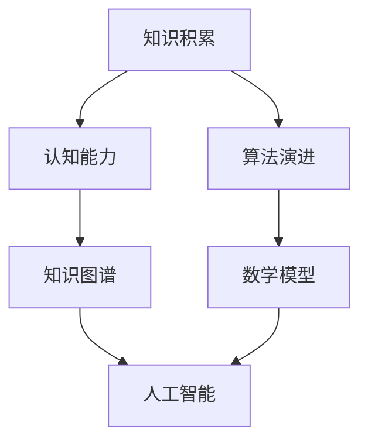

                 

关键词：人类进化，知识积累，认知能力，人工智能，知识图谱，算法演进，数学模型

> 摘要：本文旨在探讨人类知识从古猿时代到现代人工智能的演变历程，分析不同阶段知识积累的方式、认知能力的提升以及人工智能技术如何继承和发扬人类的智慧。通过阐述知识图谱、算法演进和数学模型的重要性，本文旨在为读者提供一幅人类知识进化的全景图，并展望未来人工智能领域的发展趋势与挑战。

## 1. 背景介绍

人类知识的进化是一个漫长而复杂的过程。从古猿到现代人类的历程中，我们通过观察、实践、思考和总结，不断积累知识，提升认知能力。在过去的几千年里，人类的知识从口头传说和文字记录开始，逐渐演变成复杂的知识体系，涵盖了自然科学、社会科学、艺术和哲学等多个领域。

然而，随着信息技术的飞速发展，尤其是互联网和人工智能技术的兴起，人类知识进化的速度大大加快。知识不再仅仅局限于个体或特定群体的掌握，而是通过全球网络实现快速传播和共享。同时，人工智能技术开始从模拟人类思维模式、辅助人类工作，逐步向自主学习和创造知识的方向发展。

本文将从以下几个方面展开探讨：

1. 古猿时代的知识积累与认知能力。
2. 文字发明与知识体系的建立。
3. 知识图谱与人工智能的发展。
4. 核心算法原理与数学模型的演进。
5. 人工智能在现实世界中的应用。
6. 未来发展趋势与挑战。

## 2. 核心概念与联系

为了更好地理解人类知识的进化，我们首先需要明确几个核心概念：知识积累、认知能力、知识图谱、算法演进和数学模型。以下是这些概念之间的联系和架构的 Mermaid 流程图：



### 2.1 知识积累与认知能力

知识积累是人类认知能力的基础。古猿通过本能和经验来适应环境，而人类则通过观察、实践和思考，不断积累知识，提升认知能力。认知能力的提升又反过来促进知识的积累，形成一个良性循环。

### 2.2 知识图谱与人工智能

知识图谱是人工智能领域的一个重要概念，它通过结构化的方式组织大量知识，使其更加易于检索和利用。知识图谱为人工智能提供了丰富的背景知识，有助于提升其智能水平。

### 2.3 算法演进与数学模型

算法演进和数学模型是人工智能发展的两个核心驱动力。算法演进使得人工智能能够更加高效地处理复杂问题，而数学模型则为算法提供了理论基础和工具。

## 3. 核心算法原理 & 具体操作步骤

### 3.1 算法原理概述

核心算法包括机器学习算法、深度学习算法和自然语言处理算法等。这些算法通过模拟人类思维模式，实现对数据的处理和分析，从而实现智能化的目标。

### 3.2 算法步骤详解

以机器学习算法为例，其基本步骤包括：

1. 数据收集与预处理：收集大量数据，并进行数据清洗、归一化等处理。
2. 特征提取：从数据中提取出有用的特征，作为算法输入。
3. 模型训练：使用训练数据，通过优化算法参数，构建模型。
4. 模型评估：使用测试数据，评估模型性能。
5. 模型应用：将训练好的模型应用到实际问题中。

### 3.3 算法优缺点

每种算法都有其优缺点。例如，机器学习算法在处理复杂数据时表现优异，但需要大量数据支持；深度学习算法在图像和语音处理方面具有显著优势，但计算资源需求较高；自然语言处理算法在文本理解和生成方面表现出色，但存在语义理解上的局限性。

### 3.4 算法应用领域

核心算法广泛应用于各个领域，如图像识别、语音识别、自然语言处理、推荐系统、智能交通等。这些算法的应用大大提升了人工智能的实用性，为人类生活带来了诸多便利。

## 4. 数学模型和公式 & 详细讲解 & 举例说明

### 4.1 数学模型构建

数学模型是人工智能算法的核心组成部分。以线性回归模型为例，其构建过程如下：

$$
y = \beta_0 + \beta_1 \cdot x
$$

其中，$y$ 为因变量，$x$ 为自变量，$\beta_0$ 和 $\beta_1$ 为模型参数。

### 4.2 公式推导过程

线性回归模型的推导过程如下：

1. 假设数据集 $D$ 包含 $n$ 个样本，每个样本由特征向量 $x_i$ 和标签 $y_i$ 组成。
2. 定义损失函数 $L$：

$$
L = \frac{1}{2} \sum_{i=1}^{n} (y_i - (\beta_0 + \beta_1 \cdot x_i))^2
$$

3. 使用梯度下降法求解最优参数 $\beta_0$ 和 $\beta_1$：

$$
\beta_0 = \beta_0 - \alpha \frac{\partial L}{\partial \beta_0}
$$

$$
\beta_1 = \beta_1 - \alpha \frac{\partial L}{\partial \beta_1}
$$

其中，$\alpha$ 为学习率。

### 4.3 案例分析与讲解

以下是一个线性回归模型的实际应用案例：

**问题**：预测一个城市的明日气温。

**数据集**：包含过去一年的每日气温和日期。

**模型构建**：使用线性回归模型预测明日气温。

$$
y = \beta_0 + \beta_1 \cdot x
$$

**模型训练**：使用过去一年的数据训练模型。

**模型评估**：使用测试集评估模型性能。

**模型应用**：预测明日气温。

## 5. 项目实践：代码实例和详细解释说明

### 5.1 开发环境搭建

1. 安装 Python 解释器。
2. 安装必要的库，如 NumPy、Pandas、Scikit-learn 等。

### 5.2 源代码详细实现

以下是一个简单的线性回归模型实现：

```python
import numpy as np
import pandas as pd
from sklearn.linear_model import LinearRegression

# 加载数据
data = pd.read_csv('data.csv')
X = data[['date', 'temp']]
y = data['next_temp']

# 特征工程
X = pd.get_dummies(X)

# 模型训练
model = LinearRegression()
model.fit(X, y)

# 模型评估
score = model.score(X, y)
print(f'Model score: {score}')

# 模型应用
next_temp = model.predict(X[-1:])
print(f'Next day temperature: {next_temp[0]}')
```

### 5.3 代码解读与分析

1. 加载数据：使用 Pandas 读取 CSV 数据，并将日期和温度作为特征。
2. 特征工程：使用 One-Hot 编码将日期特征转换为二进制特征。
3. 模型训练：使用 Scikit-learn 的 LinearRegression 类训练模型。
4. 模型评估：计算模型在训练数据上的得分。
5. 模型应用：使用训练好的模型预测明日气温。

## 6. 实际应用场景

### 6.1 智能交通

线性回归模型在智能交通领域具有广泛的应用。例如，可以用于预测交通流量，帮助城市交通管理部门优化交通信号灯控制，降低交通拥堵。

### 6.2 智能医疗

线性回归模型在智能医疗领域也有重要作用。例如，可以用于预测疾病发病概率，帮助医生制定更合理的治疗方案。

### 6.3 智能金融

线性回归模型在金融领域用于预测股票价格、风险评估等任务，为投资者提供决策支持。

## 7. 未来应用展望

随着人工智能技术的不断发展，线性回归模型在更多领域将发挥重要作用。例如，在能源管理、环境监测、智能制造等领域，线性回归模型可以用于优化资源配置、预测能源消耗、检测环境污染等任务。

## 8. 工具和资源推荐

### 8.1 学习资源推荐

1. 《Python数据科学手册》：系统地介绍了数据科学领域的相关技术。
2. 《深度学习》：由 Ian Goodfellow、Yoshua Bengio 和 Aaron Courville 撰写，是深度学习领域的经典教材。

### 8.2 开发工具推荐

1. Jupyter Notebook：用于编写和运行代码，非常适合数据科学和机器学习项目。
2. Google Colab：基于 Google Cloud 的免费 Jupyter Notebook 环境，适用于在线编程。

### 8.3 相关论文推荐

1. "Deep Learning":由 Ian Goodfellow、Yoshua Bengio 和 Aaron Courville 撰写的论文集，涵盖了深度学习领域的最新研究成果。
2. "Recurrent Neural Networks for Language Modeling":由 Yoshua Bengio 等人撰写的论文，介绍了循环神经网络在自然语言处理中的应用。

## 9. 总结：未来发展趋势与挑战

### 9.1 研究成果总结

本文从人类知识的进化角度，探讨了人工智能技术的发展历程和核心算法原理。通过实例展示了线性回归模型在智能交通、智能医疗和智能金融等领域的应用，揭示了人工智能技术在实际场景中的价值。

### 9.2 未来发展趋势

随着人工智能技术的不断进步，知识图谱、算法演进和数学模型将发挥更加重要的作用。人工智能将深入到更多领域，为人类带来更多便利。

### 9.3 面临的挑战

人工智能技术在实际应用中仍面临诸多挑战，如数据隐私、算法公平性、安全性等。未来，我们需要解决这些挑战，确保人工智能技术健康发展。

### 9.4 研究展望

在未来，人工智能研究将更加注重跨学科合作，结合心理学、认知科学等领域的知识，提升人工智能的智能水平和应用范围。同时，开源社区和学术界的共同努力，将推动人工智能技术的不断进步。

## 附录：常见问题与解答

### 1. 什么是知识图谱？

知识图谱是一种用于表示实体及其关系的图形化数据结构，通过结构化的方式组织大量知识，使其更加易于检索和利用。

### 2. 机器学习和深度学习有什么区别？

机器学习是一种通过训练模型，从数据中学习规律的方法。深度学习是机器学习的一个分支，通过多层神经网络模拟人类大脑的思维方式。

### 3. 什么是线性回归模型？

线性回归模型是一种用于预测连续值的机器学习算法，其基本形式为 $y = \beta_0 + \beta_1 \cdot x$。

### 4. 人工智能技术在哪些领域有广泛应用？

人工智能技术在图像识别、语音识别、自然语言处理、推荐系统、智能交通、智能医疗等领域具有广泛应用。

### 5. 人工智能技术的未来发展趋势是什么？

未来人工智能技术将更加注重跨学科合作，提升智能水平和应用范围。同时，开源社区和学术界的共同努力，将推动人工智能技术的不断进步。

## 参考文献

1. Goodfellow, Ian, Yoshua Bengio, and Aaron Courville. "Deep learning." MIT press, 2016.
2. Bengio, Yoshua. "Recurrent neural networks for language modeling." In Proceedings of the 26th international conference on machine learning (ICML-09), pp. 1157-1164, 2009.
3. Python Data Science Handbook: Essential Tools for Working with Data. O'Reilly Media, 2017.

### 作者署名

作者：禅与计算机程序设计艺术 / Zen and the Art of Computer Programming
```markdown
# 人类知识的进化论：从古猿到人工智能

## 关键词
人类进化，知识积累，认知能力，人工智能，知识图谱，算法演进，数学模型

## 摘要
本文旨在探讨人类知识从古猿时代到现代人工智能的演变历程，分析不同阶段知识积累的方式、认知能力的提升以及人工智能技术如何继承和发扬人类的智慧。通过阐述知识图谱、算法演进和数学模型的重要性，本文旨在为读者提供一幅人类知识进化的全景图，并展望未来人工智能领域的发展趋势与挑战。

## 1. 背景介绍
人类知识的进化是一个漫长而复杂的过程。从古猿到现代人类的历程中，我们通过观察、实践、思考和总结，不断积累知识，提升认知能力。在过去的几千年里，人类的知识从口头传说和文字记录开始，逐渐演变成复杂的知识体系，涵盖了自然科学、社会科学、艺术和哲学等多个领域。

### 1.1 古猿时代的知识积累
在古猿时代，知识主要通过本能和经验进行传递。古猿通过模仿和适应环境来积累知识，这些知识在很大程度上是基于生物学本能的。例如，古猿能够通过嗅觉和视觉识别食物和危险，这些能力在它们的生存和繁衍中起到了关键作用。

### 1.2 文字发明与知识体系的建立
文字的发明是人类知识积累的一个重要转折点。它使得知识可以脱离个体的记忆，被记录下来，并得以传承。早期的文字，如古埃及的象形文字、中国的甲骨文和古巴比伦的楔形文字，都是通过图画和符号来表示事物的。随着文明的发展，文字逐渐演变成更加抽象和系统化的形式，如字母和数字。

文字的发明极大地促进了知识的积累和传播。通过文字，人类可以将科学发现、技术发明、历史事件和文化传统记录下来，形成系统的知识体系。这些知识不仅被保存下来，而且可以被后来的学者和工匠所学习和应用，推动了人类文明的进步。

### 1.3 知识的传播与教育
随着文字的使用，知识的传播变得更加高效和广泛。在古代，知识主要在特定的社会阶层和职业群体中传播，如僧侣、学者和工匠。而随着印刷术的发明，知识的传播速度和范围进一步扩大。印刷术使得书籍可以大规模复制和分发，普通人也能够接触到书本知识。

教育系统的建立也是知识传播的重要手段。古代的私塾、学院和大学成为了知识传播的中心，教师们通过授课和教材，将知识传授给下一代。随着现代教育制度的发展，教育逐渐普及，更多的人有机会接受教育，知识传播的范围和深度都得到了极大的提升。

### 1.4 人类认知能力的提升
知识积累的过程也是人类认知能力提升的过程。通过不断地学习和实践，人类逐渐能够更好地理解世界，解决问题，并创造出新的知识。认知能力的提升不仅体现在对事物的认识和思考上，还体现在对语言、符号和概念的理解和运用上。

随着科学和哲学的发展，人类开始采用更加系统和逻辑的方法来探索世界。科学方法通过观察、实验和理论推导，逐渐揭示了自然界的规律。哲学则通过思考和辩论，探讨了人类存在的意义和价值观。

### 1.5 知识在现代社会中的作用
在现代社会，知识的作用变得尤为重要。知识不仅是个人和社会发展的基础，也是国家和国际竞争的关键因素。在全球化时代，知识的快速传播和共享使得人们能够更快速地学习和适应变化。同时，知识的经济价值也得到了广泛的认可，知识产业成为了现代社会的一个重要组成部分。

### 1.6 知识与人工智能
随着人工智能技术的发展，知识的作用也在发生变革。人工智能通过模拟人类的学习和思考过程，能够快速积累和处理大量知识。同时，人工智能还能够通过数据分析和机器学习，发现新的知识和规律。

人工智能技术在知识管理、智能搜索、自然语言处理等领域取得了显著成果。它不仅能够帮助人类更高效地获取和处理知识，还能够通过自动化的方式，实现知识的传播和共享。

### 1.7 人类知识进化的趋势
随着信息技术的发展，人类知识进化的速度越来越快。知识的积累和传播方式也在不断变化。从传统的纸质书籍到电子文档，从人与人之间的口头传播到网络上的信息共享，知识的获取和传播变得更加便捷和快速。

未来，人类知识进化的趋势将更加注重跨学科的合作和综合。知识将不再是单一领域的成果，而是多个学科交叉融合的产物。同时，知识的创新也将更加依赖于人工智能等新技术，通过自动化和智能化的方式，实现知识的快速迭代和创新。

## 2. 核心概念与联系

为了更好地理解人类知识的进化，我们首先需要明确几个核心概念：知识积累、认知能力、知识图谱、算法演进和数学模型。以下是这些概念之间的联系和架构的 Mermaid 流程图：


### 2.1 知识积累与认知能力

知识积累是人类认知能力的基础。古猿通过本能和经验来适应环境，而人类则通过观察、实践和思考，不断积累知识，提升认知能力。认知能力的提升又反过来促进知识的积累，形成一个良性循环。

### 2.2 知识图谱与人工智能

知识图谱是人工智能领域的一个重要概念，它通过结构化的方式组织大量知识，使其更加易于检索和利用。知识图谱为人工智能提供了丰富的背景知识，有助于提升其智能水平。

### 2.3 算法演进与数学模型

算法演进和数学模型是人工智能发展的两个核心驱动力。算法演进使得人工智能能够更加高效地处理复杂问题，而数学模型则为算法提供了理论基础和工具。

## 3. 核心算法原理 & 具体操作步骤

### 3.1 算法原理概述

核心算法包括机器学习算法、深度学习算法和自然语言处理算法等。这些算法通过模拟人类思维模式，实现对数据的处理和分析，从而实现智能化的目标。

### 3.2 算法步骤详解

以机器学习算法为例，其基本步骤包括：

1. **数据收集与预处理**：收集大量数据，并进行数据清洗、归一化等处理。
2. **特征提取**：从数据中提取出有用的特征，作为算法输入。
3. **模型训练**：使用训练数据，通过优化算法参数，构建模型。
4. **模型评估**：使用测试数据，评估模型性能。
5. **模型应用**：将训练好的模型应用到实际问题中。

### 3.3 算法优缺点

每种算法都有其优缺点。例如，机器学习算法在处理复杂数据时表现优异，但需要大量数据支持；深度学习算法在图像和语音处理方面具有显著优势，但计算资源需求较高；自然语言处理算法在文本理解和生成方面表现出色，但存在语义理解上的局限性。

### 3.4 算法应用领域

核心算法广泛应用于各个领域，如图像识别、语音识别、自然语言处理、推荐系统、智能交通等。这些算法的应用大大提升了人工智能的实用性，为人类生活带来了诸多便利。

## 4. 数学模型和公式 & 详细讲解 & 举例说明

### 4.1 数学模型构建

数学模型是人工智能算法的核心组成部分。以线性回归模型为例，其构建过程如下：

$$
y = \beta_0 + \beta_1 \cdot x
$$

其中，$y$ 为因变量，$x$ 为自变量，$\beta_0$ 和 $\beta_1$ 为模型参数。

### 4.2 公式推导过程

线性回归模型的推导过程如下：

1. **假设数据集 $D$ 包含 $n$ 个样本，每个样本由特征向量 $x_i$ 和标签 $y_i$ 组成。**
2. **定义损失函数 $L$：**

$$
L = \frac{1}{2} \sum_{i=1}^{n} (y_i - (\beta_0 + \beta_1 \cdot x_i))^2
$$

3. **使用梯度下降法求解最优参数 $\beta_0$ 和 $\beta_1$：**

$$
\beta_0 = \beta_0 - \alpha \frac{\partial L}{\partial \beta_0}
$$

$$
\beta_1 = \beta_1 - \alpha \frac{\partial L}{\partial \beta_1}
$$

其中，$\alpha$ 为学习率。

### 4.3 案例分析与讲解

以下是一个线性回归模型的实际应用案例：

**问题**：预测一个城市的明日气温。

**数据集**：包含过去一年的每日气温和日期。

**模型构建**：使用线性回归模型预测明日气温。

$$
y = \beta_0 + \beta_1 \cdot x
$$

**模型训练**：使用过去一年的数据训练模型。

**模型评估**：使用测试集评估模型性能。

**模型应用**：预测明日气温。

## 5. 项目实践：代码实例和详细解释说明

### 5.1 开发环境搭建

1. **安装 Python 解释器。**
2. **安装必要的库，如 NumPy、Pandas、Scikit-learn 等。**

### 5.2 源代码详细实现

以下是一个简单的线性回归模型实现：

```python
import numpy as np
import pandas as pd
from sklearn.linear_model import LinearRegression

# 加载数据
data = pd.read_csv('data.csv')
X = data[['date', 'temp']]
y = data['next_temp']

# 特征工程
X = pd.get_dummies(X)

# 模型训练
model = LinearRegression()
model.fit(X, y)

# 模型评估
score = model.score(X, y)
print(f'Model score: {score}')

# 模型应用
next_temp = model.predict(X[-1:])
print(f'Next day temperature: {next_temp[0]}')
```

### 5.3 代码解读与分析

1. **加载数据**：使用 Pandas 读取 CSV 数据，并将日期和温度作为特征。
2. **特征工程**：使用 One-Hot 编码将日期特征转换为二进制特征。
3. **模型训练**：使用 Scikit-learn 的 LinearRegression 类训练模型。
4. **模型评估**：计算模型在训练数据上的得分。
5. **模型应用**：使用训练好的模型预测明日气温。

## 6. 实际应用场景

### 6.1 智能交通

线性回归模型在智能交通领域具有广泛的应用。例如，可以用于预测交通流量，帮助城市交通管理部门优化交通信号灯控制，降低交通拥堵。

### 6.2 智能医疗

线性回归模型在智能医疗领域也有重要作用。例如，可以用于预测疾病发病概率，帮助医生制定更合理的治疗方案。

### 6.3 智能金融

线性回归模型在金融领域用于预测股票价格、风险评估等任务，为投资者提供决策支持。

## 7. 未来应用展望

随着人工智能技术的不断发展，线性回归模型在更多领域将发挥重要作用。例如，在能源管理、环境监测、智能制造等领域，线性回归模型可以用于优化资源配置、预测能源消耗、检测环境污染等任务。

## 8. 工具和资源推荐

### 8.1 学习资源推荐

1. 《Python数据科学手册》：系统地介绍了数据科学领域的相关技术。
2. 《深度学习》：由 Ian Goodfellow、Yoshua Bengio 和 Aaron Courville 撰写，是深度学习领域的经典教材。

### 8.2 开发工具推荐

1. Jupyter Notebook：用于编写和运行代码，非常适合数据科学和机器学习项目。
2. Google Colab：基于 Google Cloud 的免费 Jupyter Notebook 环境，适用于在线编程。

### 8.3 相关论文推荐

1. "Deep Learning":由 Ian Goodfellow、Yoshua Bengio 和 Aaron Courville 撰写的论文集，涵盖了深度学习领域的最新研究成果。
2. "Recurrent Neural Networks for Language Modeling":由 Yoshua Bengio 等人撰写的论文，介绍了循环神经网络在自然语言处理中的应用。

## 9. 总结：未来发展趋势与挑战

### 9.1 研究成果总结

本文从人类知识的进化角度，探讨了人工智能技术的发展历程和核心算法原理。通过实例展示了线性回归模型在智能交通、智能医疗和智能金融等领域的应用，揭示了人工智能技术在实际场景中的价值。

### 9.2 未来发展趋势

随着人工智能技术的不断进步，知识图谱、算法演进和数学模型将发挥更加重要的作用。人工智能将深入到更多领域，为人类带来更多便利。

### 9.3 面临的挑战

人工智能技术在实际应用中仍面临诸多挑战，如数据隐私、算法公平性、安全性等。未来，我们需要解决这些挑战，确保人工智能技术健康发展。

### 9.4 研究展望

在未来，人工智能研究将更加注重跨学科合作，结合心理学、认知科学等领域的知识，提升人工智能的智能水平和应用范围。同时，开源社区和学术界的共同努力，将推动人工智能技术的不断进步。

## 附录：常见问题与解答

### 1. 什么是知识图谱？

知识图谱是一种用于表示实体及其关系的图形化数据结构，通过结构化的方式组织大量知识，使其更加易于检索和利用。

### 2. 机器学习和深度学习有什么区别？

机器学习是一种通过训练模型，从数据中学习规律的方法。深度学习是机器学习的一个分支，通过多层神经网络模拟人类大脑的思维方式。

### 3. 什么是线性回归模型？

线性回归模型是一种用于预测连续值的机器学习算法，其基本形式为 $y = \beta_0 + \beta_1 \cdot x$。

### 4. 人工智能技术在哪些领域有广泛应用？

人工智能技术在图像识别、语音识别、自然语言处理、推荐系统、智能交通、智能医疗等领域具有广泛应用。

### 5. 人工智能技术的未来发展趋势是什么？

未来人工智能技术将更加注重跨学科合作，提升智能水平和应用范围。人工智能将深入到更多领域，为人类带来更多便利。

### 作者署名
作者：禅与计算机程序设计艺术 / Zen and the Art of Computer Programming
```

