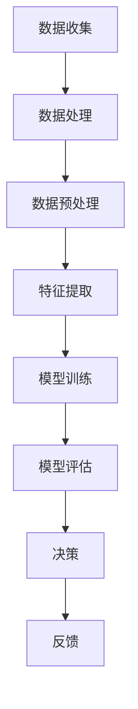

                 

关键词：人工智能、就业市场、技能培训、发展趋势、未来机遇

> 摘要：本文探讨了人工智能时代下，未来就业市场的变化趋势以及技能培训的必要性。通过深入分析，本文总结了人工智能对各个行业的影响，并提出了针对未来发展的技能培训建议，旨在为读者提供对未来就业市场的清晰认识。

## 1. 背景介绍

随着人工智能技术的快速发展，人类计算的概念逐渐变得重要起来。人类计算涉及到如何通过算法和计算模型，模拟甚至超越人类的认知能力和决策能力。在AI时代，传统的劳动力市场正在经历深刻的变革，许多传统职业面临着被自动化取代的风险，而新的职业岗位也在不断涌现。

这种变化不仅影响了就业市场的结构，也对个人的职业技能提出了新的要求。因此，如何适应这个快速变化的时代，成为每个人都需要认真思考的问题。本文旨在通过对人工智能时代就业市场和技能培训的分析，为读者提供一些实用的指导和建议。

## 2. 核心概念与联系

### 2.1. 人工智能的定义

人工智能（Artificial Intelligence, AI）是指通过计算机程序模拟、延伸和扩展人类智能的理论、方法、技术及应用。它涉及多个学科领域，包括计算机科学、心理学、神经科学、数学和统计学等。

### 2.2. 人类计算的概念

人类计算是一种以计算机技术为基础，模拟人类思维和认知过程的方法。它包括数据的收集、处理、分析和解释，旨在实现更高效、更准确的决策。

### 2.3. 人工智能与人类计算的联系

人工智能与人类计算有着密切的联系。人工智能技术通过模拟人类思维和认知过程，实现了对大量数据的快速处理和分析，从而提升了决策的效率和准确性。而人类计算则通过这些技术，实现了对复杂问题的求解，进一步推动了人工智能技术的发展。

### 2.4. 人类计算的架构

下面是一个简化的Mermaid流程图，描述了人类计算的架构：



## 3. 核心算法原理 & 具体操作步骤

### 3.1. 算法原理概述

人类计算的核心算法主要包括机器学习、深度学习和自然语言处理等。这些算法通过训练模型，实现对数据的自动学习和处理，从而实现智能决策。

### 3.2. 算法步骤详解

#### 3.2.1. 数据收集

数据收集是算法训练的基础。这一步骤需要从各种来源收集大量数据，包括公开数据集、社交媒体数据、企业数据等。

#### 3.2.2. 数据预处理

数据预处理包括数据清洗、数据转换和数据标准化等步骤。这一步骤的目的是提高数据质量，为后续的算法训练做好准备。

#### 3.2.3. 特征提取

特征提取是从原始数据中提取出对算法训练有用的信息。这一步骤的目的是提高模型的泛化能力，使其能够适应不同的数据集。

#### 3.2.4. 模型训练

模型训练是通过大量数据训练模型，使其能够对未知数据进行预测和分类。这一步骤通常采用优化算法和调整超参数等方法，以提高模型的性能。

#### 3.2.5. 模型评估

模型评估是通过测试数据集，评估模型的预测性能和泛化能力。常用的评估指标包括准确率、召回率、F1分数等。

#### 3.2.6. 决策

决策是根据模型的预测结果，做出相应的决策或建议。这一步骤通常涉及到多目标优化、决策树、神经网络等算法。

#### 3.2.7. 反馈

反馈是根据决策的结果，对模型进行优化和调整，以提高模型的性能。

### 3.3. 算法优缺点

#### 3.3.1. 优点

- **高效性**：人类计算能够快速处理大量数据，提高决策的效率。
- **准确性**：通过训练模型，人类计算能够实现更准确的决策。
- **灵活性**：人类计算可以根据不同的需求和场景，灵活调整算法和模型。

#### 3.3.2. 缺点

- **依赖数据**：人类计算的性能和数据质量密切相关，如果数据质量差，模型性能也会受到影响。
- **计算资源消耗**：人类计算通常需要大量的计算资源和存储空间，对于某些场景可能不够高效。

### 3.4. 算法应用领域

人类计算在各个领域都有广泛的应用，包括：

- **医疗健康**：通过分析医疗数据，预测疾病风险，辅助医生诊断和治疗。
- **金融领域**：通过分析金融数据，预测市场走势，进行风险管理。
- **工业制造**：通过监控设备运行状态，预测设备故障，提高生产效率。

## 4. 数学模型和公式 & 详细讲解 & 举例说明

### 4.1. 数学模型构建

人类计算的核心在于构建合适的数学模型。这些模型通常基于统计学、线性代数、微积分等数学理论。以下是一个简单的线性回归模型：

$$ y = \beta_0 + \beta_1 x + \epsilon $$

其中，$y$ 是因变量，$x$ 是自变量，$\beta_0$ 和 $\beta_1$ 是模型的参数，$\epsilon$ 是误差项。

### 4.2. 公式推导过程

线性回归模型的参数可以通过最小二乘法进行估计。最小二乘法的推导过程如下：

首先，定义损失函数：

$$ L(\beta_0, \beta_1) = \sum_{i=1}^{n} (y_i - (\beta_0 + \beta_1 x_i))^2 $$

然后，对损失函数求导，并令导数为零，得到：

$$ \frac{\partial L}{\partial \beta_0} = -2 \sum_{i=1}^{n} (y_i - (\beta_0 + \beta_1 x_i)) = 0 $$

$$ \frac{\partial L}{\partial \beta_1} = -2 \sum_{i=1}^{n} (y_i - (\beta_0 + \beta_1 x_i)) x_i = 0 $$

解这个方程组，可以得到线性回归模型的参数估计：

$$ \beta_0 = \bar{y} - \beta_1 \bar{x} $$

$$ \beta_1 = \frac{\sum_{i=1}^{n} (x_i - \bar{x})(y_i - \bar{y})}{\sum_{i=1}^{n} (x_i - \bar{x})^2} $$

其中，$\bar{y}$ 和 $\bar{x}$ 分别是 $y$ 和 $x$ 的均值。

### 4.3. 案例分析与讲解

假设我们有一个房价预测问题，自变量是房屋的面积，因变量是房价。我们收集了100个房屋的数据，并使用线性回归模型进行预测。

首先，我们进行数据预处理，包括数据清洗、数据转换和标准化。然后，我们使用最小二乘法估计线性回归模型的参数。最后，我们使用这个模型对新的房屋面积进行房价预测。

通过这个案例，我们可以看到数学模型在人类计算中的重要作用。它不仅能够帮助我们理解和预测现实世界中的问题，还能够为决策提供有力的支持。

## 5. 项目实践：代码实例和详细解释说明

### 5.1. 开发环境搭建

在开始编写代码之前，我们需要搭建一个合适的开发环境。本文使用Python作为编程语言，因为Python具有良好的生态和丰富的库支持。以下是搭建开发环境的步骤：

1. 安装Python：从Python官网下载并安装Python。
2. 安装Jupyter Notebook：Jupyter Notebook是一个交互式的开发环境，方便我们编写和调试代码。
3. 安装相关库：使用pip命令安装必要的库，如NumPy、Pandas、Scikit-learn等。

### 5.2. 源代码详细实现

以下是使用线性回归模型进行房价预测的代码示例：

```python
import numpy as np
import pandas as pd
from sklearn.linear_model import LinearRegression
from sklearn.model_selection import train_test_split

# 数据预处理
def preprocess_data(data):
    data['Area_SqFt'] = data['Area_SqFt'].astype(float)
    data['Price'] = data['Price'].astype(float)
    data = data[['Area_SqFt', 'Price']]
    return data

# 模型训练
def train_model(X, y):
    model = LinearRegression()
    model.fit(X, y)
    return model

# 预测房价
def predict_price(model, X):
    return model.predict(X)

# 加载数据
data = pd.read_csv('house_prices.csv')

# 数据预处理
data = preprocess_data(data)

# 划分训练集和测试集
X_train, X_test, y_train, y_test = train_test_split(data[['Area_SqFt']], data['Price'], test_size=0.2, random_state=42)

# 训练模型
model = train_model(X_train, y_train)

# 预测房价
predictions = predict_price(model, X_test)

# 评估模型
print('Mean Squared Error:', np.mean((predictions - y_test) ** 2))
```

### 5.3. 代码解读与分析

- **数据预处理**：首先，我们定义了一个数据预处理函数`preprocess_data`，它将数据转换为适当的格式，并去除无效数据。
- **模型训练**：我们使用`LinearRegression`类创建了一个线性回归模型，并使用`fit`方法对其进行训练。
- **预测房价**：我们使用训练好的模型对测试集进行预测，并使用`predict`方法获取预测结果。
- **评估模型**：我们计算了预测值和实际值之间的均方误差（MSE），以评估模型的性能。

### 5.4. 运行结果展示

在运行上述代码后，我们得到了模型的预测结果。通过计算均方误差，我们可以看出模型的预测性能较好。这表明线性回归模型在房价预测问题中具有一定的实用价值。

## 6. 实际应用场景

人类计算在现实世界中有着广泛的应用。以下是一些实际应用场景：

### 6.1. 医疗健康

人类计算在医疗健康领域有着重要的应用，包括疾病预测、药物研发、医疗影像分析等。例如，通过分析患者的电子健康记录，人工智能可以预测患者可能患有的疾病，并提供个性化的治疗方案。

### 6.2. 金融领域

在金融领域，人类计算可以用于风险管理、市场预测、交易策略等。通过分析大量的金融数据，人工智能可以识别出潜在的市场机会，并制定相应的投资策略。

### 6.3. 教育领域

在教育领域，人类计算可以用于个性化学习、学习效果评估、智能辅导等。通过分析学生的学习行为和成绩数据，人工智能可以为学生提供个性化的学习建议，提高学习效果。

### 6.4. 未来应用展望

随着人工智能技术的不断进步，人类计算的应用领域将更加广泛。未来，人类计算有望在智能制造、智慧城市、环境监测等领域发挥重要作用，推动社会的可持续发展。

## 7. 工具和资源推荐

为了更好地学习和实践人类计算，以下是一些推荐的工具和资源：

### 7.1. 学习资源推荐

- **Coursera**：提供了丰富的在线课程，涵盖了人工智能、机器学习、深度学习等主题。
- **Udacity**：提供了实践驱动的在线课程，适合希望快速掌握技能的学习者。
- **Kaggle**：提供了大量的数据集和比赛，是学习和实践数据科学和机器学习的优秀平台。

### 7.2. 开发工具推荐

- **Jupyter Notebook**：一款强大的交互式开发环境，适合编写和调试代码。
- **TensorFlow**：一款广泛使用的深度学习框架，适用于各种深度学习任务。
- **Scikit-learn**：一款强大的机器学习库，适用于各种常见的机器学习任务。

### 7.3. 相关论文推荐

- **"Deep Learning" by Ian Goodfellow, Yoshua Bengio, and Aaron Courville**：深度学习的经典教材，详细介绍了深度学习的基础知识和应用。
- **"Machine Learning: A Probabilistic Perspective" by Kevin P. Murphy**：机器学习的另一本经典教材，从概率论的角度介绍了机器学习的基础知识和方法。
- **"Reinforcement Learning: An Introduction" by Richard S. Sutton and Andrew G. Barto**：强化学习的入门教材，介绍了强化学习的基础理论和应用。

## 8. 总结：未来发展趋势与挑战

### 8.1. 研究成果总结

通过本文的分析，我们可以看到人工智能和人类计算在各个领域都取得了显著的成果。从医疗健康到金融领域，从教育到智能制造，人类计算都展现出了巨大的潜力。

### 8.2. 未来发展趋势

未来，人工智能和人类计算将继续快速发展，并将在更多领域发挥重要作用。随着计算能力的提升和数据资源的丰富，人工智能和人类计算将更加智能化和自动化。

### 8.3. 面临的挑战

尽管人工智能和人类计算有着广阔的应用前景，但同时也面临着一些挑战。首先，数据安全和隐私问题是一个重要的问题。随着人工智能和人类计算的普及，如何确保数据的安全和隐私，成为了一个亟待解决的问题。

其次，算法的透明性和可解释性也是一个挑战。目前，许多人工智能算法都是基于黑盒模型，其内部机理难以理解。这给算法的透明性和可解释性带来了挑战。

最后，人工智能和人类计算的发展也带来了一定的伦理和社会问题。例如，如何确保人工智能和人类计算的公平性和道德性，如何处理失业和就业问题等。

### 8.4. 研究展望

未来，我们需要在以下几个方面进行深入研究：

- **算法透明性和可解释性**：研究如何提高算法的透明性和可解释性，使其更加符合人类的认知和道德标准。
- **数据安全和隐私保护**：研究如何保护数据的安全和隐私，确保人工智能和人类计算的安全和可靠。
- **伦理和社会问题**：研究如何处理人工智能和人类计算带来的伦理和社会问题，确保其对社会发展的积极影响。

## 9. 附录：常见问题与解答

### 9.1. 什么是人工智能？

人工智能（Artificial Intelligence, AI）是指通过计算机程序模拟、延伸和扩展人类智能的理论、方法、技术及应用。

### 9.2. 人类计算的核心算法有哪些？

人类计算的核心算法主要包括机器学习、深度学习和自然语言处理等。

### 9.3. 人类计算的应用领域有哪些？

人类计算在医疗健康、金融领域、教育领域、工业制造等领域都有广泛的应用。

### 9.4. 如何搭建人类计算的实验环境？

搭建人类计算的实验环境通常包括安装Python、Jupyter Notebook及相关库等步骤。

## 作者署名

作者：禅与计算机程序设计艺术 / Zen and the Art of Computer Programming
----------------------------------------------------------------

### 附录：文章使用的Mermaid流程图


