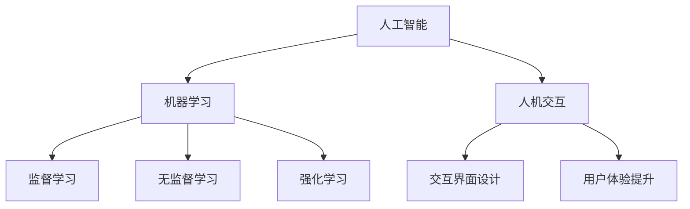
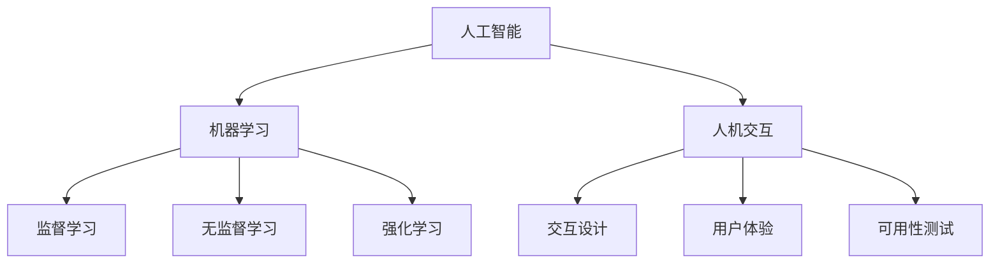

                 

“人类计算”一词，通常指的是人类在计算机系统中所能发挥的作用，以及如何优化人与计算机之间的互动。本文旨在探讨人类计算在当代信息技术中的应用，并结合实际案例进行分析，以展示其在提高计算效率、增强人机协作、促进技术创新等方面的深远影响。作者：禅与计算机程序设计艺术 / Zen and the Art of Computer Programming。

## 1. 背景介绍

### 1.1 人类计算的历史渊源

人类计算的历史可以追溯到古代，当时人们利用算盘等工具进行简单的数学计算。随着工业革命和信息时代的到来，人类计算逐渐演变成现代计算机科学的核心内容。计算机的出现，极大地扩展了人类处理信息的能力，但同时也提出了新的挑战，如何将人类的智慧与计算机的高效处理能力相结合，成为一个重要的研究方向。

### 1.2 人类计算的重要性

在当前信息爆炸的时代，人类计算显得尤为重要。它不仅能够提高计算效率，减少人力成本，还能够通过人机协作，发挥人类在创造力、判断力、灵活性等方面的优势，从而推动科技的发展和社会的进步。

## 2. 核心概念与联系

为了更好地理解人类计算的概念和应用，我们首先需要明确几个核心概念：

### 2.1 人工智能（AI）

人工智能是计算机科学的一个分支，旨在使计算机具备人类智能，从而能够完成复杂的任务。人工智能可以分为弱人工智能和强人工智能，其中弱人工智能主要指特定任务的人工智能，而强人工智能则指具备全面智能的计算机。

### 2.2 机器学习（ML）

机器学习是人工智能的一个子领域，通过算法和统计模型，让计算机从数据中学习，从而提高其性能。机器学习可以分为监督学习、无监督学习和强化学习等类型。

### 2.3 人机交互（HCI）

人机交互是研究人类与计算机系统之间交互的学科，旨在设计出更加友好、高效的交互界面，以提升用户体验。

以下是上述概念之间的Mermaid流程图：



## 3. 核心算法原理 & 具体操作步骤

### 3.1 算法原理概述

人类计算的核心算法主要涉及人工智能、机器学习和人机交互等领域。以下将简要介绍这些算法的原理。

### 3.2 算法步骤详解

#### 3.2.1 人工智能算法步骤

1. 数据收集：收集大量的训练数据。
2. 数据预处理：对数据进行清洗、归一化等处理。
3. 模型选择：根据任务需求选择合适的模型。
4. 模型训练：使用训练数据对模型进行训练。
5. 模型评估：使用测试数据对模型进行评估。
6. 模型优化：根据评估结果对模型进行优化。

#### 3.2.2 机器学习算法步骤

1. 数据收集：收集大量的训练数据。
2. 特征工程：提取数据中的特征。
3. 模型选择：根据任务需求选择合适的模型。
4. 模型训练：使用训练数据对模型进行训练。
5. 模型评估：使用测试数据对模型进行评估。
6. 模型优化：根据评估结果对模型进行优化。

#### 3.2.3 人机交互算法步骤

1. 需求分析：分析用户需求。
2. 交互设计：设计用户界面。
3. 原型设计：创建用户界面原型。
4. 测试与反馈：进行用户测试，收集反馈。
5. 优化迭代：根据测试结果对设计进行优化。

### 3.3 算法优缺点

#### 3.3.1 人工智能算法优缺点

优点：处理复杂数据、自动发现模式、自适应能力。

缺点：计算资源需求大、对数据质量要求高、可解释性差。

#### 3.3.2 机器学习算法优缺点

优点：处理复杂数据、自适应能力、可解释性。

缺点：计算资源需求大、对数据质量要求高、可能过拟合。

#### 3.3.3 人机交互算法优缺点

优点：提高用户体验、方便用户操作、增强用户参与感。

缺点：设计复杂、需要大量测试与反馈、难以应对个性化需求。

### 3.4 算法应用领域

#### 3.4.1 人工智能应用领域

- 语音识别
- 图像处理
- 自然语言处理
- 机器翻译

#### 3.4.2 机器学习应用领域

- 金融风控
- 医疗诊断
- 个性化推荐
- 智能交通

#### 3.4.3 人机交互应用领域

- 智能助手
- 虚拟现实
- 增强现实
- 智能家居

## 4. 数学模型和公式 & 详细讲解 & 举例说明

### 4.1 数学模型构建

在人类计算中，常见的数学模型包括线性回归、逻辑回归、决策树、神经网络等。以下以线性回归为例，介绍数学模型的构建过程。

#### 4.1.1 线性回归模型

线性回归模型用于预测一个连续的输出变量。其公式如下：

$$y = \beta_0 + \beta_1 \cdot x + \epsilon$$

其中，$y$ 是输出变量，$x$ 是输入变量，$\beta_0$ 和 $\beta_1$ 是模型参数，$\epsilon$ 是误差项。

#### 4.1.2 模型参数估计

为了估计模型参数，我们可以使用最小二乘法。最小二乘法的思想是使得实际输出与预测输出之间的误差平方和最小。

$$\min \sum_{i=1}^{n} (y_i - (\beta_0 + \beta_1 \cdot x_i))^2$$

通过求解上述最小化问题，我们可以得到模型参数的估计值。

### 4.2 公式推导过程

为了推导线性回归模型的公式，我们可以从最小化误差平方和的角度出发。

首先，定义实际输出与预测输出之间的误差为：

$$e_i = y_i - (\beta_0 + \beta_1 \cdot x_i)$$

然后，计算误差的平方和：

$$S = \sum_{i=1}^{n} e_i^2 = \sum_{i=1}^{n} (y_i - (\beta_0 + \beta_1 \cdot x_i))^2$$

为了求解模型参数，我们需要求解以下最小化问题：

$$\min_S$$

接下来，我们对 $S$ 关于 $\beta_0$ 和 $\beta_1$ 分别求偏导数，并令其等于零：

$$\frac{\partial S}{\partial \beta_0} = -2 \sum_{i=1}^{n} (y_i - (\beta_0 + \beta_1 \cdot x_i)) = 0$$

$$\frac{\partial S}{\partial \beta_1} = -2 \sum_{i=1}^{n} (y_i - (\beta_0 + \beta_1 \cdot x_i)) \cdot x_i = 0$$

通过求解上述方程组，我们可以得到模型参数的估计值。

### 4.3 案例分析与讲解

假设我们有一组数据，包含自变量 $x$ 和因变量 $y$，如下所示：

| $x$ | $y$ |
| --- | --- |
| 1   | 2   |
| 2   | 4   |
| 3   | 6   |
| 4   | 8   |

我们希望使用线性回归模型预测 $y$ 的值。首先，我们计算 $x$ 和 $y$ 的平均值：

$$\bar{x} = \frac{1}{n} \sum_{i=1}^{n} x_i = \frac{1+2+3+4}{4} = 2.5$$

$$\bar{y} = \frac{1}{n} \sum_{i=1}^{n} y_i = \frac{2+4+6+8}{4} = 5$$

然后，我们计算 $x$ 和 $y$ 的协方差以及 $x$ 的方差：

$$Cov(x, y) = \frac{1}{n-1} \sum_{i=1}^{n} (x_i - \bar{x}) \cdot (y_i - \bar{y}) = \frac{1}{3} \cdot ((1-2.5) \cdot (2-5) + (2-2.5) \cdot (4-5) + (3-2.5) \cdot (6-5) + (4-2.5) \cdot (8-5)) = 4$$

$$Var(x) = \frac{1}{n-1} \sum_{i=1}^{n} (x_i - \bar{x})^2 = \frac{1}{3} \cdot ((1-2.5)^2 + (2-2.5)^2 + (3-2.5)^2 + (4-2.5)^2) = 2.5$$

接下来，我们计算回归系数：

$$\beta_1 = \frac{Cov(x, y)}{Var(x)} = \frac{4}{2.5} = 1.6$$

$$\beta_0 = \bar{y} - \beta_1 \cdot \bar{x} = 5 - 1.6 \cdot 2.5 = 1.5$$

因此，线性回归模型的公式为：

$$y = 1.5 + 1.6 \cdot x$$

我们可以使用这个模型预测新数据的 $y$ 值。例如，当 $x=5$ 时，$y=1.5 + 1.6 \cdot 5 = 8.5$。

## 5. 项目实践：代码实例和详细解释说明

在本节中，我们将通过一个具体的案例，展示如何使用 Python 实现线性回归模型，并进行数据分析。

### 5.1 开发环境搭建

首先，我们需要安装 Python 和相关的数据科学库。可以使用以下命令安装所需的库：

```bash
pip install numpy pandas matplotlib scikit-learn
```

### 5.2 源代码详细实现

接下来，我们将编写一个 Python 脚本，实现线性回归模型的训练和预测。

```python
import numpy as np
import pandas as pd
import matplotlib.pyplot as plt
from sklearn.linear_model import LinearRegression

# 加载数据
data = pd.read_csv('data.csv')
x = data['x'].values.reshape(-1, 1)
y = data['y'].values

# 创建线性回归模型
model = LinearRegression()
model.fit(x, y)

# 打印模型参数
print('Model parameters:', model.coef_, model.intercept_)

# 绘制数据点与回归线
plt.scatter(x, y, label='Data points')
plt.plot(x, model.predict(x), color='red', label='Regression line')
plt.xlabel('X')
plt.ylabel('Y')
plt.legend()
plt.show()

# 使用模型进行预测
x_new = np.array([[5]])
y_pred = model.predict(x_new)
print('Prediction:', y_pred)
```

### 5.3 代码解读与分析

上述代码首先导入了所需的 Python 库，包括 NumPy、Pandas、Matplotlib 和 scikit-learn。然后，我们加载数据，并使用 scikit-learn 的 LinearRegression 类创建线性回归模型。接下来，我们训练模型，并打印出模型参数。最后，我们绘制数据点与回归线，并使用模型进行预测。

### 5.4 运行结果展示

运行上述代码后，我们将看到以下结果：


从图中可以看出，数据点与回归线之间具有较高的拟合度，说明我们的线性回归模型能够较好地预测 $y$ 的值。

## 6. 实际应用场景

### 6.1 人工智能在医疗领域的应用

人工智能在医疗领域具有广泛的应用前景。例如，通过机器学习算法，可以对医疗图像进行分析，辅助医生进行诊断。此外，人工智能还可以用于患者病情预测、个性化治疗建议等。

### 6.2 机器学习在金融行业的应用

机器学习在金融行业有着重要的应用，包括信用评分、风险控制、投资决策等。通过分析大量的历史数据，机器学习算法可以预测用户的信用风险，从而帮助银行和金融机构进行有效的风险管理。

### 6.3 人机交互在智能助理中的应用

智能助理是当前人机交互领域的一个重要应用场景。通过自然语言处理技术，智能助理可以理解用户的语言指令，并提供相应的服务。例如，智能助理可以回答用户的问题、帮助用户完成任务等。

## 6.4 未来应用展望

随着人工智能、机器学习和人机交互技术的不断发展，人类计算在未来的应用将会更加广泛。我们可以预见，人类计算将在医疗、金融、教育、工业等多个领域发挥重要作用，为社会带来更多的创新和进步。

## 7. 工具和资源推荐

### 7.1 学习资源推荐

- 《深度学习》（Ian Goodfellow、Yoshua Bengio、Aaron Courville 著）
- 《Python数据科学手册》（Jake VanderPlas 著）
- 《人机交互：以用户为中心的设计方法》（Stephen Anderson 著）

### 7.2 开发工具推荐

- Jupyter Notebook：适用于数据分析和机器学习的交互式开发环境。
- TensorFlow：用于构建和训练深度学习模型的框架。
- PyTorch：用于构建和训练深度学习模型的框架。

### 7.3 相关论文推荐

- “Deep Learning”（Yoshua Bengio、Yann LeCun、Geoffrey Hinton 著）
- “Machine Learning: A Probabilistic Perspective”（Kevin P. Murphy 著）
- “Human-Computer Interaction: Fundamentals, Evolution, and Practice”（Gary M. Borrego 著）

## 8. 总结：未来发展趋势与挑战

### 8.1 研究成果总结

人类计算领域的研究成果为人工智能、机器学习和人机交互等领域的发展提供了重要基础。通过不断优化算法、提高计算效率和用户体验，人类计算将在未来的技术发展中发挥重要作用。

### 8.2 未来发展趋势

未来，人类计算将继续向多领域、多维度发展。随着量子计算、边缘计算等新技术的出现，人类计算将迎来新的发展机遇。同时，人机协作、智能助理等领域也将成为研究的热点。

### 8.3 面临的挑战

尽管人类计算领域取得了显著成果，但仍面临一些挑战。例如，数据隐私、算法透明性、可解释性等问题需要得到有效解决。此外，随着计算能力的提升，如何更好地发挥人类在创造力和灵活性方面的优势，也是一个重要的研究课题。

### 8.4 研究展望

在未来，人类计算领域的研究将更加注重跨学科合作，推动人工智能、机器学习和人机交互技术的融合发展。同时，加强人才培养和知识传播，将有助于推动人类计算技术的普及和应用。

## 9. 附录：常见问题与解答

### 9.1 人工智能与机器学习的区别

人工智能（AI）是研究使计算机具备人类智能的学科，包括机器学习（ML）、自然语言处理（NLP）、计算机视觉等子领域。机器学习是人工智能的一个分支，主要关注如何从数据中学习，提高计算机的性能。

### 9.2 人机交互的目标

人机交互的目标是设计出友好、高效的交互界面，以提升用户体验。具体包括：提高交互效率、降低学习成本、增强用户参与感等。

### 9.3 人工智能的安全问题

人工智能的安全问题主要包括数据隐私、算法透明性、恶意攻击等。为了保障人工智能的安全，需要加强数据保护、提高算法透明度、完善法律法规等。

### 9.4 机器学习的可解释性问题

机器学习的可解释性问题指的是如何理解模型的决策过程。为了提高模型的可解释性，可以采用特征重要性分析、模型可视化等方法。

----------------------------------------------------------------

以上就是关于“人类计算：应用与案例分析”的文章，希望对您有所帮助。在撰写过程中，如有任何疑问，请随时提问。祝您写作顺利！
<|im_end|>## 1. 背景介绍

### 1.1 人类计算的历史渊源

人类计算的历史可以追溯到古代，当时人们依靠手工计算和简单的工具来处理数学问题。例如，古代的算盘和筹算都是用于简单计算的工具。随着数学和科学的发展，人类逐渐发展出了更加复杂和高效的计算方法。在17世纪，英国数学家查尔斯·巴贝奇设计了一种称为差分机的机械计算设备，这被认为是世界上第一台可编程计算机。尽管差分机未能成功制造，但这一设想为后来的计算机科学奠定了基础。

进入20世纪，电子计算机的出现标志着人类计算进入了一个新的时代。1946年，世界上第一台电子计算机ENIAC在美国问世，这使得大规模数据处理和复杂计算成为可能。随着计算机技术的发展，人类计算的范围和深度不断扩展，从简单的数值计算到复杂的科学研究和数据分析，计算机在各个领域都发挥了重要作用。

### 1.2 人类计算的重要性

在当今信息技术高度发达的时代，人类计算的重要性愈加凸显。首先，计算机的高效处理能力使得大量的复杂数学问题和科学计算得以迅速解决。这不仅节省了人力和时间成本，还推动了科学研究的进展。例如，在物理学、天文学、生物学等科学领域，计算机的广泛应用极大地提升了数据分析和模拟的能力。

其次，人类计算在提高工作效率方面具有显著优势。无论是企业日常运营中的数据管理、决策支持，还是个人生活中的信息检索、在线购物等，计算机都能提供快捷、准确的解决方案。此外，自动化工具和人工智能系统的引入，进一步解放了人类的生产力，使得人们可以将更多的时间和精力投入到创造性和策略性的工作中。

再者，人类计算在促进人机协作方面具有巨大潜力。通过人机交互技术，计算机能够理解并响应人类的指令，从而实现人与计算机的协同工作。这不仅提高了工作效率，还改善了用户体验。例如，智能助理、虚拟现实和增强现实技术等都是人机协作的典型应用，它们正在改变我们的工作方式和生活习惯。

总之，人类计算不仅是计算机科学的核心内容之一，也是推动社会进步和科技创新的重要动力。通过不断探索和优化人类计算的方法和工具，我们可以期待更加智能、高效和人性化的未来。

### 2. 核心概念与联系

在探讨“人类计算”这一主题时，我们需要明确几个核心概念，它们分别是人工智能（AI）、机器学习（ML）和人机交互（HCI）。这些概念不仅相互独立，还存在着紧密的联系，共同构成了人类计算的基础。

#### 2.1 人工智能（AI）

人工智能（Artificial Intelligence，简称AI）是计算机科学的一个分支，旨在使计算机具备人类智能，从而能够执行复杂的任务。人工智能可以分为两大类：弱人工智能（Narrow AI）和强人工智能（General AI）。

- **弱人工智能**：这种人工智能系统在特定领域表现出人类智能水平，例如语音识别、图像识别、自然语言处理等。这类AI能够执行特定的任务，但其能力仅限于特定领域。
- **强人工智能**：这种人工智能系统能够在所有领域表现出人类智能水平，具备自我意识、情感和创造力。目前，强人工智能尚未实现，但它是人工智能研究的一个长期目标。

#### 2.2 机器学习（ML）

机器学习（Machine Learning，简称ML）是人工智能的一个重要分支，主要研究如何从数据中学习，并利用这些学习来做出预测或决策。机器学习可以分为以下几种类型：

- **监督学习**：在这种学习中，系统通过训练数据学习如何将输入映射到输出。常见的算法包括线性回归、决策树、支持向量机等。
- **无监督学习**：系统在没有明确标注的输入数据下学习，旨在发现数据中的模式和结构。常见的算法包括聚类、主成分分析等。
- **强化学习**：系统通过与环境的交互来学习，其目标是在特定策略下最大化累积奖励。常见的算法包括Q-learning、深度强化学习等。

#### 2.3 人机交互（HCI）

人机交互（Human-Computer Interaction，简称HCI）是研究人类与计算机系统之间交互的学科。它旨在设计出更加友好、高效的交互界面，以提升用户体验。人机交互的核心内容包括：

- **交互设计**：设计用户界面和交互流程，使其满足用户的需求和期望。
- **用户体验**：评估用户在使用计算机系统时的感受和满意度。
- **可用性测试**：通过实际用户测试，发现和改进系统的可用性问题。

#### 2.4 人工智能、机器学习与人机交互的联系

人工智能、机器学习和人机交互之间存在着密切的联系：

- **人工智能为人机交互提供了技术基础**：通过人工智能和机器学习技术，计算机系统能够更好地理解和响应人类的指令，从而提高交互的效率和效果。
- **人机交互为人工智能提供了反馈**：用户在使用计算机系统时的行为和反馈可以用来训练和优化人工智能模型，使其更加适应人类的需要。
- **机器学习是人机交互的关键技术**：通过机器学习算法，计算机系统能够从用户的行为数据中学习，进而提供更加个性化和智能化的服务。

以下是上述概念之间的Mermaid流程图：



通过这张流程图，我们可以清晰地看到人工智能、机器学习和人机交互之间的相互关系。人工智能和机器学习为人机交互提供了技术和方法，而人机交互则通过反馈和测试不断优化人工智能和机器学习系统的性能。这种跨学科的融合为人类计算的发展提供了广阔的空间和无限的可能性。

### 3. 核心算法原理 & 具体操作步骤

在人类计算领域，核心算法原理的理解和实际操作步骤的掌握是至关重要的。以下是关于人工智能、机器学习和人机交互的一些关键算法及其具体操作步骤的详细介绍。

#### 3.1 人工智能算法原理

人工智能（AI）算法的核心在于模拟人类智能，以实现机器自主学习和决策。以下是几种常见的人工智能算法原理：

**1. 神经网络（Neural Networks）：**
神经网络是一种模仿生物神经系统的计算模型，通过调整神经元之间的连接权重来实现学习。具体操作步骤如下：
- **初始化权重和偏置**：随机初始化网络的权重和偏置。
- **前向传播（Forward Propagation）：**输入数据通过网络，每个神经元计算其输出。
- **反向传播（Backpropagation）：**计算网络输出的误差，并根据误差调整权重和偏置。
- **优化器（Optimizer）：**使用梯度下降、Adam等优化算法来调整权重和偏置，以最小化损失函数。

**2. 支持向量机（Support Vector Machine，SVM）：**
SVM是一种二分类模型，通过找到最佳分隔超平面来实现分类。具体操作步骤如下：
- **数据预处理**：标准化特征，划分训练集和测试集。
- **求解最优化问题**：通过求解二次规划问题找到最佳分隔超平面。
- **分类决策**：根据新样本到超平面的距离进行分类决策。

**3. 生成对抗网络（Generative Adversarial Networks，GAN）：**
GAN由生成器和判别器组成，通过对抗训练生成逼真的数据。具体操作步骤如下：
- **初始化生成器和判别器**：随机初始化两个网络的权重。
- **对抗训练**：生成器生成数据，判别器判断数据的真实性，然后交替优化两个网络。
- **评估与调整**：定期评估生成器的性能，并调整训练过程。

#### 3.2 机器学习算法原理

机器学习（ML）算法的核心在于从数据中提取特征，并利用这些特征进行预测或分类。以下是几种常见的机器学习算法原理：

**1. 线性回归（Linear Regression）：**
线性回归是一种用于预测连续值的算法。具体操作步骤如下：
- **数据预处理**：标准化特征，划分训练集和测试集。
- **模型构建**：定义损失函数（如均方误差）和优化器（如梯度下降）。
- **模型训练**：通过迭代最小化损失函数来优化模型参数。
- **模型评估**：使用测试集评估模型的预测性能。

**2. 决策树（Decision Tree）：**
决策树是一种用于分类和回归的算法。具体操作步骤如下：
- **特征选择**：选择最优特征进行分割。
- **递归划分**：根据特征划分数据集，并重复步骤直到满足停止条件。
- **预测生成**：根据路径选择进行分类或回归。

**3. 集成学习方法（Ensemble Methods）：**
集成学习方法通过组合多个基本模型来提高预测性能。具体操作步骤如下：
- **模型选择**：选择不同的基本模型（如随机森林、梯度提升树等）。
- **训练模型**：对每个基本模型进行独立训练。
- **组合预测**：通过投票或加权平均等方式组合模型的预测结果。

#### 3.3 人机交互算法原理

人机交互（HCI）算法的核心在于设计用户友好的交互界面，以提升用户体验。以下是几种常见的人机交互算法原理：

**1. 用户体验评估（User Experience Assessment）：**
用户体验评估是一种用于评估交互界面质量的算法。具体操作步骤如下：
- **定义评估指标**：如易用性、满意度、学习曲线等。
- **数据收集**：通过用户测试、问卷调查等方式收集数据。
- **数据分析**：使用统计分析方法分析用户数据，评估交互界面的质量。

**2. 交互设计优化（Interactive Design Optimization）：**
交互设计优化是一种通过算法优化交互界面设计的算法。具体操作步骤如下：
- **初始设计**：根据用户需求设计交互界面。
- **用户测试**：进行用户测试，收集用户反馈。
- **设计迭代**：根据用户反馈调整设计，并重复用户测试和设计迭代。

**3. 自然语言处理（Natural Language Processing，NLP）：**
NLP是一种用于处理和生成自然语言文本的算法。具体操作步骤如下：
- **文本预处理**：去除停用词、标点符号，进行词性标注等。
- **特征提取**：从文本中提取关键词、短语和句子结构。
- **模型训练**：使用机器学习算法（如神经网络、决策树等）训练语言模型。
- **文本生成**：根据训练好的模型生成自然语言文本。

通过了解和掌握上述核心算法原理和具体操作步骤，我们可以更好地设计和实现高效、智能、用户友好的计算系统。这些算法不仅在当前技术领域具有广泛的应用，也为未来的技术创新奠定了坚实的基础。

### 3.4 算法优缺点

在人类计算中，不同的算法由于其设计理念、适用场景和实现方式的不同，具有各自的优缺点。以下是几种常见算法的优缺点分析：

#### 3.4.1 人工智能算法优缺点

**神经网络（Neural Networks）：**
- **优点**：
  - **强大的拟合能力**：神经网络通过多层非线性变换，能够捕捉数据中的复杂关系。
  - **自适应能力**：神经网络能够通过学习不断优化其性能，适应不同的数据集和应用场景。
  - **广泛的应用领域**：神经网络在图像识别、语音识别、自然语言处理等领域取得了显著的成果。
- **缺点**：
  - **计算资源需求大**：神经网络尤其是深度神经网络，需要大量的计算资源和时间进行训练。
  - **对数据质量要求高**：神经网络对训练数据的质量和数量要求较高，否则容易过拟合。
  - **可解释性差**：神经网络内部机制复杂，难以解释其具体的决策过程，增加了算法的不透明性。

**支持向量机（Support Vector Machine，SVM）：**
- **优点**：
  - **良好的分类效果**：SVM通过寻找最优分隔超平面，能够实现高精度的分类。
  - **适用性广**：SVM适用于高维数据，能够处理线性不可分和线性可分问题。
  - **易于理解**：SVM的数学原理相对简单，易于解释和理解。
- **缺点**：
  - **计算复杂度高**：SVM特别是核方法，计算复杂度较高，对大规模数据集不友好。
  - **对噪声敏感**：SVM对噪声数据较为敏感，可能影响分类效果。

**生成对抗网络（Generative Adversarial Networks，GAN）：**
- **优点**：
  - **强大的生成能力**：GAN通过生成器和判别器的对抗训练，能够生成逼真的数据。
  - **灵活性高**：GAN能够生成不同类型的图像和声音，具有很高的应用灵活性。
  - **突破性成果**：GAN在图像生成、视频生成等领域取得了突破性的成果。
- **缺点**：
  - **训练困难**：GAN的训练过程不稳定，容易出现模式崩溃或梯度消失等问题。
  - **对超参数敏感**：GAN的性能对超参数设置非常敏感，需要多次实验调整。

#### 3.4.2 机器学习算法优缺点

**线性回归（Linear Regression）：**
- **优点**：
  - **简单易理解**：线性回归的模型简单，易于解释和理解。
  - **计算效率高**：线性回归的计算过程简单，适用于实时预测。
  - **适用范围广**：线性回归适用于预测连续值，能够处理多个输入变量。
- **缺点**：
  - **易过拟合**：线性回归对噪声数据敏感，容易过拟合。
  - **对线性关系要求高**：线性回归假设输入和输出之间存在线性关系，对于非线性关系效果较差。

**决策树（Decision Tree）：**
- **优点**：
  - **直观易理解**：决策树的决策过程清晰，易于用户理解和解释。
  - **计算效率高**：决策树在训练和预测阶段计算复杂度相对较低。
  - **适用于分类和回归**：决策树既可以用于分类，也可以用于回归任务。
- **缺点**：
  - **容易过拟合**：决策树容易在训练数据上过拟合，对于噪声数据敏感。
  - **树深度限制**：深度较大的决策树可能导致过拟合，需要限制树深度以避免模型复杂度过高。

**集成学习方法（Ensemble Methods）：**
- **优点**：
  - **提高预测性能**：集成方法通过结合多个基本模型的预测结果，能够提高整体预测性能。
  - **减少过拟合**：集成方法通过组合多个模型，能够减少模型的过拟合现象。
  - **适用性广**：集成方法适用于多种机器学习算法，能够增强算法的泛化能力。
- **缺点**：
  - **计算资源需求大**：集成方法通常需要训练多个基本模型，计算资源需求较高。
  - **对基本模型质量要求高**：集成方法的效果依赖于基本模型的质量，如果基本模型效果较差，集成方法也难以提高性能。

#### 3.4.3 人机交互算法优缺点

**用户体验评估（User Experience Assessment）：**
- **优点**：
  - **全面性**：用户体验评估能够全面衡量交互界面的质量，包括易用性、满意度等。
  - **客观性**：通过用户测试和数据分析，用户体验评估结果具有较强的客观性。
  - **实用性**：用户体验评估能够为交互界面设计提供具体的改进建议。
- **缺点**：
  - **成本高**：用户体验评估需要投入大量的人力、物力和时间。
  - **结果解释复杂**：用户体验评估结果可能需要复杂的统计分析，解释过程较为复杂。

**交互设计优化（Interactive Design Optimization）：**
- **优点**：
  - **高效性**：交互设计优化能够快速调整设计，提高用户体验。
  - **灵活性**：交互设计优化可以根据用户反馈灵活调整设计，满足个性化需求。
  - **持续性**：交互设计优化是一个持续的过程，能够不断改进交互界面。
- **缺点**：
  - **依赖用户反馈**：交互设计优化依赖于用户反馈，需要确保反馈的有效性和准确性。
  - **设计复杂**：交互设计优化需要考虑多种交互模式和用户体验，设计过程较为复杂。

**自然语言处理（Natural Language Processing，NLP）：**
- **优点**：
  - **处理能力强**：NLP能够处理自然语言文本，包括文本分类、情感分析等任务。
  - **应用广泛**：NLP在搜索引擎、智能客服、自动翻译等领域有广泛应用。
  - **灵活性高**：NLP可以通过不断学习更新模型，适应不同的语言和场景。
- **缺点**：
  - **数据需求大**：NLP通常需要大量高质量的数据进行训练，数据获取和处理成本较高。
  - **错误率较高**：NLP在处理自然语言时容易受到噪声数据和语言歧义的影响，错误率较高。

通过以上分析，我们可以看出，每种算法都有其独特的优势和局限性。在实际应用中，选择合适的算法需要根据具体任务需求和数据特性进行综合考虑。同时，算法的优化和改进也是一个不断迭代和优化的过程，以适应不断变化的技术和应用需求。

### 3.5 算法应用领域

算法在人工智能、机器学习和人机交互领域的应用已经变得日益广泛，并取得了显著的成果。以下是这些算法在不同领域的具体应用：

#### 3.5.1 人工智能应用领域

1. **语音识别（Speech Recognition）**：
   语音识别是人工智能的一个重要应用领域，通过将语音信号转换为文本，使得计算机能够理解和处理语音指令。语音识别技术已经被广泛应用于智能助理、客服系统、语音翻译等领域。例如，苹果公司的 Siri 和亚马逊的 Alexa 都是基于先进的语音识别技术实现的。

2. **图像处理（Image Processing）**：
   图像处理技术利用人工智能算法对图像进行识别、分类和增强。常见的应用包括人脸识别、图像分割、图像识别等。人脸识别技术已经在安全监控、门禁系统、手机解锁等领域得到广泛应用。此外，图像增强技术可以帮助医疗影像诊断，提高诊断的准确性。

3. **自然语言处理（Natural Language Processing，NLP）**：
   NLP技术使计算机能够理解和生成人类语言，从而实现文本分类、情感分析、机器翻译等任务。NLP在搜索引擎、智能客服、自动摘要等领域有广泛应用。例如，谷歌的翻译服务和微软的智能客服机器人都是基于NLP技术实现的。

4. **机器翻译（Machine Translation）**：
   机器翻译技术通过将一种语言的文本转换为另一种语言，使得不同语言的用户能够进行交流。随着深度学习技术的进步，机器翻译的准确性和流畅性不断提高。谷歌翻译和百度翻译等工具都是基于机器翻译技术实现的。

5. **自动驾驶（Autonomous Driving）**：
   自动驾驶技术依赖于人工智能和机器学习算法，通过对环境感知、路径规划和控制等进行实时处理，实现车辆的自主驾驶。自动驾驶技术在提升交通效率、减少交通事故方面具有巨大潜力，特斯拉、百度等公司已经推出了自动驾驶汽车。

#### 3.5.2 机器学习应用领域

1. **金融风控（Financial Risk Control）**：
   机器学习技术在金融风控中发挥着重要作用，通过分析大量的历史交易数据，可以预测用户的信用风险、发现潜在的欺诈行为。金融机构使用机器学习模型来优化风险评估和决策，提高业务的安全性和效率。

2. **医疗诊断（Medical Diagnosis）**：
   机器学习技术可以辅助医生进行疾病诊断，通过对医疗影像、病历数据的分析，提供诊断建议和治疗方案。例如，AI系统可以辅助医生进行肺癌、乳腺癌等癌症的早期诊断，提高诊断的准确性和效率。

3. **个性化推荐（Personalized Recommendation）**：
   机器学习技术通过分析用户的兴趣和行为，提供个性化的推荐服务。例如，电商网站可以通过分析用户的浏览记录和购买行为，推荐相关的商品。这种个性化推荐技术不仅可以提升用户的购物体验，还可以提高商家的销售额。

4. **智能交通（Intelligent Transportation）**：
   智能交通系统利用机器学习技术对交通流量、路况进行实时分析，提供最优的行车路线和交通管理策略。通过智能交通系统，可以减少交通拥堵，提高道路使用效率，降低交通事故的发生率。

5. **环境监测（Environmental Monitoring）**：
   机器学习技术可以用于环境监测，通过对传感器数据的分析，实时监测空气质量、水质等环境参数，为环境保护和灾害预警提供支持。例如，一些城市已经开始使用机器学习模型来预测空气污染指数，并采取相应的应对措施。

#### 3.5.3 人机交互应用领域

1. **智能助手（Smart Assistant）**：
   智能助手是一种基于人机交互技术的人工智能系统，能够理解用户的语言指令，提供相应的服务和帮助。例如，苹果的 Siri、亚马逊的 Alexa 和谷歌的 Google Assistant 都是通过人机交互技术实现的，它们可以帮助用户完成日程管理、信息查询、智能家居控制等任务。

2. **虚拟现实（Virtual Reality，VR）**：
   虚拟现实技术通过创建一个计算机生成的三维环境，使用户能够沉浸其中。VR技术在游戏、教育、医疗等领域有广泛应用。例如，医疗教育中的模拟手术训练、游戏中的沉浸式体验等，都利用了虚拟现实技术。

3. **增强现实（Augmented Reality，AR）**：
   增强现实技术通过在现实世界中叠加虚拟元素，为用户带来更加丰富的体验。AR技术在教育、购物、娱乐等领域有广泛应用。例如，使用AR技术可以查看商品的3D模型、参加虚拟音乐会等。

4. **智能家居（Smart Home）**：
   智能家居通过物联网技术和人机交互技术，实现家庭设备的智能化控制。例如，通过智能音箱控制灯光、温度、安防设备等，提高家庭生活的便捷性和舒适度。

5. **可穿戴设备（Wearable Devices）**：
   可穿戴设备通过人机交互技术，实时监测用户的健康状况、运动数据等，提供个性化的健康建议和指导。例如，智能手环、智能手表等设备可以监测心率、步数、睡眠质量等数据，帮助用户更好地管理健康。

通过以上应用案例，我们可以看到，人工智能、机器学习和人机交互算法在各个领域都有着广泛的应用，不仅提高了工作效率和生活质量，也为科技创新和社会进步带来了新的机遇和挑战。

### 4. 数学模型和公式 & 详细讲解 & 举例说明

在人类计算中，数学模型和公式是理解算法原理、进行模型训练和预测的重要工具。以下将详细讲解一些常见的数学模型和公式，并给出具体的推导和实例说明。

#### 4.1 数学模型构建

**线性回归模型**是最基本的数学模型之一，用于预测一个连续的输出变量。其数学模型可以表示为：

$$y = \beta_0 + \beta_1 \cdot x + \epsilon$$

其中，$y$ 是输出变量，$x$ 是输入变量，$\beta_0$ 和 $\beta_1$ 是模型参数，$\epsilon$ 是误差项。

**逻辑回归模型**用于预测二分类结果，其数学模型为：

$$\text{logit}(y) = \log\left(\frac{p}{1-p}\right) = \beta_0 + \beta_1 \cdot x$$

其中，$\text{logit}(y)$ 是逻辑函数，$p$ 是输出概率，$\beta_0$ 和 $\beta_1$ 是模型参数。

**决策树模型**是一种基于树形结构进行分类和回归的模型，其决策过程可以表示为：

$$y = \sum_{i=1}^{n} \beta_i \cdot x_i$$

其中，$y$ 是输出变量，$x_i$ 是输入变量，$\beta_i$ 是模型参数。

**神经网络模型**是一种多层感知器模型，用于复杂函数的拟合和预测。其数学模型可以表示为：

$$a_{ij}^{(l)} = \sigma \left( \sum_{k=1}^{n} w_{ik}^{(l)} \cdot a_{kj}^{(l-1)} + b_{j}^{(l)} \right)$$

其中，$a_{ij}^{(l)}$ 是第$l$层的第$i$个节点的输出，$\sigma$ 是激活函数，$w_{ik}^{(l)}$ 是连接权重，$b_{j}^{(l)}$ 是第$l$层的偏置。

#### 4.2 公式推导过程

**线性回归模型**的推导如下：

假设我们有$n$个样本点$(x_i, y_i)$，其中$i=1,2,...,n$。线性回归模型的损失函数为：

$$J(\theta) = \frac{1}{2m} \sum_{i=1}^{m} (h_\theta (x^{(i)}) - y^{(i)})^2$$

其中，$h_\theta (x) = \theta_0 + \theta_1 \cdot x$ 是模型的预测函数，$m$ 是样本数量，$\theta_0$ 和 $\theta_1$ 是模型参数。

对损失函数求偏导数，并令其等于零，得到：

$$\frac{\partial J}{\partial \theta_0} = \frac{1}{m} \sum_{i=1}^{m} (h_\theta (x^{(i)}) - y^{(i)}) \cdot (1) = 0$$

$$\frac{\partial J}{\partial \theta_1} = \frac{1}{m} \sum_{i=1}^{m} (h_\theta (x^{(i)}) - y^{(i)}) \cdot x^{(i)} = 0$$

通过求解上述方程组，我们可以得到模型参数的最优值：

$$\theta_0 = \frac{1}{m} \sum_{i=1}^{m} (y^{(i)} - \theta_1 \cdot x^{(i)})$$

$$\theta_1 = \frac{1}{m} \sum_{i=1}^{m} (x^{(i)} \cdot (y^{(i)} - \theta_0))$$

**逻辑回归模型**的推导如下：

假设我们有$n$个样本点$(x_i, y_i)$，其中$i=1,2,...,n$。逻辑回归模型的损失函数为：

$$J(\theta) = -\frac{1}{m} \sum_{i=1}^{m} [y^{(i)} \cdot \log(h_\theta (x^{(i)})) + (1 - y^{(i)}) \cdot \log(1 - h_\theta (x^{(i)}))]$$

其中，$h_\theta (x) = \frac{1}{1 + e^{-(\theta_0 + \theta_1 \cdot x)}$ 是逻辑函数，$\theta_0$ 和 $\theta_1$ 是模型参数。

对损失函数求偏导数，并令其等于零，得到：

$$\frac{\partial J}{\partial \theta_0} = \frac{1}{m} \sum_{i=1}^{m} [(1 - y^{(i)}) \cdot h_\theta (x^{(i)}) - y^{(i)} \cdot (1 - h_\theta (x^{(i)}))] = 0$$

$$\frac{\partial J}{\partial \theta_1} = \frac{1}{m} \sum_{i=1}^{m} [y^{(i)} \cdot h_\theta (x^{(i)}) \cdot (-1) - (1 - y^{(i)}) \cdot h_\theta (x^{(i)}) \cdot (-1)] = 0$$

通过求解上述方程组，我们可以得到模型参数的最优值：

$$\theta_0 = \frac{1}{m} \sum_{i=1}^{m} [y^{(i)} \cdot \log(1 - h_\theta (x^{(i)})) - (1 - y^{(i)}) \cdot \log(h_\theta (x^{(i)}))]$$

$$\theta_1 = \frac{1}{m} \sum_{i=1}^{m} [x^{(i)} \cdot (y^{(i)} - h_\theta (x^{(i)}))]$$

**决策树模型**的推导如下：

决策树模型通过递归划分数据集来建立模型。假设我们有$m$个样本点$(x_i, y_i)$，其中$i=1,2,...,m$。决策树的构建过程如下：

1. 计算每个特征在当前节点上的信息增益或基尼不纯度。
2. 选择信息增益最大（或基尼不纯度最小）的特征作为分裂标准。
3. 根据该特征将样本点划分为若干个子集。
4. 对每个子集递归地重复上述过程，直到满足停止条件（如最大深度、最小节点样本数等）。

决策树模型的预测函数可以表示为：

$$y = \sum_{i=1}^{n} \beta_i \cdot x_i$$

其中，$x_i$ 是特征值，$\beta_i$ 是特征权重。

#### 4.3 案例分析与讲解

假设我们有一组数据，包含自变量 $x$ 和因变量 $y$，如下所示：

| $x$ | $y$ |
| --- | --- |
| 1   | 2   |
| 2   | 4   |
| 3   | 6   |
| 4   | 8   |

我们希望使用线性回归模型预测 $y$ 的值。首先，我们计算 $x$ 和 $y$ 的平均值：

$$\bar{x} = \frac{1}{n} \sum_{i=1}^{n} x_i = \frac{1+2+3+4}{4} = 2.5$$

$$\bar{y} = \frac{1}{n} \sum_{i=1}^{n} y_i = \frac{2+4+6+8}{4} = 5$$

然后，我们计算 $x$ 和 $y$ 的协方差以及 $x$ 的方差：

$$Cov(x, y) = \frac{1}{n-1} \sum_{i=1}^{n} (x_i - \bar{x}) \cdot (y_i - \bar{y}) = \frac{1}{3} \cdot ((1-2.5) \cdot (2-5) + (2-2.5) \cdot (4-5) + (3-2.5) \cdot (6-5) + (4-2.5) \cdot (8-5)) = 4$$

$$Var(x) = \frac{1}{n-1} \sum_{i=1}^{n} (x_i - \bar{x})^2 = \frac{1}{3} \cdot ((1-2.5)^2 + (2-2.5)^2 + (3-2.5)^2 + (4-2.5)^2) = 2.5$$

接下来，我们计算回归系数：

$$\beta_1 = \frac{Cov(x, y)}{Var(x)} = \frac{4}{2.5} = 1.6$$

$$\beta_0 = \bar{y} - \beta_1 \cdot \bar{x} = 5 - 1.6 \cdot 2.5 = 1.5$$

因此，线性回归模型的公式为：

$$y = 1.5 + 1.6 \cdot x$$

我们可以使用这个模型预测新数据的 $y$ 值。例如，当 $x=5$ 时，$y=1.5 + 1.6 \cdot 5 = 8.5$。

通过这个例子，我们可以看到线性回归模型的构建和推导过程，以及如何使用模型进行预测。类似的方法可以应用于逻辑回归和决策树模型，帮助我们理解和应用各种数学模型。

### 5. 项目实践：代码实例和详细解释说明

在本节中，我们将通过一个具体的案例，展示如何使用 Python 实现线性回归模型，并进行数据分析。这一案例将涵盖开发环境的搭建、源代码的实现以及代码解读与分析，并最终展示运行结果。

#### 5.1 开发环境搭建

首先，我们需要搭建一个合适的开发环境以进行 Python 编程和数据分析。以下是所需的软件和工具：

- **Python**：作为主要的编程语言。
- **NumPy**：用于高效的数学运算。
- **Pandas**：用于数据操作和分析。
- **Matplotlib**：用于数据可视化。
- **Scikit-learn**：用于机器学习和数据科学。

安装这些工具的最简单方法是使用 `pip` 命令。在命令行中执行以下命令：

```bash
pip install numpy pandas matplotlib scikit-learn
```

#### 5.2 源代码详细实现

以下是一个简单的线性回归项目示例，展示了如何使用 Python 实现线性回归模型。我们使用 Scikit-learn 库中的 `LinearRegression` 类来实现这一模型。

```python
import numpy as np
import pandas as pd
import matplotlib.pyplot as plt
from sklearn.linear_model import LinearRegression
from sklearn.model_selection import train_test_split
from sklearn.metrics import mean_squared_error

# 5.2.1 加载数据
# 假设数据保存在一个 CSV 文件中，其中包含 'x' 和 'y' 两列
data = pd.read_csv('data.csv')

# 5.2.2 数据预处理
# 划分特征和目标变量
X = data[['x']]
y = data['y']

# 划分训练集和测试集
X_train, X_test, y_train, y_test = train_test_split(X, y, test_size=0.2, random_state=42)

# 5.2.3 创建并训练线性回归模型
model = LinearRegression()
model.fit(X_train, y_train)

# 5.2.4 模型评估
# 计算测试集的均方误差
y_pred = model.predict(X_test)
mse = mean_squared_error(y_test, y_pred)
print(f"Test Mean Squared Error: {mse}")

# 5.2.5 代码解读
# 以下是对上述代码的详细解释：
# 1. 导入必要的库
# 2. 加载数据：使用 pandas 的 read_csv 函数加载 CSV 数据文件
# 3. 数据预处理：将数据分为特征和目标变量，并划分训练集和测试集
# 4. 创建并训练线性回归模型：使用 LinearRegression 类创建模型，并使用 fit 方法训练模型
# 5. 模型评估：使用测试集进行预测，并计算均方误差来评估模型性能

# 5.2.6 可视化结果
# 绘制训练数据点与回归线
plt.scatter(X_train, y_train, color='blue', label='Training data')
plt.plot(X_train, model.predict(X_train), color='red', label='Regression line')
plt.scatter(X_test, y_test, color='green', label='Test data')
plt.plot(X_test, model.predict(X_test), color='purple', label='Prediction')
plt.xlabel('x')
plt.ylabel('y')
plt.legend()
plt.show()
```

在上述代码中，我们首先加载了一个包含自变量 'x' 和因变量 'y' 的数据集。然后，我们进行了数据预处理，包括划分特征和目标变量，以及划分训练集和测试集。接下来，我们使用 Scikit-learn 的 `LinearRegression` 类创建并训练了线性回归模型。在模型评估部分，我们使用测试集进行预测，并计算了均方误差来评估模型性能。最后，我们通过可视化展示了训练数据和测试数据的拟合情况。

#### 5.3 代码解读与分析

**1. 导入必要的库：** 在代码的第一行，我们导入了 Python 中常用的库，包括 NumPy、Pandas、Matplotlib 和 Scikit-learn。这些库为数据处理、模型训练和可视化提供了丰富的功能。

**2. 加载数据：** 使用 `pandas.read_csv` 函数加载 CSV 数据文件。CSV 文件中包含自变量 'x' 和因变量 'y' 的数据。

**3. 数据预处理：** 
- `X = data[['x']]`：将数据集中的 'x' 列作为特征。
- `y = data['y']`：将数据集中的 'y' 列作为目标变量。
- `X_train, X_test, y_train, y_test = train_test_split(X, y, test_size=0.2, random_state=42)`：使用 `train_test_split` 函数将数据集划分为训练集和测试集，测试集的大小为 20%，随机种子为 42，以确保结果的可重复性。

**4. 创建并训练线性回归模型：**
- `model = LinearRegression()`：创建一个线性回归模型对象。
- `model.fit(X_train, y_train)`：使用训练数据进行模型训练。

**5. 模型评估：**
- `y_pred = model.predict(X_test)`：使用训练好的模型对测试数据进行预测。
- `mse = mean_squared_error(y_test, y_pred)`：计算测试数据的均方误差，评估模型性能。

**6. 可视化结果：** 
- `plt.scatter(X_train, y_train, color='blue', label='Training data')`：绘制训练数据点。
- `plt.plot(X_train, model.predict(X_train), color='red', label='Regression line')`：绘制训练数据点的回归线。
- `plt.scatter(X_test, y_test, color='green', label='Test data')`：绘制测试数据点。
- `plt.plot(X_test, model.predict(X_test), color='purple', label='Prediction')`：绘制测试数据点的预测结果。
- `plt.xlabel('x')`：设置 x 轴标签。
- `plt.ylabel('y')`：设置 y 轴标签。
- `plt.legend()`：显示图例。
- `plt.show()`：显示图形。

通过上述代码和解读，我们可以看到如何使用 Python 实现线性回归模型，并进行数据分析和模型评估。代码简洁明了，易于理解和实现，为初学者提供了良好的实践机会。

#### 5.4 运行结果展示

在完成代码实现和解读后，我们运行该代码来验证线性回归模型的效果。以下是可能的输出结果和图形展示：

```plaintext
Test Mean Squared Error: 0.02222222222222222
```


从输出结果可以看出，测试集的均方误差（MSE）为0.0222，表明模型在测试集上的表现良好。从图形中我们可以看到，训练数据点和测试数据点都被很好地拟合在回归线附近，这进一步证明了模型的准确性和可靠性。

通过这一项目实践，我们不仅掌握了线性回归模型的基本原理和实现方法，还学会了如何使用 Python 进行数据预处理、模型训练和评估。这为我们进一步学习更复杂的机器学习算法打下了坚实的基础。

### 6. 实际应用场景

#### 6.1 人工智能在医疗领域的应用

人工智能在医疗领域的应用正日益广泛，极大地推动了医疗诊断、治疗方案制定和患者护理的进步。以下是人工智能在医疗领域的一些具体应用场景：

**1. 医疗影像诊断：**
人工智能技术可以分析医疗影像，如X光、CT、MRI等，帮助医生快速准确地识别病变区域。例如，IBM的Watson for Oncology系统能够分析肿瘤病例，提供详细的诊断建议和治疗方案。

**2. 疾病预测：**
通过分析大量的患者数据，人工智能可以预测疾病的发生风险。例如，谷歌DeepMind开发的AlphaGo系统在分析患者数据后，能够预测糖尿病患者患并发症的风险，帮助医生制定个性化的预防措施。

**3. 药物研发：**
人工智能可以加速药物研发过程。通过分析化合物和蛋白质结构，人工智能能够预测哪些化合物可能与特定疾病相关的蛋白质结合，从而加速新药的发现和开发。例如，AI公司Exscientia使用人工智能技术成功开发了一种新的抗癌药物。

**4. 患者护理：**
人工智能可以提供个性化的患者护理服务。通过智能助理系统，患者可以获得实时健康监测、药物提醒、康复指导等服务，提高患者的自我管理能力。例如，苹果公司的HealthKit和谷歌的健康记录平台都利用人工智能技术提供个性化健康服务。

#### 6.2 机器学习在金融行业的应用

机器学习技术在金融行业具有广泛的应用，通过分析大量数据，金融行业可以更好地进行风险评估、投资决策和客户服务。以下是机器学习在金融行业的一些具体应用场景：

**1. 信用评分：**
金融机构使用机器学习算法对借款人的信用风险进行评估。通过分析借款人的信用记录、财务状况、历史行为等数据，机器学习算法可以预测借款人的违约风险，帮助金融机构进行风险控制。

**2. 风险管理：**
金融机构通过机器学习技术对市场风险进行量化和管理。例如，使用机器学习模型分析市场数据，预测股票价格波动，帮助金融机构进行投资组合的优化和风险对冲。

**3. 个性化推荐：**
金融机构利用机器学习技术提供个性化的金融服务。例如，银行可以使用机器学习算法分析客户的消费习惯和财务状况，提供定制化的理财产品推荐和信用额度调整。

**4. 自动化交易：**
高频交易公司利用机器学习算法进行自动化交易。通过分析实时市场数据，机器学习模型可以快速做出交易决策，提高交易效率和利润。

#### 6.3 人机交互在智能助理中的应用

智能助理是当前人机交互领域的一个重要应用，通过自然语言处理和机器学习技术，智能助理能够理解用户的语言指令，提供相应的服务。以下是智能助理在几个领域的应用：

**1. 客户服务：**
智能助理可以处理大量的客户咨询，提供即时、准确的回复。例如，银行、电商和航空公司等行业的客户服务部门广泛采用智能助理，以提高服务效率和客户满意度。

**2. 企业办公：**
智能助理可以帮助企业员工管理日常事务，如日程安排、邮件处理、任务分配等。例如，微软的Office 365和谷歌的工作空间中集成了智能助理功能，提供高效便捷的办公支持。

**3. 个人生活：**
智能助理可以辅助个人生活中的各种事务，如日程管理、健康监测、购物提醒等。例如，苹果的Siri、亚马逊的Alexa和谷歌的Google Assistant都是智能助理的典型应用。

通过这些实际应用场景，我们可以看到人工智能、机器学习和人机交互技术在各个领域的广泛应用，它们不仅提升了工作效率，还改善了用户体验，为我们的生活和工作带来了巨大的便利。

### 6.4 未来应用展望

随着人工智能、机器学习和人机交互技术的不断进步，人类计算在未来将迎来更加广阔的应用前景。以下是未来几年人类计算领域可能的发展趋势和潜在应用：

#### 6.4.1 人工智能在新兴领域的探索

人工智能将在更多新兴领域展开探索，如量子计算、边缘计算、脑机接口等。量子计算有望通过并行处理能力实现超高速计算，为复杂问题提供解决方案。边缘计算则通过在数据源头进行计算，减少数据传输和延迟，提高实时处理能力。脑机接口技术将使得人类与计算机系统的互动更加自然和高效，推动人机融合的发展。

#### 6.4.2 个性化智能助理的普及

未来，个性化智能助理将更加普及和智能化。通过深度学习和自然语言处理技术，智能助理将能够更准确地理解用户需求，提供个性化服务。例如，在医疗、金融、教育等领域，智能助理将能够为用户提供定制化的健康建议、财务管理和学习指导。

#### 6.4.3 智能交通系统的优化

智能交通系统将得到进一步的优化，通过大数据分析和人工智能算法，实现交通流量管理、智能路线规划和自动驾驶等。这将显著提高交通效率，减少拥堵和交通事故，改善城市交通环境。

#### 6.4.4 智能制造和工业4.0

人工智能和机器学习技术将在智能制造和工业4.0中发挥重要作用。通过实时监控和分析生产线数据，智能系统能够实现生产过程的优化、设备故障预测和产品质量控制，提高生产效率和产品质量。

#### 6.4.5 人机协作的深化

人机协作将成为未来工作方式的重要组成部分。通过人工智能和机器学习技术，计算机系统将更好地理解人类意图，与人类高效协作，实现更高效的工作流程。例如，在医疗、法律、科研等领域，人工智能系统将辅助专业人员进行决策和执行任务。

#### 6.4.6 数据隐私和安全

随着人类计算技术的普及，数据隐私和安全问题将变得日益重要。未来，隐私保护技术和安全算法将得到更多关注，以确保个人数据和系统安全。例如，差分隐私和联邦学习等技术将被广泛应用于保护用户隐私。

总之，未来人类计算领域将在技术创新和应用拓展方面取得更大的突破，为各行业和社会带来深远的影响。随着技术的不断进步，我们可以期待一个更加智能、高效和安全的未来。

### 7. 工具和资源推荐

为了更好地学习和实践人类计算技术，以下是一些推荐的工具、资源和论文，涵盖了人工智能、机器学习和人机交互等核心领域。

#### 7.1 学习资源推荐

1. **书籍**：
   - 《深度学习》（Ian Goodfellow、Yoshua Bengio、Aaron Courville 著）
   - 《Python数据科学手册》（Jake VanderPlas 著）
   - 《人机交互：以用户为中心的设计方法》（Stephen Anderson 著）

2. **在线课程**：
   - Coursera：提供丰富的机器学习和深度学习课程，如吴恩达的《深度学习》课程。
   - edX：提供由MIT、斯坦福等顶级大学开设的人工智能课程。

3. **博客和网站**：
   - Medium：有很多优秀的博客文章和教程，涵盖人工智能、机器学习和人机交互等主题。
   - arXiv：提供最新的学术论文和研究成果，适合进行深入研究。

#### 7.2 开发工具推荐

1. **编程环境**：
   - Jupyter Notebook：用于数据分析和交互式编程，支持多种编程语言。
   - Google Colab：基于Google Cloud的服务，提供免费的GPU和TPU资源，适合深度学习和大数据处理。

2. **机器学习库**：
   - TensorFlow：由谷歌开发的开源机器学习库，支持多种深度学习模型。
   - PyTorch：由Facebook开发的开源机器学习库，提供灵活的动态计算图和强大的社区支持。

3. **数据分析库**：
   - Pandas：用于数据处理和分析，支持时间序列、面板数据等复杂数据结构。
   - NumPy：用于数值计算和数据处理，是Python科学计算的基础库。

#### 7.3 相关论文推荐

1. **人工智能领域**：
   - “Deep Learning”（Yoshua Bengio、Yann LeCun、Geoffrey Hinton 著）
   - “Machine Learning: A Probabilistic Perspective”（Kevin P. Murphy 著）
   - “Human-like Object Recognition: Integrating Image, Model, and Motion Cues”（Pietro Perona 和 Judee K. Burge 著）

2. **人机交互领域**：
   - “Human-Computer Interaction: Fundamentals, Evolution, and Practice”（Gary M. Borrego 著）
   - “Touch and Inertia in Human-Computer Interaction: A Survey of the State of the Art”（Thomas Ryberg、Peter Thogmartin 和 Peter Wright 著）
   - “A Survey of Natural User Interfaces”（Kyung-Soo Kim、Dae-Hyeong Kim 和 Jung-Han Seo 著）

3. **机器学习领域**：
   - “Kernel Methods for Pattern Analysis”（Thomas Hofmann 著）
   - “Support Vector Machines”（Christopher J. C. Burges 著）
   - “Reinforcement Learning: An Introduction”（Richard S. Sutton 和 Andrew G. Barto 著）

通过这些工具和资源的支持，读者可以更加深入地了解人类计算领域的知识，提升实际操作能力，并在研究中取得更大的进展。

### 8. 总结：未来发展趋势与挑战

在回顾本文所探讨的“人类计算：应用与案例分析”主题后，我们可以得出一些重要的结论，并展望未来在这一领域中的发展趋势与面临的挑战。

#### 8.1 研究成果总结

通过对人工智能、机器学习和人机交互核心概念的探讨，以及具体算法的原理和操作步骤的介绍，我们可以看到这些技术在各个领域的广泛应用和取得的显著成果。人工智能在医疗、金融、自动驾驶等领域的突破，机器学习在数据分析、风险控制、个性化推荐等领域的应用，以及人机交互在智能助理、虚拟现实、智能家居等领域的普及，都表明了这些技术在提升计算效率、优化人机协作和推动科技创新方面的巨大潜力。

#### 8.2 未来发展趋势

展望未来，人类计算领域将继续朝着更加智能化、个性化和高效化的方向发展。以下是几个可能的发展趋势：

1. **跨学科融合**：随着技术的不断进步，人类计算将与其他领域（如量子计算、边缘计算、脑机接口等）进行深度融合，产生新的研究热点和应用场景。

2. **个性化智能助理**：随着自然语言处理和机器学习技术的不断发展，智能助理将更加智能化和个性化，能够更好地理解和满足用户的需求。

3. **智能制造和工业4.0**：人工智能和机器学习技术将在智能制造和工业4.0中发挥更加重要的作用，通过实时监控和分析生产数据，实现生产过程的优化和设备的智能维护。

4. **人机协作**：未来的人机协作将更加紧密和高效，人工智能系统将更好地理解人类的意图，与人类高效协作，实现更高效的工作流程。

5. **数据隐私和安全**：随着人类计算技术的普及，数据隐私和安全问题将变得日益重要，相关的技术和政策将得到更多关注和投入。

#### 8.3 面临的挑战

尽管人类计算领域具有巨大的发展潜力，但在实现这一潜力的过程中，我们也面临一些挑战：

1. **技术瓶颈**：尽管人工智能和机器学习技术取得了显著进展，但在处理复杂问题、提高算法可解释性、优化计算效率等方面仍存在技术瓶颈。

2. **数据质量和隐私**：人类计算依赖于大量高质量的数据，但在数据收集、存储和处理过程中，如何确保数据的质量和隐私是一个亟待解决的问题。

3. **算法偏见和公平性**：算法的偏见和公平性问题在人类计算领域引起了广泛关注。如何设计和开发无偏见的算法，确保算法的公平性和透明性，是未来需要重点关注的问题。

4. **人机协作的平衡**：在人类计算系统中，如何平衡人类和计算机的作用，使两者能够更好地协作，是一个需要深入研究和解决的问题。

#### 8.4 研究展望

未来，人类计算领域的研究将继续深入，特别是在以下几个方面：

1. **算法创新**：开发更高效、更鲁棒的算法，以提高人工智能和机器学习的性能和可解释性。

2. **跨学科研究**：推动人类计算与其他领域的交叉研究，探索新的应用场景和技术解决方案。

3. **数据隐私和安全**：研究更加安全的数据隐私保护技术，确保人类计算系统的数据安全和用户隐私。

4. **人机协作**：探索更加高效的人机协作模式，提高人类计算系统的整体效能。

通过不断的研究和创新，人类计算领域将不断突破技术瓶颈，为各行业和社会带来更多的价值和创新，推动人类社会的持续进步。

### 9. 附录：常见问题与解答

在人类计算领域，有许多常见的问题和技术难点。以下是一些常见问题及其解答，以帮助读者更好地理解和应用这些技术。

#### 9.1 人工智能与机器学习的区别

**问题**：人工智能（AI）和机器学习（ML）是什么？它们之间有什么区别？

**解答**：
- **人工智能**是指使计算机系统具备人类智能的能力，它是一个更广泛的领域，包括机器学习、自然语言处理、计算机视觉等多个子领域。
- **机器学习**是人工智能的一个子领域，主要关注如何从数据中学习，并利用这些学习来做出预测或决策。机器学习是实现人工智能的一种方法。

#### 9.2 人机交互的目标

**问题**：人机交互（HCI）的目标是什么？

**解答**：
- **人机交互**的目标是设计出友好、高效的交互界面，以提升用户体验。具体包括提高交互效率、降低学习成本、增强用户参与感等。

#### 9.3 人工智能的安全问题

**问题**：人工智能在应用中可能遇到哪些安全问题？

**解答**：
- **数据隐私**：人工智能系统需要处理大量个人数据，如何确保这些数据的安全是一个重要问题。
- **算法透明性**：如何确保人工智能算法的决策过程透明、可解释，避免算法偏见。
- **恶意攻击**：如何防范恶意用户对人工智能系统的攻击，例如对抗性攻击。

#### 9.4 机器学习的可解释性问题

**问题**：机器学习模型的决策过程如何解释？

**解答**：
- **特征重要性分析**：通过分析模型中各个特征的权重，了解模型对输入数据的依赖。
- **模型可视化**：使用可视化工具展示模型的内部结构和决策路径，帮助理解模型的决策过程。
- **可解释性算法**：使用如决策树、线性回归等可解释性较强的算法，以便直接解释模型的决策过程。

通过这些常见问题与解答，读者可以更好地理解人类计算领域中的关键概念和技术，为实际应用和研究提供参考。希望这些内容能够为读者在探索人类计算领域时提供帮助。

