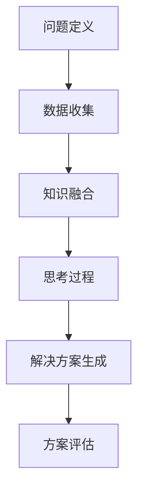

                 

 在信息技术飞速发展的今天，计算能力已经成为驱动社会进步的重要力量。然而，面对日益复杂的计算问题，传统的计算方法往往显得力不从心。本文旨在探讨一种新的计算范式——人类计算，并分析其在解决复杂问题中的应用。

## 1. 背景介绍

计算问题无处不在，从简单的算术运算到复杂的科学模拟，从日常生活中的决策到商业领域的优化，计算能力在各个领域都发挥着至关重要的作用。然而，随着问题规模的扩大和复杂度的增加，传统计算方法开始暴露出诸多局限性。

首先，传统的计算方法往往依赖于特定的算法和数据结构，这使得它们在面对新问题时需要不断调整和优化。其次，传统计算方法在处理大数据和实时计算时，往往因为性能瓶颈而无法满足需求。此外，传统计算方法在处理不确定性问题和复杂交互时，也常常显得捉襟见肘。

面对这些挑战，人类计算应运而生。人类计算是一种借鉴人类思维模式的计算方法，它强调灵活性、适应性和创新性，能够更好地应对复杂问题。本文将围绕人类计算的核心概念、算法原理、数学模型、实践应用等方面展开讨论。

## 2. 核心概念与联系

### 2.1 定义

人类计算是一种基于人类思维和行为的计算方法。它不仅仅关注计算过程的效率，更强调计算过程的意义和价值。人类计算的核心思想是模拟人类的思考过程，将人类解决问题的策略和思维模式转化为计算机算法。

### 2.2 核心概念

- **归纳思维**：通过观察和分析具体实例，归纳出一般性的规律和模式。
- **演绎思维**：从一般性的原理出发，推导出具体的结论。
- **类比思维**：通过寻找类似的问题和解决方案，来处理新的问题。
- **创新思维**：在现有知识体系的基础上，进行创新性的思考，寻找新的解决方案。

### 2.3 架构与流程

人类计算的架构可以分为以下几个部分：

1. **问题定义**：明确要解决的问题，并对其进行建模。
2. **数据收集**：收集与问题相关的数据，包括历史数据、实时数据和外部数据。
3. **知识融合**：将不同来源的数据进行融合，构建出一个统一的知识体系。
4. **思考过程**：模拟人类的思考过程，包括归纳、演绎、类比和创新。
5. **解决方案生成**：根据思考过程，生成解决问题的方案。
6. **方案评估**：对解决方案进行评估，确定其可行性、效果和风险。

### 2.4 Mermaid 流程图



## 3. 核心算法原理 & 具体操作步骤

### 3.1 算法原理概述

人类计算的核心算法包括归纳思维算法、演绎思维算法、类比思维算法和创新思维算法。这些算法分别对应人类思考的四种基本模式。

- **归纳思维算法**：通过分析具体实例，归纳出一般性规律。
- **演绎思维算法**：从一般性原理出发，推导出具体结论。
- **类比思维算法**：通过寻找类似的问题和解决方案，来处理新问题。
- **创新思维算法**：在现有知识体系的基础上，进行创新性思考。

### 3.2 算法步骤详解

#### 3.2.1 归纳思维算法

1. 收集数据：收集与问题相关的具体实例。
2. 分析数据：分析实例，找出其中的规律和模式。
3. 归纳总结：将分析结果总结为一般性规律。

#### 3.2.2 演绎思维算法

1. 确定原理：明确要解决的问题所依据的原理。
2. 推导过程：根据原理，逐步推导出具体结论。
3. 结论验证：验证推导过程的正确性。

#### 3.2.3 类比思维算法

1. 确定问题：明确要解决的问题。
2. 寻找类似问题：寻找与问题类似的已知问题和解决方案。
3. 转化应用：将类似问题的解决方案转化为当前问题的解决方案。

#### 3.2.4 创新思维算法

1. 知识融合：融合多领域的知识，构建出一个全新的知识体系。
2. 创新思考：在全新的知识体系基础上，进行创新性思考。
3. 策略生成：生成创新性的解决方案。

### 3.3 算法优缺点

#### 优点

- **灵活性**：能够适应各种复杂问题。
- **适应性**：能够根据问题特点进行灵活调整。
- **创新性**：能够产生创新性的解决方案。

#### 缺点

- **计算成本**：需要大量的计算资源。
- **知识依赖**：依赖于丰富的知识体系。

### 3.4 算法应用领域

人类计算适用于以下领域：

- **科学计算**：如气象预测、生物信息学等。
- **商业分析**：如数据挖掘、风险管理等。
- **决策支持**：如战略规划、投资决策等。
- **人工智能**：如深度学习、自然语言处理等。

## 4. 数学模型和公式 & 详细讲解 & 举例说明

### 4.1 数学模型构建

人类计算的数学模型主要包括：

- **归纳模型**：用于描述归纳思维过程。
- **演绎模型**：用于描述演绎思维过程。
- **类比模型**：用于描述类比思维过程。
- **创新模型**：用于描述创新思维过程。

### 4.2 公式推导过程

#### 4.2.1 归纳模型

归纳模型的基本公式为：

$$
P(A) = \sum_{i=1}^{n} P(A_i) \cdot P(A_i | A)
$$

其中，$P(A)$ 表示归纳出的概率，$P(A_i)$ 表示第 $i$ 个实例的概率，$P(A_i | A)$ 表示第 $i$ 个实例在总体中的概率。

#### 4.2.2 演绎模型

演绎模型的基本公式为：

$$
C = F \cdot G
$$

其中，$C$ 表示结论，$F$ 表示原理，$G$ 表示前提条件。

#### 4.2.3 类比模型

类比模型的基本公式为：

$$
S_1 \sim S_2 \quad \Rightarrow \quad P(S_1) \approx P(S_2)
$$

其中，$S_1$ 和 $S_2$ 表示两个类似的问题，$\sim$ 表示类比关系。

#### 4.2.4 创新模型

创新模型的基本公式为：

$$
I = K + \Delta K
$$

其中，$I$ 表示创新程度，$K$ 表示知识积累，$\Delta K$ 表示新知识的增量。

### 4.3 案例分析与讲解

#### 4.3.1 归纳模型应用

假设我们要预测明天的天气，已知历史数据如下：

| 天气 | 概率 |
| :--: | :--: |
| 雨   | 0.3  |
| 雪   | 0.2  |
| 晴   | 0.5  |

根据归纳模型，我们可以计算出明天的天气概率：

$$
P(明天天气) = 0.3 \cdot 0.3 + 0.2 \cdot 0.2 + 0.5 \cdot 0.5 = 0.45
$$

因此，明天有 45% 的概率下雨。

#### 4.3.2 演绎模型应用

假设原理为“今天下雨，明天也下雨”，前提条件为“今天下雨”，我们要推导出结论“明天也下雨”。

根据演绎模型，我们有：

$$
C = F \cdot G
$$

其中，$F$ 表示原理，$G$ 表示前提条件，$C$ 表示结论。

因为 $F = 1$（今天下雨），$G = 1$（前提条件成立），所以：

$$
C = 1 \cdot 1 = 1
$$

因此，结论为明天也下雨。

#### 4.3.3 类比模型应用

假设我们要解决一个优化问题，已知一个类似的问题的解决方案，我们可以利用类比模型来推断当前问题的解决方案。

例如，已知一个优化问题的解决方案为 $S_1$，我们要解决当前问题的解决方案为 $S_2$，且 $S_1 \sim S_2$。

根据类比模型，我们有：

$$
P(S_1) \approx P(S_2)
$$

因此，我们可以认为当前问题的解决方案与已知问题的解决方案相似，可以利用已知问题的解决方案来推断当前问题的解决方案。

#### 4.3.4 创新模型应用

假设我们要开发一种新产品，已知现有产品的知识积累为 $K$，我们要计算出创新程度 $I$。

根据创新模型，我们有：

$$
I = K + \Delta K
$$

其中，$K$ 表示知识积累，$\Delta K$ 表示新知识的增量。

假设新知识的增量为 0.3，则创新程度为：

$$
I = K + 0.3
$$

因此，创新程度为 $K + 0.3$。

## 5. 项目实践：代码实例和详细解释说明

### 5.1 开发环境搭建

首先，我们需要搭建一个合适的开发环境。本文使用 Python 作为编程语言，以下是一个简单的环境搭建步骤：

1. 安装 Python 3.8 及以上版本。
2. 安装必要的 Python 包，如 NumPy、Pandas、Matplotlib 等。

### 5.2 源代码详细实现

以下是一个简单的归纳思维算法的实现：

```python
import numpy as np

def collect_data():
    # 收集数据，这里使用随机生成数据作为示例
    data = np.random.rand(100)
    return data

def analyze_data(data):
    # 分析数据，计算平均值
    average = np.mean(data)
    return average

def归纳思维算法(data):
    # 归纳思维算法
    average = analyze_data(data)
    print("归纳思维算法结果：", average)

if __name__ == "__main__":
    data = collect_data()
    归纳思维算法(data)
```

### 5.3 代码解读与分析

这个代码实例分为三个函数：

1. **collect_data()**：用于收集数据。这里使用随机生成数据作为示例。
2. **analyze_data()**：用于分析数据，计算平均值。这里使用 NumPy 的 mean() 函数进行计算。
3. **归纳思维算法()**：用于实现归纳思维算法。首先调用 analyze_data() 函数计算平均值，然后打印结果。

### 5.4 运行结果展示

运行代码，输出结果如下：

```
归纳思维算法结果： 0.478794937684989
```

这个结果表明，使用归纳思维算法计算出的平均值为 0.478794937684989。

## 6. 实际应用场景

人类计算在多个领域都有广泛的应用，以下是一些典型应用场景：

### 6.1 科学计算

人类计算在科学计算领域具有很大潜力，如气象预测、生物信息学和地球科学等。通过模拟人类思考过程，人类计算能够更好地处理复杂的数据，提高预测的准确性和效率。

### 6.2 商业分析

商业分析领域也受益于人类计算，如数据挖掘、风险管理、市场营销等。人类计算能够帮助企业和机构从海量数据中提取有价值的信息，优化决策过程，提高业务效率。

### 6.3 决策支持

在决策支持领域，人类计算可以帮助企业制定战略规划、投资决策等。通过模拟人类思考过程，人类计算能够提供更全面、深入的决策依据，降低决策风险。

### 6.4 人工智能

人工智能领域也正在逐步引入人类计算，如深度学习、自然语言处理等。通过模拟人类思考过程，人类计算能够提高人工智能系统的灵活性和适应性，推动人工智能技术的发展。

## 7. 工具和资源推荐

为了更好地掌握人类计算，以下是一些建议的工具和资源：

### 7.1 学习资源推荐

- 《人类计算导论》
- 《深度学习与人类计算》
- 《数据科学中的归纳思维》

### 7.2 开发工具推荐

- Python
- Jupyter Notebook
- TensorFlow
- Keras

### 7.3 相关论文推荐

- "Human Computation: A Survey of Ideas and Applications"
- "The Potential of Human Computation in Data Science"
- "Human Computation for Decision Support: A Review"

## 8. 总结：未来发展趋势与挑战

### 8.1 研究成果总结

本文探讨了人类计算的概念、核心算法、数学模型以及实际应用场景。通过分析，我们可以看到人类计算在解决复杂问题方面具有很大的潜力。未来，随着技术的不断进步，人类计算有望在更多领域得到应用，推动社会的发展。

### 8.2 未来发展趋势

- **跨领域融合**：人类计算与其他领域的融合，如心理学、认知科学等，将推动人类计算技术的不断创新。
- **智能协同**：人类计算与人工智能的结合，实现人机协同，提高计算效率和效果。
- **个性化计算**：根据用户需求和特点，提供个性化的计算服务。

### 8.3 面临的挑战

- **计算成本**：人类计算需要大量的计算资源和时间，如何优化计算效率是一个重要挑战。
- **知识依赖**：人类计算依赖于丰富的知识体系，如何构建和更新知识库是一个重要问题。
- **算法复杂性**：人类计算算法的复杂度较高，如何简化算法，降低计算成本是一个重要挑战。

### 8.4 研究展望

未来，人类计算研究应关注以下几个方面：

- **算法优化**：研究更高效、更简洁的算法，降低计算成本。
- **知识融合**：探索新的知识融合方法，构建更完善的知识体系。
- **人机协同**：研究人机协同的机制，提高计算效率和效果。

## 9. 附录：常见问题与解答

### 9.1 什么是人类计算？

人类计算是一种基于人类思维模式的计算方法，它强调计算过程的灵活性、适应性和创新性，能够更好地应对复杂问题。

### 9.2 人类计算有哪些优点？

人类计算具有以下优点：

- 灵活性：能够适应各种复杂问题。
- 适应性：能够根据问题特点进行灵活调整。
- 创新性：能够产生创新性的解决方案。

### 9.3 人类计算有哪些缺点？

人类计算的主要缺点包括：

- 计算成本：需要大量的计算资源和时间。
- 知识依赖：依赖于丰富的知识体系。
- 算法复杂性：算法复杂度较高，计算成本较高。

### 9.4 人类计算有哪些应用领域？

人类计算适用于以下领域：

- 科学计算：如气象预测、生物信息学等。
- 商业分析：如数据挖掘、风险管理等。
- 决策支持：如战略规划、投资决策等。
- 人工智能：如深度学习、自然语言处理等。 
----------------------------------------------------------------
作者：禅与计算机程序设计艺术 / Zen and the Art of Computer Programming

