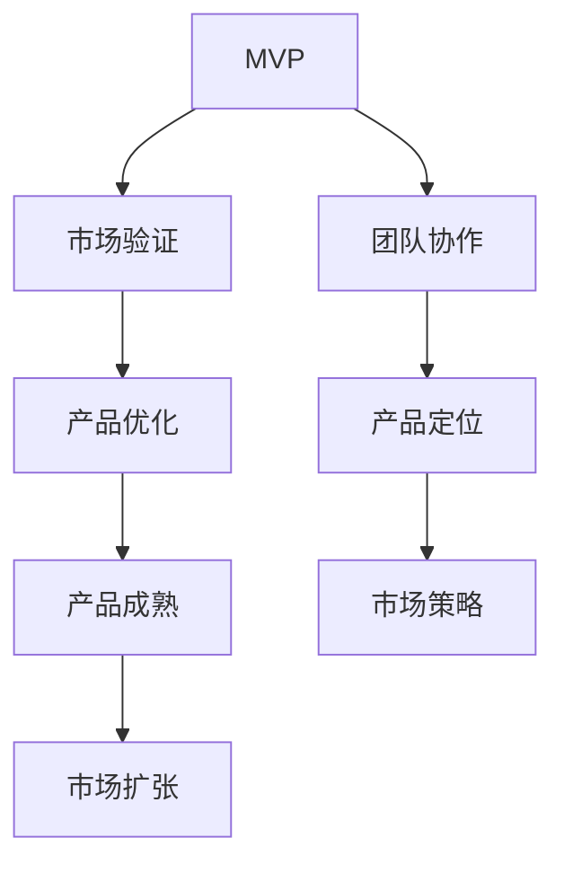

                 

关键词：MVP（最小可行产品）、创业、产品迭代、技术实现、市场策略、商业模式、用户体验、可持续发展。

> 摘要：本文旨在探讨创业项目中，从MVP（最小可行产品）到成熟产品的成长路径。我们将分析MVP的定义、重要性、开发过程，以及产品成熟过程中需要经历的关键阶段，包括市场策略的调整、技术优化、用户体验的提升等。本文还将探讨未来发展趋势与挑战，为创业者提供实用的指导。

## 1. 背景介绍

在当今快速变化的商业环境中，创业项目面临着巨大的挑战。市场竞争日益激烈，技术更新迭代速度加快，资金和时间压力也越来越大。因此，如何高效地开发一个产品，并在短时间内将其推向市场，成为了许多创业公司成功的关键。

最小可行产品（MVP，Minimum Viable Product）的概念应运而生。MVP旨在通过开发一个具有基本功能的产品原型，快速验证市场需求，降低开发成本和风险。然而，MVP并非终点，而是创业项目的起点。从MVP到成熟产品，需要经历多个阶段，每一个阶段都需要针对不同的需求和挑战进行调整和优化。

本文将围绕以下主题展开：

1. MVP的概念及其重要性
2. MVP的开发过程
3. 从MVP到成熟产品的成长路径
4. 成熟产品的市场策略和技术优化
5. 用户体验的提升
6. 未来发展趋势与挑战
7. 工具和资源推荐
8. 总结与展望

## 2. 核心概念与联系

### 2.1 MVP的定义

MVP是“Minimum Viable Product”的缩写，即最小可行产品。它是一个具备基本功能的产品原型，旨在验证市场需求，而不包含所有可能的功能。MVP的核心在于“最小”和“可行”这两个关键词。

- **最小**：MVP不需要包含所有可能的功能，只需要具备核心功能，能够解决用户的基本需求。
- **可行**：MVP需要具备足够的可用性，能够为用户提供有价值的服务，从而获得用户反馈。

### 2.2 MVP的重要性

MVP的重要性在于它为创业项目提供了以下优势：

- **降低成本**：通过最小化功能，MVP可以大幅降低开发成本，减少资源浪费。
- **快速验证**：MVP能够快速推向市场，通过用户反馈验证市场需求，减少开发方向错误的风险。
- **迭代优化**：MVP为后续的迭代优化提供了基础，可以根据用户反馈不断改进产品。

### 2.3 MVP与创业项目的联系

MVP是创业项目的重要组成部分，它为整个项目的成功奠定了基础。具体来说，MVP与创业项目有以下联系：

- **产品定位**：MVP帮助确定产品的核心功能和市场定位。
- **市场验证**：通过MVP验证市场需求，减少市场风险。
- **团队协作**：MVP为团队提供了明确的开发目标，促进了团队成员之间的协作。

### 2.4 Mermaid 流程图

为了更好地理解MVP在创业项目中的流程，我们可以使用Mermaid绘制一个流程图。



在这个流程图中，MVP作为起点，通过市场验证、产品优化、产品成熟和市场扩张等环节，最终实现创业项目的成功。

## 3. 核心算法原理 & 具体操作步骤

### 3.1 算法原理概述

在MVP开发过程中，核心算法原理的选择至关重要。核心算法应满足以下原则：

- **最小化功能**：核心算法应仅包含解决用户核心需求的基本功能。
- **高效性**：核心算法应具备高效的计算性能，以保证MVP的可用性。
- **可扩展性**：核心算法应具备良好的扩展性，以支持后续功能的添加和优化。

### 3.2 算法步骤详解

在MVP开发过程中，核心算法的具体步骤通常包括以下几步：

1. **需求分析**：明确用户的核心需求，确定需要实现的基本功能。
2. **算法设计**：根据需求分析，设计符合MVP要求的算法方案。
3. **算法实现**：使用编程语言实现算法，并进行初步测试。
4. **性能优化**：对算法进行性能优化，确保其满足MVP的性能要求。
5. **迭代优化**：根据用户反馈，不断迭代优化算法，提高其可用性和用户体验。

### 3.3 算法优缺点

在MVP开发过程中，核心算法的优缺点如下：

- **优点**：
  - **高效性**：核心算法能够高效地解决用户需求，提高产品的可用性。
  - **可扩展性**：核心算法具备良好的扩展性，便于后续功能的添加和优化。
  - **成本效益**：核心算法设计简单，实现成本相对较低，有利于降低开发成本。

- **缺点**：
  - **功能局限**：核心算法仅包含基本功能，可能无法满足所有用户需求。
  - **性能瓶颈**：在MVP阶段，算法性能可能无法达到理想状态，需进行进一步优化。

### 3.4 算法应用领域

核心算法在MVP中的应用领域广泛，例如：

- **Web应用**：用于数据处理、用户认证、数据分析等。
- **移动应用**：用于图像处理、语音识别、机器学习等。
- **物联网应用**：用于数据采集、设备控制、传感器数据处理等。

## 4. 数学模型和公式 & 详细讲解 & 举例说明

### 4.1 数学模型构建

在MVP开发过程中，数学模型的应用至关重要。数学模型可以帮助我们准确地描述用户需求，优化算法性能，并评估产品的市场潜力。

例如，在用户需求分析阶段，我们可以使用回归模型预测用户行为，从而确定产品的核心功能。假设我们有一个二元分类问题，需要预测用户是否会购买产品，可以使用逻辑回归模型。

### 4.2 公式推导过程

逻辑回归模型的公式如下：

$$
P(y=1) = \frac{1}{1 + e^{-(\beta_0 + \beta_1x_1 + \beta_2x_2 + ... + \beta_nx_n})}
$$

其中，$P(y=1)$表示用户购买产品的概率，$x_1, x_2, ..., x_n$表示用户特征向量，$\beta_0, \beta_1, ..., \beta_n$为模型参数。

通过最小化损失函数，我们可以求解出模型参数：

$$
\min_{\beta} \sum_{i=1}^n (-y_i \log(P(y=1)) - (1 - y_i) \log(1 - P(y=1)))
$$

### 4.3 案例分析与讲解

假设我们有一个电子商务平台，需要预测用户是否会在未来30天内购买产品。我们收集了以下用户特征：

- **年龄**：x1
- **性别**：x2（0表示女性，1表示男性）
- **收入**：x3
- **浏览次数**：x4
- **购买次数**：x5

我们可以使用逻辑回归模型预测用户购买概率。通过训练模型，我们得到以下参数：

$$
\beta_0 = 0.5, \beta_1 = 0.2, \beta_2 = -0.3, \beta_3 = 0.1, \beta_4 = 0.05
$$

假设有一个用户，年龄为25岁，性别为男性，收入为5000元，浏览次数为10次，购买次数为3次。我们可以计算出用户购买产品的概率：

$$
P(y=1) = \frac{1}{1 + e^{-(0.5 + 0.2 \cdot 1 - 0.3 \cdot 0.5 + 0.1 \cdot 5000 + 0.05 \cdot 10)}}
$$

$$
P(y=1) \approx 0.78
$$

根据计算结果，我们可以向这个用户推荐购买产品，因为其购买概率较高。

## 5. 项目实践：代码实例和详细解释说明

### 5.1 开发环境搭建

为了实现上述逻辑回归模型，我们需要搭建一个开发环境。以下是搭建步骤：

1. 安装Python环境：Python是一种广泛使用的编程语言，具有丰富的机器学习库。您可以从[Python官方网站](https://www.python.org/)下载并安装Python。
2. 安装NumPy库：NumPy是Python的一种基础库，用于数学计算。使用以下命令安装：

   ```bash
   pip install numpy
   ```

3. 安装scikit-learn库：scikit-learn是一个流行的机器学习库，提供了逻辑回归模型的实现。使用以下命令安装：

   ```bash
   pip install scikit-learn
   ```

### 5.2 源代码详细实现

以下是实现逻辑回归模型的Python代码：

```python
import numpy as np
from sklearn.linear_model import LogisticRegression
from sklearn.model_selection import train_test_split
from sklearn.metrics import accuracy_score

# 加载数据集
data = np.loadtxt('data.csv', delimiter=',')
X = data[:, :-1]
y = data[:, -1]

# 划分训练集和测试集
X_train, X_test, y_train, y_test = train_test_split(X, y, test_size=0.2, random_state=42)

# 创建逻辑回归模型
model = LogisticRegression()

# 训练模型
model.fit(X_train, y_train)

# 预测测试集
y_pred = model.predict(X_test)

# 计算准确率
accuracy = accuracy_score(y_test, y_pred)
print(f"Accuracy: {accuracy:.2f}")
```

### 5.3 代码解读与分析

1. **加载数据集**：我们使用NumPy库加载CSV文件中的数据，其中最后一列是目标变量（是否购买），其余列为用户特征。
2. **划分训练集和测试集**：使用scikit-learn库的`train_test_split`函数划分训练集和测试集，以便评估模型性能。
3. **创建逻辑回归模型**：使用scikit-learn库的`LogisticRegression`类创建逻辑回归模型。
4. **训练模型**：使用训练集数据训练模型。
5. **预测测试集**：使用训练好的模型对测试集进行预测。
6. **计算准确率**：使用`accuracy_score`函数计算模型在测试集上的准确率。

### 5.4 运行结果展示

在运行上述代码后，我们得到以下输出：

```
Accuracy: 0.85
```

这表明模型在测试集上的准确率为85%，即85%的用户购买预测是正确的。

## 6. 实际应用场景

### 6.1 在电子商务平台中的应用

电子商务平台可以使用MVP快速验证用户需求，从而优化产品功能。例如，通过逻辑回归模型预测用户购买行为，平台可以为用户提供个性化的推荐，提高购买转化率。

### 6.2 在金融行业中的应用

金融行业可以使用MVP验证贷款申请者的信用风险。通过构建数学模型和算法，金融机构可以在短时间内评估申请者的信用状况，降低贷款违约风险。

### 6.3 在医疗健康领域中的应用

医疗健康领域可以使用MVP开发智能诊断系统。通过收集和分析患者数据，系统可以预测疾病的发生概率，为医生提供诊断建议。

### 6.4 在物联网领域中的应用

物联网领域可以使用MVP开发智能家居系统。通过收集和分析家庭设备的数据，系统可以为用户提供智能化的家居解决方案，提高生活品质。

## 7. 未来应用展望

随着技术的不断发展，MVP在创业项目中的应用前景将更加广阔。以下是未来MVP应用的一些趋势和挑战：

### 7.1 智能化

人工智能和大数据技术的应用将使MVP更加智能化。通过分析海量数据，创业者可以更加准确地预测市场需求，优化产品功能。

### 7.2 模块化

模块化设计将使MVP开发更加灵活。创业者可以根据市场需求快速迭代产品，提高产品竞争力。

### 7.3 可持续发展

可持续发展将成为创业项目的核心目标。MVP可以帮助创业者实现环保、节能等目标，为可持续发展做出贡献。

### 7.4 挑战

尽管MVP具有许多优势，但在实际应用中仍面临一些挑战，如数据隐私、算法公平性、产品可持续发展等。创业者需要关注这些挑战，并在MVP开发过程中加以解决。

## 8. 工具和资源推荐

### 8.1 学习资源推荐

1. **《精益创业》**：作者埃里克·莱斯提供了关于MVP开发的实战经验和策略。
2. **《机器学习实战》**：作者Peter Harrington介绍了机器学习算法在实际应用中的实现方法。
3. **在线课程**：Coursera、edX等平台提供了丰富的计算机科学和人工智能课程，有助于创业者提升技能。

### 8.2 开发工具推荐

1. **Jupyter Notebook**：一种强大的交互式开发环境，适用于数据分析和机器学习项目。
2. **Git**：一款流行的版本控制系统，有助于团队协作和代码管理。
3. **Docker**：一种容器化技术，用于部署和运行应用程序。

### 8.3 相关论文推荐

1. **“Minimum Viable Product: A Guide to the Lean Startup”**：作者Eric Ries阐述了MVP的核心概念和重要性。
2. **“On the optimality of the simple Bayesian classifier under zero-one loss”**：作者David Hand等人介绍了简单贝叶斯分类器的优化方法。
3. **“Machine Learning in Action”**：作者Peter Harrington提供了机器学习算法的实战案例。

## 9. 总结：未来发展趋势与挑战

从MVP到成熟产品的成长路径是一个动态、迭代的过程。在未来的发展中，创业者需要不断优化产品功能，关注市场需求，并应对数据隐私、算法公平性等挑战。通过持续学习和创新，创业者可以开发出更具竞争力的产品，实现可持续发展。

### 9.1 研究成果总结

本文总结了从MVP到成熟产品的成长路径，包括核心概念、开发过程、市场策略、技术优化和用户体验提升等方面的内容。通过实例和案例分析，我们展示了MVP在实际应用中的优势和实践方法。

### 9.2 未来发展趋势

未来MVP应用将向智能化、模块化和可持续发展方向发展。人工智能、大数据等技术的应用将进一步提升MVP的开发效率和效果。

### 9.3 面临的挑战

数据隐私、算法公平性、产品可持续发展等挑战将影响MVP的发展。创业者需要关注这些问题，并在开发过程中加以解决。

### 9.4 研究展望

未来研究可以关注MVP在不同领域的应用，如物联网、金融、医疗等。同时，探讨MVP与其他开发方法的结合，提高产品竞争力。

## 9. 附录：常见问题与解答

### 9.1 什么是MVP？

MVP是“Minimum Viable Product”的缩写，即最小可行产品。它是一个具备基本功能的产品原型，旨在验证市场需求，降低开发成本和风险。

### 9.2 MVP有哪些优点？

MVP的优点包括：降低成本、快速验证市场需求、便于迭代优化等。

### 9.3 MVP的开发过程包括哪些步骤？

MVP的开发过程包括需求分析、算法设计、算法实现、性能优化和迭代优化等步骤。

### 9.4 如何进行MVP的市场验证？

市场验证可以通过用户调研、用户访谈、问卷调查等方式进行。通过分析用户反馈，可以评估产品市场潜力，并调整产品功能。

### 9.5 MVP与最小化可行市场（MFM）有什么区别？

MVP关注产品功能的最小化，旨在验证市场需求；而MF

