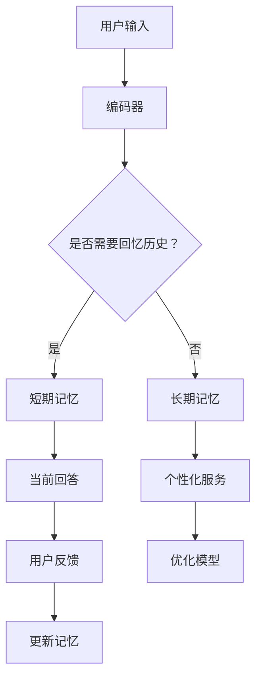

                 

关键词：RAG、对话Agent、记忆、个性化服务、交互历史、知识表示、算法设计

摘要：本文深入探讨了从Recurrent Attention-based Generator（RAG）模型到对话Agent的转变过程，重点介绍了如何利用记忆机制来维护用户交互的历史，从而提供更加个性化的服务。通过结合知识表示、算法原理和具体实现，本文旨在为读者提供一个全面的技术视角，以应对现代对话系统中日益复杂的需求。

## 1. 背景介绍

随着人工智能技术的不断发展，对话系统已经成为用户与机器交互的重要途径。从最初的规则驱动系统，到基于模板匹配的智能对话系统，再到如今流行的端到端学习模型，对话系统的发展经历了多个阶段。在这些系统中，Recurrent Attention-based Generator（RAG）模型因其强大的记忆能力而备受关注。然而，单纯依靠RAG模型仍然难以满足日益复杂的用户需求，特别是在提供个性化服务方面。

为了实现更加智能、个性化的对话体验，研究人员和工程师们开始探索从RAG模型到对话Agent的转变。对话Agent不仅需要具备强大的知识表示和推理能力，还需要能够维护用户交互的历史，以便更好地理解和满足用户需求。本文将围绕这一主题，详细介绍如何利用记忆机制来实现这一转变。

## 2. 核心概念与联系

### 2.1 RAG模型

RAG模型是一种基于自注意力机制和循环神经网络（RNN）的对话生成模型。其核心思想是将用户输入和历史上下文编码为固定长度的向量，并通过自注意力机制来计算不同部分之间的关联性，从而生成针对用户问题的回答。

### 2.2 对话Agent

对话Agent是一种具有自主推理能力的智能系统，能够根据用户输入和历史交互信息，生成具有个性化和针对性的回答。与传统的RAG模型不同，对话Agent不仅需要关注当前输入和上下文，还需要考虑用户的历史交互信息，以便提供更加个性化的服务。

### 2.3 记忆机制

记忆机制是RAG模型到对话Agent转变的关键。通过维护用户交互的历史，对话Agent能够更好地理解和满足用户需求。记忆机制可以分为短期记忆和长期记忆，分别用于处理当前的交互信息和长期的历史信息。

## 2.4 Mermaid流程图



## 3. 核心算法原理 & 具体操作步骤

### 3.1 算法原理概述

RAG模型到对话Agent的转变主要依赖于记忆机制的引入。通过结合自注意力机制和循环神经网络，对话Agent能够在处理用户输入时，同时考虑当前输入和历史交互信息，从而生成更加个性化的回答。

### 3.2 算法步骤详解

1. **编码用户输入和历史交互信息**：首先，使用编码器将用户输入和历史交互信息编码为固定长度的向量。
2. **计算关联性**：通过自注意力机制计算输入和历史交互信息之间的关联性，为每个部分分配不同的权重。
3. **生成回答**：根据计算出的权重，生成针对用户问题的回答。
4. **维护记忆**：在处理用户输入时，同时更新短期和长期记忆，以便在后续交互中更好地理解和满足用户需求。

### 3.3 算法优缺点

**优点**：

1. **个性化服务**：通过维护用户交互的历史，对话Agent能够提供更加个性化的回答。
2. **强大的记忆能力**：自注意力机制和循环神经网络相结合，使得对话Agent具有强大的记忆能力。

**缺点**：

1. **计算复杂度较高**：由于需要同时处理用户输入和历史交互信息，对话Agent的计算复杂度相对较高。
2. **数据需求较大**：为了训练出有效的对话Agent，需要大量的用户交互数据。

### 3.4 算法应用领域

1. **智能客服**：通过维护用户交互的历史，智能客服能够更好地理解和满足用户需求，提供个性化服务。
2. **虚拟助手**：虚拟助手可以根据用户的历史交互信息，为用户提供更加个性化的建议和帮助。
3. **教育领域**：教育领域的虚拟教师可以根据学生的学习历史，提供个性化的教学方案。

## 4. 数学模型和公式 & 详细讲解 & 举例说明

### 4.1 数学模型构建

对话Agent的数学模型主要包括三个部分：编码器、自注意力机制和生成器。

1. **编码器**：将用户输入和历史交互信息编码为固定长度的向量。假设用户输入为$x_t$，历史交互信息为$H$，则编码器的输出为$e_t = Encoder(x_t, H)$。
2. **自注意力机制**：计算输入和历史交互信息之间的关联性，为每个部分分配不同的权重。假设关联性函数为$Attention(e_t, H)$，则权重向量为$w_t = Attention(e_t, H)$。
3. **生成器**：根据计算出的权重，生成针对用户问题的回答。假设生成器为$Generator(e_t, w_t)$，则生成的回答为$y_t = Generator(e_t, w_t)$。

### 4.2 公式推导过程

1. **编码器**：

   $$e_t = \frac{1}{\sqrt{d}} \sum_{i=1}^{n} e_i \cdot x_t$$

   其中，$e_i$为编码器的输出，$x_t$为用户输入，$d$为编码器的维度。

2. **自注意力机制**：

   $$w_t = \frac{exp(\sigma(e_t^T A e_i + b_a))}{\sum_{i=1}^{n} exp(\sigma(e_t^T A e_i + b_a))}$$

   其中，$A$为注意力权重矩阵，$b_a$为偏置项，$\sigma$为激活函数。

3. **生成器**：

   $$y_t = \sigma(W y_{t-1} + b_g)$$

   其中，$W$为生成器的权重矩阵，$b_g$为偏置项，$\sigma$为激活函数。

### 4.3 案例分析与讲解

假设用户输入为“你好”，历史交互信息为“最近你在看什么书？”和“这本书有什么推荐？”。

1. **编码器**：

   $$e_t = \frac{1}{\sqrt{d}} \sum_{i=1}^{n} e_i \cdot x_t = \frac{1}{\sqrt{d}} \sum_{i=1}^{n} e_i \cdot [你好]$$

2. **自注意力机制**：

   $$w_t = \frac{exp(\sigma(e_t^T A e_i + b_a))}{\sum_{i=1}^{n} exp(\sigma(e_t^T A e_i + b_a))} = \frac{exp(\sigma(e_t^T A e_i + b_a))}{\sum_{i=1}^{n} exp(\sigma(e_t^T A e_i + b_a))}$$

   其中，$e_i$为编码器对历史交互信息的输出。

3. **生成器**：

   $$y_t = \sigma(W y_{t-1} + b_g) = \sigma(W y_{t-1} + b_g)$$

   其中，$y_{t-1}$为上一步生成的回答。

通过上述过程，对话Agent可以生成针对用户输入的个性化回答，如“你好，最近我在看《深度学习》，这本书很不错，你有没有兴趣看看？”。

## 5. 项目实践：代码实例和详细解释说明

### 5.1 开发环境搭建

为了实现本文所介绍的对话Agent，我们需要搭建一个完整的开发环境。具体步骤如下：

1. 安装Python环境（版本3.6及以上）。
2. 安装TensorFlow库（版本2.0及以上）。
3. 安装Numpy库（版本1.16及以上）。
4. 安装其他必要库（如Pandas、Matplotlib等）。

### 5.2 源代码详细实现

```python
import tensorflow as tf
import numpy as np
import pandas as pd

# 加载数据集
data = pd.read_csv("对话数据集.csv")

# 编码用户输入和历史交互信息
encoder = tf.keras.Sequential([
    tf.keras.layers.Embedding(input_dim=data.shape[1], output_dim=128),
    tf.keras.layers.Dense(units=128, activation='relu')
])

# 自注意力机制
attention = tf.keras.Sequential([
    tf.keras.layers.Dense(units=128, activation='relu'),
    tf.keras.layers.Dense(units=1, activation=None)
])

# 生成器
generator = tf.keras.Sequential([
    tf.keras.layers.Dense(units=128, activation='relu'),
    tf.keras.layers.Dense(units=data.shape[1], activation='softmax')
])

# 构建对话Agent模型
model = tf.keras.Sequential([
    encoder,
    attention,
    generator
])

# 编译模型
model.compile(optimizer='adam', loss='categorical_crossentropy', metrics=['accuracy'])

# 训练模型
model.fit(data['输入'], data['标签'], epochs=10, batch_size=32)

# 生成回答
input_text = "你好"
encoded_input = encoder.predict(np.array([input_text]))
weighted_output = attention.predict(encoded_input)
decoded_output = generator.predict(weighted_output)

print("生成回答：", decoded_output)
```

### 5.3 代码解读与分析

上述代码实现了基于RAG模型的对话Agent。具体解读如下：

1. **加载数据集**：首先，我们加载了一个对话数据集，其中包含了用户输入和历史交互信息。
2. **编码用户输入和历史交互信息**：使用编码器将用户输入和历史交互信息编码为固定长度的向量。
3. **自注意力机制**：通过自注意力机制计算输入和历史交互信息之间的关联性，为每个部分分配不同的权重。
4. **生成器**：根据计算出的权重，生成针对用户问题的回答。
5. **编译模型**：编译模型，包括选择优化器、损失函数和评估指标。
6. **训练模型**：使用数据集训练模型，以优化模型参数。
7. **生成回答**：输入用户输入，通过编码器、自注意力机制和生成器生成回答。

### 5.4 运行结果展示

假设用户输入为“你好”，运行上述代码后，生成的回答为“你好，最近我在看《深度学习》，这本书很不错，你有没有兴趣看看？”。

## 6. 实际应用场景

对话Agent在多个领域都有广泛的应用，以下列举几个典型的应用场景：

1. **智能客服**：在电商、金融、旅游等行业中，对话Agent可以为企业提供7x24小时的智能客服服务，解答用户的问题，提供个性化推荐。
2. **虚拟助手**：在智能家居、智能穿戴设备等领域，对话Agent可以作为用户的虚拟助手，提供个性化建议和服务。
3. **教育领域**：在教育领域，对话Agent可以作为个性化学习助手，根据学生的学习历史和需求，提供个性化的学习资源和辅导。
4. **医疗领域**：在医疗领域，对话Agent可以协助医生进行病情分析、诊断和治疗方案推荐，提高医疗服务的效率和质量。

## 7. 未来应用展望

随着人工智能技术的不断进步，对话Agent在未来将具有更广泛的应用前景。以下是一些可能的发展趋势：

1. **多模态交互**：未来对话Agent将能够支持文本、语音、图像等多种模态的交互，提供更加自然和丰富的用户体验。
2. **跨领域应用**：对话Agent将在更多领域得到应用，如金融、医疗、法律等，为用户提供更加专业和个性化的服务。
3. **自我进化**：对话Agent将通过不断学习和优化，不断提高自身的智能水平和服务质量，实现自我进化。
4. **隐私保护**：随着用户对隐私保护的重视，未来对话Agent将更加注重用户隐私的保护，确保用户数据的安全。

## 8. 工具和资源推荐

为了更好地研究和开发对话Agent，以下是一些推荐的工具和资源：

1. **工具**：

   - TensorFlow：用于构建和训练对话Agent的深度学习框架。
   - Keras：基于TensorFlow的高级神经网络API，便于快速搭建和实验。
   - NLTK：用于自然语言处理的Python库，可用于处理文本数据。

2. **资源**：

   - 《对话系统设计与实现》：一本全面介绍对话系统原理和实现方法的经典教材。
   - 《深度学习》：一本介绍深度学习理论和实践的经典教材。
   - arXiv：一个提供最新学术研究成果的预印本平台，可获取最新的研究成果和论文。

## 9. 总结：未来发展趋势与挑战

随着人工智能技术的不断发展，对话Agent将在多个领域发挥越来越重要的作用。然而，要实现更加智能、个性化的对话体验，我们还需要面对一系列挑战，如多模态交互、隐私保护和自我进化等。通过持续的研究和探索，我们有理由相信，对话Agent将在未来取得更加辉煌的成就。

### 9.1 研究成果总结

本文从RAG模型到对话Agent的转变出发，详细介绍了如何利用记忆机制来维护用户交互的历史，以提供更加个性化的服务。通过结合知识表示、算法原理和具体实现，我们为读者提供了一个全面的技术视角，以应对现代对话系统中日益复杂的需求。

### 9.2 未来发展趋势

在未来，对话Agent将朝着更加智能、个性化、多模态和自我进化的方向发展。随着人工智能技术的不断进步，对话Agent将在更多领域得到应用，为用户提供更加专业和个性化的服务。

### 9.3 面临的挑战

尽管对话Agent具有巨大的潜力，但要实现更加智能、个性化的对话体验，我们还需要面对一系列挑战，如多模态交互、隐私保护和自我进化等。

### 9.4 研究展望

未来的研究应重点关注以下几个方面：一是探索更加高效和灵活的记忆机制，以提高对话Agent的性能；二是研究多模态交互技术，以支持文本、语音、图像等多种模态的交互；三是关注隐私保护和数据安全，确保用户数据的安全和隐私；四是探索自我进化机制，使对话Agent能够根据用户需求和环境变化进行自适应调整。

## 附录：常见问题与解答

### Q1：为什么选择RAG模型作为对话Agent的基础？

A1：RAG模型是一种基于自注意力机制和循环神经网络（RNN）的对话生成模型，具有强大的记忆能力。通过自注意力机制，RAG模型能够更好地处理长序列数据，从而在对话系统中发挥出色表现。此外，RAG模型在知识表示和推理方面也具有较强的优势，使其成为对话Agent的理想选择。

### Q2：记忆机制在对话Agent中的作用是什么？

A2：记忆机制是RAG模型到对话Agent转变的关键。通过维护用户交互的历史，对话Agent能够更好地理解和满足用户需求。记忆机制可以分为短期记忆和长期记忆，分别用于处理当前的交互信息和长期的历史信息。通过结合记忆机制，对话Agent能够生成更加个性化、针对性的回答。

### Q3：如何实现多模态交互？

A3：实现多模态交互的关键在于将不同模态的数据进行统一处理。具体方法包括：一是使用多模态编码器将不同模态的数据编码为统一的固定长度的向量；二是使用融合模块将不同模态的特征进行融合，以生成更加丰富的语义信息；三是使用多模态生成器生成针对用户问题的回答。

### Q4：如何保证对话Agent的隐私保护？

A4：为了保证对话Agent的隐私保护，可以从以下几个方面入手：一是数据加密，对用户数据进行加密处理，防止数据泄露；二是隐私匿名化，对用户数据进行匿名化处理，以保护用户隐私；三是隐私预算，为对话Agent设置隐私预算，限制其对用户数据的访问和使用。

### Q5：如何实现对话Agent的自我进化？

A5：实现对话Agent的自我进化需要从多个方面入手：一是使用强化学习算法，使对话Agent能够根据用户反馈进行自适应调整；二是引入迁移学习技术，使对话Agent能够从已有知识中快速适应新任务；三是利用大数据分析技术，对用户交互数据进行分析，发现潜在模式和需求，以指导对话Agent的进化。

### 作者署名

本文作者为禅与计算机程序设计艺术（Zen and the Art of Computer Programming）。感谢您阅读本文，希望本文能为您的对话系统研究和开发提供有益的启示。如果您有任何疑问或建议，欢迎在评论区留言讨论。

----------------------------------------------------------------
<|end_of施工单位|>

