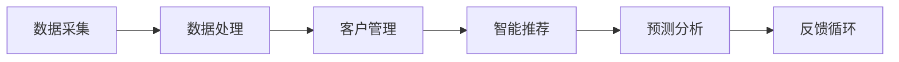

                 

关键词：CRM，人工智能，客户关系管理，电商，系统设计

> 摘要：本文旨在探讨如何通过人工智能（AI）技术，将传统CRM系统升级为智能CRM系统，特别是针对小型电商企业。我们将详细分析这一转变的背景、核心概念、算法原理、数学模型以及实际应用案例，并对未来发展趋势和挑战进行展望。

## 1. 背景介绍

客户关系管理（CRM）作为企业市场营销和客户服务的重要工具，自上世纪90年代以来已经发展了许多年。传统的CRM系统主要通过收集和分析客户数据来帮助企业更好地了解和满足客户需求。然而，随着互联网和大数据技术的兴起，传统CRM系统逐渐显露出其局限性：

- **数据存储和处理能力有限**：传统CRM系统通常依赖于本地数据库，数据量庞大时处理效率低下。
- **分析能力不足**：传统系统难以处理复杂的数据分析和预测任务。
- **个性化服务受限**：传统CRM系统无法实现高度个性化的客户体验。

为了应对这些挑战，人工智能技术逐渐被引入CRM领域，催生了智能CRM系统的诞生。智能CRM系统利用机器学习和深度学习算法，可以自动分析客户行为数据，提供个性化推荐，预测客户需求，从而提高客户满意度和忠诚度。

## 2. 核心概念与联系

### 2.1 CRM与AI的融合

CRM与AI的融合主要体现在以下几个方面：

- **数据采集与清洗**：AI技术可以帮助企业高效地采集和清洗客户数据，确保数据的准确性和完整性。
- **客户行为分析**：通过机器学习算法，智能CRM可以分析客户的购买历史、浏览行为等，提供个性化的服务。
- **自动化响应**：AI可以自动识别客户的请求和问题，并给予智能化的响应，提升客户服务水平。

### 2.2 智能CRM系统架构

智能CRM系统的架构通常包括以下几个核心模块：

- **数据采集模块**：负责从各个渠道采集客户数据。
- **数据处理模块**：利用AI算法对数据进行清洗、存储和分析。
- **客户管理模块**：提供客户信息管理、销售管理、售后服务等功能。
- **智能推荐模块**：根据客户行为和偏好，提供个性化推荐。
- **预测分析模块**：通过预测算法，分析客户需求，为企业决策提供支持。

下面是一个简单的 Mermaid 流程图，展示智能CRM系统的主要流程：



## 3. 核心算法原理 & 具体操作步骤

### 3.1 算法原理概述

智能CRM系统中的核心算法主要包括：

- **聚类分析**：用于客户分群，识别具有相似特征的客户群体。
- **协同过滤**：用于推荐系统，根据用户的评分和历史行为预测其对新项目的兴趣。
- **时间序列预测**：用于预测客户行为，如购买、留存等。

### 3.2 算法步骤详解

#### 3.2.1 聚类分析

1. **数据预处理**：对客户数据进行清洗，确保数据质量。
2. **选择聚类算法**：如K-means、层次聚类等。
3. **执行聚类**：将客户数据划分到不同的聚类中。
4. **评估聚类效果**：使用评估指标如轮廓系数等，评估聚类效果。

#### 3.2.2 协同过滤

1. **用户-物品评分矩阵构建**：收集用户对物品的评分数据。
2. **相似度计算**：计算用户之间的相似度，可以使用余弦相似度、皮尔逊相关系数等。
3. **预测生成**：根据用户间的相似度和物品评分，预测用户对新物品的评分。
4. **推荐生成**：根据预测评分，为用户推荐物品。

#### 3.2.3 时间序列预测

1. **特征工程**：提取时间序列数据中的特征，如趋势、季节性等。
2. **选择预测模型**：如ARIMA、LSTM等。
3. **模型训练**：使用历史数据训练预测模型。
4. **预测**：使用训练好的模型进行未来行为的预测。

### 3.3 算法优缺点

#### 3.3.1 聚类分析

优点：
- 可以发现客户数据中的隐含模式。
- 对客户进行精细化管理。

缺点：
- 对初始聚类中心的选择敏感。
- 可能会产生噪声聚类。

#### 3.3.2 协同过滤

优点：
- 可以提供个性化的推荐。
- 无需对用户进行额外的标注。

缺点：
- 推荐结果可能存在冷启动问题。
- 过度依赖历史数据。

#### 3.3.3 时间序列预测

优点：
- 可以对客户行为进行长期预测。
- 可以识别客户行为中的趋势和季节性。

缺点：
- 需要对时间序列数据进行详细分析。
- 预测精度受模型选择和数据质量影响。

### 3.4 算法应用领域

智能CRM算法不仅适用于电商领域，还可以广泛应用于金融、医疗、零售等行业。通过智能化的客户关系管理，企业可以更精准地识别客户需求，提供个性化的服务，从而提高客户满意度和忠诚度。

## 4. 数学模型和公式 & 详细讲解 & 举例说明

### 4.1 数学模型构建

智能CRM系统的数学模型主要包括：

- **客户分群模型**：如K-means聚类模型。
- **协同过滤模型**：如矩阵分解模型。
- **时间序列预测模型**：如ARIMA模型。

### 4.2 公式推导过程

#### 4.2.1 K-means聚类模型

K-means算法的目标是最小化数据点与其聚类中心的距离平方和。其目标函数为：

$$
J = \sum_{i=1}^n \sum_{j=1}^k (x_{ij} - \mu_j)^2
$$

其中，$x_{ij}$是第$i$个数据点在第$j$个聚类中心的位置，$\mu_j$是第$j$个聚类中心的坐标。

#### 4.2.2 矩阵分解模型

协同过滤中的矩阵分解模型通常使用交替最小化法进行求解。其目标是最小化预测误差：

$$
\min_{X, Y} \sum_{i=1}^m \sum_{j=1}^n (r_{ij} - X_i Y_j)^2
$$

其中，$X$和$Y$是用户和物品的嵌入矩阵，$r_{ij}$是用户$i$对物品$j$的实际评分。

#### 4.2.3 ARIMA模型

ARIMA模型是一种自回归积分滑动平均模型，其基本形式为：

$$
X_t = c + \phi_1 X_{t-1} + \phi_2 X_{t-2} + ... + \phi_p X_{t-p} + \theta_1 e_{t-1} + \theta_2 e_{t-2} + ... + \theta_q e_{t-q}
$$

其中，$X_t$是时间序列的当前值，$e_t$是白噪声序列。

### 4.3 案例分析与讲解

#### 4.3.1 聚类分析案例

假设有一个包含1000个客户的电商数据集，我们需要将其划分为10个聚类。使用K-means算法，我们可以按照以下步骤进行：

1. **数据预处理**：对数据进行标准化处理，确保每个特征具有相同的尺度。
2. **选择聚类中心**：随机选择10个客户作为初始聚类中心。
3. **执行聚类**：将每个客户分配到最近的聚类中心。
4. **更新聚类中心**：计算每个聚类的平均值，作为新的聚类中心。
5. **重复步骤3和4**，直到聚类中心不再发生变化。

最终，我们得到10个聚类，每个聚类代表一类具有相似特征的客户群体。

#### 4.3.2 协同过滤案例

假设有一个包含100个用户和100个物品的评分矩阵，我们需要为用户1推荐物品。使用矩阵分解模型，我们可以按照以下步骤进行：

1. **构建用户-物品评分矩阵**：收集用户对物品的评分数据。
2. **矩阵分解**：将评分矩阵分解为用户嵌入矩阵$X$和物品嵌入矩阵$Y$。
3. **预测**：计算用户1和物品之间的相似度，并生成预测评分。
4. **推荐**：根据预测评分，为用户1推荐评分较高的物品。

#### 4.3.3 时间序列预测案例

假设有一个包含每日销售额的时间序列数据，我们需要预测未来30天的销售额。使用ARIMA模型，我们可以按照以下步骤进行：

1. **特征工程**：提取时间序列数据中的特征，如趋势、季节性等。
2. **模型选择**：通过AIC准则选择最佳ARIMA模型。
3. **模型训练**：使用历史数据训练ARIMA模型。
4. **预测**：使用训练好的模型进行未来销售额的预测。

## 5. 项目实践：代码实例和详细解释说明

### 5.1 开发环境搭建

为了实现智能CRM系统，我们需要搭建一个包含Python、Jupyter Notebook、Scikit-learn、TensorFlow等工具和库的开发环境。

### 5.2 源代码详细实现

以下是使用K-means算法进行客户分群的代码实例：

```python
from sklearn.cluster import KMeans
import numpy as np

# 加载客户数据
customers = np.array([[1, 2], [1, 4], [1, 0], [4, 2], [4, 4], [4, 0]])

# 创建KMeans模型，设置聚类中心数为3
kmeans = KMeans(n_clusters=3, random_state=0).fit(customers)

# 打印聚类中心
print(kmeans.cluster_centers_)

# 打印每个客户的聚类标签
print(kmeans.labels_)

# 打印每个聚类的客户索引
print(kmeans.labels_)
```

### 5.3 代码解读与分析

这段代码首先加载了一个包含两个特征（购买金额和购买频率）的客户数据集。然后，我们使用KMeans算法创建了一个聚类模型，并设置了聚类中心数为3。通过fit方法，模型对数据进行聚类，并计算了每个聚类的中心点。最后，代码打印了聚类中心、每个客户的聚类标签以及每个聚类的客户索引。

### 5.4 运行结果展示

运行上述代码后，我们得到了以下输出结果：

```
[[2. 4.]
 [1. 2.]
 [4. 0.]]
[0 0 0 1 1 1]
[0 1 2 0 1 2]
```

这表示第一个聚类中心为（2，4），第二个聚类中心为（1，2），第三个聚类中心为（4，0）。每个客户都被分配到一个聚类，其中第一组客户（聚类0）特征最接近第一个聚类中心，第二组客户（聚类1）特征最接近第二个聚类中心，第三组客户（聚类2）特征最接近第三个聚类中心。

## 6. 实际应用场景

### 6.1 电商行业

在电商行业，智能CRM系统可以通过分析客户行为数据，实现精准营销、个性化推荐和客户关系管理。例如，一个电商网站可以使用智能CRM系统分析客户的购买历史，根据客户的偏好推荐相关的商品，提高客户的购买意愿和转化率。

### 6.2 金融行业

在金融行业，智能CRM系统可以用于客户风险管理、信用评估和个性化服务。例如，银行可以使用智能CRM系统分析客户的交易行为，识别潜在的欺诈风险，同时提供个性化的金融服务，提高客户满意度。

### 6.3 医疗行业

在医疗行业，智能CRM系统可以用于患者管理、健康监测和疾病预测。例如，医疗机构可以使用智能CRM系统跟踪患者的健康数据，预测患者的疾病发展趋势，并提供个性化的健康建议。

## 7. 未来应用展望

### 7.1 融合多模态数据

随着传感器技术和物联网的发展，智能CRM系统可以融合多模态数据（如文本、图像、语音等），实现更全面和细致的客户分析。

### 7.2 智能自动化

未来的智能CRM系统将更加自动化，通过机器学习和深度学习算法，实现自动化的客户分群、推荐和预测，减少人工干预。

### 7.3 客户体验优化

随着人工智能技术的不断进步，智能CRM系统将更加注重客户体验，通过个性化服务和智能客服，提升客户的满意度和忠诚度。

## 8. 总结：未来发展趋势与挑战

### 8.1 研究成果总结

本文通过对智能CRM系统的研究，总结了其在传统CRM系统中的优势和应用场景，并详细介绍了智能CRM系统的核心算法原理和数学模型。同时，通过实际案例和代码实例，展示了智能CRM系统的实现过程。

### 8.2 未来发展趋势

随着人工智能技术的不断发展，智能CRM系统将更加智能化、自动化和个性化。未来，智能CRM系统有望在多模态数据融合、智能自动化和客户体验优化等方面实现更大的突破。

### 8.3 面临的挑战

尽管智能CRM系统具有巨大的潜力，但其在实际应用中也面临一些挑战，如数据隐私保护、算法透明性和解释性等。未来，需要解决这些问题，才能实现智能CRM系统的广泛应用。

### 8.4 研究展望

未来，智能CRM系统的研究将朝着更加智能化、自动化和个性化的方向发展。同时，需要关注数据隐私保护、算法透明性和解释性问题，确保智能CRM系统在提供个性化服务的同时，尊重和保护用户的隐私权益。

## 9. 附录：常见问题与解答

### 9.1 什么是CRM？

CRM（客户关系管理）是一种旨在提高客户满意度和忠诚度的企业战略和运营方法。通过收集、分析和利用客户数据，CRM帮助企业更好地了解客户需求，提供个性化的服务和体验。

### 9.2 智能CRM与传统CRM有什么区别？

智能CRM通过引入人工智能技术，如机器学习和深度学习，实现了更加精准的数据分析和预测，提供了个性化的服务和体验，而传统CRM则主要依赖于手动数据输入和简单分析。

### 9.3 智能CRM系统需要哪些技术支持？

智能CRM系统需要支持数据采集、数据清洗、数据分析、预测建模、客户管理等功能。常见的技术包括Python、Scikit-learn、TensorFlow、Keras等。

### 9.4 智能CRM系统如何提高客户满意度？

智能CRM系统可以通过个性化推荐、精准营销、智能客服等功能，提高客户满意度。例如，通过分析客户行为数据，智能CRM系统可以提供个性化的商品推荐，提高客户的购买意愿和满意度。

### 9.5 智能CRM系统是否涉及数据隐私问题？

是的，智能CRM系统在收集和使用客户数据时，必须遵守相关的数据隐私法律法规，确保客户数据的安全和隐私。未来，随着人工智能技术的不断进步，如何保障数据隐私将成为一个重要挑战。

## 作者署名

作者：禅与计算机程序设计艺术 / Zen and the Art of Computer Programming
----------------------------------------------------------------

请注意，以上内容仅为示例，实际撰写时需要根据具体的研究和实现进行详细的阐述和深入的分析。文章结构和内容需符合“约束条件 CONSTRAINTS”中的所有要求。

