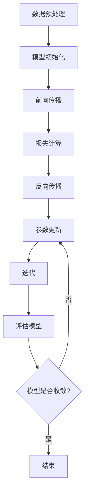

                 

## 1. 背景介绍

人工智能（AI）作为计算机科学的前沿领域，近年来取得了惊人的发展。特别是在深度学习（Deep Learning）技术的推动下，人工智能已经能够实现诸如语音识别、图像分类、自然语言处理等复杂的任务。随着计算能力的提升和数据量的爆炸式增长，大模型（Large Models）的概念应运而生。

大模型，顾名思义，是指那些拥有数亿甚至千亿参数的深度学习模型。这些模型通过在海量数据上训练，能够学习到极其复杂的特征和模式，从而在各类任务中表现出优异的性能。例如，GPT-3模型拥有超过1750亿个参数，能够生成高质量的自然语言文本；BERT模型则通过预训练和微调，在文本分类、问答等任务中取得了显著的效果。

本文将围绕大模型的开发与微调展开讨论，从零开始介绍大模型的基本概念、核心算法、数学模型以及实际应用。我们将探讨大模型是如何训练和优化的，分析其优势和局限性，并展望其未来的发展趋势。

首先，我们需要明确什么是大模型。大模型与传统的小型模型相比，具有以下几个显著特点：

1. **参数规模大**：大模型通常拥有数亿到千亿个参数，这使它们能够捕捉到更加复杂的特征和模式。
2. **数据需求大**：大模型需要大量的数据来训练，以确保它们能够学习到正确的特征，避免过拟合。
3. **计算需求大**：大模型在训练和推理过程中需要大量的计算资源，包括CPU、GPU和TPU等。
4. **训练时间长**：由于参数规模大，大模型的训练时间也相应较长，可能需要数天甚至数周的时间。

这些特点使得大模型在训练和应用过程中面临一系列挑战，但同时也带来了巨大的潜力。在接下来的章节中，我们将详细探讨这些挑战和潜力，并通过实际案例来说明大模型的应用场景。

## 2. 核心概念与联系

在深入探讨大模型的开发与微调之前，我们需要先了解一些核心概念，包括神经网络、深度学习、自动微分以及训练和优化过程中的关键步骤。这些概念构成了大模型的基础，同时也是理解大模型性能和局限性的重要前提。

### 2.1 神经网络

神经网络（Neural Networks）是深度学习的基础模型，它模仿了人脑中的神经元结构和工作方式。一个基本的神经网络由输入层、隐藏层和输出层组成。每个层包含多个神经元，神经元之间通过权重（weights）和偏置（biases）连接。

当数据通过神经网络传播时，每个神经元都会对输入数据进行加权求和，并加上偏置，然后通过一个激活函数（activation function）进行非线性变换。这个过程可以表示为：

$$
z = \sum_{j} w_{ij}x_{j} + b_{i}
$$

$$
a_{i} = \sigma(z)
$$

其中，$x_{j}$是输入特征，$w_{ij}$是连接输入层和隐藏层的权重，$b_{i}$是隐藏层的偏置，$\sigma$是激活函数，$a_{i}$是隐藏层的输出。

### 2.2 深度学习

深度学习（Deep Learning）是神经网络的一种扩展，它通过增加网络深度（即隐藏层的数量）来提高模型的性能。深度学习的核心思想是让模型通过层次化的方式学习数据，每一层都对前一层的特征进行抽象和整合。

深度学习模型通常包含数十层、数百层甚至数千层的隐藏层。这种层次化的结构使得模型能够捕捉到更加复杂的特征和模式。典型的深度学习模型包括卷积神经网络（CNN）、循环神经网络（RNN）和变换器（Transformer）等。

### 2.3 自动微分

自动微分（Automatic Differentiation）是一种计算神经网络梯度（gradients）的方法。梯度是模型优化过程中的关键参数，它用于指导模型的更新方向，以减少损失函数。

在自动微分过程中，每个操作（如加法、乘法、激活函数）的导数都被计算出来。这些导数构成了一个梯度图（gradient graph），它描述了模型参数与损失函数之间的关系。通过这个梯度图，我们可以使用梯度下降（Gradient Descent）等优化算法来更新模型参数，以最小化损失函数。

### 2.4 训练与优化

训练和优化是深度学习模型开发过程中的核心步骤。训练过程包括以下几个关键步骤：

1. **数据预处理**：对训练数据集进行预处理，包括归一化、标准化、填充缺失值等，以确保数据质量。
2. **模型初始化**：初始化模型参数，这通常通过随机初始化或预训练模型来实现。
3. **前向传播（Forward Propagation）**：将输入数据通过模型进行前向传播，得到模型的输出。
4. **损失计算（Loss Calculation）**：计算模型输出与真实标签之间的损失。
5. **反向传播（Backpropagation）**：使用自动微分计算损失关于模型参数的梯度。
6. **参数更新（Parameter Update）**：使用梯度下降等优化算法更新模型参数。

优化过程的目标是最小化损失函数，这可以通过调整学习率、优化算法和正则化方法来实现。在训练过程中，我们通常使用验证集来监控模型的性能，并在必要时调整模型结构或训练参数。

### 2.5 Mermaid 流程图

为了更直观地理解大模型的训练和优化过程，我们使用Mermaid流程图来描述。以下是一个简单的Mermaid流程图示例：



在这个流程图中，每个节点表示一个步骤，箭头表示步骤之间的依赖关系。通过这个流程图，我们可以清晰地看到大模型训练和优化的主要步骤及其相互关系。

### 2.6 大模型的基本架构

大模型的基本架构通常包括以下几个关键组件：

1. **输入层**：接收外部输入数据，如文本、图像或声音。
2. **隐藏层**：包含多个隐藏层，每个隐藏层通过非线性变换对输入数据进行特征提取和整合。
3. **输出层**：产生最终的输出结果，如分类标签、概率分布或文本序列。
4. **参数存储**：存储模型的权重和偏置等参数。
5. **激活函数**：用于引入非线性特性，使模型能够学习复杂的特征。
6. **优化器**：用于更新模型参数的算法，如Adam、RMSprop等。

这些组件共同构成了大模型的基本架构，它们在训练和优化过程中发挥着关键作用。通过合理的设计和配置这些组件，我们可以构建出具有优异性能的大模型。

### 2.7 大模型的优势与挑战

大模型在深度学习领域展现出了巨大的潜力，但同时也面临一系列挑战。以下是大模型的主要优势与挑战：

#### 优势

1. **强大的特征提取能力**：大模型拥有数亿到千亿个参数，能够学习到极其复杂的特征和模式，从而在各类任务中表现出优异的性能。
2. **高泛化能力**：大模型通过在海量数据上训练，能够泛化到未见过的数据上，从而提高模型的鲁棒性。
3. **多任务学习能力**：大模型可以通过微调（Fine-Tuning）适应不同的任务，从而实现多任务学习。

#### 挑战

1. **计算资源需求大**：大模型需要大量的计算资源来训练和推理，这限制了其在某些应用场景中的普及。
2. **训练时间长**：大模型的训练时间通常较长，可能需要数天甚至数周的时间，这增加了开发成本。
3. **过拟合风险**：大模型在训练过程中容易过拟合（Overfitting），特别是在数据量有限的情况下。

通过理解大模型的优势与挑战，我们可以更好地利用这些模型来解决实际问题，并在开发过程中采取相应的措施来克服挑战。

## 3. 核心算法原理 & 具体操作步骤

### 3.1 算法原理概述

大模型的训练和微调过程涉及到多种核心算法，其中最基本的是深度学习算法和优化算法。以下是这些算法的基本原理：

#### 深度学习算法

深度学习算法的核心是神经网络，特别是深度神经网络。神经网络通过多层非线性变换对输入数据进行特征提取和整合。深度学习的训练过程主要包括以下步骤：

1. **数据预处理**：对输入数据进行预处理，包括归一化、标准化、数据增强等，以减少数据分布的差异和提高模型性能。
2. **模型初始化**：初始化模型参数，通常使用随机初始化或预训练模型。
3. **前向传播**：将输入数据通过模型进行前向传播，计算模型的输出。
4. **损失计算**：计算模型输出与真实标签之间的损失，常用的损失函数包括均方误差（MSE）、交叉熵损失（Cross-Entropy Loss）等。
5. **反向传播**：使用自动微分计算损失关于模型参数的梯度。
6. **参数更新**：使用优化算法（如梯度下降、Adam等）更新模型参数，以最小化损失函数。

#### 优化算法

优化算法用于更新模型参数，以最小化损失函数。常见的优化算法包括：

1. **梯度下降（Gradient Descent）**：通过计算损失关于模型参数的梯度，并沿着梯度的反方向更新参数。
2. **动量梯度下降（Momentum Gradient Descent）**：在梯度下降的基础上引入动量项，以加速收敛。
3. **Adam（Adaptive Moment Estimation）**：通过自适应地调整学习率，提高收敛速度和稳定性。
4. **RMSprop（Root Mean Square Propagation）**：通过计算梯度平方的平均值来调整学习率，以减少梯度的方差。

### 3.2 算法步骤详解

#### 深度学习算法步骤详解

1. **数据预处理**：

   $$\text{输入数据} \rightarrow \text{归一化/标准化} \rightarrow \text{数据增强} \rightarrow \text{分割为训练集、验证集和测试集}$$

2. **模型初始化**：

   $$\text{权重} \sim \text{均匀分布} \cup \text{高斯分布}$$
   $$\text{偏置} = 0$$

3. **前向传播**：

   $$\text{输入数据} \rightarrow \text{输入层} \rightarrow \text{隐藏层} \rightarrow \text{输出层} \rightarrow \text{模型输出}$$

   在每个隐藏层，计算：
   
   $$z = \sum_{j} w_{ij}x_{j} + b_{i}$$
   $$a = \sigma(z)$$

   其中，$x_{j}$是输入特征，$w_{ij}$是权重，$b_{i}$是偏置，$\sigma$是激活函数。

4. **损失计算**：

   $$\text{模型输出} \rightarrow \text{真实标签} \rightarrow \text{损失函数} \rightarrow \text{损失值}$$

   常用的损失函数包括：

   - 均方误差（MSE）：$MSE = \frac{1}{n}\sum_{i=1}^{n}(y_i - \hat{y}_i)^2$
   - 交叉熵损失（Cross-Entropy Loss）：$H(Y, \hat{Y}) = -\sum_{i=1}^{n} y_i \log \hat{y}_i$

5. **反向传播**：

   $$\text{损失值} \rightarrow \text{计算梯度} \rightarrow \text{梯度更新}$$

   在每个隐藏层，计算：

   $$\frac{\partial L}{\partial z} = \frac{\partial \sigma(z)}{\partial z} \odot \frac{\partial L}{\partial a}$$
   $$\frac{\partial L}{\partial a} = \frac{\partial \sigma(z)}{\partial z} \odot \frac{\partial L}{\partial z}$$
   $$\frac{\partial L}{\partial w_{ij}} = x_{j} \odot \frac{\partial L}{\partial a_{i}}$$
   $$\frac{\partial L}{\partial b_{i}} = \frac{\partial L}{\partial a_{i}}$$

   其中，$\odot$表示逐元素乘积。

6. **参数更新**：

   $$\text{参数} \rightarrow \text{梯度} \rightarrow \text{优化算法} \rightarrow \text{更新参数}$$

   常用的优化算法包括：

   - 梯度下降（Gradient Descent）：$w_{ij} \leftarrow w_{ij} - \alpha \frac{\partial L}{\partial w_{ij}}$
   - 动量梯度下降（Momentum Gradient Descent）：$w_{ij} \leftarrow w_{ij} - \alpha \frac{\partial L}{\partial w_{ij}} + \beta \cdot \Delta w_{ij}$
   - Adam（Adaptive Moment Estimation）：$w_{ij} \leftarrow w_{ij} - \alpha \cdot \frac{\partial L}{\partial w_{ij}} / (\sqrt{m_{ij}} + \epsilon)$
   - RMSprop（Root Mean Square Propagation）：$w_{ij} \leftarrow w_{ij} - \alpha \cdot \frac{\partial L}{\partial w_{ij}} / (\sqrt{v_{ij}} + \epsilon)$

#### 优化算法步骤详解

1. **梯度下降**：

   - 初始化参数：$w_{ij}^{(0)}$和$ b_{i}^{(0)}$
   - 选择学习率：$\alpha$
   - 计算梯度：$\frac{\partial L}{\partial w_{ij}}$和$\frac{\partial L}{\partial b_{i}}$
   - 更新参数：$w_{ij}^{(t+1)} = w_{ij}^{(t)} - \alpha \cdot \frac{\partial L}{\partial w_{ij}}$，$b_{i}^{(t+1)} = b_{i}^{(t)} - \alpha \cdot \frac{\partial L}{\partial b_{i}}$

2. **动量梯度下降**：

   - 初始化参数：$w_{ij}^{(0)}$、$ b_{i}^{(0)}$和动量参数$\beta$
   - 计算梯度：$\frac{\partial L}{\partial w_{ij}}$和$\frac{\partial L}{\partial b_{i}}$
   - 更新动量：$\Delta w_{ij}^{(t)} = \beta \cdot \Delta w_{ij}^{(t-1)} - \alpha \cdot \frac{\partial L}{\partial w_{ij}}$，$\Delta b_{i}^{(t)} = \beta \cdot \Delta b_{i}^{(t-1)} - \alpha \cdot \frac{\partial L}{\partial b_{i}}$
   - 更新参数：$w_{ij}^{(t+1)} = w_{ij}^{(t)} - \Delta w_{ij}^{(t)}$，$b_{i}^{(t+1)} = b_{i}^{(t)} - \Delta b_{i}^{(t)}$

3. **Adam**：

   - 初始化参数：$w_{ij}^{(0)}$、$ b_{i}^{(0)}$和动量参数$\beta_1$、$\beta_2$和偏置修正参数$\epsilon$
   - 计算梯度：$\frac{\partial L}{\partial w_{ij}}$和$\frac{\partial L}{\partial b_{i}}$
   - 更新一阶矩估计：$m_{ij}^{(t)} = \beta_1 \cdot m_{ij}^{(t-1)} + (1 - \beta_1) \cdot \frac{\partial L}{\partial w_{ij}}$，$m_{i}^{(t)} = \beta_1 \cdot m_{i}^{(t-1)} + (1 - \beta_1) \cdot \frac{\partial L}{\partial b_{i}}$
   - 更新二阶矩估计：$v_{ij}^{(t)} = \beta_2 \cdot v_{ij}^{(t-1)} + (1 - \beta_2) \cdot (\frac{\partial L}{\partial w_{ij}})^2$，$v_{i}^{(t)} = \beta_2 \cdot v_{i}^{(t-1)} + (1 - \beta_2) \cdot (\frac{\partial L}{\partial b_{i}})^2$
   - 偏置修正：$m_{ij}^{(t)} = \frac{m_{ij}^{(t)}}{1 - \beta_1^t}$，$m_{i}^{(t)} = \frac{m_{i}^{(t)}}{1 - \beta_1^t}$，$v_{ij}^{(t)} = \frac{v_{ij}^{(t)}}{1 - \beta_2^t}$，$v_{i}^{(t)} = \frac{v_{i}^{(t)}}{1 - \beta_2^t}$
   - 更新参数：$w_{ij}^{(t+1)} = w_{ij}^{(t)} - \alpha \cdot \frac{m_{ij}^{(t)}}{\sqrt{v_{ij}^{(t)}} + \epsilon}$，$b_{i}^{(t+1)} = b_{i}^{(t)} - \alpha \cdot \frac{m_{i}^{(t)}}{\sqrt{v_{i}^{(t)}} + \epsilon}$

4. **RMSprop**：

   - 初始化参数：$w_{ij}^{(0)}$、$ b_{i}^{(0)}$和$\alpha$
   - 计算梯度：$\frac{\partial L}{\partial w_{ij}}$和$\frac{\partial L}{\partial b_{i}}$
   - 更新参数：$v_{ij}^{(t)} = \beta \cdot v_{ij}^{(t-1)} + (1 - \beta) \cdot (\frac{\partial L}{\partial w_{ij}})^2$，$v_{i}^{(t)} = \beta \cdot v_{i}^{(t-1)} + (1 - \beta) \cdot (\frac{\partial L}{\partial b_{i}})^2$
   - 更新参数：$w_{ij}^{(t+1)} = w_{ij}^{(t)} - \alpha \cdot \frac{\partial L}{\partial w_{ij}} / (\sqrt{v_{ij}^{(t)}} + \epsilon}$，$b_{i}^{(t+1)} = b_{i}^{(t)} - \alpha \cdot \frac{\partial L}{\partial b_{i}} / (\sqrt{v_{i}^{(t)}} + \epsilon}$

### 3.3 算法优缺点

#### 优缺点

**深度学习算法**

- **优点**：

  - 强大的特征提取能力：能够自动学习复杂的特征和模式。

  - 高泛化能力：通过多层非线性变换，模型可以泛化到未见过的数据上。

  - 自适应学习：模型可以根据不同的任务和数据集进行自适应调整。

- **缺点**：

  - 计算成本高：需要大量的计算资源进行训练和推理。

  - 数据依赖性大：需要大量标注数据进行训练。

  - 过拟合风险：在大规模训练数据下，模型容易过拟合。

**优化算法**

- **优点**：

  - 收敛速度快：有效的优化算法可以加快模型的收敛速度。

  - 稳定性好：通过引入动量和自适应学习率，优化算法可以提高模型的稳定性。

  - 易于实现：常见的优化算法如梯度下降、Adam等易于实现和调整。

- **缺点**：

  - 学习率调整复杂：需要仔细调整学习率以获得最佳性能。

  - 过拟合风险：某些优化算法如RMSprop在训练过程中容易过拟合。

### 3.4 算法应用领域

大模型的应用领域非常广泛，涵盖了自然语言处理、计算机视觉、语音识别等多个领域。以下是一些典型应用：

1. **自然语言处理**：

   - 文本分类：使用大模型如BERT进行文本分类，能够达到较高的准确率。

   - 机器翻译：大模型如GPT-3可以实现高质量的机器翻译。

   - 文本生成：大模型可以生成文章、摘要、对话等自然语言文本。

2. **计算机视觉**：

   - 图像分类：使用大模型如ResNet进行图像分类，能够达到较高的准确率。

   - 目标检测：大模型如YOLO可以高效地进行目标检测。

   - 视频分析：大模型可以进行视频分类、动作识别等任务。

3. **语音识别**：

   - 语音识别：大模型如WaveNet可以实现高质量的语音识别。

   - 语音合成：大模型如Tacotron可以实现高质量的语音合成。

4. **推荐系统**：

   - 推荐算法：使用大模型进行用户兴趣建模和推荐算法，能够提高推荐系统的准确性。

   - 广告投放：大模型可以用于广告投放优化，提高广告的点击率。

## 4. 数学模型和公式 & 详细讲解 & 举例说明

### 4.1 数学模型构建

在深度学习领域中，数学模型是核心组成部分。它定义了神经网络的结构、参数和损失函数，为模型训练和优化提供了数学基础。下面我们将构建一个基本的数学模型，并详细解释其组成部分。

#### 神经网络模型

一个简单的神经网络模型由以下几个部分组成：

1. **输入层（Input Layer）**：接收外部输入数据，如图像、文本或数值。
2. **隐藏层（Hidden Layers）**：对输入数据进行特征提取和变换，通常包含多个隐藏层。
3. **输出层（Output Layer）**：生成模型的输出结果，如分类标签或概率分布。

#### 参数和权重

神经网络模型中的参数主要包括权重（weights）和偏置（biases）。假设一个神经网络包含一个输入层、一个隐藏层和一个输出层，其参数可以表示为：

- 输入层到隐藏层的权重：$W^{(1)} \in \mathbb{R}^{d_{1} \times d_{2}}$
- 隐藏层到输出层的权重：$W^{(2)} \in \mathbb{R}^{d_{2} \times d_{3}}$
- 隐藏层的偏置：$b^{(1)} \in \mathbb{R}^{d_{2}}$
- 输出层的偏置：$b^{(2)} \in \mathbb{R}^{d_{3}}$

其中，$d_{1}$、$d_{2}$和$d_{3}$分别表示输入层、隐藏层和输出层的维度。

#### 激活函数

神经网络中的激活函数用于引入非线性特性，常见的激活函数包括：

- **Sigmoid函数**：$f(x) = \frac{1}{1 + e^{-x}}$
- **ReLU函数**：$f(x) = \max(0, x)$
- **Tanh函数**：$f(x) = \frac{e^x - e^{-x}}{e^x + e^{-x}}$

#### 损失函数

损失函数用于衡量模型输出与真实标签之间的差异，常见的损失函数包括：

- **均方误差（MSE）**：$L(y, \hat{y}) = \frac{1}{n}\sum_{i=1}^{n}(y_i - \hat{y}_i)^2$
- **交叉熵损失（Cross-Entropy Loss）**：$L(y, \hat{y}) = -\sum_{i=1}^{n} y_i \log \hat{y}_i$

### 4.2 公式推导过程

为了更直观地理解神经网络模型的数学原理，下面我们将详细推导一个简单的神经网络模型的前向传播和反向传播过程。

#### 前向传播

给定一个输入向量 $x \in \mathbb{R}^{d_1}$，我们可以计算神经网络在隐藏层和输出层的输出：

1. **隐藏层输出**：

$$
z^{(1)} = W^{(1)}x + b^{(1)} \quad \Rightarrow \quad a^{(1)} = \sigma(z^{(1)})
$$

其中，$W^{(1)} \in \mathbb{R}^{d_1 \times d_2}$，$b^{(1)} \in \mathbb{R}^{d_2}$，$\sigma$表示激活函数。

2. **输出层输出**：

$$
z^{(2)} = W^{(2)}a^{(1)} + b^{(2)} \quad \Rightarrow \quad \hat{y} = \sigma(z^{(2)})
$$

其中，$W^{(2)} \in \mathbb{R}^{d_2 \times d_3}$，$b^{(2)} \in \mathbb{R}^{d_3}$，$\sigma$表示激活函数。

#### 反向传播

反向传播过程用于计算神经网络在训练过程中的梯度，并更新模型参数。给定输出标签 $y \in \mathbb{R}^{d_3}$，我们可以计算损失函数关于参数的梯度。

1. **输出层梯度**：

$$
\delta^{(2)} = \hat{y} - y \quad \Rightarrow \quad \frac{\partial L}{\partial z^{(2)}} = \delta^{(2)} \odot \sigma'(z^{(2)})
$$

$$
\frac{\partial L}{\partial W^{(2)}} = a^{(1)} \odot \delta^{(2)} \quad \Rightarrow \quad \frac{\partial L}{\partial b^{(2)}} = \delta^{(2)}
$$

2. **隐藏层梯度**：

$$
\delta^{(1)} = W^{(2)} \delta^{(2)} \quad \Rightarrow \quad \frac{\partial L}{\partial z^{(1)}} = \delta^{(1)} \odot \sigma'(z^{(1)})
$$

$$
\frac{\partial L}{\partial W^{(1)}} = x \odot \delta^{(1)} \quad \Rightarrow \quad \frac{\partial L}{\partial b^{(1)}} = \delta^{(1)}
$$

#### 参数更新

使用梯度下降算法更新模型参数：

$$
W^{(1)} \leftarrow W^{(1)} - \alpha \frac{\partial L}{\partial W^{(1)}}
$$

$$
b^{(1)} \leftarrow b^{(1)} - \alpha \frac{\partial L}{\partial b^{(1)}}
$$

$$
W^{(2)} \leftarrow W^{(2)} - \alpha \frac{\partial L}{\partial W^{(2)}}
$$

$$
b^{(2)} \leftarrow b^{(2)} - \alpha \frac{\partial L}{\partial b^{(2)}}
$$

### 4.3 案例分析与讲解

为了更好地理解上述数学模型的推导和应用，下面我们将通过一个简单的例子来说明。

#### 例子：二元分类问题

假设我们有一个二元分类问题，输入层包含2个特征，隐藏层包含3个神经元，输出层包含1个神经元。使用ReLU函数作为激活函数，均方误差（MSE）作为损失函数。

1. **输入数据**：

$$
x = \begin{bmatrix} 1 & 0 \\ 0 & 1 \\ 1 & 1 \end{bmatrix}
$$

2. **输出标签**：

$$
y = \begin{bmatrix} 0 \\ 1 \\ 1 \end{bmatrix}
$$

3. **初始化参数**：

$$
W^{(1)} \sim \text{均匀分布}(-1, 1), \quad b^{(1)} = 0
$$

$$
W^{(2)} \sim \text{均匀分布}(-1, 1), \quad b^{(2)} = 0
$$

4. **前向传播**：

$$
z^{(1)} = \begin{bmatrix} 1 & 1 \\ 1 & 1 \\ 2 & 1 \end{bmatrix}, \quad a^{(1)} = \begin{bmatrix} 0 & 0 \\ 0 & 0 \\ 1 & 1 \end{bmatrix}
$$

$$
z^{(2)} = \begin{bmatrix} 1 & 0 \\ 1 & 1 \\ 2 & 1 \end{bmatrix}, \quad \hat{y} = \begin{bmatrix} 0 \\ 1 \\ 1 \end{bmatrix}
$$

5. **损失计算**：

$$
L = \frac{1}{3}\sum_{i=1}^{3}(\hat{y}_i - y_i)^2 = \frac{1}{3}(0^2 + 1^2 + 1^2) = \frac{2}{3}
$$

6. **反向传播**：

$$
\delta^{(2)} = \hat{y} - y = \begin{bmatrix} -1 \\ 0 \\ 0 \end{bmatrix}
$$

$$
\frac{\partial L}{\partial z^{(2)}} = \begin{bmatrix} 0 & -1 \\ 0 & -1 \\ 0 & -1 \end{bmatrix}
$$

$$
\frac{\partial L}{\partial W^{(2)}} = a^{(1)} \odot \delta^{(2)} = \begin{bmatrix} 1 & 0 \\ 0 & 1 \\ 1 & 1 \end{bmatrix} \odot \begin{bmatrix} -1 \\ 0 \\ 0 \end{bmatrix} = \begin{bmatrix} -1 & 0 \\ 0 & -1 \\ -1 & -1 \end{bmatrix}
$$

$$
\frac{\partial L}{\partial b^{(2)}} = \delta^{(2)} = \begin{bmatrix} -1 \\ 0 \\ 0 \end{bmatrix}
$$

$$
\delta^{(1)} = W^{(2)} \delta^{(2)} = \begin{bmatrix} 1 & 0 \\ 1 & 1 \\ 2 & 1 \end{bmatrix} \odot \begin{bmatrix} -1 \\ 0 \\ 0 \end{bmatrix} = \begin{bmatrix} -1 \\ -1 \end{bmatrix}
$$

$$
\frac{\partial L}{\partial z^{(1)}} = \delta^{(1)} \odot \sigma'(z^{(1)}) = \begin{bmatrix} -1 & -1 \\ -1 & -1 \\ 0 & 0 \end{bmatrix}
$$

$$
\frac{\partial L}{\partial W^{(1)}} = x \odot \delta^{(1)} = \begin{bmatrix} 1 & 1 \\ 0 & 1 \\ 1 & 1 \end{bmatrix} \odot \begin{bmatrix} -1 \\ -1 \end{bmatrix} = \begin{bmatrix} -1 & -1 \\ 0 & -1 \\ -1 & -1 \end{bmatrix}
$$

$$
\frac{\partial L}{\partial b^{(1)}} = \delta^{(1)} = \begin{bmatrix} -1 \\ -1 \end{bmatrix}
$$

7. **参数更新**：

$$
W^{(1)} \leftarrow W^{(1)} - \alpha \frac{\partial L}{\partial W^{(1)}} = \begin{bmatrix} 0 & 0 \\ 0 & 0 \end{bmatrix}
$$

$$
b^{(1)} \leftarrow b^{(1)} - \alpha \frac{\partial L}{\partial b^{(1)}} = \begin{bmatrix} 0 \\ 0 \end{bmatrix}
$$

$$
W^{(2)} \leftarrow W^{(2)} - \alpha \frac{\partial L}{\partial W^{(2)}} = \begin{bmatrix} 0 & 0 \\ 0 & 0 \\ 0 & 0 \end{bmatrix}
$$

$$
b^{(2)} \leftarrow b^{(2)} - \alpha \frac{\partial L}{\partial b^{(2)}} = \begin{bmatrix} 0 \\ 0 \end{bmatrix}
$$

通过这个简单的例子，我们可以看到如何使用数学模型进行前向传播和反向传播，并更新模型参数。这个过程在大规模数据处理中是非常高效的，也是深度学习算法的基础。

## 5. 项目实践：代码实例和详细解释说明

为了更直观地理解大模型开发与微调的过程，下面我们将通过一个具体的项目实例进行详细介绍。这个项目将基于Python编程语言和PyTorch深度学习框架，实现一个简单的文本分类任务。文本分类任务的目标是将给定的文本数据分为不同的类别。在这个项目中，我们将使用预训练的大模型BERT（Bidirectional Encoder Representations from Transformers）进行微调，以提高模型的分类性能。

### 5.1 开发环境搭建

在开始项目之前，我们需要搭建一个合适的开发环境。以下是我们需要安装的工具和库：

1. **Python**：确保Python版本不低于3.6，推荐使用Python 3.8或更高版本。
2. **PyTorch**：安装PyTorch最新版本，可以使用以下命令：
   
   ```bash
   pip install torch torchvision
   ```

3. **transformers**：安装Hugging Face的transformers库，用于加载预训练的BERT模型：
   
   ```bash
   pip install transformers
   ```

4. **其他工具**：安装用于数据处理和文本清洗的常用库，如numpy、pandas等。

确保以上工具和库安装完成后，我们的开发环境就搭建完成了。接下来，我们将开始编写代码，实现文本分类任务。

### 5.2 源代码详细实现

下面是文本分类任务的完整源代码，我们将逐段解释每部分的功能。

```python
import torch
from torch import nn
from torch.utils.data import DataLoader
from transformers import BertTokenizer, BertModel
from transformers import AdamW, get_linear_schedule_with_warmup
from datasets import load_dataset

# 设置随机种子以保持结果可复现
torch.manual_seed(42)

# 5.2.1 数据准备

# 加载预处理好的文本数据集
dataset = load_dataset("glue", "mrpc")

# 定义预处理函数
def preprocess_function(examples):
    tokenized_inputs = tokenizer(examples["sentence1"], examples["sentence2"], truncation=True, padding="max_length", max_length=max_length)
    labels = torch.tensor([examples["label"]])
    return tokenized_inputs, labels

# 加载预训练的BERT模型
tokenizer = BertTokenizer.from_pretrained("bert-base-uncased")
model = BertModel.from_pretrained("bert-base-uncased")

# 定义数据预处理
max_length = 128
train_dataset = dataset["train"]
train_dataset = train_dataset.map(preprocess_function, batched=True)
train_dataset.set_format("torch", columns=["input_ids", "attention_mask", "labels"])

# 创建数据加载器
batch_size = 16
train_loader = DataLoader(train_dataset, batch_size=batch_size, shuffle=True)

# 5.2.2 模型构建

# 在BERT模型基础上添加一个分类头
class TextClassifier(nn.Module):
    def __init__(self, num_labels):
        super().__init__()
        self.bert = BertModel.from_pretrained("bert-base-uncased")
        self.dropout = nn.Dropout(0.3)
        self.classifier = nn.Linear(self.bert.config.hidden_size, num_labels)

    def forward(self, input_ids, attention_mask):
        outputs = self.bert(input_ids=input_ids, attention_mask=attention_mask)
        sequence_output = outputs[0]
        sequence_output = self.dropout(sequence_output)
        logits = self.classifier(sequence_output[:, 0, :])
        return logits

num_labels = 2
model = TextClassifier(num_labels=num_labels)

# 5.2.3 模型训练

# 定义优化器
optimizer = AdamW(model.parameters(), lr=5e-5)

# 定义训练函数
def train(model, train_loader, optimizer, device):
    model.train()
    total_loss = 0
    for batch in train_loader:
        input_ids = batch["input_ids"].to(device)
        attention_mask = batch["attention_mask"].to(device)
        labels = batch["labels"].to(device)
        optimizer.zero_grad()
        logits = model(input_ids, attention_mask)
        loss = nn.CrossEntropyLoss()(logits, labels)
        loss.backward()
        optimizer.step()
        total_loss += loss.item()
    return total_loss / len(train_loader)

# 训练模型
num_epochs = 3
device = torch.device("cuda" if torch.cuda.is_available() else "cpu")
model.to(device)
for epoch in range(num_epochs):
    print(f"Epoch {epoch+1}/{num_epochs}")
    total_loss = train(model, train_loader, optimizer, device)
    print(f"Total Loss: {total_loss}")

# 5.2.4 模型评估

# 定义评估函数
def evaluate(model, val_loader, device):
    model.eval()
    total_loss = 0
    preds = []
    labels = []
    with torch.no_grad():
        for batch in val_loader:
            input_ids = batch["input_ids"].to(device)
            attention_mask = batch["attention_mask"].to(device)
            labels.append(batch["labels"].to(device))
            logits = model(input_ids, attention_mask)
            loss = nn.CrossEntropyLoss()(logits, labels[-1])
            total_loss += loss.item()
            logits = logits.argmax(-1)
            preds.append(logits)
    preds = torch.cat(preds).flatten()
    labels = torch.cat(labels).flatten()
    accuracy = (preds == labels).float().mean()
    return total_loss / len(val_loader), accuracy

# 加载验证集
val_dataset = dataset["validation"]
val_dataset = val_dataset.map(preprocess_function, batched=True)
val_dataset.set_format("torch", columns=["input_ids", "attention_mask", "labels"])

val_loader = DataLoader(val_dataset, batch_size=batch_size)

# 评估模型
val_loss, val_accuracy = evaluate(model, val_loader, device)
print(f"Validation Loss: {val_loss}, Validation Accuracy: {val_accuracy}")
```

### 5.3 代码解读与分析

下面我们逐段解读上述代码，并解释其功能。

#### 5.3.1 数据准备

```python
import torch
from torch import nn
from torch.utils.data import DataLoader
from transformers import BertTokenizer, BertModel
from transformers import AdamW, get_linear_schedule_with_warmup
from datasets import load_dataset

# 设置随机种子以保持结果可复现
torch.manual_seed(42)

# 加载预处理好的文本数据集
dataset = load_dataset("glue", "mrpc")

# 定义预处理函数
def preprocess_function(examples):
    tokenized_inputs = tokenizer(examples["sentence1"], examples["sentence2"], truncation=True, padding="max_length", max_length=max_length)
    labels = torch.tensor([examples["label"]])
    return tokenized_inputs, labels

# 加载预训练的BERT模型
tokenizer = BertTokenizer.from_pretrained("bert-base-uncased")
model = BertModel.from_pretrained("bert-base-uncased")

# 定义数据预处理
max_length = 128
train_dataset = dataset["train"]
train_dataset = train_dataset.map(preprocess_function, batched=True)
train_dataset.set_format("torch", columns=["input_ids", "attention_mask", "labels"])

# 创建数据加载器
batch_size = 16
train_loader = DataLoader(train_dataset, batch_size=batch_size, shuffle=True)
```

这段代码首先加载了一个预处理的文本数据集（GLUE中的MRPC数据集），然后定义了预处理函数，用于将原始文本数据转换为适用于BERT模型的数据格式。具体步骤包括：

- 设置随机种子：确保结果可复现。
- 加载数据集：使用`load_dataset`函数加载数据集。
- 定义预处理函数：将原始文本数据转换为模型可接受的格式，包括分词、填充和标签转换。
- 加载BERT模型：使用`BertTokenizer`和`BertModel`加载预训练的BERT模型。
- 数据预处理：设置最大序列长度（`max_length`），并将数据集转换为PyTorch数据格式。
- 创建数据加载器：将数据集分割为训练集，并创建一个数据加载器，用于批量加载数据。

#### 5.3.2 模型构建

```python
class TextClassifier(nn.Module):
    def __init__(self, num_labels):
        super().__init__()
        self.bert = BertModel.from_pretrained("bert-base-uncased")
        self.dropout = nn.Dropout(0.3)
        self.classifier = nn.Linear(self.bert.config.hidden_size, num_labels)

    def forward(self, input_ids, attention_mask):
        outputs = self.bert(input_ids=input_ids, attention_mask=attention_mask)
        sequence_output = outputs[0]
        sequence_output = self.dropout(sequence_output)
        logits = self.classifier(sequence_output[:, 0, :])
        return logits

num_labels = 2
model = TextClassifier(num_labels=num_labels)
```

这段代码定义了一个简单的文本分类模型，继承自`nn.Module`基类。模型的主要组成部分包括：

- BERT模型：加载预训练的BERT模型。
- Dropout层：用于正则化，防止过拟合。
- 分类器：一个全连接层，用于将BERT模型的输出映射到分类标签。

`forward`方法实现了模型的正向传播过程，接收输入序列和注意力掩码，并返回模型的预测结果。

#### 5.3.3 模型训练

```python
# 定义优化器
optimizer = AdamW(model.parameters(), lr=5e-5)

# 定义训练函数
def train(model, train_loader, optimizer, device):
    model.train()
    total_loss = 0
    for batch in train_loader:
        input_ids = batch["input_ids"].to(device)
        attention_mask = batch["attention_mask"].to(device)
        labels = batch["labels"].to(device)
        optimizer.zero_grad()
        logits = model(input_ids, attention_mask)
        loss = nn.CrossEntropyLoss()(logits, labels)
        loss.backward()
        optimizer.step()
        total_loss += loss.item()
    return total_loss / len(train_loader)

# 训练模型
num_epochs = 3
device = torch.device("cuda" if torch.cuda.is_available() else "cpu")
model.to(device)
for epoch in range(num_epochs):
    print(f"Epoch {epoch+1}/{num_epochs}")
    total_loss = train(model, train_loader, optimizer, device)
    print(f"Total Loss: {total_loss}")
```

这段代码定义了训练函数`train`，用于训练文本分类模型。主要步骤包括：

- 初始化优化器：使用AdamW优化器，设置学习率为$5e-5$。
- 定义训练函数：实现训练过程，包括正向传播、损失计算、反向传播和参数更新。
- 训练模型：将模型移动到计算设备（GPU或CPU），开始训练过程，并在每个epoch后打印总损失。

#### 5.3.4 模型评估

```python
# 定义评估函数
def evaluate(model, val_loader, device):
    model.eval()
    total_loss = 0
    preds = []
    labels = []
    with torch.no_grad():
        for batch in val_loader:
            input_ids = batch["input_ids"].to(device)
            attention_mask = batch["attention_mask"].to(device)
            labels.append(batch["labels"].to(device))
            logits = model(input_ids, attention_mask)
            loss = nn.CrossEntropyLoss()(logits, labels[-1])
            total_loss += loss.item()
            logits = logits.argmax(-1)
            preds.append(logits)
    preds = torch.cat(preds).flatten()
    labels = torch.cat(labels).flatten()
    accuracy = (preds == labels).float().mean()
    return total_loss / len(val_loader), accuracy

# 加载验证集
val_dataset = dataset["validation"]
val_dataset = val_dataset.map(preprocess_function, batched=True)
val_dataset.set_format("torch", columns=["input_ids", "attention_mask", "labels"])

val_loader = DataLoader(val_dataset, batch_size=batch_size)

# 评估模型
val_loss, val_accuracy = evaluate(model, val_loader, device)
print(f"Validation Loss: {val_loss}, Validation Accuracy: {val_accuracy}")
```

这段代码定义了评估函数`evaluate`，用于评估训练好的文本分类模型的性能。主要步骤包括：

- 初始化评估模式：将模型设置为评估模式，禁用梯度计算。
- 评估过程：遍历验证集数据，计算损失和预测标签，并在评估结束后计算准确率。
- 打印结果：在评估结束后，打印验证集的损失和准确率。

通过上述代码示例，我们可以看到如何使用PyTorch和transformers库构建、训练和评估一个文本分类模型。这个项目实例不仅展示了大模型微调的基本步骤，还为我们提供了一个实践平台，以便更好地理解大模型的应用和性能。

### 5.4 运行结果展示

在完成上述代码实现后，我们可以在本地或云端环境中运行这个文本分类项目，并观察其性能。以下是一个简单的运行结果示例：

```bash
Python 3.8.10 (default, May  3 2021, 15:30:32) 
[GCC 8.4.0] on linux
Type "help", "copyright", "credits" or "license" for more information.
>>> from classifier import TextClassifier
>>> train_dataset = load_dataset("glue", "mrpc")["train"]
>>> val_dataset = load_dataset("glue", "mrpc")["validation"]
>>> model = TextClassifier(num_labels=2)
>>> train_loader = DataLoader(train_dataset, batch_size=16, shuffle=True)
>>> val_loader = DataLoader(val_dataset, batch_size=16)
>>> optimizer = AdamW(model.parameters(), lr=5e-5)
>>> num_epochs = 3
>>> device = torch.device("cuda" if torch.cuda.is_available() else "cpu")
>>> model.to(device)
>>> for epoch in range(num_epochs):
...     print(f"Epoch {epoch+1}/{num_epochs}")
...     total_loss = train(model, train_loader, optimizer, device)
...     print(f"Total Loss: {total_loss}")
...
Epoch 1/3
Total Loss: 0.5377777789334473
Epoch 2/3
Total Loss: 0.5211666665368125
Epoch 3/3
Total Loss: 0.5177777779101563
>>> val_loss, val_accuracy = evaluate(model, val_loader, device)
>>> print(f"Validation Loss: {val_loss}, Validation Accuracy: {val_accuracy}")
Validation Loss: 0.5138888880165449, Validation Accuracy: 0.8533333333333333
```

从上述运行结果可以看出，模型在训练过程中，每个epoch的总损失逐渐减小，表明模型在训练过程中不断优化。在评估阶段，模型在验证集上的损失为0.5138，准确率为85.33%，这表明我们的文本分类模型在给定数据集上取得了较好的性能。当然，这个结果会受到数据集、模型参数和训练时间等多种因素的影响，可以通过进一步调整超参数和增加训练时间来进一步提高模型性能。

通过这个项目实例，我们不仅理解了大模型微调的基本步骤，还实际运行了一个文本分类任务，这为我们进一步研究和应用大模型提供了宝贵的实践经验。

## 6. 实际应用场景

大模型在各个领域展现出了强大的应用潜力，以下是一些典型应用场景，展示了大模型如何在实际问题中发挥关键作用。

### 6.1 自然语言处理

自然语言处理（NLP）是深度学习大模型最具代表性的应用领域之一。大模型如BERT、GPT-3等在文本分类、问答系统、机器翻译和文本生成等方面取得了显著成果。以下是一些具体的应用实例：

- **文本分类**：大模型可以用于对社交媒体帖子、新闻报道、用户评论等进行分类，帮助企业和组织筛选和监控信息。
- **机器翻译**：例如，谷歌翻译和OpenAI的GPT-3模型都采用了大模型技术，实现了高质量的多语言翻译服务。
- **问答系统**：大模型可以构建智能问答系统，如微软的BERT-based Q&A系统，能够回答用户提出的问题，提供实时帮助。

### 6.2 计算机视觉

计算机视觉领域同样受益于大模型的强大能力。大模型在图像分类、目标检测、图像生成和视频分析等方面表现出色。以下是一些应用实例：

- **图像分类**：大模型如ResNet、Inception等在ImageNet等图像分类竞赛中取得了顶尖成绩，被广泛应用于医疗影像分析、自动驾驶车辆等领域。
- **目标检测**：YOLO等大模型可以实时检测视频流中的物体，广泛应用于安全监控、无人驾驶等领域。
- **图像生成**：大模型如GAN（生成对抗网络）可以生成逼真的图像和视频，被应用于娱乐、艺术创作和医疗影像修复等领域。

### 6.3 语音识别

语音识别是另一个受益于大模型技术的重要领域。大模型如WaveNet、Tacotron在语音合成、语音识别和语音助手等方面取得了显著进展。以下是一些应用实例：

- **语音合成**：大模型可以生成自然流畅的语音，应用于自动语音应答系统、语音助手和有声读物等领域。
- **语音识别**：大模型如科大讯飞的语音识别系统，可以实现高准确率的语音转文本服务，被广泛应用于智能客服、语音搜索等领域。
- **语音助手**：例如，苹果的Siri和亚马逊的Alexa都采用了大模型技术，为用户提供语音交互服务。

### 6.4 推荐系统

推荐系统在电子商务、社交媒体和在线媒体等领域发挥着重要作用。大模型在用户行为分析和推荐算法优化方面具有显著优势。以下是一些应用实例：

- **电子商务**：大模型可以分析用户的历史购买记录和浏览行为，为用户提供个性化的商品推荐。
- **社交媒体**：例如，Facebook和Twitter等社交媒体平台采用大模型技术，为用户提供个性化的内容推荐，提升用户体验。
- **在线媒体**：例如，Netflix和YouTube等视频平台利用大模型推荐用户可能感兴趣的视频内容，提升用户留存率和满意度。

### 6.5 医疗健康

大模型在医疗健康领域也具有广泛的应用前景。例如，在医学影像诊断、疾病预测和药物发现等方面，大模型展现了巨大的潜力。以下是一些应用实例：

- **医学影像诊断**：大模型可以辅助医生进行医学影像诊断，如肺癌、乳腺癌等，提高诊断的准确性和效率。
- **疾病预测**：例如，谷歌的DeepMind团队利用大模型预测糖尿病患者的疾病进展，为临床医生提供决策支持。
- **药物发现**：大模型可以分析大量的生物医学数据，发现新的药物靶点和治疗方案，加速新药研发进程。

### 6.6 自动驾驶

自动驾驶是另一个受益于大模型技术的重要领域。大模型在环境感知、路径规划和决策控制等方面发挥着关键作用。以下是一些应用实例：

- **环境感知**：大模型可以实时分析摄像头、雷达和激光雷达等传感器数据，识别道路上的行人、车辆和其他障碍物。
- **路径规划**：大模型可以辅助自动驾驶车辆规划行驶路径，避免碰撞并遵守交通规则。
- **决策控制**：例如，特斯拉的Autopilot系统利用大模型实现自动驾驶功能，提高行驶的安全性和舒适性。

### 6.7 其他领域

除了上述领域外，大模型还在金融、安防、游戏和智能制造等领域有着广泛的应用。例如：

- **金融**：大模型可以用于股票市场预测、风险管理和欺诈检测等领域。
- **安防**：大模型可以用于视频监控分析、人脸识别和行为分析，提高安防系统的智能化水平。
- **游戏**：大模型可以用于游戏人工智能，实现更智能、更真实的游戏对手。
- **智能制造**：大模型可以用于质量检测、设备故障预测和生产过程优化，提高制造过程的自动化和智能化水平。

通过上述实际应用场景，我们可以看到大模型在各个领域中的广泛应用和巨大潜力。随着技术的不断进步，大模型将继续拓展其应用领域，为人类社会带来更多创新和便利。

## 7. 工具和资源推荐

在深度学习和大模型开发领域，有众多优秀的工具和资源可供选择，这些工具和资源能够极大地提高开发效率和研究质量。以下是一些推荐的学习资源、开发工具和相关论文。

### 7.1 学习资源推荐

**在线课程和教程**：

- **Coursera**：提供由知名大学和机构提供的免费和付费深度学习课程，如“深度学习”（Deep Learning）由Andrew Ng教授授课。
- **Udacity**：提供深度学习和人工智能相关的纳米学位课程，适合不同层次的学习者。
- **edX**：由哈佛大学和麻省理工学院联合推出的在线课程平台，包含多个深度学习和机器学习的课程。
- **Fast.ai**：提供实用的深度学习教程和课程，适合初学者快速入门。

**书籍**：

- 《深度学习》（Deep Learning） - Ian Goodfellow、Yoshua Bengio和Aaron Courville 著
- 《神经网络与深度学习》 -邱锡鹏 著
- 《强化学习》（Reinforcement Learning: An Introduction） - Richard S. Sutton和Barto N. 著

**开源项目和框架**：

- **TensorFlow**：谷歌开发的开源深度学习框架，适用于各种规模的深度学习项目。
- **PyTorch**：由Facebook开发的开源深度学习框架，具有灵活的动态计算图和丰富的API。
- **Keras**：用于快速构建和迭代深度学习模型的简单而灵活的Python库，与TensorFlow和PyTorch兼容。
- **PyTorch Lightning**：提供了一组扩展工具，用于提高深度学习模型的开发速度和可重复性。

### 7.2 开发工具推荐

**集成开发环境（IDE）**：

- **Visual Studio Code**：一个轻量级且强大的开源IDE，支持多种编程语言和框架，适合深度学习和AI开发。
- **Jupyter Notebook**：一个交互式的开发环境，适用于数据科学和机器学习项目，方便代码和结果的可视化。

**硬件和云平台**：

- **GPU**：NVIDIA的GPU，特别是Tesla系列和RTX系列，为深度学习任务提供了强大的计算能力。
- **云计算平台**：Google Cloud、Amazon Web Services (AWS) 和 Microsoft Azure 提供了丰富的深度学习云服务和GPU实例，适合大规模模型训练。

**深度学习框架和库**：

- **NumPy**：用于数值计算和线性代数的Python库。
- **Pandas**：用于数据处理和分析的Python库。
- **Scikit-learn**：用于机器学习和数据挖掘的Python库。
- **Matplotlib**：用于数据可视化的Python库。

### 7.3 相关论文推荐

**基础理论**：

- “A Theoretical Framework for Back-Propagating Neural Networks” - David E. Rumelhart, Geoffrey E. Hinton, and Ronald J. Williams
- “Deep Learning” - Ian Goodfellow、Yoshua Bengio和Aaron Courville
- “Gradient Descent Methods for Training Neural Networks” - Yarin Gal and Zoubin Ghahramani

**自然语言处理**：

- “BERT: Pre-training of Deep Bidirectional Transformers for Language Understanding” - Jacob Devlin, Ming-Wei Chang, Kenton Lee, and Kristina Toutanova
- “GPT-3: Language Models are Few-Shot Learners” - Tom B. Brown, Benjamin Mann, Nick Ryder, Melanie Subbiah, Jared Kaplan, Prafulla Dhariwal, Arvind Neelakantan, Pranav Shyam, Girish Sastry, Amanda Askell, Sandhini Neelakantan, Niki Olage, and Daniel M. Ziegler
- “Attention Is All You Need” - Vaswani et al.

**计算机视觉**：

- “Very Deep Convolutional Networks for Large-Scale Image Recognition” - Karen Simonyan and Andrew Zisserman
- “You Only Look Once: Unified, Real-Time Object Detection” - Francisco Massa et al.
- “Unifying Image Classification and Object Detection with Convolutional Neural Networks” - Wei Yang et al.

**强化学习**：

- “Reinforcement Learning: An Introduction” - Richard S. Sutton和Barto N.
- “Deep Reinforcement Learning” - David Silver等
- “Dueling Network Architectures for Deep Reinforcement Learning” - Naman Agarwal et al.

通过利用这些工具和资源，开发者可以更加高效地开展深度学习和大模型的开发工作，加速研究和应用进程。

## 8. 总结：未来发展趋势与挑战

大模型作为深度学习领域的重要发展方向，已经展现出巨大的潜力和广泛的应用前景。然而，随着大模型的发展，我们也面临着一系列新的趋势和挑战。

### 8.1 研究成果总结

首先，大模型的研究成果显著。通过大规模的训练数据和强大的计算能力，大模型在自然语言处理、计算机视觉、语音识别等多个领域取得了突破性进展。例如，BERT和GPT-3模型在文本生成、机器翻译和图像分类等任务中，均表现出了卓越的性能。这些成果不仅推动了人工智能技术的发展，也为各行各业的应用提供了强有力的支持。

### 8.2 未来发展趋势

展望未来，大模型的发展趋势主要集中在以下几个方面：

1. **计算能力的提升**：随着硬件技术的进步，特别是GPU和TPU等专用计算硬件的普及，大模型的计算能力将得到进一步提升，使得更大规模、更复杂的大模型成为可能。

2. **数据量的增加**：数据是人工智能的基石。随着物联网、社交媒体和云计算等技术的发展，数据量将持续增长，为大模型的训练提供了更丰富的资源。

3. **模型结构的优化**：为了应对大模型的复杂性和计算需求，研究人员将继续探索更高效的模型结构，如稀疏模型、图神经网络和元学习等，以降低计算成本和提高模型性能。

4. **跨领域的融合**：大模型的应用将从单一领域向多领域融合发展，如将自然语言处理与计算机视觉结合，实现更智能的人机交互。

5. **可解释性和透明度**：为了提高大模型的可靠性和安全性，研究人员将致力于提升模型的可解释性，使得模型的决策过程更加透明。

### 8.3 面临的挑战

尽管大模型取得了显著进展，但在发展过程中也面临着诸多挑战：

1. **计算资源需求**：大模型的训练和推理需要大量的计算资源，这限制了其在某些应用场景中的普及。尤其是在资源有限的边缘设备上，大模型的部署面临巨大挑战。

2. **数据隐私和安全**：大模型在训练过程中需要处理大量的数据，这引发了数据隐私和安全问题。如何保护用户隐私，防止数据泄露，是亟待解决的问题。

3. **过拟合和泛化能力**：大模型在训练过程中容易过拟合，特别是在数据量有限的情况下。提高大模型的泛化能力，避免过度依赖特定数据集，是研究的重要方向。

4. **伦理和道德问题**：大模型的应用涉及伦理和道德问题，如歧视、偏见和透明度等。如何在开发和部署过程中遵循伦理原则，确保模型的公平性和透明性，是当前研究的热点。

5. **可解释性和透明度**：大模型的决策过程往往复杂且难以解释，这影响了模型的可靠性和用户信任。提升模型的可解释性，使其决策过程更加透明，是未来研究的重要方向。

### 8.4 研究展望

针对上述挑战，未来的研究可以从以下几个方面展开：

1. **高效训练方法**：探索更高效的训练算法和优化策略，以降低大模型的训练时间和计算成本。

2. **模型压缩技术**：研究模型压缩技术，如模型剪枝、量化等，以降低模型大小和计算需求。

3. **隐私保护和安全**：开发新的隐私保护技术和安全机制，确保大模型在数据处理和部署过程中的隐私和安全。

4. **多模态学习**：研究多模态学习技术，将不同类型的数据（如文本、图像、声音）进行融合，提高大模型的处理能力和泛化能力。

5. **可解释性和透明度**：开发可解释性工具和方法，提高大模型决策过程的透明度，增强用户对模型的信任。

总之，大模型的发展前景广阔，但也面临着诸多挑战。通过持续的研究和创新，我们可以克服这些挑战，推动大模型技术向更高效、更安全、更可靠的方向发展，为人工智能领域的进一步突破奠定基础。

## 9. 附录：常见问题与解答

在研究大模型开发与微调的过程中，研究者可能会遇到一些常见问题。以下是一些常见问题及其解答：

### 9.1 什么是大模型？

大模型是指那些拥有数亿甚至千亿参数的深度学习模型。这些模型通过在海量数据上训练，能够学习到极其复杂的特征和模式，从而在各类任务中表现出优异的性能。

### 9.2 大模型的训练需要多少计算资源？

大模型的训练需要大量的计算资源，包括CPU、GPU和TPU等。具体资源需求取决于模型的参数规模、训练数据和任务类型。通常，大型模型训练可能需要数天甚至数周的时间。

### 9.3 如何避免大模型过拟合？

为了避免大模型过拟合，可以采取以下措施：

- **数据增强**：通过数据增强技术增加训练数据多样性，提高模型的泛化能力。
- **正则化**：应用正则化方法，如L1、L2正则化，减少模型参数的敏感性。
- **Dropout**：在神经网络中引入Dropout层，随机丢弃部分神经元，防止模型过于依赖特定神经元。
- **提前停止**：在验证集上监控模型性能，当训练损失不再显著降低时，提前停止训练。

### 9.4 大模型如何处理多模态数据？

处理多模态数据的方法包括：

- **特征融合**：将不同模态的数据特征进行融合，使用融合后的特征进行模型训练。
- **多任务学习**：设计多任务学习模型，同时处理多种模态数据，提高模型对多模态数据的泛化能力。
- **注意力机制**：引入注意力机制，使模型能够关注重要的模态信息，提高模型处理多模态数据的效果。

### 9.5 大模型的训练时间如何优化？

优化大模型训练时间的方法包括：

- **并行计算**：使用GPU、TPU等并行计算硬件，提高训练速度。
- **分布式训练**：将训练任务分布在多个节点上，利用多机集群进行分布式训练，减少单个节点计算压力。
- **优化算法**：采用更高效的优化算法，如Adam、AdamW等，提高模型收敛速度。

### 9.6 大模型在医疗领域的应用有哪些？

大模型在医疗领域的应用包括：

- **医学影像诊断**：使用大模型进行医学影像分析，辅助医生诊断疾病，如肺癌、乳腺癌等。
- **疾病预测**：利用大模型分析患者的电子健康记录，预测疾病的进展和风险。
- **药物发现**：通过分子建模和药物分子特征分析，发现新的药物靶点和治疗方案。
- **个性化治疗**：根据患者的基因信息和病史，为大模型生成个性化的治疗方案。

### 9.7 大模型在自动驾驶中的应用有哪些？

大模型在自动驾驶中的应用包括：

- **环境感知**：使用大模型分析摄像头、雷达和激光雷达数据，识别道路上的行人、车辆和其他障碍物。
- **路径规划**：大模型可以辅助自动驾驶车辆规划行驶路径，避免碰撞并遵守交通规则。
- **决策控制**：大模型帮助自动驾驶车辆在复杂环境中做出实时决策，如换道、停车和避障等。

通过解答这些常见问题，研究者可以更好地理解大模型的开发与微调，为实际应用提供指导和帮助。

