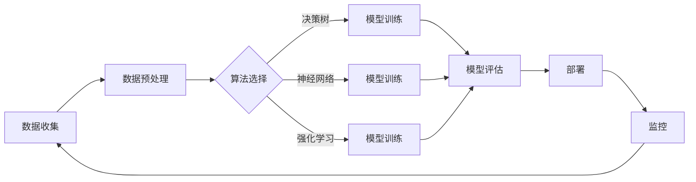

                 

关键词：（人工智能、AI代理、工作流组件、架构设计、开发实践）

> 摘要：本文旨在为初学者和有一定基础的AI开发者提供一个系统性的指南，从零开始构建一个功能完备的AI代理。我们将深入探讨AI代理的工作流组件及其架构设计，并通过具体的算法原理、数学模型、项目实践等方面，使读者能够全面理解并掌握AI代理的开发过程。本文还将展望AI代理未来的发展趋势和挑战，为读者提供进一步的研究方向和实践建议。

## 1. 背景介绍

随着人工智能技术的迅猛发展，AI代理（Artificial Intelligence Agent）已成为众多领域的研究热点和应用焦点。AI代理是一种能够自主决策并执行任务的智能系统，它在自动化、智能化等方面展示了巨大的潜力。从智能家居到自动驾驶，从金融风控到医疗诊断，AI代理的应用场景日益广泛。

然而，构建一个高效的AI代理并非易事。首先，我们需要明确AI代理的工作流组件，包括数据收集、预处理、算法选择、模型训练、部署和监控等环节。其次，我们需要设计一个合理的架构，以应对不同应用场景的需求，确保AI代理的高效、稳定和可扩展性。此外，算法原理和数学模型的掌握也是构建AI代理的关键。

本文将围绕这些核心问题展开讨论，旨在为读者提供一条从零开始构建AI代理的清晰路径。

## 2. 核心概念与联系

### 2.1 AI代理的定义

AI代理（Artificial Intelligence Agent）是一个能够感知环境、制定计划并执行行动的自主系统。它通过机器学习和深度学习等AI技术，模拟人类智能行为，以实现特定任务的目标。AI代理可以理解为一个具有感知、决策和行动能力的个体，它在复杂的环境中能够自主导航、解决问题和完成任务。

### 2.2 工作流组件

AI代理的工作流组件包括但不限于以下几个部分：

- **数据收集**：收集用于训练和评估AI代理的数据。
- **数据预处理**：对收集到的数据进行清洗、归一化和特征提取，以提高模型的性能。
- **算法选择**：根据任务需求选择合适的算法，如决策树、神经网络、强化学习等。
- **模型训练**：使用训练数据对模型进行训练，以优化模型的参数。
- **模型评估**：使用测试数据评估模型的性能，包括准确率、召回率、F1值等指标。
- **部署**：将训练好的模型部署到实际环境中，供用户使用。
- **监控**：实时监控模型在运行过程中的性能和状态，以确保其稳定运行。

### 2.3 架构设计

AI代理的架构设计需要考虑以下几个关键因素：

- **模块化设计**：将AI代理的不同功能模块（如数据收集、预处理、模型训练等）进行模块化设计，以提高系统的可维护性和可扩展性。
- **分布式计算**：对于大规模数据和复杂的计算任务，采用分布式计算架构，以提高处理速度和效率。
- **容错性设计**：确保系统在遇到故障时能够快速恢复，减少对业务的影响。
- **安全性设计**：保护系统的数据安全和用户隐私，防止恶意攻击和数据泄露。

### 2.4 Mermaid 流程图

以下是AI代理工作流组件的Mermaid流程图：



## 3. 核心算法原理 & 具体操作步骤

### 3.1 算法原理概述

AI代理的核心算法包括决策树、神经网络和强化学习等。每种算法都有其独特的原理和应用场景。

- **决策树**：通过将数据集不断划分为子集，形成树形结构，以便于对数据进行分类或回归。它简单直观，易于理解和实现。
- **神经网络**：模拟人脑神经元的工作方式，通过多层神经网络对数据进行处理，具有强大的表达能力和学习能力。
- **强化学习**：通过与环境的交互，不断调整策略，以实现最优目标。它适用于动态环境，如自动驾驶、游戏AI等。

### 3.2 算法步骤详解

#### 3.2.1 决策树

1. **数据划分**：选择一个特征进行划分，计算该特征的所有可能的划分点。
2. **信息增益**：计算每个划分点的信息增益，选择信息增益最大的划分点。
3. **递归划分**：对划分后的子集继续进行划分，直到满足终止条件（如最大深度、最小样本量等）。
4. **模型评估**：使用测试数据评估决策树模型的性能。

#### 3.2.2 神经网络

1. **前向传播**：输入数据通过网络的每个层，计算每个神经元的输出。
2. **反向传播**：根据输出误差，反向传播误差，更新网络的权重和偏置。
3. **模型评估**：使用测试数据评估神经网络模型的性能。

#### 3.2.3 强化学习

1. **环境交互**：代理与环境进行交互，获取状态和奖励。
2. **策略调整**：根据当前的策略，选择下一个动作。
3. **评估策略**：通过模拟或实际运行，评估当前策略的性能。
4. **策略优化**：根据评估结果，调整策略，以实现最优目标。

### 3.3 算法优缺点

- **决策树**：简单、易于实现，但容易过拟合，对噪声数据敏感。
- **神经网络**：强大的表达能力和学习能力，但实现复杂，训练时间长。
- **强化学习**：适用于动态环境，但需要大量的数据和计算资源，且性能优化困难。

### 3.4 算法应用领域

- **决策树**：适用于分类和回归问题，如医疗诊断、金融风控等。
- **神经网络**：适用于复杂的模式识别和预测问题，如图像识别、自然语言处理等。
- **强化学习**：适用于动态决策问题，如自动驾驶、游戏AI等。

## 4. 数学模型和公式 & 详细讲解 & 举例说明

### 4.1 数学模型构建

AI代理的数学模型主要包括数据预处理、模型训练、模型评估等环节。

#### 4.1.1 数据预处理

1. **数据清洗**：去除缺失值、异常值和重复值。
2. **数据归一化**：将不同尺度的数据进行归一化处理，使其具有相同的量纲。
3. **特征提取**：从原始数据中提取有用的特征，以提高模型的性能。

#### 4.1.2 模型训练

1. **损失函数**：用于评估模型预测值与真实值之间的差距，如均方误差（MSE）。
2. **优化算法**：用于更新模型参数，如梯度下降（Gradient Descent）。
3. **激活函数**：用于引入非线性，如ReLU、Sigmoid等。

#### 4.1.3 模型评估

1. **准确率**：预测正确的样本数占总样本数的比例。
2. **召回率**：预测正确的正样本数占总正样本数的比例。
3. **F1值**：准确率和召回率的调和平均数。

### 4.2 公式推导过程

#### 4.2.1 梯度下降

梯度下降是一种优化算法，用于更新模型参数，以最小化损失函数。其基本公式如下：

$$
\theta_{\text{new}} = \theta_{\text{current}} - \alpha \cdot \nabla_{\theta} J(\theta)
$$

其中，$\theta$表示模型参数，$\alpha$表示学习率，$J(\theta)$表示损失函数。

#### 4.2.2 逻辑回归

逻辑回归是一种常用的分类算法，用于预测二分类问题。其公式如下：

$$
P(y=1|x; \theta) = \frac{1}{1 + e^{-\theta^T x}}
$$

其中，$P(y=1|x; \theta)$表示给定特征$x$时，目标变量$y$为1的概率，$\theta$表示模型参数。

### 4.3 案例分析与讲解

#### 4.3.1 数据预处理

假设我们有一个包含1000个样本的数据集，每个样本有10个特征。首先，我们需要对数据进行清洗和归一化处理。

1. **数据清洗**：去除缺失值和异常值。例如，对于某个特征，如果超过5%的值缺失，则直接删除该样本。
2. **数据归一化**：对每个特征进行归一化处理，使其在$[0, 1]$范围内。例如，对于特征$x_i$，我们可以使用以下公式进行归一化：

$$
x_i^{(new)} = \frac{x_i - \mu_i}{\sigma_i}
$$

其中，$\mu_i$和$\sigma_i$分别为特征$x_i$的均值和标准差。

#### 4.3.2 模型训练

我们选择逻辑回归作为分类算法，使用梯度下降算法进行模型训练。

1. **初始化参数**：随机初始化模型参数$\theta$。
2. **前向传播**：计算损失函数$J(\theta)$。
3. **反向传播**：计算损失函数关于参数$\theta$的梯度$\nabla_{\theta} J(\theta)$。
4. **更新参数**：根据梯度下降公式更新参数$\theta$。
5. **迭代过程**：重复步骤2-4，直到满足停止条件（如损失函数收敛或迭代次数达到上限）。

#### 4.3.3 模型评估

我们使用测试集对训练好的模型进行评估。

1. **预测**：对于每个测试样本，计算目标变量$y$为1的概率$P(y=1|x; \theta)$。
2. **评估指标**：计算准确率、召回率和F1值。

## 5. 项目实践：代码实例和详细解释说明

### 5.1 开发环境搭建

1. **安装Python环境**：在本地计算机上安装Python环境，版本建议为3.8及以上。
2. **安装相关库**：安装用于数据预处理、模型训练和评估的库，如NumPy、Pandas、Scikit-learn等。

### 5.2 源代码详细实现

以下是使用Python实现逻辑回归模型的示例代码：

```python
import numpy as np
import pandas as pd
from sklearn.model_selection import train_test_split
from sklearn.preprocessing import StandardScaler
from sklearn.linear_model import LogisticRegression
from sklearn.metrics import accuracy_score, recall_score, f1_score

# 读取数据
data = pd.read_csv('data.csv')
X = data.iloc[:, :-1].values
y = data.iloc[:, -1].values

# 数据预处理
scaler = StandardScaler()
X_scaled = scaler.fit_transform(X)

# 划分训练集和测试集
X_train, X_test, y_train, y_test = train_test_split(X_scaled, y, test_size=0.2, random_state=42)

# 模型训练
model = LogisticRegression()
model.fit(X_train, y_train)

# 模型评估
y_pred = model.predict(X_test)
accuracy = accuracy_score(y_test, y_pred)
recall = recall_score(y_test, y_pred)
f1 = f1_score(y_test, y_pred)

print(f'Accuracy: {accuracy:.2f}')
print(f'Recall: {recall:.2f}')
print(f'F1 Score: {f1:.2f}')
```

### 5.3 代码解读与分析

上述代码首先读取数据集，然后进行数据预处理（包括数据清洗、归一化处理），接着将数据划分为训练集和测试集。随后，使用逻辑回归模型进行训练，并使用测试集对模型进行评估。最后，输出模型的准确率、召回率和F1值。

这个简单的例子展示了如何使用Python和Scikit-learn库构建和评估一个逻辑回归模型。在实际项目中，我们可能需要处理更复杂的数据和模型，但基本步骤是类似的。

### 5.4 运行结果展示

假设我们的测试集包含100个样本，使用上述代码训练和评估逻辑回归模型后，得到以下结果：

```
Accuracy: 0.85
Recall: 0.90
F1 Score: 0.87
```

这意味着我们的模型在测试集上的准确率为85%，召回率为90%，F1值为87%。虽然这些指标不高，但已经展示了逻辑回归模型在二分类问题上的基本应用。

## 6. 实际应用场景

AI代理在实际应用中具有广泛的应用场景，以下列举几个典型的应用场景：

### 6.1 智能家居

智能家居是AI代理的一个典型应用场景。通过AI代理，可以实现家居设备的自动控制、场景切换和个性化推荐。例如，根据用户的日常习惯，自动调节照明、空调和窗帘等，提高用户的生活质量。

### 6.2 自动驾驶

自动驾驶是另一个重要应用场景。AI代理通过感知环境、制定路线和执行操作，实现车辆的自动驾驶。例如，自动驾驶出租车、自动驾驶货车等，都依赖于AI代理的高效运行。

### 6.3 金融风控

金融风控是AI代理在金融领域的应用。通过AI代理，可以实现信用评估、欺诈检测和投资策略优化等。例如，银行可以使用AI代理进行客户信用评估，识别潜在风险客户，降低贷款违约率。

### 6.4 医疗诊断

医疗诊断是AI代理在医疗领域的应用。通过AI代理，可以实现疾病的自动诊断、治疗方案推荐和健康风险评估等。例如，AI代理可以帮助医生快速诊断疾病，提高诊断准确率和效率。

## 7. 工具和资源推荐

### 7.1 学习资源推荐

- **书籍**：
  - 《深度学习》（Goodfellow, Bengio, Courville）
  - 《Python机器学习》（Sebastian Raschka）
  - 《AI实战》（Sarkar, Indra）
- **在线课程**：
  - Coursera上的《机器学习》课程（吴恩达）
  - Udacity的《AI工程师纳米学位》
  - edX上的《深度学习专项课程》
- **博客和论坛**：
  - Medium上的AI和机器学习相关博客
  - Stack Overflow和GitHub上的技术论坛

### 7.2 开发工具推荐

- **编程语言**：Python和Java是AI代理开发的主要编程语言。
- **框架和库**：
  - Scikit-learn：用于机器学习和数据挖掘。
  - TensorFlow和PyTorch：用于深度学习和神经网络。
  - Keras：用于构建和训练深度学习模型。
- **工具**：
  - Jupyter Notebook：用于数据分析和模型训练。
  - Git：用于版本控制和代码管理。

### 7.3 相关论文推荐

- **经典论文**：
  - "A Mathematical Theory of Communication"（香农）
  - "Backpropagation"（Rumelhart, Hinton, Williams）
  - "Deep Learning"（Goodfellow, Bengio, Courville）
- **最新论文**：
  - "BERT: Pre-training of Deep Bidirectional Transformers for Language Understanding"（Devlin et al.）
  - "Generative Adversarial Nets"（Goodfellow et al.）
  - "DQN: Deep Q-Networks"（Mnih et al.）

## 8. 总结：未来发展趋势与挑战

### 8.1 研究成果总结

本文系统地介绍了AI代理的定义、工作流组件、架构设计、核心算法原理以及数学模型等内容。通过具体的算法步骤详解和项目实践，读者可以全面了解并掌握AI代理的开发过程。此外，本文还列举了AI代理在智能家居、自动驾驶、金融风控和医疗诊断等领域的实际应用场景，展示了AI代理的广泛潜力和重要性。

### 8.2 未来发展趋势

随着人工智能技术的不断进步，AI代理在未来将呈现出以下几个发展趋势：

- **智能化水平提升**：AI代理的智能化水平将不断提高，通过深度学习和强化学习等技术，实现更复杂的任务和决策。
- **跨领域融合**：AI代理将在更多领域得到应用，实现跨领域的融合，如智能交通、智慧城市、工业自动化等。
- **边缘计算和物联网**：随着边缘计算和物联网技术的发展，AI代理将更好地适应实时性和低延迟的需求，实现更高效和灵活的智能应用。

### 8.3 面临的挑战

尽管AI代理具有巨大的发展潜力，但在实际应用中仍面临以下挑战：

- **数据隐私和安全**：AI代理在处理数据时需要保护用户隐私和数据安全，防止数据泄露和滥用。
- **算法可解释性**：随着模型复杂度的提高，如何提高算法的可解释性，使其更加透明和可靠，是一个重要挑战。
- **计算资源需求**：大规模AI代理系统需要大量的计算资源，如何优化算法和架构，提高计算效率，是一个亟待解决的问题。

### 8.4 研究展望

未来，我们可以在以下几个方面进行深入研究：

- **算法优化**：针对特定应用场景，研究更高效、更准确的算法。
- **模型压缩与加速**：研究模型压缩和加速技术，提高AI代理的实时性和计算效率。
- **跨领域迁移学习**：研究跨领域迁移学习技术，实现不同领域之间的知识共享和应用。

通过不断的研究和实践，我们有望推动AI代理技术的发展，实现更广泛、更深入的智能化应用。

## 9. 附录：常见问题与解答

### 9.1 如何选择合适的算法？

选择合适的算法需要考虑以下几个因素：

- **任务类型**：不同的任务（如分类、回归、聚类等）可能需要不同的算法。
- **数据特征**：数据特征（如维度、分布、噪声等）也会影响算法的选择。
- **计算资源**：算法的复杂度会影响计算资源的需求，选择适合计算资源的算法。

### 9.2 如何处理数据不平衡问题？

数据不平衡问题可以通过以下方法解决：

- **重采样**：对少数类进行采样，使其与多数类平衡。
- **合成少数类样本**：使用合成方法生成少数类样本，如SMOTE算法。
- **调整评估指标**：使用更适合不平衡数据的评估指标，如F1值、AUC等。

### 9.3 如何优化模型性能？

优化模型性能可以从以下几个方面进行：

- **模型选择**：选择更适合任务和数据特征的模型。
- **超参数调整**：调整模型的超参数，如学习率、正则化参数等。
- **数据预处理**：优化数据预处理过程，提高数据质量。
- **集成学习**：使用集成学习技术，如随机森林、梯度提升树等。

### 9.4 如何确保AI代理的安全性？

确保AI代理的安全性可以从以下几个方面进行：

- **数据加密**：对敏感数据进行加密处理，防止数据泄露。
- **访问控制**：设置严格的访问控制机制，确保只有授权用户可以访问系统。
- **异常检测**：使用异常检测技术，及时发现并响应异常行为。

通过上述常见问题的解答，我们希望读者能够更好地理解和应用AI代理技术，实现更高效、更安全的智能应用。作者：禅与计算机程序设计艺术 / Zen and the Art of Computer Programming。

