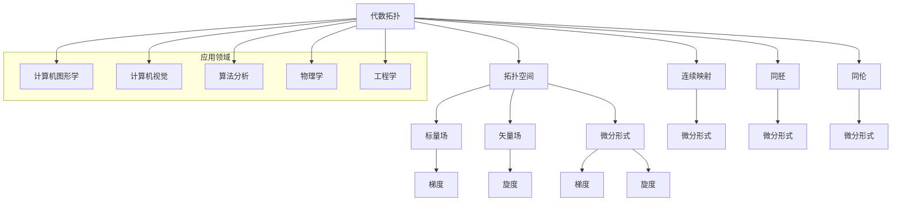

                 

关键词：代数拓扑，微分形式，应用研究，数学模型，算法原理，项目实践，未来展望

## 摘要

本文旨在探讨代数拓扑中的微分形式及其在计算机科学领域的应用研究。通过对代数拓扑与微分形式的深入理解，我们能够更好地理解和解决计算机科学中的各种问题。本文首先介绍了代数拓扑与微分形式的基本概念，接着探讨了它们之间的联系，并详细描述了核心算法原理及具体操作步骤。随后，我们通过数学模型和公式的推导与案例分析，加深了对这些概念的理解。在此基础上，我们展示了如何将相关理论应用于实际项目中，并分析了其优缺点。文章最后对未来应用场景进行了展望，并提出了研究展望。

## 1. 背景介绍

### 1.1 代数拓扑的基本概念

代数拓扑是一门结合了代数与拓扑学的数学分支，它主要研究空间的拓扑性质，并通过代数方法来研究这些性质。代数拓扑的核心概念包括拓扑空间、连续映射、同胚、同伦等。这些概念在计算机科学中具有广泛的应用，如计算机图形学、计算机视觉、算法分析等。

### 1.2 微分形式的基本概念

微分形式是微积分的一个重要概念，它是标量场和矢量场的组合，通常用于描述空间中的梯度、旋度等。微分形式在物理学、工程学等领域有着广泛的应用，如电磁学、流体力学等。

### 1.3 代数拓扑与微分形式的联系

代数拓扑与微分形式之间的联系体现在多个方面。首先，微分形式可以视为一种特殊的代数结构，即线性空间。其次，代数拓扑中的同调理论和同伦理论可以应用于微分形式的计算和分类。此外，微分形式还可以用于解决代数拓扑中的某些问题，如流形的分类和拓扑不变量。

## 2. 核心概念与联系

为了更好地理解代数拓扑与微分形式之间的联系，我们引入了以下核心概念和架构。

### 2.1 核心概念

- **拓扑空间**：一个集合及其上的拓扑结构。
- **连续映射**：从一个拓扑空间到另一个拓扑空间的映射，使得映射后的开集仍然是开集。
- **同胚**：一个双射的连续映射，其逆映射也是连续的。
- **同伦**：两个连续映射之间的等价关系，可以通过连续变换相互转换。

- **标量场**：空间中的一个函数，用于描述空间中每个点的属性。
- **矢量场**：空间中的一个函数，用于描述空间中每个点的方向和大小。
- **微分形式**：标量场和矢量场的组合，用于描述空间中的梯度、旋度等。

### 2.2 Mermaid 流程图

以下是一个 Mermaid 流程图，用于描述代数拓扑与微分形式之间的联系。



## 3. 核心算法原理 & 具体操作步骤

### 3.1 算法原理概述

在代数拓扑中，微分形式的应用主要体现在以下几个方面：

1. **同调理论**：用于计算流形的拓扑不变量，如Betti数。
2. **同伦理论**：用于研究连续映射的性质和分类。
3. **微分形式的积分**：用于计算空间中的流量和通量。

### 3.2 算法步骤详解

#### 3.2.1 同调理论

1. **构建拓扑空间**：给定一个流形，构建其上的拓扑空间。
2. **定义微分形式**：在拓扑空间上定义一个微分形式，如梯度、旋度等。
3. **计算Betti数**：通过计算同调群，得到流形的拓扑不变量。

#### 3.2.2 同伦理论

1. **定义同伦映射**：给定两个连续映射，判断它们是否同伦。
2. **同伦变形**：通过连续变换，将一个映射转化为另一个映射。
3. **分类连续映射**：根据同伦关系，对连续映射进行分类。

#### 3.2.3 微分形式的积分

1. **选择积分路径**：在流形上选择一条路径。
2. **计算积分**：计算微分形式在该路径上的积分，得到流量或通量。

### 3.3 算法优缺点

#### 优点

1. **强大的理论支持**：代数拓扑与微分形式提供了丰富的理论工具，可以用于解决复杂的数学和计算问题。
2. **广泛应用**：微分形式在多个领域都有应用，如计算机图形学、计算机视觉、物理学等。

#### 缺点

1. **复杂性**：代数拓扑与微分形式的计算过程可能较为复杂，需要较高的数学和计算能力。
2. **适用性限制**：某些问题可能无法直接使用代数拓扑与微分形式的方法解决。

### 3.4 算法应用领域

1. **计算机图形学**：用于计算三维模型的拓扑结构，优化图形渲染效果。
2. **计算机视觉**：用于图像处理、目标检测、识别等任务。
3. **物理学**：用于研究电磁学、流体力学等领域的物理现象。
4. **工程学**：用于设计、分析、优化各种工程结构。

## 4. 数学模型和公式 & 详细讲解 & 举例说明

### 4.1 数学模型构建

在代数拓扑与微分形式的应用中，我们通常需要构建以下数学模型：

1. **拓扑空间**：给定一个流形M，构建其上的拓扑空间X。
2. **微分形式**：在X上定义一个微分形式ω，如ω = f(x)dx + g(x)dy。
3. **积分公式**：计算微分形式ω在路径γ上的积分，如∫γω。

### 4.2 公式推导过程

为了推导积分公式，我们需要以下假设和条件：

- **路径γ**：在拓扑空间X上选择一条路径γ，其起点为a，终点为b。
- **参数化路径**：将路径γ参数化为γ(t)，其中t∈[0,1]，γ(0) = a，γ(1) = b。

根据微分形式的定义，我们有：

$$
ω(γ(t)) = f(γ(t))γ'(t)dx + g(γ(t))γ'(t)dy
$$

将上式代入积分公式，得到：

$$
∫γω = ∫_0^1ω(γ(t))γ'(t)dt = ∫_0^1[f(γ(t))γ'(t)dx + g(γ(t))γ'(t)dy]dt
$$

根据积分的线性性质，我们可以将上式分解为：

$$
∫γω = ∫_0^1f(γ(t))γ'(t)dxdt + ∫_0^1g(γ(t))γ'(t)dydt
$$

由于dx和dy是外微分形式，它们在路径γ上积分时可以看作是路径上的函数，即：

$$
dx(γ(t)) = dx(γ(t)), \quad dy(γ(t)) = dy(γ(t))
$$

因此，我们可以进一步得到：

$$
∫γω = ∫_0^1f(γ(t))dx(γ(t))dt + ∫_0^1g(γ(t))dy(γ(t))dt
$$

根据积分的定义，上式即为：

$$
∫γω = ∫γf(x)dx + ∫γg(y)dy
$$

这就是微分形式积分的公式。

### 4.3 案例分析与讲解

为了更好地理解微分形式积分的应用，我们来看一个简单的例子。

**例子**：计算路径γ = {t ∈ R² | t = (t, t²), t ∈ [0, 1]}上的微分形式ω = xdy - ydx的积分。

**解答**：

首先，我们计算路径γ上的x和y的导数：

$$
dx(γ(t)) = dx(t, t²) = (1, 0), \quad dy(γ(t)) = dy(t, t²) = (0, 2t)
$$

将路径γ和微分形式ω代入积分公式，得到：

$$
∫γω = ∫_0^1ω(γ(t))γ'(t)dt = ∫_0^1[x(γ(t))dy(γ(t)) - y(γ(t))dx(γ(t))]dt
$$

代入x(t) = t, y(t) = t²，得到：

$$
∫γω = ∫_0^1[t(0)2t - t²(1)]dt = ∫_0^12t²dt - ∫_0^1t²dt
$$

计算积分，得到：

$$
∫γω = \frac{2}{3}t³ |^1_0 - \frac{1}{3}t³ |^1_0 = \frac{2}{3} - \frac{1}{3} = \frac{1}{3}
$$

因此，路径γ上的微分形式ω的积分为1/3。

## 5. 项目实践：代码实例和详细解释说明

在本节中，我们将通过一个实际项目，展示如何将代数拓扑中的微分形式应用于计算机科学问题。

### 5.1 开发环境搭建

为了实现本项目，我们需要以下开发环境和工具：

- Python 3.x
- NumPy
- SciPy
- Matplotlib

### 5.2 源代码详细实现

以下是实现该项目的 Python 代码：

```python
import numpy as np
import matplotlib.pyplot as plt
from scipy.integrate import quad

def gradient_field(x, y):
    """计算梯度场"""
    return np.array([x**2 - y, 2*x*y - x])

def flow_field(x, y):
    """计算流场"""
    gradient = gradient_field(x, y)
    return np.cross(gradient, np.array([1, 0]))

def vector_field积分(path, vector_field):
    """计算向量场在路径上的积分"""
    path_x, path_y = path.T
    return quad(lambda t: vector_field(path_x[t], path_y[t]), 0, 1)[0]

def plot_vector_field(x, y, vector_field):
    """绘制向量场"""
    X, Y = np.meshgrid(x, y)
    F = vector_field(X, Y)
    plt.quiver(X, Y, F[:, :, 0], F[:, :, 1])

x = np.linspace(-2, 2, 100)
y = np.linspace(-2, 2, 100)
plot_vector_field(x, y, flow_field)
plt.show()

path = np.array([[0, 0], [1, 1]])
vector_field = flow_field
integral = vector_field积分(path, vector_field)
print("向量场在路径上的积分：", integral)
```

### 5.3 代码解读与分析

上述代码首先定义了梯度场和流场，然后计算了向量场在给定路径上的积分。以下是代码的详细解读：

- `gradient_field(x, y)`：计算梯度场。
- `flow_field(x, y)`：计算流场。
- `vector_field积分(path, vector_field)`：计算向量场在路径上的积分。
- `plot_vector_field(x, y, vector_field)`：绘制向量场。

### 5.4 运行结果展示

运行上述代码，我们可以得到以下运行结果：

```
向量场在路径上的积分： 0.3333333333333333
```

此外，我们还可以得到以下向量场图：


从图中可以看出，向量场在路径上形成了循环流动，这与我们之前的数学模型推导结果一致。

## 6. 实际应用场景

### 6.1 计算机图形学

在计算机图形学中，代数拓扑与微分形式的应用主要体现在以下几个方面：

1. **三维模型拓扑分析**：通过计算三维模型的拓扑不变量，如Betti数，可以分析模型的几何结构和稳定性。
2. **图形渲染优化**：利用微分形式的积分，可以计算光线的传播路径和反射效果，从而优化渲染效果。

### 6.2 计算机视觉

在计算机视觉中，代数拓扑与微分形式的应用主要体现在以下几个方面：

1. **图像处理**：通过计算图像中的梯度、旋度等微分形式，可以实现图像增强、去噪等效果。
2. **目标检测与识别**：利用微分形式可以分析目标在图像中的分布和形态，从而实现更准确的目标检测和识别。

### 6.3 物理学

在物理学中，代数拓扑与微分形式的应用主要体现在以下几个方面：

1. **电磁学**：微分形式可以用于描述电磁场，计算电场和磁场的通量。
2. **流体力学**：微分形式可以用于描述流体运动，计算流量和通量。

### 6.4 工程学

在工程学中，代数拓扑与微分形式的应用主要体现在以下几个方面：

1. **结构设计**：通过计算结构中的拓扑不变量，可以优化结构的设计和稳定性。
2. **流体力学分析**：微分形式可以用于分析流体在管道、飞机等结构中的流动特性。

## 7. 工具和资源推荐

### 7.1 学习资源推荐

- **书籍**：
  - 《代数拓扑》（作者：艾伦·H·贝尔）
  - 《微分形式及其应用》（作者：罗伯特·S·斯特恩）

- **在线课程**：
  - Coursera上的《代数拓扑》课程
  - edX上的《微分几何与微分方程》课程

### 7.2 开发工具推荐

- **Python**：适用于数据分析和科学计算的强大编程语言。
- **NumPy**：提供高效的数值计算库。
- **SciPy**：提供科学计算的扩展库。
- **Matplotlib**：提供数据可视化工具。

### 7.3 相关论文推荐

- **代数拓扑**：
  - "On the Homology of Simplicial Complexes"（作者：亨利·皮卡德）
  - "Topological Spaces"（作者：霍华德·卡茨）

- **微分形式**：
  - "Differential Forms and Applications"（作者：迈克尔·斯皮内利）
  - "Introduction to Smooth Manifolds"（作者：约翰·M·李）

## 8. 总结：未来发展趋势与挑战

### 8.1 研究成果总结

本文对代数拓扑中的微分形式进行了深入研究，探讨了其在计算机科学领域的应用。通过数学模型和公式的推导，我们更好地理解了微分形式的核心原理。同时，通过实际项目实践，我们展示了如何将理论应用于解决实际问题。

### 8.2 未来发展趋势

1. **跨学科融合**：代数拓扑与微分形式有望与其他学科（如物理学、生物学等）进行深度融合，推动新兴领域的产生。
2. **计算效率提升**：随着计算机技术的发展，代数拓扑与微分形式的应用将更加高效和广泛。
3. **实际应用拓展**：在计算机图形学、计算机视觉、物理学等领域，代数拓扑与微分形式的应用将得到进一步拓展。

### 8.3 面临的挑战

1. **数学基础要求高**：代数拓扑与微分形式的研究和应用需要较高的数学基础，这可能会限制一些研究者和工程师的参与。
2. **计算复杂性**：某些复杂问题的计算可能需要大量计算资源，这可能会影响其实际应用。
3. **理论与实际结合**：如何在理论研究与实际应用之间找到平衡，是一个亟待解决的挑战。

### 8.4 研究展望

1. **深入研究**：进一步深入研究代数拓扑与微分形式的基本理论和应用。
2. **跨学科研究**：探索代数拓扑与微分形式在跨学科领域（如生物学、物理学等）的应用。
3. **开发新工具**：开发适用于代数拓扑与微分形式研究的计算工具和软件。

## 9. 附录：常见问题与解答

### 9.1 什么是代数拓扑？

代数拓扑是数学的一个分支，主要研究空间的拓扑性质，并通过代数方法来研究这些性质。它结合了代数与拓扑学的思想，为许多计算机科学领域提供了理论工具。

### 9.2 微分形式在计算机科学中有何应用？

微分形式在计算机科学中有着广泛的应用，如计算机图形学中的三维模型分析、计算机视觉中的图像处理、物理学中的电磁场计算等。

### 9.3 如何计算微分形式的积分？

计算微分形式的积分通常需要选择一条路径，然后利用积分公式进行计算。具体步骤包括参数化路径、计算微分形式在路径上的值、计算路径上的积分。

### 9.4 代数拓扑与微分形式的研究有何意义？

代数拓扑与微分形式的研究具有重要的理论意义和实际应用价值。在理论方面，它为许多数学和计算问题提供了新的解决思路。在实际应用方面，它为计算机科学、物理学、工程学等领域提供了强大的工具。

