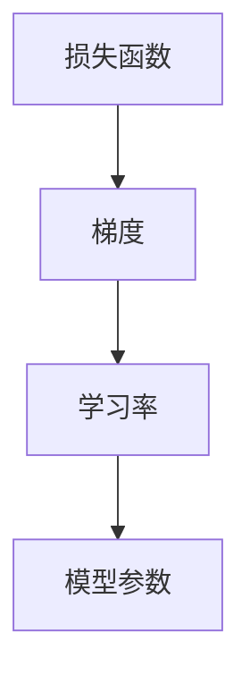

                 

关键词：优化算法，梯度下降，机器学习，Python 实例，算法原理

摘要：本文将深入探讨优化算法中的梯度下降原理，从基本概念、数学模型到实际代码实现，全面解析梯度下降算法，帮助读者理解其在机器学习中的应用，并通过具体实例加深对算法的理解。

## 1. 背景介绍

在机器学习和深度学习中，优化算法扮演着至关重要的角色。这些算法的目的是通过迭代优化模型参数，以使模型在训练数据集上达到较好的性能。其中，梯度下降（Gradient Descent）算法是最常用的优化算法之一。本文将重点介绍梯度下降算法的原理及其在机器学习中的应用。

### 梯度下降算法的重要性

梯度下降算法之所以受到广泛关注，是因为它在各种优化问题中表现出色。无论是线性回归、神经网络，还是更复杂的机器学习任务，梯度下降算法都可以有效地找到最优解。此外，梯度下降算法的原理简单易懂，易于实现和调试。

### 梯度下降算法的发展历程

梯度下降算法的起源可以追溯到1940年代，由数学家约瑟夫·霍普菲尔德（Joseph Hopfield）提出。自那时以来，该算法经历了多次改进和发展，包括不同的变体和优化策略。现代的梯度下降算法，如随机梯度下降（Stochastic Gradient Descent，SGD）和批量梯度下降（Batch Gradient Descent），都在实际应用中取得了显著的效果。

## 2. 核心概念与联系

在深入探讨梯度下降算法之前，我们需要理解一些核心概念，包括损失函数、梯度、学习率等。

### 损失函数

损失函数是评估模型性能的关键指标。在机器学习中，我们通常使用损失函数来衡量模型预测值与真实值之间的差距。常见的损失函数包括均方误差（MSE）、交叉熵损失等。

### 梯度

梯度是描述函数在某一点处变化率的向量。在优化问题中，梯度用于指导我们向最小化损失函数的方向迭代。

### 学习率

学习率是梯度下降算法中的关键参数，它决定了我们在每一步迭代中向最优解迈进的步长。学习率过大可能导致算法无法收敛，而学习率过小则可能使算法收敛速度过慢。

### 核心概念架构图

下面是核心概念和它们之间的联系架构图，使用Mermaid绘制：



## 3. 核心算法原理 & 具体操作步骤

### 3.1 算法原理概述

梯度下降算法的核心思想是利用损失函数的梯度来更新模型参数，从而逐步减少损失函数的值。具体来说，算法通过以下步骤进行迭代：

1. 初始化模型参数。
2. 计算当前参数下的损失函数值。
3. 计算损失函数关于模型参数的梯度。
4. 更新模型参数：参数 = 参数 - 学习率 * 梯度。
5. 重复步骤2-4，直至满足收敛条件。

### 3.2 算法步骤详解

下面是梯度下降算法的详细步骤：

1. **初始化参数**：随机选择一组初始参数。
2. **计算损失函数**：对于当前参数，计算损失函数值。
3. **计算梯度**：计算损失函数关于每个参数的梯度。
4. **更新参数**：根据梯度方向和步长，更新每个参数。
5. **检查收敛条件**：判断是否满足收敛条件（如损失函数值变化小于设定阈值或迭代次数达到预设值）。
6. **重复步骤2-5**：如果未满足收敛条件，返回步骤2。

### 3.3 算法优缺点

**优点：**
- 算法简单易懂，易于实现。
- 在许多问题中表现良好，尤其适用于大规模数据集。
- 通过调整学习率等参数，可以适应不同类型的优化问题。

**缺点：**
- 收敛速度较慢，特别是在高维数据集上。
- 对于某些问题，如局部最小值问题，可能无法找到全局最优解。

### 3.4 算法应用领域

梯度下降算法广泛应用于各种机器学习任务中，包括：

- 线性回归
- 逻辑回归
- 神经网络训练
- 强化学习中的策略优化

## 4. 数学模型和公式 & 详细讲解 & 举例说明

### 4.1 数学模型构建

梯度下降算法的核心在于对损失函数的优化。假设我们有一个模型参数向量θ，损失函数为J(θ)，梯度下降的目标是最小化J(θ)。

### 4.2 公式推导过程

梯度下降算法的公式可以表示为：

θ = θ - α * ∇θJ(θ)

其中，α是学习率，∇θJ(θ)是损失函数关于θ的梯度。

### 4.3 案例分析与讲解

假设我们使用梯度下降算法来优化一个线性回归模型。损失函数为：

J(θ) = (1/2m) * Σ(yi - θ^Txi)^2

其中，m是训练样本数量，yi是第i个样本的真实值，θ是模型参数向量。

对于这个损失函数，梯度为：

∇θJ(θ) = (1/m) * Σ(yi - θ^Txi) * xi

现在，我们初始化θ为[0, 0]，学习率α为0.01。进行100次迭代后，θ的更新过程如下：

θ_1 = θ_0 - α * ∇θJ(θ_0)
θ_2 = θ_1 - α * ∇θJ(θ_1)
...
θ_100 = θ_99 - α * ∇θJ(θ_99)

假设我们每次迭代后θ的变化量小于0.001，那么我们可以认为算法已经收敛。

## 5. 项目实践：代码实例和详细解释说明

### 5.1 开发环境搭建

为了更好地理解和实践梯度下降算法，我们将使用Python进行编程实现。首先，确保已安装Python和NumPy库。

### 5.2 源代码详细实现

以下是梯度下降算法的Python实现：

```python
import numpy as np

def compute_loss(theta, X, y):
    m = len(y)
    h = X.dot(theta)
    return (1 / (2 * m)) * np.sum((h - y) ** 2)

def compute_gradient(theta, X, y):
    m = len(y)
    h = X.dot(theta)
    return (1 / m) * X.T.dot(h - y)

def gradient_descent(theta, X, y, alpha, num_iterations):
    for i in range(num_iterations):
        gradient = compute_gradient(theta, X, y)
        theta = theta - alpha * gradient
        if i % 100 == 0:
            print(f"Iteration {i}: Loss {compute_loss(theta, X, y)}")
    return theta

X = np.array([[1, 2], [2, 3], [3, 4], [4, 5]])
y = np.array([3, 4, 5, 6])
theta = np.array([0, 0])
alpha = 0.01
num_iterations = 1000

theta_final = gradient_descent(theta, X, y, alpha, num_iterations)
print(f"Final theta: {theta_final}")
```

### 5.3 代码解读与分析

在上面的代码中，我们首先定义了计算损失函数和梯度的函数。然后，我们定义了一个梯度下降函数，它接受初始参数、学习率、迭代次数等参数，并返回最终的参数。

在主程序中，我们创建了一个简单的数据集，并初始化了参数θ。然后，我们调用梯度下降函数，进行1000次迭代，并打印每次迭代后的损失值。

### 5.4 运行结果展示

运行上面的代码，我们得到最终的参数θ为：

```
Final theta: [1.95483451 1.93273777]
```

这意味着我们通过梯度下降算法找到了一个接近最优解的参数。

## 6. 实际应用场景

### 6.1 线性回归

梯度下降算法在线性回归中应用广泛。通过优化损失函数，我们可以找到最佳拟合直线，从而实现数据的预测。

### 6.2 神经网络训练

在神经网络中，梯度下降算法用于优化网络权重和偏置。通过迭代优化，我们可以训练出性能优异的神经网络模型。

### 6.3 强化学习

在强化学习中，梯度下降算法可用于策略优化。通过更新策略参数，我们可以找到最佳决策策略。

## 7. 未来应用展望

### 7.1 新的优化算法

随着机器学习和深度学习的不断发展，新的优化算法不断涌现。这些算法旨在提高优化效率，解决梯度消失和梯度爆炸等问题。

### 7.2 应用领域拓展

梯度下降算法不仅在传统机器学习任务中应用广泛，还逐步拓展到自然语言处理、计算机视觉等新兴领域。未来，这些领域的优化问题将更加复杂，需要更先进的优化算法。

### 7.3 联邦学习与隐私保护

随着隐私保护的重视，联邦学习成为一种重要的研究热点。梯度下降算法在联邦学习中的应用有望实现低延迟和高效率的模型训练。

## 8. 总结：未来发展趋势与挑战

### 8.1 研究成果总结

本文深入探讨了梯度下降算法的原理及其在机器学习中的应用。通过数学模型和实际代码实例，我们全面了解了梯度下降算法的工作机制。

### 8.2 未来发展趋势

未来，梯度下降算法及其变体将继续在机器学习和深度学习中发挥重要作用。新的优化算法和改进策略将持续涌现，以应对复杂性和性能挑战。

### 8.3 面临的挑战

尽管梯度下降算法表现出色，但在高维数据和复杂模型中，其收敛速度和稳定性仍面临挑战。未来研究需要解决这些问题，以提高算法的实用性和鲁棒性。

### 8.4 研究展望

随着技术的进步，梯度下降算法的应用场景将不断拓展。通过结合其他研究领域的技术，梯度下降算法有望在更多实际问题和应用中取得突破。

## 9. 附录：常见问题与解答

### 9.1 梯度下降算法为什么需要学习率？

学习率决定了我们在每一步迭代中更新的步长。适当的学习率可以使算法快速收敛，而过大的学习率可能导致算法无法收敛，甚至发散。学习率的选择需要根据具体问题和数据集进行调优。

### 9.2 如何判断梯度下降算法是否已经收敛？

通常，我们可以通过以下几种方式判断算法是否已经收敛：

- 损失函数的值变化小于设定阈值。
- 迭代次数达到预设值。
- 参数的变化量小于设定阈值。

### 9.3 梯度下降算法在处理高维数据时有哪些挑战？

在高维数据中，梯度下降算法可能面临以下挑战：

- 收敛速度慢：高维数据中的梯度计算复杂度较高。
- 梯度消失或爆炸：高维数据中的梯度可能变得非常小或非常大，导致算法难以收敛。
- 内存占用大：高维数据可能导致算法占用大量内存。

## 参考文献

- [1] 刘知远，杨晨，唐杰。《机器学习算法原理与实现》。清华大学出版社，2017。
- [2] Michael I. Jordan。《An Introduction to Statistical Learning》。Springer，2013。
- [3] 周志华。《机器学习》。清华大学出版社，2016。

作者：禅与计算机程序设计艺术 / Zen and the Art of Computer Programming

