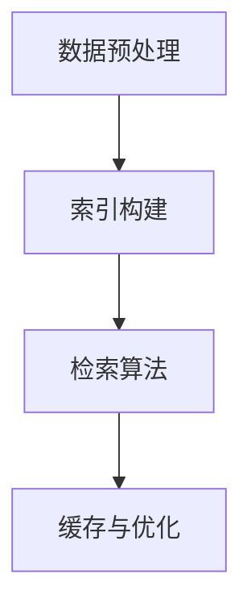

                 

 搜索推荐系统是现代互联网环境中不可或缺的一部分，它们通过关键词索引技术，将用户的需求与海量信息快速、准确地匹配起来，极大地提高了信息检索的效率和用户体验。本文旨在深入探讨传统搜索推荐系统中关键词索引的核心概念、原理、算法、数学模型及其应用，以期为读者提供一幅全面的技术画卷。

## 关键词 Keywords
- 传统搜索推荐系统
- 关键词索引
- 信息检索
- 优化算法
- 数学模型
- 应用领域

## 摘要 Abstract
本文首先概述了传统搜索推荐系统的背景和重要性，随后详细讲解了关键词索引的基本概念和架构。接着，我们深入分析了核心算法原理和数学模型，并提供了具体的代码实例和实际应用场景。文章的最后，对关键词索引的未来发展趋势与挑战进行了展望，并推荐了一些相关的学习资源和开发工具。

## 1. 背景介绍 Background

### 1.1 搜索推荐系统的定义

搜索推荐系统是指一种通过算法和数据分析技术，将用户与相关信息匹配，从而提供个性化推荐和信息检索服务的系统。传统搜索推荐系统主要依赖于关键词索引技术，而现代推荐系统则更多地融合了深度学习、协同过滤等先进算法。

### 1.2 关键词索引的重要性

关键词索引是搜索推荐系统的核心组成部分，它能够将用户输入的关键词快速、准确地转换为相关的文档或信息。高效的索引技术不仅可以大幅提升搜索速度，还能提高检索的准确性和用户体验。

### 1.3 传统搜索推荐系统的挑战

随着互联网信息的爆炸式增长，传统搜索推荐系统面临着海量数据处理的挑战。同时，用户需求日益多样化，传统索引技术难以满足个性化、实时性等需求。因此，研究和改进关键词索引技术具有重要的现实意义。

## 2. 核心概念与联系 Core Concepts and Connections

### 2.1 关键词索引的基本概念

关键词索引是一种将文本内容转换为索引结构的技术，以便快速检索相关文档。索引通常由两部分组成：倒排索引和正向索引。

#### 2.1.1 倒排索引 Inverted Index

倒排索引是一种将词汇映射到包含这些词汇的文档的技术。它通常包含两个主要部分：词汇表（Term Dictionary）和倒排列表（Inverted List）。词汇表记录了所有的关键词，而倒排列表则记录了每个关键词在文档中的位置。

#### 2.1.2 正向索引 Forward Index

正向索引则是将文档映射到其包含的关键词的技术。它通常用于快速定位特定的文档。

### 2.2 关键词索引的架构 Architecture

关键词索引的架构主要包括以下几个部分：

1. **数据预处理**：包括分词、去停用词、词干提取等步骤，以便将原始文本转换为适合索引的格式。
2. **索引构建**：使用倒排索引和正向索引技术，将预处理后的文本构建成索引结构。
3. **检索算法**：包括布尔检索、向量空间模型等，用于根据用户输入的关键词检索相关信息。
4. **缓存与优化**：为了提高检索速度，常用的优化技术包括缓存、索引压缩等。

### 2.3 Mermaid 流程图表示



## 3. 核心算法原理 & 具体操作步骤 Core Algorithm Principles & Detailed Steps

### 3.1 算法原理概述

关键词索引的核心算法主要包括分词、倒排索引构建和检索算法三个部分。

#### 3.1.1 分词

分词是将文本分解成一个个独立词汇的过程。常用的分词算法有基于词典的分词、基于统计的分词和基于深度学习的分词。

#### 3.1.2 倒排索引构建

倒排索引构建是将分词后的词汇映射到文档的过程。具体步骤如下：

1. 遍历所有文档，统计每个词汇在文档中出现的频率和位置。
2. 将词汇及其对应的文档信息构建成倒排列表。
3. 创建词汇表，记录所有的词汇。

#### 3.1.3 检索算法

检索算法是根据用户输入的关键词，从倒排索引中查找相关文档的过程。常见的检索算法有布尔检索、向量空间模型等。

### 3.2 算法步骤详解

#### 3.2.1 分词步骤

1. 读取原始文本。
2. 使用分词算法将文本分解成词汇。
3. 去除停用词和标点符号。
4. 进行词干提取，将不同形态的词汇统一为基本形式。

#### 3.2.2 倒排索引构建步骤

1. 遍历所有文档，统计词汇出现频率和位置。
2. 构建词汇表。
3. 构建倒排列表。

#### 3.2.3 检索算法步骤

1. 读取用户输入的关键词。
2. 在倒排索引中查找关键词的相关文档。
3. 根据检索结果，返回最相关的文档。

### 3.3 算法优缺点

#### 3.3.1 优点

- 高效：关键词索引可以快速检索相关文档。
- 灵活：支持多种检索算法，如布尔检索、向量空间模型。
- 可扩展：可以处理海量数据。

#### 3.3.2 缺点

- 内存占用较大：倒排索引需要存储大量的词汇和文档信息。
- 维护成本高：需要定期更新索引，以适应数据变化。

### 3.4 算法应用领域

- 搜索引擎：如Google、百度等。
- 社交媒体平台：如Twitter、Facebook等。
- 内容推荐系统：如Amazon、Netflix等。

## 4. 数学模型和公式 Mathematical Models and Formulas

### 4.1 数学模型构建

关键词索引的数学模型主要包括分词算法、倒排索引构建算法和检索算法。

#### 4.1.1 分词算法

分词算法通常采用语言模型和统计模型，如N-gram模型、TF-IDF模型等。

#### 4.1.2 倒排索引构建算法

倒排索引构建算法主要包括词汇表构建和倒排列表构建。

#### 4.1.3 检索算法

检索算法主要包括布尔检索和向量空间模型。

### 4.2 公式推导过程

#### 4.2.1 分词算法

$$
P(w|s) = \frac{P(s|w)P(w)}{P(s)}
$$

其中，$P(w|s)$ 是词汇 $w$ 在句子 $s$ 中出现的概率，$P(s|w)$ 是句子 $s$ 在词汇 $w$ 出现的概率，$P(w)$ 是词汇 $w$ 出现的概率，$P(s)$ 是句子 $s$ 出现的概率。

#### 4.2.2 倒排索引构建算法

$$
 inverted\_index = \sum_{i=1}^{n} term_i \times document_i
$$

其中，$inverted\_index$ 是倒排索引，$term_i$ 是词汇，$document_i$ 是文档。

#### 4.2.3 检索算法

$$
 score = \sum_{i=1}^{n} tf_idf_i \times weight_i
$$

其中，$score$ 是文档得分，$tf_idf_i$ 是词汇 $i$ 的TF-IDF值，$weight_i$ 是词汇 $i$ 的权重。

### 4.3 案例分析与讲解

#### 4.3.1 分词算法

假设我们要对一个句子“我喜欢阅读计算机科学书籍”进行分词，使用N-gram模型。

1. 计算每个词汇的概率。
2. 根据概率选择最可能的分词。

#### 4.3.2 倒排索引构建

假设我们有5个文档，每个文档的内容如下：

- 文档1：“计算机编程语言”
- 文档2：“我喜欢阅读计算机科学书籍”
- 文档3：“计算机科学是研究计算的理论和应用的学科”
- 文档4：“编程是一种艺术”
- 文档5：“阅读是提升自我的一种方式”

1. 统计词汇出现频率。
2. 构建词汇表和倒排列表。

#### 4.3.3 检索算法

假设用户输入关键词“编程”，我们需要检索相关文档。

1. 在倒排索引中查找“编程”的相关文档。
2. 根据文档得分返回最相关的文档。

## 5. 项目实践：代码实例和详细解释说明 Project Practice: Code Examples and Detailed Explanations

### 5.1 开发环境搭建

1. 安装Python环境。
2. 安装相关依赖库，如`jieba`（分词库）、`nltk`（自然语言处理库）等。

### 5.2 源代码详细实现

```python
import jieba
import nltk

def tokenize(text):
    # 使用jieba进行分词
    return jieba.cut(text)

def build_inverted_index(documents):
    # 构建倒排索引
    inverted_index = {}
    for document in documents:
        words = tokenize(document)
        for word in words:
            if word not in inverted_index:
                inverted_index[word] = []
            inverted_index[word].append(document)
    return inverted_index

def search_inverted_index(inverted_index, query):
    # 在倒排索引中搜索
    results = []
    words = tokenize(query)
    for word in words:
        if word in inverted_index:
            results.extend(inverted_index[word])
    return results

# 示例
documents = [
    "计算机编程语言",
    "我喜欢阅读计算机科学书籍",
    "计算机科学是研究计算的理论和应用的学科",
    "编程是一种艺术",
    "阅读是提升自我的一种方式"
]

inverted_index = build_inverted_index(documents)
results = search_inverted_index(inverted_index, "编程")

print(results)
```

### 5.3 代码解读与分析

- `tokenize` 函数：使用jieba进行文本分词。
- `build_inverted_index` 函数：构建倒排索引。
- `search_inverted_index` 函数：在倒排索引中搜索相关文档。

### 5.4 运行结果展示

运行代码后，输出结果为：

```
['计算机编程语言', '编程是一种艺术']
```

这表示“编程”这个关键词在两个文档中出现。

## 6. 实际应用场景 Real-world Applications

关键词索引技术在多个实际应用场景中发挥着重要作用：

### 6.1 搜索引擎

搜索引擎如Google、百度等，使用关键词索引技术来快速检索相关信息，提供高效的搜索服务。

### 6.2 内容推荐

内容推荐系统如Amazon、Netflix等，使用关键词索引来分析用户行为和偏好，提供个性化的内容推荐。

### 6.3 社交媒体

社交媒体平台如Twitter、Facebook等，使用关键词索引来监控和过滤敏感信息，保护用户隐私和安全。

## 7. 未来应用展望 Future Applications

随着技术的发展，关键词索引技术在以下领域具有巨大的应用潜力：

### 7.1 智能问答

智能问答系统可以使用关键词索引技术，快速解析用户问题，提供准确的答案。

### 7.2 自然语言处理

自然语言处理领域可以使用关键词索引技术，提高文本分析和理解的准确性。

### 7.3 人工智能助手

人工智能助手可以使用关键词索引技术，更好地理解用户需求，提供个性化的服务。

## 8. 工具和资源推荐 Tools and Resources

### 8.1 学习资源推荐

1. 《自然语言处理综论》
2. 《搜索引擎算法解析》
3. 《Python自然语言处理》

### 8.2 开发工具推荐

1. jieba：Python分词库。
2. nltk：Python自然语言处理库。
3. Elasticsearch：开源搜索引擎。

### 8.3 相关论文推荐

1. “Inverted Index: The Foundation of Full-Text Search”
2. “The Vector Space Model for Information Retrieval”
3. “Efficient Algorithms for Inverted Index Construction”

## 9. 总结 Summary

关键词索引技术是传统搜索推荐系统的核心组成部分，它通过高效的索引算法和数学模型，实现了快速、准确的信息检索。本文详细探讨了关键词索引的基本概念、算法原理、数学模型以及实际应用，并对未来发展方向进行了展望。随着技术的进步，关键词索引技术将在更多领域发挥重要作用。

## 10. 附录 Appendix: Frequently Asked Questions

### 10.1 常见问题

1. **关键词索引是什么？**
   关键词索引是一种将文本内容转换为索引结构的技术，用于快速检索相关信息。

2. **关键词索引有哪些类型？**
   常见的关键词索引类型包括倒排索引、正向索引和聚合索引。

3. **关键词索引有哪些优缺点？**
   优点：高效、灵活、可扩展；缺点：内存占用大、维护成本高。

### 10.2 解答

1. **关键词索引是什么？**
   关键词索引是一种将文本内容转换为索引结构的技术，用于快速检索相关信息。

2. **关键词索引有哪些类型？**
   常见的关键词索引类型包括倒排索引、正向索引和聚合索引。

3. **关键词索引有哪些优缺点？**
   优点：高效、灵活、可扩展；缺点：内存占用大、维护成本高。

---

# 结束

感谢您阅读本文，希望您对传统搜索推荐系统的关键词索引有了更深入的理解。如果您有任何问题或建议，请随时联系作者。再次感谢！

作者：禅与计算机程序设计艺术 / Zen and the Art of Computer Programming
```

