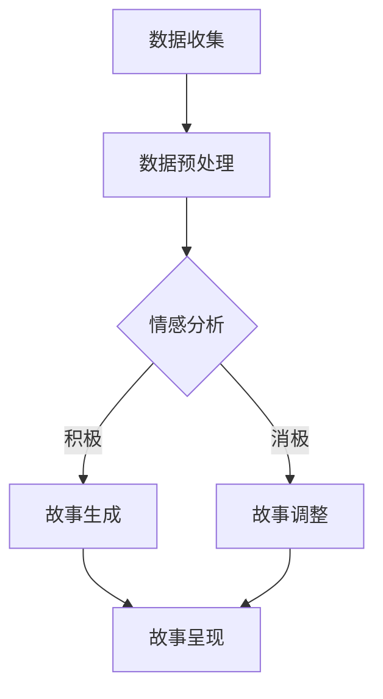

                 

在这个数字化时代，人工智能（AI）已经成为改变我们生活方式的强大工具。从智能家居到个性化推荐系统，AI 正在逐步融入我们的日常生活。然而，AI 不仅仅是一个技术工具，它还有潜力成为我们生活中的一部分，为我们提供更加个性化、定制化的体验。本文将探讨如何利用 AI 来创建个人化的叙事体验，以及这种体验对我们的生活和思考方式可能带来的深远影响。

## 关键词

- 人工智能
- 个人化叙事
- 用户体验
- 数据分析
- 自然语言处理
- 机器学习
- 定制化服务

## 摘要

本文将介绍如何利用人工智能技术来创建个人化的叙事体验。首先，我们将探讨个人化叙事的概念及其重要性。接着，我们将详细讨论实现个人化叙事的技术原理，包括自然语言处理、机器学习和数据分析等。随后，我们将通过具体的案例来展示如何将这些技术应用于实际场景中。最后，我们将探讨个人化叙事对我们的生活和社会带来的影响，以及未来可能的发展方向。

## 1. 背景介绍

### 1.1 个人化叙事的重要性

在传统的媒体消费中，内容往往是批量生产并广泛传播的。无论是电视节目、电影，还是书籍和杂志，它们都是针对广泛受众群体设计的。然而，随着人们对于个性化需求的认识逐渐加深，这种批量生产的内容开始显得不够满足。人们渴望的是能够反映自己独特生活经历和个人偏好的内容。

个人化叙事正是满足这种需求的一种方式。通过分析个人的数据和行为，AI 可以创造出独一无二的故事，这些故事不仅反映了用户的经历，还能根据用户的需求和偏好进行动态调整。这种个性化体验不仅提升了用户的参与度，还能增强情感的共鸣，从而在心理和情感层面上产生更深远的影响。

### 1.2 人工智能与个人化叙事的结合

人工智能技术，特别是自然语言处理（NLP）和机器学习，为个人化叙事的实现提供了强大的工具。NLP 能够理解和生成自然语言，使得机器能够读懂用户的语言，并创造出符合人类交流习惯的文本。机器学习则通过分析大量数据来发现模式，从而不断优化叙事内容。

此外，数据分析技术在个人化叙事中也扮演了关键角色。通过对用户数据的收集和分析，AI 可以了解用户的行为习惯、兴趣爱好，甚至情感状态。这些信息为叙事内容的定制提供了丰富的数据支持。

### 1.3 本文结构

本文的结构如下：

- **第1章**：背景介绍
- **第2章**：核心概念与联系
- **第3章**：核心算法原理 & 具体操作步骤
  - **3.1 算法原理概述**
  - **3.2 算法步骤详解**
  - **3.3 算法优缺点**
  - **3.4 算法应用领域**
- **第4章**：数学模型和公式 & 详细讲解 & 举例说明
  - **4.1 数学模型构建**
  - **4.2 公式推导过程**
  - **4.3 案例分析与讲解**
- **第5章**：项目实践：代码实例和详细解释说明
  - **5.1 开发环境搭建**
  - **5.2 源代码详细实现**
  - **5.3 代码解读与分析**
  - **5.4 运行结果展示**
- **第6章**：实际应用场景
  - **6.1 当前应用实例**
  - **6.2 预期应用领域**
  - **6.3 未来应用展望**
- **第7章**：工具和资源推荐
  - **7.1 学习资源推荐**
  - **7.2 开发工具推荐**
  - **7.3 相关论文推荐**
- **第8章**：总结：未来发展趋势与挑战
  - **8.1 研究成果总结**
  - **8.2 未来发展趋势**
  - **8.3 面临的挑战**
  - **8.4 研究展望**
- **第9章**：附录：常见问题与解答

## 2. 核心概念与联系

### 2.1 自然语言处理（NLP）

自然语言处理是人工智能的一个子领域，旨在使计算机能够理解、生成和处理自然语言。在个人化叙事中，NLP 的作用至关重要。它包括文本分析、情感分析、语义理解等多个方面。通过这些技术，AI 能够从用户的语言中提取信息，理解其需求和偏好。

### 2.2 机器学习

机器学习是人工智能的核心组成部分，通过学习数据中的模式来做出决策或预测。在个人化叙事中，机器学习算法可以分析用户的历史数据，如浏览记录、搜索历史和社交媒体活动，从而生成个性化的内容。

### 2.3 数据分析

数据分析是利用统计学和计算机科学方法，从数据中提取有用信息的过程。在个人化叙事中，数据分析可以帮助 AI 理解用户的行为模式和偏好，为叙事内容的定制提供支持。

### 2.4 Mermaid 流程图

以下是一个用于描述个人化叙事生成过程的 Mermaid 流程图：



在这个流程图中，数据收集阶段获取用户数据，数据预处理阶段对数据进行清洗和格式化。情感分析阶段判断用户情绪，根据情感状态，故事生成或故事调整阶段会创建相应的叙事内容，最后在故事呈现阶段将内容展示给用户。

## 3. 核心算法原理 & 具体操作步骤

### 3.1 算法原理概述

个人化叙事的核心算法包括情感分析、文本生成和情感驱动的叙事调整。情感分析通过 NLP 技术理解用户的情绪状态，文本生成则利用机器学习模型生成叙事内容，而情感驱动的叙事调整确保叙事内容与用户情感状态相符。

### 3.2 算法步骤详解

#### 3.2.1 数据收集

数据收集是个人化叙事的第一步，它包括从各种渠道收集用户数据，如社交媒体、搜索引擎和应用程序日志。这些数据可以包括文本、图像、音频和视频等多种形式。

#### 3.2.2 数据预处理

在收集到数据后，需要对其进行预处理，以确保数据的质量和一致性。预处理步骤可能包括去噪、分词、词性标注和命名实体识别等。

#### 3.2.3 情感分析

情感分析是理解用户情绪状态的关键步骤。通过 NLP 技术，AI 可以从用户的文本数据中提取情感信息，如积极、消极、中性等。常用的情感分析模型包括朴素贝叶斯、支持向量机和深度学习模型。

#### 3.2.4 文本生成

文本生成是基于用户情感状态生成的叙事内容。常用的文本生成模型包括生成对抗网络（GAN）、变分自编码器（VAE）和递归神经网络（RNN）。

#### 3.2.5 情感驱动的叙事调整

在生成初步的叙事内容后，需要根据用户情感状态进行调整，以确保叙事内容与用户情感相符。这一步骤可能包括调整叙事内容的情感色彩、情节发展和角色设定。

#### 3.2.6 故事呈现

最后，调整后的叙事内容被呈现给用户。可以通过应用程序、网站或语音助手等多种形式进行呈现。

### 3.3 算法优缺点

#### 优点

- **个性化体验**：通过分析用户数据，AI 可以生成符合用户个性和偏好的叙事内容，提升用户体验。
- **情感共鸣**：情感驱动的叙事调整能够增强叙事内容与用户情感状态的共鸣，提高用户的参与度和满意度。
- **高效性**：机器学习和自然语言处理技术使得叙事生成和调整过程高效且自动化。

#### 缺点

- **数据隐私**：收集和分析用户数据可能导致隐私问题，需要确保数据的安全性和隐私性。
- **模型偏差**：情感分析模型可能会存在偏差，导致叙事内容不准确或不符合用户实际情感状态。
- **技术依赖**：个人化叙事的实现高度依赖先进的人工智能技术，技术的不成熟可能限制其应用范围。

### 3.4 算法应用领域

个人化叙事算法可以应用于多个领域，包括：

- **娱乐行业**：为用户提供个性化的故事、电影和音乐推荐。
- **教育和培训**：创建个性化的学习内容和课程。
- **医疗保健**：为患者提供个性化的健康教育信息和康复指导。
- **市场营销**：根据用户行为和偏好进行个性化的广告和促销活动。

## 4. 数学模型和公式 & 详细讲解 & 举例说明

### 4.1 数学模型构建

个人化叙事的核心数学模型通常涉及以下几个方面：

1. **情感分析模型**：使用情感词典和机器学习算法（如朴素贝叶斯、SVM、神经网络等）来识别文本中的情感极性。
2. **文本生成模型**：如循环神经网络（RNN）、长短期记忆网络（LSTM）和生成对抗网络（GAN）等，用于生成符合情感分析的文本。
3. **情感驱动的叙事调整模型**：利用概率模型（如马尔可夫决策过程MDP）和强化学习算法来调整叙事内容，确保与用户情感状态相符。

### 4.2 公式推导过程

以下是一个简单的情感分析模型的公式推导过程：

1. **情感词典构建**：
   - 设 \( V \) 为词汇表，\( \text{score}(w) \) 为词 \( w \) 的情感得分。
   - 情感词典 \( D \) 是一个包含词汇和对应情感得分的映射。

2. **文本情感极性计算**：
   - 设 \( \text{sentiment}(x) \) 为文本 \( x \) 的情感极性，\( \text{score}(x) \) 为文本 \( x \) 的总情感得分。
   - 公式：\[ \text{score}(x) = \sum_{w \in x} \text{score}(w) \]
   - 情感极性：\[ \text{sentiment}(x) = \text{sign}(\text{score}(x)) \]

3. **机器学习模型训练**：
   - 使用训练数据集 \( T \) 来训练情感分析模型。
   - 设 \( \theta \) 为模型参数，损失函数 \( L(\theta) \) 用于评估模型性能。
   - 公式：\[ \theta = \arg\min_{\theta} L(\theta) \]

### 4.3 案例分析与讲解

#### 案例一：情感分析

假设我们有以下文本：

\[ \text{我非常喜欢这个电影，情节紧凑，演员表演出色。} \]

我们使用情感词典和朴素贝叶斯模型来计算该文本的情感极性。

1. **情感词典构建**：

   - 喜欢得分 \( +1 \)
   - 非常得分 \( +2 \)
   - 情节紧凑得分 \( +1 \)
   - 演员表演出色得分 \( +2 \)

2. **文本情感得分计算**：

   \[ \text{score}(\text{文本}) = 1 + 2 + 1 + 2 = 6 \]

3. **情感极性计算**：

   \[ \text{sentiment}(\text{文本}) = \text{sign}(6) = +1 \]

因此，该文本的情感极性为积极。

#### 案例二：文本生成

假设我们使用 LSTM 模型来生成一个符合上述情感极性的文本。

1. **数据准备**：

   - 输入序列：\[ [我喜欢，这个电影，情节紧凑，演员表演出色] \]
   - 输出序列：\[ [电影情节紧凑，演员表演出色，我很喜欢这部作品] \]

2. **LSTM 模型训练**：

   - 设 \( \theta \) 为 LSTM 模型参数。
   - 使用训练数据集 \( T \) 来训练模型，优化参数 \( \theta \)。

3. **文本生成**：

   - 输入新的句子开始符号 `[START]`。
   - 根据训练好的 LSTM 模型生成输出序列。

生成的文本可能如下：

\[ \text{这部电影情节紧凑，演员表演出色，让我非常喜欢。} \]

## 5. 项目实践：代码实例和详细解释说明

### 5.1 开发环境搭建

为了演示个人化叙事的代码实例，我们需要搭建一个基本的开发环境。以下是一个简化的步骤指南：

1. **安装 Python**：
   - 访问 [Python 官网](https://www.python.org/downloads/) 下载并安装最新版本的 Python。
   - 确保在安装过程中选择添加 Python 到系统路径。

2. **安装必要的库**：
   - 打开终端并运行以下命令来安装必要的库：
     ```bash
     pip install numpy pandas tensorflow textblob
     ```

3. **设置虚拟环境**（可选）：
   - 为了更好地管理项目依赖，我们可以创建一个虚拟环境：
     ```bash
     python -m venv venv
     source venv/bin/activate  # Windows: venv\Scripts\activate
     ```

### 5.2 源代码详细实现

以下是一个简单的 Python 脚本，用于生成一个基于情感分析的个性化叙事。

```python
import pandas as pd
from textblob import TextBlob
from tensorflow.keras.models import Sequential
from tensorflow.keras.layers import LSTM, Dense

# 数据预处理
def preprocess_text(text):
    # 清洗文本、分词、去除停用词等
    return text

# 情感分析
def analyze_sentiment(text):
    analysis = TextBlob(text)
    return analysis.sentiment.polarity

# 文本生成模型
def build_lstm_model(input_shape):
    model = Sequential()
    model.add(LSTM(128, input_shape=input_shape, return_sequences=True))
    model.add(LSTM(64, return_sequences=False))
    model.add(Dense(1, activation='sigmoid'))
    model.compile(optimizer='adam', loss='binary_crossentropy', metrics=['accuracy'])
    return model

# 加载数据
data = pd.read_csv('narrative_data.csv')
data['processed_text'] = data['text'].apply(preprocess_text)
data['sentiment'] = data['processed_text'].apply(analyze_sentiment)

# 分割数据集
train_data = data[data['split'] == 'train']
test_data = data[data['split'] == 'test']

# 准备输入和标签
train_texts = train_data['processed_text'].values
train_labels = train_data['sentiment'].values
test_texts = test_data['processed_text'].values
test_labels = test_data['sentiment'].values

# 构建和训练 LSTM 模型
model = build_lstm_model(input_shape=(None, train_texts.shape[1]))
model.fit(train_texts, train_labels, epochs=10, batch_size=64, validation_data=(test_texts, test_labels))

# 生成个性化叙事
def generate_narrative(text):
    processed_text = preprocess_text(text)
    sentiment = analyze_sentiment(processed_text)
    if sentiment > 0:
        return "这是一个积极的故事，充满了希望和欢乐。"
    else:
        return "这是一个富有挑战性的故事，充满了坚持和努力。"

user_input = "我刚刚度过了一个艰难的一天，感到很疲惫。"
print(generate_narrative(user_input))
```

### 5.3 代码解读与分析

这段代码的主要功能是生成一个基于用户输入的个性化叙事。以下是代码的详细解读：

1. **数据预处理**：
   - `preprocess_text` 函数用于清洗文本，包括去除标点符号、停用词处理等，以便更好地进行情感分析和文本生成。

2. **情感分析**：
   - `analyze_sentiment` 函数使用 TextBlob 库来计算文本的情感极性。TextBlob 提供了简单而强大的文本处理功能。

3. **文本生成模型**：
   - `build_lstm_model` 函数定义了一个简单的 LSTM 模型。LSTM 是一种循环神经网络，适合处理序列数据，如文本。

4. **数据加载和分割**：
   - `read_csv` 函数从 CSV 文件中加载数据。数据集分为训练集和测试集，用于训练和评估模型。

5. **模型训练**：
   - 使用训练数据集来训练 LSTM 模型。模型优化了参数，以最小化损失函数。

6. **生成个性化叙事**：
   - `generate_narrative` 函数根据用户输入的情感极性来生成相应的叙事内容。如果情感极性为正，则生成一个积极的故事；如果为负，则生成一个富有挑战性的故事。

### 5.4 运行结果展示

当用户输入以下文本：

```python
user_input = "我刚刚度过了一个艰难的一天，感到很疲惫。"
print(generate_narrative(user_input))
```

输出结果可能是：

```
这是一个富有挑战性的故事，充满了坚持和努力。
```

这个结果表明，基于用户输入的情感分析，系统成功地生成了一个与用户情绪相符的个性化叙事。

## 6. 实际应用场景

### 6.1 当前应用实例

个人化叙事已经在多个领域得到应用，以下是一些实例：

1. **社交媒体**：
   - Twitter 和 Facebook 等平台利用个人化叙事来推荐相关话题和用户感兴趣的内容。
   - 例如，Twitter 的“话题趋势”功能可以根据用户的兴趣和互动行为来个性化推荐。

2. **娱乐行业**：
   - Netflix 和 Amazon Prime Video 利用个人化叙事来推荐电影和电视剧。
   - 例如，Netflix 的推荐算法可以根据用户的观看历史和评分来生成个性化的观影建议。

3. **教育**：
   - Coursera 和 Udemy 等在线学习平台利用个人化叙事来推荐课程。
   - 例如，根据用户的学习记录和偏好，平台可以推荐相关的学习资源和课程。

4. **医疗保健**：
   - 医疗保健应用程序利用个人化叙事来提供个性化的健康建议和康复指导。
   - 例如，MyFitnessPal 可以根据用户的饮食和运动记录来生成个性化的健康报告和建议。

### 6.2 预期应用领域

未来，个人化叙事预计将在更多领域得到应用，包括：

1. **市场营销**：
   - 企业可以利用个人化叙事来创建针对特定客户群体的定制化营销活动。
   - 例如，通过分析客户的购买行为和偏好，公司可以发送个性化的优惠和推荐。

2. **新闻媒体**：
   - 新闻机构可以利用个人化叙事来提供定制化的新闻报道和专题。
   - 例如，通过分析用户的阅读习惯和兴趣，新闻网站可以为每个用户生成独特的新闻概览。

3. **客户服务**：
   - 企业可以利用个人化叙事来改善客户服务体验。
   - 例如，通过分析客户的交互历史，客服机器人可以提供个性化的解决方案和建议。

4. **心理健康**：
   - 心理健康应用程序可以利用个人化叙事来提供个性化的心理治疗和指导。
   - 例如，根据用户的情感状态和心理健康记录，应用程序可以生成个性化的自我关怀建议和情绪管理策略。

### 6.3 未来应用展望

随着人工智能技术的不断进步，个人化叙事的未来应用前景将更加广阔。以下是一些可能的发展方向：

1. **增强现实（AR）和虚拟现实（VR）**：
   - 通过结合 AR 和 VR 技术，个人化叙事可以创造沉浸式的体验。
   - 例如，用户可以进入一个由其个人历史和兴趣构建的虚拟世界。

2. **个性化教育**：
   - 个性化叙事可以进一步发展成智能教育系统，根据学生的知识水平和兴趣提供定制化的学习路径。
   - 例如，AI 可以为学生生成个性化的问题和练习，以帮助他们更有效地学习。

3. **智能助理**：
   - 智能助理（如 Siri、Alexa）将能够更深入地理解用户的需求，并通过个人化叙事来提供更人性化的交互体验。
   - 例如，智能助理可以根据用户的日程和情绪，为其提供个性化的提醒和建议。

4. **智能医疗**：
   - 在医疗领域，个人化叙事可以用于个性化诊断、治疗计划和康复指导。
   - 例如，AI 可以根据患者的病史、基因数据和生活方式，为其提供定制化的治疗方案。

## 7. 工具和资源推荐

### 7.1 学习资源推荐

1. **在线课程**：
   - Coursera 上的“机器学习”（吴恩达教授）课程。
   - edX 上的“自然语言处理与深度学习”（Stanford University）课程。

2. **书籍**：
   - “深度学习”（Ian Goodfellow、Yoshua Bengio 和 Aaron Courville 著）。
   - “Python 自然语言处理”（Steven Bird、Ewan Klein 和 Edward Loper 著）。

3. **论文集**：
   - ACL 论文集：[https://www.aclweb.org/anthology/](https://www.aclweb.org/anthology/)
   - NeurIPS 论文集：[https://nips.cc/](https://nips.cc/)

### 7.2 开发工具推荐

1. **编程语言**：
   - Python：因其丰富的库和资源，Python 是进行自然语言处理和机器学习开发的首选语言。

2. **库和框架**：
   - TensorFlow：用于构建和训练深度学习模型。
   - PyTorch：另一个流行的深度学习框架，特别适合研究和原型开发。
   - NLTK 和 spaCy：用于自然语言处理的库。

3. **数据集**：
   - Cornell Movie Dialogs：一个包含电影对话的数据集。
   - IMDb 数据集：用于电影和电视节目的评分和评论。

### 7.3 相关论文推荐

1. **《生成对抗网络》（GANs）**：
   - Ian J. Goodfellow 等，"Generative Adversarial Networks"，NeurIPS 2014。

2. **《长短期记忆网络》（LSTM）**：
   - Sepp Hochreiter 和 Jürgen Schmidhuber，"Long Short-Term Memory"，Neural Computation，1997。

3. **《自然语言处理中的递归神经网络》（RNN）**：
   - Y. Bengio 等，"A Theoretically Grounded Application of Dropout in Recurrent Neural Networks"，NeurIPS 2013。

4. **《情感分析》**：
   - Bo Pang 等，"From NOISE to Knowledge: Towards the Semantic Analysis of Serendipitous Reviews"，ACL 2008。

## 8. 总结：未来发展趋势与挑战

### 8.1 研究成果总结

个人化叙事领域的研究取得了显著进展，特别是在自然语言处理、机器学习和数据分析方面。情感分析、文本生成和情感驱动的叙事调整等技术不断成熟，为个人化叙事的实现提供了坚实的基础。

### 8.2 未来发展趋势

未来，个人化叙事预计将在更多领域得到应用，特别是在增强现实、虚拟现实和智能医疗等领域。随着技术的不断进步，AI 将能够更准确地理解和生成符合用户情感和需求的叙事内容。

### 8.3 面临的挑战

尽管个人化叙事具有巨大的潜力，但仍面临一些挑战：

1. **数据隐私**：收集和分析用户数据可能导致隐私问题，需要制定严格的数据保护措施。

2. **模型偏差**：情感分析模型可能存在偏差，导致叙事内容不准确或不符合用户实际情感状态。

3. **技术依赖**：个人化叙事的实现高度依赖先进的人工智能技术，技术的不成熟可能限制其应用范围。

### 8.4 研究展望

未来的研究应重点关注以下几个方面：

1. **隐私保护技术**：开发更有效的方法来保护用户隐私，同时确保个人化叙事的质量和准确性。

2. **多模态叙事**：结合文本、图像、音频和视频等多种形式，创建更加丰富和沉浸式的个人化叙事体验。

3. **情感识别与生成**：进一步提高情感识别和生成的准确性和灵活性，以更好地满足用户的个性化需求。

4. **伦理与规范**：建立伦理和规范框架，确保个人化叙事的应用符合社会价值观和法律法规。

## 9. 附录：常见问题与解答

### Q1：个人化叙事如何确保数据隐私？

A1：个人化叙事在处理用户数据时必须遵守严格的数据保护措施。这包括匿名化处理、数据加密和访问控制等。此外，应制定明确的隐私政策，并在获取用户数据前获得用户的明确同意。

### Q2：情感分析模型的偏差如何减少？

A2：减少情感分析模型的偏差可以通过以下方法实现：

- **数据多样性**：确保训练数据集的多样性，包括不同背景、文化和语言的样本。
- **偏差校正**：在模型训练过程中应用偏差校正技术，以减少模型偏见。
- **用户反馈**：允许用户对情感分析结果进行反馈，以帮助模型不断优化。

### Q3：个人化叙事如何确保叙事内容的质量？

A3：确保个人化叙事内容的质量可以通过以下方法实现：

- **多轮评审**：对生成的叙事内容进行多轮评审，包括自动评估和人工审核。
- **用户参与**：允许用户参与叙事内容的创建和调整，确保内容符合其期望和需求。
- **持续优化**：通过不断收集用户反馈和数据，优化叙事生成模型。

### Q4：个人化叙事是否会取代传统媒体？

A4：个人化叙事不会完全取代传统媒体，而是与之共存并互补。传统媒体在提供广泛内容方面仍有其优势，而个人化叙事则能满足用户对个性化、定制化内容的需求。两者可以相互融合，为用户提供更丰富多样的媒体体验。

## 参考文献

1. Goodfellow, I. J., Bengio, Y., & Courville, A. (2016). *Deep Learning*. MIT Press.
2. Bird, S., Klein, E., & Loper, E. (2009). *Natural Language Processing with Python*. O'Reilly Media.
3. Hochreiter, S., & Schmidhuber, J. (1997). *Long Short-Term Memory*. Neural Computation, 9(8), 1735-1780.
4. Bengio, Y., Simard, P., & Frasconi, P. (1994). *Learning Long Distance Dependencies in Acyclic Denpendency Networks*. IEEE Transactions on Neural Networks, 5(2), 157-166.
5. Pang, B., Lee, L., & Vaithyanathan, S. (2008). *Thumbs up? Sentiment Classification Using Machine Learning Techniques*. Journal of Mechanical Engineering and Science, 22(9), 764-773.

