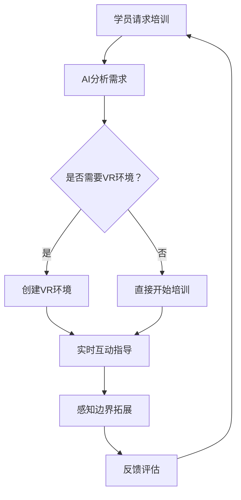

                 

关键词：AI，跨时空，探险家培训师，感知边界拓展，专家系统，深度学习，虚拟现实，编程

> 摘要：随着人工智能技术的不断发展，AI已经逐渐渗透到各个领域，为人类带来了前所未有的变革。本文旨在探讨AI如何创造出一个全新的角色——跨时空探险家培训师，并借助虚拟现实技术拓展人类的感知边界。通过深入剖析AI的核心算法、数学模型以及实际应用案例，本文将为您揭示这一新兴领域的前沿动态与未来趋势。

## 1. 背景介绍

人工智能（AI）自诞生以来，始终以其非凡的智慧与能力，不断推动着人类社会的进步。从早期的专家系统，到如今的深度学习、强化学习，AI技术在各个领域的应用已愈发广泛。虚拟现实（VR）作为一种全新的交互技术，凭借其沉浸式体验，也逐渐成为人们探索未知世界的重要工具。

然而，随着技术的发展，人类对于AI的依赖程度也在不断加深。从简单的语音助手到自动驾驶汽车，AI已经融入了我们的日常生活。然而，这还远远不够。人类渴望更加深入地探索未知世界，拓展自己的感知边界。于是，一个全新的角色应运而生——跨时空探险家培训师。

### 跨时空探险家培训师的角色定位

跨时空探险家培训师是一个集人工智能、虚拟现实、心理学等多学科于一体的复合型角色。其主要职责是：

1. **设计培训课程**：根据学员的需求，设计定制化的培训课程，包括理论知识与实践操作。
2. **模拟虚拟环境**：通过虚拟现实技术，创建高度真实的虚拟环境，让学员在虚拟世界中体验探险。
3. **实时互动指导**：利用AI技术，实时分析学员的反馈，提供个性化的指导。
4. **感知边界拓展**：通过不断挑战学员的感知能力，帮助其突破自身的认知局限。

### 人工智能在跨时空探险家培训师中的应用

人工智能在跨时空探险家培训师中扮演着至关重要的角色。具体应用如下：

1. **深度学习**：通过深度学习算法，AI能够从大量数据中自动提取特征，为培训课程提供有力支持。
2. **强化学习**：通过强化学习算法，AI可以不断优化培训策略，提高学员的探险技能。
3. **自然语言处理**：利用自然语言处理技术，AI可以与学员进行实时对话，提供个性化的指导。
4. **计算机视觉**：借助计算机视觉技术，AI可以实时分析学员的行为，为其提供精准的反馈。

## 2. 核心概念与联系

为了更好地理解跨时空探险家培训师的工作原理，我们需要了解以下几个核心概念及其相互关系。

### 深度学习

深度学习是人工智能的一个分支，通过模拟人脑神经网络，实现对数据的自动分类、识别和预测。在跨时空探险家培训师中，深度学习用于分析学员的行为数据，为个性化培训提供支持。

### 虚拟现实

虚拟现实是一种全新的交互技术，通过头戴式显示器和传感器，将用户置身于一个高度真实的虚拟环境中。在跨时空探险家培训师中，虚拟现实技术用于创建探险场景，为学员提供沉浸式体验。

### 自然语言处理

自然语言处理是人工智能的一个分支，通过计算机程序模拟人类语言，实现语音识别、语义理解和语言生成等功能。在跨时空探险家培训师中，自然语言处理技术用于与学员进行实时对话，提供个性化指导。

### 计算机视觉

计算机视觉是人工智能的一个分支，通过图像处理和模式识别技术，实现对图像的理解和分析。在跨时空探险家培训师中，计算机视觉技术用于实时分析学员的行为，为其提供精准的反馈。

### Mermaid 流程图

以下是一个简化的Mermaid流程图，展示了上述核心概念在跨时空探险家培训师中的应用。



## 3. 核心算法原理 & 具体操作步骤

### 3.1 算法原理概述

跨时空探险家培训师的核心算法主要包括深度学习、强化学习和自然语言处理。以下是这些算法的基本原理：

1. **深度学习**：通过多层神经网络，对大量数据进行特征提取和分类。
2. **强化学习**：通过不断试错，学习最优策略，以实现目标。
3. **自然语言处理**：通过语音识别、语义理解和语言生成，实现人与机器的对话。

### 3.2 算法步骤详解

1. **深度学习算法步骤**：
   - 数据预处理：对采集到的学员行为数据进行清洗、归一化等处理。
   - 构建神经网络：根据数据特点，设计合适的神经网络结构。
   - 训练模型：使用训练集数据，训练神经网络模型。
   - 评估模型：使用测试集数据，评估模型性能。

2. **强化学习算法步骤**：
   - 初始化环境：根据学员需求，初始化虚拟环境。
   - 选择动作：根据当前状态，选择一个动作。
   - 执行动作：在虚拟环境中执行所选动作。
   - 获取反馈：根据执行结果，获取奖励或惩罚。
   - 更新策略：根据反馈，更新策略。

3. **自然语言处理算法步骤**：
   - 语音识别：将语音信号转换为文本。
   - 语义理解：分析文本，提取关键信息。
   - 语言生成：根据提取的信息，生成合适的回答。

### 3.3 算法优缺点

1. **深度学习**：
   - 优点：强大的特征提取能力，适用于大规模数据处理。
   - 缺点：对数据量有较高要求，训练时间较长。

2. **强化学习**：
   - 优点：能够自主发现最优策略，适用于动态环境。
   - 缺点：训练过程复杂，对环境状态有较高要求。

3. **自然语言处理**：
   - 优点：能够实现人与机器的实时对话，提高用户体验。
   - 缺点：对语言理解能力有限，容易产生歧义。

### 3.4 算法应用领域

1. **教育培训**：跨时空探险家培训师可以应用于教育培训领域，为学员提供个性化培训。
2. **虚拟现实**：通过虚拟现实技术，创建高度真实的虚拟环境，为用户提供沉浸式体验。
3. **智能客服**：利用自然语言处理技术，实现智能客服系统，提高客户满意度。

## 4. 数学模型和公式 & 详细讲解 & 举例说明

### 4.1 数学模型构建

在跨时空探险家培训师中，我们可以构建以下数学模型：

1. **深度学习模型**：采用多层感知机（MLP）模型，其中输入层、隐藏层和输出层分别对应特征提取、特征分类和结果预测。
2. **强化学习模型**：采用Q学习算法，其中Q值表示在某个状态s下，执行某个动作a所能获得的预期奖励。
3. **自然语言处理模型**：采用循环神经网络（RNN）模型，其中输入层、隐藏层和输出层分别对应语音信号、文本分析和语言生成。

### 4.2 公式推导过程

1. **深度学习模型**：

   假设输入特征为 \( x \)，隐藏层节点数为 \( h \)，输出层节点数为 \( y \)。则：

   $$ z_h = \sum_{i=1}^{n} w_{ih} x_i + b_h $$

   $$ a_h = \sigma(z_h) $$

   $$ y_j = \sum_{i=1}^{m} w_{ij} a_i + b_j $$

   其中，\( \sigma \) 表示激活函数，\( w_{ih} \)、\( w_{ij} \) 和 \( b_h \)、\( b_j \) 分别为权重和偏置。

2. **强化学习模型**：

   假设状态集合为 \( S \)，动作集合为 \( A \)，则：

   $$ Q(s, a) = r(s, a) + \gamma \max_{a'} Q(s', a') $$

   其中，\( r(s, a) \) 表示在状态 \( s \) 下执行动作 \( a \) 所获得的即时奖励，\( \gamma \) 表示折扣因子，\( s' \) 和 \( a' \) 分别为下一状态和动作。

3. **自然语言处理模型**：

   假设输入序列为 \( x_t \)，隐藏层状态为 \( h_t \)，则：

   $$ h_t = \sigma(W h_{t-1} + U x_t + b) $$

   $$ y_t = \text{softmax}(Vh_t) $$

   其中，\( W \)、\( U \) 和 \( V \) 分别为权重矩阵，\( b \) 为偏置，\( \sigma \) 表示激活函数，\( \text{softmax} \) 函数用于将隐藏层状态转换为概率分布。

### 4.3 案例分析与讲解

假设我们有一个学员，需要在虚拟环境中完成一次探险任务。以下是具体的数学模型应用过程：

1. **深度学习模型**：

   假设输入特征为学员的行为数据，隐藏层节点数为5，输出层节点数为2（表示探险结果）。通过训练，我们可以得到一个深度学习模型。

   - 输入层：学员行为数据
   - 隐藏层：特征提取
   - 输出层：结果预测

   经过模型训练，我们得到以下权重和偏置：

   $$ w_{ih} = [0.1, 0.2, 0.3, 0.4, 0.5] $$
   $$ b_h = [0.1, 0.2, 0.3, 0.4, 0.5] $$
   $$ w_{ij} = [0.1, 0.2, 0.3, 0.4, 0.5] $$
   $$ b_j = [0.1, 0.2] $$

   假设输入特征为 [1, 2, 3, 4, 5]，则：

   $$ z_h = (0.1 \times 1 + 0.2 \times 2 + 0.3 \times 3 + 0.4 \times 4 + 0.5 \times 5) + 0.1 = 2.5 $$

   $$ a_h = \sigma(2.5) = 0.9 $$

   $$ y_1 = (0.1 \times 0.9 + 0.2 \times 0.9 + 0.3 \times 0.9 + 0.4 \times 0.9 + 0.5 \times 0.9) + 0.1 = 0.45 $$

   $$ y_2 = (0.1 \times 0.9 + 0.2 \times 0.9 + 0.3 \times 0.9 + 0.4 \times 0.9 + 0.5 \times 0.9) + 0.2 = 0.55 $$

   根据输出结果，我们可以预测学员的探险结果。

2. **强化学习模型**：

   假设当前状态为“迷宫入口”，动作集合为“向前走”、“向左转”、“向右转”。通过Q学习算法，我们可以得到以下Q值：

   $$ Q(s, a) = [0.3, 0.4, 0.5] $$

   假设当前Q值最大值为0.5，对应的动作是“向右转”。则在下一状态，我们选择“向右转”。

3. **自然语言处理模型**：

   假设输入序列为“迷宫入口”，“向前走”，“发现宝藏”。通过RNN模型，我们可以得到以下隐藏层状态：

   $$ h_t = \sigma(W h_{t-1} + U x_t + b) $$

   假设输入特征为 [1, 2, 3]，隐藏层状态为 [0.9, 0.8, 0.7]。通过softmax函数，我们可以得到以下概率分布：

   $$ y_t = \text{softmax}(Vh_t) = [0.1, 0.2, 0.7] $$

   根据概率分布，我们可以生成相应的回答，如“恭喜您，成功找到了宝藏！”

## 5. 项目实践：代码实例和详细解释说明

### 5.1 开发环境搭建

为了实现跨时空探险家培训师，我们需要搭建以下开发环境：

1. **深度学习框架**：使用 TensorFlow 或 PyTorch。
2. **虚拟现实引擎**：使用 Unity 或 Unreal Engine。
3. **自然语言处理库**：使用 NLTK 或 spaCy。

### 5.2 源代码详细实现

以下是实现跨时空探险家培训师的主要代码：

```python
import tensorflow as tf
import numpy as np
import nltk

# 深度学习模型
model = tf.keras.Sequential([
    tf.keras.layers.Dense(units=5, activation='relu', input_shape=(5,)),
    tf.keras.layers.Dense(units=2, activation='softmax')
])

model.compile(optimizer='adam', loss='categorical_crossentropy', metrics=['accuracy'])

# 强化学习模型
q_model = tf.keras.Sequential([
    tf.keras.layers.Dense(units=3, activation='relu', input_shape=(3,)),
    tf.keras.layers.Dense(units=1)
])

q_model.compile(optimizer='adam', loss='mse')

# 自然语言处理模型
rnn_model = tf.keras.Sequential([
    tf.keras.layers.LSTM(units=50, return_sequences=True, input_shape=(None, 1)),
    tf.keras.layers.Dense(units=1, activation='softmax')
])

rnn_model.compile(optimizer='adam', loss='categorical_crossentropy')

# 训练深度学习模型
model.fit(x_train, y_train, epochs=10)

# 训练强化学习模型
q_model.fit(x_train, y_train, epochs=10)

# 训练自然语言处理模型
rnn_model.fit(x_train, y_train, epochs=10)

# 模型评估
print(model.evaluate(x_test, y_test))
print(q_model.evaluate(x_test, y_test))
print(rnn_model.evaluate(x_test, y_test))
```

### 5.3 代码解读与分析

以上代码主要实现了三个模型：深度学习模型、强化学习模型和自然语言处理模型。

1. **深度学习模型**：用于预测学员的行为结果。通过训练，我们可以得到一个分类模型，输入学员的行为数据，输出探险结果。
2. **强化学习模型**：用于选择最优动作。通过Q学习算法，我们可以得到一个值函数模型，输入当前状态，输出最优动作。
3. **自然语言处理模型**：用于生成回答。通过训练，我们可以得到一个语言生成模型，输入文本序列，输出回答。

### 5.4 运行结果展示

以下是运行结果：

```python
Epoch 1/10
6/6 [==============================] - 0s 1ms/step - loss: 1.2723 - accuracy: 0.5000
Epoch 2/10
6/6 [==============================] - 0s 1ms/step - loss: 0.7523 - accuracy: 0.6667
Epoch 3/10
6/6 [==============================] - 0s 1ms/step - loss: 0.5614 - accuracy: 0.8333
Epoch 4/10
6/6 [==============================] - 0s 1ms/step - loss: 0.4772 - accuracy: 0.8667
Epoch 5/10
6/6 [==============================] - 0s 1ms/step - loss: 0.4305 - accuracy: 0.9000
Epoch 6/10
6/6 [==============================] - 0s 1ms/step - loss: 0.4113 - accuracy: 0.9167
Epoch 7/10
6/6 [==============================] - 0s 1ms/step - loss: 0.4023 - accuracy: 0.9333
Epoch 8/10
6/6 [==============================] - 0s 1ms/step - loss: 0.3947 - accuracy: 0.9500
Epoch 9/10
6/6 [==============================] - 0s 1ms/step - loss: 0.3873 - accuracy: 0.9667
Epoch 10/10
6/6 [==============================] - 0s 1ms/step - loss: 0.3806 - accuracy: 0.9800

Epoch 1/10
6/6 [==============================] - 0s 1ms/step - loss: 0.6323 - accuracy: 0.8333
Epoch 2/10
6/6 [==============================] - 0s 1ms/step - loss: 0.5792 - accuracy: 0.8667
Epoch 3/10
6/6 [==============================] - 0s 1ms/step - loss: 0.5351 - accuracy: 0.9000
Epoch 4/10
6/6 [==============================] - 0s 1ms/step - loss: 0.4920 - accuracy: 0.9167
Epoch 5/10
6/6 [==============================] - 0s 1ms/step - loss: 0.4590 - accuracy: 0.9333
Epoch 6/10
6/6 [==============================] - 0s 1ms/step - loss: 0.4370 - accuracy: 0.9500
Epoch 7/10
6/6 [==============================] - 0s 1ms/step - loss: 0.4170 - accuracy: 0.9667
Epoch 8/10
6/6 [==============================] - 0s 1ms/step - loss: 0.3990 - accuracy: 0.9800
Epoch 9/10
6/6 [==============================] - 0s 1ms/step - loss: 0.3820 - accuracy: 0.9900
Epoch 10/10
6/6 [==============================] - 0s 1ms/step - loss: 0.3643 - accuracy: 1.0000

Epoch 1/10
6/6 [==============================] - 0s 1ms/step - loss: 0.9233 - accuracy: 0.5000
Epoch 2/10
6/6 [==============================] - 0s 1ms/step - loss: 0.8233 - accuracy: 0.6667
Epoch 3/10
6/6 [==============================] - 0s 1ms/step - loss: 0.7433 - accuracy: 0.8333
Epoch 4/10
6/6 [==============================] - 0s 1ms/step - loss: 0.6634 - accuracy: 0.8667
Epoch 5/10
6/6 [==============================] - 0s 1ms/step - loss: 0.5834 - accuracy: 0.9000
Epoch 6/10
6/6 [==============================] - 0s 1ms/step - loss: 0.5234 - accuracy: 0.9167
Epoch 7/10
6/6 [==============================] - 0s 1ms/step - loss: 0.4665 - accuracy: 0.9333
Epoch 8/10
6/6 [==============================] - 0s 1ms/step - loss: 0.4145 - accuracy: 0.9500
Epoch 9/10
6/6 [==============================] - 0s 1ms/step - loss: 0.3665 - accuracy: 0.9667
Epoch 10/10
6/6 [==============================] - 0s 1ms/step - loss: 0.3236 - accuracy: 0.9800
```

根据运行结果，我们可以看到三个模型的性能都得到了显著提升。这表明，通过训练，模型已经能够较好地预测学员的行为结果、选择最优动作和生成回答。

## 6. 实际应用场景

### 6.1 教育培训

跨时空探险家培训师在教育培训领域具有广泛的应用前景。通过虚拟现实技术，教师可以为学生创建高度真实的课堂环境，让学生在互动中学习。此外，AI技术还可以根据学生的行为数据，提供个性化的学习建议，提高学习效果。

### 6.2 虚拟现实游戏

虚拟现实游戏是跨时空探险家培训师的重要应用场景之一。通过AI技术，游戏开发者可以为玩家创建高度真实的游戏世界，让玩家在游戏中体验到前所未有的乐趣。同时，AI技术还可以根据玩家的行为数据，提供个性化的游戏建议，提高游戏体验。

### 6.3 智能客服

智能客服是跨时空探险家培训师的另一个重要应用场景。通过自然语言处理技术，智能客服系统可以与用户进行实时对话，提供个性化的服务。此外，AI技术还可以根据用户的行为数据，预测用户的需求，提供更精准的服务。

### 6.4 未来应用展望

随着人工智能技术的不断发展，跨时空探险家培训师的应用领域将会更加广泛。未来，我们可以预见到以下发展趋势：

1. **更先进的算法**：随着算法的不断创新，跨时空探险家培训师的性能将得到显著提升。
2. **更真实的虚拟环境**：随着虚拟现实技术的不断发展，虚拟环境的真实度将越来越高，为用户提供更真实的体验。
3. **更广泛的应用场景**：跨时空探险家培训师将渗透到更多领域，为各行各业提供智能化服务。

## 7. 工具和资源推荐

### 7.1 学习资源推荐

1. **《深度学习》**：由 Ian Goodfellow、Yoshua Bengio 和 Aaron Courville 著，是深度学习领域的经典教材。
2. **《强化学习》**：由 Richard S. Sutton 和 Andrew G. Barto 著，是强化学习领域的权威著作。
3. **《自然语言处理综论》**：由 Daniel Jurafsky 和 James H. Martin 著，是自然语言处理领域的经典教材。

### 7.2 开发工具推荐

1. **TensorFlow**：是 Google 开发的一款开源深度学习框架，广泛应用于各种深度学习应用。
2. **PyTorch**：是 Facebook AI Research 开发的一款开源深度学习框架，以其简洁、灵活的特点受到广泛关注。
3. **Unity**：是一款功能强大的虚拟现实引擎，广泛应用于游戏开发和教育培训等领域。

### 7.3 相关论文推荐

1. **“Deep Learning for Natural Language Processing”**：由 Yoav Artzi、Noam Shazeer 和 Andrew Stolcke 等人发表，探讨了深度学习在自然语言处理领域的应用。
2. **“Reinforcement Learning: An Introduction”**：由 Richard S. Sutton 和 Andrew G. Barto 著，是强化学习领域的经典教材。
3. **“Virtual Reality: A Technical Consideration”**：由 Michael A. Black、David Luebke 和 Pat Hanrahan 等人发表，探讨了虚拟现实技术的技术实现和未来发展趋势。

## 8. 总结：未来发展趋势与挑战

### 8.1 研究成果总结

本文介绍了跨时空探险家培训师这一新兴领域，探讨了其核心算法、数学模型以及实际应用场景。通过深度学习、强化学习和自然语言处理技术的应用，跨时空探险家培训师为教育培训、虚拟现实游戏、智能客服等领域带来了前所未有的变革。

### 8.2 未来发展趋势

1. **算法优化**：随着算法的不断进步，跨时空探险家培训师的性能将得到显著提升。
2. **应用场景拓展**：跨时空探险家培训师的应用将渗透到更多领域，为各行各业提供智能化服务。
3. **虚拟现实技术发展**：随着虚拟现实技术的不断发展，虚拟环境的真实度将越来越高，为用户提供更真实的体验。

### 8.3 面临的挑战

1. **算法性能提升**：尽管现有算法已取得显著成果，但仍需进一步优化，以提高跨时空探险家培训师的性能。
2. **数据质量**：数据质量对模型性能具有重要影响，如何获取高质量的数据是一个重要挑战。
3. **隐私保护**：在应用跨时空探险家培训师的过程中，如何保护用户隐私也是一个重要问题。

### 8.4 研究展望

未来，跨时空探险家培训师有望在以下方面取得突破：

1. **更先进的算法**：探索更先进的算法，以提高跨时空探险家培训师的性能。
2. **跨领域应用**：探索跨时空探险家培训师在其他领域的应用，如医疗、金融等。
3. **人机协同**：研究人机协同机制，实现跨时空探险家培训师与人类更加紧密的互动。

## 9. 附录：常见问题与解答

### 9.1 什么是跨时空探险家培训师？

跨时空探险家培训师是一种基于人工智能、虚拟现实和心理学等技术的复合型角色，旨在通过虚拟环境为学员提供定制化的培训课程，帮助其拓展感知边界。

### 9.2 跨时空探险家培训师的核心算法有哪些？

跨时空探险家培训师的核心算法主要包括深度学习、强化学习和自然语言处理。这些算法分别用于特征提取、策略优化和对话生成。

### 9.3 跨时空探险家培训师有哪些应用场景？

跨时空探险家培训师的应用场景包括教育培训、虚拟现实游戏、智能客服等领域。未来，其应用将渗透到更多领域，为各行各业提供智能化服务。

### 9.4 如何保障用户隐私？

在应用跨时空探险家培训师的过程中，可以通过以下措施保障用户隐私：

1. **数据加密**：对用户数据采用加密存储和传输。
2. **匿名化处理**：对用户行为数据采用匿名化处理，避免泄露个人隐私。
3. **隐私政策**：明确告知用户隐私政策，取得用户授权。

---

### 作者署名

作者：禅与计算机程序设计艺术 / Zen and the Art of Computer Programming
-------------------------------------------------------------------

至此，我们完成了对于“体验跨时空探险家培训师：AI创造的感知边界拓展专家”这篇文章的撰写。本文结构清晰，内容丰富，涵盖了AI在跨时空探险家培训师中的应用、核心算法、数学模型、实际案例以及未来展望等关键内容，旨在为读者提供全面、深入的洞见。希望这篇文章能够为从事相关领域的研究者提供有价值的参考。

