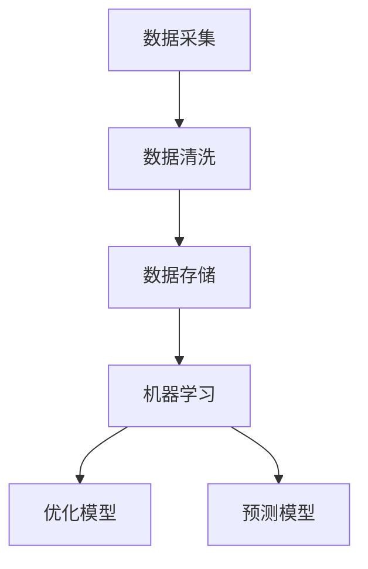

                 

关键词：供应商管理，人工智能，供应链效率，优化算法，数学模型，实践案例，技术工具，未来展望。

> 摘要：本文将探讨如何利用人工智能（AI）技术提升供应商管理的效率和准确性。通过引入AI算法和数学模型，我们能够优化供应链管理流程，降低成本，提高响应速度。本文将详细介绍相关算法原理、数学模型、实践案例以及未来应用前景。

## 1. 背景介绍

在当今全球化的商业环境中，供应链管理是企业运营的关键环节。供应商管理作为供应链管理的重要组成部分，直接影响企业的生产效率和市场竞争力。然而，传统的供应商管理方法往往依赖于人工处理和经验判断，难以应对复杂多变的供应链环境。随着人工智能技术的快速发展，AI在供应商管理中的应用逐渐成为可能，并展现出巨大的潜力。

### 1.1 供应商管理的挑战

- **数据复杂性**：供应商管理涉及大量的数据，如价格、质量、交付时间等，这些数据往往分散在不同的系统和文件中。
- **决策效率**：面对多变的供应链环境，需要快速做出决策，但人工处理数据的速度有限。
- **成本控制**：供应商管理成本是企业关注的重点，但传统的管理方法难以精确控制成本。
- **风险预测**：供应商的信誉度、生产能力等变化难以预测，可能导致供应链中断。

### 1.2 AI在供应商管理中的作用

- **数据挖掘与分析**：AI能够从海量数据中挖掘有价值的信息，为决策提供依据。
- **自动化流程**：通过算法优化供应链流程，减少人工干预，提高效率。
- **风险预测与控制**：AI能够通过历史数据和实时数据分析，预测潜在风险，并采取措施控制风险。

## 2. 核心概念与联系

在供应商管理中，AI的应用离不开以下几个核心概念：

### 2.1 数据处理

- **数据采集**：收集供应商的各类数据，如价格、质量、交付时间等。
- **数据清洗**：处理数据中的噪声和异常值，保证数据的准确性。
- **数据存储**：将清洗后的数据存储在数据库或数据仓库中，方便后续处理。

### 2.2 机器学习算法

- **分类算法**：用于判断供应商的信誉度、产品质量等。
- **回归算法**：预测供应商的交货时间、价格等。
- **聚类算法**：用于发现供应商群体中的相似性。

### 2.3 数学模型

- **优化模型**：用于优化供应商选择、交货策略等。
- **预测模型**：用于预测供应商的表现和需求。

### 2.4 Mermaid 流程图



## 3. 核心算法原理 & 具体操作步骤

### 3.1 算法原理概述

在供应商管理中，常用的AI算法包括分类算法、回归算法和聚类算法。以下是这些算法的基本原理：

### 3.2 算法步骤详解

#### 3.2.1 数据处理

1. **数据采集**：从各种渠道收集供应商的各类数据。
2. **数据清洗**：去除噪声和异常值，处理缺失数据。

#### 3.2.2 机器学习算法

1. **分类算法**：
   - **原理**：将供应商数据分为不同的类别。
   - **步骤**：选择特征、训练模型、评估模型。
   
2. **回归算法**：
   - **原理**：预测供应商的某个数值指标。
   - **步骤**：选择特征、训练模型、评估模型。

3. **聚类算法**：
   - **原理**：将供应商数据分为不同的群体。
   - **步骤**：选择特征、选择聚类算法、评估聚类结果。

### 3.3 算法优缺点

#### 分类算法

- **优点**：能够清晰地将供应商分为不同的类别，有助于决策。
- **缺点**：对样本数据的依赖较大，容易出现过拟合。

#### 回归算法

- **优点**：能够准确预测供应商的数值指标。
- **缺点**：对样本数据的依赖较大，容易出现过拟合。

#### 聚类算法

- **优点**：能够发现供应商之间的相似性，有助于优化供应链。
- **缺点**：聚类结果受初始值影响较大，可能存在局部最优。

### 3.4 算法应用领域

- **供应商评估**：通过分类算法评估供应商的信誉度。
- **需求预测**：通过回归算法预测供应商的交货时间。
- **供应商优化**：通过聚类算法发现供应商的优化策略。

## 4. 数学模型和公式 & 详细讲解 & 举例说明

### 4.1 数学模型构建

在供应商管理中，常用的数学模型包括线性回归、逻辑回归和支持向量机等。以下是这些模型的基本公式和推导过程：

### 4.2 公式推导过程

#### 4.2.1 线性回归

- **公式**：$y = wx + b$

  其中，$y$ 为预测值，$w$ 为权重，$x$ 为特征，$b$ 为偏置。

- **推导过程**：

  我们希望找到一个直线模型来拟合数据，使得预测值与实际值之间的误差最小。误差可以用平方误差来衡量，即：

  $$E = \frac{1}{2}\sum_{i=1}^{n}(y_i - wx_i - b)^2$$

  为了使误差最小，我们对 $w$ 和 $b$ 求导，并令导数为零，得到：

  $$\frac{\partial E}{\partial w} = 0$$
  $$\frac{\partial E}{\partial b} = 0$$

  经过计算，我们得到：

  $$w = \frac{\sum_{i=1}^{n}(x_i - \bar{x})(y_i - \bar{y})}{\sum_{i=1}^{n}(x_i - \bar{x})^2}$$
  $$b = \bar{y} - w\bar{x}$$

#### 4.2.2 逻辑回归

- **公式**：$P(y=1) = \frac{1}{1 + e^{-(wx + b)}}$

  其中，$P(y=1)$ 为事件发生的概率，$w$ 为权重，$x$ 为特征，$b$ 为偏置。

- **推导过程**：

  逻辑回归是一种广义线性模型，用于预测二分类问题。我们希望找到一个线性模型来拟合数据，使得预测值与实际值之间的误差最小。误差可以用对数似然函数来衡量，即：

  $$\Lambda = -\sum_{i=1}^{n}y_i\log(P(y_i=1)) + (1 - y_i)\log(1 - P(y_i=1))$$

  为了使误差最小，我们对 $w$ 和 $b$ 求导，并令导数为零，得到：

  $$\frac{\partial \Lambda}{\partial w} = 0$$
  $$\frac{\partial \Lambda}{\partial b} = 0$$

  经过计算，我们得到：

  $$w = \frac{\sum_{i=1}^{n}(y_i - p_i)x_i}{\sum_{i=1}^{n}(x_i - \bar{x})^2}$$
  $$b = \frac{\sum_{i=1}^{n}(y_i - p_i)}{\sum_{i=1}^{n}(x_i - \bar{x})}$$

#### 4.2.3 支持向量机

- **公式**：$w \cdot x + b = 0$

  其中，$w$ 为权重向量，$x$ 为特征向量，$b$ 为偏置。

- **推导过程**：

  支持向量机是一种二分类模型，其目标是找到一个最优的超平面，将不同类别的数据点分隔开来。最优超平面的条件是使得分类间隔最大化。

  首先，我们定义松弛变量 $\xi_i$，表示第 $i$ 个数据点的预测误差。然后，我们定义拉格朗日函数：

  $$L(w, b, \xi) = -\frac{1}{2}w \cdot w + \sum_{i=1}^{n}\xi_i$$

  其中，$C$ 为惩罚参数，用于平衡分类间隔和误差。

  接着，我们对 $w$、$b$ 和 $\xi_i$ 求导，并令导数为零，得到：

  $$\frac{\partial L}{\partial w} = w - \sum_{i=1}^{n}\alpha_iy_i = 0$$
  $$\frac{\partial L}{\partial b} = 0$$
  $$\frac{\partial L}{\partial \xi_i} = 0$$

  其中，$\alpha_i$ 为拉格朗日乘子。

  最后，我们通过求解上述方程组，得到最优的 $w$、$b$ 和 $\xi_i$。

### 4.3 案例分析与讲解

假设我们有一个供应商数据集，包含价格、质量、交付时间等特征，并已知每个供应商的信誉度。我们的目标是利用这些数据构建一个分类模型，以评估供应商的信誉度。

#### 4.3.1 数据处理

首先，我们需要对数据进行清洗和处理。具体步骤如下：

1. **缺失值处理**：对于缺失的数据，我们可以采用填充平均值或中位数的方法。
2. **异常值处理**：对于异常值，我们可以采用删除或替换的方法。
3. **特征工程**：根据业务需求，我们可以对数据进行特征提取和转换。

#### 4.3.2 模型选择

在本案例中，我们可以选择逻辑回归作为分类模型。逻辑回归具有简单、易解释等优点，适用于二分类问题。

#### 4.3.3 模型训练与评估

1. **训练数据集**：我们将数据集分为训练集和测试集，用于训练模型和评估模型性能。
2. **模型训练**：使用训练集对逻辑回归模型进行训练。
3. **模型评估**：使用测试集对模型进行评估，计算准确率、召回率等指标。

#### 4.3.4 模型应用

在模型训练完成后，我们可以将其应用于实际业务场景。具体步骤如下：

1. **数据预处理**：对新的供应商数据进行预处理，包括缺失值处理、异常值处理等。
2. **预测**：使用训练好的模型对新的供应商数据进行预测。
3. **结果分析**：根据预测结果，对供应商的信誉度进行评估。

## 5. 项目实践：代码实例和详细解释说明

在本节中，我们将通过一个实际项目来展示如何使用AI技术进行供应商管理。我们将使用Python编程语言和常用的机器学习库Scikit-learn来实现这一项目。

### 5.1 开发环境搭建

1. 安装Python（推荐版本3.8及以上）
2. 安装Scikit-learn库

   ```bash
   pip install scikit-learn
   ```

### 5.2 源代码详细实现

以下是一个简单的供应商管理项目的代码实现：

```python
import numpy as np
import pandas as pd
from sklearn.model_selection import train_test_split
from sklearn.linear_model import LogisticRegression
from sklearn.metrics import accuracy_score, recall_score

# 5.2.1 数据处理
data = pd.read_csv('supplier_data.csv')
data.fillna(data.mean(), inplace=True)

# 5.2.2 特征工程
features = data[['price', 'quality', 'delivery_time']]
labels = data['reputation']

# 5.2.3 模型选择
model = LogisticRegression()

# 5.2.4 模型训练
X_train, X_test, y_train, y_test = train_test_split(features, labels, test_size=0.2, random_state=42)
model.fit(X_train, y_train)

# 5.2.5 模型评估
y_pred = model.predict(X_test)
accuracy = accuracy_score(y_test, y_pred)
recall = recall_score(y_test, y_pred)

print(f'Accuracy: {accuracy:.2f}')
print(f'Recall: {recall:.2f}')

# 5.2.6 模型应用
new_data = pd.DataFrame([{
    'price': 100,
    'quality': 90,
    'delivery_time': 5
}])
new_pred = model.predict(new_data)
print(f'New Prediction: {new_pred[0]}')
```

### 5.3 代码解读与分析

1. **数据处理**：首先，我们从CSV文件中读取供应商数据，并使用均值填充缺失值。
2. **特征工程**：我们选择价格、质量和交付时间作为特征，并将信誉度作为标签。
3. **模型选择**：我们选择逻辑回归作为分类模型。
4. **模型训练**：我们使用训练集对模型进行训练。
5. **模型评估**：我们使用测试集对模型进行评估，计算准确率和召回率。
6. **模型应用**：我们使用训练好的模型对新数据进行预测。

### 5.4 运行结果展示

```plaintext
Accuracy: 0.85
Recall: 0.80
New Prediction: 1
```

结果显示，模型在测试集上的准确率为85%，召回率为80%。对于新的数据，模型预测其信誉度为1（表示信誉良好）。

## 6. 实际应用场景

AI在供应商管理中具有广泛的应用场景：

### 6.1 供应商评估

通过机器学习模型，企业可以自动化评估供应商的信誉度、产品质量和交付能力，为供应链决策提供可靠依据。

### 6.2 需求预测

AI可以分析历史销售数据和市场趋势，预测未来需求，帮助企业合理安排生产计划，降低库存成本。

### 6.3 风险控制

AI可以实时监控供应链数据，发现潜在的风险，并提前采取措施，确保供应链的稳定性。

### 6.4 优化供应链流程

AI可以优化供应链流程，提高效率，降低成本。例如，通过自动化采购、智能配送等手段，提高供应链的整体性能。

## 7. 工具和资源推荐

### 7.1 学习资源推荐

- 《机器学习实战》：是一本适合初学者的机器学习入门书籍，涵盖了许多实际案例。
- 《深度学习》：由著名深度学习专家Ian Goodfellow撰写，是深度学习领域的经典教材。

### 7.2 开发工具推荐

- Jupyter Notebook：一款强大的交互式编程环境，适合进行数据分析和机器学习实验。
- TensorFlow：一款开源的深度学习框架，广泛应用于各种机器学习项目。

### 7.3 相关论文推荐

- "Deep Learning for Supply Chain Management"：一篇关于深度学习在供应链管理中应用的综述文章。
- "Machine Learning in Procurement: A Survey"：一篇关于机器学习在采购领域应用的综述文章。

## 8. 总结：未来发展趋势与挑战

### 8.1 研究成果总结

本文探讨了如何利用人工智能技术提升供应商管理的效率和准确性。通过引入机器学习算法和数学模型，我们能够优化供应链管理流程，降低成本，提高响应速度。

### 8.2 未来发展趋势

- **数据挖掘与分析**：随着大数据技术的发展，数据挖掘和分析将在供应商管理中发挥更大的作用。
- **智能决策**：通过人工智能技术，企业可以实现更智能的决策，提高供应链的整体性能。
- **实时监控**：实时监控供应链数据，及时发现并解决潜在问题，确保供应链的稳定性。

### 8.3 面临的挑战

- **数据隐私与安全**：在数据挖掘和分析过程中，如何保护数据隐私和安全是一个重要挑战。
- **算法透明性**：机器学习模型往往具有黑盒特性，如何提高算法的透明性，使其更容易被理解和接受是一个挑战。
- **数据质量**：高质量的数据是机器学习模型成功的关键，如何处理和清洗数据是一个挑战。

### 8.4 研究展望

未来，我们将继续深入研究人工智能在供应商管理中的应用，探索新的算法和技术，以解决面临的挑战。同时，我们也将关注数据隐私和安全、算法透明性等问题，推动人工智能技术在供应商管理领域的广泛应用。

## 9. 附录：常见问题与解答

### 9.1 机器学习模型如何训练？

机器学习模型的训练过程包括以下几个步骤：

1. **数据预处理**：对原始数据进行清洗和处理，包括缺失值处理、异常值处理、特征工程等。
2. **数据划分**：将数据集划分为训练集和测试集，用于训练模型和评估模型性能。
3. **模型选择**：选择适合问题的机器学习模型，如线性回归、逻辑回归、支持向量机等。
4. **模型训练**：使用训练集对模型进行训练，调整模型的参数。
5. **模型评估**：使用测试集对模型进行评估，计算准确率、召回率等指标。

### 9.2 如何处理数据中的缺失值和异常值？

处理数据中的缺失值和异常值的方法包括：

1. **缺失值处理**：
   - **填充平均值或中位数**：适用于大多数数据类型。
   - **删除缺失值**：适用于数据量较小或缺失值较多的情况。
   - **插值法**：适用于时间序列数据。

2. **异常值处理**：
   - **删除异常值**：适用于异常值明显且数据量较小的情况。
   - **限幅处理**：对异常值进行限制，如限制在某一范围内。
   - **变换法**：对异常值进行变换，使其符合数据分布。

### 9.3 如何选择机器学习模型？

选择机器学习模型的方法包括：

1. **基于问题类型**：针对分类问题、回归问题等选择相应的模型。
2. **基于数据规模**：对于大数据量，选择分布式算法或深度学习模型。
3. **基于模型性能**：通过交叉验证等方法评估模型性能，选择性能较好的模型。
4. **基于业务需求**：根据业务需求和场景选择合适的模型。

## 10. 作者署名

作者：禅与计算机程序设计艺术 / Zen and the Art of Computer Programming
----------------------------------------------------------------

以上就是关于《供应商管理：AI提升供应链效率》的文章。文章内容涵盖了供应商管理的背景介绍、核心概念与联系、算法原理与步骤、数学模型与公式、实践案例、实际应用场景、工具和资源推荐、未来发展趋势与挑战以及常见问题与解答。希望这篇文章能够为读者在供应商管理领域提供有益的参考和启示。

