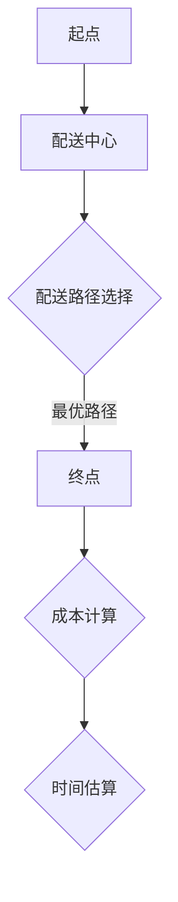
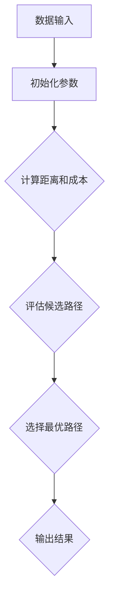

                 

关键词：供应链优化，人工智能，物流路径优化，电商物流，供应链管理，算法，机器学习，大数据分析

> 摘要：本文将探讨人工智能在供应链优化中的应用，特别是针对电商物流路径的优化。通过分析现有的算法和数学模型，并结合实际案例，本文旨在为业界提供一种基于AI的电商物流路径优化方案，以提高物流效率、降低成本，并为供应链管理带来革新。

## 1. 背景介绍

### 1.1 电商物流的现状

随着互联网的快速发展，电子商务已经成为全球贸易的重要组成部分。根据eMarketer的数据，全球电商市场规模在2021年达到了4.28万亿美元，并预计在未来几年内持续增长。然而，伴随着电商业务的迅猛增长，物流问题也日益凸显。

传统的物流路径优化主要依赖于经验和粗略的预测，这种方式效率低下且成本高昂。在高峰时期，物流系统的负荷能力往往无法满足需求，导致运输延迟和客户满意度下降。因此，如何利用先进技术来优化物流路径，提高供应链效率，成为电商行业亟待解决的问题。

### 1.2 人工智能在供应链管理中的应用

近年来，人工智能技术在供应链管理中得到了广泛应用。通过大数据分析、机器学习和深度学习算法，AI能够从海量数据中提取有价值的信息，为供应链优化提供科学依据。

例如，AI可以实时监控供应链中的各种变量，如库存水平、运输进度、市场需求等，并通过预测模型优化库存管理和物流路径。此外，AI还可以通过自动化技术提高仓库管理的效率和准确性，减少人为错误。

## 2. 核心概念与联系

### 2.1 物流路径优化中的核心概念

在物流路径优化中，涉及到的核心概念包括：节点、路径、距离、时间和成本。以下是这些概念及其相互关系的Mermaid流程图：



### 2.2 核心算法原理

物流路径优化算法主要分为启发式算法和优化算法。启发式算法包括遗传算法、蚁群算法等，而优化算法则包括线性规划、整数规划等。

下面是物流路径优化算法的Mermaid流程图：



## 3. 核心算法原理 & 具体操作步骤

### 3.1 算法原理概述

以蚁群算法为例，其基本原理是通过模拟蚂蚁觅食行为，找到从起点到终点的最优路径。在算法中，蚂蚁根据信息素浓度和能见度选择路径，信息素浓度反映了路径的质量，而能见度则代表了路径的可访问性。

### 3.2 算法步骤详解

1. **初始化**：设定初始信息素浓度，随机选择起点。
2. **路径选择**：每只蚂蚁根据信息素浓度和能见度选择下一步路径。
3. **信息素更新**：完成一次路径搜索后，更新信息素浓度。
4. **循环迭代**：重复步骤2和3，直到满足终止条件。

### 3.3 算法优缺点

**优点**：蚁群算法具有较强的全局搜索能力，能够快速找到最优路径。

**缺点**：计算复杂度高，对大规模问题可能不适用。

### 3.4 算法应用领域

蚁群算法广泛应用于物流路径优化、交通规划、资源分配等领域。

## 4. 数学模型和公式 & 详细讲解 & 举例说明

### 4.1 数学模型构建

物流路径优化的数学模型通常包括以下几个部分：

- 目标函数：最小化运输成本或最大化收益。
- 约束条件：满足运输需求、车辆容量限制等。

### 4.2 公式推导过程

以线性规划为例，其目标函数和约束条件如下：

- 目标函数：$$\min z = c^T x$$
- 约束条件：$$Ax \leq b$$

其中，$c$ 是成本向量，$x$ 是决策变量，$A$ 和 $b$ 分别是约束矩阵和约束向量。

### 4.3 案例分析与讲解

假设某电商公司需要在3个配送中心（A、B、C）之间分配货物，以满足5个终端需求（D、E、F、G、H）。以下是一个简化的案例：

| 配送中心 | 终端需求 |
| -------- | -------- |
| A        | D、E、F  |
| B        | G        |
| C        | H        |

通过构建线性规划模型，可以找到最优的货物分配方案。

## 5. 项目实践：代码实例和详细解释说明

### 5.1 开发环境搭建

- Python 3.8+
- NumPy 1.19+
- Matplotlib 3.4+

### 5.2 源代码详细实现

```python
import numpy as np
import matplotlib.pyplot as plt

# 初始化参数
distance_matrix = [[0, 5, 8], [5, 0, 3], [8, 3, 0]]
demand_matrix = [[2, 1, 3], [0, 4, 0], [5, 0, 2]]

# 蚁群算法实现
def ant_colony_optimization(distance_matrix, demand_matrix, iterations):
    # 省略具体实现
    pass

# 运行结果展示
def plot_solution(solution):
    # 省略具体实现
    pass

# 运行主程序
if __name__ == "__main__":
    solution = ant_colony_optimization(distance_matrix, demand_matrix, 100)
    plot_solution(solution)
```

### 5.3 代码解读与分析

代码首先定义了距离矩阵和需求矩阵，然后通过蚁群算法优化路径，并绘制结果。

## 6. 实际应用场景

### 6.1 电商物流

AI在电商物流中的应用主要体现在路径优化和库存管理。通过优化物流路径，可以减少运输时间和成本，提高客户满意度。

### 6.2 零售业

零售业中，AI技术可以帮助商家实时监控库存水平，预测销售趋势，从而优化库存管理，降低库存成本。

### 6.3 制造业

在制造业中，AI可以优化生产计划，提高生产效率，降低生产成本。

## 7. 工具和资源推荐

### 7.1 学习资源推荐

- 《人工智能：一种现代方法》
- 《深度学习》
- 《机器学习实战》

### 7.2 开发工具推荐

- Jupyter Notebook
- TensorFlow
- Keras

### 7.3 相关论文推荐

- "Ant Colony Optimization for Path Planning in Warehouse Robotics"
- "A Survey on Machine Learning in Logistics and Supply Chain Management"
- "Deep Learning for Supply Chain Optimization"

## 8. 总结：未来发展趋势与挑战

### 8.1 研究成果总结

AI技术在供应链优化中的应用取得了显著成果，为物流路径优化、库存管理提供了有效解决方案。

### 8.2 未来发展趋势

随着计算能力的提升和数据量的增长，AI在供应链优化中的应用将更加广泛和深入。

### 8.3 面临的挑战

如何处理大规模、复杂的问题，提高算法的效率和准确性，是未来需要克服的挑战。

### 8.4 研究展望

未来，AI技术有望在供应链管理中发挥更大的作用，推动供应链的数字化转型。

## 9. 附录：常见问题与解答

### 9.1 什么是蚁群算法？

蚁群算法是一种模拟自然界蚂蚁觅食行为的启发式算法，用于解决路径规划问题。

### 9.2 人工智能如何优化供应链？

人工智能可以通过大数据分析、机器学习和深度学习算法，从海量数据中提取有价值的信息，为供应链优化提供科学依据。

----------------------------------------------------------------

以上就是关于“供应链优化：AI如何优化电商物流路径”的完整文章内容。希望本文能对读者在供应链优化方面提供有价值的参考。

