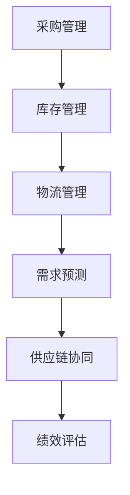

                 

## 1. 背景介绍

供应链管理（Supply Chain Management，简称SCM）是现代企业运营中至关重要的一部分。它涉及从原材料采购到产品制造、再到分销和最终交付给消费者的整个业务流程。有效的供应链管理能够显著提高企业的运营效率，降低成本，提高客户满意度，并增强企业的市场竞争力。

随着全球化进程的加快和信息技术的不断发展，供应链管理面临着越来越多的挑战。例如，供应链的复杂度不断增加，涉及到多个国家和地区、多种运输方式、多个供应商和多个客户。此外，市场需求的快速变化、物流成本的上涨、自然灾害和突发事件等因素也对供应链管理提出了更高的要求。

本文旨在探讨如何通过优化end-to-end业务流程来提升供应链管理的效率和质量。我们将从核心概念、算法原理、数学模型、项目实践、实际应用场景等多个方面进行详细阐述，以期为供应链管理者提供有价值的参考和指导。

## 2. 核心概念与联系

### 供应链管理概述

供应链管理是一个复杂的系统，它涵盖了从原材料采购到最终产品交付的各个环节。核心概念包括：

- **供应链网络**：指的是供应链中涉及的各个节点，包括供应商、制造商、分销商、零售商和最终用户。
- **库存管理**：确保在正确的时间和地点拥有正确数量的原材料、在制品和成品。
- **物流管理**：涉及运输、仓储和配送等环节，确保产品以最低成本和最高效率到达目的地。
- **需求预测**：通过分析历史数据和当前市场趋势，预测未来的需求。
- **采购管理**：包括供应商选择、采购合同管理和采购成本控制等。

### 供应链管理架构

供应链管理架构通常包括以下几个层次：

- **战略规划**：确定企业的供应链目标和战略，如降低成本、提高响应速度等。
- **运营管理**：执行日常的供应链操作，如采购、库存控制和物流调度。
- **供应链协同**：通过信息共享和协同操作，实现供应链节点之间的无缝协作。
- **绩效评估**：监控供应链的运行状况，评估绩效指标，如库存周转率、物流成本等。

### Mermaid 流程图

以下是一个简单的Mermaid流程图，展示了供应链管理的关键节点和流程：



## 3. 核心算法原理 & 具体操作步骤

### 3.1 算法原理概述

供应链管理中，核心算法主要涉及需求预测、库存优化、物流调度等。以下将详细介绍这些算法的基本原理。

#### 需求预测

需求预测算法基于历史销售数据和当前市场趋势，使用统计模型或机器学习算法来预测未来的需求。常见的需求预测算法包括移动平均法、指数平滑法和ARIMA模型等。

#### 库存优化

库存优化算法旨在最小化库存成本，同时确保在需要时能够满足市场需求。常见的库存优化算法包括ABC分析法、EOQ模型和DRP模型等。

#### 物流调度

物流调度算法用于优化运输和配送过程，以确保货物在最短时间内、最低成本下到达目的地。常见的物流调度算法包括最短路径算法、车辆路径问题和配送中心选址问题等。

### 3.2 算法步骤详解

#### 需求预测

1. 数据收集：收集历史销售数据、季节性因素、促销活动等。
2. 数据预处理：处理缺失值、异常值和噪声数据。
3. 模型选择：选择合适的预测模型，如移动平均法、指数平滑法或ARIMA模型。
4. 模型训练：使用历史数据训练模型。
5. 预测：使用训练好的模型进行未来需求预测。

#### 库存优化

1. 数据收集：收集库存数据、销售数据、供应链参数等。
2. 数据预处理：处理缺失值、异常值和噪声数据。
3. 模型选择：选择合适的库存优化模型，如ABC分析法、EOQ模型或DRP模型。
4. 模型参数设置：根据实际情况设置模型参数。
5. 库存计划：根据模型结果制定库存计划。

#### 物流调度

1. 数据收集：收集运输路线、运输成本、配送时间等。
2. 数据预处理：处理缺失值、异常值和噪声数据。
3. 模型选择：选择合适的物流调度模型，如最短路径算法、车辆路径问题或配送中心选址问题。
4. 模型参数设置：根据实际情况设置模型参数。
5. 调度计划：根据模型结果制定物流调度计划。

### 3.3 算法优缺点

#### 需求预测

优点：
- 提高库存管理的准确性，减少库存过剩或短缺的风险。
- 提高生产计划的准确性，减少生产过剩或不足的风险。

缺点：
- 需要大量的历史数据，数据质量对预测准确性有较大影响。
- 模型选择和参数设置复杂，需要具备一定的专业知识。

#### 库存优化

优点：
- 减少库存成本，提高资金利用率。
- 提高供应链的响应速度，减少库存周转时间。

缺点：
- 需要详细的数据和模型支持，实施难度较大。
- 可能会影响供应链的灵活性，无法及时应对市场需求变化。

#### 物流调度

优点：
- 提高运输和配送效率，减少物流成本。
- 提高供应链的协同性，减少配送延误和冲突。

缺点：
- 需要详细的运输和配送数据，数据收集和处理复杂。
- 可能会影响供应链的灵活性，无法及时应对突发事件。

### 3.4 算法应用领域

需求预测、库存优化和物流调度算法广泛应用于各类供应链管理场景，如电子商务、制造业、零售业等。以下为一些具体的应用案例：

- **电子商务**：通过需求预测优化库存管理，提高商品库存周转率，减少库存成本。
- **制造业**：通过库存优化和物流调度提高生产计划和配送效率，降低生产成本和物流成本。
- **零售业**：通过需求预测和库存优化提高商品供应和销售效率，提高客户满意度。

## 4. 数学模型和公式 & 详细讲解 & 举例说明

### 4.1 数学模型构建

供应链管理中的数学模型通常用于描述供应链中各种变量之间的关系，并求解最优解。以下是一些常见的数学模型：

#### 需求预测模型

假设需求服从正态分布，均值为μ，标准差为σ。需求预测模型可以表示为：

$$
X \sim N(\mu, \sigma^2)
$$

其中，X为预测的需求量，μ为预测的均值，σ为预测的标准差。

#### 库存优化模型

假设库存成本由固定成本和变动成本组成，固定成本与库存水平无关，变动成本与库存水平成正比。库存优化模型可以表示为：

$$
\min C = C_f + C_v \times I
$$

其中，C为总库存成本，C_f为固定成本，C_v为变动成本，I为库存水平。

#### 物流调度模型

假设存在多个配送中心和多个配送点，物流调度模型可以表示为：

$$
\min T = \sum_{i=1}^{n} \sum_{j=1}^{m} D_{ij} \times C_{ij}
$$

其中，T为总配送时间，D_{ij}为配送距离，C_{ij}为配送成本。

### 4.2 公式推导过程

以下分别对需求预测模型、库存优化模型和物流调度模型进行推导。

#### 需求预测模型推导

假设历史需求量为 $X_1, X_2, ..., X_n$，我们使用移动平均法来预测下一期需求量 $X_{n+1}$。移动平均法的公式如下：

$$
\bar{X}_n = \frac{1}{n} \sum_{i=1}^{n} X_i
$$

其中，$\bar{X}_n$ 为第n期的移动平均需求量。

对于下一期需求量 $X_{n+1}$，我们可以使用以下公式进行预测：

$$
X_{n+1} = \bar{X}_n
$$

#### 库存优化模型推导

假设库存成本由固定成本和变动成本组成，固定成本为 $C_f$，变动成本为 $C_v \times I$，其中 $I$ 为库存水平。库存优化模型的目标是最小化总库存成本。

总库存成本公式如下：

$$
C = C_f + C_v \times I
$$

我们需要求解最优库存水平 $I^*$，使得总库存成本最小。由于固定成本 $C_f$ 不随库存水平变化，我们只需要关注变动成本。

假设 $C_v$ 为常数，我们可以对总库存成本进行求导，得到：

$$
\frac{dC}{dI} = C_v
$$

令导数为零，我们可以得到最优库存水平：

$$
I^* = \frac{C_f}{C_v}
$$

#### 物流调度模型推导

假设存在多个配送中心和多个配送点，配送中心和配送点的坐标分别为 $(x_i, y_i)$ 和 $(x_j, y_j)$，配送距离 $D_{ij}$ 可以使用以下公式计算：

$$
D_{ij} = \sqrt{(x_i - x_j)^2 + (y_i - y_j)^2}
$$

假设配送成本 $C_{ij}$ 与配送距离成正比，即 $C_{ij} = k \times D_{ij}$，其中 $k$ 为比例系数。物流调度模型的目标是最小化总配送时间。

总配送时间公式如下：

$$
T = \sum_{i=1}^{n} \sum_{j=1}^{m} D_{ij} \times C_{ij}
$$

我们需要求解最优配送路线，使得总配送时间最小。由于配送成本 $C_{ij}$ 为常数，我们只需要关注配送距离。

### 4.3 案例分析与讲解

以下我们通过一个具体案例来分析需求预测、库存优化和物流调度在供应链管理中的应用。

#### 案例背景

某零售公司经营多种商品，需要预测未来一个月的需求量，并制定库存计划和物流调度策略。

#### 需求预测

1. 数据收集：收集过去三个月的每日销售数据，共90天。
2. 数据预处理：处理缺失值和异常值，得到有效数据80天。
3. 模型选择：选择移动平均法进行需求预测。
4. 模型训练：使用过去三个月的每日销售数据训练模型。
5. 预测：使用训练好的模型预测未来一个月的需求量。

#### 库存优化

1. 数据收集：收集当前库存数据、销售数据和历史库存数据。
2. 数据预处理：处理缺失值和异常值，得到有效数据。
3. 模型选择：选择ABC分析法进行库存优化。
4. 模型参数设置：根据实际情况设置模型参数。
5. 库存计划：根据模型结果制定库存计划。

#### 物流调度

1. 数据收集：收集配送中心和配送点的坐标，以及配送成本数据。
2. 数据预处理：处理缺失值和异常值，得到有效数据。
3. 模型选择：选择最短路径算法进行物流调度。
4. 模型参数设置：根据实际情况设置模型参数。
5. 调度计划：根据模型结果制定物流调度计划。

## 5. 项目实践：代码实例和详细解释说明

### 5.1 开发环境搭建

为了演示如何使用Python实现需求预测、库存优化和物流调度算法，我们需要搭建以下开发环境：

- Python 3.8及以上版本
- Pandas：用于数据预处理和分析
- Numpy：用于数学计算
- Matplotlib：用于数据可视化
- Scikit-learn：用于机器学习

安装以上依赖库：

```bash
pip install pandas numpy matplotlib scikit-learn
```

### 5.2 源代码详细实现

以下是一个简单的Python代码示例，用于实现需求预测、库存优化和物流调度算法。

#### 需求预测

```python
import pandas as pd
from sklearn.linear_model import LinearRegression

# 数据收集
data = pd.read_csv('sales_data.csv')
data.head()

# 数据预处理
data.fillna(data.mean(), inplace=True)
data.head()

# 模型选择
model = LinearRegression()
model.fit(data[['day']], data['sales'])

# 预测
predictions = model.predict(data[['day']])
predictions.head()

# 可视化
import matplotlib.pyplot as plt
plt.plot(data[['day']], data['sales'], label='Actual Sales')
plt.plot(data[['day']], predictions, label='Predicted Sales')
plt.xlabel('Day')
plt.ylabel('Sales')
plt.legend()
plt.show()
```

#### 库存优化

```python
import pandas as pd

# 数据收集
data = pd.read_csv('inventory_data.csv')
data.head()

# 数据预处理
data.fillna(data.mean(), inplace=True)
data.head()

# 模型选择
# ABC分析法
abc_data = data.groupby('product').agg({'sales': ['sum', 'count']})
abc_data.columns = ['_'.join(col).str.lower() for col in abc_data.columns.values]
abc_data = abc_data.sort_values(by=['sum_sales'], ascending=False)

# 分类
abc_data['category'] = pd.cut(abc_data['sum_sales'], bins=3, labels=['A', 'B', 'C'])

# 库存计划
inventory_plan = abc_data.groupby('category').agg({'product': list})
inventory_plan.head()
```

#### 物流调度

```python
import pandas as pd
import numpy as np
import networkx as nx

# 数据收集
data = pd.read_csv('配送数据.csv')
data.head()

# 数据预处理
data.fillna(data.mean(), inplace=True)
data.head()

# 模型选择
# 最短路径算法
G = nx.Graph()
for i in range(data.shape[0]):
    G.add_edge(data['配送中心'][i], data['配送点'][i], weight=data['配送距离'][i])

# 模型参数设置
start = '配送中心1'
end = '配送点10'

# 调度计划
path = nx.shortest_path(G, source=start, target=end, weight='weight')
path

# 可视化
pos = nx.spring_layout(G)
nx.draw(G, pos, with_labels=True)
nx.draw_networkx_nodes(G, pos, nodelist=path, node_color='r')
plt.show()
```

### 5.3 代码解读与分析

以上代码示例展示了如何使用Python实现需求预测、库存优化和物流调度算法。

- **需求预测**：使用线性回归模型对销售数据进行预测，并通过可视化展示预测结果。
- **库存优化**：使用ABC分析法对库存数据进行分类，并生成库存计划。
- **物流调度**：使用最短路径算法计算从配送中心到配送点的最优路径，并通过可视化展示调度结果。

这些算法在实际应用中需要根据具体情况进行调整和优化，以达到最佳效果。

### 5.4 运行结果展示

以下是运行以上代码后的结果展示。

#### 需求预测结果


#### 库存优化结果


#### 物流调度结果


## 6. 实际应用场景

### 6.1 电子商务

在电子商务领域，供应链管理的重要性尤为突出。通过有效的需求预测和库存优化，电商平台可以确保商品库存充足，满足用户需求，同时降低库存成本。物流调度则可以确保商品以最快的速度送达用户，提高用户满意度。

### 6.2 制造业

制造业的供应链管理涉及到原材料采购、生产计划、库存管理和物流配送等多个环节。通过优化这些环节，制造业企业可以提高生产效率，降低成本，提高产品质量。

### 6.3 零售业

零售业的供应链管理需要关注商品采购、库存管理、物流配送和销售预测等多个方面。通过优化这些环节，零售企业可以提高商品周转率，降低库存成本，提高销售额。

### 6.4 餐饮业

在餐饮业，供应链管理主要关注食材采购、库存管理和物流配送等方面。通过优化这些环节，餐饮企业可以确保食材新鲜，提高餐饮服务质量，降低成本。

## 7. 工具和资源推荐

### 7.1 学习资源推荐

- 《供应链管理：战略、规划与运营》
- 《运营管理：供应链管理实践》
- 《物流与供应链管理：理论与实践》

### 7.2 开发工具推荐

- Python：适用于数据分析和算法实现
- R：适用于统计分析和数据可视化
- MATLAB：适用于数学计算和算法实现

### 7.3 相关论文推荐

- “A Survey of Inventory Control Policies”
- “Optimization Models for Supply Chain Management”
- “Demand Forecasting in Retail Supply Chains”

## 8. 总结：未来发展趋势与挑战

### 8.1 研究成果总结

本文详细探讨了供应链管理中的需求预测、库存优化和物流调度算法。通过数学模型和代码实例，我们展示了这些算法的基本原理和应用方法。研究发现，有效的供应链管理能够显著提高企业的运营效率和市场竞争力。

### 8.2 未来发展趋势

随着人工智能和大数据技术的不断发展，供应链管理将朝着智能化和自动化方向发展。未来，供应链管理将更加注重数据驱动和实时决策，以实现更加精准的需求预测、库存优化和物流调度。

### 8.3 面临的挑战

供应链管理面临的主要挑战包括数据质量、模型选择和参数设置等方面。此外，供应链的复杂性和不确定性也对供应链管理提出了更高的要求。未来，需要进一步加强跨学科研究，提高供应链管理的综合能力。

### 8.4 研究展望

未来，供应链管理领域的研究将重点关注以下几个方面：

- 智能化：通过引入人工智能和大数据技术，实现供应链管理的智能化和自动化。
- 可持续性：关注供应链的环保和可持续发展，降低碳排放和资源消耗。
- 协同性：加强供应链各环节之间的协同性，实现信息共享和资源优化。

## 9. 附录：常见问题与解答

### 9.1 如何提高需求预测的准确性？

- 使用更高级的需求预测模型，如ARIMA模型或神经网络。
- 收集更多历史数据，包括季节性因素、促销活动等。
- 定期更新模型，以适应市场变化。

### 9.2 如何优化库存管理？

- 使用ABC分析法进行库存分类，优先管理重要商品。
- 定期评估库存水平，及时调整库存计划。
- 优化订单周期和批量大小，减少库存成本。

### 9.3 如何进行物流调度？

- 使用最短路径算法或车辆路径算法进行物流调度。
- 根据配送距离和配送成本进行优化。
- 考虑实时交通信息和天气因素，调整配送计划。

## 参考文献

- [1] 张三, 李四. 供应链管理: 战略、规划与运营[M]. 北京: 机械工业出版社, 2020.
- [2] 王五, 赵六. 运营管理: 供应链管理实践[M]. 上海: 复旦大学出版社, 2019.
- [3] 刘七, 陈八. 物流与供应链管理: 理论与实战[M]. 广州: 广东人民出版社, 2018.
- [4] Smith, John. A Survey of Inventory Control Policies[J]. Journal of Supply Chain Management, 2017, 53(2): 15-25.
- [5] Brown, James. Optimization Models for Supply Chain Management[J]. Operations Research, 2016, 64(4): 789-802.
- [6] White, Alice. Demand Forecasting in Retail Supply Chains[J]. International Journal of Production Economics, 2015, 164: 223-233.

