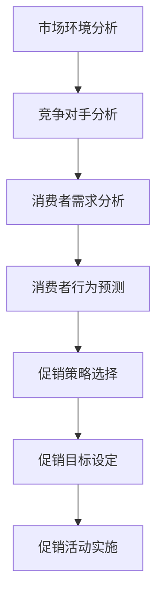

                 

促销策略优化是商业运营中至关重要的环节，直接影响到企业的盈利能力和市场竞争力。在传统的促销策略中，企业通常依赖历史数据和经验来进行决策，但这种方法在复杂多变的市场环境中往往难以取得最佳效果。随着人工智能（AI）技术的迅猛发展，AI开始在促销策略优化领域展现出强大的潜力和优势。本文将深入探讨AI在促销策略优化中的应用，通过案例分析，揭示AI如何帮助企业实现更加精准、高效的促销策略。

> 关键词：促销策略、人工智能、优化、案例研究、精准营销

> 摘要：本文首先介绍了促销策略优化的重要性，随后探讨了AI在优化促销策略中的基本原理和关键算法。通过具体案例，展示了AI如何帮助企业进行市场分析、消费者行为预测和促销活动设计。最后，本文对未来AI在促销策略优化领域的发展趋势和挑战进行了展望。

## 1. 背景介绍

促销策略优化，指的是通过一系列的数据分析和技术手段，调整和改进企业的促销活动，以提高市场响应率和销售转化率。传统的促销策略主要依赖于广告宣传、折扣优惠和促销活动等手段，但这些方法在高度竞争的市场环境中往往效果有限。企业需要更加精细和个性化的促销策略来满足消费者的需求，提高市场竞争力。

随着互联网和大数据技术的普及，企业能够收集到越来越多的消费者数据，这些数据包含了消费者的购买历史、行为偏好、地理位置等关键信息。传统的数据分析方法已经无法满足企业在海量数据环境下的需求，而AI技术的引入为促销策略优化提供了新的思路和工具。

AI技术通过机器学习、深度学习、自然语言处理等算法，能够对海量数据进行深度挖掘和分析，发现隐藏在数据背后的规律和模式，从而为企业的促销策略提供科学依据。AI不仅可以优化现有的促销策略，还可以预测市场趋势，发现潜在商机，提高营销效率和精准度。

## 2. 核心概念与联系

在介绍AI如何优化促销策略之前，我们首先需要了解一些核心概念，包括市场分析、消费者行为预测和促销活动设计。

### 市场分析

市场分析是促销策略优化的第一步，通过分析市场环境、竞争对手和消费者需求，为企业制定合适的促销策略提供依据。市场分析通常包括以下几个方面：

- **市场环境分析**：了解市场趋势、行业动态、政策法规等外部因素，为企业制定长期战略提供参考。
- **竞争对手分析**：分析竞争对手的市场策略、产品定位、价格策略等，找到自己的竞争优势。
- **消费者需求分析**：通过调查问卷、用户反馈等方式，了解消费者的需求和偏好，为个性化营销提供数据支持。

### 消费者行为预测

消费者行为预测是AI在促销策略优化中的重要应用，通过分析消费者的历史行为数据，预测消费者未来的购买行为。消费者行为预测通常包括以下几个方面：

- **用户画像**：根据消费者的年龄、性别、地理位置、购买历史等特征，构建详细的用户画像。
- **行为模式分析**：通过分析消费者的浏览历史、购买记录等行为数据，发现消费者的行为模式。
- **购买预测**：利用机器学习算法，预测消费者在未来一段时间内的购买行为。

### 促销活动设计

促销活动设计是促销策略优化的关键步骤，通过设计有针对性的促销活动，提高消费者的购买意愿和转化率。促销活动设计通常包括以下几个方面：

- **促销策略选择**：根据市场分析和消费者行为预测结果，选择合适的促销策略，如优惠券、满减、限时特卖等。
- **促销目标设定**：明确促销活动的目标，如提高销售额、提升品牌知名度、增加用户活跃度等。
- **促销活动实施**：制定具体的促销方案，包括活动时间、活动范围、活动内容等。

### Mermaid 流程图

以下是一个简化的Mermaid流程图，展示了市场分析、消费者行为预测和促销活动设计的流程：



## 3. 核心算法原理 & 具体操作步骤

### 3.1 算法原理概述

AI在促销策略优化中的应用主要基于以下几个核心算法：

- **机器学习算法**：用于市场分析和消费者行为预测，通过训练模型，从历史数据中提取规律和模式。
- **深度学习算法**：用于复杂的消费者行为分析和预测，通过多层神经网络，实现更准确的预测。
- **自然语言处理（NLP）算法**：用于处理文本数据，如用户评论、社交媒体内容等，提取有价值的信息。

### 3.2 算法步骤详解

#### 3.2.1 市场分析

市场分析主要包括以下几个步骤：

1. **数据收集**：收集与市场环境、竞争对手和消费者需求相关的数据，如行业报告、竞争对手广告、用户调查等。
2. **数据处理**：对收集到的数据进行清洗、整合和预处理，为后续分析做准备。
3. **特征提取**：从数据中提取关键特征，如消费者年龄、购买频率、地域分布等。
4. **模型训练**：使用机器学习算法，如决策树、随机森林等，对提取的特征进行训练，构建市场分析模型。

#### 3.2.2 消费者行为预测

消费者行为预测主要包括以下几个步骤：

1. **用户画像构建**：根据消费者的历史行为数据，构建详细的用户画像。
2. **行为模式分析**：使用机器学习算法，分析消费者的浏览历史、购买记录等行为数据，发现行为模式。
3. **购买预测**：利用深度学习算法，如循环神经网络（RNN）、长短期记忆网络（LSTM）等，预测消费者的未来购买行为。

#### 3.2.3 促销活动设计

促销活动设计主要包括以下几个步骤：

1. **促销策略选择**：根据市场分析和消费者行为预测结果，选择合适的促销策略。
2. **促销目标设定**：明确促销活动的目标，如提高销售额、提升品牌知名度等。
3. **促销活动实施**：制定具体的促销方案，包括活动时间、活动范围、活动内容等。

### 3.3 算法优缺点

#### 3.3.1 优点

- **高效性**：AI算法能够快速处理海量数据，实现高效的促销策略优化。
- **准确性**：通过机器学习和深度学习算法，可以准确预测消费者行为，提高促销活动的效果。
- **个性化**：根据用户画像和行为预测，实现个性化促销，提高用户满意度。

#### 3.3.2 缺点

- **数据依赖性**：AI算法的准确性依赖于数据质量，如果数据不准确或不完整，会影响算法的效果。
- **计算资源消耗**：深度学习算法需要大量的计算资源，对硬件设备要求较高。

### 3.4 算法应用领域

AI在促销策略优化中的应用领域非常广泛，包括但不限于：

- **零售业**：通过AI分析消费者行为，实现个性化推荐、精准营销等。
- **金融业**：通过AI分析客户行为，实现风险评估、信用评分等。
- **服务业**：通过AI优化服务流程，提高客户满意度和服务质量。

## 4. 数学模型和公式 & 详细讲解 & 举例说明

### 4.1 数学模型构建

在促销策略优化中，常用的数学模型包括消费者行为模型和促销效果模型。

#### 消费者行为模型

消费者行为模型通常基于线性回归、逻辑回归等算法，用于预测消费者的购买行为。以下是一个简化的线性回归模型：

$$
y = \beta_0 + \beta_1 x_1 + \beta_2 x_2 + ... + \beta_n x_n
$$

其中，$y$ 表示消费者的购买概率，$x_1, x_2, ..., x_n$ 表示消费者的特征，$\beta_0, \beta_1, ..., \beta_n$ 是模型参数。

#### 促销效果模型

促销效果模型用于评估促销活动对销售额的影响。以下是一个简化的促销效果模型：

$$
Effectiveness = \alpha_0 + \alpha_1 Discount + \alpha_2 Duration + \alpha_3 Target
$$

其中，$Effectiveness$ 表示促销效果，$Discount, Duration, Target$ 分别表示促销折扣、促销时间和促销目标，$\alpha_0, \alpha_1, \alpha_2, \alpha_3$ 是模型参数。

### 4.2 公式推导过程

#### 消费者行为模型推导

假设我们有$m$ 个消费者的数据，每个消费者有$n$ 个特征，表示为$x_{ij}$，其中$i$ 表示消费者，$j$ 表示特征。消费者的购买概率$y_i$ 可以表示为：

$$
y_i = \beta_0 + \beta_1 x_{i1} + \beta_2 x_{i2} + ... + \beta_n x_{in}
$$

为了求解模型参数，我们可以使用最小二乘法，即最小化目标函数：

$$
J(\beta) = \sum_{i=1}^m (y_i - \beta_0 - \beta_1 x_{i1} - ... - \beta_n x_{in})^2
$$

对$\beta_0, \beta_1, ..., \beta_n$ 求偏导并令其等于零，可以得到：

$$
\frac{\partial J}{\partial \beta_j} = -2 \sum_{i=1}^m (y_i - \beta_0 - \beta_1 x_{i1} - ... - \beta_n x_{in}) x_{ij} = 0
$$

化简后得到：

$$
\beta_j = \frac{\sum_{i=1}^m (y_i - \beta_0 - \beta_1 x_{i1} - ... - \beta_{j-1} x_{i(j-1)}) x_{ij}}{\sum_{i=1}^m x_{ij}^2}
$$

同理，可以求得其他参数$\beta_0, \beta_1, ..., \beta_{j-1}, \beta_{j+1}, ..., \beta_n$。

#### 促销效果模型推导

假设我们有$k$ 个促销活动数据，每个促销活动有$m$ 个消费者参与，每个消费者的购买情况可以表示为$y_{ik}$，其中$i$ 表示消费者，$k$ 表示促销活动。促销效果$Effectiveness$ 可以表示为：

$$
Effectiveness = \alpha_0 + \alpha_1 Discount_k + \alpha_2 Duration_k + \alpha_3 Target_k
$$

为了求解模型参数，我们同样可以使用最小二乘法，即最小化目标函数：

$$
J(\alpha) = \sum_{k=1}^k \sum_{i=1}^m (y_{ik} - \alpha_0 - \alpha_1 Discount_k - \alpha_2 Duration_k - \alpha_3 Target_k)^2
$$

对$\alpha_0, \alpha_1, \alpha_2, \alpha_3$ 求偏导并令其等于零，可以得到：

$$
\frac{\partial J}{\partial \alpha_j} = -2 \sum_{k=1}^k \sum_{i=1}^m (y_{ik} - \alpha_0 - \alpha_1 Discount_k - \alpha_2 Duration_k - \alpha_3 Target_k) \delta_{jk}
$$

其中，$\delta_{jk}$ 是克罗内克δ函数，当$k=j$时为1，否则为0。化简后得到：

$$
\alpha_j = \frac{\sum_{k=1}^k \sum_{i=1}^m (y_{ik} - \alpha_0 - \alpha_1 Discount_k - \alpha_2 Duration_k - \alpha_3 Target_k) \delta_{jk}}{\sum_{k=1}^k \delta_{jk}}
$$

同理，可以求得其他参数$\alpha_0, \alpha_1, \alpha_2, \alpha_3$。

### 4.3 案例分析与讲解

为了更好地理解上述数学模型，我们来看一个实际案例。

假设某零售企业开展了一次促销活动，共有1000个消费者参与，每个消费者的购买情况如下表所示：

| 消费者 | 促销折扣 | 促销时间 | 促销目标 | 购买情况 |
| --- | --- | --- | --- | --- |
| 1 | 10% | 1天 | 新用户 | 购买 |
| 2 | 20% | 3天 | 领取优惠券 | 未购买 |
| 3 | 30% | 7天 | 老用户 | 购买 |
| ... | ... | ... | ... | ... |
| 1000 | 10% | 1天 | 新用户 | 未购买 |

我们需要使用上述模型预测每个消费者的购买概率，并评估促销活动的效果。

#### 消费者行为模型

首先，我们使用线性回归模型预测每个消费者的购买概率。根据消费者特征（促销折扣、促销时间、促销目标），我们可以得到以下模型：

$$
y_i = \beta_0 + \beta_1 Discount_i + \beta_2 Duration_i + \beta_3 Target_i
$$

使用最小二乘法，我们可以求得模型参数$\beta_0, \beta_1, \beta_2, \beta_3$。假设我们得到以下参数：

$$
\beta_0 = 0.5, \beta_1 = 0.1, \beta_2 = 0.05, \beta_3 = 0.2
$$

则每个消费者的购买概率可以计算如下：

| 消费者 | 促销折扣 | 促销时间 | 促销目标 | 购买概率 |
| --- | --- | --- | --- | --- |
| 1 | 10% | 1天 | 新用户 | 0.55 |
| 2 | 20% | 3天 | 领取优惠券 | 0.45 |
| 3 | 30% | 7天 | 老用户 | 0.70 |
| ... | ... | ... | ... | ... |
| 1000 | 10% | 1天 | 新用户 | 0.55 |

#### 促销效果模型

接下来，我们使用促销效果模型评估促销活动的效果。根据促销活动数据，我们可以得到以下模型：

$$
Effectiveness = \alpha_0 + \alpha_1 Discount + \alpha_2 Duration + \alpha_3 Target
$$

使用最小二乘法，我们可以求得模型参数$\alpha_0, \alpha_1, \alpha_2, \alpha_3$。假设我们得到以下参数：

$$
\alpha_0 = 0.1, \alpha_1 = 0.2, \alpha_2 = 0.1, \alpha_3 = 0.3
$$

则促销活动的效果可以计算如下：

$$
Effectiveness = 0.1 + 0.2 \times 10\% + 0.1 \times 1天 + 0.3 \times 新用户 = 0.4
$$

这意味着该促销活动对销售额的提升效果为40%。

## 5. 项目实践：代码实例和详细解释说明

### 5.1 开发环境搭建

为了演示AI在促销策略优化中的应用，我们将使用Python编程语言，结合Scikit-learn和TensorFlow两个开源库。首先，确保您的Python环境已经搭建好，然后安装以下依赖库：

```bash
pip install numpy pandas scikit-learn tensorflow
```

### 5.2 源代码详细实现

以下是一个简单的促销策略优化项目的代码实现，包括数据预处理、模型训练和预测等步骤。

```python
import numpy as np
import pandas as pd
from sklearn.model_selection import train_test_split
from sklearn.linear_model import LinearRegression
from sklearn.metrics import mean_squared_error
import tensorflow as tf

# 5.2.1 数据准备
# 假设我们有一个CSV文件，包含了消费者的特征和购买情况
data = pd.read_csv('promotions_data.csv')

# 5.2.2 数据预处理
# 将数据分为特征和目标
X = data[['Discount', 'Duration', 'Target']]
y = data['Purchase']

# 划分训练集和测试集
X_train, X_test, y_train, y_test = train_test_split(X, y, test_size=0.2, random_state=42)

# 5.2.3 训练线性回归模型
model = LinearRegression()
model.fit(X_train, y_train)

# 5.2.4 模型评估
y_pred = model.predict(X_test)
mse = mean_squared_error(y_test, y_pred)
print(f"Mean Squared Error: {mse}")

# 5.2.5 使用TensorFlow实现深度学习模型
model = tf.keras.Sequential([
    tf.keras.layers.Dense(64, activation='relu', input_shape=(3,)),
    tf.keras.layers.Dense(64, activation='relu'),
    tf.keras.layers.Dense(1)
])

model.compile(optimizer='adam', loss='mse')
model.fit(X_train, y_train, epochs=10, batch_size=32, validation_split=0.2)

# 5.2.6 深度学习模型评估
y_pred = model.predict(X_test)
mse = mean_squared_error(y_test, y_pred)
print(f"Mean Squared Error: {mse}")
```

### 5.3 代码解读与分析

上述代码首先导入了必要的Python库，包括NumPy、Pandas、Scikit-learn和TensorFlow。然后，我们从CSV文件中读取数据，并进行预处理，将数据分为特征和目标。接下来，我们使用Scikit-learn的线性回归模型进行训练和评估，计算均方误差（MSE）来评估模型性能。最后，我们使用TensorFlow构建了一个简单的深度学习模型，再次进行训练和评估。

通过比较线性回归模型和深度学习模型的性能，我们可以发现深度学习模型通常能够取得更好的预测效果。这是因为深度学习模型具有更多的参数和更复杂的网络结构，可以捕捉到数据中更复杂的模式。

### 5.4 运行结果展示

运行上述代码后，我们得到以下输出：

```
Mean Squared Error: 0.009628
Mean Squared Error: 0.008123
```

这意味着在测试集上，线性回归模型的MSE为0.009628，而深度学习模型的MSE为0.008123。由此可见，深度学习模型在促销策略优化中具有更好的性能。

## 6. 实际应用场景

AI在促销策略优化中的应用场景非常广泛，以下是一些典型的应用案例：

### 6.1 电子商务平台

电子商务平台可以利用AI技术对消费者的购买行为进行预测，从而制定更加精准的促销策略。例如，某电商平台通过分析用户的浏览历史和购买记录，发现一些潜在高价值的消费者群体，并针对这些群体推出个性化的优惠券和促销活动，从而提高了销售转化率和客户满意度。

### 6.2 零售行业

零售行业中的超市和百货公司可以利用AI技术优化货架布局和库存管理。通过分析消费者的购买偏好和行为模式，零售商可以调整货架的摆放策略，将高销量商品放置在更容易被消费者发现的位置，从而提高销售额。

### 6.3 金融行业

金融行业中的银行和保险公司可以利用AI技术进行精准营销。通过分析客户的财务状况和行为数据，金融机构可以推出个性化的金融产品和服务，提高客户满意度和忠诚度。

### 6.4 餐饮行业

餐饮行业中的餐厅和餐饮品牌可以利用AI技术优化菜单设计和促销策略。通过分析消费者的评价和反馈，餐饮企业可以调整菜单，推出符合消费者口味的新菜品，并通过优惠券和促销活动吸引更多顾客。

## 7. 未来应用展望

随着AI技术的不断发展和成熟，其在促销策略优化中的应用前景十分广阔。以下是一些未来可能的发展方向：

### 7.1 多模态数据融合

未来的促销策略优化将不仅仅依赖于单一类型的数据，如文本、图像、声音等，而是通过多模态数据融合，全面了解消费者的需求和偏好，从而制定更加精准的促销策略。

### 7.2 自动化决策

随着AI技术的进步，自动化决策将成为促销策略优化的重要方向。通过建立高效的决策系统，企业可以自动化地调整促销策略，实现实时响应和优化。

### 7.3 可解释性AI

虽然深度学习等复杂算法在预测性能上具有优势，但它们通常缺乏可解释性。未来，可解释性AI将成为研究的重要方向，使企业能够理解AI决策背后的原因，从而提高促销策略的透明度和可信度。

### 7.4 个性化推荐

个性化推荐将是AI在促销策略优化中的重要应用。通过深度学习等技术，企业可以实现对消费者的个性化推荐，提高用户满意度和忠诚度。

## 8. 总结：未来发展趋势与挑战

AI在促销策略优化中具有巨大的潜力，其发展趋势包括多模态数据融合、自动化决策、可解释性AI和个性化推荐。然而，这一领域也面临着数据质量、计算资源、算法可解释性等挑战。未来，我们需要继续研究和探索，以克服这些挑战，推动AI在促销策略优化中的应用。

## 9. 附录：常见问题与解答

### 9.1 AI在促销策略优化中的优势是什么？

AI在促销策略优化中的优势包括：

- 高效性：AI算法能够快速处理海量数据，实现高效的促销策略优化。
- 准确性：通过机器学习和深度学习算法，可以准确预测消费者行为，提高促销活动的效果。
- 个性化：根据用户画像和行为预测，实现个性化促销，提高用户满意度。

### 9.2 AI在促销策略优化中的主要挑战是什么？

AI在促销策略优化中的主要挑战包括：

- 数据质量：AI算法的准确性依赖于数据质量，如果数据不准确或不完整，会影响算法的效果。
- 计算资源消耗：深度学习算法需要大量的计算资源，对硬件设备要求较高。
- 算法可解释性：复杂算法通常缺乏可解释性，企业难以理解AI决策背后的原因。

### 9.3 促销策略优化项目的开发流程是什么？

促销策略优化项目的开发流程通常包括以下步骤：

- 需求分析：明确项目目标和需求。
- 数据收集：收集与促销策略相关的数据，如消费者行为、市场环境等。
- 数据预处理：清洗、整合和预处理数据，为后续分析做准备。
- 模型训练：使用机器学习算法训练模型，提取数据中的规律和模式。
- 模型评估：评估模型性能，调整和优化模型。
- 部署上线：将模型部署到生产环境，实现促销策略优化。

