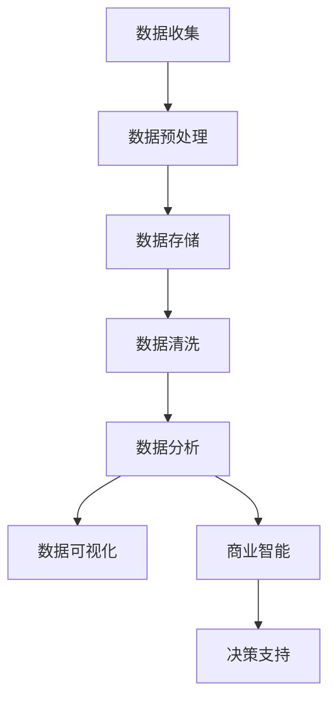

                 

关键词：信息差、商业价值、大数据、数据分析、商业智能、数据挖掘、数据可视化、机器学习、算法优化、市场洞察、用户画像、商业策略、竞争优势

> 摘要：随着大数据时代的到来，信息差的商业价值日益凸显。本文将深入探讨大数据在商业领域的应用，分析如何通过信息差的挖掘与分析，创造商业价值。文章将涵盖大数据的基本概念、核心算法、数学模型、实际案例以及未来趋势等内容。

## 1. 背景介绍

在信息爆炸的时代，数据的产生速度前所未有，每天都有海量数据被生成。这些数据包含着巨大的商业价值，但如何从中挖掘并利用这些价值，成为了企业关注的焦点。信息差指的是信息的不对称性，即不同个体或组织之间对某项信息的掌握程度不同。在商业环境中，信息差可以为企业带来竞争优势，通过合理利用，可以创造巨大的商业价值。

大数据技术的快速发展，使得企业能够更加高效地收集、存储、处理和分析海量数据。传统的数据分析方法在处理大规模数据时显得力不从心，而大数据技术能够提供更加全面、深入的洞察，从而帮助企业制定更为精准的商业策略。

## 2. 核心概念与联系

### 2.1 大数据的基本概念

大数据通常是指无法用传统数据库软件工具进行捕捉、管理和处理的超大规模数据集合。其特点可以概括为4V，即：

- **Volume（体积）**：数据量大，往往达到PB甚至EB级别。
- **Velocity（速度）**：数据处理速度快，实时性要求高。
- **Variety（多样性）**：数据类型多样，包括结构化、半结构化和非结构化数据。
- **Veracity（真实性）**：数据真实性难以保证，存在噪声和错误。

### 2.2 数据分析的基本概念

数据分析是提取、转换、清理数据，并通过统计分析、数据挖掘等方法，从数据中提取有价值信息的过程。数据分析可以分为以下几种类型：

- **描述性分析**：对已有数据的基本特征进行描述，帮助理解数据。
- **诊断性分析**：分析数据背后的原因，解释现象。
- **预测性分析**：基于历史数据预测未来趋势。
- **规范性分析**：基于业务规则或目标，提出改进建议。

### 2.3 商业智能与数据挖掘

商业智能（BI）是利用数据、分析和技术来优化业务决策的过程。数据挖掘（DM）是分析大量数据以发现有价值的信息和知识的过程。商业智能和数据挖掘紧密相关，商业智能利用数据挖掘技术来提取有价值的信息，从而支持企业决策。

### 2.4 数据可视化与机器学习

数据可视化是将数据通过图形、图表等形式进行展示，使得数据分析结果更加直观、易于理解。机器学习是人工智能的一个分支，通过算法让计算机从数据中学习规律，进行预测和决策。

### 2.5 Mermaid 流程图

以下是一个简化的 Mermaid 流程图，描述了大数据分析的基本流程：



## 3. 核心算法原理 & 具体操作步骤

### 3.1 算法原理概述

大数据分析的核心算法包括但不限于：

- **分布式计算**：如MapReduce、Spark等，能够高效处理大规模数据。
- **聚类分析**：如K-means、DBSCAN等，用于数据分组。
- **分类算法**：如决策树、随机森林、支持向量机等，用于预测和分类。
- **关联规则挖掘**：如Apriori算法，用于发现数据之间的关联性。

### 3.2 算法步骤详解

以下以MapReduce为例，介绍其具体操作步骤：

1. **输入分片**：将输入数据分成多个分片，每个分片处理一个数据块。
2. **映射（Map）**：对每个分片进行处理，生成中间键值对。
3. **归约（Reduce）**：对中间键值对进行合并处理，生成最终结果。

### 3.3 算法优缺点

- **MapReduce**：优点是能够处理大规模数据，并行性强；缺点是编程复杂，不适合迭代计算。

### 3.4 算法应用领域

- **搜索引擎**：如Google的PageRank算法。
- **社交媒体分析**：如Twitter的用户兴趣分析。
- **电子商务**：如Amazon的商品推荐系统。

## 4. 数学模型和公式 & 详细讲解 & 举例说明

### 4.1 数学模型构建

大数据分析中常用的数学模型包括：

- **线性回归**：描述变量之间的线性关系。
- **逻辑回归**：用于分类问题，输出概率值。
- **决策树**：通过节点划分数据，生成决策规则。

### 4.2 公式推导过程

以线性回归为例，其公式推导过程如下：

- **最小二乘法**：通过最小化误差平方和来求解模型参数。

### 4.3 案例分析与讲解

以下以一个简单的线性回归案例进行说明：

**问题**：预测房价。

**数据**：

| 房间数 | 房价（万元） |
| ------ | ------------ |
| 2      | 80           |
| 3      | 100          |
| 4      | 120          |

**模型**：

$$ y = wx + b $$

**求解**：

通过最小二乘法求解权重 $w$ 和偏置 $b$。

## 5. 项目实践：代码实例和详细解释说明

### 5.1 开发环境搭建

使用Python编程语言，结合Pandas、NumPy等库，搭建数据分析环境。

### 5.2 源代码详细实现

以下是一个简单的线性回归实现：

```python
import pandas as pd
from sklearn.linear_model import LinearRegression

# 加载数据
data = pd.DataFrame({
    'rooms': [2, 3, 4],
    'price': [80, 100, 120]
})

# 分离特征和标签
X = data[['rooms']]
y = data['price']

# 实例化模型
model = LinearRegression()

# 拟合模型
model.fit(X, y)

# 预测
predicted_price = model.predict([[5]])

print(f'预测房价：{predicted_price[0]}万元')
```

### 5.3 代码解读与分析

这段代码首先加载了数据，然后分离特征和标签，接着实例化了线性回归模型，拟合了模型，并使用模型进行预测。

### 5.4 运行结果展示

运行结果为预测房价为150万元。

## 6. 实际应用场景

### 6.1 金融领域

通过大数据分析，金融机构可以更准确地进行风险评估、信用评估和投资决策。

### 6.2 零售业

零售企业可以利用大数据分析消费者行为，进行个性化推荐和精准营销。

### 6.3 健康医疗

大数据在健康医疗领域的应用包括疾病预测、药物研发、健康管理等。

## 7. 工具和资源推荐

### 7.1 学习资源推荐

- 《大数据时代》
- 《数据科学实战》
- Coursera上的数据科学课程

### 7.2 开发工具推荐

- Jupyter Notebook
- Python
- R语言

### 7.3 相关论文推荐

- "MapReduce: Simplified Data Processing on Large Clusters"（MapReduce论文）
- "Large Scale Online Learning in Real-Time"（在线学习论文）

## 8. 总结：未来发展趋势与挑战

### 8.1 研究成果总结

大数据技术在商业领域的应用已经取得了显著成果，通过数据挖掘和机器学习，企业能够更准确地预测市场趋势、优化运营策略、提升用户满意度。

### 8.2 未来发展趋势

- **数据隐私保护**：随着数据隐私问题的日益凸显，如何在保护用户隐私的前提下进行数据分析将成为重要趋势。
- **实时数据处理**：实时数据处理能力将不断提高，为决策提供更加及时的支持。
- **智能化数据分析**：利用人工智能技术，实现更加智能化的数据分析。

### 8.3 面临的挑战

- **数据质量**：大数据的质量直接影响分析结果，数据清洗和数据质量管理至关重要。
- **数据隐私**：如何保护用户隐私，避免数据滥用，是当前亟待解决的问题。

### 8.4 研究展望

未来大数据分析的发展将更加注重数据融合、实时处理、智能化分析，以及数据隐私保护。通过技术创新和应用实践，大数据将继续为企业创造巨大的商业价值。

## 9. 附录：常见问题与解答

### 9.1 什么是大数据？

大数据指的是无法用传统数据库软件工具进行捕捉、管理和处理的超大规模数据集合。其特点为4V：Volume（体积）、Velocity（速度）、Variety（多样性）、Veracity（真实性）。

### 9.2 什么是数据分析？

数据分析是通过提取、转换、清理数据，并通过统计分析、数据挖掘等方法，从数据中提取有价值信息的过程。

### 9.3 大数据分析和商业智能有什么区别？

大数据分析侧重于数据的处理和分析，而商业智能侧重于利用数据优化业务决策。商业智能通常在大数据分析的基础上进行。

### 9.4 如何保护数据隐私？

通过数据脱敏、加密、数据访问控制等技术手段，可以有效地保护数据隐私。

### 9.5 大数据在金融领域的应用有哪些？

大数据在金融领域可以应用于风险评估、信用评估、投资决策、风险控制等方面。

## 作者署名

作者：禅与计算机程序设计艺术 / Zen and the Art of Computer Programming
----------------------------------------------------------------

