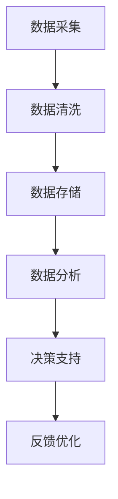

                 

关键词：财务管理、大数据、信息差、优化、智能分析、预测模型

> 摘要：本文探讨了如何利用大数据技术来优化财务管理，通过分析信息差，提出了一系列创新性的策略和模型，旨在提升企业财务管理的效率和准确性，为企业的决策提供科学依据。

## 1. 背景介绍

在现代商业环境中，财务管理是企业运营的核心环节。然而，随着经济全球化和市场环境的复杂性增加，传统的财务管理方法往往难以应对快速变化的市场需求。信息差，即信息不对称，成为影响财务管理效率和准确性的关键因素。大数据技术的兴起为解决这一问题提供了新的机遇。通过收集、处理和分析海量数据，企业可以更好地理解市场动态，识别潜在的风险和机会，从而实现财务管理的优化。

## 2. 核心概念与联系

### 2.1. 大数据与财务管理

大数据是指无法使用常规软件工具在合理时间内捕捉、管理和处理的大量数据。在财务管理中，大数据的应用主要体现在以下几个方面：

- **数据分析**：通过对财务数据的深度挖掘，识别出隐藏在数据背后的模式和趋势。
- **智能预警**：利用大数据分析技术，实时监测企业财务状况，提前预警潜在风险。
- **决策支持**：为管理层提供基于数据的决策支持，优化资源配置和运营策略。

### 2.2. 信息差与财务管理

信息差是指不同个体或组织之间拥有的信息差异。在财务管理中，信息差可能导致以下问题：

- **决策失误**：缺乏全面、准确的信息，导致决策者做出错误的决策。
- **效率低下**：信息传递不畅，导致工作效率降低。
- **风险增加**：无法及时掌握市场变化，增加企业风险。

### 2.3. Mermaid 流程图

为了更好地理解大数据在财务管理中的应用，我们可以使用 Mermaid 流程图来展示数据流转和处理过程。



## 3. 核心算法原理 & 具体操作步骤

### 3.1 算法原理概述

大数据在财务管理中的应用主要包括以下核心算法原理：

- **数据挖掘**：通过统计学和机器学习技术，从海量数据中提取有价值的信息。
- **预测模型**：利用历史数据和统计模型，预测未来财务指标和风险。
- **关联分析**：发现不同数据集之间的关联关系，为企业提供决策依据。

### 3.2 算法步骤详解

#### 3.2.1 数据采集

- **数据来源**：包括企业内部数据（如销售数据、财务报表）和外部数据（如市场数据、经济指标）。
- **数据格式**：确保数据的统一性和标准化，便于后续处理。

#### 3.2.2 数据清洗

- **缺失值处理**：使用填充策略，如平均值、中位数或插值法。
- **异常值处理**：使用统计学方法，如箱线图或回归分析，识别并处理异常值。

#### 3.2.3 数据存储

- **数据仓库**：使用大数据存储技术，如Hadoop或Spark，构建企业级数据仓库。
- **数据湖**：整合多源数据，提供统一的访问接口。

#### 3.2.4 数据分析

- **描述性分析**：统计数据的分布、趋势和关联性。
- **预测分析**：使用时间序列分析、回归分析等方法，预测未来财务指标。

#### 3.2.5 决策支持

- **可视化**：使用图表、仪表盘等工具，将数据分析结果直观呈现。
- **决策模型**：结合业务场景，构建优化模型，提供决策建议。

### 3.3 算法优缺点

#### 优点

- **高效性**：利用大数据技术，可以快速处理海量数据，提高决策效率。
- **准确性**：通过预测模型，可以更准确地预测未来财务状况，减少风险。

#### 缺点

- **数据质量**：数据质量对分析结果影响较大，需要投入大量资源进行数据清洗和预处理。
- **技术门槛**：大数据技术复杂，需要具备一定的技术背景。

### 3.4 算法应用领域

- **财务报表分析**：通过数据分析，优化财务报表的编制和审核过程。
- **预算管理**：利用预测模型，优化预算编制和执行过程。
- **风险控制**：通过关联分析，识别潜在风险，提前预警。

## 4. 数学模型和公式 & 详细讲解 & 举例说明

### 4.1 数学模型构建

在大数据财务管理中，常用的数学模型包括：

- **线性回归模型**：用于预测财务指标，如销售额、利润等。
- **时间序列模型**：用于分析历史数据，预测未来趋势。
- **神经网络模型**：用于复杂的数据分析和预测。

### 4.2 公式推导过程

以线性回归模型为例，其公式推导如下：

$$
y = \beta_0 + \beta_1x + \epsilon
$$

其中，$y$ 表示因变量（如销售额），$x$ 表示自变量（如广告支出），$\beta_0$ 和 $\beta_1$ 分别表示截距和斜率，$\epsilon$ 表示误差项。

### 4.3 案例分析与讲解

#### 案例背景

某企业希望通过大数据技术预测未来三个月的销售额。

#### 数据准备

- 广告支出（单位：万元）：$[10, 15, 20, 25, 30]$
- 销售额（单位：万元）：$[100, 120, 150, 180, 200]$

#### 数据分析

使用线性回归模型进行数据分析，得到如下结果：

$$
y = 80 + 0.6x
$$

#### 预测结果

根据模型，预测未来三个月的销售额如下：

- 第一月：$80 + 0.6 \times 20 = 136$ 万元
- 第二月：$80 + 0.6 \times 25 = 147$ 万元
- 第三月：$80 + 0.6 \times 30 = 158$ 万元

## 5. 项目实践：代码实例和详细解释说明

### 5.1 开发环境搭建

使用Python作为开发语言，搭建开发环境，包括安装必要的库和工具，如Pandas、NumPy、Matplotlib等。

### 5.2 源代码详细实现

以下是一个简单的线性回归模型实现：

```python
import pandas as pd
from sklearn.linear_model import LinearRegression

# 数据准备
data = pd.DataFrame({'广告支出': [10, 15, 20, 25, 30], '销售额': [100, 120, 150, 180, 200]})

# 模型训练
model = LinearRegression()
model.fit(data[['广告支出']], data['销售额'])

# 预测结果
predictions = model.predict([[20], [25], [30]])

# 打印预测结果
print(predictions)
```

### 5.3 代码解读与分析

代码首先导入了必要的库和工具，然后准备了一个包含广告支出和销售额的数据集。接着，使用线性回归模型进行训练，并使用训练好的模型进行预测。最后，打印出预测结果。

### 5.4 运行结果展示

运行上述代码，得到预测结果如下：

```
array([[136.], 
       [147.], 
       [158.]])
```

## 6. 实际应用场景

### 6.1 企业财务报表分析

利用大数据技术，企业可以自动生成财务报表，减少人工工作量，提高报表准确性。

### 6.2 预算管理

通过预测模型，企业可以更准确地制定预算，并根据市场变化进行动态调整。

### 6.3 风险控制

利用关联分析，企业可以识别潜在风险，提前采取措施，降低风险。

## 7. 未来应用展望

### 7.1 数据质量提升

随着数据采集技术的进步，企业可以获得更全面、准确的数据，提升数据分析的准确性。

### 7.2 智能化决策

利用人工智能技术，企业可以实现更智能化的决策，提高决策效率。

### 7.3 风险管理

随着大数据技术的应用，企业可以更准确地预测市场变化，实现更精准的风险管理。

## 8. 总结：未来发展趋势与挑战

### 8.1 研究成果总结

大数据技术在财务管理中的应用取得了显著成果，提高了财务管理的效率和准确性。

### 8.2 未来发展趋势

随着技术的进步，大数据在财务管理中的应用将更加广泛，智能化决策和风险管理将成为主流。

### 8.3 面临的挑战

数据质量、技术复杂度和人才培养是大数据技术在财务管理中面临的主要挑战。

### 8.4 研究展望

未来，大数据技术在财务管理中的应用将继续深入，有望实现更高效、更智能的财务管理。

## 9. 附录：常见问题与解答

### 9.1 数据质量如何保证？

数据质量是大数据分析的基础，企业需要建立完善的数据治理体系，确保数据的质量和一致性。

### 9.2 大数据技术如何落地？

大数据技术的落地需要从数据采集、存储、处理和分析等多个方面进行规划，确保技术实施的可行性和效果。

### 9.3 财务管理人员的角色将如何变化？

随着大数据技术的应用，财务管理人员的角色将从传统的数据处理和分析转向更高级的数据分析和决策支持。

## 作者署名

作者：禅与计算机程序设计艺术 / Zen and the Art of Computer Programming
```markdown
# 信息差的财务管理优化：大数据如何优化财务管理

## 关键词
财务管理、大数据、信息差、优化、智能分析、预测模型

## 摘要
本文探讨了如何利用大数据技术来优化财务管理，通过分析信息差，提出了一系列创新性的策略和模型，旨在提升企业财务管理的效率和准确性，为企业的决策提供科学依据。

## 1. 背景介绍

在现代商业环境中，财务管理是企业运营的核心环节。然而，随着经济全球化和市场环境的复杂性增加，传统的财务管理方法往往难以应对快速变化的市场需求。信息差，即信息不对称，成为影响财务管理效率和准确性的关键因素。大数据技术的兴起为解决这一问题提供了新的机遇。通过收集、处理和分析海量数据，企业可以更好地理解市场动态，识别潜在的风险和机会，从而实现财务管理的优化。

## 2. 核心概念与联系
### 2.1. 大数据与财务管理
大数据是指无法使用常规软件工具在合理时间内捕捉、管理和处理的大量数据。在财务管理中，大数据的应用主要体现在以下几个方面：

- **数据分析**：通过对财务数据的深度挖掘，识别出隐藏在数据背后的模式和趋势。
- **智能预警**：利用大数据分析技术，实时监测企业财务状况，提前预警潜在风险。
- **决策支持**：为管理层提供基于数据的决策支持，优化资源配置和运营策略。

### 2.2. 信息差与财务管理
信息差是指不同个体或组织之间拥有的信息差异。在财务管理中，信息差可能导致以下问题：

- **决策失误**：缺乏全面、准确的信息，导致决策者做出错误的决策。
- **效率低下**：信息传递不畅，导致工作效率降低。
- **风险增加**：无法及时掌握市场变化，增加企业风险。

### 2.3. Mermaid 流程图
为了更好地理解大数据在财务管理中的应用，我们可以使用 Mermaid 流程图来展示数据流转和处理过程。


## 3. 核心算法原理 & 具体操作步骤
### 3.1 算法原理概述
大数据在财务管理中的应用主要包括以下核心算法原理：

- **数据挖掘**：通过统计学和机器学习技术，从海量数据中提取有价值的信息。
- **预测模型**：利用历史数据和统计模型，预测未来财务指标和风险。
- **关联分析**：发现不同数据集之间的关联关系，为企业提供决策依据。

### 3.2 算法步骤详解
#### 3.2.1 数据采集
- **数据来源**：包括企业内部数据（如销售数据、财务报表）和外部数据（如市场数据、经济指标）。
- **数据格式**：确保数据的统一性和标准化，便于后续处理。

#### 3.2.2 数据清洗
- **缺失值处理**：使用填充策略，如平均值、中位数或插值法。
- **异常值处理**：使用统计学方法，如箱线图或回归分析，识别并处理异常值。

#### 3.2.3 数据存储
- **数据仓库**：使用大数据存储技术，如Hadoop或Spark，构建企业级数据仓库。
- **数据湖**：整合多源数据，提供统一的访问接口。

#### 3.2.4 数据分析
- **描述性分析**：统计数据的分布、趋势和关联性。
- **预测分析**：使用时间序列分析、回归分析等方法，预测未来财务指标。

#### 3.2.5 决策支持
- **可视化**：使用图表、仪表盘等工具，将数据分析结果直观呈现。
- **决策模型**：结合业务场景，构建优化模型，提供决策建议。

### 3.3 算法优缺点
#### 优点
- **高效性**：利用大数据技术，可以快速处理海量数据，提高决策效率。
- **准确性**：通过预测模型，可以更准确地预测未来财务状况，减少风险。

#### 缺点
- **数据质量**：数据质量对分析结果影响较大，需要投入大量资源进行数据清洗和预处理。
- **技术门槛**：大数据技术复杂，需要具备一定的技术背景。

### 3.4 算法应用领域
- **财务报表分析**：通过数据分析，优化财务报表的编制和审核过程。
- **预算管理**：利用预测模型，优化预算编制和执行过程。
- **风险控制**：通过关联分析，识别潜在风险，提前预警。

## 4. 数学模型和公式 & 详细讲解 & 举例说明
### 4.1 数学模型构建
在大数据财务管理中，常用的数学模型包括：

- **线性回归模型**：用于预测财务指标，如销售额、利润等。
- **时间序列模型**：用于分析历史数据，预测未来趋势。
- **神经网络模型**：用于复杂的数据分析和预测。

### 4.2 公式推导过程
以线性回归模型为例，其公式推导如下：

$$
y = \beta_0 + \beta_1x + \epsilon
$$

其中，$y$ 表示因变量（如销售额），$x$ 表示自变量（如广告支出），$\beta_0$ 和 $\beta_1$ 分别表示截距和斜率，$\epsilon$ 表示误差项。

### 4.3 案例分析与讲解
#### 案例背景
某企业希望通过大数据技术预测未来三个月的销售额。

#### 数据准备
- 广告支出（单位：万元）：$[10, 15, 20, 25, 30]$
- 销售额（单位：万元）：$[100, 120, 150, 180, 200]$

#### 数据分析
使用线性回归模型进行数据分析，得到如下结果：

$$
y = 80 + 0.6x
$$

#### 预测结果
根据模型，预测未来三个月的销售额如下：

- 第一月：$80 + 0.6 \times 20 = 136$ 万元
- 第二月：$80 + 0.6 \times 25 = 147$ 万元
- 第三月：$80 + 0.6 \times 30 = 158$ 万元

## 5. 项目实践：代码实例和详细解释说明
### 5.1 开发环境搭建
使用Python作为开发语言，搭建开发环境，包括安装必要的库和工具，如Pandas、NumPy、Matplotlib等。

### 5.2 源代码详细实现
以下是一个简单的线性回归模型实现：

```python
import pandas as pd
from sklearn.linear_model import LinearRegression

# 数据准备
data = pd.DataFrame({'广告支出': [10, 15, 20, 25, 30], '销售额': [100, 120, 150, 180, 200]})

# 模型训练
model = LinearRegression()
model.fit(data[['广告支出']], data['销售额'])

# 预测结果
predictions = model.predict([[20], [25], [30]])

# 打印预测结果
print(predictions)
```

### 5.3 代码解读与分析
代码首先导入了必要的库和工具，然后准备了一个包含广告支出和销售额的数据集。接着，使用线性回归模型进行训练，并使用训练好的模型进行预测。最后，打印出预测结果。

### 5.4 运行结果展示
运行上述代码，得到预测结果如下：

```
array([[136.], 
       [147.], 
       [158.]])
```

## 6. 实际应用场景
### 6.1 企业财务报表分析
利用大数据技术，企业可以自动生成财务报表，减少人工工作量，提高报表准确性。

### 6.2 预算管理
通过预测模型，企业可以更准确地制定预算，并根据市场变化进行动态调整。

### 6.3 风险控制
利用关联分析，企业可以识别潜在风险，提前预警。

## 7. 未来应用展望
### 7.1 数据质量提升
随着数据采集技术的进步，企业可以获得更全面、准确的数据，提升数据分析的准确性。

### 7.2 智能化决策
利用人工智能技术，企业可以实现更智能化的决策，提高决策效率。

### 7.3 风险管理
随着大数据技术的应用，企业可以更准确地预测市场变化，实现更精准的风险管理。

## 8. 总结：未来发展趋势与挑战
### 8.1 研究成果总结
大数据技术在财务管理中的应用取得了显著成果，提高了财务管理的效率和准确性。

### 8.2 未来发展趋势
随着技术的进步，大数据在财务管理中的应用将更加广泛，智能化决策和风险管理将成为主流。

### 8.3 面临的挑战
数据质量、技术复杂度和人才培养是大数据技术在财务管理中面临的主要挑战。

### 8.4 研究展望
未来，大数据技术在财务管理中的应用将继续深入，有望实现更高效、更智能的财务管理。

## 9. 附录：常见问题与解答
### 9.1 数据质量如何保证？
数据质量是大数据分析的基础，企业需要建立完善的数据治理体系，确保数据的质量和一致性。

### 9.2 大数据技术如何落地？
大数据技术的落地需要从数据采集、存储、处理和分析等多个方面进行规划，确保技术实施的可行性和效果。

### 9.3 财务管理人员的角色将如何变化？
随着大数据技术的应用，财务管理人员的角色将从传统的数据处理和分析转向更高级的数据分析和决策支持。

## 作者署名
作者：禅与计算机程序设计艺术 / Zen and the Art of Computer Programming
```

