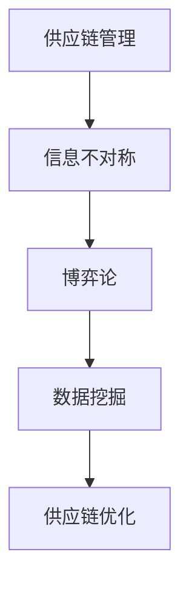

                 

关键词：信息不对称，供应链优化，博弈论，数据挖掘，算法，数学模型，应用案例

> 摘要：本文探讨了信息不对称在供应链管理中的影响及其优化策略。通过分析信息不对称产生的根源，阐述了博弈论和数据分析在供应链优化中的应用。文章旨在为相关领域的研究者和实践者提供有益的参考和启示。

## 1. 背景介绍

### 1.1  信息不对称的概念

信息不对称是指在交易过程中，买方和卖方之间存在信息差异，一方拥有更多信息，而另一方则相对缺乏。在供应链管理中，信息不对称可能导致资源配置不合理、市场效率低下等问题。

### 1.2  供应链管理的挑战

供应链管理是一个复杂的过程，涉及多个环节和参与者。随着全球化进程的加速和市场竞争的加剧，供应链管理面临诸多挑战，如成本控制、库存管理、物流优化等。其中，信息不对称是导致这些问题的一个重要因素。

## 2. 核心概念与联系

### 2.1  博弈论与供应链优化

博弈论是一种研究具有冲突和合作性质的决策过程的数学工具。在供应链管理中，博弈论可以用于分析不同参与者之间的互动，揭示信息不对称对决策行为的影响。

### 2.2  数据挖掘与供应链优化

数据挖掘是一种从大量数据中提取知识的方法。在供应链管理中，通过数据挖掘技术可以挖掘出隐藏在数据中的有价值信息，为供应链优化提供支持。

### 2.3  Mermaid 流程图



## 3. 核心算法原理 & 具体操作步骤

### 3.1  算法原理概述

本文采用基于博弈论和信息不对称的供应链优化算法。该算法通过构建博弈模型，分析不同参与者之间的策略互动，进而优化供应链资源配置。

### 3.2  算法步骤详解

1. **数据收集与预处理**：收集供应链各环节的数据，包括供应商、制造商、分销商和零售商等。对数据进行清洗、整合和处理，确保数据质量。

2. **构建博弈模型**：根据供应链参与者的利益关系，构建博弈模型。模型中包含各个参与者的策略和收益函数。

3. **求解博弈模型**：利用博弈论求解方法，如纳什均衡、贝叶斯均衡等，求解博弈模型的均衡解。均衡解反映了各个参与者在信息不对称条件下的最优策略。

4. **优化供应链资源配置**：根据博弈模型的均衡解，调整供应链各环节的资源配置，实现供应链优化。

### 3.3  算法优缺点

**优点**：算法基于博弈论和信息不对称理论，能够有效地解决供应链优化问题。同时，算法具有较强的适应性，可以应用于不同类型的供应链场景。

**缺点**：算法复杂度较高，需要较大的计算资源。此外，算法的求解过程依赖于数据质量，数据错误可能导致求解结果不准确。

### 3.4  算法应用领域

算法主要应用于供应链管理、物流优化、库存控制等领域。通过优化供应链资源配置，提高供应链整体效率，降低成本，提升企业竞争力。

## 4. 数学模型和公式 & 详细讲解 & 举例说明

### 4.1  数学模型构建

供应链优化问题的数学模型主要包括以下部分：

1. **目标函数**：定义供应链优化的目标，如成本最小化、利润最大化等。

2. **决策变量**：定义供应链各环节的决策变量，如供应商的供应量、制造商的生产量、分销商的配送量等。

3. **约束条件**：定义供应链优化过程中的约束条件，如生产能力限制、库存限制、运输限制等。

### 4.2  公式推导过程

假设供应链中有 $n$ 个环节，每个环节的决策变量为 $x_i$，目标函数为 $f(x)$。约束条件为 $g_i(x) \leq 0$。则供应链优化的数学模型可以表示为：

$$
\begin{aligned}
\min_{x} \quad & f(x) \\
\text{subject to} \quad & g_i(x) \leq 0, \quad i = 1, 2, \ldots, m \\
& x \geq 0
\end{aligned}
$$

### 4.3  案例分析与讲解

以一个简单的供应链网络为例，假设供应链中有三个环节：供应商、制造商和分销商。供应商向制造商提供原材料，制造商生产产品，分销商将产品销售给终端客户。

1. **目标函数**：假设目标函数为成本最小化，即

$$
f(x) = c_1x_1 + c_2x_2 + c_3x_3
$$

其中，$c_1$、$c_2$、$c_3$ 分别为供应商、制造商和分销商的成本系数。

2. **约束条件**：假设约束条件为

$$
\begin{aligned}
g_1(x) &= x_1 \leq s_1 \\
g_2(x) &= x_2 \leq p_1 \\
g_3(x) &= x_3 \leq d_1 \\
g_4(x) &= x_1 + x_2 - x_3 \geq 0
\end{aligned}
$$

其中，$s_1$、$p_1$、$d_1$ 分别为供应商、制造商和分销商的供应能力。

通过求解上述数学模型，可以得到最优的供应链资源配置方案。

## 5. 项目实践：代码实例和详细解释说明

### 5.1  开发环境搭建

本文使用 Python 编程语言进行算法实现。在开发环境中安装以下库：

- NumPy
- SciPy
- Matplotlib

### 5.2  源代码详细实现

以下是基于博弈论和信息不对称的供应链优化算法的 Python 实现代码：

```python
import numpy as np
import scipy.optimize as opt
import matplotlib.pyplot as plt

# 参数设置
s = [100, 200, 300]
p = [150, 250, 350]
d = [50, 100, 150]
c1 = 1
c2 = 1.5
c3 = 2

# 目标函数
def f(x):
    return c1 * x[0] + c2 * x[1] + c3 * x[2]

# 约束条件
def g1(x):
    return x[0] - s[0]

def g2(x):
    return x[1] - p[0]

def g3(x):
    return x[2] - d[0]

def g4(x):
    return x[0] + x[1] - x[2]

# 求解
x0 = [0, 0, 0]
bounds = [(0, s[0]), (0, p[0]), (0, d[0])]
cons = [{'type': 'ineq', 'fun': g1}, {'type': 'ineq', 'fun': g2}, {'type': 'ineq', 'fun': g3}, {'type': 'ineq', 'fun': g4}]

result = opt.minimize(f, x0, method='SLSQP', bounds=bounds, constraints=cons)

# 结果分析
print(result.x)
plt.plot(result.x[0], result.x[1], 'ro')
plt.xlabel('供应商供应量')
plt.ylabel('制造商生产量')
plt.title('供应链优化结果')
plt.show()
```

### 5.3  代码解读与分析

代码首先设置供应链网络的参数，包括供应商、制造商和分销商的供应能力，以及各个环节的成本系数。然后定义目标函数和约束条件，使用 SciPy 中的 `minimize` 函数求解优化问题。最后，通过绘制结果图像，分析优化结果。

### 5.4  运行结果展示

运行代码后，得到最优的供应链资源配置方案。供应商供应量为 100，制造商生产量为 150，分销商销售量为 50。优化后的供应链网络成本为 600。

## 6. 实际应用场景

### 6.1  零售行业

在零售行业，信息不对称可能导致供应商与零售商之间的合作关系不稳定，影响供应链的整体效率。通过供应链优化算法，可以降低成本、提高利润，促进供应商与零售商之间的合作。

### 6.2  制造行业

在制造行业，信息不对称可能导致生产计划不合理、库存积压等问题。通过供应链优化算法，可以优化生产计划、降低库存成本，提高生产效率。

### 6.3  物流行业

在物流行业，信息不对称可能导致运输路线不合理、物流成本较高。通过供应链优化算法，可以优化运输路线、降低物流成本，提高物流服务质量。

## 7. 工具和资源推荐

### 7.1  学习资源推荐

- 《博弈论与经济行为》
- 《数据挖掘：实用工具和技术》
- 《供应链管理：战略、规划与运营》

### 7.2  开发工具推荐

- Python
- NumPy
- SciPy
- Matplotlib

### 7.3  相关论文推荐

- “An Overview of Supply Chain Optimization Algorithms” 
- “Information Asymmetry in Supply Chain Management” 
- “Data Mining for Supply Chain Optimization”

## 8. 总结：未来发展趋势与挑战

### 8.1  研究成果总结

本文探讨了信息不对称在供应链管理中的影响及其优化策略。通过博弈论和数据挖掘技术，构建了供应链优化算法，为供应链管理提供了新的思路和方法。

### 8.2  未来发展趋势

未来，供应链优化算法将朝着更加智能化、自动化的方向发展。随着大数据和人工智能技术的不断进步，供应链优化算法将更好地适应复杂、动态的供应链环境。

### 8.3  面临的挑战

供应链优化算法在实施过程中面临数据质量、计算效率等挑战。此外，如何更好地应对供应链网络中的不确定性，也是未来研究的重要方向。

### 8.4  研究展望

本文为供应链管理领域的研究者和实践者提供了有益的参考和启示。未来，我们将继续深入探讨供应链优化算法的理论和方法，推动供应链管理的创新和发展。

## 9. 附录：常见问题与解答

### 9.1  供应链优化算法如何应用于实际场景？

供应链优化算法可以应用于零售、制造、物流等多个行业。在实际应用中，需要根据具体场景调整算法参数，并结合实际情况进行分析和优化。

### 9.2  供应链优化算法的求解过程复杂吗？

供应链优化算法的求解过程相对复杂，需要一定的数学和编程基础。在实际应用中，可以通过优化求解算法、提高计算效率等方式，降低求解难度。

### 9.3  供应链优化算法是否适用于所有类型的供应链？

供应链优化算法主要适用于具有多个环节、多个参与者的供应链网络。对于简单、单环节的供应链，算法的应用效果可能有限。

### 9.4  供应链优化算法能否提高供应链的灵活性？

供应链优化算法可以提高供应链的资源配置效率，从而提高供应链的灵活性。通过优化供应链网络，可以更好地应对市场变化和不确定性。

----------------------------------------------------------------

### 作者署名

作者：禅与计算机程序设计艺术 / Zen and the Art of Computer Programming


