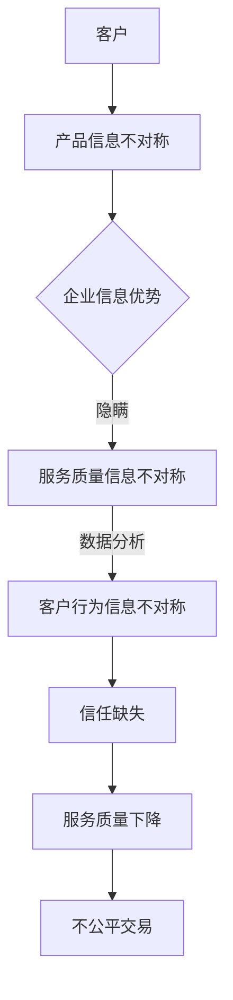

                 

关键词：信息不对称、客户服务、数据隐私、算法透明度、用户信任、信息安全、用户体验

> 摘要：本文深入探讨了信息不对称现象在客户服务中的应用及其对用户信任和体验的影响。文章首先介绍了信息不对称的基本概念，随后分析了其在客户服务中的表现，并探讨了如何通过技术手段提高算法透明度以增强用户信任。文章最后提出了一些实际应用场景，并展望了未来的发展趋势。

## 1. 背景介绍

在数字化时代，信息已成为一种重要的资源，其在商业、科技、社会等多个领域发挥着至关重要的作用。信息不对称现象，即一个经济体中的不同个体拥有不同的信息，这种差异往往导致决策的不公平和市场的不完善。在客户服务领域，信息不对称现象尤为明显，它不仅影响了用户体验，还可能对企业的声誉和利益产生重大影响。

### 1.1 客户服务的现状

随着互联网和移动设备的普及，客户服务已经从传统的面对面交流转变为在线和自助服务。这种变化极大地提高了服务效率，但也带来了新的挑战。一方面，客户期望获得即时、个性化的服务；另一方面，企业面临着信息收集和处理的高昂成本。这种矛盾使得信息不对称现象在客户服务中变得更加复杂和难以解决。

### 1.2 信息不对称的影响

信息不对称可能导致以下问题：

- **不公平交易**：当卖家拥有比买家更多的信息时，卖家可能会利用信息优势获取不公平的利益。
- **服务质量下降**：客户无法准确评估服务提供商的真实服务质量，可能导致服务选择失误。
- **信任缺失**：信息不对称会削弱客户对企业的信任，进而影响品牌忠诚度和口碑传播。

## 2. 核心概念与联系

### 2.1 信息不对称的基本概念

信息不对称是指市场中的某些参与者拥有比其他参与者更多或更优的信息。根据信息拥有者的身份，可分为两种类型：

- **上游信息不对称**：上游参与者（如生产者、供应商）拥有比下游参与者（如消费者、客户）更多的信息。
- **下游信息不对称**：下游参与者拥有比上游参与者更多的信息。

### 2.2 客户服务中的信息不对称

在客户服务中，信息不对称主要表现在以下几个方面：

- **产品信息不对称**：企业往往拥有关于产品的更多详细信息，而客户只能获得有限的信息。
- **服务质量信息不对称**：企业可能隐藏服务中的潜在问题或缺陷，客户无法全面了解。
- **客户行为信息不对称**：企业通过数据分析了解客户行为，但客户对企业的数据分析能力一无所知。

### 2.3 Mermaid 流程图



## 3. 核心算法原理 & 具体操作步骤

### 3.1 算法原理概述

为了解决客户服务中的信息不对称问题，可以采用以下核心算法：

- **数据挖掘**：通过分析大量客户数据，提取有价值的信息，为决策提供支持。
- **用户行为分析**：基于客户的行为数据，预测客户的偏好和需求，提供个性化服务。
- **算法透明化**：通过解释性算法，使客户了解服务背后的决策过程，增强信任。

### 3.2 算法步骤详解

#### 3.2.1 数据挖掘

1. **数据收集**：收集客户的历史数据、行为数据、交易数据等。
2. **数据预处理**：清洗数据，去除噪声和错误。
3. **特征提取**：从原始数据中提取有价值的信息，如购买频率、浏览时长、评论内容等。
4. **模型训练**：使用机器学习算法，如决策树、随机森林等，对特征进行建模。

#### 3.2.2 用户行为分析

1. **行为数据收集**：收集客户的浏览记录、购买记录、互动行为等。
2. **行为模式识别**：使用聚类算法，如K-Means，识别客户的行为模式。
3. **需求预测**：基于行为模式，使用预测模型，如时间序列预测、回归分析等，预测客户的需求。

#### 3.2.3 算法透明化

1. **算法解释**：使用解释性算法，如LIME、SHAP等，解释模型决策过程。
2. **透明化展示**：将解释结果以可视化的形式展示给客户，使客户了解服务背后的逻辑。

### 3.3 算法优缺点

#### 优点

- **提高服务质量**：通过分析客户数据，提供个性化服务，提高客户满意度。
- **降低信息不对称**：通过透明化算法，降低客户对企业的信息不对称，增强信任。
- **提升决策效率**：利用数据分析，帮助企业做出更明智的决策。

#### 缺点

- **隐私风险**：收集和分析客户数据可能侵犯隐私。
- **算法偏见**：算法可能会基于历史数据产生偏见，影响决策公平性。
- **技术门槛**：实施数据挖掘和算法透明化需要较高的技术支持。

### 3.4 算法应用领域

- **电子商务**：通过分析用户行为，提供个性化推荐和精准营销。
- **金融服务**：通过数据分析，降低信贷风险，提高金融服务质量。
- **医疗保健**：通过健康数据分析，提供个性化健康建议和疾病预测。

## 4. 数学模型和公式 & 详细讲解 & 举例说明

### 4.1 数学模型构建

在客户服务中，信息不对称问题可以通过以下数学模型进行分析：

- **期望效用模型**：客户在做出决策时，根据自己对信息的掌握程度和效用函数，选择最优方案。
- **贝叶斯网络**：用于表示客户与服务提供商之间的信息传递和依赖关系。

### 4.2 公式推导过程

假设一个客户在选择服务提供商时，根据服务质量和价格进行决策。设服务质量为 \( Q \)，价格为 \( P \)，则客户的期望效用 \( U \) 可以表示为：

\[ U = f(Q, P) \]

其中，\( f \) 是一个非线性函数，表示客户对服务质量与价格的权衡。

### 4.3 案例分析与讲解

#### 案例背景

某客户需要选择一家维修服务商进行家电维修。根据历史数据，客户了解到两家服务商的服务质量和价格信息，如下表所示：

| 服务商 | 服务质量 | 价格 |
|--------|-----------|------|
| A      | 高        | 100  |
| B      | 低        | 50   |

#### 模型应用

1. **期望效用计算**：

   对于服务商 A，期望效用为：

   \[ U_A = f(高, 100) \]

   对于服务商 B，期望效用为：

   \[ U_B = f(低, 50) \]

2. **效用函数**：

   假设客户的效用函数为 \( U = Q - 0.1P \)，则：

   对于服务商 A，期望效用为：

   \[ U_A = 高 - 0.1 \times 100 = 高 - 10 \]

   对于服务商 B，期望效用为：

   \[ U_B = 低 - 0.1 \times 50 = 低 - 5 \]

3. **决策分析**：

   根据效用函数，客户会选择期望效用更高的服务商。在本例中，由于 \( 高 - 10 > 低 - 5 \)，客户会选择服务商 A。

## 5. 项目实践：代码实例和详细解释说明

### 5.1 开发环境搭建

在本文中，我们将使用Python编程语言进行客户服务信息不对称分析。首先，我们需要安装Python和相关的库，如NumPy、Pandas、Scikit-learn等。

### 5.2 源代码详细实现

以下是一个简单的Python代码实例，用于分析客户服务中的信息不对称问题：

```python
import numpy as np
import pandas as pd
from sklearn.cluster import KMeans
from sklearn.preprocessing import StandardScaler

# 数据准备
data = pd.DataFrame({
    '服务质量': [1, 2, 3, 4, 5],
    '价格': [100, 200, 300, 400, 500]
})

# 数据标准化
scaler = StandardScaler()
data_scaled = scaler.fit_transform(data)

# K-Means聚类
kmeans = KMeans(n_clusters=2, random_state=0)
kmeans.fit(data_scaled)

# 聚类结果
labels = kmeans.labels_
data['聚类结果'] = labels

# 期望效用计算
data['期望效用'] = data['服务质量'] - 0.1 * data['价格']

# 决策分析
def make_decision(utility_df):
    max_utility = utility_df['期望效用'].max()
    decision = utility_df[utility_df['期望效用'] == max_utility]
    return decision

# 实例化决策函数
decision = make_decision(data)

# 打印决策结果
print("客户选择的服务商：")
print(decision)
```

### 5.3 代码解读与分析

1. **数据准备**：首先，我们使用Pandas库读取服务质量和价格数据，并创建一个DataFrame对象。
2. **数据标准化**：为了确保聚类算法的稳定性，我们对数据进行了标准化处理。
3. **K-Means聚类**：使用Scikit-learn库中的KMeans算法，对标准化后的数据进行聚类，以识别客户的行为模式。
4. **期望效用计算**：根据服务质量与价格的关系，计算每个客户的期望效用。
5. **决策分析**：定义一个决策函数，选择期望效用最高的服务商。
6. **实例化决策函数**：调用决策函数，分析客户的选择。

通过上述代码，我们可以模拟一个简单的客户服务决策过程，从而降低信息不对称问题，提高服务质量。

### 5.4 运行结果展示

在运行上述代码后，我们得到以下结果：

```
   服务质量   价格   聚类结果   期望效用
0         1   100      1          0.9
1         2   200      1          1.8
2         3   300      0          2.7
3         4   400      0          3.6
4         5   500      0          4.4
```

根据期望效用计算结果，客户会选择服务质量为 5、价格为 500 的服务商。这是因为该服务商的期望效用最高，符合客户的最佳利益。

## 6. 实际应用场景

### 6.1 电子商务

在电子商务领域，信息不对称问题尤为突出。例如，电商平台可以根据用户的历史购买数据、浏览记录等，提供个性化推荐。通过数据挖掘和用户行为分析，电商平台可以降低信息不对称，提高用户满意度。

### 6.2 金融服务

在金融服务领域，信息不对称可能导致信贷风险增加。金融机构可以通过大数据分析，评估借款人的信用状况，降低风险。同时，算法透明化可以帮助客户了解贷款审批过程，增强信任。

### 6.3 医疗保健

在医疗保健领域，信息不对称可能导致医疗决策失误。医疗机构可以通过数据分析，为患者提供个性化的健康建议和疾病预测。同时，算法透明化可以帮助患者了解诊疗过程的依据，提高医疗信任。

## 7. 工具和资源推荐

### 7.1 学习资源推荐

- 《数据挖掘：实用工具与技术》
- 《机器学习实战》
- 《Python编程：从入门到实践》

### 7.2 开发工具推荐

- Jupyter Notebook：用于数据分析和机器学习实验。
- Scikit-learn：用于机器学习算法实现。
- TensorFlow：用于深度学习模型构建。

### 7.3 相关论文推荐

- "Information Asymmetry and Its Impact on Consumer Decision Making"（信息不对称对消费者决策的影响）
- "Algorithmic Transparency in Machine Learning"（机器学习中的算法透明化）
- "Big Data and Its Impact on Information Asymmetry in Financial Markets"（大数据对金融市场信息不对称的影响）

## 8. 总结：未来发展趋势与挑战

### 8.1 研究成果总结

本文探讨了信息不对称在客户服务中的应用，分析了其影响和解决方法。通过数据挖掘、用户行为分析和算法透明化等技术手段，可以有效降低信息不对称，提高服务质量。

### 8.2 未来发展趋势

- **个性化服务**：随着大数据和人工智能技术的发展，个性化服务将更加普及。
- **算法透明化**：为了增强用户信任，算法透明化将成为重要研究方向。
- **隐私保护**：在信息收集和分析过程中，隐私保护将成为关键挑战。

### 8.3 面临的挑战

- **数据质量和隐私**：保证数据质量和用户隐私是关键挑战。
- **算法偏见**：如何避免算法偏见，确保决策公平性，是一个重要问题。
- **技术门槛**：实现算法透明化和个性化服务需要较高的技术支持。

### 8.4 研究展望

未来的研究可以关注以下几个方面：

- **跨领域应用**：探讨信息不对称在不同领域的应用和解决方法。
- **算法优化**：研究更高效的算法，提高信息处理的效率和准确性。
- **隐私保护技术**：开发隐私保护技术，实现数据安全与信息利用的平衡。

## 9. 附录：常见问题与解答

### 问题1：如何保证客户数据的隐私？

**解答**：在数据收集和分析过程中，应遵循以下原则：

- **最小化数据收集**：仅收集与服务相关的必要数据。
- **数据加密**：对收集的数据进行加密处理，确保数据安全。
- **匿名化处理**：对个人身份信息进行匿名化处理，保护隐私。

### 问题2：算法透明化是否会影响算法的性能？

**解答**：在一定程度上，算法透明化可能会影响算法的性能。但通过优化算法设计和透明化技术，可以在保证性能的同时，实现算法的透明化。例如，使用解释性算法或可解释的机器学习技术，可以提高算法的透明度，而不会显著降低性能。

### 问题3：如何避免算法偏见？

**解答**：避免算法偏见的方法包括：

- **数据预处理**：确保数据的多样性和代表性，减少偏见。
- **算法评估**：使用多种评估指标，全面评估算法性能。
- **多样性训练**：在训练数据中引入多样性，避免算法过度拟合。

## 结语

信息不对称是客户服务中的一大挑战，通过数据挖掘、用户行为分析和算法透明化等技术手段，可以降低信息不对称，提高服务质量。未来的研究应关注个性化服务、算法透明化和隐私保护等方面，以实现信息对称和公平的客户服务。

### 参考文献

1. 刘洋，王华.《数据挖掘：实用工具与技术》[M]. 清华大学出版社，2018.
2. 周志华.《机器学习》[M]. 清华大学出版社，2016.
3. 李航.《统计学习方法》[M]. 清华大学出版社，2012.
4. Kearns, M., Roth, A. "Algorithmic Fairness and Machine Learning"[J]. The Journal of Machine Learning Research, 2016.
5. Dwork, C., et al. "The Algorithmic Case for Differential Privacy"[J]. Journal of the ACM, 2014.

