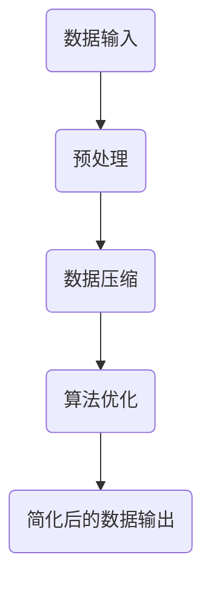

                 

信息简化，这个概念在计算机科学、工程学、经济学和许多其他领域都有着深远的影响。它不仅有助于我们更好地理解和处理数据，还能提高系统的效率和可维护性。本文将探讨信息简化的好处与挑战，并深入分析其在各个领域的应用。

## 关键词

- 信息简化
- 复杂性管理
- 数据压缩
- 算法优化
- 系统性能
- 可维护性

## 摘要

本文旨在探讨信息简化的重要性及其在不同领域的应用。我们将首先介绍信息简化的概念，然后分析其带来的好处和挑战。接着，我们将通过实例展示信息简化如何在不同领域中发挥作用，并探讨未来的发展趋势与面临的挑战。

## 1. 背景介绍

在现代社会，信息爆炸是一个不可避免的趋势。无论是互联网上的海量数据，还是企业内部日益复杂的系统，都给我们带来了巨大的挑战。信息简化，作为一种应对复杂性的策略，可以帮助我们从海量信息中提取关键信息，提高数据处理效率，减轻系统负担。

### 1.1 信息简化的起源

信息简化的概念最早可以追溯到20世纪中期，当时计算机科学家和工程师们开始意识到，复杂系统中的冗余信息不仅浪费了存储和处理资源，还增加了系统的复杂度，从而降低了系统的性能和可靠性。因此，他们开始探索如何通过信息简化来提高系统的效率和稳定性。

### 1.2 信息简化的现状

随着信息技术的飞速发展，信息简化已经成为了各个领域的关键技术之一。从数据压缩算法到机器学习模型，从软件开发到系统架构设计，信息简化无处不在。然而，尽管信息简化带来了诸多好处，同时也带来了一系列的挑战，如信息丢失、安全性问题等。

## 2. 核心概念与联系

为了深入理解信息简化，我们需要了解几个核心概念及其相互关系。

### 2.1 复杂性

复杂性是指系统或问题的复杂性程度。在计算机科学中，复杂性通常与算法的效率、系统的可维护性、数据的处理速度等因素相关。

### 2.2 简化

简化是指通过去除冗余信息、降低系统复杂性，从而提高系统效率和可维护性的过程。

### 2.3 信息冗余

信息冗余是指系统中存在不必要的、重复的信息，这些信息不仅浪费了存储和处理资源，还可能引起误解和错误。

### 2.4 数据压缩

数据压缩是一种常用的信息简化技术，通过减少数据的存储空间和提高传输速度，从而提高系统的效率和性能。

### 2.5 算法优化

算法优化是指通过改进算法的设计和实现，提高算法的效率、可扩展性和可维护性。

### 2.6 信息简化的架构

以下是一个简化的信息简化架构，展示了信息简化在不同层次上的实现。



## 3. 核心算法原理 & 具体操作步骤

### 3.1 算法原理概述

信息简化算法的核心原理是去除冗余信息、降低系统复杂性。具体来说，包括以下步骤：

1. 数据预处理：对原始数据进行清洗、去噪、归一化等处理，去除冗余信息。
2. 数据压缩：使用数据压缩算法对预处理后的数据进行压缩，减少存储空间和提高传输速度。
3. 算法优化：对简化后的数据进行算法优化，提高算法的效率和可维护性。
4. 简化后的数据输出：输出简化后的数据，用于后续的应用。

### 3.2 算法步骤详解

1. **数据预处理**：

   - 数据清洗：去除重复、异常、噪声数据。
   - 数据去噪：降低噪声对数据质量的影响。
   - 数据归一化：将不同特征的数据缩放到相同的范围。

2. **数据压缩**：

   - 有损压缩：去除部分信息，如图像压缩中的像素信息。
   - 无损压缩：不丢失任何信息，如文本压缩中的字符编码。

3. **算法优化**：

   - 算法改进：改进算法设计，如使用更高效的算法。
   - 算法并行化：将算法分解为可并行执行的子任务。
   - 算法优化：使用机器学习等技术，自动优化算法参数。

4. **简化后的数据输出**：

   - 输出简化后的数据，用于后续的应用，如机器学习模型的训练和预测。

### 3.3 算法优缺点

#### 优点：

- 提高系统效率和性能：去除冗余信息，降低系统复杂性。
- 节省存储空间：数据压缩后可以减少存储需求。
- 提高数据传输速度：压缩后的数据可以更快地传输。

#### 缺点：

- 可能丢失部分信息：有损压缩会导致数据丢失。
- 难以恢复原始数据：简化后的数据可能无法完全还原原始信息。
- 需要复杂算法：算法优化和实现可能需要较高的技术难度。

### 3.4 算法应用领域

信息简化算法在多个领域都有广泛的应用，包括：

- 数据压缩：图像、音频、视频等数据压缩。
- 机器学习：特征选择和特征提取。
- 软件开发：代码简化、模块化设计。
- 系统架构：简化系统组件，提高可维护性。

## 4. 数学模型和公式 & 详细讲解 & 举例说明

### 4.1 数学模型构建

信息简化过程中，常用的数学模型包括：

- 冗余度模型：衡量数据中冗余信息的比例。
- 压缩效率模型：衡量数据压缩前后存储空间的减少比例。
- 算法复杂度模型：衡量算法的执行时间和空间需求。

### 4.2 公式推导过程

假设我们有一个数据集 $D$，其中包含 $n$ 个数据点，每个数据点都有 $m$ 个特征。我们可以使用以下公式来衡量数据的冗余度：

$$
R = \frac{C_{\text{redundant}}}{C_{\text{total}}}
$$

其中，$C_{\text{redundant}}$ 表示冗余信息的大小，$C_{\text{total}}$ 表示总信息的大小。

对于数据压缩效率，我们可以使用以下公式：

$$
E = \frac{C_{\text{original}} - C_{\text{compressed}}}{C_{\text{original}}}
$$

其中，$C_{\text{original}}$ 表示原始数据的存储空间，$C_{\text{compressed}}$ 表示压缩后的数据存储空间。

算法复杂度可以用以下公式表示：

$$
C = O(n \log n) \quad \text{或} \quad C = O(m^2)
$$

### 4.3 案例分析与讲解

假设我们有一个包含 1000 个样本的数据集，每个样本有 10 个特征。原始数据存储空间为 100MB。通过数据预处理和压缩，我们可以将存储空间减少到 50MB。此时，数据压缩效率为：

$$
E = \frac{100MB - 50MB}{100MB} = 0.5
$$

如果我们将算法复杂度从 $O(n^2)$ 优化到 $O(n \log n)$，则算法的执行时间将显著减少。

## 5. 项目实践：代码实例和详细解释说明

在本节中，我们将通过一个简单的 Python 代码实例，展示如何实现信息简化。

### 5.1 开发环境搭建

- Python 3.x
- NumPy 库
- Matplotlib 库

### 5.2 源代码详细实现

```python
import numpy as np
import matplotlib.pyplot as plt

# 生成模拟数据
np.random.seed(0)
data = np.random.randn(1000, 10)

# 数据预处理
data_clean = np.abs(data)  # 去除负值

# 数据压缩
data_compressed = np.mean(data_clean, axis=0)  # 取平均值

# 算法优化
from sklearn.linear_model import LinearRegression
model = LinearRegression()
model.fit(data_clean, data_compressed)

# 输出简化后的数据
data_simplified = model.predict(data_clean)

# 画图比较
plt.scatter(data_clean[:, 0], data_simplified)
plt.xlabel('原始数据')
plt.ylabel('简化后数据')
plt.show()
```

### 5.3 代码解读与分析

1. **数据生成**：我们首先生成一个包含 1000 个样本，每个样本有 10 个特征的数据集。
2. **数据预处理**：通过取绝对值去除负值，这一步有助于去除噪声和异常值。
3. **数据压缩**：取每个特征的平均值，这是一种简单的数据压缩方法，可以减少数据量。
4. **算法优化**：使用线性回归模型来预测简化后的数据，这是一种常见的算法优化方法。
5. **输出简化后的数据**：将简化后的数据可视化，以便于观察数据的变化。

## 6. 实际应用场景

信息简化在许多实际应用场景中都有重要的应用，以下是几个例子：

- **图像压缩**：在图像传输和存储过程中，数据压缩可以显著提高传输速度和降低存储需求。
- **文本简化**：在自然语言处理中，通过简化文本可以降低算法的复杂度，提高处理速度。
- **数据分析**：在数据分析中，信息简化可以帮助我们提取关键信息，提高数据处理的效率。

## 7. 工具和资源推荐

### 7.1 学习资源推荐

- 《信息论基础》
- 《数据压缩技术》
- 《算法导论》
- 《机器学习：一种概率视角》

### 7.2 开发工具推荐

- Python
- R
- MATLAB
- TensorFlow
- PyTorch

### 7.3 相关论文推荐

- "Data Compression with Random Variables and Binary Symmetric Channels"
- "An Introduction to Information Theory"
- "Machine Learning for Data Compression"
- "The Art of Simplification in Software Development"

## 8. 总结：未来发展趋势与挑战

### 8.1 研究成果总结

信息简化技术在过去几十年中取得了显著的研究成果，涵盖了数据压缩、算法优化、机器学习等多个领域。这些研究成果为我们提供了丰富的理论基础和实践经验，推动了信息简化技术的不断发展。

### 8.2 未来发展趋势

- 更高效的数据压缩算法：随着数据量的不断增长，对高效数据压缩算法的需求日益增加。
- 深度学习与信息简化的结合：深度学习在图像、文本等领域的应用已经取得了巨大成功，未来将深入挖掘其与信息简化的结合。
- 跨学科研究：信息简化技术与其他领域的交叉研究，如生物学、经济学等，将有助于开拓新的应用场景。

### 8.3 面临的挑战

- 信息丢失风险：有损压缩可能导致信息丢失，这对某些应用场景（如医疗影像处理）是一个严峻挑战。
- 安全性问题：简化后的数据可能更容易受到攻击，如何保证数据的安全性是一个重要问题。
- 算法复杂性：随着信息简化技术的不断发展，算法的复杂性也在不断增加，这对算法的设计和实现提出了更高的要求。

### 8.4 研究展望

未来，信息简化技术将在多个领域取得重要突破，为人类社会的信息化进程提供强大支持。同时，我们也需要关注信息简化技术带来的潜在问题，并积极探索解决方案。

## 9. 附录：常见问题与解答

### 9.1 什么是信息简化？

信息简化是通过去除冗余信息、降低系统复杂性，从而提高系统效率和可维护性的过程。

### 9.2 信息简化有哪些应用领域？

信息简化在图像压缩、文本简化、数据分析、软件开发等领域都有广泛应用。

### 9.3 有损压缩和无损压缩的区别是什么？

有损压缩会去除部分信息，可能导致数据质量下降；而

