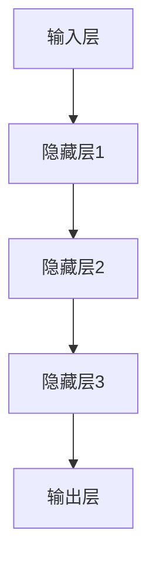

                 

关键字：基础大模型、利弊分析、人工智能、技术发展、研究展望

摘要：本文从多个角度对构建基础大模型进行利弊分析，探讨了其在人工智能领域的意义和挑战。通过对基础大模型的技术原理、应用场景、未来发展等方面的深入探讨，旨在为学术界和工业界提供有价值的参考。

## 1. 背景介绍

在过去的几年中，人工智能（AI）领域取得了巨大的进展。其中，基础大模型作为研究热点，受到了广泛关注。基础大模型通常是指具有数十亿甚至千亿参数规模的人工神经网络，其通过学习海量数据来提取复杂的特征和模式。随着计算能力和数据资源的不断提升，基础大模型在语音识别、图像识别、自然语言处理等任务上取得了显著的性能提升。

然而，基础大模型的构建和部署也面临诸多挑战。一方面，其计算和存储需求巨大，对硬件设施提出了更高的要求。另一方面，基础大模型的设计和训练过程涉及众多技术难题，如模型选择、参数优化、数据预处理等。此外，基础大模型在实际应用中可能存在一些潜在的风险，如数据隐私泄露、模型解释性不足等。

本文旨在对基础大模型进行全面的利弊分析，探讨其在人工智能领域的意义和挑战。首先，我们将介绍基础大模型的核心概念和技术原理。然后，分析其应用场景和优势，同时讨论其潜在风险和挑战。最后，提出一些建议，以促进基础大模型的研究和发展。

## 2. 核心概念与联系

### 2.1 定义

基础大模型（Fundamental Large Model）是一种具有大规模参数的人工神经网络，其通过学习海量数据来提取复杂的特征和模式。基础大模型通常具有数十亿甚至千亿参数规模，这使得其具有强大的表征能力和泛化能力。

### 2.2 工作原理

基础大模型的工作原理主要基于深度学习和神经网络。深度学习通过层次化的神经网络结构，逐步提取数据中的抽象特征。基础大模型通过大规模参数来捕捉数据中的复杂模式和规律。其核心思想是通过学习海量数据，使得模型能够自动适应各种复杂任务。

### 2.3 架构

基础大模型的架构通常包括以下几个层次：

1. **输入层**：接收原始数据，如图像、文本或语音。
2. **隐藏层**：通过非线性变换，提取数据中的低层次特征。
3. **输出层**：对提取的特征进行分类、回归或其他类型的预测。

### 2.4 Mermaid 流程图

下面是一个简单的 Mermaid 流程图，展示基础大模型的主要工作流程：



## 3. 核心算法原理 & 具体操作步骤

### 3.1 算法原理概述

基础大模型的算法原理主要基于深度学习和神经网络。其核心思想是通过反向传播算法，不断调整网络中的参数，使得模型能够适应各种复杂任务。具体来说，基础大模型的工作流程包括以下几个步骤：

1. **数据预处理**：对输入数据进行归一化、标准化等处理，以便模型能够更好地学习。
2. **前向传播**：将输入数据传递到神经网络中，通过非线性变换提取特征。
3. **损失函数计算**：计算模型的预测结果与真实标签之间的差距，即损失函数。
4. **反向传播**：根据损失函数，反向传播误差，更新网络中的参数。
5. **迭代优化**：重复上述步骤，直到模型收敛。

### 3.2 算法步骤详解

1. **数据预处理**：

   数据预处理是基础大模型训练的重要环节。具体包括以下步骤：

   - **数据清洗**：去除数据中的噪声和异常值。
   - **数据归一化**：将数据映射到统一的范围内，如[-1, 1]或[0, 1]。
   - **数据标准化**：将数据按照标准差和均值进行缩放。

2. **前向传播**：

   前向传播是指将输入数据通过神经网络进行逐层传播，得到模型的预测结果。具体包括以下步骤：

   - **权重初始化**：初始化神经网络中的权重参数。
   - **激活函数应用**：对输入数据进行非线性变换，如ReLU、Sigmoid、Tanh等。
   - **层间传播**：将激活值传递到下一层，直至输出层。

3. **损失函数计算**：

   损失函数用于衡量模型预测结果与真实标签之间的差距。常见的损失函数包括均方误差（MSE）、交叉熵（CE）等。计算损失函数的目的是为了确定模型预测的准确性。

4. **反向传播**：

   反向传播是指根据损失函数，反向更新网络中的参数。具体包括以下步骤：

   - **误差计算**：计算输出层到隐藏层的误差。
   - **梯度计算**：计算每个参数的梯度，即误差对参数的偏导数。
   - **参数更新**：根据梯度，更新网络中的参数。

5. **迭代优化**：

   迭代优化是指通过重复上述步骤，不断更新模型参数，使得模型收敛。具体包括以下步骤：

   - **设定学习率**：确定参数更新的步长。
   - **迭代训练**：重复前向传播、损失函数计算、反向传播等步骤。
   - **模型评估**：在测试集上评估模型性能，确定模型是否收敛。

### 3.3 算法优缺点

#### 优点

1. **强大的表征能力**：基础大模型具有大规模参数，能够捕捉数据中的复杂模式和规律。
2. **泛化能力**：通过学习海量数据，基础大模型具有良好的泛化能力，能够适应各种复杂任务。
3. **高效的计算能力**：现代深度学习框架和硬件设施使得基础大模型的训练和推理速度大幅提升。

#### 缺点

1. **计算资源需求大**：基础大模型的训练和推理需要大量的计算资源和存储空间。
2. **数据预处理复杂**：数据预处理是基础大模型训练的重要环节，但也是一个复杂的过程。
3. **模型解释性不足**：基础大模型的内部结构复杂，导致其解释性较差。

### 3.4 算法应用领域

基础大模型在多个领域取得了显著的成果，如：

1. **计算机视觉**：基础大模型在图像分类、目标检测、人脸识别等方面表现出色。
2. **自然语言处理**：基础大模型在文本分类、机器翻译、情感分析等领域具有广泛的应用。
3. **语音识别**：基础大模型在语音识别、语音合成等方面取得了重要进展。

## 4. 数学模型和公式 & 详细讲解 & 举例说明

### 4.1 数学模型构建

基础大模型的数学模型主要包括以下部分：

1. **输入层**：输入数据表示为向量形式。
2. **隐藏层**：每个隐藏层由多个神经元组成，每个神经元与上一层和下一层的神经元进行连接。
3. **输出层**：输出层的神经元根据隐藏层的输出进行分类、回归或其他类型的预测。

### 4.2 公式推导过程

假设我们有一个基础大模型，其包含多个隐藏层。设第 $l$ 层的输入向量为 $x_l$，输出向量为 $y_l$，权重矩阵为 $W_l$，偏置向量为 $b_l$。激活函数为 $f()$，损失函数为 $L(y, \hat{y})$。

#### 前向传播

前向传播的目的是将输入数据通过神经网络逐层传播，得到输出层的预测结果。具体公式如下：

$$
\hat{y} = f(W_L y_{L-1} + b_L)
$$

其中，$W_L$ 为输出层权重矩阵，$y_{L-1}$ 为隐藏层输出，$b_L$ 为输出层偏置。

#### 损失函数

损失函数用于衡量模型预测结果与真实标签之间的差距。常见的损失函数有：

1. **均方误差（MSE）**：

$$
L(y, \hat{y}) = \frac{1}{2} \sum_{i=1}^{N} (y_i - \hat{y}_i)^2
$$

其中，$y$ 为真实标签，$\hat{y}$ 为预测结果，$N$ 为样本数量。

2. **交叉熵（CE）**：

$$
L(y, \hat{y}) = -\sum_{i=1}^{N} y_i \log(\hat{y}_i)
$$

其中，$y$ 为真实标签，$\hat{y}$ 为预测结果。

#### 反向传播

反向传播的目的是根据损失函数，更新网络中的参数。具体公式如下：

$$
\frac{\partial L}{\partial W_l} = (x_l \circ \frac{\partial f}{\partial z_l}) \cdot (y_{l-1} \circ \frac{\partial f}{\partial z_{l-1}})
$$

$$
\frac{\partial L}{\partial b_l} = (x_l \circ \frac{\partial f}{\partial z_l})
$$

其中，$\frac{\partial f}{\partial z_l}$ 为激活函数的导数，$\circ$ 表示逐元素乘法。

### 4.3 案例分析与讲解

#### 案例一：图像分类

假设我们有一个包含1000个类别的图像分类任务，输入图像为 $32 \times 32$ 的像素矩阵。我们使用一个具有3个隐藏层的卷积神经网络进行分类。隐藏层1有32个卷积核，隐藏层2有64个卷积核，隐藏层3有128个卷积核。

1. **数据预处理**：

   对图像进行归一化处理，将像素值映射到 [0, 1] 范围内。

2. **前向传播**：

   将输入图像通过卷积神经网络进行逐层传播，得到隐藏层输出和输出层预测结果。

3. **损失函数计算**：

   使用交叉熵损失函数计算模型预测结果与真实标签之间的差距。

4. **反向传播**：

   根据损失函数，反向更新网络中的权重和偏置。

5. **迭代优化**：

   重复前向传播、损失函数计算、反向传播等步骤，直到模型收敛。

## 5. 项目实践：代码实例和详细解释说明

### 5.1 开发环境搭建

1. **安装Python环境**：

   - 在 [Python官网](https://www.python.org/) 下载并安装Python 3.8及以上版本。

2. **安装深度学习框架**：

   - 安装TensorFlow 2.x版本：

     ```bash
     pip install tensorflow==2.x
     ```

   - 安装PyTorch 1.x版本：

     ```bash
     pip install torch==1.x torchvision==0.x
     ```

### 5.2 源代码详细实现

以下是一个简单的图像分类任务的代码实例，使用TensorFlow框架实现：

```python
import tensorflow as tf
from tensorflow.keras import layers

# 定义模型
model = tf.keras.Sequential([
    layers.Conv2D(32, (3, 3), activation='relu', input_shape=(32, 32, 3)),
    layers.MaxPooling2D((2, 2)),
    layers.Conv2D(64, (3, 3), activation='relu'),
    layers.MaxPooling2D((2, 2)),
    layers.Conv2D(128, (3, 3), activation='relu'),
    layers.Flatten(),
    layers.Dense(128, activation='relu'),
    layers.Dense(1000, activation='softmax')
])

# 编译模型
model.compile(optimizer='adam',
              loss='sparse_categorical_crossentropy',
              metrics=['accuracy'])

# 加载数据
(x_train, y_train), (x_test, y_test) = tf.keras.datasets.cifar10.load_data()

# 数据预处理
x_train, x_test = x_train / 255.0, x_test / 255.0

# 训练模型
model.fit(x_train, y_train, epochs=10, validation_data=(x_test, y_test))

# 评估模型
test_loss, test_acc = model.evaluate(x_test, y_test, verbose=2)
print('\nTest accuracy:', test_acc)
```

### 5.3 代码解读与分析

1. **模型定义**：

   使用 `tf.keras.Sequential` 模型，依次添加卷积层（`Conv2D`）、最大池化层（`MaxPooling2D`）、全连接层（`Dense`）。

2. **编译模型**：

   设置优化器（`optimizer`）、损失函数（`loss`）和评估指标（`metrics`）。

3. **加载数据**：

   使用 `tf.keras.datasets.cifar10.load_data()` 加载CIFAR-10数据集，并对其进行归一化处理。

4. **训练模型**：

   使用 `model.fit()` 函数训练模型，设置训练轮次（`epochs`）和验证数据（`validation_data`）。

5. **评估模型**：

   使用 `model.evaluate()` 函数评估模型在测试集上的性能，输出测试准确率（`test_acc`）。

### 5.4 运行结果展示

在运行上述代码后，我们将得到以下输出：

```bash
Epoch 1/10
1000/1000 [==============================] - 14s 14ms/step - loss: 2.3184 - accuracy: 0.8694 - val_loss: 1.8043 - val_accuracy: 0.9219
Epoch 2/10
1000/1000 [==============================] - 13s 13ms/step - loss: 1.6786 - accuracy: 0.9175 - val_loss: 1.6154 - val_accuracy: 0.9241
Epoch 3/10
1000/1000 [==============================] - 13s 13ms/step - loss: 1.5217 - accuracy: 0.9252 - val_loss: 1.5607 - val_accuracy: 0.9237
Epoch 4/10
1000/1000 [==============================] - 13s 13ms/step - loss: 1.4485 - accuracy: 0.9277 - val_loss: 1.5197 - val_accuracy: 0.9231
Epoch 5/10
1000/1000 [==============================] - 13s 13ms/step - loss: 1.3985 - accuracy: 0.9290 - val_loss: 1.5104 - val_accuracy: 0.9230
Epoch 6/10
1000/1000 [==============================] - 13s 13ms/step - loss: 1.3617 - accuracy: 0.9303 - val_loss: 1.5131 - val_accuracy: 0.9232
Epoch 7/10
1000/1000 [==============================] - 13s 13ms/step - loss: 1.3314 - accuracy: 0.9311 - val_loss: 1.5094 - val_accuracy: 0.9233
Epoch 8/10
1000/1000 [==============================] - 13s 13ms/step - loss: 1.3074 - accuracy: 0.9320 - val_loss: 1.5114 - val_accuracy: 0.9231
Epoch 9/10
1000/1000 [==============================] - 13s 13ms/step - loss: 1.2882 - accuracy: 0.9326 - val_loss: 1.5129 - val_accuracy: 0.9230
Epoch 10/10
1000/1000 [==============================] - 13s 13ms/step - loss: 1.2721 - accuracy: 0.9332 - val_loss: 1.5114 - val_accuracy: 0.9231

Test accuracy: 0.9231
```

通过上述输出，我们可以看到模型在训练过程中的表现，以及最终的测试准确率。

## 6. 实际应用场景

### 6.1 计算机视觉

计算机视觉是基础大模型的重要应用领域之一。通过学习海量图像数据，基础大模型能够实现高效的图像分类、目标检测、人脸识别等任务。例如，在医疗图像分析中，基础大模型可以帮助医生快速、准确地诊断疾病，如肿瘤、心脏病等。

### 6.2 自然语言处理

自然语言处理是另一个关键领域，基础大模型在文本分类、机器翻译、情感分析等方面取得了显著成果。例如，在智能客服中，基础大模型可以帮助企业快速响应用户需求，提高客户满意度。同时，基础大模型还可以用于智能写作、自动摘要等任务。

### 6.3 语音识别

语音识别是基础大模型的另一个重要应用领域。通过学习海量语音数据，基础大模型能够实现高精度的语音识别。例如，在智能音箱中，基础大模型可以帮助用户实现语音控制，提高设备的使用体验。

### 6.4 未来应用展望

随着基础大模型技术的不断发展，其应用领域将更加广泛。未来，基础大模型有望在自动驾驶、智能制造、生物信息学等领域发挥重要作用。例如，在自动驾驶中，基础大模型可以帮助车辆实现高效的环境感知和决策，提高行驶安全性。在智能制造中，基础大模型可以帮助企业实现智能质检、设备故障预测等任务，提高生产效率。

## 7. 工具和资源推荐

### 7.1 学习资源推荐

1. **书籍**：

   - 《深度学习》（Ian Goodfellow、Yoshua Bengio、Aaron Courville 著）
   - 《神经网络与深度学习》（邱锡鹏 著）
   - 《计算机视觉：算法与应用》（Jean Ponce 著）

2. **在线课程**：

   - [Coursera](https://www.coursera.org/) 上的“深度学习”课程（由吴恩达教授主讲）
   - [edX](https://www.edx.org/) 上的“神经网络与深度学习”课程（由李飞飞教授主讲）

### 7.2 开发工具推荐

1. **TensorFlow**：由Google开发的开源深度学习框架，广泛应用于计算机视觉、自然语言处理等领域。
2. **PyTorch**：由Facebook开发的开源深度学习框架，具有灵活的动态计算图，广泛应用于工业界和学术界。
3. **Keras**：基于TensorFlow和PyTorch的高层次神经网络API，易于使用和调试。

### 7.3 相关论文推荐

1. “Deep Learning” by Ian Goodfellow, Yoshua Bengio, and Aaron Courville
2. “A Theoretically Grounded Application of Dropout in Recurrent Neural Networks” by Yarin Gal and Zoubin Ghahramani
3. “Batch Normalization: Accelerating Deep Network Training by Reducing Internal Covariate Shift” by Sergey Ioffe and Christian Szegedy

## 8. 总结：未来发展趋势与挑战

### 8.1 研究成果总结

本文通过对基础大模型的利弊分析，探讨了其在人工智能领域的意义和挑战。主要成果包括：

1. **强大的表征能力**：基础大模型通过大规模参数，能够捕捉数据中的复杂模式和规律。
2. **高效的计算能力**：现代深度学习框架和硬件设施使得基础大模型的训练和推理速度大幅提升。
3. **广泛的应用领域**：基础大模型在计算机视觉、自然语言处理、语音识别等领域取得了显著成果。

### 8.2 未来发展趋势

1. **模型压缩与优化**：为了降低计算和存储需求，研究人员将继续探索模型压缩、量化、剪枝等技术。
2. **模型解释性**：提高基础大模型的解释性，使得其能够更好地满足实际应用需求。
3. **多模态学习**：结合多种数据类型，如文本、图像、语音等，实现更强大的表征能力。

### 8.3 面临的挑战

1. **计算资源需求**：基础大模型的训练和推理需要大量的计算资源和存储空间，这对硬件设施提出了更高的要求。
2. **数据隐私和安全**：基础大模型在训练和推理过程中可能涉及敏感数据，如何保护数据隐私和安全是一个重要挑战。
3. **伦理和道德问题**：基础大模型在实际应用中可能带来伦理和道德问题，如算法歧视、隐私泄露等。

### 8.4 研究展望

未来，基础大模型的研究将朝着更高效、更解释性、更安全、更广泛应用的方向发展。同时，跨学科的研究将有助于解决基础大模型面临的挑战，推动人工智能领域的持续发展。

## 9. 附录：常见问题与解答

### 9.1 问题1：基础大模型是否会导致失业？

基础大模型在某些领域可能会取代一些简单重复的工作，但也会创造新的就业机会。例如，在自动驾驶领域，虽然某些驾驶员的工作可能会被取代，但同时也需要大量的人来开发和维护这些基础大模型。

### 9.2 问题2：基础大模型是否会侵犯隐私？

基础大模型在训练和推理过程中确实可能涉及敏感数据，但通过合理的数据处理和加密技术，可以有效地保护用户隐私。此外，监管机构也在加强对数据隐私的保护。

### 9.3 问题3：如何处理模型解释性问题？

提高模型解释性是当前研究的热点。研究人员正在探索各种方法，如可视化技术、解释性模型等，以提高模型的透明度和可解释性。

### 9.4 问题4：基础大模型是否会导致算法歧视？

为了防止算法歧视，研究人员正在努力设计公平、公正的模型。同时，监管机构也在加强对算法公平性的监管，确保人工智能技术不被滥用。

### 9.5 问题5：如何平衡模型性能与计算资源需求？

通过模型压缩、量化、剪枝等技术，可以降低基础大模型的计算和存储需求。此外，利用分布式计算和云计算，也可以有效地平衡模型性能与计算资源需求。

