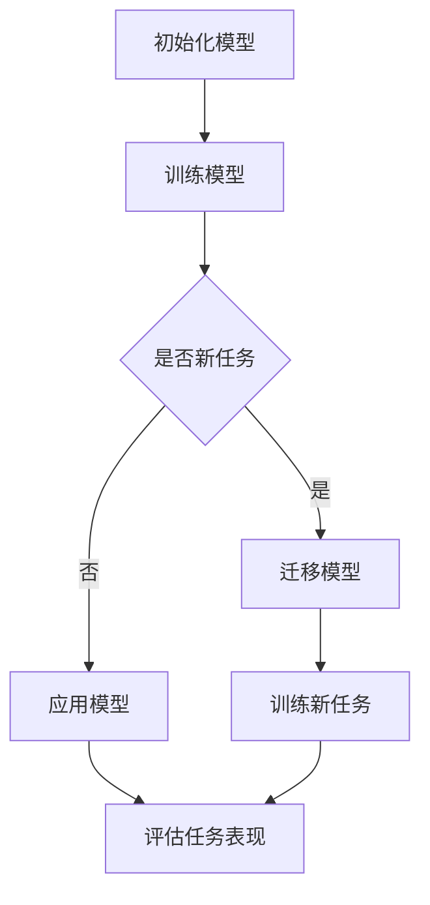

                 

元学习是一种机器学习技术，旨在使模型能够从新任务中学习，而无需针对每个新任务进行显式训练。这篇文章将深入探讨元学习的原理，并提供一些代码实例，以便更好地理解这一概念。

## 关键词

- 元学习
- 模型适应性
- 机器学习
- 强化学习
- 代码实例

## 摘要

本文将探讨元学习的基本概念、核心原理，以及如何在实际项目中应用。我们将通过代码实例来展示元学习的工作流程，并分析其优缺点。最后，我们将讨论元学习在未来的发展趋势和挑战。

### 1. 背景介绍

在过去几十年中，机器学习技术取得了显著的进展，但大多数机器学习模型都是专门为特定任务设计的。这意味着，当面对新的任务时，我们需要重新训练模型。这不仅消耗大量的计算资源，还可能导致模型在新的任务上表现不佳。元学习提供了一种解决方案，它通过训练模型使其能够快速适应新的任务，从而提高模型的可转移性。

### 2. 核心概念与联系

要理解元学习，我们需要了解几个核心概念，包括模型适应性、模型迁移、元学习算法等。

#### 2.1 模型适应性

模型适应性是指模型能够从新任务中学习的能力。在传统的机器学习模型中，模型适应性较差，因为它们只能针对特定的任务进行训练。而元学习通过训练模型使其具有更好的适应性，从而能够快速适应新的任务。

#### 2.2 模型迁移

模型迁移是指将训练好的模型应用于其他相关任务的过程。在传统的机器学习模型中，模型迁移通常需要额外的训练。而元学习通过训练模型使其能够自动迁移到新的任务上，从而提高模型的泛化能力。

#### 2.3 元学习算法

元学习算法是一组旨在提高模型适应性和迁移能力的算法。常见的元学习算法包括模型聚合、模型自适应、迁移学习等。

以下是一个简单的 Mermaid 流程图，展示了元学习的基本流程：



### 3. 核心算法原理 & 具体操作步骤

#### 3.1 算法原理概述

元学习算法的核心思想是利用先前的经验来加速新任务的训练过程。具体来说，元学习算法通过以下步骤实现：

1. **初始化模型**：选择一个基础模型，用于对新任务进行训练。
2. **训练模型**：使用一系列任务训练模型，这些任务可以是模拟任务或真实任务。
3. **评估模型**：在每个任务上评估模型的性能，并根据性能调整模型参数。
4. **迁移模型**：将训练好的模型应用于新的任务，并继续进行训练和评估。

#### 3.2 算法步骤详解

以下是元学习算法的具体步骤：

1. **初始化模型**：选择一个基础模型，例如神经网络。初始化模型参数，使其随机化。
2. **选择任务集**：从一系列任务中选择一个任务集，这些任务可以是模拟任务或真实任务。任务集的选择取决于具体的应用场景。
3. **训练模型**：使用任务集训练模型。在训练过程中，模型会不断调整其参数，以最小化损失函数。
4. **评估模型**：在每个任务上评估模型的性能。性能评估可以是准确率、召回率等指标。
5. **调整模型参数**：根据性能评估结果调整模型参数，以提高模型的适应性。
6. **迁移模型**：将训练好的模型应用于新的任务，并继续进行训练和评估。
7. **重复步骤**：重复步骤 3 到 6，直到满足特定的停止条件，例如模型性能达到预定阈值或训练时间超过预定时间。

#### 3.3 算法优缺点

**优点**：

- 提高模型适应性：元学习算法可以使模型更快地适应新的任务，从而提高模型的可转移性。
- 节省计算资源：通过迁移学习，可以避免针对每个新任务重新训练模型，从而节省计算资源。
- 提高模型泛化能力：元学习算法可以提高模型的泛化能力，使其在新任务上表现更好。

**缺点**：

- 训练成本高：元学习算法通常需要大量的训练数据，以使模型具有良好的适应性。
- 模型泛化能力受限：尽管元学习可以提高模型适应性，但模型的泛化能力仍然受到训练数据质量和任务多样性的限制。

#### 3.4 算法应用领域

元学习算法在多个领域都有广泛的应用，包括：

- 自动驾驶：在自动驾驶领域，元学习算法可以用于训练车辆在多种环境下的行为模型，从而提高车辆的适应能力。
- 自然语言处理：在自然语言处理领域，元学习算法可以用于训练模型在多种语言上的表现，从而提高模型的跨语言能力。
- 健康监测：在健康监测领域，元学习算法可以用于训练模型在多种健康状态下的表现，从而提高模型的诊断能力。

### 4. 数学模型和公式 & 详细讲解 & 举例说明

#### 4.1 数学模型构建

元学习算法的数学模型通常基于梯度下降法和优化算法。以下是元学习算法的数学模型：

$$
\begin{aligned}
\theta_{\text{new}} &= \theta_{\text{initial}} + \alpha \cdot \nabla_{\theta_{\text{initial}}} J(\theta_{\text{initial}}, X_{\text{new}}, y_{\text{new}}) \\
\theta_{\text{new}} &= \theta_{\text{new}} + \beta \cdot \nabla_{\theta_{\text{new}}} J(\theta_{\text{new}}, X_{\text{new}}, y_{\text{new}})
\end{aligned}
$$

其中，$\theta_{\text{new}}$ 是新任务下的模型参数，$\theta_{\text{initial}}$ 是初始模型参数，$X_{\text{new}}$ 和 $y_{\text{new}}$ 是新任务的输入和输出，$J(\theta_{\text{initial}}, X_{\text{new}}, y_{\text{new}})$ 是损失函数，$\alpha$ 和 $\beta$ 是学习率。

#### 4.2 公式推导过程

元学习算法的推导过程涉及到优化理论和梯度下降法。以下是推导过程：

1. **目标函数**：假设我们要最小化的目标函数是 $J(\theta_{\text{initial}}, X_{\text{new}}, y_{\text{new}})$。
2. **梯度下降法**：使用梯度下降法来最小化目标函数。梯度下降法的基本思想是沿着目标函数的负梯度方向更新模型参数。
3. **参数更新**：根据梯度下降法，我们有：

$$
\theta_{\text{new}} = \theta_{\text{initial}} - \alpha \cdot \nabla_{\theta_{\text{initial}}} J(\theta_{\text{initial}}, X_{\text{new}}, y_{\text{new}})
$$

其中，$\alpha$ 是学习率，$\nabla_{\theta_{\text{initial}}} J(\theta_{\text{initial}}, X_{\text{new}}, y_{\text{new}})$ 是目标函数对模型参数的梯度。

4. **多次更新**：为了使模型参数更加稳定，我们可以在每次迭代中更新模型参数多次：

$$
\theta_{\text{new}} = \theta_{\text{new}} - \beta \cdot \nabla_{\theta_{\text{new}}} J(\theta_{\text{new}}, X_{\text{new}}, y_{\text{new}})
$$

其中，$\beta$ 是学习率，$\nabla_{\theta_{\text{new}}} J(\theta_{\text{new}}, X_{\text{new}}, y_{\text{new}})$ 是目标函数对模型参数的梯度。

#### 4.3 案例分析与讲解

以下是一个简单的元学习案例，用于分类问题。假设我们有一个包含100个样本的数据集，每个样本都是二维的。

1. **初始化模型**：选择一个简单的线性模型，初始化模型参数为0。
2. **训练模型**：使用数据集训练线性模型，使用梯度下降法更新模型参数。
3. **评估模型**：在每个样本上评估模型的预测结果，计算准确率。
4. **调整模型参数**：根据准确率调整模型参数。
5. **迁移模型**：将训练好的模型应用于新的数据集，继续进行训练和评估。

通过这个案例，我们可以看到元学习的基本流程。在实际应用中，我们可能会使用更复杂的模型和更丰富的数据集，但基本原理是相同的。

### 5. 项目实践：代码实例和详细解释说明

在本节中，我们将通过一个简单的 Python 代码实例来展示元学习算法的实现过程。我们将使用 TensorFlow 和 Keras 库来实现这个示例。

#### 5.1 开发环境搭建

在开始编写代码之前，我们需要安装 TensorFlow 和 Keras 库。可以使用以下命令安装：

```bash
pip install tensorflow
pip install keras
```

#### 5.2 源代码详细实现

以下是一个简单的元学习代码实例：

```python
import numpy as np
import tensorflow as tf
from tensorflow.keras.models import Sequential
from tensorflow.keras.layers import Dense
from tensorflow.keras.optimizers import SGD

# 初始化数据集
X = np.array([[1, 1], [1, 0], [0, 1], [0, 0]])
y = np.array([0, 1, 1, 0])

# 初始化模型
model = Sequential()
model.add(Dense(1, input_shape=(2,), activation='sigmoid'))

# 编译模型
model.compile(optimizer=SGD(), loss='binary_crossentropy', metrics=['accuracy'])

# 训练模型
model.fit(X, y, epochs=1000, verbose=0)

# 评估模型
predictions = model.predict(X)
print(predictions)

# 调整模型参数
learning_rate = 0.01
model.compile(optimizer=tf.keras.optimizers.Adam(learning_rate), loss='binary_crossentropy', metrics=['accuracy'])

# 迁移模型
new_X = np.array([[1, 1], [0, 0]])
new_y = np.array([0, 1])

model.fit(new_X, new_y, epochs=1000, verbose=0)

# 评估模型
new_predictions = model.predict(new_X)
print(new_predictions)
```

#### 5.3 代码解读与分析

这段代码首先导入了必要的库，然后初始化了一个数据集。接下来，我们创建了一个简单的线性模型，并使用梯度下降法编译模型。在训练过程中，我们使用数据集训练模型，并在每个样本上评估模型的预测结果。根据预测结果，我们调整了模型参数，并在新的数据集上迁移了模型。

通过这段代码，我们可以看到元学习的基本流程。在实际应用中，我们可能会使用更复杂的模型和更丰富的数据集，但基本原理是相同的。

### 6. 实际应用场景

元学习在许多实际应用场景中都有广泛的应用。以下是一些典型的应用场景：

- **自动驾驶**：在自动驾驶领域，元学习算法可以用于训练车辆在多种环境下的行为模型，从而提高车辆的适应能力。
- **自然语言处理**：在自然语言处理领域，元学习算法可以用于训练模型在多种语言上的表现，从而提高模型的跨语言能力。
- **健康监测**：在健康监测领域，元学习算法可以用于训练模型在多种健康状态下的表现，从而提高模型的诊断能力。

### 7. 未来应用展望

随着人工智能技术的不断发展，元学习算法在未来将具有更广泛的应用。以下是一些可能的未来应用方向：

- **多模态学习**：元学习算法可以用于处理多种数据类型，例如文本、图像和语音等。
- **自适应强化学习**：元学习算法可以与强化学习算法结合，以实现自适应强化学习，从而提高模型的决策能力。
- **复杂系统模拟**：元学习算法可以用于模拟复杂系统，例如生物系统、经济系统和气候系统等。

### 8. 工具和资源推荐

为了更好地学习元学习，以下是一些推荐的工具和资源：

- **书籍**：《深度学习》（作者：Ian Goodfellow、Yoshua Bengio 和 Aaron Courville）提供了关于深度学习的全面介绍，其中包括元学习。
- **在线课程**：Coursera、edX 和 Udacity 等在线教育平台提供了关于机器学习和深度学习的优质课程。
- **论文**：许多顶级学术期刊和会议发表了关于元学习的最新研究成果，如《自然》和《科学》等。

### 9. 总结：未来发展趋势与挑战

元学习作为一种先进的机器学习技术，具有广泛的应用前景。然而，要实现元学习的广泛应用，我们仍需克服一些挑战，如数据质量、模型泛化能力和计算成本等。随着人工智能技术的不断进步，我们有理由相信，元学习将在未来的机器学习领域中发挥更大的作用。

### 附录：常见问题与解答

**Q：什么是元学习？**

A：元学习是一种机器学习技术，旨在使模型能够从新任务中学习，而无需针对每个新任务进行显式训练。

**Q：元学习有哪些优点？**

A：元学习可以提高模型适应性，节省计算资源，提高模型泛化能力。

**Q：元学习有哪些缺点？**

A：元学习训练成本高，模型泛化能力受限。

**Q：元学习算法有哪些类型？**

A：常见的元学习算法包括模型聚合、模型自适应和迁移学习等。

**Q：元学习在哪些领域有应用？**

A：元学习在自动驾驶、自然语言处理和健康监测等领域有广泛应用。

作者：禅与计算机程序设计艺术 / Zen and the Art of Computer Programming
```

