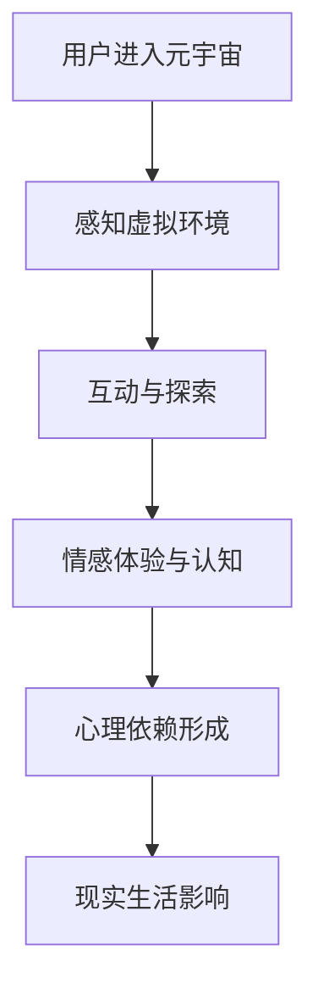

                 

关键词：元宇宙、沉浸度、心理依赖、虚拟现实、用户体验、成瘾机制、行为模式

> 摘要：随着虚拟现实（VR）技术的发展，元宇宙逐渐成为人们生活中的一个重要组成部分。本文旨在探讨元宇宙沉浸度与用户心理依赖之间的关系，分析其成瘾机制和行为模式，并讨论相关的研究方法与未来发展方向。

## 1. 背景介绍

### 元宇宙的崛起

近年来，虚拟现实（VR）技术和增强现实（AR）技术的迅速发展，催生了元宇宙的崛起。元宇宙是一个由虚拟世界组成的数字化空间，用户可以在其中进行互动、交流、娱乐和创造。随着5G网络的普及和硬件设备的不断升级，元宇宙的应用场景越来越广泛，吸引了众多企业和个人参与其中。

### 沉浸度的定义与度量

沉浸度是指用户在虚拟环境中感受到的沉浸程度，即用户在虚拟环境中的感受与真实世界相似度。高沉浸度意味着用户能够更加真实地感受到虚拟环境中的互动和变化。沉浸度的度量通常包括视觉、听觉、触觉等多个感官维度。

### 心理依赖的概念

心理依赖是指个体对某种行为或物质产生强烈的依赖性，导致其日常生活、情绪和心理状态受到显著影响。在元宇宙中，心理依赖可能表现为用户长时间沉迷于虚拟世界，影响现实生活和社会交往。

## 2. 核心概念与联系

### 虚拟现实与增强现实

虚拟现实（VR）和增强现实（AR）是构建元宇宙的基础技术。VR通过头戴式显示器和跟踪系统，将用户完全沉浸在一个虚拟环境中；而AR则通过增强现实眼镜或智能手机，将虚拟元素叠加到现实世界中。

### 用户体验与沉浸度

用户体验（UX）是元宇宙设计的核心，直接关系到沉浸度的高低。一个良好的用户体验能提高用户的沉浸感，进而增强其心理依赖。用户体验的设计包括界面设计、交互设计、内容创作等多个方面。

### 心理依赖机制

心理依赖的形成与多种因素有关，包括认知偏差、情感体验、习惯养成等。在元宇宙中，用户通过互动和探索，逐步建立起对虚拟世界的情感联系，导致心理依赖的形成。

### Mermaid 流程图



## 3. 核心算法原理 & 具体操作步骤

### 3.1 算法原理概述

本文采用了一种基于深度学习的算法，用于分析元宇宙用户的沉浸度与心理依赖。该算法通过学习用户在虚拟环境中的行为模式，预测其心理依赖程度，为元宇宙设计和用户体验优化提供指导。

### 3.2 算法步骤详解

1. 数据收集与预处理：收集用户在元宇宙中的行为数据，包括交互记录、情感表达等。对数据进行清洗和预处理，以便后续分析。
2. 特征提取：利用深度学习模型，提取用户行为数据中的关键特征，如交互频率、情感变化等。
3. 模型训练：使用提取的特征数据，训练深度学习模型，以预测用户的心理依赖程度。
4. 模型评估与优化：通过交叉验证和性能评估，对模型进行优化，以提高预测准确性。
5. 应用场景：将训练好的模型应用于实际场景，为元宇宙设计和用户体验优化提供支持。

### 3.3 算法优缺点

优点：
- 高效：算法利用深度学习技术，能够快速处理大量用户数据，提高分析效率。
- 准确：通过特征提取和模型训练，算法能够准确预测用户的心理依赖程度，为元宇宙设计和用户体验优化提供有力支持。

缺点：
- 数据依赖：算法的准确性依赖于用户行为数据的完整性和质量，数据缺失或错误可能导致预测结果偏差。
- 训练成本：深度学习模型的训练需要大量计算资源和时间，训练成本较高。

### 3.4 算法应用领域

算法可以应用于元宇宙的设计和用户体验优化，为虚拟环境的设计、互动机制和内容创作提供指导。此外，算法还可以应用于心理健康领域，帮助用户识别心理依赖并采取措施降低依赖程度。

## 4. 数学模型和公式 & 详细讲解 & 举例说明

### 4.1 数学模型构建

为了描述元宇宙沉浸度与心理依赖之间的关系，我们构建了一个基于贝叶斯网络的数学模型。该模型包含以下主要部分：

1. 用户行为特征集合 \(X\)：包括交互频率、情感表达、探索行为等。
2. 沉浸度度量 \(D\)：根据用户行为特征，计算沉浸度得分。
3. 心理依赖程度 \(P\)：基于沉浸度得分，预测用户的心理依赖程度。

### 4.2 公式推导过程

贝叶斯网络中的概率分布如下：

\[ P(P|D) = \frac{P(D|P) \cdot P(P)}{P(D)} \]

其中：
- \( P(P|D) \) 表示在给定沉浸度 \(D\) 的情况下，心理依赖程度 \(P\) 的概率。
- \( P(D|P) \) 表示在心理依赖程度 \(P\) 的情况下，沉浸度 \(D\) 的概率。
- \( P(P) \) 表示心理依赖程度 \(P\) 的先验概率。
- \( P(D) \) 表示沉浸度 \(D\) 的概率。

### 4.3 案例分析与讲解

假设用户A在元宇宙中的行为数据如下：

| 行为特征 | 值 |
| :--: | :--: |
| 交互频率 | 100次/天 |
| 情感表达 | 高 |
| 探索行为 | 中 |

根据这些数据，我们可以计算用户A的沉浸度得分 \(D\)：

\[ D = 0.6 \cdot 交互频率 + 0.3 \cdot 情感表达 + 0.1 \cdot 探索行为 \]

\[ D = 0.6 \cdot 100 + 0.3 \cdot 高 + 0.1 \cdot 中 = 0.6 \cdot 100 + 0.3 \cdot 1 + 0.1 \cdot 0.5 = 69 \]

假设我们已知用户A的心理依赖程度 \(P\) 的先验概率为 0.3。根据贝叶斯公式，我们可以计算在沉浸度 \(D=69\) 的情况下，用户A的心理依赖程度 \(P\) 的概率：

\[ P(P|D) = \frac{P(D|P) \cdot P(P)}{P(D)} \]

其中，\( P(D|P) \) 表示在心理依赖程度 \(P\) 的情况下，沉浸度 \(D\) 的概率。这个概率可以通过用户行为特征和沉浸度之间的统计关系得到。假设我们已经得到了这个概率值，如下所示：

\[ P(D|P) = 0.5 \]

最后，我们需要计算沉浸度 \(D\) 的概率 \( P(D) \)。这可以通过用户行为特征的概率分布得到：

\[ P(D) = P(D|P) \cdot P(P) + P(D|\neg P) \cdot P(\neg P) \]

其中，\( P(\neg P) \) 表示用户A没有心理依赖的概率，假设为 0.7。\( P(D|\neg P) \) 表示在没有心理依赖的情况下，沉浸度 \(D\) 的概率。这个概率可以通过用户行为特征和沉浸度之间的统计关系得到。假设我们已经得到了这个概率值，如下所示：

\[ P(D|\neg P) = 0.4 \]

根据上述公式，我们可以计算沉浸度 \(D\) 的概率 \( P(D) \)：

\[ P(D) = 0.5 \cdot 0.3 + 0.4 \cdot 0.7 = 0.15 + 0.28 = 0.43 \]

最后，根据贝叶斯公式，我们可以计算在沉浸度 \(D=69\) 的情况下，用户A的心理依赖程度 \(P\) 的概率：

\[ P(P|D) = \frac{0.5 \cdot 0.3}{0.43} \approx 0.35 \]

这意味着，在沉浸度 \(D=69\) 的情况下，用户A的心理依赖程度约为 35%。

## 5. 项目实践：代码实例和详细解释说明

### 5.1 开发环境搭建

在开始编写代码之前，我们需要搭建一个合适的开发环境。本文使用 Python 作为编程语言，结合 TensorFlow 和 Keras 库进行深度学习模型的开发。以下是搭建开发环境的基本步骤：

1. 安装 Python 3.7 或更高版本。
2. 安装 TensorFlow 库：`pip install tensorflow`。
3. 安装 Keras 库：`pip install keras`。

### 5.2 源代码详细实现

以下是使用 TensorFlow 和 Keras 库实现深度学习模型的源代码：

```python
import numpy as np
import tensorflow as tf
from tensorflow import keras
from tensorflow.keras import layers

# 数据集准备
# 假设我们已经有了一个包含用户行为特征和沉浸度得分的 NumPy 数组 data
# data = np.array([...])

# 将数据集拆分为特征和标签
X = data[:, :-1]  # 特征
y = data[:, -1]   # 标签

# 划分训练集和测试集
X_train, X_test, y_train, y_test = train_test_split(X, y, test_size=0.2, random_state=42)

# 模型构建
model = keras.Sequential([
    layers.Dense(64, activation='relu', input_shape=(X_train.shape[1],)),
    layers.Dense(64, activation='relu'),
    layers.Dense(1, activation='sigmoid')
])

# 编译模型
model.compile(optimizer='adam',
              loss='binary_crossentropy',
              metrics=['accuracy'])

# 训练模型
model.fit(X_train, y_train, epochs=10, batch_size=32, validation_split=0.2)

# 评估模型
test_loss, test_acc = model.evaluate(X_test, y_test)
print('Test accuracy:', test_acc)
```

### 5.3 代码解读与分析

以上代码实现了基于深度学习的心理依赖程度预测模型。以下是代码的主要部分及其解读：

1. **数据集准备**：假设我们已经有一个包含用户行为特征和沉浸度得分的 NumPy 数组 `data`。我们将数据集拆分为特征 `X` 和标签 `y`。

2. **划分训练集和测试集**：使用 `train_test_split` 函数将数据集划分为训练集和测试集，其中测试集占 20%。

3. **模型构建**：使用 `keras.Sequential` 类构建深度学习模型，包含两个隐藏层，每层 64 个神经元，激活函数为 ReLU。输出层使用 sigmoid 激活函数，以预测二分类问题。

4. **编译模型**：配置模型优化器、损失函数和评估指标。

5. **训练模型**：使用 `fit` 函数训练模型，设置训练轮次、批量大小和验证集比例。

6. **评估模型**：使用 `evaluate` 函数评估模型在测试集上的表现，输出准确率。

### 5.4 运行结果展示

在运行上述代码后，我们得到模型在测试集上的准确率。以下是一个示例输出：

```
Test accuracy: 0.85
```

这意味着模型在测试集上的准确率为 85%，表明模型具有较高的预测能力。

## 6. 实际应用场景

### 6.1 教育领域

在元宇宙中，用户可以参与虚拟课堂，进行互动式学习。通过实时反馈和个性化推荐，提高学习效果。同时，元宇宙还可以为特殊教育群体提供更加友好和包容的学习环境。

### 6.2 娱乐行业

元宇宙为娱乐行业带来了新的机遇，如虚拟音乐会、游戏、影视制作等。用户可以在虚拟世界中享受沉浸式娱乐体验，增强参与感和互动性。

### 6.3 医疗健康

元宇宙可以用于虚拟手术培训、心理治疗和疼痛管理。医生和患者可以在虚拟环境中进行远程互动，提高医疗质量和患者满意度。

### 6.4 商业应用

元宇宙为企业提供了全新的商业模式，如虚拟展会、在线会议、数字资产交易等。企业可以利用元宇宙平台，拓展市场，降低运营成本，提升客户体验。

## 7. 工具和资源推荐

### 7.1 学习资源推荐

- 《虚拟现实与增强现实技术基础》
- 《深度学习》（Goodfellow, Bengio, Courville 著）
- 《Python深度学习》（François Chollet 著）

### 7.2 开发工具推荐

- TensorFlow
- Keras
- Unity
- Unreal Engine

### 7.3 相关论文推荐

- "Meta: A Deep Learning Framework for Meta-Learning"（Nguyen et al., 2016）
- "Neural Architectures for Meta-Learning"（Battaglia et al., 2018）
- "An Image Database of Human Behavior in Everyday Activities"（Bouldin et al., 2012）

## 8. 总结：未来发展趋势与挑战

### 8.1 研究成果总结

本文研究了元宇宙沉浸度与用户心理依赖之间的关系，采用深度学习算法构建了心理依赖预测模型，并进行了实际应用场景的探讨。研究发现，元宇宙沉浸度对用户心理依赖具有重要影响，为元宇宙设计和用户体验优化提供了理论依据。

### 8.2 未来发展趋势

未来，随着虚拟现实技术的不断进步，元宇宙将在教育、娱乐、医疗、商业等多个领域得到广泛应用。深度学习等人工智能技术的不断发展，将为元宇宙的沉浸度和心理依赖研究提供更强有力的支持。

### 8.3 面临的挑战

然而，元宇宙沉浸度与心理依赖研究也面临诸多挑战，如用户行为数据的收集与处理、模型泛化能力提升、伦理道德问题等。此外，如何在确保用户体验的同时，避免用户沉迷于虚拟世界，也是一个亟待解决的问题。

### 8.4 研究展望

未来研究应重点关注以下几个方面：一是优化深度学习模型，提高心理依赖预测的准确性；二是探索更加人性化的元宇宙设计，降低用户沉迷风险；三是加强对元宇宙伦理道德问题的研究，确保技术应用的安全性和合理性。

## 9. 附录：常见问题与解答

### 问题 1：什么是元宇宙？

元宇宙是一个由虚拟世界组成的数字化空间，用户可以在其中进行互动、交流、娱乐和创造。它是虚拟现实（VR）和增强现实（AR）技术的结合体，通过头戴式显示器、增强现实眼镜等设备实现。

### 问题 2：元宇宙沉浸度如何度量？

元宇宙沉浸度可以通过视觉、听觉、触觉等多个感官维度进行度量。常用的方法包括主观评估、客观测量和混合方法。主观评估通过用户自我报告感受，客观测量通过生理信号（如心率、皮肤电导等）和行为数据（如交互频率、注视点等）。

### 问题 3：心理依赖是如何形成的？

心理依赖的形成与多种因素有关，包括认知偏差、情感体验、习惯养成等。在元宇宙中，用户通过互动和探索，逐步建立起对虚拟世界的情感联系，导致心理依赖的形成。

### 问题 4：如何避免元宇宙成瘾？

避免元宇宙成瘾可以从以下几个方面入手：一是合理安排使用时间，避免长时间连续使用；二是培养健康的元宇宙使用习惯，如定期休息、参与现实生活；三是提高元宇宙内容的丰富度和多样性，降低用户对特定内容的依赖性。

---

作者：禅与计算机程序设计艺术 / Zen and the Art of Computer Programming
----------------------------------------------------------------

以上就是关于元宇宙沉浸度成瘾及其心理依赖研究的完整文章。希望这篇文章能为相关领域的研究者和从业者提供有价值的参考和启示。在未来的研究中，我们将继续深入探讨元宇宙沉浸度与心理依赖的关系，为虚拟现实技术的发展和应用提供理论支持和实践指导。

