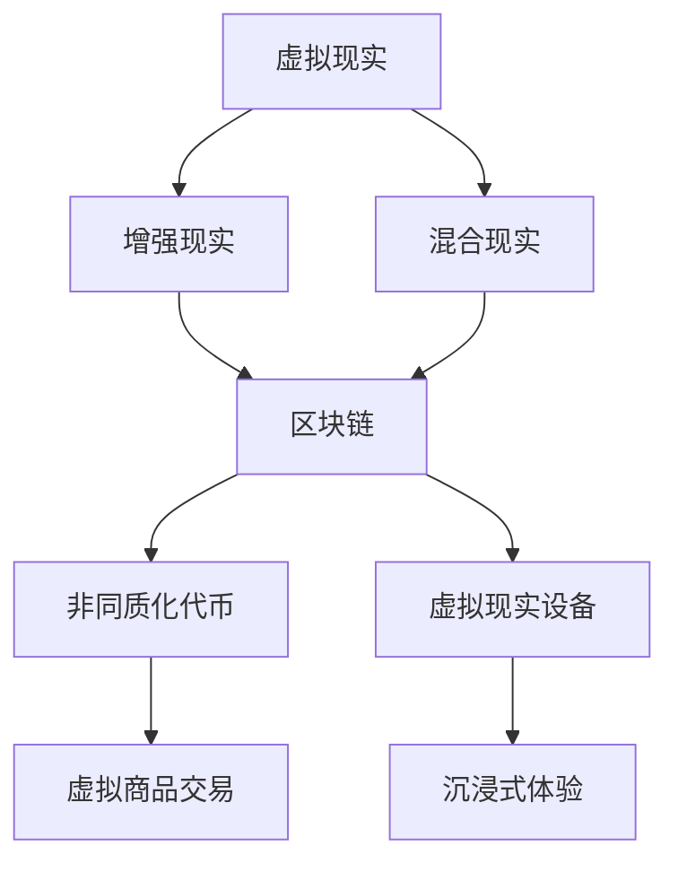

                 

关键词：元宇宙、职业规划、虚拟世界、职业发展、技术趋势

> 摘要：本文将探讨元宇宙这一新兴领域的职业规划，分析虚拟世界职业发展的路径和机遇。通过深入解析元宇宙的核心概念、技术架构、以及核心算法，本文将帮助读者理解元宇宙的职业前景，并为他们提供实用的职业发展建议。

## 1. 背景介绍

随着数字技术的迅猛发展，虚拟世界正逐步从科幻走向现实。元宇宙（Metaverse）作为一个集成了虚拟现实、增强现实、区块链等技术的综合生态系统，正逐渐改变我们的生活方式和工作方式。元宇宙不仅是一个虚拟空间，更是一个全新的社会和经济体系。在这个虚拟世界中，人们可以创建、交互、交易，实现与现实世界类似的丰富体验。

### 元宇宙的定义

元宇宙是一个由虚拟空间、网络和物理设备构成的生态系统，其中用户可以创建虚拟身份，进行社交互动、工作、娱乐和消费。它是一个跨平台、跨设备的全球性虚拟空间，通过虚拟现实（VR）、增强现实（AR）、混合现实（MR）等技术实现。元宇宙的核心目标是创造一个无缝的、沉浸式的用户体验，使得虚拟世界与现实世界的界限变得模糊。

### 元宇宙的发展历程

元宇宙的概念最早可以追溯到科幻小说和电影中。20世纪80年代，虚拟现实技术开始萌芽，但受限于计算能力和显示技术，发展缓慢。进入21世纪，随着互联网、移动设备、云计算、人工智能等技术的迅猛发展，元宇宙的概念逐渐被重视。2010年代，虚拟现实和增强现实技术的成熟，使得元宇宙开始进入快速发展期。2020年后，随着全球疫情的影响，远程工作和在线娱乐的需求急剧增加，元宇宙的概念进一步得到普及。

### 元宇宙的应用领域

元宇宙的应用领域非常广泛，包括但不限于以下几个方面：

1. **娱乐与游戏**：虚拟现实游戏、在线角色扮演游戏、虚拟演唱会等。
2. **教育与培训**：虚拟课堂、沉浸式教学、远程培训等。
3. **社交互动**：虚拟社交平台、在线社区、虚拟约会等。
4. **商业与经济**：虚拟商品交易、数字货币、虚拟房地产等。
5. **设计与创意**：虚拟设计、3D建模、创意艺术等。

## 2. 核心概念与联系

### 核心概念

在元宇宙中，有几个核心概念需要理解：

1. **虚拟现实（VR）**：通过计算机技术创建的模拟环境，用户可以在其中进行沉浸式交互。
2. **增强现实（AR）**：在现实环境中叠加数字内容，用户可以通过设备看到虚拟对象。
3. **混合现实（MR）**：虚拟和现实环境的结合，用户可以与虚拟对象进行互动。
4. **区块链**：分布式数据库技术，用于创建安全的数字身份和交易。
5. **非同质化代币（NFT）**：代表数字资产的所有权，用于虚拟世界的物品交易。
6. **虚拟现实设备**：如VR头戴设备、AR眼镜、智能手表等。

### 架构联系

下面是一个简单的Mermaid流程图，展示了元宇宙的关键概念及其相互关系：



## 3. 核心算法原理 & 具体操作步骤

### 3.1 算法原理概述

在元宇宙中，核心算法主要涉及以下几个方面：

1. **三维图形渲染**：用于生成虚拟环境的图形，提供沉浸式的视觉效果。
2. **物理引擎**：模拟虚拟世界中的物理现象，如碰撞、重力等。
3. **人工智能**：用于智能代理的交互和动态场景的生成。
4. **加密算法**：确保数据的安全和交易的可靠性。
5. **分布式计算**：支持大规模用户的同时在线交互。

### 3.2 算法步骤详解

1. **三维图形渲染**：

   - **模型构建**：通过3D建模软件创建虚拟场景和角色。
   - **纹理映射**：为模型添加纹理，提高视觉效果。
   - **光照处理**：模拟真实世界的光照效果，增强场景的沉浸感。
   - **渲染输出**：将图形渲染到VR头戴设备或AR眼镜中。

2. **物理引擎**：

   - **碰撞检测**：检测虚拟对象之间的碰撞，避免重叠。
   - **运动模拟**：根据物理定律模拟对象的运动轨迹。
   - **重力与摩擦**：模拟重力、摩擦等物理现象。

3. **人工智能**：

   - **行为树**：定义智能代理的行为逻辑。
   - **路径规划**：智能代理根据环境动态选择最优路径。
   - **对话系统**：基于自然语言处理技术实现智能对话。

4. **加密算法**：

   - **哈希函数**：用于数据加密和数字签名。
   - **非对称加密**：确保交易数据的隐私和安全。
   - **共识算法**：用于区块链网络的节点验证和数据一致性。

5. **分布式计算**：

   - **数据分发**：将计算任务分布到多个节点上。
   - **负载均衡**：优化计算资源的分配，提高系统性能。
   - **容错机制**：确保系统在节点故障时依然稳定运行。

### 3.3 算法优缺点

1. **三维图形渲染**：

   - **优点**：提供沉浸式的视觉效果，增强用户体验。
   - **缺点**：计算资源消耗大，对硬件要求高。

2. **物理引擎**：

   - **优点**：增强虚拟世界的真实感，提高交互体验。
   - **缺点**：计算复杂度高，对实时性要求高。

3. **人工智能**：

   - **优点**：实现智能交互和动态场景，提高系统的智能化水平。
   - **缺点**：算法复杂，需要大量数据训练。

4. **加密算法**：

   - **优点**：保障数据安全和交易的可靠性。
   - **缺点**：加密和解密过程消耗计算资源。

5. **分布式计算**：

   - **优点**：提高系统的性能和可靠性，支持大规模用户同时在线。
   - **缺点**：分布式系统复杂，需要维护和调试。

### 3.4 算法应用领域

1. **娱乐与游戏**：用于生成丰富的虚拟场景和角色，提高游戏体验。
2. **教育与培训**：用于创建沉浸式的学习环境和虚拟实验室。
3. **社交互动**：用于智能代理的交互和虚拟社交平台的运营。
4. **商业与经济**：用于虚拟商品的交易和数字货币的发行。
5. **设计与创意**：用于3D建模和创意艺术作品的创作。

## 4. 数学模型和公式 & 详细讲解 & 举例说明

### 4.1 数学模型构建

在元宇宙中，数学模型用于描述虚拟世界中的各种现象和交互。以下是几个关键的数学模型：

1. **三维空间模型**：用于定义虚拟场景和角色的位置、方向和姿态。
2. **物理模型**：用于描述虚拟世界中的物理现象，如重力、碰撞等。
3. **神经网络模型**：用于人工智能代理的决策和行为。
4. **区块链模型**：用于确保交易的不可篡改和数据一致性。

### 4.2 公式推导过程

1. **三维空间模型**：

   - **位置公式**：\( P = (x, y, z) \)
   - **方向公式**：\( D = \theta \)，其中\(\theta\)为绕Z轴的旋转角度。

2. **物理模型**：

   - **重力公式**：\( F = m \cdot g \)，其中\( F \)为重力，\( m \)为物体质量，\( g \)为重力加速度。
   - **碰撞检测**：\( D = P_2 - P_1 \)，其中\( D \)为两个物体之间的距离，\( P_1 \)和\( P_2 \)为两个物体的位置。

3. **神经网络模型**：

   - **激活函数**：\( f(x) = \frac{1}{1 + e^{-x}} \)，其中\( x \)为输入值，\( f(x) \)为输出值。

4. **区块链模型**：

   - **哈希函数**：\( H = SHA256(M) \)，其中\( H \)为哈希值，\( M \)为输入数据。

### 4.3 案例分析与讲解

**案例**：使用三维空间模型计算虚拟角色的运动轨迹。

**步骤**：

1. 初始位置：\( P_1 = (0, 0, 0) \)
2. 目标位置：\( P_2 = (5, 0, 0) \)
3. 运动时间：\( t = 5 \)秒

**计算过程**：

1. **计算方向**：\( D = \theta = \arccos\left(\frac{P_2 - P_1}{t}\right) = \arccos\left(\frac{5}{5}\right) = 0 \)度
2. **计算速度**：\( v = \frac{P_2 - P_1}{t} = \frac{5 - 0}{5} = 1 \)单位/秒
3. **计算运动轨迹**：\( P(t) = P_1 + v \cdot t \cdot \cos(\theta) \)，其中\( P(t) \)为任意时间\( t \)的虚拟角色位置。

**结果**：在5秒内，虚拟角色从初始位置移动到目标位置。

$$
P(t) = (0, 0, 0) + (1 \text{单位/秒}) \cdot (5 \text{秒}) \cdot \cos(0 \text{度}) = (5, 0, 0)
$$

## 5. 项目实践：代码实例和详细解释说明

### 5.1 开发环境搭建

为了更好地理解元宇宙的开发流程，我们将使用Unity引擎和C#语言进行开发。以下是开发环境的搭建步骤：

1. **下载Unity Hub**：从Unity官网下载Unity Hub并安装。
2. **创建Unity项目**：在Unity Hub中创建一个新的3D项目。
3. **安装必要的插件**：安装用于区块链和虚拟现实开发的插件，如Unity Blockchain和Unity XR。
4. **配置开发环境**：设置Unity编辑器和开发工具的路径，确保插件和项目能够正常运行。

### 5.2 源代码详细实现

下面是一个简单的Unity项目，用于展示虚拟角色的移动：

```csharp
using UnityEngine;

public class VirtualCharacter : MonoBehaviour
{
    public float moveSpeed = 5.0f;

    private void Update()
    {
        MoveCharacter();
    }

    private void MoveCharacter()
    {
        float moveX = Input.GetAxis("Horizontal") * moveSpeed;
        float moveZ = Input.GetAxis("Vertical") * moveSpeed;

        transform.Translate(new Vector3(moveX, 0, moveZ));
    }
}
```

### 5.3 代码解读与分析

1. **脚本功能**：该脚本用于控制虚拟角色的移动。
2. **变量说明**：`moveSpeed`用于设置角色的移动速度。
3. **Update函数**：每帧调用，用于检测用户的输入。
4. **MoveCharacter函数**：根据用户的输入计算角色的移动方向和距离，并更新角色的位置。

### 5.4 运行结果展示

运行项目后，用户可以通过键盘控制虚拟角色在虚拟世界中移动。在Unity编辑器中，可以看到角色根据用户的输入在场景中移动。

## 6. 实际应用场景

### 6.1 娱乐与游戏

元宇宙在娱乐和游戏领域的应用非常广泛。虚拟现实游戏和在线角色扮演游戏（MMORPG）已经成为元宇宙的重要组成部分。通过元宇宙，玩家可以体验更加沉浸式的游戏体验，与来自世界各地的玩家进行互动，甚至可以在虚拟世界中购买和交易虚拟商品。

### 6.2 教育与培训

元宇宙在教育领域的应用潜力巨大。通过虚拟现实和增强现实技术，教师可以创建沉浸式的教学环境，提高学生的学习兴趣和参与度。学生可以在虚拟实验室中进行实验，体验历史事件，甚至与历史人物进行互动。此外，元宇宙还可以用于在线培训，提供个性化的学习体验。

### 6.3 社交互动

元宇宙为社交互动提供了全新的平台。用户可以创建虚拟身份，在虚拟世界中与朋友互动，参加虚拟聚会和活动。元宇宙还提供了丰富的社交功能，如虚拟礼物、虚拟婚姻、虚拟宠物等，使得社交体验更加丰富多彩。

### 6.4 商业与经济

元宇宙为商业与经济活动提供了新的机会。虚拟商品交易、数字货币、虚拟房地产等已经成为元宇宙的重要组成部分。企业和个人可以在元宇宙中创建虚拟商店、虚拟办公室，甚至举办虚拟发布会和活动。元宇宙的经济体系正在逐步完善，吸引了大量的投资者和创业者。

## 6.4 未来应用展望

### 6.4.1 技术发展

随着技术的不断进步，元宇宙的应用领域将不断扩展。预计未来几年，虚拟现实、增强现实、区块链等技术的成熟将推动元宇宙的进一步发展。高性能计算、人工智能、量子计算等新兴技术的应用，将使元宇宙的体验更加真实和智能。

### 6.4.2 社会变革

元宇宙将对社会产生深远的影响。随着虚拟世界的不断发展，人们的社交方式、工作方式、教育方式等都可能发生变革。元宇宙将打破地域和时间的限制，使人们可以更加便捷地连接和互动。同时，元宇宙也将带来新的经济模式和就业机会，推动经济的可持续发展。

### 6.4.3 道德与法律

元宇宙的发展也将带来新的道德和法律挑战。如何保护用户的隐私和安全，如何规范虚拟世界的交易和互动，如何处理虚拟世界与现实世界的关系等问题，都需要我们认真思考和解决。元宇宙的道德和法律体系将逐步建立和完善，以适应这一新兴领域的发展需求。

## 7. 工具和资源推荐

### 7.1 学习资源推荐

1. **《元宇宙技术指南》**：由元宇宙专家编写，详细介绍了元宇宙的核心技术和应用场景。
2. **《虚拟现实技术基础》**：涵盖虚拟现实技术的理论基础和实践应用，适合初学者阅读。
3. **《区块链与数字经济》**：深入探讨区块链技术在数字经济中的应用，对元宇宙的发展有重要启示。

### 7.2 开发工具推荐

1. **Unity**：一款功能强大的游戏引擎，支持虚拟现实和增强现实应用开发。
2. **Unreal Engine**：另一款流行的游戏引擎，提供了丰富的开发工具和资源。
3. **Unity Blockchain**：Unity官方插件，用于在Unity项目中集成区块链功能。

### 7.3 相关论文推荐

1. **“Metaverse: A Vision for the Future of Social Computing”**：探讨了元宇宙的概念和未来发展趋势。
2. **“Blockchain and Decentralized Finance”**：深入分析了区块链技术在金融领域的应用。
3. **“Virtual Reality and Its Impact on Human Behavior”**：探讨了虚拟现实对人类行为的影响。

## 8. 总结：未来发展趋势与挑战

### 8.1 研究成果总结

随着虚拟现实、增强现实、区块链等技术的快速发展，元宇宙已经成为一个新兴的热点领域。本文对元宇宙的职业规划、技术架构、核心算法、数学模型和实际应用进行了详细探讨，总结了元宇宙的发展趋势和应用前景。

### 8.2 未来发展趋势

1. **技术融合**：多种技术的融合将推动元宇宙的进一步发展，提供更加丰富的应用场景。
2. **用户体验优化**：随着硬件和软件的进步，元宇宙的沉浸式体验将得到显著提升。
3. **商业模式创新**：元宇宙将带来新的商业模式和就业机会，促进经济的可持续发展。

### 8.3 面临的挑战

1. **隐私和安全**：如何保护用户的隐私和安全，是元宇宙发展过程中需要解决的重要问题。
2. **法律规范**：元宇宙的法律规范尚未完善，需要建立适应元宇宙发展的法律体系。
3. **技术瓶颈**：高性能计算、人工智能等技术的瓶颈仍然是元宇宙发展的制约因素。

### 8.4 研究展望

随着元宇宙技术的不断进步，我们有理由相信，元宇宙将在未来发挥更加重要的作用。作为人工智能专家，我们将继续关注元宇宙的发展，探索新的技术和应用场景，为元宇宙的发展做出贡献。

## 9. 附录：常见问题与解答

### 问题1：什么是元宇宙？

**解答**：元宇宙是一个集成了虚拟现实、增强现实、区块链等技术的综合生态系统，用户可以在其中进行社交互动、工作、娱乐和消费。

### 问题2：元宇宙有哪些应用领域？

**解答**：元宇宙的应用领域广泛，包括娱乐与游戏、教育与培训、社交互动、商业与经济、设计与创意等。

### 问题3：元宇宙的职业机会有哪些？

**解答**：元宇宙的职业机会包括游戏开发、虚拟现实工程师、区块链开发、人工智能工程师、元宇宙设计师等。

### 问题4：如何入门元宇宙开发？

**解答**：可以通过学习相关技术知识，如虚拟现实、增强现实、区块链、Unity引擎等，并参与实践项目来入门元宇宙开发。

### 问题5：元宇宙的发展前景如何？

**解答**：元宇宙的发展前景非常广阔，预计将在未来几年内成为数字经济的重要组成部分，为社会和经济带来深远影响。

---

作者：禅与计算机程序设计艺术 / Zen and the Art of Computer Programming

