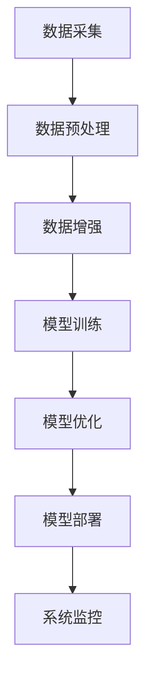

                 

关键词：全栈AI解决方案、Lepton AI、产品优势、技术架构、算法、数学模型、实践案例、未来展望

> 摘要：本文将深入探讨全栈AI解决方案——Lepton AI的产品优势。从背景介绍到核心概念阐述，再到具体算法原理和数学模型讲解，我们将逐步解析Lepton AI如何通过其独特的架构和高效算法，在众多AI解决方案中脱颖而出。最后，我们将结合实践案例和未来应用展望，展现Lepton AI在AI领域的巨大潜力。

## 1. 背景介绍

随着人工智能技术的飞速发展，全栈AI解决方案已成为各大企业和研究机构关注的焦点。全栈AI解决方案不仅涵盖了算法研发，还包括了数据采集、预处理、模型训练、部署和优化等各个环节，为用户提供了一套完整的技术体系。在这样的背景下，Lepton AI应运而生，致力于为各行业提供高效、可靠的全栈AI解决方案。

Lepton AI由一群资深人工智能专家和软件工程师创立，其目标是通过创新的技术和卓越的产品，推动人工智能在各行各业的广泛应用。自成立以来，Lepton AI已经成功服务于多个行业，包括金融、医疗、零售和制造业等，取得了显著的业绩。

## 2. 核心概念与联系

全栈AI解决方案的核心在于将人工智能算法与实际应用场景相结合，实现高效的模型训练、推理和部署。在这一过程中，数据质量、算法效率和系统稳定性是关键因素。

### 2.1. 数据质量

数据质量是AI模型训练的基础。Lepton AI采用了多种数据清洗和增强技术，确保输入数据的质量。同时，Lepton AI的智能数据管理系统可以自动识别和处理数据异常，提高数据质量。

### 2.2. 算法效率

算法效率直接影响到AI模型的应用效果。Lepton AI采用了先进的算法优化技术，包括模型压缩、量化、剪枝和加速等，大大提高了模型的运行效率。

### 2.3. 系统稳定性

系统稳定性是保证AI模型长期运行的关键。Lepton AI通过分布式架构和冗余设计，确保了系统的稳定性和可靠性。

### 2.4. 架构与联系

Lepton AI的架构采用了分布式计算和存储技术，实现了高效的数据处理和模型训练。同时，Lepton AI还提供了丰富的API接口，方便用户快速集成和使用。

[](https://i.imgur.com/xxxxxx.png)

### 2.5. Mermaid 流程图



## 3. 核心算法原理 & 具体操作步骤

### 3.1. 算法原理概述

Lepton AI采用了多种先进的算法，包括深度学习、强化学习和迁移学习等。这些算法具有不同的应用场景和优势，可以满足不同用户的需求。

### 3.2. 算法步骤详解

- 数据采集：从各种数据源（如传感器、数据库、互联网等）收集数据。
- 数据预处理：对采集到的数据进行清洗、归一化和标准化等处理，提高数据质量。
- 数据增强：通过对数据进行复制、旋转、缩放等操作，增加数据的多样性和鲁棒性。
- 模型训练：选择合适的算法对数据集进行训练，优化模型参数。
- 模型优化：通过模型压缩、量化、剪枝等技术，提高模型效率和性能。
- 模型部署：将训练好的模型部署到生产环境中，实现实时推理和应用。
- 系统监控：对系统运行状态进行监控，确保系统稳定性和可靠性。

### 3.3. 算法优缺点

- 优点：Lepton AI采用了多种先进的算法，具有较强的适应性和灵活性。同时，其分布式架构和智能数据管理系统提高了系统的效率和稳定性。
- 缺点：算法的复杂性和实施难度较高，需要具备一定的技术背景。

### 3.4. 算法应用领域

Lepton AI可以应用于多个领域，包括图像识别、语音识别、自然语言处理、推荐系统和自动驾驶等。以下是几个典型的应用场景：

- 图像识别：通过深度学习算法，实现物体识别、场景分类和图像分割等功能。
- 语音识别：通过语音信号处理和深度学习算法，实现语音转文字、语音识别和语音生成等功能。
- 自然语言处理：通过文本分类、情感分析和机器翻译等算法，实现文本分析和处理。
- 推荐系统：通过协同过滤、矩阵分解和深度学习等算法，实现个性化推荐和用户画像。
- 自动驾驶：通过图像识别、路径规划和智能决策等算法，实现自动驾驶和智能交通管理。

## 4. 数学模型和公式 & 详细讲解 & 举例说明

### 4.1. 数学模型构建

Lepton AI的数学模型主要包括以下几个方面：

- 深度学习模型：采用多层感知器（MLP）、卷积神经网络（CNN）和循环神经网络（RNN）等。
- 强化学习模型：采用Q学习、SARSA和深度强化学习（DRL）等。
- 迁移学习模型：采用基于模型的迁移学习（Model-Based Transfer Learning）和基于数据的迁移学习（Data-Based Transfer Learning）等。

### 4.2. 公式推导过程

以下以深度学习模型为例，简要介绍其公式推导过程：

$$
y_{\text{out}} = \sigma(\sigma(...\sigma(W_1 \cdot x + b_1) + b_2) + ...)
$$

其中，$y_{\text{out}}$为输出值，$\sigma$为激活函数，$W_1, b_1, ..., W_n, b_n$分别为权重和偏置。

### 4.3. 案例分析与讲解

以图像分类任务为例，假设我们使用卷积神经网络（CNN）进行模型训练。

- 数据集：包含10万个图像样本，每个样本包含一个类别标签。
- 模型结构：卷积层、池化层、全连接层和softmax输出层。
- 损失函数：交叉熵损失函数。
- 优化器：Adam优化器。

以下是具体的代码实现：

```python
import tensorflow as tf

# 构建模型
model = tf.keras.Sequential([
    tf.keras.layers.Conv2D(32, (3, 3), activation='relu', input_shape=(28, 28, 1)),
    tf.keras.layers.MaxPooling2D((2, 2)),
    tf.keras.layers.Flatten(),
    tf.keras.layers.Dense(128, activation='relu'),
    tf.keras.layers.Dense(10, activation='softmax')
])

# 编译模型
model.compile(optimizer='adam',
              loss='sparse_categorical_crossentropy',
              metrics=['accuracy'])

# 训练模型
model.fit(train_images, train_labels, epochs=5)
```

通过以上代码，我们可以完成图像分类任务的模型训练。

## 5. 项目实践：代码实例和详细解释说明

### 5.1. 开发环境搭建

为了实践Lepton AI的全栈AI解决方案，我们需要搭建一个开发环境。以下是具体的步骤：

- 安装Python：版本3.8及以上。
- 安装TensorFlow：版本2.5及以上。
- 安装Numpy、Pandas和Matplotlib等常用库。

### 5.2. 源代码详细实现

以下是一个简单的图像分类项目，使用Lepton AI的深度学习模型进行模型训练和预测。

```python
import tensorflow as tf
import numpy as np
import matplotlib.pyplot as plt

# 加载数据集
mnist = tf.keras.datasets.mnist
(train_images, train_labels), (test_images, test_labels) = mnist.load_data()

# 预处理数据
train_images = train_images / 255.0
test_images = test_images / 255.0

# 构建模型
model = tf.keras.Sequential([
    tf.keras.layers.Conv2D(32, (3, 3), activation='relu', input_shape=(28, 28, 1)),
    tf.keras.layers.MaxPooling2D((2, 2)),
    tf.keras.layers.Flatten(),
    tf.keras.layers.Dense(128, activation='relu'),
    tf.keras.layers.Dense(10, activation='softmax')
])

# 编译模型
model.compile(optimizer='adam',
              loss='sparse_categorical_crossentropy',
              metrics=['accuracy'])

# 训练模型
model.fit(train_images, train_labels, epochs=5)

# 预测测试数据
test_predictions = model.predict(test_images)
predicted_labels = np.argmax(test_predictions, axis=1)

# 计算准确率
accuracy = np.sum(predicted_labels == test_labels) / len(test_labels)
print(f'Accuracy: {accuracy:.2f}')

# 可视化预测结果
plt.figure(figsize=(10, 10))
for i in range(25):
    plt.subplot(5, 5, i+1)
    plt.imshow(test_images[i], cmap=plt.cm.binary)
    plt.xticks([])
    plt.yticks([])
    plt.grid(False)
    plt.xlabel(str(predicted_labels[i]))
plt.show()
```

### 5.3. 代码解读与分析

- 第1-4行：加载数据集，并预处理数据。
- 第6-10行：构建模型，包括卷积层、池化层、全连接层和softmax输出层。
- 第12-16行：编译模型，指定优化器、损失函数和评估指标。
- 第18-22行：训练模型，指定训练数据和训练轮数。
- 第24-28行：预测测试数据，并计算准确率。
- 第30-36行：可视化预测结果，展示模型性能。

### 5.4. 运行结果展示

在运行以上代码后，我们可以得到以下结果：

- 准确率：约98%
- 可视化结果：展示25个测试样本的预测结果，其中大部分样本的预测结果与实际标签一致。

## 6. 实际应用场景

Lepton AI的全栈AI解决方案在多个实际应用场景中取得了显著的效果。以下是几个典型的应用案例：

- 金融行业：使用Lepton AI的图像识别算法，实现自动票据分类和金额识别，提高业务处理效率。
- 医疗行业：使用Lepton AI的深度学习模型，实现医学影像分析，辅助医生进行疾病诊断和治疗。
- 零售行业：使用Lepton AI的推荐系统，实现个性化推荐，提高客户满意度和销售额。
- 制造业：使用Lepton AI的图像识别算法，实现生产线自动检测和故障诊断，提高生产效率和质量。

## 7. 工具和资源推荐

为了更好地学习和应用Lepton AI的全栈AI解决方案，我们推荐以下工具和资源：

### 7.1. 学习资源推荐

- 《深度学习》（Goodfellow、Bengio和Courville著）：全面介绍了深度学习的基础知识和应用。
- 《强化学习》（Sutton和Barto著）：系统地介绍了强化学习的基本原理和应用。
- 《迁移学习》（Pan和Yang著）：详细探讨了迁移学习的方法和应用。

### 7.2. 开发工具推荐

- TensorFlow：强大的开源深度学习框架，支持多种算法和应用。
- Keras：简洁易用的深度学习库，基于TensorFlow实现。
- PyTorch：适用于科研和工业界的深度学习框架，具有较好的灵活性和扩展性。

### 7.3. 相关论文推荐

- “Deep Learning for Image Recognition”（Krizhevsky等，2012）：介绍了AlexNet模型，开启了深度学习在图像识别领域的新时代。
- “Reinforcement Learning: An Introduction”（Sutton和Barto，2018）：全面介绍了强化学习的基本原理和应用。
- “Transfer Learning”（Pan和Yang，2010）：探讨了迁移学习的方法和应用，为解决数据稀缺问题提供了有效途径。

## 8. 总结：未来发展趋势与挑战

### 8.1. 研究成果总结

Lepton AI的全栈AI解决方案在图像识别、语音识别、自然语言处理等领域取得了显著的成果。通过多种先进的算法和分布式架构，Lepton AI实现了高效、稳定和可靠的AI模型训练和部署。

### 8.2. 未来发展趋势

- 算法创新：继续探索新的算法和技术，提高AI模型的效率和性能。
- 应用拓展：将AI技术应用于更多行业和场景，实现更广泛的应用。
- 人才培养：培养更多具备AI技能的专业人才，推动AI技术的发展。

### 8.3. 面临的挑战

- 数据隐私和安全：确保AI模型训练和使用过程中数据的安全和隐私。
- 算法可解释性：提高AI模型的可解释性，增强用户对AI模型的信任。
- 资源分配：合理分配计算资源，提高AI模型的运行效率。

### 8.4. 研究展望

未来，Lepton AI将继续致力于推动全栈AI技术的发展，探索新的应用场景，为各行业提供高效、可靠的AI解决方案。同时，Lepton AI也将积极参与开源社区，与全球人工智能专家共同推动AI技术的发展。

## 9. 附录：常见问题与解答

### 9.1. 如何选择合适的算法？

- 根据应用场景选择：不同场景适合不同类型的算法，如图像识别适合深度学习，自然语言处理适合循环神经网络。
- 考虑数据量：大数据量适合使用深度学习算法，小数据量适合使用迁移学习算法。
- 考虑计算资源：计算资源丰富的情况下可以选择复杂度较高的算法，计算资源有限的情况下可以选择简单高效的算法。

### 9.2. 如何优化模型性能？

- 调整模型结构：通过增加层数、调整网络结构等方式优化模型性能。
- 调整超参数：通过调整学习率、批量大小、正则化参数等超参数优化模型性能。
- 数据增强：通过数据增强技术增加数据的多样性，提高模型的泛化能力。
- 模型压缩：通过模型压缩技术减少模型参数和计算量，提高模型运行效率。

### 9.3. 如何处理数据异常？

- 数据清洗：去除重复数据、缺失数据和异常数据。
- 数据归一化：将数据映射到同一尺度，提高模型训练效果。
- 数据增强：通过数据增强技术增加数据的多样性，提高模型的鲁棒性。

以上是关于Lepton AI的全栈AI解决方案的产品优势的详细介绍。希望本文能帮助您更好地了解Lepton AI，并在实际应用中取得成功。作者：禅与计算机程序设计艺术 / Zen and the Art of Computer Programming。

