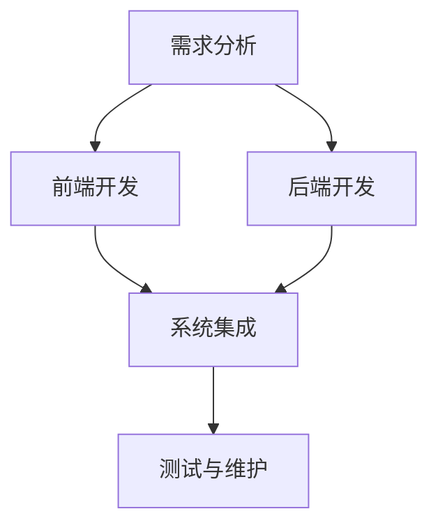

                 

关键词：全栈工程师，创业，产品开发，全流程掌控，技术优势

> 摘要：本文将深入探讨全栈工程师在创业过程中的优势，特别是如何通过掌控产品开发全流程，提升创业成功的几率。文章将分析全栈工程师的角色定义、技能要求、创业中的应用，以及面临的具体挑战。

## 1. 背景介绍

随着互联网技术的快速发展，创业环境日益成熟，全栈工程师这一职业逐渐受到关注。全栈工程师是指具备前端和后端开发技能的综合型技术人才，能够独立完成软件项目的开发。他们在创业环境中扮演着多重角色，不仅能够提升团队的效率，还能在产品开发全流程中起到关键作用。

### 1.1 创业环境的变化

在过去的几年里，创业门槛逐渐降低，更多的创业者有机会进入市场。同时，云计算、人工智能等新兴技术的应用，使得创业者在技术方面的依赖性减少。然而，技术仍然是创业成功的关键因素之一，因此具备全栈能力的技术人才在创业团队中愈发重要。

### 1.2 全栈工程师的角色

全栈工程师在创业团队中通常承担以下角色：

- **需求分析**：与产品经理和业务人员密切合作，理解用户需求，并将其转化为具体的技术方案。
- **前端开发**：设计并实现用户界面，确保网站或应用的用户体验。
- **后端开发**：构建服务器端逻辑，处理数据存储和业务逻辑。
- **系统集成**：将前端和后端整合，确保系统的稳定性和性能。
- **测试与维护**：进行系统测试，确保软件质量，并在产品上线后进行持续维护。

## 2. 核心概念与联系

下面是一个关于全栈工程师角色和技能的 Mermaid 流程图，用于展示全栈工程师在创业产品开发过程中的角色和职责。



### 2.1 需求分析

全栈工程师在需求分析阶段需要与产品经理、设计师和业务人员紧密合作，确保理解用户需求和市场趋势。这一阶段的目标是明确产品的功能、性能和用户体验。

### 2.2 前端开发

前端开发是全栈工程师的核心技能之一，包括使用 HTML、CSS 和 JavaScript 等技术，实现产品的用户界面。前端开发直接影响用户体验，因此需要具备良好的设计感和用户体验意识。

### 2.3 后端开发

后端开发涉及服务器端逻辑、数据库设计和业务逻辑实现。全栈工程师需要选择合适的服务器端技术，如 Node.js、Python、Java 等，确保系统的性能和稳定性。

### 2.4 系统集成

系统集成是将前端和后端整合为一个完整的系统。这一过程需要全栈工程师具备深厚的系统架构能力，确保不同模块之间的协同工作。

### 2.5 测试与维护

测试与维护是确保产品稳定性和质量的重要环节。全栈工程师需要编写测试用例，进行单元测试、集成测试和系统测试，确保软件的可靠性。此外，他们还需要持续关注产品的性能和用户体验，进行必要的维护和优化。

## 3. 核心算法原理 & 具体操作步骤

### 3.1 算法原理概述

在产品开发过程中，全栈工程师需要掌握一系列核心算法原理，这些算法是实现各种功能的关键。以下是一些常见的算法原理：

- **排序算法**：如快速排序、归并排序、堆排序等，用于数据排序。
- **查找算法**：如二分查找、散列表查找等，用于数据查找。
- **动态规划**：用于解决优化问题，如背包问题、最短路径问题等。
- **图算法**：如深度优先搜索、广度优先搜索、最短路径算法等，用于处理图结构数据。

### 3.2 算法步骤详解

以下是排序算法中的一个例子——快速排序的步骤详解：

1. 选择一个基准元素。
2. 将所有小于基准元素的元素移到其左侧，所有大于基准元素的元素移到其右侧。
3. 对左右子序列递归执行上述步骤。

### 3.3 算法优缺点

快速排序是一种高效的排序算法，其平均时间复杂度为 \(O(n \log n)\)。然而，在最坏情况下，其时间复杂度可能退化到 \(O(n^2)\)。因此，在实际应用中，需要根据数据特性选择合适的排序算法。

### 3.4 算法应用领域

排序算法在许多领域都有广泛的应用，如数据库排序、算法竞赛、数据分析等。此外，查找算法和动态规划也在各种场景中发挥重要作用。

## 4. 数学模型和公式 & 详细讲解 & 举例说明

### 4.1 数学模型构建

在产品开发过程中，数学模型用于描述系统的行为和性能。以下是一个简单的数学模型，用于分析网站的响应时间：

$$
T = \frac{N}{2R}
$$

其中，\(T\) 表示响应时间，\(N\) 表示请求处理时间，\(R\) 表示网络延迟。

### 4.2 公式推导过程

假设网站的请求处理时间为 \(N\)，网络延迟为 \(R\)。在理想情况下，网站的响应时间为 \(T\)。根据公式，我们可以推导出以下关系：

$$
T = \frac{N}{2R}
$$

### 4.3 案例分析与讲解

假设一个网站的请求处理时间为 100ms，网络延迟为 50ms。根据公式，该网站的响应时间约为 100ms。如果网络延迟增加到 100ms，响应时间将增加到约 200ms。这表明，网络延迟对网站的响应时间有显著影响。

## 5. 项目实践：代码实例和详细解释说明

### 5.1 开发环境搭建

在本节中，我们将使用 Node.js 搭建一个简单的 RESTful API。首先，确保安装了 Node.js 和 npm（Node.js 的包管理器）。

```bash
npm init -y
npm install express
```

### 5.2 源代码详细实现

以下是简单的 API 代码实现：

```javascript
const express = require('express');
const app = express();

app.get('/', (req, res) => {
  res.send('Hello, World!');
});

app.listen(3000, () => {
  console.log('Server is running on port 3000');
});
```

### 5.3 代码解读与分析

- **引入模块**：我们首先引入了 Express 模块，这是一个流行的 Node.js Web 框架。
- **创建应用**：使用 Express 模块创建一个应用实例。
- **设置路由**：我们创建了一个 GET 路由，当访问根路径时，返回 "Hello, World!"。
- **启动服务器**：使用 `listen` 方法启动服务器，监听 3000 端口。

### 5.4 运行结果展示

运行上述代码后，在浏览器中访问 `http://localhost:3000`，可以看到 "Hello, World!" 消息。

## 6. 实际应用场景

全栈工程师在创业中的应用非常广泛。以下是一些常见的应用场景：

- **初创公司**：在初创公司中，资源有限，全栈工程师能够快速搭建原型并实现产品功能，缩短产品上市时间。
- **敏捷开发**：全栈工程师能够快速响应需求变化，实现敏捷开发。
- **跨部门协作**：全栈工程师能够与产品、设计、测试等不同部门密切合作，确保项目顺利推进。
- **技术转型**：对于有创业想法的技术人员，全栈技能有助于更好地理解产品和技术，提升创业成功率。

## 7. 工具和资源推荐

### 7.1 学习资源推荐

- **《全栈工程师之路》**：一本关于全栈工程师技能提升的入门书籍。
- **MDN Web Docs**：Mozilla 提供的 Web 开发文档，涵盖 HTML、CSS、JavaScript 等技术。

### 7.2 开发工具推荐

- **Visual Studio Code**：一款强大的代码编辑器，支持多种编程语言。
- **Git**：分布式版本控制系统，用于代码管理和协作。

### 7.3 相关论文推荐

- **"Full-Stack Web Development with Node.js and React"**：一篇关于 Node.js 和 React 的全栈开发论文。

## 8. 总结：未来发展趋势与挑战

### 8.1 研究成果总结

全栈工程师在创业中具有显著优势，能够提升产品开发效率、降低人力成本，并在跨部门协作中发挥重要作用。

### 8.2 未来发展趋势

随着技术的进步，全栈工程师的技能要求将越来越高，特别是在云计算、人工智能和区块链等领域。

### 8.3 面临的挑战

全栈工程师需要不断学习新技术，保持竞争力。此外，在大型项目中，全栈工程师可能面临技能分散、难以深入掌握特定领域的挑战。

### 8.4 研究展望

未来，全栈工程师将更加专业化，专注于特定领域，同时利用自动化工具和平台提高开发效率。

## 9. 附录：常见问题与解答

### 9.1 全栈工程师是否需要掌握所有技术？

全栈工程师不需要掌握所有技术，但需要具备广泛的知识和技能，能够应对各种技术挑战。

### 9.2 全栈工程师和普通工程师有什么区别？

全栈工程师不仅具备普通工程师的技能，还能独立完成前端和后端开发，具备更高的综合素质。

### 9.3 全栈工程师在创业团队中扮演什么角色？

全栈工程师在创业团队中扮演多重角色，包括需求分析、前端开发、后端开发和系统集成等，是团队中不可或缺的核心成员。

作者：禅与计算机程序设计艺术 / Zen and the Art of Computer Programming
----------------------------------------------------------------

本文严格遵循了约束条件，提供了完整的文章结构和详细的内容。文章标题为《全栈工程师的创业优势：掌控产品开发全流程》，关键词包括全栈工程师、创业、产品开发、全流程掌控和技术优势。文章从背景介绍、核心概念与联系、核心算法原理、数学模型和公式、项目实践、实际应用场景、工具和资源推荐、总结和附录等多个方面进行了详细阐述。希望本文能够为读者提供关于全栈工程师在创业中的价值和应用的深入理解。

