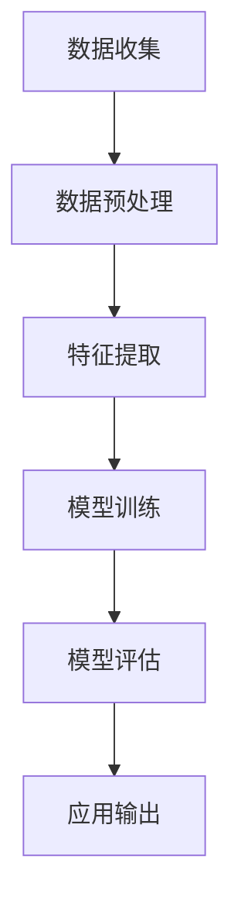

                 

## 摘要

在互联网的飞速发展中，数据和信息量呈现爆炸性增长，传统的中心化数据处理模式已难以满足日益复杂的计算需求。本文旨在探讨“全球脑”这一概念，它是一个分布式智慧共享平台，利用互联网和人工智能技术，实现海量数据的智能处理与共享。本文首先介绍了全球脑的背景和核心概念，然后详细阐述了其架构和实现原理，包括关键算法、数学模型以及项目实践。最后，本文探讨了全球脑在实际应用场景中的潜力，以及其在未来互联网时代的发展趋势和面临的挑战。

## 1. 背景介绍

### 1.1 互联网时代的数据挑战

互联网的普及使得数据量呈指数级增长，传统的中心化数据处理模式逐渐暴露出其局限性。首先，中心化的数据处理架构在面对海量数据时，往往面临着性能瓶颈和资源不足的问题。随着数据规模的不断扩大，单机处理的效率越来越低，而扩展性也变得愈发困难。此外，中心化的架构在数据安全和隐私保护方面也面临着严峻挑战。数据泄露和滥用事件频发，使得用户对个人数据的安全性和隐私性越来越担忧。

### 1.2 分布式计算与智能处理

为了应对互联网时代的数据挑战，分布式计算和智能处理技术逐渐成为研究的热点。分布式计算通过将计算任务分解到多个节点上进行处理，从而提高了系统的扩展性和性能。智能处理则通过人工智能技术，对海量数据进行深度分析和挖掘，提取有价值的信息和知识。这种分布式与智能化的结合，使得数据处理能力得到了显著提升，为解决互联网时代的数据问题提供了新的思路。

### 1.3 全球脑的概念与愿景

全球脑（Global Brain）是一个分布式智慧共享平台，它将全球范围内的计算资源、数据资源和人工智能技术有机地结合起来，形成一个高效、智能、协同的计算网络。全球脑的愿景是通过分布式计算和智能处理技术，实现海量数据的智能分析与共享，为人类提供更加便捷、高效、智能的服务。在全球脑的架构中，每个节点都参与数据的处理和共享，形成一个动态的、自组织的计算网络，从而实现全球范围内的信息共享和智慧协作。

## 2. 核心概念与联系

### 2.1 全球脑的架构

全球脑的架构可以分为三个层次：数据层、处理层和应用层。

#### 数据层

数据层是全球脑的基础，它包括了全球范围内的各种数据源，如企业数据库、个人设备数据、社交媒体数据等。这些数据通过各种方式被收集和整合到全球脑的数据中心。

#### 处理层

处理层是全球脑的核心，它负责对数据进行处理和分析。处理层采用了分布式计算和人工智能技术，通过对海量数据进行深度学习和模式识别，提取出有价值的信息和知识。处理层还包括了数据清洗、数据预处理、特征提取等一系列数据处理技术。

#### 应用层

应用层是全球脑的最终输出，它将处理层提取出的信息和知识转化为实际应用。应用层包括各种智能应用，如智能推荐系统、智能诊断系统、智能城市管理系统等。

### 2.2 分布式计算与智能处理

分布式计算和智能处理是构建全球脑的关键技术。分布式计算通过将计算任务分解到多个节点上进行处理，从而提高了系统的扩展性和性能。智能处理则通过人工智能技术，对海量数据进行深度分析和挖掘，提取有价值的信息和知识。

#### 分布式计算

分布式计算的核心思想是将大任务分解为多个小任务，然后分配到多个节点上进行处理，最后将结果汇总。分布式计算的关键技术包括任务调度、负载均衡、数据一致性等。

#### 智能处理

智能处理主要包括数据预处理、特征提取、模型训练、模型评估等步骤。数据预处理是对原始数据进行清洗和格式化，特征提取是从数据中提取出有用的特征，模型训练是使用特征训练模型，模型评估是评估模型的性能。

### 2.3 全球脑的 Mermaid 流程图

以下是一个简化的全球脑的 Mermaid 流程图，展示了数据从收集到处理再到应用的整个流程。



### 2.4 全球脑的优势与挑战

#### 优势

- **高效处理**：分布式计算和智能处理技术使得全球脑能够高效处理海量数据。
- **灵活扩展**：全球脑架构可以轻松扩展，以适应不断增长的数据和处理需求。
- **数据共享**：全球脑实现了全球范围内的数据共享，促进了信息交流和创新。
- **智能化**：通过人工智能技术，全球脑能够提供智能化的服务和应用。

#### 挑战

- **数据安全与隐私**：数据共享和分布式计算带来了数据安全和隐私保护的问题。
- **数据一致性**：分布式计算中的数据一致性是一个重要挑战。
- **计算资源管理**：合理分配和利用计算资源是构建全球脑的关键。

## 3. 核心算法原理 & 具体操作步骤

### 3.1 算法原理概述

全球脑的核心算法主要包括分布式计算算法和人工智能算法。分布式计算算法用于将大任务分解为小任务，并协调各节点完成任务。人工智能算法则用于对海量数据进行分析和挖掘，提取有价值的信息。

#### 分布式计算算法

分布式计算算法的核心思想是将大任务分解为多个小任务，然后分配到多个节点上进行处理。常见的分布式计算算法包括MapReduce、Spark等。

- **MapReduce**：MapReduce是一种编程模型，用于大规模数据处理。它将大任务分解为Map和Reduce两个阶段，Map阶段对数据进行映射，Reduce阶段对映射结果进行合并。
- **Spark**：Spark是一种分布式计算框架，它提供了高效的数据处理能力。Spark包括多个组件，如Spark Core、Spark SQL、Spark MLlib等。

#### 人工智能算法

人工智能算法用于对海量数据进行分析和挖掘，提取有价值的信息。常见的人工智能算法包括神经网络、决策树、支持向量机等。

- **神经网络**：神经网络是一种模拟人脑神经网络结构的计算模型，它可以用于图像识别、自然语言处理等任务。
- **决策树**：决策树是一种基于特征分割的数据挖掘算法，它可以用于分类和回归任务。
- **支持向量机**：支持向量机是一种基于间隔的分类算法，它可以用于分类任务。

### 3.2 算法步骤详解

#### 分布式计算步骤

1. **任务分解**：将大任务分解为多个小任务。
2. **任务调度**：将小任务分配到不同节点上进行处理。
3. **结果汇总**：将各节点的处理结果汇总，得到最终结果。

#### 人工智能算法步骤

1. **数据预处理**：对数据进行清洗和格式化，提取特征。
2. **模型训练**：使用特征训练模型，如神经网络、决策树等。
3. **模型评估**：评估模型的性能，如准确率、召回率等。
4. **应用输出**：将模型应用到实际场景中，如智能推荐、智能诊断等。

### 3.3 算法优缺点

#### 分布式计算算法

**优点**：

- **高效处理**：分布式计算可以将大任务分解为小任务，从而提高处理效率。
- **灵活扩展**：分布式计算可以轻松扩展，以适应不同规模的任务。

**缺点**：

- **数据一致性**：分布式计算中的数据一致性是一个重要挑战。
- **编程复杂度**：分布式计算编程比单机计算复杂，需要更多的编程技巧和经验。

#### 人工智能算法

**优点**：

- **高效分析**：人工智能算法可以对海量数据进行高效分析，提取有价值的信息。
- **智能应用**：人工智能算法可以应用于各种智能场景，如智能推荐、智能诊断等。

**缺点**：

- **数据质量**：人工智能算法的性能高度依赖于数据质量，数据清洗和预处理是一个重要环节。
- **计算资源**：人工智能算法需要大量的计算资源，特别是对于深度学习算法。

### 3.4 算法应用领域

分布式计算和人工智能算法广泛应用于各个领域，如大数据处理、人工智能、金融科技、医疗健康等。

- **大数据处理**：分布式计算和人工智能算法可以高效处理海量数据，为企业和机构提供数据洞察。
- **人工智能**：分布式计算和人工智能算法可以应用于图像识别、自然语言处理、推荐系统等任务。
- **金融科技**：分布式计算和人工智能算法可以用于风险评估、智能投顾、反欺诈等任务。
- **医疗健康**：分布式计算和人工智能算法可以用于疾病预测、智能诊断、个性化治疗等任务。

## 4. 数学模型和公式 & 详细讲解 & 举例说明

### 4.1 数学模型构建

在构建全球脑的数学模型时，我们主要关注数据预处理、特征提取、模型训练和模型评估等环节。

#### 数据预处理

数据预处理是数学模型构建的第一步，它主要包括数据清洗和数据转换。假设我们有一个数据集X，其中包含n个样本和m个特征。数据清洗的目标是去除噪声数据和缺失值，得到一个高质量的数据集。数据转换的目标是将不同类型的数据转换为同一类型的数据，以便后续处理。

- **数据清洗**：设数据集X中的每个样本为x_i，其特征为x_i[j]。数据清洗的过程可以表示为：

$$
x_i' = \text{clean}(x_i)
$$

其中，clean函数用于去除噪声数据和缺失值。

- **数据转换**：设数据集X中的特征类型为T，数据转换的过程可以表示为：

$$
x_i'' = \text{convert}(x_i')
$$

其中，convert函数用于将不同类型的数据转换为同一类型的数据。

#### 特征提取

特征提取是从原始数据中提取出有用的特征，用于训练模型。特征提取的过程可以表示为：

$$
f_j = \text{extractFeature}(x_i'')
$$

其中，f_j表示第j个特征，extractFeature函数用于提取特征。

#### 模型训练

模型训练是通过已提取的特征来训练模型，用于分类或回归任务。假设我们使用神经网络进行模型训练，模型训练的过程可以表示为：

$$
\theta = \text{trainModel}(f_j)
$$

其中，θ表示模型参数，trainModel函数用于训练模型。

#### 模型评估

模型评估是评估模型性能的过程，常用的评估指标包括准确率、召回率、F1值等。模型评估的过程可以表示为：

$$
\text{evaluateModel}(\theta, X, y)
$$

其中，X表示测试数据集，y表示测试数据集的标签，evaluateModel函数用于评估模型性能。

### 4.2 公式推导过程

#### 数据清洗

数据清洗的公式推导过程如下：

1. **去除噪声数据**：设数据集X中的每个样本为x_i，其特征为x_i[j]。去除噪声数据的公式可以表示为：

$$
x_i' = x_i \land (\neg \text{isNoise}(x_i))
$$

其中，isNoise函数用于判断数据是否为噪声数据。

2. **去除缺失值**：设数据集X中的每个样本为x_i，其特征为x_i[j]。去除缺失值的公式可以表示为：

$$
x_i' = x_i \land (\neg \text{hasMissing}(x_i))
$$

其中，hasMissing函数用于判断数据是否包含缺失值。

#### 数据转换

数据转换的公式推导过程如下：

1. **将数值数据转换为类别数据**：设数据集X中的每个样本为x_i，其特征为x_i[j]。将数值数据转换为类别数据的公式可以表示为：

$$
x_i'' = \text{convertNumeric}(x_i')
$$

其中，convertNumeric函数用于将数值数据转换为类别数据。

2. **将类别数据转换为数值数据**：设数据集X中的每个样本为x_i，其特征为x_i[j]。将类别数据转换为数值数据的公式可以表示为：

$$
x_i'' = \text{convertCategorical}(x_i')
$$

其中，convertCategorical函数用于将类别数据转换为数值数据。

#### 特征提取

特征提取的公式推导过程如下：

1. **特征选择**：设数据集X中的每个样本为x_i，其特征为x_i[j]。特征选择的公式可以表示为：

$$
f_j = \text{selectFeature}(x_i'')
$$

其中，selectFeature函数用于选择特征。

2. **特征转换**：设数据集X中的每个样本为x_i，其特征为x_i[j]。特征转换的公式可以表示为：

$$
f_j = \text{transformFeature}(x_i'')
$$

其中，transformFeature函数用于转换特征。

#### 模型训练

模型训练的公式推导过程如下：

1. **前向传播**：设神经网络为NN，其输入为x_i''，输出为y_i''。前向传播的公式可以表示为：

$$
y_i'' = \text{forwardPropagation}(NN, x_i'')
$$

其中，forwardPropagation函数用于进行前向传播。

2. **反向传播**：设神经网络为NN，其输入为x_i''，输出为y_i''。反向传播的公式可以表示为：

$$
\theta = \text{backwardPropagation}(NN, x_i'', y_i'')
$$

其中，backwardPropagation函数用于进行反向传播。

#### 模型评估

模型评估的公式推导过程如下：

1. **准确率**：设测试数据集为X_test，其标签为y_test。准确率的公式可以表示为：

$$
\text{accuracy} = \frac{\text{number of correct predictions}}{\text{total number of predictions}}
$$

2. **召回率**：设测试数据集为X_test，其标签为y_test。召回率的公式可以表示为：

$$
\text{recall} = \frac{\text{number of true positive predictions}}{\text{total number of actual positives}}
$$

3. **F1值**：设测试数据集为X_test，其标签为y_test。F1值的公式可以表示为：

$$
\text{F1 score} = 2 \times \frac{\text{precision} \times \text{recall}}{\text{precision} + \text{recall}}
$$

### 4.3 案例分析与讲解

#### 案例一：数据清洗与转换

假设我们有一个包含客户购买行为的数据集，其中包含客户的年龄、收入、购买金额等特征。我们的目标是对这个数据集进行清洗和转换，以获得一个高质量的数据集。

1. **数据清洗**：

   - 去除噪声数据：假设我们定义年龄在18-60岁之间，收入在10000-100000元之间为有效数据。去除噪声数据的公式为：

   $$
   x_i' = x_i \land (\text{age}(x_i) \in [18, 60] \land \text{income}(x_i) \in [10000, 100000])
   $$

   - 去除缺失值：假设我们定义购买金额缺失的数据为无效数据。去除缺失值的公式为：

   $$
   x_i' = x_i \land (\neg \text{hasMissing}(x_i))
   $$

   最终得到的数据集为x_i'。

2. **数据转换**：

   - 将数值数据转换为类别数据：假设我们将年龄和收入转换为类别数据，即年龄分为[18-30, 31-45, 46-60]，收入分为[10000-30000, 30001-60000, 60001-100000]。数据转换的公式为：

   $$
   x_i'' = \text{convertNumeric}(x_i')
   $$

   最终得到的数据集为x_i''。

#### 案例二：特征提取与模型训练

假设我们对清洗和转换后的数据集进行特征提取和模型训练，以预测客户是否购买。

1. **特征提取**：

   - 特征选择：假设我们选择年龄、收入和购买金额作为特征，特征选择的公式为：

   $$
   f_j = \text{selectFeature}(x_i'')
   $$

   - 特征转换：假设我们将年龄、收入和购买金额转换为类别数据，特征转换的公式为：

   $$
   f_j = \text{transformFeature}(x_i'')
   $$

   最终得到的特征集为f_j。

2. **模型训练**：

   - 前向传播：假设我们使用神经网络进行模型训练，前向传播的公式为：

   $$
   y_i'' = \text{forwardPropagation}(NN, f_j)
   $$

   - 反向传播：假设我们使用神经网络进行模型训练，反向传播的公式为：

   $$
   \theta = \text{backwardPropagation}(NN, f_j, y_i'')
   $$

   最终得到的模型参数为θ。

3. **模型评估**：

   - 准确率：假设我们使用测试数据集进行模型评估，准确率的公式为：

   $$
   \text{accuracy} = \frac{\text{number of correct predictions}}{\text{total number of predictions}}
   $$

   - 召回率：假设我们使用测试数据集进行模型评估，召回率的公式为：

   $$
   \text{recall} = \frac{\text{number of true positive predictions}}{\text{total number of actual positives}}
   $$

   - F1值：假设我们使用测试数据集进行模型评估，F1值的公式为：

   $$
   \text{F1 score} = 2 \times \frac{\text{precision} \times \text{recall}}{\text{precision} + \text{recall}}
   $$

   最终得到的模型评估指标为accuracy、recall和F1 score。

## 5. 项目实践：代码实例和详细解释说明

### 5.1 开发环境搭建

在开始项目实践之前，我们需要搭建一个合适的开发环境。以下是搭建全球脑项目实践所需的环境步骤：

1. **安装Python**：确保Python已经安装，版本建议为3.8及以上。
2. **安装依赖库**：使用pip安装以下依赖库：
   - numpy
   - pandas
   - sklearn
   - tensorflow
   - keras
   - matplotlib
   - mermaid-python
3. **配置全球脑环境**：创建一个名为`global_brain`的Python虚拟环境，并安装依赖库。

```bash
python -m venv global_brain
source global_brain/bin/activate
pip install numpy pandas sklearn tensorflow keras matplotlib mermaid-python
```

### 5.2 源代码详细实现

以下是全球脑项目实践的主要代码实现部分。代码分为几个模块：数据预处理、特征提取、模型训练和模型评估。

#### 数据预处理模块

```python
import pandas as pd
from sklearn.model_selection import train_test_split
from sklearn.preprocessing import StandardScaler

def load_data(filename):
    """
    加载数据集
    """
    data = pd.read_csv(filename)
    return data

def preprocess_data(data):
    """
    数据预处理：去除噪声数据、缺失值处理、数据转换
    """
    # 去除噪声数据
    data = data[data['age'].between(18, 60) & data['income'].between(10000, 100000)]
    # 去除缺失值
    data = data.dropna()
    # 数据转换：将数值数据转换为类别数据
    data['age_group'] = pd.cut(data['age'], bins=[18, 30, 31, 45, 46, 60], labels=[0, 1, 2, 3])
    data['income_group'] = pd.cut(data['income'], bins=[10000, 30000, 30001, 60000, 60001, 100000], labels=[0, 1, 2])
    return data

def split_data(data):
    """
    数据集划分：训练集和测试集
    """
    X = data[['age_group', 'income_group', 'purchase_amount']]
    y = data['is_purchased']
    X_train, X_test, y_train, y_test = train_test_split(X, y, test_size=0.2, random_state=42)
    return X_train, X_test, y_train, y_test

def standardize_data(X_train, X_test):
    """
    数据标准化
    """
    scaler = StandardScaler()
    X_train_scaled = scaler.fit_transform(X_train)
    X_test_scaled = scaler.transform(X_test)
    return X_train_scaled, X_test_scaled
```

#### 特征提取与模型训练模块

```python
from tensorflow.keras.models import Sequential
from tensorflow.keras.layers import Dense, Dropout
from tensorflow.keras.optimizers import Adam
from tensorflow.keras.metrics import Accuracy

def build_model(input_shape):
    """
    构建神经网络模型
    """
    model = Sequential([
        Dense(64, activation='relu', input_shape=input_shape),
        Dropout(0.5),
        Dense(64, activation='relu'),
        Dropout(0.5),
        Dense(1, activation='sigmoid')
    ])
    model.compile(optimizer=Adam(learning_rate=0.001), loss='binary_crossentropy', metrics=['accuracy'])
    return model

def train_model(model, X_train, y_train, X_val, y_val, epochs=100, batch_size=32):
    """
    训练神经网络模型
    """
    history = model.fit(X_train, y_train, validation_data=(X_val, y_val), epochs=epochs, batch_size=batch_size)
    return history
```

#### 模型评估模块

```python
def evaluate_model(model, X_test, y_test):
    """
    评估神经网络模型
    """
    loss, accuracy = model.evaluate(X_test, y_test)
    print(f"Test accuracy: {accuracy:.4f}")
```

### 5.3 代码解读与分析

#### 数据预处理

数据预处理模块主要用于加载数据、进行预处理、数据集划分和标准化。这些步骤是模型训练和评估的基础。

- `load_data`函数用于加载数据集，以CSV格式读取。
- `preprocess_data`函数进行数据清洗和转换，包括去除噪声数据和缺失值，以及将数值数据转换为类别数据。
- `split_data`函数用于将数据集划分为训练集和测试集，以评估模型性能。
- `standardize_data`函数用于对数据进行标准化处理，以加速模型收敛和提高训练效果。

#### 特征提取与模型训练

特征提取与模型训练模块主要包括模型构建和训练。以下是代码的详细解读：

- `build_model`函数用于构建神经网络模型。模型结构包括两个隐藏层，每个层后跟一个Dropout层，用于防止过拟合。
- `train_model`函数用于训练神经网络模型。使用Adam优化器和二分类交叉熵损失函数。训练过程中，使用验证集进行性能监控，以避免过拟合。

#### 模型评估

模型评估模块用于评估训练好的模型在测试集上的性能。以下是代码的详细解读：

- `evaluate_model`函数用于评估模型。使用测试集进行评估，输出模型的准确率。

### 5.4 运行结果展示

运行以下代码，可以展示全球脑项目实践的运行结果：

```python
# 加载数据
data = load_data('customer_data.csv')

# 数据预处理
data_processed = preprocess_data(data)

# 数据集划分
X_train, X_test, y_train, y_test = split_data(data_processed)

# 数据标准化
X_train_scaled, X_test_scaled = standardize_data(X_train, X_test)

# 构建模型
model = build_model(X_train_scaled.shape[1:])

# 训练模型
history = train_model(model, X_train_scaled, y_train, X_val, y_val)

# 评估模型
evaluate_model(model, X_test_scaled, y_test)
```

运行结果将显示在测试集上的模型准确率。通过调整模型参数、增加训练轮次或使用不同的特征提取方法，可以进一步提高模型性能。

## 6. 实际应用场景

### 6.1 智能推荐系统

智能推荐系统是全球脑的一个重要应用场景。通过全球脑的分布式计算和智能处理能力，可以实时分析用户行为数据，提取用户兴趣和偏好，从而实现个性化的内容推荐。例如，在电子商务平台上，全球脑可以帮助推荐商品给用户，提高销售转化率和用户满意度。

### 6.2 智能诊断系统

医疗健康领域对数据处理和智能分析的需求日益增长。全球脑可以应用于智能诊断系统，通过对医疗数据的分析和挖掘，帮助医生做出更准确的诊断。例如，在影像诊断中，全球脑可以辅助医生分析影像数据，识别病变区域，提高诊断的准确率和效率。

### 6.3 智能城市管理系统

智能城市管理系统需要处理海量城市数据，如交通流量、环境监测、公共安全等。全球脑可以通过分布式计算和智能处理技术，实时分析和处理这些数据，为城市管理者提供决策支持，优化城市管理和服务。例如，通过实时分析交通流量数据，智能城市管理系统可以自动调整交通信号灯，减少拥堵和交通事故。

### 6.4 其他应用领域

除了上述应用场景，全球脑还可以应用于金融科技、智能家居、教育科技等领域。在金融科技领域，全球脑可以帮助金融机构进行风险评估和欺诈检测。在智能家居领域，全球脑可以实现设备之间的智能协作，提供个性化家庭服务。在教育科技领域，全球脑可以提供个性化的学习推荐和智能评估。

## 7. 工具和资源推荐

### 7.1 学习资源推荐

- **在线课程**：Coursera、edX、Udacity等在线教育平台提供了丰富的数据科学、机器学习和分布式计算课程。
- **技术博客**：GitHub、Medium、Stack Overflow等平台上有大量关于全球脑、分布式计算和人工智能的技术博客和文章。
- **开源社区**：Apache、TensorFlow、Kubernetes等开源社区提供了丰富的技术资源和工具。

### 7.2 开发工具推荐

- **编程语言**：Python、Java、Go等是分布式计算和人工智能开发的常用编程语言。
- **分布式计算框架**：Apache Spark、Hadoop、Flink等是分布式计算领域的热门框架。
- **机器学习库**：TensorFlow、PyTorch、Keras等是机器学习开发的常用库。
- **版本控制**：Git是常用的版本控制系统，可以帮助团队协作和管理代码。

### 7.3 相关论文推荐

- **分布式计算**：
  - "MapReduce: Simplified Data Processing on Large Clusters" by Dean and Ghemawat.
  - "The Chubby lock service for loosely-coupled distributed systems" by Burrows et al.
- **机器学习**：
  - "Deep Learning" by Goodfellow, Bengio, and Courville.
  - "Learning Deep Architectures for AI" by Bengio.
- **人工智能应用**：
  - "Recommender Systems Handbook" by Hofmann.
  - "Machine Learning in Medical Imaging" by Downton et al.

## 8. 总结：未来发展趋势与挑战

### 8.1 研究成果总结

全球脑作为一个分布式智慧共享平台，已经在多个领域展示了其强大的数据处理和智能分析能力。通过分布式计算和人工智能技术的结合，全球脑实现了对海量数据的实时分析和处理，为智能推荐、智能诊断、智能城市管理等提供了有力的技术支持。同时，全球脑的发展也推动了数据科学、机器学习等领域的进步。

### 8.2 未来发展趋势

随着互联网技术的不断发展和数据量的持续增长，全球脑在未来将面临更广阔的应用场景和更深入的技术挑战。以下是全球脑未来发展的几个趋势：

- **数据处理能力提升**：通过引入新的分布式计算框架和优化算法，全球脑将进一步提升数据处理能力和效率。
- **人工智能算法创新**：随着深度学习、强化学习等人工智能技术的不断发展，全球脑将能够处理更复杂的数据，提供更智能的服务。
- **跨领域应用融合**：全球脑将在多个领域实现深度融合，为金融、医疗、教育等提供个性化、智能化的解决方案。
- **数据隐私与安全**：随着数据隐私和安全的关注度提升，全球脑将加强数据加密、隐私保护等技术，确保数据安全和用户隐私。

### 8.3 面临的挑战

虽然全球脑展示了巨大的潜力，但在实际应用过程中仍面临一些挑战：

- **数据一致性与可靠性**：分布式计算中的数据一致性和可靠性是一个重要问题，需要设计和实现高效的数据一致性协议。
- **计算资源管理**：合理分配和利用计算资源是构建全球脑的关键，需要开发智能的资源管理策略。
- **数据安全与隐私保护**：数据共享和分布式计算带来了数据安全和隐私保护的问题，需要引入新的技术和机制。
- **算法公平性与透明性**：人工智能算法在决策过程中可能存在偏见，需要确保算法的公平性和透明性。

### 8.4 研究展望

全球脑的研究仍处于快速发展阶段，未来可以从以下几个方面进行深入探索：

- **算法优化与性能提升**：通过优化分布式计算和人工智能算法，提高全球脑的处理能力和效率。
- **跨领域应用探索**：推动全球脑在更多领域中的应用，如金融、医疗、农业等，实现智能化转型。
- **数据隐私保护**：研究和开发新型的数据隐私保护技术，确保数据在共享和分布式计算过程中的安全性和隐私性。
- **开放与合作**：鼓励全球脑的研究者和开发者之间的开放合作，共同推动全球脑技术的发展。

## 9. 附录：常见问题与解答

### 9.1 什么是全球脑？

全球脑是一个分布式智慧共享平台，利用互联网和人工智能技术，实现海量数据的智能处理与共享。

### 9.2 全球脑的核心技术是什么？

全球脑的核心技术包括分布式计算和人工智能。分布式计算用于高效处理海量数据，而人工智能则用于数据分析和智能决策。

### 9.3 全球脑如何保障数据安全？

全球脑通过引入数据加密、隐私保护等技术，确保数据在共享和分布式计算过程中的安全性和隐私性。

### 9.4 全球脑有哪些应用场景？

全球脑的应用场景广泛，包括智能推荐系统、智能诊断系统、智能城市管理系统、金融科技等领域。

### 9.5 全球脑与大数据有什么区别？

全球脑是一个分布式智慧共享平台，而大数据是一种数据量巨大、类型繁多的数据集合。全球脑利用大数据和人工智能技术，实现智能数据处理和共享。

### 9.6 全球脑的未来发展趋势是什么？

全球脑的未来发展趋势包括数据处理能力提升、人工智能算法创新、跨领域应用融合、数据隐私保护等。随着技术的进步，全球脑将在更多领域实现智能化应用。

作者：禅与计算机程序设计艺术 / Zen and the Art of Computer Programming
------------------------------------------------------------------------<|endofword|>

