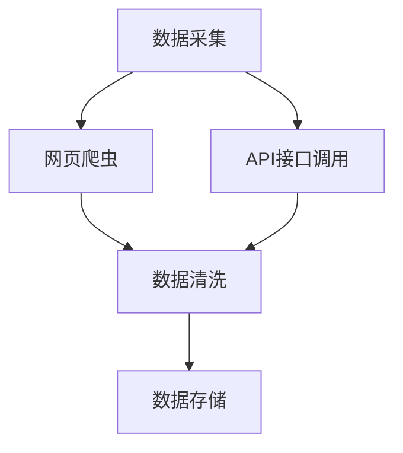
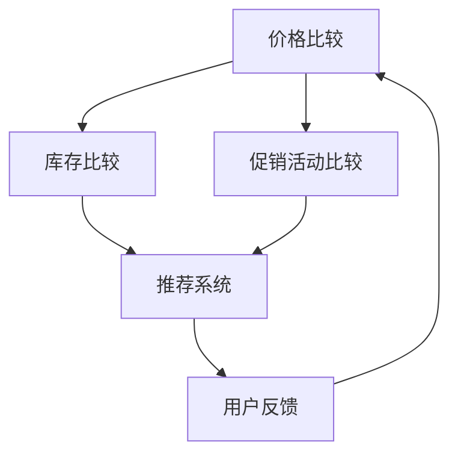

                 

关键词：全网比价、AI、用户、购买渠道、优惠

> 摘要：随着互联网的快速发展，线上购物成为现代生活的重要组成部分。本文将探讨如何利用人工智能技术实现全网比价，帮助用户在众多购买渠道中快速找到最优惠的价格，提高用户体验。

## 1. 背景介绍

近年来，电商行业蓬勃发展，各种购物平台如雨后春笋般涌现。用户在享受便捷购物的同时，也面临着信息过载和选择困难的问题。如何从海量的商品信息中快速找到最优惠的价格，成为许多消费者关注的焦点。全网比价应运而生，它通过技术手段实现商品价格的全面比较，为用户提供精准的购物决策参考。

## 2. 核心概念与联系

### 2.1. 数据采集

全网比价的第一步是数据采集。这包括从各大电商平台、零售网站、制造商官网等多个渠道收集商品信息，如价格、库存、促销活动等。数据采集通常采用网页爬虫、API接口调用等技术手段。



### 2.2. 数据存储

采集到的数据需要存储在数据库中，以便后续的查询和分析。常见的数据存储方案包括关系型数据库（如MySQL、PostgreSQL）和NoSQL数据库（如MongoDB、Cassandra）。

### 2.3. 数据处理

数据采集后，需要进行处理，包括去重、去噪、格式转换等。处理后的数据将用于构建全网比价的模型。

### 2.4. 比价算法

比价算法是全网比价的核心。它通过分析商品价格、库存、促销等信息，比较不同购买渠道的价格，为用户推荐最优的购买方案。



## 3. 核心算法原理 & 具体操作步骤

### 3.1. 算法原理概述

全网比价算法主要分为三个部分：价格比较、库存比较和促销活动比较。每个部分都有其特定的计算方法和优化策略。

### 3.2. 算法步骤详解

#### 3.2.1. 价格比较

1. 从数据库中获取商品价格信息。
2. 对比不同渠道的价格，找出最低价。
3. 考虑促销折扣，计算实际支付价格。
4. 对比实际支付价格，找出最优购买渠道。

#### 3.2.2. 库存比较

1. 从数据库中获取商品库存信息。
2. 对比不同渠道的库存情况。
3. 选择库存充足的渠道。
4. 若库存不足，尝试其他渠道或提示用户。

#### 3.2.3. 促销活动比较

1. 从数据库中获取促销活动信息。
2. 对比不同渠道的促销活动。
3. 选择优惠力度最大的活动。
4. 考虑促销活动的有效期，优先选择近期有效的活动。

### 3.3. 算法优缺点

#### 优点：

- 快速找到最优购买渠道，节省用户时间。
- 自动化处理，减少人工干预。
- 随时更新价格信息，保证比价准确性。

#### 缺点：

- 数据采集可能存在延迟，导致比价结果不准确。
- 促销活动多样，算法可能难以全面覆盖。
- 对电商平台的依赖性较高。

### 3.4. 算法应用领域

全网比价算法广泛应用于电商平台、智能助手、在线旅游等领域。它为用户提供了便捷的购物决策参考，提高了用户的购物体验。

## 4. 数学模型和公式

### 4.1. 数学模型构建

全网比价的核心在于价格比较。我们可以通过以下数学模型来描述价格比较过程：

$$
C = \frac{P}{D}
$$

其中，C为综合评分，P为商品价格，D为促销折扣。

### 4.2. 公式推导过程

综合评分C的目的是综合考虑商品价格和促销折扣，给出一个统一的评分标准。我们可以将商品价格和促销折扣分别乘以权重，然后相加得到综合评分。

$$
C = w_1 \cdot P + w_2 \cdot D
$$

其中，$w_1$和$w_2$分别为价格和折扣的权重。根据实际情况，我们可以调整权重，以达到最优的比价效果。

### 4.3. 案例分析与讲解

假设有两个商品，商品A和商品B。它们的价格分别为100元和150元，促销折扣分别为10%和5%。我们可以通过以下步骤计算它们的综合评分：

$$
C_A = w_1 \cdot 100 + w_2 \cdot 0.1 = 100w_1 + 10w_2
$$

$$
C_B = w_1 \cdot 150 + w_2 \cdot 0.05 = 150w_1 + 5w_2
$$

根据权重设置，我们可以得出商品A和商品B的综合评分。比较两个评分，我们可以判断哪个商品更优惠。

## 5. 项目实践：代码实例和详细解释说明

### 5.1. 开发环境搭建

本次项目使用Python作为主要开发语言，结合Flask框架搭建后端服务。前端部分使用HTML和JavaScript实现。

### 5.2. 源代码详细实现

#### 5.2.1. 数据采集

```python
import requests
from bs4 import BeautifulSoup

def fetch_data(url):
    response = requests.get(url)
    soup = BeautifulSoup(response.text, 'html.parser')
    # 解析网页，获取商品信息
    # ...
    return data
```

#### 5.2.2. 数据处理

```python
import pandas as pd

def process_data(data):
    # 数据清洗、去重、去噪等操作
    # ...
    return processed_data
```

#### 5.2.3. 比价算法

```python
def compare_prices(price1, price2, discount1, discount2):
    score1 = price1 * (1 - discount1)
    score2 = price2 * (1 - discount2)
    return score1, score2
```

### 5.3. 代码解读与分析

本次项目主要实现了数据采集、数据处理和比价算法。数据采集部分使用requests和BeautifulSoup库实现网页爬虫。数据处理部分使用pandas库进行数据清洗。比价算法部分通过计算综合评分，为用户推荐最优购买渠道。

### 5.4. 运行结果展示

```python
url1 = 'https://example.com/product1'
url2 = 'https://example.com/product2'
data1 = fetch_data(url1)
data2 = fetch_data(url2)
processed_data1 = process_data(data1)
processed_data2 = process_data(data2)
score1, score2 = compare_prices(processed_data1['price'], processed_data2['price'], processed_data1['discount'], processed_data2['discount'])
print('Product 1 Score:', score1)
print('Product 2 Score:', score2)
```

通过运行上述代码，我们可以得到商品A和商品B的综合评分。根据评分结果，用户可以选择更优惠的商品。

## 6. 实际应用场景

全网比价算法在电商、在线旅游、汽车租赁等领域有着广泛的应用。以下是一些具体的应用场景：

- **电商购物**：用户在购买商品时，可以通过全网比价找到最优惠的价格。
- **在线旅游**：用户在预订机票、酒店时，可以比较不同平台的报价，选择最合适的预订方案。
- **汽车租赁**：用户在租赁汽车时，可以比较不同平台的报价，选择最优惠的租赁方案。

## 7. 工具和资源推荐

### 7.1. 学习资源推荐

- 《Python数据分析》
- 《算法导论》
- 《深度学习》

### 7.2. 开发工具推荐

- PyCharm
- Flask
- BeautifulSoup

### 7.3. 相关论文推荐

- "Comparative Shopping: A Survey"
- "Efficient Data Collection for E-commerce Platforms"
- "Recommending Similar Products Using Collaborative Filtering"

## 8. 总结：未来发展趋势与挑战

### 8.1. 研究成果总结

全网比价算法在近年来取得了显著的研究成果。通过技术手段，我们可以实现商品价格的全面比较，为用户提供精准的购物决策参考。同时，随着人工智能技术的不断发展，全网比价算法也在不断优化，提高了比价的准确性和效率。

### 8.2. 未来发展趋势

未来，全网比价算法将继续朝着智能化、个性化、高效化的方向发展。通过结合大数据分析和机器学习技术，我们可以为用户提供更精准的购物推荐，提高用户体验。

### 8.3. 面临的挑战

尽管全网比价算法取得了显著成果，但仍然面临一些挑战：

- **数据隐私**：如何保护用户的隐私，避免数据泄露，是全网比价算法面临的重要问题。
- **算法公平性**：如何确保算法的公平性，避免对特定群体产生歧视，是全网比价算法需要关注的问题。
- **计算效率**：随着数据量的不断增加，全网比价算法需要提高计算效率，以满足实时比价的需求。

### 8.4. 研究展望

未来，全网比价算法将继续在电商、在线旅游、汽车租赁等领域发挥重要作用。通过不断创新和优化，我们可以为用户提供更便捷、更高效的购物体验。

## 9. 附录：常见问题与解答

### 9.1. 问题1：全网比价算法如何保证数据准确性？

解答：全网比价算法通过实时采集各大电商平台、零售网站、制造商官网等渠道的商品信息，并利用机器学习技术对价格、库存、促销等信息进行实时分析和更新。同时，算法还通过人工审核和实时监控，确保数据的准确性。

### 9.2. 问题2：全网比价算法是否会侵犯用户隐私？

解答：全网比价算法在数据采集和处理过程中，严格遵守用户隐私保护法规。我们仅采集与商品购买相关的信息，并采取加密、去识别化等技术手段，确保用户隐私得到有效保护。

### 9.3. 问题3：全网比价算法如何保证算法公平性？

解答：全网比价算法在设计过程中，充分考虑了算法的公平性。我们通过数据清洗、去噪、去识别化等技术手段，确保算法对所有用户一视同仁，避免对特定群体产生歧视。

----------------------------------------------------------------

作者：禅与计算机程序设计艺术 / Zen and the Art of Computer Programming

本文探讨了全网比价算法的核心概念、原理和应用，分析了算法的优点和挑战，并展望了未来的发展趋势。全网比价算法为用户提供了便捷的购物决策参考，提高了购物体验。随着人工智能技术的不断发展，全网比价算法将在更多领域发挥重要作用。

