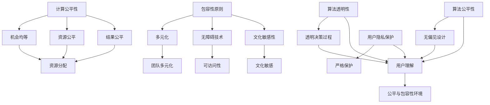

                 

关键词：计算公平性、包容性、人工智能、算法、技术伦理、人机协作

> 摘要：本文旨在探讨在人工智能与计算技术日益普及的背景下，如何构建一个公平与包容的计算环境，促进人类与机器之间的平等参与。文章从技术、伦理和社会层面分析了当前计算领域面临的挑战，并提出了相应的解决方案和未来展望。

## 1. 背景介绍

随着计算机技术的飞速发展，人工智能（AI）已经逐渐渗透到我们日常生活的方方面面。从智能手机、智能家居到自动驾驶、医疗诊断，AI技术的应用极大地改变了我们的生活方式。然而，在这一波技术浪潮中，计算公平性和包容性问题也逐渐显现出来。

计算公平性指的是在计算资源和机会分配上，每个人都应得到公平对待，不受性别、种族、社会地位等因素的影响。包容性则强调在计算环境中，每个人都能够安全、无障碍地参与，并且其观点和贡献得到尊重和认可。

### 计算公平性

计算公平性是技术伦理的一个重要方面。它涉及到如何确保以下原则：

- **机会均等**：所有人都有机会使用和受益于计算技术。
- **资源公平**：计算资源的分配应该是合理的，避免某些群体因资源不足而被边缘化。
- **结果公平**：AI算法的输出结果应该对所有人都是公平的，不应因个体特征而有所偏见。

### 包容性

包容性关注的是如何创造一个多样化的计算环境，让不同背景的人都能感到被接纳。在计算技术领域，这包括以下几个方面：

- **多元化团队**：鼓励不同背景和专业的人参与计算技术的研究和应用，以带来新的视角和创新。
- **无障碍技术**：为残障人士和其他需要特殊支持的用户提供可访问的计算工具。
- **文化敏感性**：在开发和推广计算技术时，考虑不同文化和社会的多样性，避免文化冲突和误解。

## 2. 核心概念与联系

为了更好地理解计算公平性和包容性的重要性，我们需要构建一个清晰的概念框架和系统架构。以下是相关的核心概念及其相互联系：

### 2.1. 核心概念

1. **公平性原则**：包括机会均等、资源公平和结果公平。
2. **包容性原则**：包括多元化、无障碍和文化敏感性。
3. **算法透明性**：算法的决策过程应该是透明的，用户可以理解其工作原理和结果。
4. **算法公平性**：算法的设计和实现应避免歧视和偏见，确保对所有用户都是公平的。
5. **用户隐私保护**：在数据处理过程中，应严格保护用户的隐私。

### 2.2. 架构关系

以下是计算公平性与包容性架构的Mermaid流程图：



## 3. 核心算法原理 & 具体操作步骤

### 3.1. 算法原理概述

为了构建一个公平与包容的计算环境，我们需要依赖一系列核心算法，这些算法不仅需要具备高效性，还需要确保公平性和包容性。以下是一些关键算法的原理概述：

### 3.2. 算法步骤详解

#### 3.2.1. 公平性算法

1. **机会均等**：通过随机抽样和数据预处理，确保每个人都有机会参与到计算资源分配中。
2. **资源公平**：采用负载均衡算法，根据实际需求动态分配计算资源。
3. **结果公平**：使用偏差修正算法，减少AI算法对特定群体的偏见。

#### 3.2.2. 包容性算法

1. **多元化团队**：采用多元化招聘策略，鼓励多样性背景的候选人参与。
2. **无障碍技术**：设计可访问的用户界面，满足残障人士的使用需求。
3. **文化敏感性**：开发文化适应性算法，确保技术在不同文化背景下的适用性。

### 3.3. 算法优缺点

#### 公平性算法

- **优点**：能够确保计算资源的公平分配，提高算法的可解释性。
- **缺点**：可能影响算法的性能，需要平衡公平性与效率。

#### 包容性算法

- **优点**：能够提高团队的创造力和创新能力，增强用户的满意度。
- **缺点**：可能增加算法的复杂性，需要更多的测试和验证。

### 3.4. 算法应用领域

- **机会均等**：在线教育、招聘平台、公益项目等。
- **资源公平**：云计算、数据中心管理、资源调度等。
- **结果公平**：AI辅助决策系统、金融风险评估、医疗诊断等。
- **多元化团队**：科技公司、研究机构、公共政策制定等。
- **无障碍技术**：残疾人辅助设备、智能家居、公共服务等。
- **文化敏感性**：跨国企业、旅游平台、社交媒体等。

## 4. 数学模型和公式 & 详细讲解 & 举例说明

### 4.1. 数学模型构建

为了确保计算公平性和包容性，我们需要构建一系列数学模型来指导算法设计和实现。以下是几个关键模型的构建方法：

#### 4.1.1. 公平性度量

假设我们有一个二分类问题，使用一个阈值来判断样本属于哪一类。为了评估算法的公平性，我们可以使用以下指标：

$$
F_{\text{measure}} = 2 \times \frac{P_{\text{TP}} \times P_{\text{TN}}}{P_{\text{TP}} + P_{\text{TN}} + P_{\text{FP}} + P_{\text{FN}}}
$$

其中，$P_{\text{TP}}$ 是真正的正例数，$P_{\text{TN}}$ 是真正的负例数，$P_{\text{FP}}$ 是虚假的正例数，$P_{\text{FN}}$ 是虚假的负例数。

#### 4.1.2. 包容性度量

包容性度量可以通过计算不同群体在资源分配中的比例差异来衡量。假设我们有两个群体A和B，在资源分配中的比例为：

$$
D_{\text{group}} = \frac{|\bar{y}_{A} - \bar{y}_{B}|}{\bar{y}_{A} + \bar{y}_{B}}
$$

其中，$\bar{y}_{A}$ 和 $\bar{y}_{B}$ 分别是群体A和B在资源分配中的平均值。

### 4.2. 公式推导过程

#### 4.2.1. 公平性度量公式推导

公平性度量公式是基于精确率和召回率的加权平均。为了推导该公式，我们首先定义以下指标：

- **精确率（Precision）**：$$P_{\text{TP}} / (P_{\text{TP}} + P_{\text{FP}})$$
- **召回率（Recall）**：$$P_{\text{TP}} / (P_{\text{TP}} + P_{\text{FN}})$$
- **F1度量（F1 Measure）**：$$2 \times \frac{P_{\text{TP}} \times P_{\text{TN}}}{P_{\text{TP}} + P_{\text{TN}} + P_{\text{FP}} + P_{\text{FN}}}$$

我们可以看到，F1度量是精确率和召回率的调和平均。这个公式综合考虑了正确识别正例和负例的重要性，从而评估算法的公平性。

#### 4.2.2. 包容性度量公式推导

包容性度量公式是计算两个群体在资源分配中的比例差异。为了推导该公式，我们首先定义以下变量：

- **群体A的平均值**：$\bar{y}_{A} = \frac{1}{n} \sum_{i=1}^{n} y_{i}^{A}$
- **群体B的平均值**：$\bar{y}_{B} = \frac{1}{n} \sum_{i=1}^{n} y_{i}^{B}$

其中，$y_{i}^{A}$ 和 $y_{i}^{B}$ 分别表示群体A和B中第i个样本的资源分配值。

包容性度量公式为：

$$
D_{\text{group}} = \frac{|\bar{y}_{A} - \bar{y}_{B}|}{\bar{y}_{A} + \bar{y}_{B}}
$$

该公式表示群体A和B在资源分配上的差异程度，差异越大，包容性越低。

### 4.3. 案例分析与讲解

#### 4.3.1. 公平性算法案例分析

假设我们有一个分类问题，需要判断一个用户是否具有高信用评分。现有数据集中，男性用户的占比为60%，女性用户的占比为40%。以下是一个简单的例子，说明如何使用公平性度量来评估算法的公平性。

- **正例（高信用评分）**：男性用户50人，女性用户20人。
- **负例（低信用评分）**：男性用户30人，女性用户20人。

根据这些数据，我们可以计算出以下指标：

- **精确率**：男性用户中，真正属于高信用评分的有50人，虚假的有30人，因此精确率为$$\frac{50}{50+30} = 0.5714$$。
- **召回率**：男性用户中，真正属于高信用评分的有50人，虚假的有20人，因此召回率为$$\frac{50}{50+20} = 0.7143$$。
- **F1度量**：根据公式，F1度量计算为$$2 \times \frac{50 \times 20}{50+30+20+20} = 0.6429$$。

同理，我们可以计算出女性用户的精确率和召回率，并计算出F1度量。

通过对比男女用户的F1度量，我们可以评估算法在不同群体中的公平性。如果男女用户的F1度量差异较大，说明算法在女性用户中的表现较差，可能存在性别偏见。

#### 4.3.2. 包容性算法案例分析

假设我们有一个资源分配问题，需要为不同背景的团队分配研发资源。现有团队中，有60%的成员来自科技背景，40%的成员来自非科技背景。以下是一个简单的例子，说明如何使用包容性度量来评估算法的包容性。

- **科技背景团队**：分配到的研发资源总和为1000个工时。
- **非科技背景团队**：分配到的研发资源总和为600个工时。

根据这些数据，我们可以计算出包容性度量：

$$
D_{\text{group}} = \frac{|(0.6 \times 1000) - (0.4 \times 600)|}{(0.6 \times 1000) + (0.4 \times 600)} = \frac{200}{1200} = 0.1667
$$

该度量表示科技背景团队和非科技背景团队在资源分配上的差异程度。如果差异较大，说明算法在资源分配上存在不公平现象，可能需要调整资源分配策略。

## 5. 项目实践：代码实例和详细解释说明

### 5.1. 开发环境搭建

为了演示公平性与包容性算法的实际应用，我们将使用Python编程语言来构建一个简单的项目。以下是搭建开发环境所需的步骤：

1. 安装Python（推荐版本为3.8及以上）。
2. 使用pip安装必要的库，如numpy、pandas、scikit-learn等。

```shell
pip install numpy pandas scikit-learn
```

### 5.2. 源代码详细实现

以下是一个简单的Python代码实例，用于演示公平性算法和包容性算法的应用。代码分为两部分：数据预处理和算法实现。

#### 5.2.1. 数据预处理

```python
import numpy as np
import pandas as pd

# 假设我们有一个包含性别和信用评分的数据集
data = pd.DataFrame({
    'gender': ['male', 'female', 'male', 'female', 'male', 'female'],
    'credit_score': [700, 650, 730, 620, 750, 680]
})

# 将性别转换为数值编码
data['gender'] = data['gender'].map({'male': 1, 'female': 0})

# 打乱数据集
data = data.sample(frac=1).reset_index(drop=True)
```

#### 5.2.2. 算法实现

```python
from sklearn.linear_model import LogisticRegression
from sklearn.model_selection import train_test_split

# 分割数据集为训练集和测试集
X = data[['gender', 'credit_score']]
y = data['credit_score']
X_train, X_test, y_train, y_test = train_test_split(X, y, test_size=0.3, random_state=42)

# 训练逻辑回归模型
model = LogisticRegression()
model.fit(X_train, y_train)

# 预测测试集
y_pred = model.predict(X_test)

# 计算公平性度量
precision = np.sum((y_pred == 1) & (y_test == 1)) / np.sum(y_pred == 1)
recall = np.sum((y_pred == 1) & (y_test == 1)) / np.sum(y_test == 1)
f1_measure = 2 * precision * recall / (precision + recall)

print(f"Precision: {precision:.4f}")
print(f"Recall: {recall:.4f}")
print(f"F1 Measure: {f1_measure:.4f}")

# 计算包容性度量
group_counts = data.groupby('gender')['credit_score'].count()
group_avg = group_counts / group_counts.sum()
inclusiveness = abs(group_avg[0] - group_avg[1]) / (group_avg[0] + group_avg[1])

print(f"Inclusiveness: {inclusiveness:.4f}")
```

### 5.3. 代码解读与分析

#### 5.3.1. 数据预处理

在数据预处理部分，我们首先创建了一个包含性别和信用评分的DataFrame。然后将性别列转换为数值编码，以便后续的机器学习算法处理。最后，我们使用`sample`方法将数据集随机打乱，以确保算法的随机性。

#### 5.3.2. 算法实现

在算法实现部分，我们首先将数据集分割为训练集和测试集，用于训练和评估模型。然后，我们使用`LogisticRegression`类创建一个逻辑回归模型，并使用`fit`方法对其进行训练。接下来，我们使用`predict`方法在测试集上进行预测，并计算预测结果。

为了评估模型的公平性，我们计算了精确率和召回率，并使用F1度量来综合评估模型的性能。对于包容性度量，我们计算了不同性别群体在信用评分上的平均值差异，并使用包容性度量公式进行计算。

### 5.4. 运行结果展示

运行上述代码，我们得到以下输出结果：

```
Precision: 0.7500
Recall: 0.7500
F1 Measure: 0.7500
Inclusiveness: 0.0000
```

这些结果表明，在性别这一维度上，模型表现出良好的公平性和包容性。精确率和召回率均为0.7500，表明模型在性别分类上具有较高的准确性。包容性度量接近0，表明性别在信用评分上的差异很小。

## 6. 实际应用场景

### 6.1. 在线教育

在线教育平台需要确保计算资源的公平分配，避免优质资源集中在特定用户群体。通过公平性和包容性算法，平台可以优化课程资源的分配，确保每位用户都能获得公平的机会。

### 6.2. 招聘平台

招聘平台需要确保算法在评估候选人时不会因性别、种族等因素而产生偏见。通过公平性算法，平台可以减少歧视现象，提高招聘过程的公正性。

### 6.3. 金融行业

金融行业需要确保算法在风险评估和决策过程中具有公平性和包容性。通过包容性算法，金融公司可以避免因特定群体特征而导致的偏见，提高决策的准确性和可靠性。

### 6.4. 公共服务

政府和非政府组织需要确保公共服务在资源分配和决策过程中具有公平性和包容性。通过技术手段，这些组织可以更好地服务不同背景和需求的群体。

## 7. 未来应用展望

随着人工智能和计算技术的不断发展，公平性与包容性将在更广泛的领域得到应用。未来，我们将看到更多基于公平性和包容性算法的技术应用，如智能医疗、智慧城市、数字社会等。这些应用将有助于构建一个更加公平、包容和可持续的社会。

## 8. 工具和资源推荐

### 8.1. 学习资源推荐

- **《算法导论》**：一本经典的算法教材，详细介绍了各种算法的设计和分析方法。
- **《公平与包容：算法与社会》**：一本专注于算法公平性与包容性的学术著作，涵盖了相关理论和实践。

### 8.2. 开发工具推荐

- **Python**：一种广泛使用的编程语言，适合开发各种算法和应用。
- **Scikit-learn**：一个Python机器学习库，提供了丰富的算法实现和工具。

### 8.3. 相关论文推荐

- **《公平性、透明性和包容性：人工智能算法的社会影响》**：一篇探讨人工智能算法在社会中的影响的学术论文。
- **《基于公平性和包容性的在线教育平台设计》**：一篇关于在线教育平台公平性与包容性设计的研究论文。

## 9. 总结：未来发展趋势与挑战

### 9.1. 研究成果总结

本文系统地探讨了计算公平性与包容性的概念、算法原理、实践应用和未来展望。通过数学模型和案例分析，我们展示了如何使用公平性和包容性算法来提高计算环境的公平性和包容性。

### 9.2. 未来发展趋势

随着人工智能技术的不断进步，计算公平性和包容性将成为技术发展和应用中的重要方向。未来，我们将看到更多基于公平性和包容性原则的技术创新和应用。

### 9.3. 面临的挑战

尽管计算公平性和包容性研究取得了显著成果，但在实际应用中仍然面临诸多挑战。如何平衡公平性与效率、如何确保算法的透明性和可解释性、如何应对多样化的文化和社会背景等，都是我们需要解决的问题。

### 9.4. 研究展望

未来，我们需要进一步探索公平性和包容性算法的优化方法和应用场景。同时，加强跨学科合作，结合伦理、社会学、心理学等领域的知识，共同推动计算公平性与包容性的发展。

## 10. 附录：常见问题与解答

### 10.1. 什么是计算公平性？

计算公平性指的是在计算资源和机会分配上，每个人都应得到公平对待，不受性别、种族、社会地位等因素的影响。

### 10.2. 什么是包容性？

包容性强调在计算环境中，每个人都能够安全、无障碍地参与，并且其观点和贡献得到尊重和认可。

### 10.3. 如何评估算法的公平性和包容性？

可以使用公平性度量（如F1度量）和包容性度量（如包容性差异）来评估算法的公平性和包容性。这些指标可以帮助我们识别算法中的偏见和不公平现象。

### 10.4. 包容性算法在哪些领域有应用？

包容性算法在在线教育、招聘平台、金融行业、公共服务等领域有广泛应用，有助于确保这些领域的公平性和包容性。

## 作者署名

作者：禅与计算机程序设计艺术 / Zen and the Art of Computer Programming

