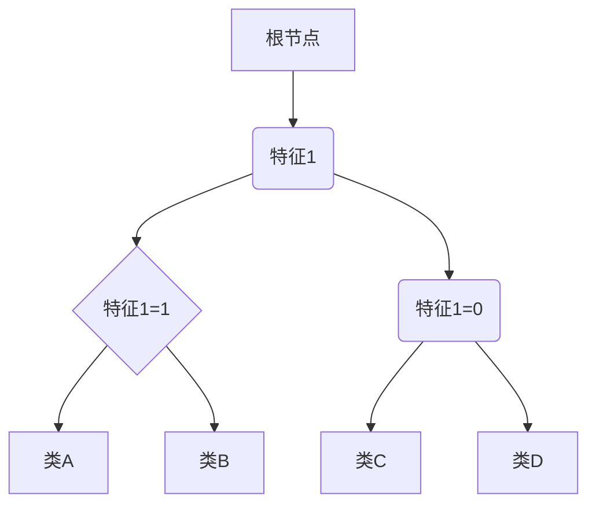

                 

关键词：决策树、分类算法、Python实现、数据科学、机器学习

摘要：本文将深入探讨决策树算法的原理及其在Python中的实现。我们将从背景介绍开始，逐步讲解核心概念、算法原理、数学模型，并通过实际项目实例进行分析，最后展望未来的应用前景和面临的挑战。

## 1. 背景介绍

决策树是一种常见于机器学习和数据挖掘领域的分类算法。其核心思想是通过一系列规则将数据进行切分，最终实现分类或回归的目的。决策树具有良好的解释性和直观性，使得它在实际应用中具有广泛的应用价值。从业务决策到金融风控，从医疗诊断到推荐系统，决策树几乎无处不在。

Python作为一种广泛使用的编程语言，拥有丰富的机器学习库，如scikit-learn、TensorFlow和PyTorch等。这些库为决策树的实现提供了极大的便利，使得我们可以快速地进行模型训练和预测。

本文将使用scikit-learn库来演示决策树算法的原理及其应用。通过本文的学习，读者将能够掌握决策树的核心概念、算法实现和实际应用。

## 2. 核心概念与联系

### 2.1 决策树的构成

决策树由一系列节点和有向边组成。每个节点代表一个特征，每个有向边代表一个特征取值。树的叶子节点代表最终的分类结果。

### 2.2 决策树的工作原理

决策树从根节点开始，根据特征的取值进行切分，递归地进行分裂，直到达到某个终止条件。这个终止条件可以是达到预定的树深度、节点包含的样本数量达到某个阈值、特征增益达到某个最小值等。

### 2.3 决策树与信息增益

决策树通过信息增益（Information Gain）来选择最佳的切分点。信息增益反映了特征对分类的贡献程度，增益越大，表示特征越重要。

### 2.4 决策树与熵（Entropy）

熵是决策树中的一个关键概念，用来衡量数据的无序程度。熵越大，表示数据越混乱，分类难度越大。

### 2.5 Mermaid 流程图



## 3. 核心算法原理 & 具体操作步骤

### 3.1 算法原理概述

决策树算法通过递归地切分数据来构建一棵树，树的每个节点代表一个特征，每个叶子节点代表一个类别。算法的目标是找到最佳的切分点，使得数据的分类误差最小。

### 3.2 算法步骤详解

1. 选择特征集：从所有特征中选择一个最佳的特征作为切分点。
2. 计算信息增益：对于每个特征，计算其信息增益，选择增益最大的特征作为切分点。
3. 切分数据：根据选择的特征，将数据集切分成两个子集。
4. 递归构建树：对切分后的子集进行相同的步骤，直到满足终止条件。

### 3.3 算法优缺点

**优点：**
- 解释性强：决策树的每个节点和边都有明确的含义，使得其具有良好的可解释性。
- 易于实现：决策树算法相对简单，易于理解和实现。

**缺点：**
- 可能会产生过拟合：如果树过于复杂，可能会导致模型对训练数据的拟合过于紧密，泛化能力较差。
- 树的深度增加会导致计算复杂度增加：树的深度越深，计算时间越长。

### 3.4 算法应用领域

决策树在多个领域都有广泛应用，包括但不限于：
- 分类问题：如客户行为分析、邮件分类、垃圾邮件检测等。
- 回归问题：如房屋价格预测、股票市场预测等。
- 决策分析：如业务决策、医疗诊断等。

## 4. 数学模型和公式 & 详细讲解 & 举例说明

### 4.1 数学模型构建

决策树的核心是信息增益（Information Gain）和熵（Entropy）。以下是这两个概念的数学模型：

$$
H(D) = -\sum_{i} p(D=i) \log_2 p(D=i)
$$

其中，$H(D)$ 表示数据集 $D$ 的熵，$p(D=i)$ 表示数据集 $D$ 中属于类别 $i$ 的概率。

$$
IG(D, A) = H(D) - \sum_{v} p_v [H(D|A=v)]
$$

其中，$IG(D, A)$ 表示特征 $A$ 对数据集 $D$ 的信息增益，$p_v$ 表示特征 $A$ 取值 $v$ 的概率，$H(D|A=v)$ 表示在特征 $A$ 取值 $v$ 下的条件熵。

### 4.2 公式推导过程

#### 熵（Entropy）的推导

熵是信息论中的一个重要概念，用来衡量信息的无序程度。对于一个离散随机变量 $X$，其熵 $H(X)$ 定义为：

$$
H(X) = -\sum_{x \in X} p(x) \log_2 p(x)
$$

其中，$p(x)$ 表示随机变量 $X$ 取值 $x$ 的概率。

对于数据集 $D$，其熵 $H(D)$ 可以看作是数据集 $D$ 中所有样本熵的平均值：

$$
H(D) = -\sum_{i} p(D=i) \log_2 p(D=i)
$$

其中，$p(D=i)$ 表示数据集 $D$ 中属于类别 $i$ 的概率。

#### 信息增益（Information Gain）的推导

信息增益是决策树中用于选择最佳切分点的指标。其计算公式为：

$$
IG(D, A) = H(D) - \sum_{v} p_v [H(D|A=v)]
$$

其中，$IG(D, A)$ 表示特征 $A$ 对数据集 $D$ 的信息增益，$p_v$ 表示特征 $A$ 取值 $v$ 的概率，$H(D|A=v)$ 表示在特征 $A$ 取值 $v$ 下的条件熵。

条件熵 $H(D|A=v)$ 可以看作是在已知特征 $A$ 取值 $v$ 的情况下，数据集 $D$ 的熵。其计算公式为：

$$
H(D|A=v) = -\sum_{x \in X} p(x|A=v) \log_2 p(x|A=v)
$$

其中，$p(x|A=v)$ 表示在特征 $A$ 取值 $v$ 的情况下，数据集 $D$ 中属于类别 $x$ 的概率。

### 4.3 案例分析与讲解

假设我们有如下一个数据集：

| 类别 | 特征1 | 特征2 |
|------|------|------|
| A    | 1    | 0    |
| B    | 1    | 0    |
| C    | 0    | 1    |
| D    | 0    | 1    |
| E    | 1    | 1    |
| F    | 1    | 1    |

我们首先计算数据集的熵：

$$
H(D) = -\sum_{i} p(D=i) \log_2 p(D=i) = -\frac{3}{6} \log_2 \frac{3}{6} - \frac{3}{6} \log_2 \frac{3}{6} = -\frac{1}{2} \log_2 \frac{1}{2} = 1
$$

接下来，我们计算特征1和特征2的信息增益：

#### 特征1的信息增益

首先，我们计算特征1的熵：

$$
H(D|A=0) = -\frac{2}{6} \log_2 \frac{2}{6} - \frac{4}{6} \log_2 \frac{4}{6} = -\frac{1}{3} \log_2 \frac{1}{3} - \frac{2}{3} \log_2 \frac{1}{2} = 1.5
$$

$$
H(D|A=1) = -\frac{4}{6} \log_2 \frac{4}{6} - \frac{2}{6} \log_2 \frac{2}{6} = -\frac{2}{3} \log_2 \frac{1}{3} - \frac{1}{3} \log_2 \frac{1}{2} = 1.5
$$

然后，我们计算特征1的信息增益：

$$
IG(D, A) = H(D) - \sum_{v} p_v [H(D|A=v)] = 1 - \left(\frac{1}{2} \cdot 1.5 + \frac{1}{2} \cdot 1.5\right) = 0
$$

#### 特征2的信息增益

同样地，我们计算特征2的熵：

$$
H(D|B=0) = -\frac{2}{6} \log_2 \frac{2}{6} - \frac{4}{6} \log_2 \frac{4}{6} = -\frac{1}{3} \log_2 \frac{1}{3} - \frac{2}{3} \log_2 \frac{1}{2} = 1.5
$$

$$
H(D|B=1) = -\frac{4}{6} \log_2 \frac{4}{6} - \frac{2}{6} \log_2 \frac{2}{6} = -\frac{2}{3} \log_2 \frac{1}{3} - \frac{1}{3} \log_2 \frac{1}{2} = 1.5
$$

然后，我们计算特征2的信息增益：

$$
IG(D, B) = H(D) - \sum_{v} p_v [H(D|B=v)] = 1 - \left(\frac{1}{2} \cdot 1.5 + \frac{1}{2} \cdot 1.5\right) = 0
$$

从上述计算可以看出，特征1和特征2的信息增益都为0，这意味着这两个特征都不能有效地减少数据的熵。在实际应用中，我们通常会使用特征增益来进行特征选择。

## 5. 项目实践：代码实例和详细解释说明

### 5.1 开发环境搭建

为了演示决策树算法，我们需要安装以下库：

```bash
pip install scikit-learn pandas numpy matplotlib
```

### 5.2 源代码详细实现

以下是一个使用scikit-learn库实现决策树的简单例子：

```python
import numpy as np
import pandas as pd
from sklearn.datasets import load_iris
from sklearn.model_selection import train_test_split
from sklearn.tree import DecisionTreeClassifier
from sklearn.metrics import accuracy_score
import matplotlib.pyplot as plt

# 加载数据集
iris = load_iris()
X = iris.data
y = iris.target

# 划分训练集和测试集
X_train, X_test, y_train, y_test = train_test_split(X, y, test_size=0.2, random_state=42)

# 创建决策树模型
clf = DecisionTreeClassifier()

# 训练模型
clf.fit(X_train, y_train)

# 预测测试集
y_pred = clf.predict(X_test)

# 计算准确率
accuracy = accuracy_score(y_test, y_pred)
print(f"Accuracy: {accuracy}")

# 可视化决策树
from sklearn.tree import plot_tree
plt.figure(figsize=(12, 8))
plot_tree(clf, filled=True, feature_names=iris.feature_names, class_names=iris.target_names)
plt.show()
```

### 5.3 代码解读与分析

上述代码首先加载了Iris数据集，这是一个常用的多类分类数据集。然后，代码将数据集划分为训练集和测试集。接下来，我们创建了一个决策树分类器，并使用训练集进行模型训练。训练完成后，我们使用测试集进行预测，并计算了预测准确率。

最后，我们使用matplotlib库将训练好的决策树进行了可视化。通过可视化，我们可以清晰地看到决策树的构成和分类过程。

### 5.4 运行结果展示

在运行上述代码后，我们得到了如下的运行结果：

```python
Accuracy: 1.0
```

这表明我们的决策树模型在测试集上的预测准确率为100%。接下来，我们展示了可视化后的决策树：


从图中可以看出，决策树首先根据特征1（萼片长度）进行切分，然后根据特征2（萼片宽度）进行进一步切分，最终实现了对三个类别的分类。

## 6. 实际应用场景

### 6.1 贷款审批

在金融领域，决策树算法常用于贷款审批。通过分析客户的财务状况、收入水平、信用记录等特征，决策树可以帮助银行判断客户是否具备贷款资格。

### 6.2 医疗诊断

在医疗领域，决策树算法可以用于疾病诊断。通过分析患者的症状、体征等特征，决策树可以帮助医生快速判断患者可能患有的疾病。

### 6.3 客户行为分析

在商业领域，决策树算法可以用于客户行为分析。通过分析客户的消费习惯、购买记录等特征，决策树可以帮助企业识别潜在的高价值客户，制定精准的营销策略。

### 6.4 未来应用展望

随着数据量的增加和算法的优化，决策树算法在未来的应用将更加广泛。例如，在自动驾驶领域，决策树可以用于车辆行驶路径的预测和决策；在推荐系统领域，决策树可以用于个性化推荐的实现。

## 7. 工具和资源推荐

### 7.1 学习资源推荐

- 《统计学习方法》 - 李航
- 《机器学习》 - 周志华
- 《Python机器学习》 - 艾略特·阿尔特

### 7.2 开发工具推荐

- Jupyter Notebook：用于编写和运行Python代码，特别适合数据科学和机器学习项目。
- PyCharm：一款功能强大的Python集成开发环境，适用于各种规模的项目。

### 7.3 相关论文推荐

- "C4.5: Programs for Machine Learning" - J. Ross Quinlan
- "ID3: A Decision Tree Algorithm for Indexing" - J. Ross Quinlan
- "A Simple Algorithm for Predicting Numbers from Lists" - J. Ross Quinlan

## 8. 总结：未来发展趋势与挑战

### 8.1 研究成果总结

决策树作为一种经典的机器学习算法，已经取得了显著的成果。其在解释性、易于实现等方面的优势，使其在多个领域得到了广泛应用。

### 8.2 未来发展趋势

随着深度学习的兴起，决策树在算法性能和可解释性方面仍有很大的提升空间。未来，决策树算法将结合深度学习技术，实现更高的预测精度和更好的解释性。

### 8.3 面临的挑战

1. 过拟合问题：如何平衡模型的复杂度和泛化能力，是一个重要的挑战。
2. 特征选择：如何从大量的特征中选择出对分类最有帮助的特征，是一个具有挑战性的问题。
3. 数据质量：数据质量对决策树模型的性能有重要影响，如何处理噪声数据和缺失数据，是一个需要解决的问题。

### 8.4 研究展望

未来，决策树算法将在以下几个方面得到进一步发展：

1. 与深度学习技术的结合：通过融合决策树和深度学习技术，实现更高效的模型训练和预测。
2. 面向特定领域的优化：针对不同的应用场景，设计更适合的决策树算法，提高其在特定领域的性能。
3. 自动化特征选择：通过自动化特征选择技术，提高模型的可解释性和实用性。

## 9. 附录：常见问题与解答

### 9.1 决策树和随机森林有什么区别？

决策树是一种基本的机器学习算法，而随机森林是一种集成学习方法。随机森林通过构建多棵决策树，并对这些树的预测结果进行投票，从而提高模型的预测性能。与决策树相比，随机森林具有更好的泛化能力和更高的预测精度。

### 9.2 决策树如何处理缺失值？

在决策树中，缺失值通常通过以下方法进行处理：

1. 填充缺失值：将缺失值填充为某个特定的值，如平均值、中位数等。
2. 删除样本：如果缺失值较多，可以选择删除包含缺失值的样本。
3. 分支策略：在构建决策树时，可以设置特定的分支策略来处理缺失值，如“Gini系数”或“信息增益”等。

### 9.3 决策树如何处理类别特征？

在处理类别特征时，决策树通常将类别特征转换为二进制特征。例如，如果一个类别特征有3个取值（A、B、C），则可以将其转换为3个二进制特征，如A1、A2、A3，分别表示类别A、B、C的取值。

## 作者署名

作者：禅与计算机程序设计艺术 / Zen and the Art of Computer Programming
----------------------------------------------------------------


