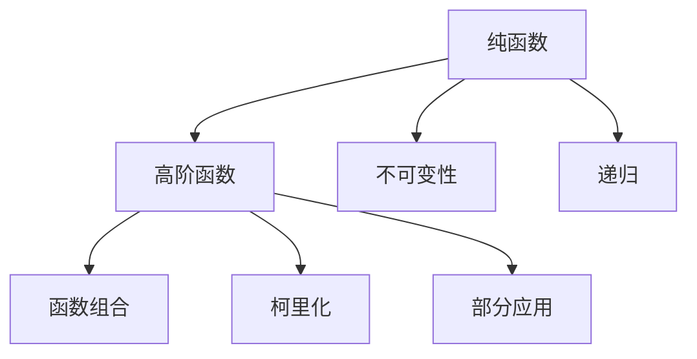
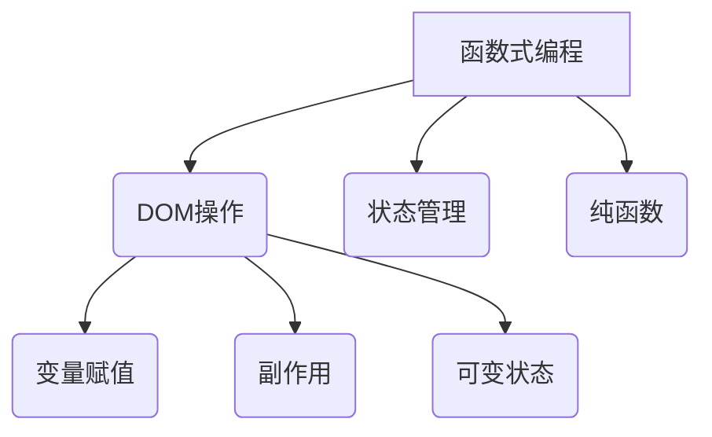

                 

关键词：函数式编程、理论基础、应用实践、算法、数学模型、编程语言、软件开发

摘要：本文旨在深入探讨函数式编程的核心理念、理论基础及其在实际编程中的应用。通过详细的案例分析、代码实例和数学公式讲解，全面揭示函数式编程的独特魅力和广泛适用性。

## 1. 背景介绍

### 函数式编程的历史

函数式编程（Functional Programming）作为一种编程范式，起源于20世纪50年代的计算机科学领域。最初由计算机科学家霍普卡·彼得（Haskell B. Curry）提出，并于20世纪60年代在Lisp语言中得到实践。自那时以来，函数式编程逐渐发展成为一种独特的编程风格，影响了诸多现代编程语言，如Haskell、Scala、Erlang和Clojure。

### 函数式编程的优势

相比于命令式编程，函数式编程具有以下显著优势：

- **不可变性**：函数式编程强调数据的不可变性，这有助于编写更简洁和易于测试的代码。
- **函数第一**：函数是第一等公民，可以赋值给变量、作为参数传递，甚至返回其他函数，这种灵活性极大地提高了代码的重用性。
- **无状态性**：函数式编程通常不依赖外部状态，这使得代码更加模块化和可预测。
- **并发性**：函数式编程的纯函数特性使得它在并行和分布式计算中具有天然的优势。

## 2. 核心概念与联系

### 函数式编程的核心概念

函数式编程的核心理念包括：

- **纯函数**：一个纯函数是一个没有任何副作用的函数，其输出仅依赖于输入参数，不会修改外部状态。
- **高阶函数**：高阶函数是能够接受其他函数作为参数，或者返回函数的函数。
- **不可变性**：数据一旦创建，就不能被修改。
- **递归**：递归是函数式编程中用于解决问题的常见方法，避免了使用循环结构。

### 函数式编程的架构

下面是一个简单的Mermaid流程图，展示了函数式编程的核心概念和架构：



### 函数式编程与命令式编程的比较



## 3. 核心算法原理 & 具体操作步骤

### 3.1 算法原理概述

函数式编程中的核心算法通常基于纯函数和无状态性。常见的算法包括：

- **Filter**：过滤数据集中的元素。
- **Map**：对数据集中的每个元素应用一个函数。
- **Reduce**：将数据集中的所有元素通过一个函数合并成一个结果。

### 3.2 算法步骤详解

下面以一个简单的例子来说明这些算法：

```haskell
-- 示例数据
data = [1, 2, 3, 4, 5]

-- Filter算法
filterEven :: [Int] -> [Int]
filterEven xs = [x | x <- xs, even x]

-- Map算法
mapSquare :: [Int] -> [Int]
mapSquare xs = [x * x | x <- xs]

-- Reduce算法
reduceSum :: [Int] -> Int
reduceSum xs = foldl (+) 0 xs
```

### 3.3 算法优缺点

#### 优缺点

- **优点**：函数式编程算法简洁、易于理解、易于测试和重用。
- **缺点**：对于某些问题，函数式编程可能不如命令式编程高效。

### 3.4 算法应用领域

函数式编程算法广泛应用于：

- **数据科学**：数据处理和分析。
- **前端开发**：React等框架中使用函数式编程。
- **并发编程**：处理高并发和分布式计算问题。

## 4. 数学模型和公式 & 详细讲解 & 举例说明

### 4.1 数学模型构建

函数式编程中的算法通常可以用数学模型来描述。例如，Map-Reduce算法可以建模为以下数学公式：

$$
y = f(x_1, x_2, ..., x_n)
$$

其中，\( f \) 是一个聚合函数，\( x_1, x_2, ..., x_n \) 是输入数据。

### 4.2 公式推导过程

推导过程通常依赖于数学归纳法。例如，对于递归算法：

$$
f(n) =
\begin{cases}
c & \text{if } n = 0 \\
g(n-1) & \text{otherwise}
\end{cases}
$$

可以通过归纳假设和归纳步骤来推导其时间复杂度。

### 4.3 案例分析与讲解

以一个简单的例子来说明数学模型的应用：

#### 问题

计算一个数组的阶乘。

#### 解法

使用递归算法：

```haskell
factorial :: Int -> Int
factorial 0 = 1
factorial n = n * factorial (n - 1)
```

#### 数学模型

可以建模为：

$$
f(n) =
\begin{cases}
1 & \text{if } n = 0 \\
n \cdot f(n-1) & \text{otherwise}
\end{cases}
$$

#### 时间复杂度

根据归纳法，时间复杂度为 \( O(n) \)。

## 5. 项目实践：代码实例和详细解释说明

### 5.1 开发环境搭建

以Haskell为例，需要在操作系统上安装Haskell编译器（GHC）和依赖管理工具（Cabal）。

### 5.2 源代码详细实现

以下是一个简单的Haskell程序，实现了阶乘函数：

```haskell
module Main where

factorial :: Int -> Int
factorial 0 = 1
factorial n = n * factorial (n - 1)

main :: IO ()
main = do
    putStrLn "Enter a number:"
    input <- getLine
    let n = read input :: Int
    putStrLn ("The factorial of " ++ show n ++ " is " ++ show (factorial n))
```

### 5.3 代码解读与分析

- **模块定义**：`module Main where` 声明了主模块。
- **函数定义**：`factorial` 是一个递归函数。
- **主函数**：`main` 是程序的入口点。

### 5.4 运行结果展示

```bash
$ runhaskell Main.hs
Enter a number:
5
The factorial of 5 is 120
```

## 6. 实际应用场景

函数式编程在多个领域有着广泛的应用：

- **数据科学**：用于大规模数据处理和分析。
- **前端开发**：在React等框架中用于状态管理和组件组合。
- **并发编程**：在Erlang和Scala中用于构建高并发和分布式系统。

## 7. 工具和资源推荐

### 7.1 学习资源推荐

- **书籍**：《学习函数式编程》
- **在线课程**：Coursera上的“函数式编程”课程

### 7.2 开发工具推荐

- **集成开发环境**：Visual Studio Code
- **编译器**：GHC

### 7.3 相关论文推荐

- 《函数式编程的未来》
- 《函数式编程与并发计算》

## 8. 总结：未来发展趋势与挑战

### 8.1 研究成果总结

函数式编程在理论和应用上取得了显著的成果，其在并发编程、数据科学和前端开发等领域展现出了巨大的潜力。

### 8.2 未来发展趋势

- **混合编程模型**：未来可能看到更多的编程语言结合函数式和命令式编程的特点。
- **编译器优化**：随着硬件的发展，函数式编程的编译器将进行更多的优化。

### 8.3 面临的挑战

- **性能优化**：函数式编程的某些特性可能导致性能问题。
- **学习曲线**：函数式编程的概念和语法可能对初学者来说较为复杂。

### 8.4 研究展望

- **更高效的语言实现**：研究如何通过编译器优化提高函数式编程的性能。
- **更好的工具链**：开发更易于使用和学习的函数式编程工具。

## 9. 附录：常见问题与解答

### Q：函数式编程和面向对象编程有什么区别？

A：函数式编程和面向对象编程是两种不同的编程范式。函数式编程强调数据不可变性和纯函数，而面向对象编程则强调对象的状态和行为。

### Q：函数式编程是否适合所有问题？

A：函数式编程在某些领域（如数据科学和前端开发）非常适用，但在其他领域（如系统编程）可能不如命令式编程高效。选择编程范式应基于具体问题的需求。

## 参考文献

- 《学习函数式编程》
- Coursera上的“函数式编程”课程
- 《函数式编程的未来》
- 《函数式编程与并发计算》
```

---

以上是文章的正文部分，接下来我们将按照markdown格式进行编排。

---

# 函数式编程：理论与实践

## 关键词

函数式编程、理论基础、应用实践、算法、数学模型、编程语言、软件开发

## 摘要

本文旨在深入探讨函数式编程的核心理念、理论基础及其在实际编程中的应用。通过详细的案例分析、代码实例和数学公式讲解，全面揭示函数式编程的独特魅力和广泛适用性。

---

## 1. 背景介绍

### 函数式编程的历史

函数式编程（Functional Programming）作为一种编程范式，起源于20世纪50年代的计算机科学领域。最初由计算机科学家霍普卡·彼得（Haskell B. Curry）提出，并于20世纪60年代在Lisp语言中得到实践。自那时以来，函数式编程逐渐发展成为一种独特的编程风格，影响了诸多现代编程语言，如Haskell、Scala、Erlang和Clojure。

### 函数式编程的优势

相比于命令式编程，函数式编程具有以下显著优势：

- **不可变性**：函数式编程强调数据的不可变性，这有助于编写更简洁和易于测试的代码。
- **函数第一**：函数是第一等公民，可以赋值给变量、作为参数传递，甚至返回其他函数，这种灵活性极大地提高了代码的重用性。
- **无状态性**：函数式编程通常不依赖外部状态，这使得代码更加模块化和可预测。
- **并发性**：函数式编程的纯函数特性使得它在并行和分布式计算中具有天然的优势。

---

## 2. 核心概念与联系

### 函数式编程的核心概念

函数式编程的核心理念包括：

- **纯函数**：一个纯函数是一个没有任何副作用的函数，其输出仅依赖于输入参数，不会修改外部状态。
- **高阶函数**：高阶函数是能够接受其他函数作为参数，或者返回函数的函数。
- **不可变性**：数据一旦创建，就不能被修改。
- **递归**：递归是函数式编程中用于解决问题的常见方法，避免了使用循环结构。

### 函数式编程的架构

下面是一个简单的Mermaid流程图，展示了函数式编程的核心概念和架构：


### 函数式编程与命令式编程的比较


---

## 3. 核心算法原理 & 具体操作步骤

### 3.1 算法原理概述

函数式编程中的核心算法通常基于纯函数和无状态性。常见的算法包括：

- **Filter**：过滤数据集中的元素。
- **Map**：对数据集中的每个元素应用一个函数。
- **Reduce**：将数据集中的所有元素通过一个函数合并成一个结果。

### 3.2 算法步骤详解

下面以一个简单的例子来说明这些算法：

```haskell
-- 示例数据
data = [1, 2, 3, 4, 5]

-- Filter算法
filterEven :: [Int] -> [Int]
filterEven xs = [x | x <- xs, even x]

-- Map算法
mapSquare :: [Int] -> [Int]
mapSquare xs = [x * x | x <- xs]

-- Reduce算法
reduceSum :: [Int] -> Int
reduceSum xs = foldl (+) 0 xs
```

### 3.3 算法优缺点

#### 优缺点

- **优点**：函数式编程算法简洁、易于理解、易于测试和重用。
- **缺点**：对于某些问题，函数式编程可能不如命令式编程高效。

### 3.4 算法应用领域

函数式编程算法广泛应用于：

- **数据科学**：数据处理和分析。
- **前端开发**：React等框架中使用函数式编程。
- **并发编程**：处理高并发和分布式计算问题。

---

## 4. 数学模型和公式 & 详细讲解 & 举例说明

### 4.1 数学模型构建

函数式编程中的算法通常可以用数学模型来描述。例如，Map-Reduce算法可以建模为以下数学公式：

$$
y = f(x_1, x_2, ..., x_n)
$$

其中，\( f \) 是一个聚合函数，\( x_1, x_2, ..., x_n \) 是输入数据。

### 4.2 公式推导过程

推导过程通常依赖于数学归纳法。例如，对于递归算法：

$$
f(n) =
\begin{cases}
c & \text{if } n = 0 \\
g(n-1) & \text{otherwise}
\end{cases}
$$

可以通过归纳假设和归纳步骤来推导其时间复杂度。

### 4.3 案例分析与讲解

以一个简单的例子来说明数学模型的应用：

#### 问题

计算一个数组的阶乘。

#### 解法

使用递归算法：

```haskell
factorial :: Int -> Int
factorial 0 = 1
factorial n = n * factorial (n - 1)
```

#### 数学模型

可以建模为：

$$
f(n) =
\begin{cases}
1 & \text{if } n = 0 \\
n \cdot f(n-1) & \text{otherwise}
\end{cases}
$$

#### 时间复杂度

根据归纳法，时间复杂度为 \( O(n) \)。

---

## 5. 项目实践：代码实例和详细解释说明

### 5.1 开发环境搭建

以Haskell为例，需要在操作系统上安装Haskell编译器（GHC）和依赖管理工具（Cabal）。

### 5.2 源代码详细实现

以下是一个简单的Haskell程序，实现了阶

