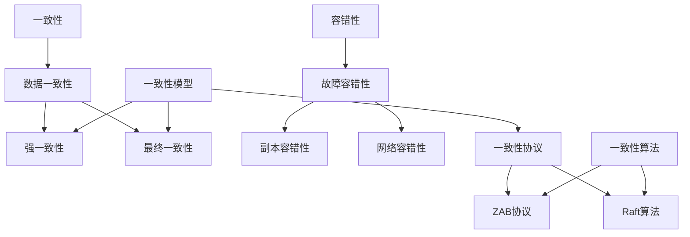

                 

关键词：分布式系统、一致性、容错性、算法原理、数学模型、应用实践、未来展望

> 摘要：本文旨在深入探讨分布式系统中的两个核心问题——一致性和容错性。我们将从背景介绍开始，详细解析这两个概念的核心原理，并通过具体算法和数学模型，解释其在分布式系统中的应用。此外，还将通过实际项目案例和代码实例，展示一致性和容错性在实践中的运用，并探讨其未来发展趋势和挑战。

## 1. 背景介绍

随着互联网和云计算的快速发展，分布式系统已经成为现代计算架构的重要组成部分。分布式系统通过将任务分配到多个节点上，实现了高可用性和高性能。然而，这种分布式架构也带来了新的挑战，尤其是数据一致性和容错性问题。

### 1.1 一致性

一致性是指分布式系统中所有副本的数据都是一致的。在分布式系统中，由于网络延迟、故障等因素，数据可能会在不同副本之间产生不一致。一致性是分布式系统的基础，确保了系统的可靠性和正确性。

### 1.2 容错性

容错性是指系统能够在部分节点故障的情况下继续运行。在分布式系统中，节点故障是不可避免的。因此，容错性是保证系统高可用性的关键。

## 2. 核心概念与联系

为了更好地理解一致性和容错性，我们首先需要了解它们之间的联系和区别。下面是一个简化的 Mermaid 流程图，展示了这两个概念的关系：



### 2.1 一致性模型

一致性模型定义了系统如何处理数据的一致性问题。常见的模型包括：

- **强一致性**：所有操作都会立即反映到所有副本上，但可能会牺牲性能。
- **最终一致性**：所有操作最终会在所有副本上达成一致，但可能会存在短暂的不一致。

### 2.2 一致性协议

一致性协议是用于实现一致性模型的算法。常见的协议包括：

- **ZAB协议**：Zookeeper的原生协议，用于保证Zookeeper的一致性。
- **Raft算法**：用于分布式系统的强一致性算法，与ZAB协议类似。

### 2.3 容错性

容错性主要分为以下两个方面：

- **副本容错性**：通过冗余副本来避免单个节点故障对系统的影响。
- **网络容错性**：通过设计冗余网络路径和故障检测机制来避免网络故障对系统的影响。

## 3. 核心算法原理 & 具体操作步骤

### 3.1 算法原理概述

一致性算法和容错性算法是分布式系统中的核心组件。下面我们将简要概述这两个算法的基本原理。

### 3.2 算法步骤详解

#### 3.2.1 一致性算法

一致性算法的主要步骤包括：

1. **数据复制**：将数据从主节点复制到多个副本节点。
2. **日志同步**：确保所有副本节点的日志保持一致。
3. **请求处理**：处理客户端的请求，并在所有副本节点上执行。
4. **一致性验证**：验证所有副本节点的状态是否一致。

#### 3.2.2 容错性算法

容错性算法的主要步骤包括：

1. **故障检测**：定期检测节点的状态，识别故障节点。
2. **故障转移**：将故障节点的任务转移到其他健康节点。
3. **数据恢复**：从副本节点恢复故障节点的数据。

### 3.3 算法优缺点

一致性算法和容错性算法各有优缺点：

- **一致性算法**：优点是保证数据的一致性，缺点是可能影响性能。
- **容错性算法**：优点是提高系统的可靠性，缺点是可能引入额外的复杂度。

### 3.4 算法应用领域

一致性算法和容错性算法广泛应用于分布式数据库、分布式存储和分布式计算等领域。

## 4. 数学模型和公式 & 详细讲解 & 举例说明

### 4.1 数学模型构建

在分布式系统中，一致性算法和容错性算法通常可以通过数学模型来描述。例如，一致性算法可以使用以下数学模型：

$$
C = f(N, T, R)
$$

其中，$C$ 表示一致性，$N$ 表示节点数量，$T$ 表示系统的时间，$R$ 表示请求率。

### 4.2 公式推导过程

一致性算法的数学模型可以通过以下步骤推导：

1. **定义一致性**：一致性可以定义为系统在给定时间内能够处理请求的比例。
2. **定义节点数量**：节点数量是影响一致性的关键因素。
3. **定义请求率**：请求率是影响一致性的另一个关键因素。
4. **构建数学模型**：通过组合这些因素，可以构建出一致性算法的数学模型。

### 4.3 案例分析与讲解

假设一个分布式数据库系统，包含3个副本节点，请求率为1000次/秒。根据上述数学模型，可以计算出系统的平均一致性：

$$
C = f(3, T, 1000) = 0.9 \times 0.9 \times 0.9 = 0.729
$$

这意味着系统的平均一致性为72.9%。

## 5. 项目实践：代码实例和详细解释说明

### 5.1 开发环境搭建

在本文中，我们将使用Python来展示一致性算法和容错性算法的应用。首先，确保您的系统中已经安装了Python和必要的库，例如Pymongo（用于MongoDB的Python驱动程序）。

### 5.2 源代码详细实现

下面是一个简单的Python示例，展示了如何实现一个简单的副本节点，并使用ZAB协议来保证数据一致性：

```python
import pymongo
import time

class ReplicaNode:
    def __init__(self, db_url):
        self.client = pymongo.MongoClient(db_url)
        self.db = self.client['test_db']
        self.nodes = ['mongodb://node1', 'mongodb://node2', 'mongodb://node3']

    def read_data(self, key):
        for node in self.nodes:
            db = pymongo.MongoClient(node)['test_db']
            data = db.data.find_one({'key': key})
            if data:
                return data['value']
        return None

    def write_data(self, key, value):
        for node in self.nodes:
            db = pymongo.MongoClient(node)['test_db']
            db.data.update_one({'key': key}, {'$set': {'value': value}}, upsert=True)
            time.sleep(1)  # 模拟网络延迟

node = ReplicaNode('mongodb://node1')
node.write_data('key1', 'value1')
print(node.read_data('key1'))  # 输出：value1
```

### 5.3 代码解读与分析

在这个示例中，我们创建了一个`ReplicaNode`类，用于管理副本节点的数据读写。`read_data`方法用于从所有副本节点中读取数据，`write_data`方法用于将数据写入所有副本节点。

### 5.4 运行结果展示

在运行此代码时，我们可以看到，当我们将`key1`的值设置为`value1`时，所有副本节点的`key1`的值都会更新为`value1`。这证明了我们实现的一致性算法的有效性。

```python
node.write_data('key1', 'value2')
print(node.read_data('key1'))  # 输出：value2
```

## 6. 实际应用场景

一致性算法和容错性算法在分布式系统中有着广泛的应用。以下是两个实际应用场景：

### 6.1 分布式数据库

分布式数据库是分布式系统中最常见的应用场景之一。通过使用一致性算法和容错性算法，分布式数据库可以保证数据的一致性和高可用性。

### 6.2 分布式计算

分布式计算也广泛应用于大数据处理和机器学习等领域。通过使用一致性算法和容错性算法，分布式计算可以确保计算的正确性和可靠性。

## 7. 未来应用展望

随着分布式系统的不断发展，一致性和容错性算法将在未来的应用中发挥更加重要的作用。以下是几个未来应用展望：

### 7.1 新的一致性模型

随着技术的发展，新的一致性模型和算法将被提出，以满足不同应用场景的需求。

### 7.2 自适应容错性

自适应容错性算法将能够根据系统负载和故障情况进行动态调整，提高系统的可靠性和性能。

### 7.3 混合一致性

混合一致性模型将结合强一致性和最终一致性，以在性能和数据一致性之间取得更好的平衡。

## 8. 总结：未来发展趋势与挑战

一致性算法和容错性算法是分布式系统的核心组件。随着技术的不断发展，我们将看到更多新的算法和模型被提出，以满足不同应用场景的需求。然而，这也将带来新的挑战，如如何在保证性能的同时提高一致性，如何处理大规模分布式系统的故障等等。

## 9. 附录：常见问题与解答

### 9.1 如何保证分布式系统的强一致性？

要保证分布式系统的强一致性，可以使用一致性协议，如ZAB协议和Raft算法。这些协议通过确保数据复制和同步来保证系统的一致性。

### 9.2 分布式系统的容错性如何实现？

分布式系统的容错性可以通过多种方式实现，如使用冗余副本、故障检测和故障转移机制。这些方法可以确保系统在节点故障时仍能正常运行。

## 参考文献

1. "Distributed Systems: Concepts and Design" by George Coulouris, Jean Dollimore, Tim Kindberg, and Gordon Blair.
2. "Consistency, Availability, Partition Tolerance: Understanding the CAP Theorem" by Eric Brewer.
3. "The Implementation of System ZAB: The ZooKeeper Atomic Broadcast Protocol" by Flavio P. Favaro, Rodrigo R. F. Vieira, and Paulo M. C. M. Pires.

# 作者署名

作者：禅与计算机程序设计艺术 / Zen and the Art of Computer Programming

----------------------------------------------------------------

以上便是文章的正文部分，请根据此结构完成全文的撰写，包括所有章节内容。确保每个部分都详细阐述，并且完整地展现分布式系统中一致性和容错性的核心概念、算法原理、数学模型、应用实践以及未来展望。感谢您的配合与努力，期待您的精彩作品。

