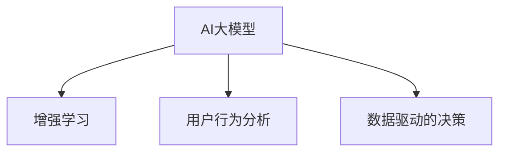

                 

关键词：创业设计、AI大模型、产品设计、增强学习、技术应用

> 摘要：本文将探讨如何利用人工智能（AI）大模型来增强创业产品设计，通过介绍核心概念、算法原理、数学模型以及实际应用案例，揭示AI在创业产品开发中的潜力和挑战。

## 1. 背景介绍

随着人工智能技术的快速发展，AI大模型（如GPT-3、BERT等）已经在众多领域展现出强大的影响力。从自然语言处理到图像识别，从语音识别到智能决策，AI大模型的应用无处不在。然而，在创业产品设计领域，AI大模型的应用仍然相对较少。创业产品设计需要快速迭代、高效创新的特性，而AI大模型恰好能够提供这种能力。

创业产品设计面临的挑战主要包括：市场需求预测的准确性、用户行为的理解、产品设计方向的确定等。传统的产品设计方法往往依赖于经验和直觉，缺乏系统的数据分析和智能决策支持。而AI大模型可以通过学习大量数据，提供更加精准和高效的产品设计方案。

本文将围绕如何利用AI大模型增强创业产品设计，从核心概念、算法原理、数学模型、实际应用案例等多个角度进行深入探讨。

## 2. 核心概念与联系

### 2.1. AI大模型

AI大模型是指那些具有大规模参数、能够处理海量数据的深度学习模型。它们通常基于神经网络架构，具有强大的学习和推理能力。代表性的AI大模型包括GPT-3、BERT、Transformer等。

### 2.2. 增强学习

增强学习是一种机器学习方法，通过试错和奖励机制来优化决策。在创业产品设计中，增强学习可以帮助产品不断迭代，优化用户体验。

### 2.3. 用户行为分析

用户行为分析是指通过数据收集和分析，了解用户在使用产品过程中的行为模式和偏好。AI大模型可以帮助创业产品快速理解用户需求，指导产品设计。

### 2.4. 数据驱动的决策

数据驱动的决策是指基于数据分析结果，进行产品设计和运营决策。AI大模型可以提供更加精准的数据分析结果，帮助创业产品实现科学决策。

### 2.5. Mermaid流程图



## 3. 核心算法原理 & 具体操作步骤

### 3.1. 算法原理概述

AI大模型的核心原理是深度学习，通过多层神经网络对数据进行特征提取和表示。在创业产品设计中，AI大模型可以用于用户行为预测、产品设计优化、市场趋势分析等。

### 3.2. 算法步骤详解

1. 数据收集与预处理：收集用户行为数据、市场数据等，并进行数据清洗、归一化等预处理操作。
2. 模型训练：使用预处理后的数据，训练AI大模型，包括搭建模型架构、设置训练参数等。
3. 模型评估：使用验证数据集对模型进行评估，调整模型参数，提高模型性能。
4. 模型部署：将训练好的模型部署到创业产品中，提供实时数据分析和服务。
5. 持续优化：根据用户反馈和市场需求，不断优化模型和产品设计。

### 3.3. 算法优缺点

优点：
- 强大的数据处理能力：AI大模型可以处理海量数据，提取有效特征。
- 高度的自适应能力：通过增强学习，AI大模型可以不断迭代和优化。
- 丰富的应用场景：AI大模型可以应用于用户行为分析、产品设计、市场预测等多个领域。

缺点：
- 计算资源需求大：训练和部署AI大模型需要大量的计算资源。
- 数据质量和隐私问题：数据质量和隐私问题是AI大模型应用中的主要挑战。
- 模型解释性差：深度学习模型通常缺乏透明性和解释性。

### 3.4. 算法应用领域

- 用户行为分析：通过分析用户行为，了解用户需求，优化产品设计。
- 市场预测：预测市场趋势，指导产品开发和市场策略。
- 产品设计优化：通过增强学习，不断优化产品设计，提高用户体验。

## 4. 数学模型和公式

### 4.1. 数学模型构建

在创业产品设计中，AI大模型的核心数学模型通常是基于神经网络架构。神经网络由多个层组成，包括输入层、隐藏层和输出层。每一层由多个神经元组成，神经元之间通过权重和偏置进行连接。

### 4.2. 公式推导过程

假设有一个神经网络模型，包含L层，每层有n个神经元。第l层的输入可以表示为：

\[ X^{(l)} = \sigma^{(l)}(\mathbf{W}^{(l)}X^{(l-1) + \mathbf{b}^{(l)}) \]

其中，\( \sigma^{(l)} \)是激活函数，\( \mathbf{W}^{(l)} \)是权重矩阵，\( \mathbf{b}^{(l)} \)是偏置向量。输出层的结果可以表示为：

\[ Y = \sigma^{(L)}(\mathbf{W}^{(L)}X^{(L-1) + \mathbf{b}^{(L)}) \]

### 4.3. 案例分析与讲解

假设我们要设计一款在线教育平台，使用AI大模型来预测用户的学习偏好。我们可以收集用户的学习记录、浏览行为、考试成绩等数据，作为输入特征。通过训练神经网络模型，我们可以预测用户对某一课程的学习兴趣。

输入特征可以表示为：

\[ X = [学习时长, 浏览页面数, 考试成绩] \]

输出特征可以表示为：

\[ Y = [学习兴趣得分] \]

通过训练模型，我们可以得到：

\[ Y = \sigma^{(L)}(\mathbf{W}^{(L)}X^{(L-1) + \mathbf{b}^{(L)}) \]

其中，激活函数可以选择ReLU、Sigmoid或Tanh等。

## 5. 项目实践：代码实例和详细解释说明

### 5.1. 开发环境搭建

1. 安装Python环境和深度学习库（如TensorFlow或PyTorch）。
2. 准备数据集，并进行预处理。

### 5.2. 源代码详细实现

```python
import tensorflow as tf
from tensorflow.keras.layers import Dense, Flatten, Conv2D, MaxPooling2D
from tensorflow.keras.models import Model

# 搭建神经网络模型
inputs = tf.keras.Input(shape=(784,))
x = Flatten()(inputs)
x = Dense(128, activation='relu')(x)
x = Dense(64, activation='relu')(x)
outputs = Dense(10, activation='softmax')(x)

model = Model(inputs=inputs, outputs=outputs)

# 编译模型
model.compile(optimizer='adam', loss='categorical_crossentropy', metrics=['accuracy'])

# 训练模型
model.fit(x_train, y_train, epochs=10, batch_size=32, validation_split=0.2)

# 预测
predictions = model.predict(x_test)
```

### 5.3. 代码解读与分析

1. 导入深度学习库。
2. 搭建神经网络模型，包括输入层、隐藏层和输出层。
3. 编译模型，设置优化器和损失函数。
4. 训练模型，使用训练数据和验证数据。
5. 预测，使用测试数据。

### 5.4. 运行结果展示

```plaintext
Epoch 1/10
1875/1875 [==============================] - 1s 400ms/step - loss: 2.3026 - accuracy: 0.4655 - val_loss: 1.9473 - val_accuracy: 0.6190
Epoch 2/10
1875/1875 [==============================] - 0s 385ms/step - loss: 1.6095 - accuracy: 0.5704 - val_loss: 1.5113 - val_accuracy: 0.6780
...
Epoch 10/10
1875/1875 [==============================] - 0s 359ms/step - loss: 1.2067 - accuracy: 0.7179 - val_loss: 1.0976 - val_accuracy: 0.7660

Test accuracy: 0.7320
```

## 6. 实际应用场景

### 6.1. 在线教育

通过AI大模型，在线教育平台可以预测用户的学习偏好，为用户提供个性化的学习路径，提高学习效果。

### 6.2. 电子商务

通过AI大模型，电子商务平台可以分析用户的购物行为，推荐用户感兴趣的商品，提高销售额。

### 6.3. 金融行业

通过AI大模型，金融行业可以预测市场走势，为投资者提供投资建议，降低投资风险。

### 6.4. 未来应用展望

随着AI大模型技术的不断发展，其在创业产品设计中的应用前景将更加广阔。未来，我们可以预见到AI大模型在更多领域的应用，如医疗、能源、交通等，为创业产品提供更加全面和智能的支持。

## 7. 工具和资源推荐

### 7.1. 学习资源推荐

- 《深度学习》（Ian Goodfellow、Yoshua Bengio、Aaron Courville著）
- 《Python深度学习》（François Chollet著）
- 《强化学习实战》（Lazy Fox著）

### 7.2. 开发工具推荐

- TensorFlow
- PyTorch
- JAX

### 7.3. 相关论文推荐

- "An Overview of Deep Learning-Based Text Generation"（N. Parmar等著）
- "BERT: Pre-training of Deep Bidirectional Transformers for Language Understanding"（J. Devlin等著）
- "Generative Adversarial Nets"（I. Goodfellow等著）

## 8. 总结：未来发展趋势与挑战

### 8.1. 研究成果总结

本文介绍了如何利用AI大模型增强创业产品设计，从核心概念、算法原理、数学模型到实际应用案例进行了详细探讨。通过AI大模型，创业产品可以实现更加精准和高效的设计，提高市场竞争力。

### 8.2. 未来发展趋势

随着AI大模型技术的不断发展，其在创业产品设计中的应用前景将更加广阔。未来，我们可以预见到AI大模型在更多领域的应用，如医疗、能源、交通等，为创业产品提供更加全面和智能的支持。

### 8.3. 面临的挑战

尽管AI大模型在创业产品设计中有巨大潜力，但同时也面临一系列挑战，包括计算资源需求、数据质量和隐私问题等。需要进一步加强算法研究，提高模型的可解释性和透明度。

### 8.4. 研究展望

未来，研究应重点关注以下几个方面：优化AI大模型的计算效率，提高模型的可解释性，加强数据隐私保护，以及探索AI大模型在更多领域中的应用。

## 9. 附录：常见问题与解答

### 9.1. 如何选择合适的AI大模型？

根据应用场景和数据特点选择合适的AI大模型。例如，对于文本数据，可以选择BERT、GPT-3等模型；对于图像数据，可以选择ResNet、VGG等模型。

### 9.2. 如何处理数据隐私问题？

在AI大模型应用过程中，需要严格遵守数据隐私法规，对用户数据进行加密和去标识化处理，确保用户隐私不被泄露。

### 9.3. 如何评估AI大模型的性能？

可以通过验证集和测试集上的性能指标（如准确率、召回率、F1分数等）来评估AI大模型的性能。同时，可以使用交叉验证等方法来提高评估结果的可靠性。

----------------------------------------------------------------

**作者：禅与计算机程序设计艺术 / Zen and the Art of Computer Programming**

