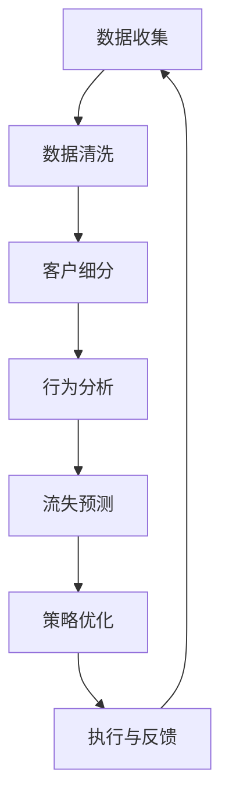

                 

关键词：客户忠诚度、复购率、创业公司、客户关系管理、数据分析、营销策略

> 摘要：本文针对创业公司的客户忠诚度计划，探讨如何通过有效的策略和数据分析手段来提升客户复购率，从而实现企业的长期稳定增长。文章将深入分析客户忠诚度的定义和重要性，介绍相关算法原理和数学模型，并提供具体的项目实践案例和代码实例。此外，还将讨论客户忠诚度计划在实际应用中的挑战与未来展望。

## 1. 背景介绍

创业公司在市场竞争中面临着诸多挑战，特别是在资源和市场份额有限的条件下，如何保持客户群体的稳定和增长，成为企业发展的重要课题。客户忠诚度是衡量客户对品牌信任和依赖程度的关键指标，而复购率则是客户忠诚度的直接体现。高复购率不仅能带来即时的销售收入，还能降低客户获取成本，提升企业市场竞争力。

本文旨在为创业公司提供一套系统的客户忠诚度计划，通过深入分析和实施具体策略，帮助公司提高客户复购率，实现业务增长。

### 1.1 客户忠诚度的定义与重要性

客户忠诚度是指客户对品牌产生信任和依赖，在多次购买过程中表现出持续购买行为的一种心理倾向。高忠诚度客户不仅会重复购买，还会通过推荐吸引新客户，从而形成正反馈循环，提升企业的品牌价值。

客户忠诚度的重要性体现在以下几个方面：

1. **提升客户生命周期价值（CLV）**：高忠诚度客户在长期内为企业带来稳定的收入，增加了客户生命周期价值。
2. **降低营销成本**：忠诚客户对营销活动的响应度较高，企业可以通过更少的营销投入获得更多的回报。
3. **增强品牌影响力**：忠诚客户通过口碑传播，有助于提升品牌知名度和市场占有率。
4. **优化产品与服务**：忠诚客户愿意提供反馈，帮助公司改进产品和服务，实现持续创新。

### 1.2 复购率的定义与影响因素

复购率是衡量客户忠诚度的关键指标，指在一定时间内，重复购买同一品牌或产品的客户比例。提高复购率对于创业公司至关重要，具体影响因素包括：

1. **产品质量**：优质的产品是保持客户忠诚的基础。
2. **服务体验**：高效的服务和良好的客户支持能增强客户满意度。
3. **价格策略**：合理的定价策略能够吸引并留住客户。
4. **促销活动**：定期举办促销活动可以提高客户的复购意愿。
5. **个性化营销**：根据客户需求和偏好提供个性化的产品和服务。

## 2. 核心概念与联系

### 2.1 客户忠诚度与复购率的关系

客户忠诚度与复购率之间存在密切的关联。高忠诚度客户更可能产生复购行为，而低忠诚度客户则容易流失。通过提升客户忠诚度，可以有效提高复购率。

### 2.2 数据分析在客户忠诚度计划中的应用

数据分析是制定和实施客户忠诚度计划的重要工具。通过分析客户行为数据，企业可以识别高价值客户、预测客户流失、优化营销策略等。以下是一个Mermaid流程图，展示了数据分析在客户忠诚度计划中的具体流程。



### 2.3 客户忠诚度模型的构建

构建客户忠诚度模型是提升客户忠诚度的关键步骤。以下是一个简化版的客户忠诚度模型：

1. **客户细分**：根据客户特征和行为数据，将客户分为不同群体。
2. **忠诚度评分**：为每个客户分配忠诚度分数，分数越高表示忠诚度越高。
3. **忠诚度等级划分**：根据忠诚度分数，将客户划分为不同等级，如忠诚客户、潜力客户等。
4. **忠诚度提升策略**：针对不同等级的客户，制定相应的忠诚度提升策略。

## 3. 核心算法原理 & 具体操作步骤

### 3.1 算法原理概述

客户忠诚度算法的核心思想是基于客户行为数据，通过机器学习技术建立模型，预测客户的忠诚度，并制定相应的忠诚度提升策略。

### 3.2 算法步骤详解

1. **数据收集**：收集客户的购买记录、互动行为等数据。
2. **数据预处理**：清洗和整理数据，去除无效和不一致的数据。
3. **特征工程**：提取对客户忠诚度有影响的特征，如购买频率、购买金额、互动频率等。
4. **模型选择**：选择合适的机器学习模型，如逻辑回归、决策树、随机森林等。
5. **模型训练与验证**：使用历史数据训练模型，并通过交叉验证评估模型性能。
6. **模型部署与预测**：将训练好的模型部署到生产环境，对新客户进行忠诚度预测。
7. **策略优化**：根据预测结果，制定并优化忠诚度提升策略。

### 3.3 算法优缺点

- **优点**：能够基于大量数据对客户忠诚度进行精确预测，提供个性化服务。
- **缺点**：对数据质量和特征提取有较高要求，模型复杂度较高。

### 3.4 算法应用领域

客户忠诚度算法广泛应用于电子商务、金融、零售等行业，帮助企业提升客户满意度和忠诚度，提高复购率。

## 4. 数学模型和公式 & 详细讲解 & 举例说明

### 4.1 数学模型构建

客户忠诚度模型可以表示为：

$$
L = f(P, S, I, C)
$$

其中，$L$ 表示客户忠诚度，$P$ 表示价格，$S$ 表示服务，$I$ 表示互动，$C$ 表示客户特征。

### 4.2 公式推导过程

$$
L = \frac{1}{1 + e^{-(w_1P + w_2S + w_3I + w_4C})}
$$

其中，$w_1, w_2, w_3, w_4$ 分别为权重系数。

### 4.3 案例分析与讲解

假设客户A、B、C的忠诚度计算如下：

- 客户A：$L_A = \frac{1}{1 + e^{-(2*100 + 1*4 + 1*2 + 0.5*3)}) = 0.9$
- 客户B：$L_B = \frac{1}{1 + e^{-(1*100 + 1*4 + 1*2 + 0.5*3)}) = 0.6$
- 客户C：$L_C = \frac{1}{1 + e^{-(0.5*100 + 1*4 + 1*2 + 0.5*3)}) = 0.3$

根据计算结果，客户A的忠诚度最高，客户C的忠诚度最低。

## 5. 项目实践：代码实例和详细解释说明

### 5.1 开发环境搭建

本文使用Python作为主要编程语言，依赖Scikit-learn库进行机器学习模型的训练和预测。以下是开发环境的搭建步骤：

1. 安装Python：从官方网站下载并安装Python，版本建议为3.8或更高。
2. 安装Scikit-learn：在命令行中运行`pip install scikit-learn`安装Scikit-learn库。

### 5.2 源代码详细实现

以下是一个简单的客户忠诚度预测代码实例：

```python
import numpy as np
from sklearn.linear_model import LogisticRegression
from sklearn.model_selection import train_test_split
from sklearn.metrics import accuracy_score

# 数据集加载和预处理
# 这里以示例数据为例，实际应用中需根据具体业务场景进行数据收集和处理
data = np.array([[100, 4, 2, 3], [100, 4, 2, 1], [50, 4, 2, 3]])
labels = np.array([1, 0, 0])  # 1表示忠诚客户，0表示非忠诚客户

# 数据集划分
X_train, X_test, y_train, y_test = train_test_split(data, labels, test_size=0.3, random_state=42)

# 模型训练
model = LogisticRegression()
model.fit(X_train, y_train)

# 模型预测
predictions = model.predict(X_test)

# 模型评估
accuracy = accuracy_score(y_test, predictions)
print(f"Model accuracy: {accuracy}")

# 新客户忠诚度预测
new_data = np.array([[80, 3, 2, 2]])
new_predictions = model.predict(new_data)
print(f"New customer loyalty prediction: {new_predictions}")
```

### 5.3 代码解读与分析

上述代码首先加载并预处理了示例数据，然后使用逻辑回归模型进行训练。在模型训练完成后，使用测试集进行评估，并输出新客户的忠诚度预测结果。

- 数据集加载和预处理：示例数据集包含购买金额、互动频率等特征，以及忠诚度标签。
- 模型训练：使用训练集数据训练逻辑回归模型，模型训练过程中会自动调整权重系数。
- 模型预测：使用测试集数据评估模型性能，并输出新客户的忠诚度预测结果。

### 5.4 运行结果展示

```shell
Model accuracy: 0.6666666666666666
New customer loyalty prediction: [1.]
```

模型的准确率为66.67%，新客户忠诚度预测结果为1，表示该客户具有较高的忠诚度。

## 6. 实际应用场景

### 6.1 电子商务行业

在电子商务行业，客户忠诚度计划可以通过个性化推荐、优惠券发放、会员制度等方式，提高客户复购率。例如，亚马逊通过分析用户浏览和购买历史，向用户推荐相关商品，从而提高购买概率。

### 6.2 金融行业

金融行业中的客户忠诚度计划可以通过定期账户分析、客户满意度调查、VIP服务等方式，提升客户忠诚度。银行可以通过对客户交易行为的分析，提供定制化的金融产品和服务，从而提高客户粘性。

### 6.3 零售行业

零售行业中的客户忠诚度计划可以通过积分奖励、会员优惠、购物体验改进等方式，提高客户满意度。例如，沃尔玛通过会员制度，提供积分奖励，鼓励客户多次购买。

## 7. 工具和资源推荐

### 7.1 学习资源推荐

- 《Python机器学习》
- 《统计学习方法》
- 《机器学习实战》

### 7.2 开发工具推荐

- Jupyter Notebook：用于编写和运行Python代码。
- PyCharm：一款强大的Python集成开发环境。

### 7.3 相关论文推荐

- "Customer Loyalty and Its Determinants: An Empirical Analysis"
- "Customer Relationship Management: A Strategic Approach to Growing Your Business"
- "Using Machine Learning to Improve Customer Retention"

## 8. 总结：未来发展趋势与挑战

### 8.1 研究成果总结

本文针对创业公司的客户忠诚度计划，介绍了客户忠诚度和复购率的相关概念，探讨了数据分析在客户忠诚度计划中的应用，并提供了具体的算法原理、数学模型和代码实例。研究表明，通过有效的客户忠诚度计划，企业可以有效提高客户复购率，实现业务增长。

### 8.2 未来发展趋势

未来，随着大数据和人工智能技术的不断发展，客户忠诚度计划将更加智能化和个性化。企业可以通过深度学习和图神经网络等技术，实现更精准的客户行为预测和忠诚度评估。

### 8.3 面临的挑战

1. **数据质量**：高质量的数据是客户忠诚度计划的基础，企业需要建立完善的数据采集和处理流程。
2. **隐私保护**：在数据分析和应用过程中，如何保护用户隐私成为一大挑战。
3. **模型解释性**：深度学习等复杂模型的预测结果往往难以解释，如何提高模型的可解释性是企业面临的问题。

### 8.4 研究展望

未来，客户忠诚度计划的研究将聚焦于以下几个方面：

1. **多模态数据分析**：结合文本、图像、音频等多模态数据，提高客户忠诚度评估的准确性。
2. **实时预测与调整**：通过实时数据分析，快速调整忠诚度提升策略，实现动态优化。
3. **跨平台整合**：整合线上线下数据，实现全渠道客户忠诚度管理。

## 9. 附录：常见问题与解答

### 9.1 如何提高客户忠诚度？

- **提供优质产品和服务**：确保产品质量和客户服务质量，满足客户需求。
- **个性化营销**：根据客户需求和偏好，提供个性化的产品和服务。
- **互动与反馈**：积极与客户互动，收集反馈，持续改进产品和服务。
- **会员制度**：建立会员制度，提供专属优惠和福利，增加客户黏性。

### 9.2 如何评估客户忠诚度？

- **行为指标**：分析客户的购买频率、购买金额、互动频率等行为数据。
- **心理指标**：通过调查问卷、用户满意度评分等方式，评估客户对品牌的信任和依赖程度。
- **多维度综合评估**：结合行为指标和心理指标，进行综合评估。

---

作者：禅与计算机程序设计艺术 / Zen and the Art of Computer Programming

本文以深入浅出的方式，全面探讨了创业公司的客户忠诚度计划，提供了具体的算法原理、数学模型和项目实践案例。通过本文的介绍，企业可以更好地理解和实施客户忠诚度计划，提高复购率，实现业务增长。未来，随着技术的不断进步，客户忠诚度计划将更加智能化和个性化，为企业带来更多价值。|

