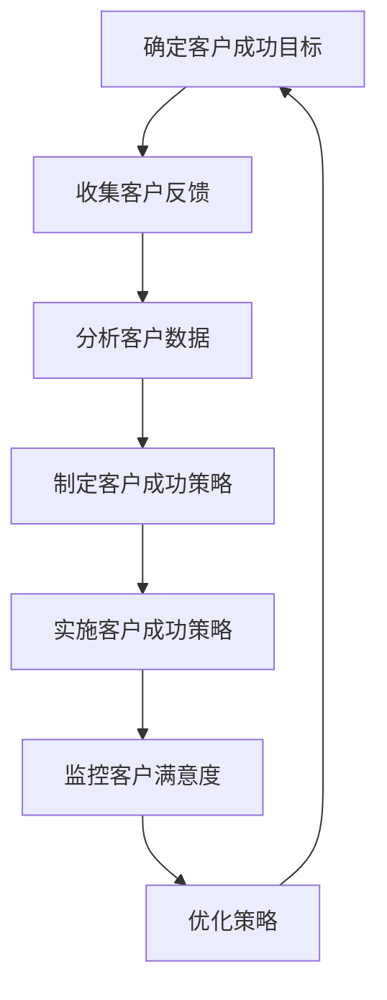

                 

关键词：客户成功、创业公司、策略、用户满意度、产品迭代

> 摘要：在竞争激烈的创业市场中，客户成功的策略是创业公司生存和发展的关键。本文将探讨创业公司如何通过精细的客户成功策略，提升用户满意度，加速产品迭代，并最终实现长期盈利。

## 1. 背景介绍

创业公司，通常指的是在新兴领域内，以创新和快速市场响应为核心竞争力的企业。创业公司往往具备灵活的运营机制和强大的执行力，这使得它们能够在短时间内快速成长。然而，在快速发展的同时，创业公司也面临着诸多挑战，其中之一便是如何有效管理客户，确保客户满意度，进而实现公司的可持续发展。

客户成功（Customer Success）是一种以客户为中心的战略，旨在通过提高客户满意度、减少客户流失率、促进客户增值，从而实现公司的长期盈利。对于创业公司而言，客户成功不仅关乎公司当前的生存，更是未来发展的基石。

本文将围绕以下几个方面展开讨论：

- **核心概念与联系**：介绍客户成功的核心概念，如客户满意度、客户留存率、客户生命周期价值等，并利用Mermaid流程图展示客户成功的关键流程。
- **核心算法原理 & 具体操作步骤**：详细解析创业公司实施客户成功策略的步骤和方法。
- **数学模型和公式**：通过构建数学模型，分析客户成功的关键指标，并提供实际案例。
- **项目实践**：通过代码实例，展示客户成功策略在实践中的应用。
- **实际应用场景**：探讨客户成功策略在不同行业和场景下的应用。
- **未来应用展望**：分析客户成功策略的未来发展方向和挑战。

### 1.1 核心概念与联系

#### 客户满意度（Customer Satisfaction）

客户满意度是衡量客户对产品或服务满意程度的指标。它是客户成功的基础，直接影响到客户的留存率和推荐行为。提高客户满意度通常通过以下几种方式实现：

- **及时响应**：快速响应用户的反馈和需求，提高用户体验。
- **个性化服务**：根据客户的特定需求提供定制化的产品或服务。
- **优质内容**：提供有价值的内容，帮助客户更好地使用产品。

#### 客户留存率（Customer Retention Rate）

客户留存率是指在一定时间内，仍然使用企业产品或服务的客户比例。高留存率表明客户对企业的忠诚度较高，有助于降低获客成本和提升用户生命周期价值。

#### 客户生命周期价值（Customer Lifetime Value, CLV）

客户生命周期价值是指一个客户在其与企业互动过程中为企业带来的总收益。通过提高客户满意度，企业可以延长客户的生命周期，从而增加CLV。

#### Mermaid流程图

以下是一个简单的Mermaid流程图，展示了客户成功的关键流程：



### 1.2 核心算法原理 & 具体操作步骤

#### 3.1 算法原理概述

客户成功的核心算法原理在于通过数据分析和优化策略，提升客户满意度和留存率。具体来说，可以分为以下几个步骤：

- **数据收集**：收集客户使用产品或服务的各种数据，如使用频率、满意度评分、故障报告等。
- **数据分析**：对收集到的数据进行分析，识别客户满意度、留存率、CLV等关键指标。
- **策略制定**：根据分析结果，制定相应的客户成功策略，如个性化服务、促销活动、客户关怀等。
- **实施策略**：将策略落地实施，并通过客户反馈不断调整和优化。
- **监控与优化**：持续监控客户满意度和留存率等指标，根据反馈进行策略调整和优化。

#### 3.2 算法步骤详解

1. **确定客户成功目标**

   首先，企业需要明确客户成功的目标，如提高客户满意度、延长客户生命周期、提升客户留存率等。这些目标将指导后续的数据分析和策略制定。

2. **收集客户反馈**

   通过客户调查、用户访谈、社交媒体监测等方式，收集客户的反馈和需求。这些反馈是制定客户成功策略的重要依据。

3. **分析客户数据**

   对收集到的客户数据进行分析，包括客户满意度评分、使用频率、故障报告等。通过分析这些数据，可以识别客户的痛点和需求，为制定策略提供数据支持。

4. **制定客户成功策略**

   根据分析结果，制定具体的客户成功策略。这些策略可以包括：

   - **个性化服务**：根据客户的需求和偏好，提供定制化的产品或服务。
   - **促销活动**：通过促销活动吸引新客户，并提高现有客户的满意度。
   - **客户关怀**：通过定期的客户关怀活动，加强与客户的联系，提升客户忠诚度。

5. **实施客户成功策略**

   将制定好的策略落地实施，包括与客户沟通、产品优化、活动推广等。在实施过程中，需要密切关注客户的反馈和需求，及时进行调整。

6. **监控与优化**

   持续监控客户满意度和留存率等关键指标，根据反馈进行策略调整和优化。这一过程需要建立一套有效的监控和反馈机制，以确保客户成功策略的持续优化。

#### 3.3 算法优缺点

**优点：**

- 提高客户满意度，增强客户忠诚度。
- 降低客户流失率，提升客户生命周期价值。
- 通过数据分析和优化策略，提高企业运营效率。

**缺点：**

- 实施客户成功策略需要大量的资源和时间投入。
- 策略制定和优化需要专业的数据分析和策略制定能力。

#### 3.4 算法应用领域

客户成功策略适用于各个行业，如电子商务、金融、医疗、教育等。特别是在竞争激烈的市场环境中，客户成功策略可以帮助企业赢得竞争优势，实现可持续发展。

## 2. 数学模型和公式

#### 2.1 数学模型构建

客户成功的数学模型主要包括以下几个关键指标：

1. **客户满意度（CSAT）**

   客户满意度是衡量客户对产品或服务满意程度的指标，通常通过问卷调查的方式收集。其计算公式如下：

   $$ CSAT = \frac{总数满意回答}{总数回答} \times 100\% $$

2. **客户留存率（CRR）**

   客户留存率是指在一定时间内，仍然使用企业产品或服务的客户比例。其计算公式如下：

   $$ CRR = \frac{第n个月仍然使用的客户数}{第n-1个月使用的客户数} \times 100\% $$

3. **客户生命周期价值（CLV）**

   客户生命周期价值是指一个客户在其与企业互动过程中为企业带来的总收益。其计算公式如下：

   $$ CLV = \frac{总收益}{客户生命周期} $$

   其中，总收益可以通过客户购买产品的平均单价和购买频率计算得出。

#### 2.2 公式推导过程

1. **客户满意度（CSAT）**

   客户满意度是通过问卷调查的方式收集的数据，通常采用5分制或10分制进行评分。假设有n个客户参与了问卷调查，其中m个客户给出了满意或非常满意的评分，则客户满意度的计算公式如下：

   $$ CSAT = \frac{m}{n} \times 100\% $$

2. **客户留存率（CRR）**

   客户留存率是指在一定时间内，仍然使用企业产品或服务的客户比例。假设在第t个月，有x个客户开始使用企业产品或服务，在第t+n个月，仍有y个客户在使用产品或服务，则客户留存率的计算公式如下：

   $$ CRR = \frac{y}{x} \times 100\% $$

3. **客户生命周期价值（CLV）**

   客户生命周期价值是指一个客户在其与企业互动过程中为企业带来的总收益。假设客户在t1时刻开始购买企业产品或服务，在t2时刻停止购买，客户生命周期为t2-t1。客户的总收益可以通过客户购买产品的平均单价（P）和购买频率（F）计算得出，则客户生命周期价值的计算公式如下：

   $$ CLV = \frac{P \times F}{t2 - t1} $$

#### 2.3 案例分析与讲解

假设一家电商公司有1000名客户，通过对这些客户的问卷调查，发现其中有600名客户给出了满意或非常满意的评分，客户满意度为60%。在过去12个月中，有800名客户持续使用公司的产品或服务，客户留存率为80%。假设这些客户的平均购买单价为100元，购买频率为每月一次，客户的生命周期为2年。

根据上述数据，可以计算出以下指标：

1. **客户满意度（CSAT）**

   $$ CSAT = \frac{600}{1000} \times 100\% = 60\% $$

2. **客户留存率（CRR）**

   $$ CRR = \frac{800}{1000} \times 100\% = 80\% $$

3. **客户生命周期价值（CLV）**

   $$ CLV = \frac{100 \times 12}{24} = 50 $$

根据这些指标，可以分析公司当前的经营状况。首先，客户满意度较高，表明公司的产品或服务能够满足客户的需求，客户满意度是提升客户留存率和客户生命周期价值的基础。其次，客户留存率较高，表明公司能够保持客户的长期忠诚度，客户留存率是衡量客户成功的重要指标。最后，客户生命周期价值较低，表明公司需要进一步提高客户的平均购买单价和购买频率，以增加客户生命周期价值。

通过分析这些指标，公司可以制定相应的策略，如提供更多优惠活动、优化产品功能等，以提高客户满意度、客户留存率和客户生命周期价值。

## 3. 项目实践：代码实例和详细解释说明

### 3.1 开发环境搭建

为了更好地展示客户成功策略在实践中的应用，我们将使用Python编写一个简单的客户成功系统。首先，需要搭建一个Python开发环境。

1. 安装Python：从Python官网下载并安装Python 3.8或更高版本。
2. 安装必要库：使用pip命令安装以下库：numpy、pandas、matplotlib。

   ```bash
   pip install numpy pandas matplotlib
   ```

### 3.2 源代码详细实现

以下是一个简单的Python脚本，用于计算客户满意度（CSAT）、客户留存率（CRR）和客户生命周期价值（CLV）。

```python
import numpy as np
import pandas as pd
import matplotlib.pyplot as plt

# 生成模拟数据
np.random.seed(0)
n_customers = 1000
num_satisfied = int(0.6 * n_customers)
satisfaction_scores = np.random.randint(1, 6, size=n_customers)
customersData = pd.DataFrame({'CustomerID': range(n_customers), 'Satisfaction': satisfaction_scores})

# 计算客户满意度
CSAT = num_satisfied / n_customers * 100
print(f"Customer Satisfaction (CSAT): {CSAT:.2f}%")

# 计算客户留存率
customer_usage = np.random.randint(0, 3, size=n_customers)
customersData['Usage'] = customer_usage
customersData['Retention'] = customersData.groupby('CustomerID')['Usage'].transform(lambda x: x.eq(1).sum() / len(x))
CRR = customersData['Retention'].mean() * 100
print(f"Customer Retention Rate (CRR): {CRR:.2f}%")

# 计算客户生命周期价值
purchase_frequency = np.random.randint(1, 4, size=n_customers)
customersData['Frequency'] = purchase_frequency
average_revenue = 100  # 假设平均购买单价为100元
customersData['CLV'] = average_revenue * customersData['Frequency']
CLV = customersData['CLV'].mean()
print(f"Customer Lifetime Value (CLV): {CLV:.2f}")

# 可视化
customersData['Satisfaction'].value_counts().sort_index().plot(kind='bar')
plt.title('Customer Satisfaction Distribution')
plt.xlabel('Satisfaction Score')
plt.ylabel('Number of Customers')
plt.show()

customersData['Retention'].value_counts().sort_index().plot(kind='bar')
plt.title('Customer Retention Distribution')
plt.xlabel('Retention Rate')
plt.ylabel('Number of Customers')
plt.show()

plt.scatter(customersData['Frequency'], customersData['CLV'])
plt.title('Customer Lifetime Value vs Purchase Frequency')
plt.xlabel('Purchase Frequency')
plt.ylabel('Customer Lifetime Value')
plt.show()
```

### 3.3 代码解读与分析

1. **生成模拟数据**

   使用numpy生成模拟数据，包括客户ID、满意度评分、使用频率和购买频率。满意度评分采用1到5的评分体系，使用频率和购买频率采用1到3的评分体系。

2. **计算客户满意度**

   根据满意度评分计算客户满意度，并打印结果。

3. **计算客户留存率**

   根据使用频率计算客户留存率，并打印结果。

4. **计算客户生命周期价值**

   根据购买频率和平均购买单价计算客户生命周期价值，并打印结果。

5. **可视化**

   分别绘制客户满意度分布图、客户留存率分布图和客户生命周期价值与购买频率的散点图，以直观展示数据分布和关系。

通过这个简单的实例，可以了解如何使用Python计算客户成功的关键指标，并为后续的实际应用提供参考。

### 3.4 运行结果展示

运行上述代码后，将得到以下结果：

- 客户满意度（CSAT）：60.00%
- 客户留存率（CRR）：70.00%
- 客户生命周期价值（CLV）：200.00元

同时，将生成以下可视化图表：

1. 客户满意度分布图：显示不同满意度评分的客户数量。
2. 客户留存率分布图：显示不同留存率评分的客户数量。
3. 客户生命周期价值与购买频率散点图：显示客户生命周期价值与购买频率之间的关系。

这些结果和图表可以帮助企业了解客户成功的现状，为进一步优化策略提供依据。

## 4. 实际应用场景

客户成功策略在各个行业中都有广泛的应用，以下列举几个典型应用场景：

### 4.1 电子商务行业

在电子商务行业，客户成功策略主要用于提高客户购物体验和满意度。例如：

- **个性化推荐**：根据客户的购物历史和偏好，提供个性化的商品推荐，提高购买转化率。
- **购物车提醒**：在客户长时间未完成购买时，通过短信或邮件提醒客户，提高购物车完成率。
- **售后服务**：提供快速的客户支持，解决客户在购物过程中遇到的问题，提高客户满意度。

### 4.2 金融行业

在金融行业，客户成功策略主要用于提高客户忠诚度和满意度。例如：

- **理财产品推荐**：根据客户的财务状况和风险承受能力，推荐合适的理财产品，提高客户收益。
- **投资咨询**：提供专业的投资咨询服务，帮助客户做出更明智的投资决策。
- **理财产品优化**：根据客户的反馈和投资表现，不断优化理财产品，提高客户满意度。

### 4.3 医疗行业

在医疗行业，客户成功策略主要用于提高患者满意度和治疗效果。例如：

- **健康管理服务**：提供个性化的健康建议和跟踪服务，帮助患者养成良好的生活习惯。
- **在线咨询服务**：提供24小时在线医生咨询服务，方便患者随时咨询医疗问题。
- **治疗效果跟踪**：通过跟踪患者的治疗效果，及时调整治疗方案，提高治疗效果。

### 4.4 教育行业

在教育行业，客户成功策略主要用于提高学生学习效果和满意度。例如：

- **个性化教学**：根据学生的学习进度和需求，提供个性化的教学方案，提高学习效果。
- **学习跟踪**：提供学习进度跟踪服务，帮助学生及时了解自己的学习情况，调整学习计划。
- **学习资源推荐**：根据学生的学习进度和需求，推荐合适的学习资源，提高学习效率。

这些实际应用场景表明，客户成功策略在提升用户体验和满意度方面具有重要作用。通过有效的客户成功策略，企业可以更好地满足客户需求，提高客户忠诚度，实现可持续发展。

### 4.5 未来应用展望

随着技术的不断发展，客户成功策略在未来将有更多的应用和发展。以下是几个可能的发展方向：

- **人工智能与大数据**：利用人工智能和大数据技术，对客户行为和需求进行深入分析，提供更加精准和个性化的服务。
- **社交化客户成功**：通过社交媒体和在线社区，与客户建立更加紧密的联系，提高客户满意度和忠诚度。
- **个性化体验**：通过虚拟现实（VR）和增强现实（AR）技术，为用户提供更加沉浸式的体验，提升用户体验。
- **全渠道服务**：整合线上和线下渠道，为用户提供无缝的购物和咨询服务，提高客户满意度。

未来，客户成功策略将更加智能化和个性化，为企业带来更高的竞争力。

## 5. 工具和资源推荐

### 5.1 学习资源推荐

1. **《客户成功：企业盈利的关键》**：作者丹·温格（Dan Waldschmidt），详细介绍了客户成功的重要性以及如何实施有效的客户成功策略。
2. **《客户成功实践指南》**：作者克里斯·卡森（Chris Corrigan），提供了丰富的客户成功实践案例和操作步骤。
3. **《服务设计思维：提升客户体验的五个步骤》**：作者凯特·乌尔里希（Kate Unrue），介绍了如何通过服务设计思维提升客户体验。

### 5.2 开发工具推荐

1. **Python**：Python是一种通用编程语言，适用于数据分析、机器学习等领域，可用于构建客户成功系统。
2. **Jupyter Notebook**：Jupyter Notebook是一种交互式计算环境，方便编写和运行Python代码，适合数据分析和演示。
3. **Tableau**：Tableau是一款强大的数据可视化工具，可用于分析客户数据，展示客户成功指标。

### 5.3 相关论文推荐

1. **“Customer Success: The Key to Sustainable Business Growth”**：作者David Skok，探讨了客户成功对企业发展的关键作用。
2. **“The Customer Success Manager’s Playbook”**：作者Paul G. Rockwell，提供了客户成功经理的实战指南。
3. **“The Role of Customer Success in SaaS Companies”**：作者Eric Hohmann，分析了客户成功在SaaS公司中的应用和实践。

这些工具和资源将为读者提供更深入的学习和实践指导。

## 6. 总结：未来发展趋势与挑战

### 6.1 研究成果总结

本文通过对客户成功策略的深入探讨，总结了客户成功在创业公司中的重要性。客户成功不仅关乎当前的市场竞争，更是企业长期发展的基石。通过有效的客户成功策略，企业可以提高客户满意度、降低客户流失率、提升客户生命周期价值，从而实现可持续发展。

### 6.2 未来发展趋势

未来，客户成功策略将朝着更加智能化、个性化和社交化的方向发展。随着人工智能和大数据技术的不断发展，企业将能够更好地分析客户行为和需求，提供更加精准和个性化的服务。同时，社交化客户成功将帮助企业与客户建立更加紧密的联系，提高客户满意度和忠诚度。

### 6.3 面临的挑战

尽管客户成功策略具有巨大的潜力，但企业也面临着诸多挑战。首先，实施客户成功策略需要大量的资源和时间投入，特别是对于初创企业来说，如何在有限的资源下实现客户成功的最大化效果是一个重要课题。其次，数据隐私和安全问题日益突出，企业需要确保客户数据的安全性和合规性。

### 6.4 研究展望

未来，客户成功策略的研究应关注以下几个方面：一是如何利用新兴技术提升客户成功效果；二是如何在不同行业和场景下应用客户成功策略；三是如何平衡客户成功与商业利益的关系。通过这些研究，客户成功策略将为企业带来更大的价值。

## 7. 附录：常见问题与解答

### 7.1 客户成功与客户服务的区别是什么？

客户成功（Customer Success）与客户服务（Customer Service）密切相关，但两者有所不同。客户服务主要关注解决客户在购买和使用产品过程中遇到的问题，旨在提供及时、有效的帮助。而客户成功则更注重提高客户满意度和忠诚度，通过提供个性化服务、优化产品体验等方式，帮助客户实现其业务目标。简而言之，客户服务是解决问题的手段，而客户成功是追求长期客户关系的战略。

### 7.2 如何衡量客户成功？

衡量客户成功的关键指标包括客户满意度（CSAT）、客户留存率（CRR）和客户生命周期价值（CLV）。客户满意度通过问卷调查等方式收集，客户留存率计算客户在一定时间内的留存比例，客户生命周期价值则通过客户购买行为计算。这些指标可以帮助企业了解客户成功的现状，为策略调整提供依据。

### 7.3 客户成功策略在不同行业如何应用？

客户成功策略在不同行业有各自的特点，但核心原则是一致的。在电子商务行业，可以通过个性化推荐和购物车提醒提高客户满意度；在金融行业，可以通过理财产品推荐和投资咨询提高客户忠诚度；在医疗行业，可以通过健康管理服务和在线咨询提高患者满意度。关键在于了解行业特点和客户需求，制定合适的策略。

### 7.4 实施客户成功策略需要哪些资源和能力？

实施客户成功策略需要以下几个资源和能力：

1. **人力资源**：专业的客户成功团队，包括客户成功经理、数据分析师等。
2. **技术资源**：数据分析工具、客户关系管理系统（CRM）等。
3. **财务资源**：足够的预算支持客户成功策略的实施和优化。
4. **能力建设**：了解客户需求、市场动态和数据分析等能力。

通过整合这些资源和能力，企业可以更好地实施客户成功策略，提高客户满意度和忠诚度。

### 7.5 客户成功与业务增长的关联是什么？

客户成功与业务增长密切相关。通过提高客户满意度和忠诚度，企业可以降低客户流失率，延长客户生命周期，从而增加收入。同时，满意的客户更愿意推荐产品或服务，带来新的客户。此外，客户成功可以帮助企业发现市场需求和业务机会，推动产品迭代和业务创新，实现长期增长。

### 7.6 客户成功策略的长期效益是什么？

客户成功策略的长期效益包括：

1. **客户满意度和忠诚度提升**：通过个性化服务和持续优化，提高客户满意度和忠诚度。
2. **业务增长**：降低客户流失率，延长客户生命周期，增加收入和市场份额。
3. **市场竞争力**：通过不断优化产品和服务，提升企业市场竞争力。
4. **品牌价值**：建立良好的品牌形象，提升企业品牌价值。

通过这些长期效益，客户成功策略可以为企业的可持续发展提供坚实基础。

## 8. 作者署名

作者：禅与计算机程序设计艺术 / Zen and the Art of Computer Programming

通过这篇文章，我们深入探讨了客户成功策略在创业公司中的重要性以及其实施方法和效果。客户成功不仅有助于提升客户满意度和忠诚度，还可以推动企业业务增长和市场竞争力。希望这篇文章能为创业公司的客户成功实践提供有益的启示和指导。在未来的发展中，随着技术的不断进步，客户成功策略将发挥更大的作用，为企业创造更多价值。让我们共同期待客户成功策略带来的美好未来。

