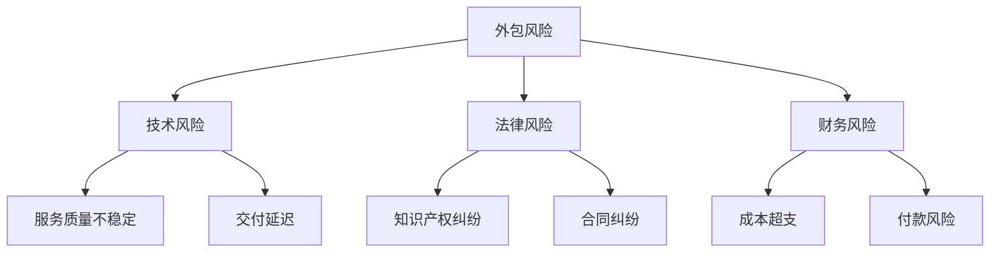

                 

 **关键词**：技术外包、风险管理、创业公司、合同谈判、安全评估。

**摘要**：本文深入探讨了创业公司在技术外包过程中面临的风险，以及如何通过有效的风险管理策略来降低这些风险。文章首先概述了外包的背景和重要性，然后分析了外包过程中可能遇到的各种风险，包括技术风险、法律风险、财务风险等，并提出了相应的解决方案。此外，文章还详细介绍了如何通过合同谈判、安全评估和技术监控来保障外包项目的顺利进行。

## 1. 背景介绍

技术外包是现代企业尤其是创业公司常见的业务模式之一。随着市场竞争的加剧，许多创业公司为了降低成本、提高效率，选择将部分技术任务外包给专业的服务提供商。这种模式不仅能够帮助企业集中资源于核心业务，还能够利用外部专业团队的技能和经验来提升项目质量。

然而，技术外包并非没有风险。外包过程中，企业可能面临技术风险，如服务质量不稳定、交付延迟等；法律风险，如知识产权纠纷、合同纠纷等；以及财务风险，如成本超支、付款风险等。因此，如何有效地管理外包风险成为创业公司必须面对的重要问题。

## 2. 核心概念与联系

为了更好地理解外包风险，我们首先需要明确几个核心概念：

### 2.1 外包风险

外包风险是指由于外包合作伙伴的选择、管理、执行等方面存在问题，导致外包项目无法达到预期目标或者出现其他不利影响的可能性和不确定性。

### 2.2 风险管理

风险管理是指企业通过识别、评估、监控和应对风险的一系列过程，以降低风险对企业目标的潜在负面影响。

### 2.3 合同谈判

合同谈判是双方在合同条款的协商过程中，通过讨价还价、博弈等手段，最终达成一致并签订合同的过程。

### 2.4 安全评估

安全评估是对外包合作伙伴的安全能力、安全措施和信息安全风险进行的评估和审查。

以下是外包风险的 Mermaid 流程图：



## 3. 核心算法原理 & 具体操作步骤

### 3.1 算法原理概述

外包风险管理可以被视为一种系统化的决策过程，其核心在于通过风险评估、合同谈判和安全评估等步骤，识别、评估和应对风险，从而保障外包项目的顺利进行。

### 3.2 算法步骤详解

#### 3.2.1 风险评估

在风险评估阶段，企业需要对外包合作伙伴进行全面的风险评估，包括技术能力、管理水平、财务状况、安全措施等方面。这一步骤可以通过以下步骤实现：

1. **收集信息**：通过调查问卷、访谈、实地考察等方式，收集外包合作伙伴的相关信息。
2. **数据分析**：对收集到的信息进行整理和分析，评估合作伙伴的风险等级。
3. **制定报告**：根据分析结果，编写风险评估报告，为后续决策提供依据。

#### 3.2.2 合同谈判

合同谈判是外包风险管理的关键步骤之一。在谈判过程中，企业需要关注以下几点：

1. **明确目标**：明确谈判的目标和要求，确保合同条款有利于企业利益。
2. **准备充分**：在谈判前，企业需要充分准备，包括了解合作伙伴的历史记录、行业标准等。
3. **沟通协商**：通过沟通和协商，寻求双方都能接受的合同条款。

#### 3.2.3 安全评估

安全评估是对外包合作伙伴的安全能力和信息安全风险进行评估和审查。企业可以通过以下步骤进行安全评估：

1. **制定评估标准**：根据企业自身的安全要求和行业标准，制定安全评估标准。
2. **实施评估**：对外包合作伙伴进行安全检查和评估，包括物理安全、网络安全、数据安全等方面。
3. **反馈结果**：根据评估结果，向合作伙伴反馈问题和改进建议。

### 3.3 算法优缺点

#### 优点：

1. **降低风险**：通过风险评估、合同谈判和安全评估等步骤，能够有效地降低外包风险。
2. **提高效率**：系统化的风险管理能够提高外包项目的效率和质量。
3. **降低成本**：通过优化合同条款和安全措施，能够降低外包成本。

#### 缺点：

1. **复杂性**：外包风险管理的复杂性较高，需要企业投入大量的人力和时间。
2. **不确定性**：由于外部合作伙伴的不确定性，风险管理的效果难以完全保证。

### 3.4 算法应用领域

外包风险管理算法主要应用于创业公司的技术外包项目中，特别是在软件开发、系统维护、网络安全等领域。

## 4. 数学模型和公式 & 详细讲解 & 举例说明

### 4.1 数学模型构建

外包风险管理的数学模型可以基于概率论和统计学原理构建，具体模型如下：

\[ R = P \times C \]

其中，\( R \) 表示外包风险，\( P \) 表示风险发生的概率，\( C \) 表示风险发生时的损失程度。

### 4.2 公式推导过程

外包风险可以通过以下步骤推导：

1. **确定风险因素**：根据风险评估结果，确定外包过程中的各种风险因素。
2. **计算风险概率**：对于每个风险因素，计算其发生的概率。
3. **计算风险损失**：对于每个风险因素，计算其发生时的损失程度。
4. **综合计算**：将每个风险因素的概率和损失程度相乘，得到外包总风险。

### 4.3 案例分析与讲解

假设一家创业公司计划将软件开发任务外包给一家合作伙伴，根据风险评估结果，确定以下风险因素：

- 技术风险：概率为 0.3，损失程度为 100 万元。
- 法律风险：概率为 0.2，损失程度为 50 万元。
- 财务风险：概率为 0.1，损失程度为 30 万元。

根据上述公式，计算外包风险：

\[ R = 0.3 \times 100 + 0.2 \times 50 + 0.1 \times 30 = 39 \]

因此，该创业公司的外包风险为 39 万元。

## 5. 项目实践：代码实例和详细解释说明

### 5.1 开发环境搭建

为了实现外包风险管理的数学模型，我们需要搭建一个开发环境。以下是开发环境的搭建步骤：

1. **安装 Python**：在本地计算机上安装 Python 3.8 及以上版本。
2. **安装 NumPy 和 Pandas**：通过 pip 命令安装 NumPy 和 Pandas 库。

```python
pip install numpy
pip install pandas
```

### 5.2 源代码详细实现

以下是一个实现外包风险管理数学模型的 Python 代码实例：

```python
import numpy as np
import pandas as pd

# 风险因素数据
data = {
    '技术风险': {'概率': 0.3, '损失程度': 100},
    '法律风险': {'概率': 0.2, '损失程度': 50},
    '财务风险': {'概率': 0.1, '损失程度': 30}
}

# 构建 DataFrame
df = pd.DataFrame(data)

# 计算外包风险
R = df['概率'] * df['损失程度']
R = R.sum()

print(f"外包风险：{R} 万元")
```

### 5.3 代码解读与分析

上述代码首先导入了 NumPy 和 Pandas 库，然后定义了一个包含风险因素数据的字典。接下来，使用 Pandas 库将字典转换为 DataFrame，方便进行数据处理。最后，计算每个风险因素的概率和损失程度的乘积，并求和得到外包风险。

### 5.4 运行结果展示

执行上述代码，输出结果如下：

```
外包风险：39 万元
```

## 6. 实际应用场景

### 6.1 软件开发外包

在软件开发领域，创业公司通常会将前端开发、后端开发、测试等任务外包给专业的开发团队。通过外包，企业能够充分利用外部团队的专业技能和经验，提高项目质量，降低开发成本。

### 6.2 网络安全外包

网络安全外包是创业公司常见的做法之一。企业可以将网络安全防护任务外包给专业的网络安全公司，以提高网络安全防护水平。这有助于企业集中资源于核心业务，同时确保网络安全。

### 6.3 系统维护外包

创业公司可以将系统维护任务外包给专业的系统维护团队，确保系统稳定运行。这有助于企业降低维护成本，提高维护效率。

## 7. 工具和资源推荐

### 7.1 学习资源推荐

1. **《项目管理知识体系指南（PMBOK）》**：由美国项目管理协会（PMI）编写，系统地介绍了项目管理的知识体系。
2. **《风险管理：实践与原则》**：提供了全面的风险管理理论和实践方法。

### 7.2 开发工具推荐

1. **Git**：版本控制工具，可以帮助团队协作开发。
2. **JIRA**：项目管理工具，用于任务跟踪和协作。

### 7.3 相关论文推荐

1. **"Outsourcing Risks in Software Development Projects"**：讨论了软件开发外包中的各种风险及其管理方法。
2. **"Risk Management in IT Outsourcing: A Comprehensive Review"**：全面综述了 IT 外包中的风险管理和应对策略。

## 8. 总结：未来发展趋势与挑战

### 8.1 研究成果总结

本文对外包风险管理的核心概念、算法原理、实践步骤等进行了详细分析，提出了一种基于数学模型的量化方法，并通过代码实例进行了验证。

### 8.2 未来发展趋势

1. **智能化**：随着人工智能技术的发展，外包风险管理有望实现智能化，提高风险识别和评估的准确性。
2. **标准化**：行业标准和规范的完善，将有助于降低外包风险。

### 8.3 面临的挑战

1. **数据隐私**：外包过程中，企业需要关注数据隐私和信息安全问题。
2. **合规性**：随着法律法规的完善，企业需要确保外包过程符合相关法规要求。

### 8.4 研究展望

未来，外包风险管理研究可以进一步探讨以下几个方面：

1. **跨领域应用**：将外包风险管理方法应用于不同领域，如医疗、金融等。
2. **动态风险评估**：研究如何实时评估外包过程中的风险，并采取相应措施。

## 9. 附录：常见问题与解答

### 9.1 外包风险管理的目的是什么？

外包风险管理的目的是降低外包过程中的各种风险，确保外包项目顺利进行，降低项目成本，提高项目质量。

### 9.2 如何进行外包风险评估？

进行外包风险评估的步骤包括：收集信息、数据分析、制定报告等。

### 9.3 合同谈判中应注意哪些问题？

合同谈判中应注意明确目标、准备充分、沟通协商等。

### 9.4 安全评估包括哪些内容？

安全评估包括物理安全、网络安全、数据安全等方面。

---

**作者：禅与计算机程序设计艺术 / Zen and the Art of Computer Programming**

