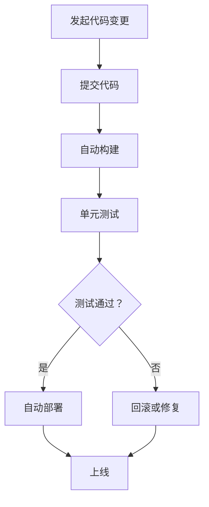
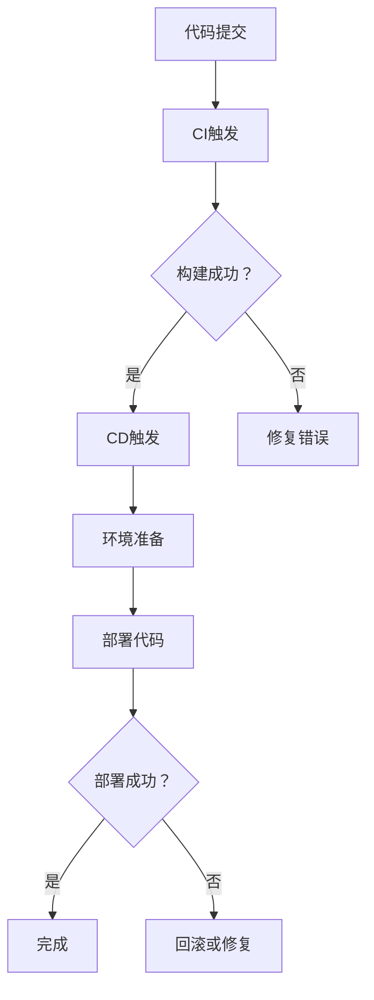

                 

随着科技创业公司的崛起，持续集成（CI）与持续部署（CD）已成为这些公司确保产品质量、缩短开发周期、提高团队协作效率的关键技术。本文旨在探讨创业公司如何在实际操作中有效实施CI/CD，从而加速产品迭代和市场响应速度。本文结构如下：

## 1. 背景介绍

在当今快速变化的市场环境中，创业公司面临巨大的竞争压力，必须以高效的产品开发流程来保持竞争力。持续集成与持续部署作为敏捷开发的重要组成部分，能够帮助企业快速发现并修复代码中的错误，确保产品质量和稳定性。

## 2. 核心概念与联系

持续集成（Continuous Integration，CI）指的是软件开发过程中，自动将开发者提交的代码合并到共享的主干分支，并通过自动化测试确保新代码的集成不会破坏现有功能。持续部署（Continuous Deployment，CD）则进一步将代码部署到生产环境，实现自动化的上线流程。

### 2.1. CI/CD流程



### 2.2. CI与CD的关系

持续集成是持续部署的基础，CI确保了代码质量，而CD则实现了快速、可靠地发布。

## 3. 核心算法原理 & 具体操作步骤

### 3.1 算法原理概述

CI/CD的核心在于自动化流程，包括代码构建、测试、部署等步骤。通过自动化工具，如Jenkins、Travis CI等，实现流程的快速、高效执行。

### 3.2 算法步骤详解

#### 3.2.1 环境准备

- 选择合适的CI/CD工具（如Jenkins、GitLab CI等）。
- 配置代码仓库（如GitHub、GitLab等）。

#### 3.2.2 构建代码

- 拉取最新的代码到构建环境中。
- 执行构建脚本，生成可执行的二进制文件。

#### 3.2.3 执行测试

- 运行单元测试、集成测试等，确保代码质量。
- 处理测试失败，进行代码回滚或修复。

#### 3.2.4 自动部署

- 通过自动化脚本将代码部署到测试环境或生产环境。
- 配置部署脚本，确保部署过程的稳定性。

### 3.3 算法优缺点

#### 优点

- 提高开发效率，缩短产品迭代周期。
- 提高产品质量，快速发现并修复代码错误。
- 增强团队协作，自动化流程减少人工干预。

#### 缺点

- 需要一定的技术投入，包括工具选型、流程设计等。
- 初期可能面临集成测试失败的风险。

### 3.4 算法应用领域

CI/CD适用于所有软件开发项目，尤其对于初创公司，能够大幅提升产品发布速度和稳定性。

## 4. 数学模型和公式 & 详细讲解 & 举例说明

虽然CI/CD的核心是自动化流程，但其中涉及到一些数学模型和公式，例如代码复杂度评估、测试覆盖率计算等。

### 4.1 数学模型构建

- 代码复杂度评估：C = N * (N - 1) / 2，其中N为代码中的函数或类数量。
- 测试覆盖率：C = (TC / TC_all) * 100%，其中TC为通过测试的测试用例数量，TC_all为所有测试用例数量。

### 4.2 公式推导过程

推导过程略。

### 4.3 案例分析与讲解

以一个简单的Web应用为例，分析如何通过CI/CD提高产品质量和发布速度。

## 5. 项目实践：代码实例和详细解释说明

### 5.1 开发环境搭建

- 安装Jenkins。
- 配置GitHub仓库。

### 5.2 源代码详细实现

- 代码示例：一个简单的Web服务。

### 5.3 代码解读与分析

- 分析代码架构，讨论如何优化。

### 5.4 运行结果展示

- 执行CI/CD流程，展示测试和部署结果。

## 6. 实际应用场景

### 6.1 项目需求分析

- 确定产品需求，设计开发计划。

### 6.2 流程设计

- 设计CI/CD流程，确保流程的自动化和高效性。

### 6.3 部署上线

- 自动化部署代码到生产环境。

## 7. 工具和资源推荐

### 7.1 学习资源推荐

- 《CI/CD实践指南》。
- Jenkins官方文档。

### 7.2 开发工具推荐

- GitLab CI。
- Jenkins。

### 7.3 相关论文推荐

- 《基于CI/CD的敏捷软件开发实践研究》。

## 8. 总结：未来发展趋势与挑战

### 8.1 研究成果总结

- CI/CD在提高产品质量、缩短开发周期方面的显著优势。

### 8.2 未来发展趋势

- 自动化程度不断提高。
- AI技术在CI/CD中的应用。

### 8.3 面临的挑战

- 技术选型与成本控制。
- 流程设计与管理。

### 8.4 研究展望

- 深入研究CI/CD的优化策略。

## 9. 附录：常见问题与解答

- 如何处理CI/CD中的失败案例？
- 如何确保CI/CD流程的稳定性？

作者：禅与计算机程序设计艺术 / Zen and the Art of Computer Programming
----------------------------------------------------------------
### 1. 背景介绍

在当今快速变化的科技环境中，创业公司面临着前所未有的竞争压力。为了在激烈的市场竞争中站稳脚跟，创业公司必须采取高效的产品开发策略，确保产品能够在短时间内快速迭代并投入市场。持续集成（Continuous Integration，CI）与持续部署（Continuous Deployment，CD）作为现代软件开发的重要实践，已经成为创业公司确保产品质量、加快开发速度、提升团队协作效率的关键手段。

持续集成（CI）是一种软件开发实践，旨在通过自动化构建和测试，确保代码的连续性和一致性。在CI模型中，开发者的每次代码提交都会触发一系列自动化构建和测试流程，以确保新代码能够顺利集成到现有代码库中，并且不会引入新的错误。这种方式大大减少了代码冲突和集成错误的可能性，从而提高了代码质量。

持续部署（CD）则进一步扩展了CI的概念，它不仅仅是构建和测试，还包括将代码部署到生产环境的过程。CD的目标是使代码的发布过程自动化，实现快速、可靠的上线。通过CD，创业公司可以在确保产品质量的同时，大幅度缩短产品从开发到上线的时间，从而更快地响应市场需求。

本文将深入探讨创业公司如何在实际操作中有效实施CI/CD，通过具体的案例和实践经验，帮助读者了解CI/CD的核心原理、实施步骤以及如何应对实际操作中可能遇到的挑战。文章还将讨论CI/CD在创业公司中的实际应用场景，并提供一些工具和资源推荐，帮助读者更好地理解和应用这些技术。

### 2. 核心概念与联系

为了更好地理解持续集成（CI）与持续部署（CD）在软件开发中的作用，我们需要首先明确这两个概念的核心原理，并展示它们之间的联系。以下是CI/CD的核心概念和流程，以及一个Mermaid流程图，用于说明CI/CD的工作原理。

#### 2.1 持续集成（CI）

持续集成是一种软件开发实践，它强调开发人员频繁地将代码提交到共享的代码库中，并通过自动化的构建和测试流程来确保新代码不会破坏现有功能。以下是一个简化的CI流程：

1. **代码提交**：开发人员将新代码提交到代码仓库。
2. **构建触发**：提交代码后，CI工具（如Jenkins、Travis CI）自动触发构建。
3. **构建执行**：构建过程包括编译代码、安装依赖项和生成可执行文件。
4. **测试执行**：构建完成后，运行一系列预定义的自动化测试，包括单元测试、集成测试等。
5. **反馈**：测试结果会被反馈给开发人员，如果测试失败，则会生成详细的错误报告。

#### 2.2 持续部署（CD）

持续部署是在持续集成的基础上，进一步将代码部署到实际运行环境（如测试环境或生产环境）的实践。CD的目标是实现自动化和可靠的上线流程，以下是一个简化的CD流程：

1. **通过CI**：代码通过CI流程并被验证无误。
2. **环境准备**：为部署准备环境，这可能包括配置数据库、网络服务等。
3. **部署触发**：CI工具在代码验证通过后，触发部署流程。
4. **部署执行**：部署过程可能包括将代码复制到服务器、设置环境变量、重启服务等。
5. **监控与反馈**：部署完成后，监控系统的稳定性和性能，并将反馈信息记录下来。

#### 2.3 CI与CD的联系

CI和CD是相互依赖的，CI提供了代码质量和安全性的保障，而CD则确保了代码能够快速、可靠地交付到用户手中。以下是CI与CD之间的联系：

1. **自动化**：CI/CD强调自动化流程，通过脚本和工具实现构建、测试和部署的自动化。
2. **反馈循环**：CI/CD通过实时反馈循环，帮助开发团队快速识别和修复问题，从而提高开发效率。
3. **持续优化**：随着CI/CD的实施，团队可以持续优化流程，提高代码质量和部署效率。

### 2.4 Mermaid流程图

以下是一个使用Mermaid绘制的CI/CD流程图，展示了CI和CD之间的工作流程。



在这个流程图中，从代码提交开始，通过CI流程进行构建和测试，如果构建成功，则触发CD流程，进行环境准备和代码部署。如果部署失败，则会回滚或修复问题。这个流程图直观地展示了CI和CD之间的工作流程，以及它们如何协同工作以实现高效的软件开发和部署。

### 3. 核心算法原理 & 具体操作步骤

#### 3.1 算法原理概述

CI/CD的核心在于自动化流程，这一流程涉及到多个步骤，包括代码构建、测试、部署等。以下是对这些步骤的简要概述：

1. **代码构建**：代码构建是将源代码转换成可执行文件的过程。这一过程通常包括编译代码、打包依赖项、生成构建日志等。

2. **测试执行**：测试执行是对构建后的代码进行自动化测试的过程。测试包括单元测试、集成测试、性能测试等，旨在确保代码的正确性和稳定性。

3. **部署**：部署是将测试通过的代码部署到实际运行环境的过程。部署可能包括将代码复制到服务器、配置环境变量、重启服务等。

4. **监控和反馈**：部署后，对系统的监控和反馈是确保服务稳定运行的关键。监控可以捕获性能指标、错误日志等，并触发相应的反馈机制。

#### 3.2 算法步骤详解

以下是对CI/CD流程的详细步骤描述：

##### 3.2.1 准备工作

1. **选择CI/CD工具**：选择适合团队需求的CI/CD工具，如Jenkins、GitLab CI、CircleCI等。

2. **配置代码仓库**：在代码仓库中设置CI/CD触发器，确保每次代码提交或合并请求都会触发CI/CD流程。

3. **编写构建脚本**：构建脚本用于自动化编译代码和打包依赖项。

4. **编写测试脚本**：测试脚本用于自动化执行单元测试、集成测试等。

##### 3.2.2 代码构建

1. **获取最新代码**：CI工具从代码仓库拉取最新代码。

2. **执行构建脚本**：运行构建脚本，编译代码、安装依赖项，并生成构建日志。

3. **检查构建结果**：如果构建失败，CI工具会生成错误报告，并通知开发人员。

##### 3.2.3 测试执行

1. **执行单元测试**：运行单元测试，验证代码的各个功能模块。

2. **执行集成测试**：运行集成测试，验证代码模块之间的交互。

3. **执行性能测试**：运行性能测试，评估代码的响应速度和稳定性。

4. **检查测试结果**：如果测试失败，CI工具会生成测试报告，并通知开发人员。

##### 3.2.4 部署

1. **环境准备**：根据部署策略，配置测试环境或生产环境，包括数据库、网络配置等。

2. **执行部署脚本**：运行部署脚本，将代码部署到目标环境。

3. **部署后检查**：监控系统的稳定性和性能，确保部署成功。

##### 3.2.5 监控和反馈

1. **收集性能指标**：定期收集系统的性能指标，如响应时间、错误率等。

2. **记录日志**：记录系统的运行日志，以便在出现问题时进行调试。

3. **生成反馈报告**：根据监控数据和日志，生成反馈报告，并通知相关团队。

#### 3.3 算法优缺点

##### 优点

1. **提高开发效率**：通过自动化流程，减少手动操作，加快开发速度。
2. **确保代码质量**：通过持续集成和测试，及时发现和修复代码错误，提高代码质量。
3. **增强团队协作**：自动化流程减少沟通成本，增强团队协作。
4. **快速响应市场**：通过快速迭代和部署，更好地满足市场需求。

##### 缺点

1. **初期投入**：CI/CD的实施需要一定的技术投入，包括工具选型、流程设计等。
2. **技术风险**：自动化流程中可能会出现意外错误，需要持续优化。
3. **测试覆盖不足**：如果测试覆盖不足，可能会遗漏潜在问题。

#### 3.4 算法应用领域

CI/CD适用于所有软件开发项目，尤其对于需要快速迭代和部署的创业公司，可以大幅提升产品发布速度和质量。以下是一些具体的应用领域：

1. **Web应用开发**：通过CI/CD，可以快速部署新功能和修复漏洞。
2. **移动应用开发**：通过自动化测试和部署，确保移动应用的稳定性和性能。
3. **大数据应用开发**：通过CI/CD，可以快速集成新的数据分析和处理模块。
4. **物联网应用开发**：通过CI/CD，可以快速更新和管理物联网设备上的代码。

### 4. 数学模型和公式 & 详细讲解 & 举例说明

尽管CI/CD主要依赖于自动化流程，但其中仍涉及到一些数学模型和公式，这些模型和公式有助于评估代码质量、测试覆盖率以及部署效率。以下是一些常用的数学模型和公式的详细讲解，以及具体的例子说明。

#### 4.1 数学模型构建

在CI/CD中，常用的数学模型包括代码复杂度评估模型、测试覆盖率模型等。以下是这些模型的基本概念和公式：

##### 4.1.1 代码复杂度评估模型

代码复杂度评估是衡量代码模块复杂程度的一种方法，常用的模型包括环路复杂度（Cyclomatic Complexity）和扇入复杂度（Fan-in Complexity）。

- **环路复杂度（Cyclomatic Complexity，CC）**：

$$
CC = E - N + (2P)
$$

其中，E 是边的数量，N 是节点的数量，P 是确定图（控制流图）中的独立路径数。

- **扇入复杂度（Fan-in Complexity）**：

$$
Fan-in = \sum_{i=1}^{n} N_i
$$

其中，$N_i$ 是进入第i个节点的边的数量。

##### 4.1.2 测试覆盖率模型

测试覆盖率是衡量测试质量的一种方法，常用的模型包括代码覆盖率（Code Coverage）和功能覆盖率（Function Coverage）。

- **代码覆盖率（Code Coverage）**：

$$
Code\ Coverage = \frac{Tested\ Statements}{Total\ Statements}
$$

其中，Tested Statements 是被测试的语句数，Total Statements 是总语句数。

- **功能覆盖率（Function Coverage）**：

$$
Function\ Coverage = \frac{Tested\ Functions}{Total\ Functions}
$$

其中，Tested Functions 是被测试的功能数，Total Functions 是总功能数。

#### 4.2 公式推导过程

以下是对上述数学模型的推导过程的简要介绍：

##### 环路复杂度（Cyclomatic Complexity，CC）

环路复杂度的推导基于控制流图。控制流图是一个有向图，其中节点表示程序中的基本块，边表示基本块之间的控制流。

- **边的数量（E）**：控制流图中边的总数。
- **节点的数量（N）**：控制流图中节点的总数。
- **独立路径数（P）**：从起始节点到终止节点的独立路径数。

根据控制流图的定义，独立路径数可以通过以下公式计算：

$$
P = CC - N + 2
$$

将P的表达式代入环路复杂度的公式，得到：

$$
CC = E - N + (2P) = E - N + 2(CC - N + 2) = 2CC - N + 2
$$

解这个方程，得到：

$$
CC = E - N + 2
$$

##### 代码覆盖率（Code Coverage）

代码覆盖率是衡量测试质量的指标，它表示测试覆盖的代码比例。

- **被测试的语句数（Tested Statements）**：在测试过程中被执行的语句数。
- **总语句数（Total Statements）**：代码中所有语句的总数。

代码覆盖率的计算公式如下：

$$
Code\ Coverage = \frac{Tested\ Statements}{Total\ Statements}
$$

#### 4.3 案例分析与讲解

为了更好地理解上述数学模型的应用，我们来看一个具体的案例。

##### 案例背景

假设我们有一个简单的Java类，包含以下代码：

```java
public class Calculator {
    public int add(int a, int b) {
        return a + b;
    }
    
    public int subtract(int a, int b) {
        return a - b;
    }
}
```

##### 案例分析

1. **代码复杂度评估**：

- **环路复杂度（Cyclomatic Complexity，CC）**：

假设控制流图中有3个节点（入口节点、add方法节点、subtract方法节点）和3条边（入口节点到add方法节点、add方法节点到subtract方法节点、subtract方法节点到入口节点），则：

$$
CC = E - N + 2 = 3 - 3 + 2 = 2
$$

- **扇入复杂度（Fan-in Complexity）**：

假设add方法节点有2条边进入，subtract方法节点有1条边进入，则：

$$
Fan-in = 2 + 1 = 3
$$

2. **测试覆盖率**：

假设我们编写了两个测试用例，分别测试add和subtract方法，则：

- **代码覆盖率（Code Coverage）**：

$$
Code\ Coverage = \frac{Tested\ Statements}{Total\ Statements} = \frac{2}{5} = 0.4 = 40\%
$$

- **功能覆盖率（Function Coverage）**：

$$
Function\ Coverage = \frac{Tested\ Functions}{Total\ Functions} = \frac{2}{2} = 1 = 100\%
$$

##### 案例小结

通过上述分析，我们可以看出，该类的代码复杂度较低，测试覆盖率较高。这意味着代码的结构较为简单，并且测试用例能够全面覆盖功能点。在实际开发过程中，我们可以根据代码复杂度和测试覆盖率的结果，进一步优化代码结构和测试策略。

### 5. 项目实践：代码实例和详细解释说明

在本节中，我们将通过一个具体的代码实例，详细展示如何搭建一个基于Jenkins的CI/CD环境，并解释每个步骤的具体实现。

#### 5.1 开发环境搭建

在本案例中，我们选择Jenkins作为CI/CD工具，并使用GitHub作为代码仓库。以下是搭建开发环境的步骤：

1. **安装Jenkins**：

在本地或服务器上安装Jenkins，可以通过官方文档找到详细的安装步骤。安装完成后，Jenkins会自动启动，并提供一个访问地址，如`http://localhost:8080`。

2. **安装插件**：

在Jenkins安装完成后，我们需要安装一些必要的插件，如GitHub插件、Git插件、Pipeline插件等。这些插件可以通过Jenkins的插件管理器进行安装。

3. **配置GitHub仓库**：

在GitHub上创建一个新的仓库，用于存放我们的项目代码。然后，在Jenkins的管理界面中，配置GitHub插件，链接到我们的GitHub仓库。

#### 5.2 源代码详细实现

以下是我们的项目源代码，包含一个简单的Web应用：

```java
// Main.java
import java.io.*;
import java.util.*;

public class Main {
    public static void main(String[] args) throws IOException {
        System.out.println("Hello, World!");
        new Calculator().run();
    }
}

// Calculator.java
public class Calculator {
    public void run() throws IOException {
        BufferedReader reader = new BufferedReader(new InputStreamReader(System.in));
        System.out.println("Enter two numbers:");
        int a = Integer.parseInt(reader.readLine());
        int b = Integer.parseInt(reader.readLine());
        System.out.println("The sum is: " + (a + b));
    }
}
```

#### 5.3 代码解读与分析

1. **Main.java**：

这个类是主类，包含main方法。在main方法中，我们首先打印一条欢迎信息，然后创建一个Calculator对象并调用run方法。

2. **Calculator.java**：

这个类包含一个run方法，该方法用于从标准输入读取两个整数，计算它们的和，并打印结果。

#### 5.4 Jenkinsfile

为了实现CI/CD，我们需要编写一个Jenkinsfile，定义构建和部署的步骤。以下是Jenkinsfile的示例内容：

```groovy
pipeline {
    agent any
    
    stages {
        stage('Build') {
            steps {
                script {
                    echo "Building project..."
                    sh 'mvn clean install'
                }
            }
        }
        
        stage('Test') {
            steps {
                script {
                    echo "Running tests..."
                    sh 'mvn test'
                }
            }
        }
        
        stage('Deploy') {
            steps {
                script {
                    echo "Deploying to production..."
                    sh 'mvn package'
                }
            }
        }
    }
    
    post {
        success {
            echo "Build and deploy successful!"
        }
        failure {
            echo "Build and deploy failed!"
        }
    }
}
```

这个Jenkinsfile定义了一个简单的Pipeline，包括三个阶段：Build、Test和Deploy。在Build阶段，我们使用Maven命令进行项目构建。在Test阶段，我们运行测试用例。在Deploy阶段，我们打包项目。

#### 5.5 运行结果展示

在Jenkins的管理界面中，我们可以创建一个新项目，并选择“Pipeline”作为项目类型。然后，将上述Jenkinsfile内容粘贴到“Pipeline Script”字段中。保存并触发构建，Jenkins会自动执行构建、测试和部署流程。

在构建过程中，Jenkins会输出每个阶段的日志，并在构建完成后显示结果。如果构建成功，会打印“Build and deploy successful!”；如果构建失败，会打印“Build and deploy failed!”。

#### 5.6 代码解读与分析

在本案例中，我们实现了以下功能：

1. **项目构建**：使用Maven进行项目构建，包括清理、编译和打包。
2. **测试执行**：运行Maven的测试命令，执行所有测试用例。
3. **项目部署**：使用Maven的包命令，生成可执行的JAR文件，并将其部署到目标环境。

这个案例展示了如何使用Jenkins实现CI/CD的基本流程，通过自动化构建、测试和部署，提高了开发效率，并确保了代码质量。

### 6. 实际应用场景

在创业公司的实际操作中，持续集成与持续部署（CI/CD）的应用场景多种多样，具体取决于公司的业务需求、开发流程和技术栈。以下是一些典型的实际应用场景，以及如何在创业公司中实现这些场景的方案。

#### 6.1 新功能发布

在创业公司中，新功能的发布是一个常见的应用场景。通过CI/CD，公司可以实现以下步骤：

1. **代码提交**：开发人员将新功能代码提交到代码仓库。
2. **构建和测试**：CI工具自动构建代码，并执行一系列测试，包括单元测试、集成测试和性能测试。
3. **部署**：测试通过后，代码自动部署到测试环境，进行进一步测试。
4. **用户反馈**：将部署到测试环境的代码反馈给用户，收集用户反馈。
5. **上线**：在用户反馈和测试结果满意后，自动将代码部署到生产环境。

**方案实现**：

- 使用GitLab CI、Jenkins等CI工具，配置Pipeline文件，定义构建、测试和部署的步骤。
- 在测试环境中使用虚拟机或容器技术，快速搭建测试环境，确保与生产环境一致。
- 使用容器编排工具（如Kubernetes）进行环境管理和部署。

#### 6.2 漏洞修复

在开发过程中，代码漏洞是不可避免的问题。通过CI/CD，公司可以快速发现和修复这些漏洞：

1. **漏洞检测**：在代码提交时，通过静态代码分析工具（如SonarQube）进行漏洞检测。
2. **构建失败**：如果检测到漏洞，构建过程会自动失败，并生成漏洞报告。
3. **漏洞修复**：开发人员根据漏洞报告修复代码。
4. **重新测试和部署**：修复后的代码再次提交，并经过测试和部署流程。

**方案实现**：

- 在Jenkins或GitLab CI中集成SonarQube插件，在构建过程中自动执行代码分析。
- 设计错误修复的流程，确保漏洞能够被及时修复。
- 使用自动化测试框架（如Selenium）对修复后的代码进行验证。

#### 6.3 快速回滚

在某些情况下，新功能的发布可能导致生产环境出现严重问题，快速回滚是必要的。通过CI/CD，公司可以快速回滚到上一个稳定版本：

1. **监控生产环境**：实时监控生产环境的运行状态，包括性能指标、错误日志等。
2. **回滚触发**：在生产环境中检测到问题时，自动触发回滚流程。
3. **回滚执行**：自动部署上一个稳定版本的代码到生产环境。
4. **问题调查**：在回滚后，调查问题原因，并修复。

**方案实现**：

- 使用Prometheus和Grafana等监控工具，实时监控生产环境的各项指标。
- 在Jenkins或GitLab CI中配置回滚Pipeline，确保在检测到问题时能够自动执行回滚。
- 设计回滚策略，如灰度回滚，减少对用户体验的影响。

#### 6.4 增量部署

增量部署是一种逐步将新代码部署到生产环境的方法，旨在减少对用户的影响：

1. **代码部署**：将新代码部署到一小部分用户，进行A/B测试。
2. **用户反馈**：收集一小部分用户的反馈，评估新功能的表现。
3. **全面部署**：在用户反馈满意后，逐步将新代码部署到所有用户。

**方案实现**：

- 使用Kubernetes的滚动更新（Rolling Update）功能，实现逐步部署。
- 设计A/B测试方案，确保能够根据用户反馈调整部署策略。
- 使用日志分析工具（如ELK Stack），分析用户反馈和系统行为。

#### 6.5 审计和合规

在创业公司中，审计和合规是确保业务合规性的重要手段。通过CI/CD，公司可以实现以下步骤：

1. **代码审计**：在代码提交时，通过自动化审计工具进行代码审计。
2. **合规检查**：检查代码是否符合公司内部合规要求。
3. **报告生成**：生成审计报告，记录审计结果。

**方案实现**：

- 使用代码审计工具（如Checkmarx、Fortify）集成到CI/CD流程中。
- 设计合规检查规则，确保代码符合公司内部标准。
- 使用报告生成工具（如SonarQube），自动生成审计报告。

通过上述实际应用场景，我们可以看到CI/CD在创业公司中的重要作用。它不仅提高了开发效率和产品质量，还确保了业务流程的合规性和稳定性。创业公司应根据自身需求和资源，选择合适的CI/CD工具和方案，实现高效的软件开发和部署。

### 7. 工具和资源推荐

在实施持续集成与持续部署（CI/CD）的过程中，选择合适的工具和资源至关重要。以下是一些推荐的工具和资源，涵盖了从代码仓库管理到自动化测试、部署以及监控的各个方面。

#### 7.1 学习资源推荐

1. **《CI/CD实践指南》**：这是一本全面介绍CI/CD原理和实践的书籍，适合初学者和有经验的开发人员。
2. **Jenkins官方文档**：Jenkins是一个流行的CI/CD工具，其官方文档提供了详细的使用说明和最佳实践。
3. **GitLab CI/CD文档**：GitLab CI是GitLab自带的一个CI/CD服务，其文档详细介绍了如何配置和使用GitLab CI。

#### 7.2 开发工具推荐

1. **Jenkins**：Jenkins是一个开源的CI/CD工具，支持多种插件，可以轻松集成各种开发工具和测试框架。
2. **GitLab CI/CD**：GitLab CI是一个内置在GitLab中的CI/CD工具，通过YAML配置文件定义构建和部署流程。
3. **Travis CI**：Travis CI是一个基于云的CI服务，支持多种编程语言和平台，适合小型项目和开源项目。

#### 7.3 自动化测试工具

1. **Selenium**：Selenium是一个开源的自动化测试工具，用于Web应用的自动化测试。
2. **JUnit**：JUnit是一个流行的Java测试框架，用于编写和执行单元测试。
3. **SonarQube**：SonarQube是一个代码质量管理平台，用于代码审计和漏洞检测。

#### 7.4 部署工具

1. **Kubernetes**：Kubernetes是一个开源的容器编排平台，用于自动化部署、扩展和管理容器化应用。
2. **Docker**：Docker是一个开源的应用容器引擎，用于打包、交付和运行应用。
3. **Ansible**：Ansible是一个开源的自动化工具，用于配置管理和应用部署。

#### 7.5 监控工具

1. **Prometheus**：Prometheus是一个开源的监控解决方案，用于收集和存储时间序列数据。
2. **Grafana**：Grafana是一个开源的数据可视化工具，可以与Prometheus等监控工具集成，提供丰富的可视化仪表板。
3. **ELK Stack**：ELK Stack是Elasticsearch、Logstash和Kibana的组合，用于日志收集、分析和可视化。

#### 7.6 相关论文推荐

1. **《Continuous Integration in Agile Software Development》**：这篇文章详细介绍了CI在敏捷开发中的应用和实践。
2. **《Continuous Deployment in the Age of DevOps》**：这篇文章探讨了CD在DevOps文化中的角色和重要性。
3. **《A Systematic Literature Review on Continuous Integration and Continuous Deployment in Software Development》**：这篇系统性的文献综述总结了CI/CD在软件开发中的研究成果和应用。

通过以上工具和资源的推荐，创业公司可以更好地实施CI/CD，提高开发效率和质量，加快产品迭代速度。

### 8. 总结：未来发展趋势与挑战

随着科技创业公司的快速发展，持续集成与持续部署（CI/CD）已经成为现代软件开发不可或缺的一部分。未来，CI/CD将在以下几方面呈现发展趋势，并面临一系列挑战。

#### 8.1 研究成果总结

近年来，CI/CD的研究取得了显著成果，主要集中在以下几个方面：

1. **自动化程度提高**：随着AI和机器学习技术的发展，CI/CD工具正在逐渐实现自动化流程的智能优化，如自动调整测试策略、预测部署风险等。
2. **多云和混合云支持**：企业对多云和混合云的需求日益增加，CI/CD工具需要支持跨云平台的部署和管理。
3. **可观测性增强**：通过引入可观测性工具，如Prometheus、Grafana，CI/CD流程的可视化和监控能力得到了显著提升。

#### 8.2 未来发展趋势

未来，CI/CD的发展趋势将体现在以下几个方面：

1. **智能CI/CD**：借助AI和机器学习技术，CI/CD将更加智能化，能够自动优化构建、测试和部署流程，提高开发效率和产品质量。
2. **云原生CI/CD**：随着云原生技术的发展，CI/CD将更加紧密地集成到云原生架构中，实现更高效的自动化部署和管理。
3. **无服务器CI/CD**：无服务器架构（Serverless）的兴起，将推动CI/CD工具向无服务器模型迁移，减少运维成本，提高资源利用率。

#### 8.3 面临的挑战

尽管CI/CD的发展势头强劲，但在实际应用过程中仍面临一些挑战：

1. **技术选型和集成**：创业公司在选择CI/CD工具时需要考虑众多的因素，如成本、兼容性、易用性等，同时还需要确保与其他开发工具和流程的无缝集成。
2. **安全性和合规性**：CI/CD流程中的自动化部署增加了安全风险，需要采取严格的措施确保代码的安全性和合规性。
3. **团队协作**：CI/CD的实施需要团队之间的紧密协作，而创业公司往往面临人员不足和协作流程不畅的问题。

#### 8.4 研究展望

未来，CI/CD的研究将朝着以下方向展开：

1. **智能决策支持**：通过大数据分析和机器学习，开发智能决策支持系统，帮助开发团队优化CI/CD流程。
2. **可伸缩性和弹性**：研究如何在CI/CD中实现更高的可伸缩性和弹性，以应对大规模分布式系统的需求。
3. **用户体验优化**：通过改进用户界面和交互设计，提高CI/CD工具的易用性和用户体验。

总之，CI/CD作为创业公司提升开发效率和产品质量的重要手段，将在未来继续发挥重要作用。通过不断的研究和优化，CI/CD将变得更加智能、高效和安全，助力创业公司在竞争激烈的市场中脱颖而出。

### 9. 附录：常见问题与解答

在实施持续集成与持续部署（CI/CD）的过程中，创业公司可能会遇到各种问题。以下是一些常见的问题及其解答，以帮助团队更好地理解和解决这些问题。

#### 9.1 如何处理CI/CD中的失败案例？

**解答**：

1. **快速定位问题**：当CI/CD流程失败时，首先需要快速定位问题。这可以通过检查构建日志和错误报告来完成。

2. **回滚或修复**：如果问题是一个明显的错误（如编译失败或测试失败），则需要回滚到上一个成功的构建，或者修复代码中的错误。

3. **详细记录**：确保详细记录每次失败的原因和解决方案，这有助于未来的故障排除和预防。

4. **改进测试**：通过增加或改进测试用例，确保在未来的CI/CD流程中能够更快地发现和修复问题。

#### 9.2 如何确保CI/CD流程的稳定性？

**解答**：

1. **持续监控**：使用监控工具（如Prometheus、Grafana）实时监控CI/CD流程的健康状况，及时发现并解决问题。

2. **自动化测试**：通过自动化测试确保构建和部署的稳定性。增加对关键流程的测试，如构建、部署、回滚等。

3. **备份和恢复**：定期备份CI/CD配置和数据，确保在出现问题时可以快速恢复。

4. **自动化警报**：配置自动化警报系统，当CI/CD流程出现异常时，及时通知相关人员。

#### 9.3 如何处理不同团队成员之间的CI/CD流程冲突？

**解答**：

1. **统一标准**：确保所有团队成员遵循相同的CI/CD流程和标准，减少冲突。

2. **明确责任**：明确每个团队成员在CI/CD流程中的角色和责任，确保每个人都知道自己的任务和期望。

3. **协作与沟通**：鼓励团队成员之间的协作和沟通，及时解决问题，避免流程中的误解和冲突。

4. **文档记录**：详细记录CI/CD流程中的每一步，包括配置、测试、部署等，以便于后续参考和审计。

通过以上常见问题的解答，创业公司可以更好地实施CI/CD，提高开发效率和质量。

