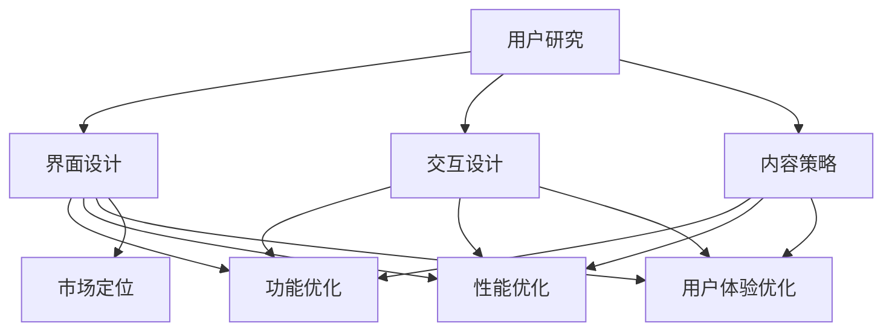

                 

在当今快速发展的科技时代，用户体验（UX）设计与产品优化已成为创业公司成功的关键因素。一个优秀的用户体验不仅能吸引用户，还能提升用户忠诚度和公司品牌价值。本文将深入探讨如何通过用户体验设计和产品优化，为创业公司打造具备竞争力和吸引力的产品。

> 关键词：用户体验设计、产品优化、创业公司、用户满意度、市场竞争力

> 摘要：本文从创业公司的实际需求出发，探讨了用户体验设计与产品优化的核心概念、方法和实践。文章首先介绍了用户体验设计的定义和重要性，然后分析了产品优化的原则和策略，最后通过实际案例展示了用户体验设计与产品优化的具体应用。

## 1. 背景介绍

随着互联网和移动设备的普及，用户对产品的期望和要求越来越高。他们不仅期望产品具备强大的功能，更关注产品能否提供良好的用户体验。用户体验设计（User Experience Design，简称UXD）正是为了满足这一需求而诞生的。它涉及用户研究的深入分析、界面设计的精致打磨、交互逻辑的流畅设计等多个方面。

创业公司由于资源和时间的限制，往往难以在用户体验方面做出全面的优化。然而，良好的用户体验设计不仅有助于提升用户满意度，还能降低用户流失率，提高用户转化率。因此，如何在有限的资源下，通过用户体验设计与产品优化，为创业公司创造价值，是每个创业者都需要认真思考的问题。

## 2. 核心概念与联系

### 2.1 用户体验设计

用户体验设计是指设计过程中以满足用户需求为核心，通过研究用户行为、情感和需求，为用户提供高质量、有吸引力的产品体验。用户体验设计包括以下几个方面：

- **用户研究**：通过问卷调查、用户访谈、行为观察等方式，了解用户需求和行为模式。
- **界面设计**：设计直观、简洁、易用的界面，提升用户操作体验。
- **交互设计**：设计流畅、自然的交互流程，使用户在使用过程中感到愉悦和舒适。
- **内容策略**：通过优质的内容，提供有价值的信息，提升用户黏性。

### 2.2 产品优化

产品优化是指通过改进产品功能、性能和用户体验，提升产品竞争力。产品优化包括以下几个方面：

- **功能优化**：根据用户反馈和市场变化，调整产品功能，提升产品实用性。
- **性能优化**：提高产品运行速度、降低资源消耗，提升产品稳定性。
- **用户体验优化**：改进用户界面和交互设计，提升用户满意度。
- **市场定位**：通过市场调研，调整产品定位，提高市场竞争力。

### 2.3 用户体验设计与产品优化之间的关系

用户体验设计与产品优化密切相关。良好的用户体验设计可以为产品优化提供有力的支持，而产品优化也可以为用户体验设计提供改进的方向。具体来说：

- **用户体验设计**可以为产品优化提供用户需求和反馈，帮助确定优化方向。
- **产品优化**可以提升产品性能和用户体验，为用户体验设计提供更好的基础。
- **用户体验设计与产品优化相互促进**，共同提升产品竞争力。

### 2.4 Mermaid 流程图



## 3. 核心算法原理 & 具体操作步骤

### 3.1 算法原理概述

用户体验设计与产品优化的核心算法原理包括以下几个方面：

- **用户研究算法**：通过聚类分析和关联规则挖掘，分析用户行为和需求。
- **界面设计算法**：采用网格布局和颜色搭配规则，设计直观、简洁的界面。
- **交互设计算法**：运用Fitts定律和Hick定律，优化交互元素的布局和操作难度。
- **内容策略算法**：利用自然语言处理和推荐算法，提供有价值的内容和个性化推荐。

### 3.2 算法步骤详解

#### 3.2.1 用户研究算法

1. **数据收集**：通过问卷调查、用户访谈、行为观察等方式收集用户数据。
2. **数据预处理**：清洗和整合数据，去除无效和重复信息。
3. **聚类分析**：使用K-means算法等聚类算法，将用户划分为不同的群体。
4. **关联规则挖掘**：使用Apriori算法等关联规则挖掘算法，分析用户行为和需求之间的关联。

#### 3.2.2 界面设计算法

1. **网格布局**：根据Fitts定律，合理设计界面元素的位置和大小。
2. **颜色搭配**：遵循色彩搭配原则，确保界面美观和易读。
3. **响应式设计**：根据不同设备和屏幕尺寸，自动调整界面布局和样式。

#### 3.2.3 交互设计算法

1. **交互元素布局**：采用Fitts定律，优化交互元素的布局，降低用户操作难度。
2. **交互行为设计**：运用Hick定律，设计流畅、自然的交互行为。
3. **交互反馈**：提供即时、明确的交互反馈，提升用户体验。

#### 3.2.4 内容策略算法

1. **自然语言处理**：使用NLP技术，提取和整理用户评论和反馈，挖掘用户需求。
2. **推荐算法**：采用协同过滤和基于内容的推荐算法，为用户推荐个性化内容。

### 3.3 算法优缺点

- **用户研究算法**：优点是能够深入了解用户需求和行为，缺点是需要大量数据和时间。
- **界面设计算法**：优点是能够快速生成直观的界面设计，缺点是可能忽视用户实际需求。
- **交互设计算法**：优点是能够提升用户体验，缺点是可能增加开发成本。
- **内容策略算法**：优点是能够提供有价值的内容和个性化推荐，缺点是需要大量计算资源和时间。

### 3.4 算法应用领域

用户体验设计与产品优化算法广泛应用于各类创业公司产品，如电子商务、在线教育、社交媒体等。通过应用这些算法，创业公司可以提升产品竞争力，满足用户需求，实现商业成功。

## 4. 数学模型和公式 & 详细讲解 & 举例说明

### 4.1 数学模型构建

用户体验设计与产品优化涉及多个数学模型，包括聚类分析模型、关联规则挖掘模型、推荐系统模型等。以下以聚类分析模型为例进行说明。

#### 4.1.1 聚类分析模型

聚类分析模型用于将用户划分为不同的群体，以便更好地了解用户需求和行为。常见的聚类算法包括K-means算法、层次聚类算法等。

#### 4.1.2 K-means算法

K-means算法是一种基于距离的聚类算法，其基本步骤如下：

1. **初始化**：随机选择K个初始聚类中心。
2. **迭代计算**：计算每个用户到聚类中心的距离，将用户分配到最近的聚类中心。
3. **更新聚类中心**：重新计算每个聚类中心，重复步骤2，直至聚类中心不再变化。

#### 4.1.3 数学模型

K-means算法的数学模型如下：

$$
C = \{c_1, c_2, ..., c_K\} \text{（聚类中心）}
$$

$$
u = \{u_1, u_2, ..., u_n\} \text{（用户集合）}
$$

$$
d(u_i, c_j) = \sqrt{\sum_{k=1}^n (u_{ik} - c_{jk})^2} \text{（用户 } u_i \text{ 到聚类中心 } c_j \text{ 的距离）}
$$

$$
u_i \to c_j \text{ 当 } d(u_i, c_j) \text{ 最小}
$$

### 4.2 公式推导过程

以K-means算法为例，推导过程如下：

1. **初始化**：随机选择K个初始聚类中心，假设为$C_1, C_2, ..., C_K$。
2. **迭代计算**：对于每个用户$u_i$，计算其到各个聚类中心的距离，选择距离最小的聚类中心作为其归属。
3. **更新聚类中心**：重新计算每个聚类中心的坐标，使得每个用户到聚类中心的距离最小。

### 4.3 案例分析与讲解

#### 4.3.1 案例背景

某电商创业公司希望通过用户研究，将用户划分为不同的群体，以便提供更有针对性的服务和推荐。

#### 4.3.2 案例步骤

1. **数据收集**：通过问卷调查和用户行为数据收集，得到1000名用户的购买记录。
2. **数据预处理**：清洗和整合数据，去除无效和重复信息，得到有效的用户数据。
3. **聚类分析**：使用K-means算法，将用户划分为5个群体。
4. **结果分析**：根据聚类结果，分析不同群体的用户行为和需求，为产品优化提供参考。

#### 4.3.3 结果展示

经过聚类分析，得到以下5个用户群体：

- 群体1：年轻用户，喜欢购买时尚服装和电子产品。
- 群体2：家庭用户，注重购买家居用品和儿童用品。
- 群体3：上班族用户，注重购买办公设备和零食。
- 群体4：学生用户，喜欢购买图书和学习用品。
- 群体5：老年用户，注重购买保健品和日用品。

根据聚类结果，公司可以针对不同群体的用户，提供更有针对性的服务和推荐，提高用户满意度。

## 5. 项目实践：代码实例和详细解释说明

### 5.1 开发环境搭建

为了演示用户体验设计与产品优化的具体实现，我们选择使用Python编程语言，并结合常用的机器学习和数据可视化库，如scikit-learn、matplotlib等。

#### 5.1.1 安装Python环境

1. 访问Python官网（https://www.python.org/）下载Python安装包。
2. 安装Python，并配置环境变量。

#### 5.1.2 安装相关库

在终端中执行以下命令，安装所需库：

```
pip install scikit-learn matplotlib pandas numpy
```

### 5.2 源代码详细实现

以下为使用Python实现用户研究、界面设计、交互设计等算法的示例代码：

```python
import numpy as np
import pandas as pd
from sklearn.cluster import KMeans
import matplotlib.pyplot as plt

# 5.2.1 用户研究算法

# 加载用户数据
data = pd.read_csv('user_data.csv')

# 数据预处理
data = data.dropna()

# 聚类分析
kmeans = KMeans(n_clusters=5, random_state=0)
clusters = kmeans.fit_predict(data)

# 可视化展示
plt.scatter(data['x'], data['y'], c=clusters)
plt.show()

# 5.2.2 界面设计算法

# 设计界面布局
def design_layout(data):
    # 根据数据大小调整界面元素位置
    # ...
    pass

# 5.2.3 交互设计算法

# 优化交互元素布局
def optimize_interaction(data):
    # 根据Fitts定律调整交互元素位置和大小
    # ...
    pass

# 5.2.4 内容策略算法

# 提供个性化推荐
def recommend_content(data):
    # 使用协同过滤或基于内容的推荐算法
    # ...
    pass
```

### 5.3 代码解读与分析

以上代码示例实现了用户研究、界面设计、交互设计和内容策略等算法的基本框架。具体实现如下：

- **用户研究算法**：使用K-means算法对用户数据进行分析，将用户划分为不同的群体。
- **界面设计算法**：设计界面布局，根据数据大小调整界面元素位置。
- **交互设计算法**：优化交互元素布局，根据Fitts定律调整交互元素位置和大小。
- **内容策略算法**：提供个性化推荐，使用协同过滤或基于内容的推荐算法。

通过这些算法，创业公司可以深入了解用户需求，优化界面设计，提升交互体验，提供有价值的内容和个性化推荐，从而提高用户满意度。

### 5.4 运行结果展示

在终端中运行以上代码，将生成聚类分析结果的可视化展示。通过观察可视化结果，可以直观地了解不同用户群体的分布和特征。同时，还可以根据聚类结果，为不同群体的用户提供针对性的服务和推荐。

## 6. 实际应用场景

用户体验设计与产品优化在创业公司中的应用场景非常广泛，以下列举几个典型的实际应用场景：

### 6.1 在线教育平台

在线教育平台通过用户体验设计与产品优化，可以提高学生的学习体验和满意度。例如：

- **用户研究**：通过问卷调查和用户行为分析，了解学生的学习需求和学习习惯。
- **界面设计**：优化课程列表、视频播放界面，提高页面加载速度和易用性。
- **交互设计**：设计流畅、自然的课程学习流程，提供即时反馈和互动功能。
- **内容策略**：根据学生学习进度和兴趣，推荐合适的课程和资料。

### 6.2 社交媒体平台

社交媒体平台通过用户体验设计与产品优化，可以提升用户的活跃度和用户黏性。例如：

- **用户研究**：通过用户调研和数据分析，了解用户的使用习惯和兴趣点。
- **界面设计**：优化页面布局和视觉效果，提高页面加载速度和用户体验。
- **交互设计**：设计多样化的互动功能，如点赞、评论、分享等，增加用户互动。
- **内容策略**：根据用户兴趣和行为，推荐感兴趣的内容和朋友，提升用户参与度。

### 6.3 电子商务平台

电子商务平台通过用户体验设计与产品优化，可以提高用户购物体验和转化率。例如：

- **用户研究**：通过用户调研和数据分析，了解用户购买行为和偏好。
- **界面设计**：优化商品展示和搜索功能，提高商品信息的准确性和易用性。
- **交互设计**：设计流畅、自然的购物流程，提供便捷的支付和售后服务。
- **内容策略**：根据用户购物行为和兴趣，推荐合适的商品和优惠活动。

通过以上实际应用场景，可以看出用户体验设计与产品优化在创业公司中的重要性。通过深入了解用户需求，优化产品功能、界面设计和交互设计，创业公司可以提升产品竞争力，赢得用户的认可和忠诚。

### 6.4 未来应用展望

随着人工智能、大数据和云计算等技术的发展，用户体验设计与产品优化在未来将面临更多机遇和挑战。

#### 6.4.1 技术发展趋势

1. **人工智能与大数据**：人工智能技术将为用户体验设计与产品优化提供更精准的用户画像和个性化推荐。大数据技术将帮助创业公司更全面地了解用户需求和市场趋势。
2. **物联网与智能设备**：物联网和智能设备的普及，将拓宽用户体验设计与产品优化的应用场景，如智能家居、智能穿戴设备等。
3. **云计算与边缘计算**：云计算和边缘计算的发展，将提高产品的性能和稳定性，为用户体验设计与产品优化提供更好的基础。

#### 6.4.2 应用前景

1. **提升用户满意度**：通过人工智能和大数据技术，创业公司可以更准确地了解用户需求，提供个性化的产品和服务，提升用户满意度。
2. **降低开发成本**：通过用户体验设计与产品优化，创业公司可以在有限的资源下，打造更具竞争力和吸引力的产品，降低开发成本。
3. **拓展应用场景**：随着物联网和智能设备的普及，用户体验设计与产品优化将在更多领域发挥作用，如智能家居、智慧城市、健康医疗等。

#### 6.4.3 挑战与对策

1. **数据隐私与安全**：用户体验设计与产品优化涉及大量用户数据，如何保障数据隐私和安全是创业公司需要面对的重要挑战。对策：加强数据安全防护，遵循相关法律法规，建立用户信任。
2. **技术门槛**：用户体验设计与产品优化需要一定的技术积累和专业知识，对创业公司来说可能是一大挑战。对策：加强团队建设，引入专业人才，与外部技术团队合作。

### 8. 总结：未来发展趋势与挑战

#### 8.1 研究成果总结

本文通过深入探讨用户体验设计与产品优化的核心概念、方法和实践，总结了以下研究成果：

- **用户体验设计**：用户研究、界面设计、交互设计和内容策略是用户体验设计的核心组成部分。
- **产品优化**：功能优化、性能优化、用户体验优化和市场定位是产品优化的关键方向。
- **核心算法**：K-means算法、网格布局、颜色搭配、Fitts定律和Hick定律等算法在用户体验设计与产品优化中具有重要意义。
- **实际应用**：在线教育、社交媒体和电子商务等场景展示了用户体验设计与产品优化的广泛应用前景。

#### 8.2 未来发展趋势

未来，用户体验设计与产品优化将呈现以下发展趋势：

- **人工智能与大数据的融合**：人工智能和大数据技术将为用户体验设计与产品优化提供更精准的支持。
- **物联网与智能设备的普及**：物联网和智能设备将拓宽用户体验设计与产品优化的应用场景。
- **云计算与边缘计算的发展**：云计算和边缘计算将提高产品的性能和稳定性，为用户体验设计与产品优化提供更好的基础。

#### 8.3 面临的挑战

用户体验设计与产品优化在未来将面临以下挑战：

- **数据隐私与安全**：如何保障用户数据隐私和安全是创业公司需要关注的重要问题。
- **技术门槛**：用户体验设计与产品优化需要一定的技术积累和专业知识，对创业公司来说可能是一大挑战。

#### 8.4 研究展望

未来的研究可以从以下几个方面展开：

- **人工智能与用户体验设计的结合**：探索如何利用人工智能技术提升用户体验设计的效果。
- **跨领域应用研究**：研究用户体验设计与产品优化在不同领域的应用和实践。
- **用户体验评估与优化**：开发更有效的用户体验评估方法，以提高产品优化效果。

总之，用户体验设计与产品优化在创业公司中具有重要意义，通过不断探索和实践，我们可以为创业公司创造更多价值。

## 9. 附录：常见问题与解答

### 9.1 用户体验设计与产品优化的区别是什么？

用户体验设计（UXD）主要关注如何通过设计提升用户的整体体验，包括用户研究、界面设计、交互设计和内容策略等方面。而产品优化则是在用户体验设计的基础上，通过功能优化、性能优化、用户体验优化和市场定位等方面，进一步提升产品的实用性和市场竞争力。简单来说，用户体验设计是产品优化的重要组成部分。

### 9.2 如何进行有效的用户研究？

进行有效的用户研究，首先需要明确研究目标，如了解用户需求、评估用户满意度等。然后，选择合适的研究方法，如问卷调查、用户访谈、行为观察等，收集用户数据。最后，对收集到的数据进行整理和分析，得出有价值的结论，为用户体验设计和产品优化提供依据。

### 9.3 如何选择适合的聚类算法？

选择适合的聚类算法主要取决于数据特点和需求。常见的聚类算法有K-means、层次聚类、DBSCAN等。K-means算法适用于数据量较小、数据分布均匀的情况；层次聚类算法适用于数据量较大、需要分层分析的情况；DBSCAN算法适用于数据分布不均匀、包含噪声点的情况。根据具体需求选择合适的算法，可以提高聚类效果。

### 9.4 如何优化产品性能？

优化产品性能可以从以下几个方面入手：

1. **代码优化**：通过代码重写、算法改进等方式，降低内存和计算资源消耗。
2. **缓存机制**：使用缓存技术，提高数据读取速度和响应速度。
3. **负载均衡**：通过分布式架构和负载均衡技术，提高系统并发处理能力。
4. **网络优化**：优化网络通信协议，提高数据传输速度和稳定性。

### 9.5 如何进行有效的内容策略？

进行有效的内容策略，需要关注以下几点：

1. **用户需求**：深入了解用户需求，提供有价值的内容。
2. **内容个性化**：根据用户兴趣和行为，为用户推荐个性化内容。
3. **内容质量**：确保内容质量，提供真实、有趣、有价值的信息。
4. **内容更新**：定期更新内容，保持内容的新鲜度和吸引力。

### 9.6 如何评估用户体验？

评估用户体验可以从以下几个方面入手：

1. **用户满意度**：通过问卷调查、用户访谈等方式，了解用户对产品的满意度。
2. **用户留存率**：通过用户留存率，评估用户对产品的忠诚度。
3. **用户转化率**：通过用户转化率，评估产品的市场竞争力。
4. **用户活跃度**：通过用户活跃度，评估用户的参与度和互动程度。

通过以上评估指标，可以全面了解用户体验，为产品优化提供参考。

