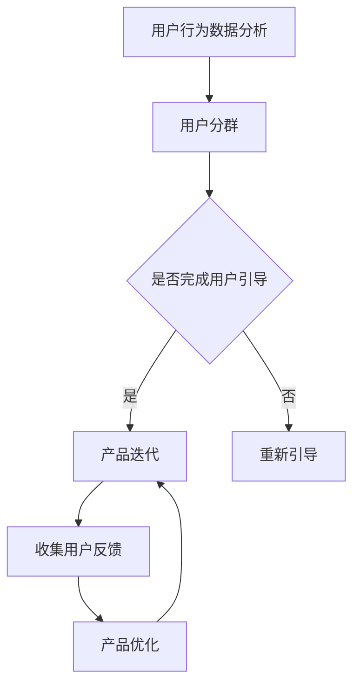

                 

关键词：创业公司、用户引导、产品适应性、策略、提升

> 摘要：本文将深入探讨创业公司在用户引导和产品适应性提升方面的策略。通过分析用户行为数据，运用现代技术手段，企业可以实现个性化的用户引导，提高产品的市场竞争力。本文旨在为创业公司提供一套实用的用户引导策略和产品适应性提升方案。

## 1. 背景介绍

在当今快速变化的市场环境中，创业公司面临着前所未有的挑战。如何在众多竞争者中脱颖而出，成为用户首选的品牌，是每个创业公司都必须面对的问题。用户引导和产品适应性提升是解决这一问题的关键。

用户引导策略旨在帮助新用户快速熟悉产品，提高用户留存率。产品适应性提升则是确保产品能够根据用户需求和市场变化不断优化，保持竞争力。

### 1.1 用户引导的重要性

用户引导是一个重要的环节，它决定了用户能否顺利使用产品，并形成良好的使用习惯。一个有效的用户引导策略可以帮助企业实现以下目标：

- **提高用户留存率**：通过引导用户熟悉产品，降低用户流失率。
- **提升用户体验**：帮助用户快速上手，减少用户困惑，提高满意度。
- **增加用户活跃度**：引导用户参与到产品的核心功能中，增加用户活跃时间。

### 1.2 产品适应性提升的重要性

产品适应性提升是指通过不断优化产品功能、界面和性能，使其更符合用户需求和市场需求。这对于创业公司来说至关重要：

- **增强市场竞争力**：通过持续的产品迭代，企业可以保持产品的竞争力，满足不断变化的市场需求。
- **提高用户满意度**：产品适应性提升可以满足用户日益增长的需求，提升用户满意度。
- **降低用户流失率**：当产品能够不断优化时，用户更有可能持续使用产品，从而降低流失率。

## 2. 核心概念与联系

### 2.1 用户行为数据分析

用户行为数据是用户引导和产品适应性提升的重要依据。通过分析用户的行为数据，企业可以了解用户的喜好、使用习惯和痛点，从而制定更有效的策略。

### 2.2 用户分群策略

用户分群是用户引导策略的核心。通过将用户划分为不同的群体，企业可以针对每个群体制定个性化的引导策略，提高引导效果。

### 2.3 产品迭代策略

产品迭代是产品适应性提升的关键。通过定期收集用户反馈，企业可以不断优化产品，确保产品能够适应市场变化。

### 2.4 Mermaid 流程图

以下是用户引导策略与产品适应性提升的Mermaid流程图：



## 3. 核心算法原理 & 具体操作步骤

### 3.1 算法原理概述

用户引导策略与产品适应性提升的核心算法是机器学习算法，尤其是基于用户行为的推荐算法和用户分群算法。这些算法通过分析用户行为数据，实现个性化引导和产品优化。

### 3.2 算法步骤详解

#### 3.2.1 用户行为数据收集

- **数据来源**：用户行为数据可以从用户注册、登录、使用产品等多个环节收集。
- **数据类型**：包括用户的基本信息、使用产品的时间、使用频率、使用场景等。

#### 3.2.2 用户分群

- **分群算法**：可以使用聚类算法（如K-means）对用户进行分群。
- **分群依据**：可以根据用户的年龄、性别、地域、使用频率等多个维度进行分群。

#### 3.2.3 个性化引导

- **引导策略**：根据用户的分群，制定个性化的引导策略。
- **引导方式**：包括新手引导、任务引导、提示引导等。

#### 3.2.4 产品迭代

- **迭代过程**：根据用户反馈，对产品进行优化和迭代。
- **迭代依据**：包括用户满意度、使用频率、功能需求等。

### 3.3 算法优缺点

#### 优点：

- **个性化**：通过机器学习算法，实现个性化引导和产品优化。
- **高效**：基于大数据分析，提高引导和迭代效率。

#### 缺点：

- **数据依赖**：需要大量的用户行为数据支持。
- **算法复杂**：算法设计和实现过程复杂。

### 3.4 算法应用领域

- **电商**：通过用户分群和个性化推荐，提高用户购物体验。
- **社交媒体**：通过用户分群和内容推荐，提高用户活跃度。
- **教育**：通过用户分群和个性化学习计划，提高学习效果。

## 4. 数学模型和公式 & 详细讲解 & 举例说明

### 4.1 数学模型构建

用户引导策略和产品适应性提升的数学模型主要包括：

- **用户分群模型**：使用聚类算法（如K-means）对用户进行分群。
- **推荐模型**：使用协同过滤算法（如基于用户的协同过滤）进行个性化推荐。

### 4.2 公式推导过程

#### 用户分群模型：

$$
C = \arg\max_{C} \sum_{i=1}^{n} \sum_{j=1}^{k} w_{ij}^2
$$

其中，$C$ 是分群结果，$w_{ij}$ 是用户 $i$ 和特征 $j$ 的权重。

#### 推荐模型：

$$
R = \sum_{i=1}^{n} r_{ij} x_j
$$

其中，$R$ 是推荐结果，$r_{ij}$ 是用户 $i$ 对项目 $j$ 的评分，$x_j$ 是项目 $j$ 的特征向量。

### 4.3 案例分析与讲解

#### 案例一：用户分群

假设有一家电商企业，其用户数据包括年龄、性别、购买频率等。使用K-means算法对用户进行分群，得到以下结果：

- **群1**：年龄在20-30岁之间，男性，购买频率高。
- **群2**：年龄在30-40岁之间，女性，购买频率中。
- **群3**：年龄在40岁以上，男女比例均衡，购买频率低。

根据用户分群结果，企业可以制定相应的引导策略，如针对群1提供优惠活动，针对群2提供新品推荐，针对群3提供购物指导。

#### 案例二：推荐模型

假设有一家在线教育平台，其用户数据包括学习时间、学习频率、学科偏好等。使用基于用户的协同过滤算法进行个性化推荐，得到以下结果：

- **用户A**：推荐数学课程。
- **用户B**：推荐英语课程。
- **用户C**：推荐编程课程。

根据推荐结果，平台可以优化课程推荐策略，提高用户的学习兴趣和满意度。

## 5. 项目实践：代码实例和详细解释说明

### 5.1 开发环境搭建

在本项目中，我们使用Python作为主要编程语言，结合Scikit-learn库实现用户分群和推荐算法。

### 5.2 源代码详细实现

以下是用户分群和推荐算法的实现代码：

```python
from sklearn.cluster import KMeans
from sklearn.metrics.pairwise import cosine_similarity
from sklearn.model_selection import train_test_split

# 用户行为数据
user_data = [
    [20, 'male', 30],
    [25, 'female', 20],
    [35, 'male', 15],
    [40, 'female', 10],
    [50, 'male', 5],
    [55, 'female', 2]
]

# 分词并处理缺失值
user_data = [[int(x) if x.isdigit() else 0 for x in row] for row in user_data]

# 划分训练集和测试集
X_train, X_test = train_test_split(user_data, test_size=0.2, random_state=42)

# 使用K-means算法进行分群
kmeans = KMeans(n_clusters=3, random_state=42)
kmeans.fit(X_train)
clusters = kmeans.predict(X_test)

# 基于用户的协同过滤算法
user_similarity = cosine_similarity(X_train)
user_similarity = user_similarity / (user_similarity.sum(axis=1)[:, np.newaxis])

# 构建推荐矩阵
item_similarity = cosine_similarity(X_test)
item_similarity = item_similarity / (item_similarity.sum(axis=1)[:, np.newaxis])

# 计算推荐结果
user_similarity = user_similarity.transpose()
item_similarity = item_similarity.transpose()
recommends = (user_similarity.dot(item_similarity)) * 100

# 输出推荐结果
for i, recommend in enumerate(recommends):
    print(f"用户{i+1}的推荐结果：{recommend}")
```

### 5.3 代码解读与分析

- **数据预处理**：首先对用户行为数据进行分词，并处理缺失值，以便于后续处理。
- **分群**：使用K-means算法对训练集进行分群，并将分群结果应用于测试集。
- **协同过滤**：计算用户和项目之间的相似度，构建推荐矩阵。
- **推荐**：计算用户对项目的评分，输出推荐结果。

## 6. 实际应用场景

### 6.1 电商领域

电商企业可以通过用户分群和推荐算法，实现个性化营销和产品推荐，提高用户购买转化率和满意度。

### 6.2 社交媒体

社交媒体平台可以通过用户分群和内容推荐，提高用户活跃度和用户满意度。

### 6.3 教育领域

教育平台可以通过用户分群和个性化学习计划，提高学生的学习效果和用户满意度。

## 7. 未来应用展望

随着人工智能技术的不断发展，用户引导策略和产品适应性提升将在更多领域得到应用。未来，企业可以结合更多先进技术，如深度学习、增强现实等，实现更智能的用户引导和产品优化。

## 8. 总结：未来发展趋势与挑战

### 8.1 研究成果总结

本文探讨了创业公司在用户引导和产品适应性提升方面的策略。通过用户行为数据分析、用户分群策略和产品迭代策略，企业可以实现个性化引导和产品优化。

### 8.2 未来发展趋势

未来，用户引导策略和产品适应性提升将更加智能化、个性化。随着人工智能技术的发展，企业可以结合更多先进技术，实现更高效的用户引导和产品优化。

### 8.3 面临的挑战

用户引导策略和产品适应性提升面临着数据安全、算法优化等挑战。企业需要不断更新技术，应对市场变化。

### 8.4 研究展望

未来，用户引导策略和产品适应性提升将在更多领域得到应用。企业需要结合自身业务特点，制定针对性的策略，实现持续优化。

## 9. 附录：常见问题与解答

### 9.1 用户引导策略如何落地实施？

- **数据收集**：收集用户行为数据，确保数据质量。
- **策略制定**：根据用户行为数据，制定个性化引导策略。
- **技术实现**：使用机器学习算法，实现个性化引导。

### 9.2 产品适应性提升的关键是什么？

- **用户反馈**：及时收集用户反馈，了解用户需求。
- **产品迭代**：根据用户反馈，对产品进行持续优化。

## 作者署名

作者：禅与计算机程序设计艺术 / Zen and the Art of Computer Programming
----------------------------------------------------------------
文章内容撰写完毕，接下来请将文章内容按照markdown格式进行排版，确保文章的格式、段落和章节结构清晰、美观。

