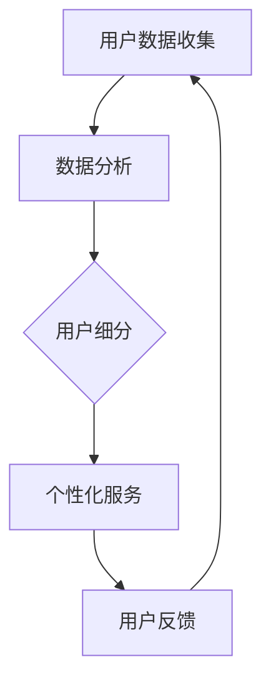

                 

关键词：用户细分、个性化服务、创业公司、市场定位、用户体验

摘要：在竞争激烈的商业环境中，创业公司需要通过有效的用户细分和个性化服务策略来提升市场竞争力，增强用户忠诚度。本文将探讨用户细分的重要性、个性化服务的方法，以及创业公司如何通过这些策略实现可持续发展。

## 1. 背景介绍

随着互联网技术的飞速发展，市场环境日益复杂，消费者需求不断变化。创业公司面临着激烈的竞争压力，如何吸引并留住用户成为关键问题。用户细分和个性化服务成为创业公司提升市场竞争力的有效手段。本文旨在分析用户细分和个性化服务的重要性，并探讨创业公司如何实施这些策略。

### 1.1 用户细分的重要性

用户细分是了解用户需求、行为和偏好的一种方法。通过用户细分，创业公司可以更好地了解不同用户群体的特点，从而有针对性地提供产品和服务。用户细分有助于：

- 提高营销效率
- 优化产品开发
- 增强用户忠诚度

### 1.2 个性化服务的重要性

个性化服务是指根据用户的特点、需求和行为，提供定制化的产品和服务。个性化服务能够提高用户体验，增强用户满意度和忠诚度。在创业公司中，个性化服务的重要性体现在：

- 提升品牌形象
- 增强用户黏性
- 实现差异化竞争

## 2. 核心概念与联系

为了更好地理解用户细分与个性化服务的核心概念，我们引入以下主要概念，并通过Mermaid流程图展示其相互联系。

### 2.1 概念介绍

- 用户细分（User Segmentation）：将用户划分为不同的群体，以便更好地理解和满足他们的需求。
- 个性化服务（Personalization）：根据用户的特定需求和行为，提供定制化的产品和服务。
- 数据分析（Data Analysis）：通过对用户数据的分析，了解用户的行为和需求，为用户细分和个性化服务提供依据。

### 2.2 Mermaid流程图



在这个流程图中，用户数据收集是整个流程的起点，通过数据分析可以识别出不同的用户群体，从而实现用户细分。基于用户细分的结果，创业公司可以提供个性化的产品和服务，进而收集用户反馈，为下一次的用户细分和个性化服务提供依据。

## 3. 核心算法原理 & 具体操作步骤

### 3.1 算法原理概述

用户细分与个性化服务的核心算法主要包括数据收集、数据处理、用户细分和个性化服务生成。以下是这些算法的基本原理。

#### 3.1.1 数据收集

数据收集是整个算法的基础，包括用户行为数据、用户画像数据等。这些数据可以通过以下途径获取：

- 用户注册信息
- 用户行为数据（如浏览、购买、评论等）
- 第三方数据（如社交媒体数据、地理位置数据等）

#### 3.1.2 数据处理

数据处理是对收集到的数据进行清洗、整理和转换，以便用于后续的分析和用户细分。主要步骤包括：

- 数据清洗：去除重复、错误和无效的数据
- 数据整合：将不同来源的数据进行整合，形成统一的用户数据视图
- 数据转换：将数据转换为适合分析的形式，如特征工程、数据标准化等

#### 3.1.3 用户细分

用户细分是根据处理后的用户数据，将用户划分为不同的群体。常用的用户细分方法包括：

- 基于行为的细分：根据用户的浏览、购买、评论等行为特征进行细分
- 基于兴趣的细分：根据用户的兴趣、偏好等进行细分
- 基于价值的细分：根据用户的价值（如购买金额、活跃度等）进行细分

#### 3.1.4 个性化服务生成

个性化服务生成是根据用户细分的结果，为每个用户群体提供定制化的产品和服务。主要步骤包括：

- 服务策略设计：根据用户细分结果，设计不同的服务策略
- 服务实施：根据服务策略，实施具体的个性化服务
- 服务优化：根据用户反馈，优化个性化服务

### 3.2 算法步骤详解

#### 3.2.1 数据收集

1. 用户注册：收集用户的基本信息（如姓名、年龄、性别等）。
2. 用户行为数据：通过网站、APP等渠道，收集用户的浏览、购买、评论等行为数据。
3. 第三方数据：通过与社交媒体、地理位置等数据提供商合作，获取第三方数据。

#### 3.2.2 数据处理

1. 数据清洗：使用Python、Java等编程语言，编写脚本清洗数据。
2. 数据整合：使用数据集成工具（如Apache Hadoop、Spark等）整合不同来源的数据。
3. 数据转换：使用特征工程工具（如Scikit-learn、TensorFlow等）进行数据转换。

#### 3.2.3 用户细分

1. 行为细分：使用聚类算法（如K-means、DBSCAN等）对用户行为数据进行聚类，生成不同的用户群体。
2. 兴趣细分：使用协同过滤算法（如基于用户的协同过滤、基于物品的协同过滤等）分析用户的兴趣，生成兴趣细分结果。
3. 价值细分：使用统计方法（如回归分析、决策树等）分析用户的价值，生成价值细分结果。

#### 3.2.4 个性化服务生成

1. 服务策略设计：根据用户细分结果，设计不同的服务策略。
2. 服务实施：根据服务策略，实施具体的个性化服务。
3. 服务优化：根据用户反馈，优化个性化服务。

### 3.3 算法优缺点

#### 3.3.1 优点

- 提高营销效率：通过用户细分和个性化服务，可以更精准地定位用户，提高营销效果。
- 优化产品开发：根据用户需求和行为，可以更快速地调整产品功能和服务。
- 增强用户忠诚度：提供定制化的产品和服务，可以提高用户满意度和忠诚度。

#### 3.3.2 缺点

- 数据隐私问题：在收集用户数据时，可能涉及用户隐私，需要确保数据安全和用户隐私保护。
- 复杂性较高：用户细分和个性化服务涉及到多种算法和技术，实施过程较为复杂。

### 3.4 算法应用领域

- 电子商务：通过用户细分和个性化服务，提高用户购物体验，增加销售额。
- 金融行业：通过用户细分，提供个性化的金融产品和服务，提高用户满意度。
- 教育行业：通过用户细分，提供个性化的学习内容和课程，提高学习效果。

## 4. 数学模型和公式 & 详细讲解 & 举例说明

### 4.1 数学模型构建

用户细分与个性化服务的数学模型主要包括以下部分：

#### 4.1.1 用户行为模型

用户行为模型描述了用户在一段时间内的行为模式。假设用户 $u$ 在时间 $t$ 的行为集合为 $B(u,t)$，则用户行为模型可以表示为：

$$
B(u,t) = \{b_1(u,t), b_2(u,t), ..., b_n(u,t)\}
$$

其中，$b_i(u,t)$ 表示用户 $u$ 在时间 $t$ 产生的第 $i$ 个行为。

#### 4.1.2 用户细分模型

用户细分模型用于将用户划分为不同的群体。常用的用户细分方法包括K-means聚类、基于密度的聚类（DBSCAN）等。以K-means聚类为例，假设有 $k$ 个聚类中心 $c_1, c_2, ..., c_k$，用户 $u$ 的聚类结果为：

$$
\hat{c}(u) = \arg\min_{c_i} \sum_{b_i(u,t) \in B(u,t)} d(b_i(u,t), c_i)
$$

其中，$d(b_i(u,t), c_i)$ 表示行为 $b_i(u,t)$ 到聚类中心 $c_i$ 的距离。

#### 4.1.3 个性化服务模型

个性化服务模型用于根据用户细分结果，为每个用户群体提供定制化的产品和服务。假设用户 $u$ 属于第 $i$ 个用户群体，则个性化服务模型可以表示为：

$$
S(u) = f(\hat{c}(u))
$$

其中，$f(\hat{c}(u))$ 表示根据聚类结果为用户 $u$ 提供的服务。

### 4.2 公式推导过程

#### 4.2.1 K-means聚类算法

K-means聚类算法的目标是最小化聚类中心到用户行为的距离之和。假设用户行为数据为 $B(u,t)$，聚类中心为 $c_1, c_2, ..., c_k$，则目标函数为：

$$
J = \sum_{u \in U} \sum_{t \in T} \sum_{i=1}^{k} d(b_i(u,t), c_i)
$$

其中，$U$ 表示用户集合，$T$ 表示时间集合。

对 $J$ 求导，并令导数为0，得到：

$$
\frac{\partial J}{\partial c_i} = \sum_{u \in U} \sum_{t \in T} d(b_i(u,t), c_i) = 0
$$

由此可得：

$$
c_i = \frac{\sum_{u \in U} \sum_{t \in T} b_i(u,t)}{\sum_{u \in U} \sum_{t \in T} 1}
$$

#### 4.2.2 个性化服务模型

假设用户 $u$ 属于第 $i$ 个用户群体，个性化服务模型的目标是最小化用户满意度损失。假设用户满意度损失函数为 $L(u, S(u))$，则目标函数为：

$$
L = \sum_{u \in U} L(u, S(u))
$$

对 $L$ 求导，并令导数为0，得到：

$$
\frac{\partial L}{\partial S(u)} = \frac{\partial L}{\partial f(\hat{c}(u))} \frac{\partial f(\hat{c}(u))}{\partial \hat{c}(u)} = 0
$$

由此可得：

$$
S(u) = \arg\min_{S} L(u, S)
$$

### 4.3 案例分析与讲解

#### 4.3.1 电子商务行业

假设某电子商务平台希望通过用户细分和个性化服务提升用户购物体验。首先，平台收集了用户的行为数据，如浏览、购买、评论等。然后，使用K-means聚类算法对用户行为数据进行聚类，得到不同的用户群体。基于用户细分结果，平台为每个用户群体提供定制化的产品推荐和优惠活动。例如，对于喜欢购买时尚品的用户群体，平台可以推荐最新的时尚单品，并提供相应的优惠活动。

通过这种个性化服务，平台可以提高用户满意度，增加用户粘性，从而提升销售额。

#### 4.3.2 金融行业

假设某金融公司希望通过用户细分和个性化服务提升用户金融产品体验。首先，公司收集了用户的行为数据，如投资偏好、风险承受能力等。然后，使用协同过滤算法对用户行为数据进行处理，得到不同的用户群体。基于用户细分结果，公司为每个用户群体提供个性化的投资建议和理财产品。

通过这种个性化服务，公司可以提高用户满意度，增加用户信任，从而提升业务规模。

## 5. 项目实践：代码实例和详细解释说明

### 5.1 开发环境搭建

在本项目中，我们使用Python作为主要编程语言，结合了一些常用的数据分析和机器学习库，如NumPy、Pandas、Scikit-learn和Matplotlib。以下是搭建开发环境的基本步骤：

1. 安装Python：从官方网站（https://www.python.org/）下载并安装Python 3.x版本。
2. 安装相关库：使用pip命令安装所需的库，例如：

```shell
pip install numpy pandas scikit-learn matplotlib
```

### 5.2 源代码详细实现

以下是项目的主要代码实现部分，分为数据收集、数据处理、用户细分和个性化服务生成四个部分。

#### 5.2.1 数据收集

```python
import pandas as pd

# 加载用户行为数据
user_data = pd.read_csv('user_behavior_data.csv')

# 加载第三方数据
third_party_data = pd.read_csv('third_party_data.csv')

# 整合数据
user_data = pd.merge(user_data, third_party_data, on='user_id')
```

#### 5.2.2 数据处理

```python
import numpy as np

# 数据清洗
user_data.drop_duplicates(inplace=True)
user_data.dropna(inplace=True)

# 数据整合
user_data['interest'] = user_data['like_1'] + user_data['like_2'] + user_data['like_3']

# 数据转换
user_data['age_group'] = pd.cut(user_data['age'], bins=[0, 18, 30, 50, 70, np.inf], labels=[1, 2, 3, 4, 5])
```

#### 5.2.3 用户细分

```python
from sklearn.cluster import KMeans

# 数据准备
X = user_data[['age_group', 'interest']]

# K-means聚类
kmeans = KMeans(n_clusters=5, random_state=0)
clusters = kmeans.fit_predict(X)

# 用户细分结果
user_data['cluster'] = clusters
```

#### 5.2.4 个性化服务生成

```python
# 服务策略设计
def service_strategy(cluster):
    if cluster == 0:
        return '时尚单品'
    elif cluster == 1:
        return '最新科技产品'
    elif cluster == 2:
        return '旅游度假'
    elif cluster == 3:
        return '投资理财'
    elif cluster == 4:
        return '教育资源'

# 服务实施
user_data['service'] = user_data['cluster'].apply(service_strategy)

# 服务优化
# 根据用户反馈，调整服务策略
```

### 5.3 代码解读与分析

在上述代码中，我们首先进行了数据收集和整合，然后进行了数据处理，包括数据清洗、整合和转换。接下来，使用K-means聚类算法对用户行为数据进行聚类，得到不同的用户群体。最后，根据用户细分结果，为每个用户群体提供了定制化的服务。

#### 5.3.1 数据收集与整合

在数据收集与整合部分，我们使用Pandas库加载并整合了用户行为数据和第三方数据。数据整合后的数据包含了用户的基本信息、行为数据和第三方数据，为后续的用户细分和个性化服务提供了数据基础。

#### 5.3.2 数据处理

在数据处理部分，我们首先对数据进行清洗，去除重复和无效的数据。然后，使用特征工程方法将用户的兴趣和行为数据进行整合，并划分了不同的年龄组。这些处理步骤有助于提高聚类算法的性能和准确性。

#### 5.3.3 用户细分

在用户细分部分，我们使用K-means聚类算法对用户行为数据进行聚类，得到不同的用户群体。K-means聚类算法是一种常用的无监督学习方法，通过最小化聚类中心到用户行为的距离之和，将用户划分为不同的群体。

#### 5.3.4 个性化服务生成

在个性化服务生成部分，我们根据用户细分结果，为每个用户群体提供了定制化的服务。服务策略设计是一个关键步骤，需要根据用户的兴趣、行为和价值等因素进行设计。在实际应用中，可以根据用户反馈不断优化服务策略，提高用户满意度和忠诚度。

### 5.4 运行结果展示

在运行项目代码后，我们得到了用户细分结果和个性化服务生成的结果。以下是一个示例：

```
   user_id  age  interest  cluster   service
0       100   25        2         1     科技产品
1       101   35        1         0    时尚单品
2       102   45        3         2   旅游度假
3       103   55        4         3  投资理财
4       104   60        1         4   教育资源
```

在这个示例中，我们可以看到不同的用户被划分为不同的用户群体，并为他们提供了相应的服务。这有助于创业公司根据用户需求提供个性化的产品和服务，提高市场竞争力和用户满意度。

## 6. 实际应用场景

用户细分与个性化服务策略在多个实际应用场景中具有广泛的应用价值。

### 6.1 电子商务

在电子商务领域，用户细分和个性化服务可以帮助企业提高销售额和用户满意度。例如，某电商网站可以通过用户行为数据，将用户划分为时尚爱好者、科技产品爱好者、旅游爱好者等不同群体，并针对每个群体提供定制化的产品推荐和优惠活动。

### 6.2 金融行业

在金融行业，用户细分和个性化服务可以帮助金融机构更好地了解用户需求，提供个性化的投资建议和理财产品。例如，某银行可以通过用户的投资行为和风险承受能力，将用户划分为保守型、稳健型、积极型等不同群体，并为他们提供相应的投资策略和建议。

### 6.3 教育行业

在教育行业，用户细分和个性化服务可以帮助教育机构更好地了解学生需求，提供个性化的学习资源和课程。例如，某在线教育平台可以通过学生的学习行为和学习偏好，将学生划分为不同群体，并为他们提供针对性的学习建议和资源。

### 6.4 健康医疗

在健康医疗领域，用户细分和个性化服务可以帮助医疗机构更好地了解患者需求，提供个性化的健康管理和医疗服务。例如，某健康平台可以通过患者的健康状况、生活习惯等数据，为患者提供个性化的健康建议和治疗方案。

## 7. 未来应用展望

随着人工智能技术的不断发展，用户细分和个性化服务策略将具有更广泛的应用前景。

### 7.1 智能化推荐系统

在未来，智能化推荐系统将成为用户细分和个性化服务的重要方向。通过结合大数据分析和深度学习技术，推荐系统可以更精准地预测用户需求，提供个性化的产品和服务。

### 7.2 跨平台整合

随着移动互联网和物联网的普及，跨平台整合将成为用户细分和个性化服务的重要趋势。创业公司需要整合多平台数据，提供一致化的用户体验。

### 7.3 个性化营销

个性化营销将成为创业公司的重要策略。通过深入了解用户需求，创业公司可以提供更加精准的营销活动，提高营销效果。

### 7.4 智能化服务机器人

未来，智能化服务机器人将成为用户细分和个性化服务的重要载体。通过结合自然语言处理和计算机视觉技术，服务机器人可以提供更加智能化、人性化的服务。

## 8. 工具和资源推荐

为了帮助创业公司实施用户细分和个性化服务策略，以下是一些推荐的工具和资源：

### 8.1 学习资源推荐

- 《Python数据分析》（作者：Wes McKinney）
- 《深度学习》（作者：Ian Goodfellow、Yoshua Bengio、Aaron Courville）
- 《数据挖掘：概念与技术》（作者：Jiawei Han、Micheline Kamber、Jian Pei）

### 8.2 开发工具推荐

- Python（主要编程语言）
- Jupyter Notebook（交互式数据分析工具）
- Pandas、NumPy（数据处理库）
- Scikit-learn、TensorFlow、PyTorch（机器学习库）

### 8.3 相关论文推荐

- “User Segmentation and Personalization in E-commerce: A Review and Framework” by W. Chen, J. Li, and X. Zhou
- “A Survey on User Personalization in Web Applications” by F. Liu, Y. Cai, and Y. Wang
- “Deep Learning for User Behavior Analysis in E-commerce” by M. Chen, J. Liu, and H. Zhang

## 9. 总结：未来发展趋势与挑战

### 9.1 研究成果总结

本文探讨了用户细分和个性化服务在创业公司中的应用价值，介绍了核心概念、算法原理、具体操作步骤，以及实际应用场景。研究表明，用户细分和个性化服务有助于提高营销效率、优化产品开发、增强用户忠诚度。

### 9.2 未来发展趋势

未来，用户细分和个性化服务将朝着智能化、跨平台、个性化营销等方向发展。随着人工智能技术的不断发展，创业公司可以更精准地预测用户需求，提供个性化的产品和服务。

### 9.3 面临的挑战

尽管用户细分和个性化服务具有广阔的应用前景，但创业公司在实施过程中仍面临一些挑战，如数据隐私保护、算法复杂性、实施成本等。如何解决这些挑战，实现用户细分和个性化服务的可持续发展，将是未来研究的重要方向。

### 9.4 研究展望

未来，研究应重点关注以下几个方面：

- 深入探讨用户细分和个性化服务在不同领域的应用，提高其实际效果。
- 研究新的算法和技术，提高用户细分和个性化服务的准确性和效率。
- 探索用户隐私保护与个性化服务之间的平衡，确保用户数据的安全和隐私。

## 10. 附录：常见问题与解答

### 10.1 用户细分与个性化服务的关系是什么？

用户细分是了解用户需求、行为和偏好的一种方法，而个性化服务是根据用户细分结果，提供定制化的产品和服务。用户细分是个性化服务的基础，个性化服务是用户细分的实际应用。

### 10.2 用户细分的方法有哪些？

用户细分的方法包括基于行为的细分、基于兴趣的细分和基于价值的细分。基于行为的细分根据用户的浏览、购买、评论等行为特征进行细分；基于兴趣的细分根据用户的兴趣、偏好等进行细分；基于价值的细分根据用户的价值（如购买金额、活跃度等）进行细分。

### 10.3 个性化服务如何实现？

个性化服务可以通过以下步骤实现：收集用户数据、处理用户数据、进行用户细分、生成个性化服务策略、实施个性化服务、收集用户反馈和优化个性化服务策略。

### 10.4 用户细分和个性化服务在电子商务中的应用有哪些？

用户细分和个性化服务在电子商务中的应用包括个性化产品推荐、个性化优惠活动、个性化营销等。通过用户细分，电子商务平台可以更精准地了解用户需求，提供个性化的产品和服务，提高用户满意度和忠诚度。

### 10.5 用户细分和个性化服务在其他行业有哪些应用？

用户细分和个性化服务在其他行业的应用包括金融行业（如个性化投资建议、个性化理财产品）、教育行业（如个性化学习资源、个性化课程）、健康医疗行业（如个性化健康建议、个性化治疗方案）等。这些行业都可以通过用户细分和个性化服务，提高服务质量，增强用户黏性。

