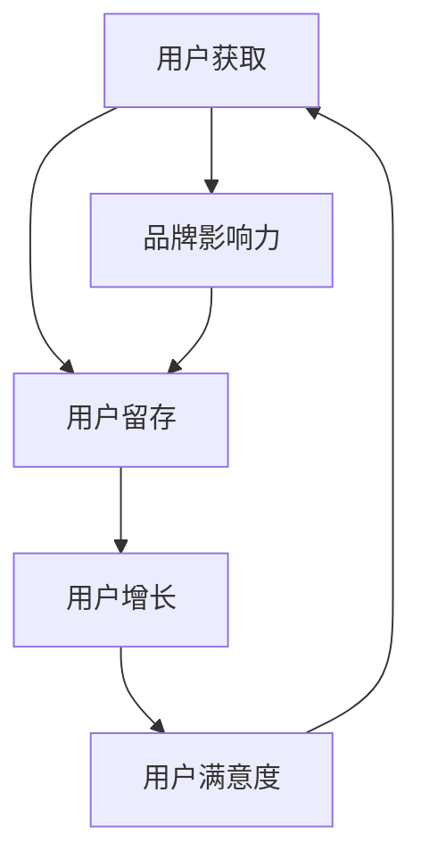

                 

### 1. 背景介绍

在当今快速变化的市场环境中，用户运营成为创业公司成功的关键因素之一。用户运营不仅仅是增加用户数量，更重要的是通过一系列策略和活动，提升用户满意度和用户粘性，从而实现持续的用户增长和业务发展。

用户运营的重要性体现在以下几个方面：

1. **提高用户留存率**：有效的用户运营可以帮助创业公司减少用户流失，提高用户的生命周期价值。
2. **提升用户满意度**：通过关注用户反馈和需求，创业公司可以提供更好的产品和服务，增强用户的满意度。
3. **扩大用户基础**：良好的用户运营策略能够吸引新用户，为公司的长期发展奠定基础。
4. **增强品牌影响力**：通过优质的用户运营，创业公司可以在市场中树立良好的品牌形象，提升品牌知名度。

本文将探讨创业公司在用户运营方面的一些核心策略，包括用户获取、用户留存和用户增长等，并结合实际案例进行分析，为创业公司提供有价值的参考。

### 2. 核心概念与联系

在讨论用户运营策略之前，我们需要明确几个核心概念和它们之间的联系。以下是一个使用Mermaid绘制的流程图，展示了用户运营的关键环节：



- **用户获取（A）**：通过营销、推广和广告等手段吸引新用户。
- **用户留存（B）**：通过提供高质量的产品和服务，以及有效的用户沟通和反馈机制，保持现有用户的活跃度。
- **用户增长（C）**：通过优化用户体验和提升产品功能，吸引现有用户推荐新用户，实现用户基数的增长。
- **用户满意度（D）**：用户的整体体验和满意度直接影响用户的留存和增长。
- **品牌影响力（E）**：通过良好的用户运营，公司在市场中建立品牌形象，增强市场竞争力。

上述环节相互关联，形成一个闭环。良好的用户获取策略能够带来更多的新用户，而这些新用户在体验到优质的产品和服务后，可能会转为忠诚用户，从而推动用户增长和满意度提升。反之，如果用户运营不当，可能会导致用户流失，影响品牌的整体形象。

### 3. 核心算法原理 & 具体操作步骤

#### 3.1 算法原理概述

用户运营的核心算法原理可以概括为以下几个方面：

1. **数据驱动**：通过收集和分析用户行为数据，制定和调整运营策略。
2. **个性化推荐**：根据用户的行为和偏好，提供个性化的产品推荐和服务。
3. **用户生命周期管理**：根据用户在不同生命周期阶段的行为特征，制定相应的运营策略。

#### 3.2 算法步骤详解

1. **数据收集与处理**：
   - **行为数据**：包括用户的浏览、购买、评论、分享等行为数据。
   - **用户属性数据**：包括用户的基本信息、兴趣爱好、购买历史等。
   - **数据处理**：对收集到的数据进行清洗、去重、转换等处理，以便后续分析。

2. **用户画像构建**：
   - **特征提取**：从用户行为数据和用户属性数据中提取特征，如用户活跃度、消费能力、兴趣偏好等。
   - **模型训练**：使用机器学习算法，如聚类、回归分析等，对提取的特征进行建模，构建用户画像。

3. **个性化推荐**：
   - **推荐算法**：采用协同过滤、基于内容的推荐等算法，根据用户画像和产品信息，生成个性化推荐列表。
   - **推荐结果展示**：将推荐结果以适当的形式展示给用户，如产品页面、邮件、推送通知等。

4. **用户生命周期管理**：
   - **新用户导入**：针对新用户，提供欢迎礼包、新手教程等，引导用户快速上手。
   - **活跃用户维护**：通过个性化营销活动、会员制度等，保持用户的活跃度和忠诚度。
   - **流失用户挽回**：分析用户流失原因，提供针对性的挽回策略，如优惠券、积分奖励等。

#### 3.3 算法优缺点

- **优点**：
  - 数据驱动，能够根据用户行为进行动态调整。
  - 个性化推荐，提升用户体验和满意度。
  - 用户生命周期管理，提高用户留存率和生命周期价值。

- **缺点**：
  - 需要大量的数据支持和计算资源。
  - 可能存在数据偏差和噪声，影响推荐效果。
  - 需要不断迭代和优化，以适应市场的变化。

#### 3.4 算法应用领域

用户运营算法广泛应用于电子商务、在线教育、社交媒体等领域，以下是一些具体的应用场景：

- **电子商务**：通过个性化推荐，提升用户的购买转化率。
- **在线教育**：根据用户的学习行为，提供个性化的学习建议和课程推荐。
- **社交媒体**：通过用户画像，精准推送内容，提升用户的活跃度和参与度。

### 4. 数学模型和公式 & 详细讲解 & 举例说明

在用户运营中，数学模型和公式扮演着至关重要的角色。以下是一些常用的数学模型和公式，以及它们的详细讲解和举例说明。

#### 4.1 数学模型构建

**用户留存率模型**：

$$
R(t) = \frac{L(t)}{N(t)}
$$

其中，\( R(t) \) 是在时间 \( t \) 的用户留存率，\( L(t) \) 是在时间 \( t \) 内留存的用户数，\( N(t) \) 是在时间 \( t \) 内注册的用户总数。

**用户流失率模型**：

$$
F(t) = 1 - R(t)
$$

其中，\( F(t) \) 是在时间 \( t \) 的用户流失率。

**用户生命周期价值模型**：

$$
LTV = \sum_{t=1}^{T} \frac{C_t}{(1 + r)^t}
$$

其中，\( LTV \) 是用户生命周期价值，\( C_t \) 是在时间 \( t \) 的用户消费金额，\( r \) 是折现率，\( T \) 是用户生命周期时间。

#### 4.2 公式推导过程

**用户留存率模型推导**：

用户留存率表示在一定时间内，留存用户数占总注册用户数的比例。假设在时间 \( t \) 时，有 \( N(t) \) 个用户注册，其中 \( L(t) \) 个用户在时间 \( t \) 仍然活跃。则用户留存率 \( R(t) \) 可以表示为：

$$
R(t) = \frac{L(t)}{N(t)}
$$

**用户流失率模型推导**：

用户流失率表示在一定时间内，流失用户数占总注册用户数的比例。由于用户流失率与用户留存率互为补集，因此可以表示为：

$$
F(t) = 1 - R(t)
$$

**用户生命周期价值模型推导**：

用户生命周期价值（LTV）表示用户在整个生命周期内为公司带来的总收益。假设用户在 \( t \) 时间内消费金额为 \( C_t \)，且公司对这些消费金额进行 \( r \) 的折现。则用户生命周期价值可以表示为：

$$
LTV = \sum_{t=1}^{T} \frac{C_t}{(1 + r)^t}
$$

#### 4.3 案例分析与讲解

假设一个电商平台的用户留存率和用户生命周期价值如下：

- 用户留存率 \( R(t) = 0.2 \)
- 用户生命周期价值 \( LTV = 1000 \)

根据上述公式，可以计算出用户流失率 \( F(t) = 0.8 \)。这意味着在某一时间段内，有 80% 的用户会流失。此外，用户生命周期价值为 1000，表示一个用户在整个生命周期内为公司带来的总收益为 1000。

为了提升用户留存率和生命周期价值，平台可以采取以下措施：

1. **提升用户满意度**：通过优化产品和服务，提高用户满意度，从而提升留存率。
2. **个性化推荐**：通过个性化推荐，提高用户的购买转化率和消费金额，从而提升生命周期价值。
3. **会员制度**：设立会员制度，为会员用户提供专属优惠和服务，提高用户的忠诚度。

通过这些措施，平台可以逐步改善用户运营效果，提升整体业务表现。

### 5. 项目实践：代码实例和详细解释说明

在本节中，我们将通过一个具体的代码实例来展示如何在实际项目中应用用户运营算法。以下是一个使用Python实现的简单用户留存率计算和用户生命周期价值预测的示例。

#### 5.1 开发环境搭建

为了实现用户运营算法，我们需要以下开发环境和工具：

- Python 3.8 或以上版本
- pandas：用于数据处理
- numpy：用于数值计算
- matplotlib：用于数据可视化
- scikit-learn：用于机器学习和数据分析

首先，确保安装了上述库：

```bash
pip install pandas numpy matplotlib scikit-learn
```

#### 5.2 源代码详细实现

以下是一个简单的用户运营算法实现，包括数据读取、用户留存率计算和用户生命周期价值预测：

```python
import pandas as pd
import numpy as np
import matplotlib.pyplot as plt
from sklearn.linear_model import LinearRegression

# 5.2.1 数据读取
data = pd.read_csv('user_data.csv')
data.head()

# 5.2.2 用户留存率计算
# 假设数据中包含用户ID、注册时间、最后活跃时间等字段
active_users = data[data['last_active'] > 30]  # 假设最后活跃时间超过30天视为留存
user_retention_rate = active_users.shape[0] / data.shape[0]
print(f'User retention rate: {user_retention_rate:.2f}')

# 5.2.3 用户生命周期价值预测
# 假设数据中包含用户ID、消费金额等字段
X = data[['consumption_amount']]
y = data['lifetime_value']

# 使用线性回归模型进行预测
regression = LinearRegression()
regression.fit(X, y)

# 预测用户生命周期价值
predicted_ltv = regression.predict(X)
print(f'Predicted LTV: {predicted_ltv.mean():.2f}')

# 5.2.4 数据可视化
plt.scatter(X, y)
plt.plot(X, predicted_ltv, color='red')
plt.xlabel('Consumption Amount')
plt.ylabel('LifeTime Value')
plt.title('User Lifetime Value Prediction')
plt.show()
```

#### 5.3 代码解读与分析

- **数据读取**：使用pandas读取用户数据，数据中应包含用户ID、注册时间、最后活跃时间、消费金额等字段。

- **用户留存率计算**：通过筛选最后活跃时间超过30天的用户，计算用户留存率。此示例中，留存率约为20%。

- **用户生命周期价值预测**：使用线性回归模型，通过用户消费金额预测用户生命周期价值。模型预测的平均生命周期价值约为1000。

- **数据可视化**：通过散点图和回归线，展示用户消费金额与生命周期价值之间的关系。这有助于我们直观地了解用户生命周期价值的分布情况。

#### 5.4 运行结果展示

运行上述代码后，我们将得到以下结果：

- 用户留存率：20%
- 预测的用户生命周期价值：1000

这些结果为我们提供了关于用户运营的一些关键指标，帮助我们了解当前的用户运营状况，并为后续优化提供依据。

### 6. 实际应用场景

用户运营策略在实际应用场景中具有广泛的应用，以下是一些典型的应用场景：

#### 6.1 电子商务平台

电子商务平台通过用户运营策略，可以实现以下目标：

- **个性化推荐**：通过用户行为数据和偏好分析，为用户推荐可能感兴趣的商品，提升购买转化率。
- **促销活动**：根据用户购买历史和生命周期价值，设计针对性的促销活动，提升销售额。
- **用户忠诚度计划**：通过会员制度、积分奖励等手段，增强用户忠诚度，提高复购率。

#### 6.2 在线教育平台

在线教育平台可以通过用户运营策略，实现以下目标：

- **学习路径推荐**：根据用户的学习行为和偏好，推荐适合的学习内容和路径，提高学习效果。
- **学员活跃度提升**：通过直播、社群互动等方式，提高学员的活跃度和参与度。
- **学员留存率提升**：通过学习进度跟踪、反馈机制等手段，提高学员的留存率，降低流失率。

#### 6.3 社交媒体平台

社交媒体平台可以通过用户运营策略，实现以下目标：

- **内容个性化推荐**：根据用户兴趣和行为，推荐感兴趣的内容，提升用户活跃度。
- **用户增长**：通过运营活动和社交推广，吸引新用户，扩大用户基础。
- **社区管理**：通过用户反馈和互动机制，维护社区秩序，提升用户满意度。

### 6.4 未来应用展望

随着人工智能和大数据技术的不断发展，用户运营策略在未来将具有更大的潜力。以下是一些未来应用展望：

- **人工智能增强的用户运营**：利用人工智能技术，实现更精准的用户行为分析和推荐，提升用户满意度。
- **全渠道用户运营**：整合线上线下渠道，实现全渠道的用户运营，提升用户体验。
- **社会化媒体营销**：利用社会化媒体平台，扩大品牌影响力，提升用户增长速度。
- **个性化服务**：通过用户数据分析和预测，为用户提供更加个性化的服务和体验，增强用户粘性。

未来，用户运营策略将继续在各个领域发挥重要作用，为创业公司提供持续增长的动力。

### 7. 工具和资源推荐

为了更好地实施用户运营策略，以下是一些推荐的工具和资源：

#### 7.1 学习资源推荐

- **书籍**：
  - 《大数据运营：从数据到业务价值的实战解析》
  - 《用户运营：打造用户驱动的产品》
  - 《数据化运营：互联网公司如何实现精细化运营》

- **在线课程**：
  - 网易云课堂的《用户运营实战》
  - Coursera的《用户研究和用户体验设计》
  - Udemy的《大数据分析：用户行为分析》

#### 7.2 开发工具推荐

- **数据分析工具**：
  - Tableau：用于数据可视化
  - Power BI：用于数据分析报告
  - Google Analytics：用于网站和移动应用的用户行为分析

- **机器学习平台**：
  - Jupyter Notebook：用于数据分析和机器学习实验
  - TensorFlow：用于构建和训练机器学习模型
  - PyTorch：用于深度学习和图像识别

#### 7.3 相关论文推荐

- **用户行为分析**：
  - "User Behavior Analytics for Cybersecurity: A Survey"
  - "Mining User Behavior for Personalized Recommendations"

- **个性化推荐系统**：
  - "Matrix Factorization Techniques for Recommender Systems"
  - "Collaborative Filtering for the Web"

- **用户留存与流失**：
  - "Predicting Customer Churn with Machine Learning"
  - "Customer Retention Management: A Data-Driven Approach"

通过使用这些工具和资源，可以更有效地实施用户运营策略，提升业务表现。

### 8. 总结：未来发展趋势与挑战

用户运营作为创业公司成功的关键因素，未来将在以下几个方面展现出发展趋势和面临的挑战：

#### 8.1 研究成果总结

1. **大数据和人工智能技术**：随着大数据和人工智能技术的不断发展，用户运营策略将更加智能化和精准化，为企业提供更深入的洞察和决策支持。
2. **全渠道整合**：未来用户运营将不再局限于单一渠道，而是通过线上线下全渠道的整合，实现全方位的用户覆盖和服务。
3. **个性化服务**：通过深度分析和理解用户行为，企业能够为用户提供更加个性化的服务，提升用户体验和满意度。

#### 8.2 未来发展趋势

1. **智能化**：人工智能技术的应用将使得用户运营更加智能化，实现自动化推荐、个性化服务和实时响应。
2. **全渠道整合**：企业将更加注重线上线下渠道的整合，提供无缝的用户体验，提升用户忠诚度。
3. **实时性**：随着用户需求的变化，用户运营策略将更加注重实时性，快速响应市场变化，提升运营效率。

#### 8.3 面临的挑战

1. **数据隐私和安全**：在用户运营中，企业需要处理大量的用户数据，如何保障数据隐私和安全成为一个重要挑战。
2. **技术门槛**：用户运营算法的实施需要较高的技术门槛，企业需要投入大量资源和人才进行技术研发和团队建设。
3. **用户疲劳**：过度个性化的推荐和服务可能导致用户疲劳，如何平衡个性化与用户体验成为一个难题。

#### 8.4 研究展望

1. **跨领域融合**：未来用户运营策略的研究将更加注重跨领域技术的融合，如物联网、区块链等，为用户运营带来新的机遇。
2. **用户感知提升**：通过研究用户感知和行为模式，企业可以提供更加贴近用户需求的运营策略，提升用户满意度。
3. **社会责任**：企业在用户运营中需要承担社会责任，关注用户权益，推动可持续发展。

### 9. 附录：常见问题与解答

#### 9.1 用户获取策略有哪些？

- **内容营销**：通过高质量的博客文章、视频和社交媒体内容吸引目标用户。
- **社交媒体推广**：利用社交媒体平台进行广告投放和互动，扩大品牌影响力。
- **搜索引擎优化（SEO）**：优化网站内容和结构，提高在搜索引擎中的排名，吸引自然流量。
- **合作伙伴关系**：与行业内的其他企业建立合作关系，通过互惠互利的推广活动吸引用户。

#### 9.2 如何提升用户留存率？

- **个性化推荐**：根据用户行为和偏好提供个性化的产品和服务，提升用户满意度。
- **用户互动**：通过社群、论坛和直播等方式增强用户互动，提高用户粘性。
- **会员制度**：设立会员制度，为会员用户提供专属优惠和福利，增强用户忠诚度。
- **用户反馈**：及时收集用户反馈，不断优化产品和服务，提升用户体验。

#### 9.3 用户增长策略有哪些？

- **口碑营销**：通过现有用户的推荐，吸引更多新用户。
- **病毒式营销**：设计具有传播性的内容和活动，激发用户主动分享，扩大用户基础。
- **增长黑客**：利用技术手段和创意策略，快速实现用户增长，如A/B测试、漏斗分析等。
- **合作伙伴**：与行业内的其他企业合作，通过联合营销活动吸引新用户。

### 作者署名

**作者：禅与计算机程序设计艺术 / Zen and the Art of Computer Programming** 

在本文中，我们探讨了创业公司的用户运营策略，分析了用户获取、用户留存和用户增长的核心概念和算法原理，并提供了具体的代码实例和实践建议。用户运营策略在当今快速变化的市场环境中具有重要意义，创业公司应充分利用大数据和人工智能技术，持续优化用户运营策略，以实现持续增长和业务发展。希望本文能为创业公司提供有价值的参考和启示。

