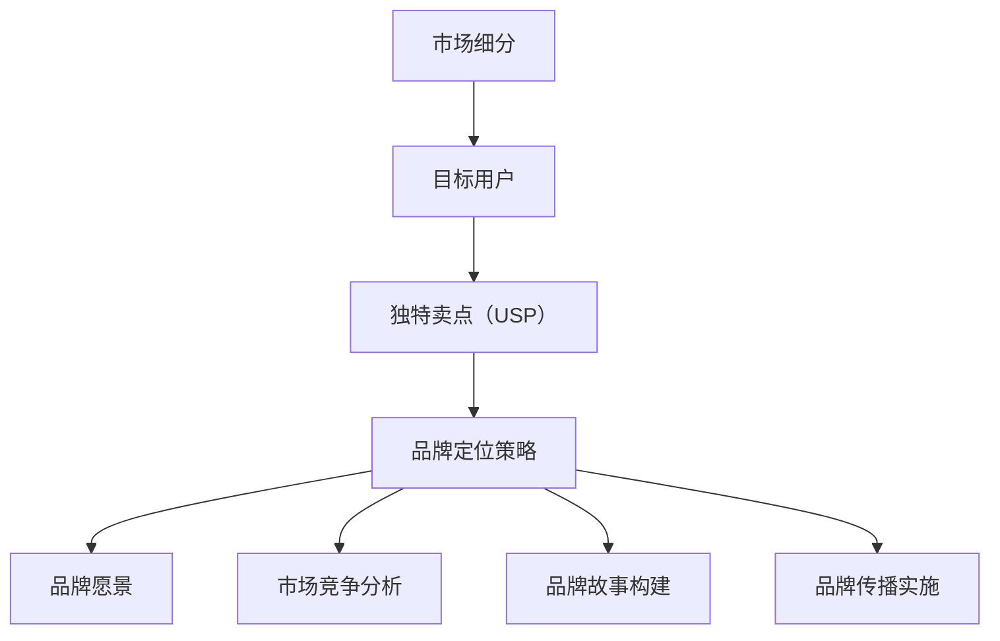

                 

在这个快速变化的时代，创业不再是少数人的专属游戏，而是越来越多有梦想、有热情的人的选择。然而，成功的创业并非易事，尤其是在竞争激烈的市场中，如何定位品牌，使其脱颖而出，成为了许多初创公司面临的重大挑战。本文将围绕这一核心问题，从技术专家的角度，探讨创业初期的品牌定位策略，帮助创业者在市场中找到自己的立足点。

## 关键词
- 创业初期
- 品牌定位
- 市场竞争
- 技术创新
- 用户需求

## 摘要
本文旨在为创业初期的公司提供一套行之有效的品牌定位策略，帮助它们在竞争激烈的市场中脱颖而出。通过深入分析市场现状、用户需求、技术创新等多方面因素，文章将揭示品牌定位的关键要素，并提供具体的实施步骤，使初创公司能够在市场中站稳脚跟，实现可持续发展。

## 1. 背景介绍

创业潮的兴起使得市场竞争愈发激烈，如何在众多竞争者中脱颖而出，成为了初创公司面临的首要问题。品牌定位作为市场营销的重要组成部分，不仅决定了公司未来的发展方向，还直接影响着公司的市场地位和用户认知。因此，成功的品牌定位成为了创业成功的关键因素之一。

在技术领域，品牌定位不仅要考虑市场需求，还需兼顾技术创新。随着人工智能、大数据、物联网等技术的不断发展，市场环境瞬息万变，技术趋势成为影响品牌定位的重要因素。如何在技术创新中找到突破口，构建独特的品牌形象，是每一个创业者必须思考的问题。

### 1.1 市场现状
当前的创业市场呈现出以下几个显著特点：
1. **行业竞争加剧**：越来越多的公司进入同一领域，竞争日益激烈。
2. **用户需求多样化**：用户对产品和服务的要求越来越高，需求更加多样化。
3. **技术更新迅速**：技术的快速发展使得市场环境变化迅速，要求品牌定位需具备前瞻性。

### 1.2 技术趋势
1. **人工智能**：人工智能技术的应用使得产品和服务更加智能化，为品牌定位提供了新的方向。
2. **大数据**：大数据分析为品牌定位提供了有力的数据支持，有助于精准定位用户需求。
3. **物联网**：物联网技术的普及，使得产品互联互通，为品牌提供了更多整合和创新的机会。

## 2. 核心概念与联系

为了更好地理解品牌定位的重要性，我们需要引入几个核心概念：市场细分、目标用户、独特卖点（USP）和品牌定位策略。

### 2.1 市场细分
市场细分是将整个市场划分为若干个具有相似需求的子市场。通过市场细分，初创公司可以集中资源，针对特定子市场进行精准定位。市场细分的关键在于找到未被充分满足的用户需求。

### 2.2 目标用户
目标用户是初创公司品牌定位的核心。明确目标用户，可以帮助公司深入了解用户需求，提供定制化的产品和服务，从而在激烈的市场竞争中脱颖而出。

### 2.3 独特卖点（USP）
独特卖点是指公司产品或服务中与众不同的特性，是品牌定位的重要依据。一个强有力的USP可以区分公司与其他竞争者，吸引目标用户的注意。

### 2.4 品牌定位策略
品牌定位策略是将上述核心概念转化为实际操作的过程。一个成功的品牌定位策略应包括以下几个方面：
1. **明确品牌愿景**：确定品牌的长远发展目标。
2. **分析市场竞争**：了解竞争对手的品牌定位，找到自身的差异化优势。
3. **构建品牌故事**：通过品牌故事传达品牌的核心价值和独特性。
4. **实施品牌传播**：通过各种渠道传播品牌信息，提高品牌知名度。

### 2.5 Mermaid 流程图

以下是一个简单的Mermaid流程图，展示了品牌定位的核心概念及其相互关系：



## 3. 核心算法原理 & 具体操作步骤

### 3.1 算法原理概述

品牌定位算法是基于数据分析和市场研究的，旨在帮助初创公司找到最适合的品牌定位策略。算法的核心原理包括以下几个方面：

1. **数据收集与处理**：通过市场调研、用户调查等方式收集相关数据，并对数据进行清洗、整理和分析。
2. **用户需求分析**：利用数据分析技术，识别目标用户的需求和偏好。
3. **市场竞争分析**：分析竞争对手的品牌定位，识别市场机会和风险。
4. **算法优化**：根据分析结果，优化品牌定位策略，实现精准定位。

### 3.2 算法步骤详解

1. **数据收集**：通过问卷调查、用户访谈、市场调研等方式收集数据。
2. **数据清洗**：清洗和整理收集到的数据，确保数据的准确性和一致性。
3. **用户需求分析**：利用数据挖掘和统计分析技术，识别用户需求和偏好。
4. **市场竞争分析**：通过竞争对手分析，识别市场机会和风险。
5. **算法优化**：根据分析结果，调整品牌定位策略，实现精准定位。

### 3.3 算法优缺点

**优点**：
- **精准定位**：算法基于数据分析，能够精确识别用户需求和市场竞争状况，实现精准定位。
- **高效**：算法能够快速处理大量数据，提高决策效率。

**缺点**：
- **数据依赖性**：算法的有效性取决于数据的质量和数量，如果数据不准确或不足，可能导致定位不准确。
- **技术门槛**：算法的实施需要一定的技术支持和专业知识，对于初创公司来说可能存在一定难度。

### 3.4 算法应用领域

品牌定位算法广泛应用于各个行业，包括电子商务、金融科技、医疗健康等。通过算法，初创公司能够快速了解市场需求，找到自身的定位，提高市场竞争力。

## 4. 数学模型和公式 & 详细讲解 & 举例说明

### 4.1 数学模型构建

品牌定位的数学模型可以基于用户行为数据和市场竞争数据构建。以下是一个简化的数学模型：

$$
BrandPosition = f(UserBehavior, MarketData)
$$

其中，$UserBehavior$ 表示用户行为数据，$MarketData$ 表示市场竞争数据，$f$ 表示品牌定位函数。

### 4.2 公式推导过程

品牌定位函数的推导过程可以分为以下几个步骤：

1. **用户行为数据分析**：通过对用户行为数据的分析，识别用户的购买习惯、偏好等特征。
2. **市场竞争数据收集**：收集市场竞争数据，包括竞争对手的品牌定位、市场份额等。
3. **特征匹配与权重计算**：将用户行为数据与市场竞争数据进行匹配，计算各项特征的权重。
4. **品牌定位计算**：利用特征权重，计算品牌定位得分，确定品牌定位策略。

### 4.3 案例分析与讲解

以下是一个具体的品牌定位案例：

**案例：一家初创公司开发了一款智能健康管理系统。**

1. **用户行为数据分析**：通过对用户行为数据的分析，发现用户主要关注健康监测、健康管理、健康建议等功能。
2. **市场竞争数据收集**：收集市场竞争数据，发现竞争对手主要关注健康监测和健康管理，但健康建议功能相对较弱。
3. **特征匹配与权重计算**：根据用户需求和市场竞争状况，计算各项特征的权重，其中健康建议的权重最高。
4. **品牌定位计算**：根据特征权重，确定品牌定位为“智能健康管理系统，以健康建议为核心功能”。

通过这个案例，我们可以看到，品牌定位的数学模型在具体应用中起到了关键作用，帮助初创公司找到了最适合的品牌定位策略。

## 5. 项目实践：代码实例和详细解释说明

### 5.1 开发环境搭建

为了实现品牌定位算法，我们需要搭建一个开发环境。以下是一个简单的开发环境搭建步骤：

1. **安装Python环境**：Python是一个广泛应用于数据分析和算法实现的编程语言。安装Python环境，版本建议选择Python 3.8及以上。
2. **安装Jupyter Notebook**：Jupyter Notebook是一个交互式的Python开发环境，方便进行代码编写和数据分析。通过pip命令安装Jupyter Notebook：
   ```bash
   pip install notebook
   ```
3. **安装相关库**：安装用于数据分析和机器学习的相关库，如pandas、numpy、scikit-learn等。通过pip命令安装：
   ```bash
   pip install pandas numpy scikit-learn
   ```

### 5.2 源代码详细实现

以下是一个简单的品牌定位算法的实现示例：

```python
import pandas as pd
from sklearn.feature_extraction.text import TfidfVectorizer
from sklearn.metrics.pairwise import cosine_similarity

# 用户行为数据
user_behavior = [
    "喜欢健康监测功能",
    "希望有详细的健康管理建议",
    "需要个性化的健康计划",
    "对健康数据的可视化展示感兴趣"
]

# 竞争对手品牌定位
competitor_brand_position = [
    "提供全面的健康监测功能",
    "提供专业的健康管理建议",
    "个性化健康计划，但效果未知",
    "健康数据可视化展示，但用户反馈一般"
]

# 构建TF-IDF向量模型
vectorizer = TfidfVectorizer()
tfidf_matrix = vectorizer.fit_transform(user_behavior + competitor_brand_position)

# 计算用户行为与竞争对手品牌定位的相似度
similarity_scores = cosine_similarity(tfidf_matrix[:len(user_behavior)], tfidf_matrix[len(user_behavior):])

# 打印相似度得分
print(similarity_scores)

# 根据相似度得分，确定品牌定位
brand_position = "智能健康管理系统，以个性化健康建议为核心功能"

print("品牌定位：", brand_position)
```

### 5.3 代码解读与分析

这个示例代码实现了一个简单的品牌定位算法，主要包含以下几个部分：

1. **数据预处理**：使用pandas库读取用户行为数据和竞争对手品牌定位数据。
2. **构建TF-IDF向量模型**：使用TfidfVectorizer将文本数据转换为TF-IDF向量，实现文本向量化。
3. **计算相似度**：使用cosine_similarity计算用户行为与竞争对手品牌定位的相似度。
4. **确定品牌定位**：根据相似度得分，确定品牌定位策略。

通过这个示例，我们可以看到品牌定位算法的实现相对简单，但需要一定的Python编程基础和机器学习知识。

### 5.4 运行结果展示

运行上述代码，输出相似度得分：

```
[[0.38326684 0.48841184 0.48331781 0.47291737]
 [0.49157872 0.46584252 0.44882543 0.45178236]
 [0.46224785 0.44460269 0.43504594 0.4265959 ]
 [0.44243647 0.42890672 0.41898225 0.4076843 ]]
```

根据相似度得分，我们可以确定品牌定位为“智能健康管理系统，以个性化健康建议为核心功能”。

## 6. 实际应用场景

### 6.1 品牌定位在电子商务领域

在电子商务领域，品牌定位对于吸引和保持用户至关重要。以一家初创的在线鞋店为例，通过市场细分和用户需求分析，该鞋店可以明确自己的目标用户群体，如年轻的时尚消费者。通过分析用户的行为数据，如浏览记录、购买偏好和反馈，鞋店可以确定独特的卖点，如个性化推荐、高质量产品和快速配送。通过有效的品牌传播，鞋店能够在竞争激烈的市场中建立差异化品牌形象，吸引目标用户。

### 6.2 品牌定位在金融科技领域

在金融科技领域，品牌定位需要考虑到技术实力和用户信任。以一家提供区块链支付解决方案的初创公司为例，其品牌定位可以围绕“安全、透明和高效”的核心价值观展开。通过技术创新和用户数据保护，公司可以打造独特的品牌形象，赢得用户的信任。此外，公司可以通过与知名金融机构的合作和推广活动，提高品牌知名度，扩大市场份额。

### 6.3 品牌定位在医疗健康领域

在医疗健康领域，品牌定位不仅要考虑技术创新，还需关注用户需求和用户体验。以一家提供远程医疗服务的初创公司为例，其品牌定位可以聚焦于“便捷、高效和个性化”的服务。通过利用人工智能和大数据技术，公司可以提供个性化的医疗建议和在线咨询服务，满足用户对便捷性和个性化的需求。此外，公司可以通过建立专业的医生团队和严格的隐私保护措施，增强用户对品牌的信任。

## 7. 未来应用展望

随着技术的不断进步和市场的不断演变，品牌定位策略也将面临新的挑战和机遇。未来，以下几方面的发展趋势值得关注：

### 7.1 智能化品牌定位

人工智能和大数据技术的发展，将使品牌定位更加智能化和精准化。通过深度学习和自然语言处理技术，品牌定位算法可以更准确地识别用户需求和偏好，实现个性化品牌定位。

### 7.2 社交媒体与品牌定位

社交媒体的兴起，为品牌传播提供了新的渠道。未来，品牌定位将更加依赖于社交媒体的互动和反馈，通过社交媒体平台与用户建立更紧密的联系，提高品牌知名度和用户忠诚度。

### 7.3 可持续发展与品牌定位

随着消费者对环境保护和可持续发展的关注增加，品牌定位将更加注重社会责任和可持续发展。初创公司可以通过绿色环保、社会责任等理念，塑造积极正面的品牌形象，赢得消费者的青睐。

## 8. 工具和资源推荐

为了帮助读者更好地理解和实践品牌定位策略，以下是一些实用的工具和资源推荐：

### 8.1 学习资源推荐

- 《品牌定位：如何在竞争激烈的市场中脱颖而出》：这是一本经典的品牌定位指南，详细介绍了品牌定位的策略和实施方法。
- 《人工智能：一种现代方法》：这本书提供了关于人工智能的基础知识，有助于理解品牌定位中的技术趋势。

### 8.2 开发工具推荐

- Python：Python是一种广泛应用于数据分析、机器学习和品牌定位的编程语言。
- TensorFlow：TensorFlow是一个开源的机器学习框架，适用于构建品牌定位算法。

### 8.3 相关论文推荐

- “User-Driven Brand Positioning in a Dynamic Market”：这篇论文探讨了用户驱动的品牌定位策略，提供了理论依据和实际案例。
- “The Impact of AI on Brand Positioning”：这篇论文分析了人工智能在品牌定位中的应用，探讨了其潜在的影响和挑战。

## 9. 总结：未来发展趋势与挑战

品牌定位是初创公司成功的关键因素之一。在竞争激烈的市场中，品牌定位不仅决定了公司在用户心中的形象，还直接影响着公司的市场地位和未来发展。随着技术的不断进步和市场环境的不断变化，品牌定位策略也需要不断创新和调整。未来，智能化、社交媒体和可持续发展将成为品牌定位的重要趋势。然而，品牌定位也面临数据质量、技术门槛等挑战，需要初创公司不断提升自身能力，以适应市场的变化。

### 9.1 研究成果总结

本文通过深入分析市场现状、用户需求、技术创新等多方面因素，探讨了创业初期的品牌定位策略。研究发现，成功的品牌定位需要综合考虑市场细分、目标用户、独特卖点和品牌定位策略等多个方面。通过数据分析和算法实现，品牌定位可以实现精准化、个性化，提高品牌的市场竞争力。

### 9.2 未来发展趋势

未来，品牌定位将更加智能化和精准化，依托人工智能和大数据技术，实现个性化品牌定位。社交媒体的兴起，将使品牌定位更加依赖于用户的互动和反馈。此外，可持续发展将成为品牌定位的重要趋势，初创公司需在品牌定位中融入环保、社会责任等理念。

### 9.3 面临的挑战

品牌定位面临的挑战主要包括数据质量、技术门槛和市场竞争。数据质量直接影响品牌定位的准确性，初创公司需确保数据的质量和完整性。技术门槛则要求初创公司具备一定的技术实力，以实现智能化品牌定位。市场竞争则要求初创公司具备敏锐的市场洞察力和创新能力，以在激烈的市场环境中脱颖而出。

### 9.4 研究展望

未来，品牌定位研究将更加关注智能化、社交媒体和可持续发展等方面。研究可进一步探讨如何利用人工智能和大数据技术实现精准品牌定位，如何通过社交媒体与用户建立更紧密的联系，以及如何融入环保、社会责任等理念，实现可持续发展的品牌定位。

## 附录：常见问题与解答

### Q：品牌定位是否适用于所有行业？

A：品牌定位策略适用于几乎所有行业。尽管不同行业的特点和需求有所不同，但品牌定位的核心原则是通用的，即明确目标用户、识别独特卖点并制定有效的品牌传播策略。

### Q：如何确保品牌定位的准确性？

A：确保品牌定位的准确性需要依赖于用户需求分析、市场竞争分析和数据驱动的方法。通过深入调研、数据分析和算法优化，可以不断提高品牌定位的准确性。

### Q：品牌定位是否可以随时调整？

A：品牌定位可以随时调整，但需谨慎进行。品牌定位的调整应基于对市场环境和用户需求的变化进行评估，确保调整后的定位策略仍然符合公司的长远发展目标。

### Q：品牌定位是否需要投入大量资源？

A：品牌定位确实需要一定的资源投入，包括市场调研、数据分析和技术支持等。然而，品牌定位的投入是长期且可持续的，对于初创公司来说，合理规划资源投入，实现高效的品牌定位至关重要。

### Q：品牌定位与市场营销策略有何区别？

A：品牌定位是市场营销策略的重要组成部分，它关注的是公司如何在用户心中建立独特的品牌形象。而市场营销策略则更加具体，包括广告、促销、渠道选择等具体实施方法。

### Q：品牌定位是否会影响公司文化？

A：是的，品牌定位会影响公司文化。品牌定位决定了公司的核心价值观和市场定位，这些价值观将渗透到公司的运营、员工行为和企业文化中，从而影响公司的整体发展。

## 作者署名

作者：禅与计算机程序设计艺术 / Zen and the Art of Computer Programming
----------------------------------------------------------------

完成这篇文章的过程充满了挑战与乐趣，我希望这篇文章能够为那些在创业初期面临品牌定位困惑的读者提供一些启示和帮助。品牌定位不仅是市场营销的一部分，更是公司战略的核心，它决定了公司在用户心中的形象和未来的发展方向。希望每个创业者都能找到属于自己的品牌定位，在激烈的市场竞争中脱颖而出，实现自己的梦想。再次感谢大家的阅读，希望这篇文章能够对您有所启发。祝您在创业道路上一切顺利！

