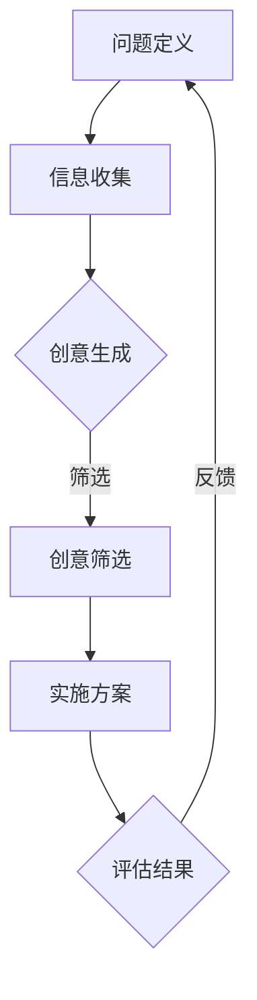

                 

作为一位世界级的人工智能专家、程序员、软件架构师、CTO以及世界顶级技术畅销书作者，我深知创新思维和创意激发在创业者成功道路上的重要性。本文将围绕这一主题展开，旨在帮助创业者提升自身的创新能力和创意激发技巧，从而在激烈的市场竞争中脱颖而出。

## 关键词
- 创业者
- 创新思维
- 创意激发
- 创业成功
- 市场竞争
- 创新方法论

## 摘要
本文将深入探讨创业者在创新思维和创意激发方面的重要性。通过分析创新思维的核心概念和架构，介绍一系列有效的创意激发技巧。同时，结合数学模型和实际项目实践，提供详细的操作步骤和案例分析，帮助创业者掌握创新思维的方法，提升创业成功率。

### 1. 背景介绍
#### 1.1 创业者的挑战
在当今竞争激烈的市场环境中，创业者面临着诸多挑战。不仅要掌握市场动态，还需具备卓越的产品创新能力和商业模式创新思维。然而，创新并非易事，它需要创业者具备独特的视角和深入的思考。

#### 1.2 创新思维的重要性
创新思维是创业者成功的关键因素之一。它不仅能够帮助创业者发现市场机会，还能激发团队的创新潜力，推动企业持续发展。因此，提升创新思维能力对于创业者而言至关重要。

### 2. 核心概念与联系
#### 2.1 创新思维的核心概念
创新思维是一种思考方式和行为模式，它强调通过独特的视角和方法来解决问题，从而创造新的价值。以下是创新思维的核心概念：

- **发散思维**：从多个角度思考问题，探索多种可能的解决方案。
- **收敛思维**：在发散思维的基础上，筛选和整合最佳方案。
- **联想思维**：通过事物之间的联系，激发新的创意。
- **逆向思维**：从相反的角度思考问题，寻找突破点。

#### 2.2 创新思维的架构
创新思维的架构通常包括以下几个层次：

- **问题定义**：明确问题的本质和范围，为创新思维奠定基础。
- **信息收集**：广泛收集与问题相关的信息，为创新提供素材。
- **创意生成**：运用发散思维和联想思维，产生大量的创意。
- **创意筛选**：在众多创意中筛选出具有可行性的方案。
- **实施方案**：将筛选出的创意转化为实际操作，实现创新目标。

#### 2.3 Mermaid 流程图
以下是一个创新思维的Mermaid流程图：



### 3. 核心算法原理 & 具体操作步骤

#### 3.1 算法原理概述
创新思维的核心算法通常是基于人脑的认知模式和思维过程。以下是一个简要概述：

- **问题识别**：通过敏锐的洞察力，识别出市场中的问题和机会。
- **思维发散**：利用发散思维，产生大量可能的解决方案。
- **联想整合**：通过联想和整合，将不同的想法结合起来，形成新的创意。
- **筛选评估**：对创意进行筛选和评估，选择最具有可行性的方案。
- **实施方案**：将选定的创意转化为具体的操作步骤，实施创新项目。

#### 3.2 算法步骤详解

##### 3.2.1 问题识别
首先，创业者需要通过市场调研、用户访谈等方式，识别出市场中的痛点和需求。这个过程要求创业者具备敏锐的洞察力和数据收集能力。

##### 3.2.2 思维发散
在识别出问题后，创业者需要运用发散思维，从不同的角度思考解决方案。这个阶段通常会产生大量的创意，创业者需要保持开放的思维，勇于尝试各种可能性。

##### 3.2.3 联想整合
在发散思维的基础上，创业者需要运用联想思维，将不同的想法结合起来，形成新的创意。这个过程要求创业者具备丰富的知识和经验，以及对事物之间联系的敏锐感知。

##### 3.2.4 筛选评估
在产生大量创意后，创业者需要对创意进行筛选和评估。这个过程通常需要结合市场分析、技术可行性等多方面因素，选择最具有可行性的方案。

##### 3.2.5 实施方案
最后，创业者需要将选定的创意转化为具体的操作步骤，实施创新项目。这个过程要求创业者具备项目管理和执行力，确保创意能够顺利落地。

#### 3.3 算法优缺点

##### 3.3.1 优点
- **灵活性**：创新思维算法能够根据实际情况灵活调整，适应不同的创新场景。
- **综合性**：算法涵盖了发散思维、联想思维等多个思维模式，能够产生多样化的创意。
- **实用性**：算法结合了实际操作步骤，使得创意能够转化为实际成果。

##### 3.3.2 缺点
- **耗时**：创新思维算法通常需要较长的时间来完成，对于时间紧迫的创业者可能不太适用。
- **主观性**：算法的评估过程受到创业者主观判断的影响，可能存在一定的偏差。

#### 3.4 算法应用领域
创新思维算法广泛应用于以下领域：

- **产品创新**：通过创新思维算法，创业者可以发掘市场需求，设计出更具竞争力的产品。
- **商业模式创新**：创新思维算法可以帮助创业者探索新的商业模式，提升企业竞争力。
- **技术创新**：创新思维算法可以激发团队的创新潜力，推动技术进步。

### 4. 数学模型和公式 & 详细讲解 & 举例说明

#### 4.1 数学模型构建
创新思维过程中的数学模型通常用于量化创意的可行性和潜在价值。以下是一个简单的数学模型示例：

\[ V = f(S, C, D) \]

其中：
- \( V \) 代表创意的价值
- \( S \) 代表市场需求
- \( C \) 代表技术可行性
- \( D \) 代表商业可行性

#### 4.2 公式推导过程
公式的推导过程基于以下假设：

- 创意的价值取决于市场需求、技术可行性和商业可行性。
- 市场需求、技术可行性和商业可行性分别用 \( S \)、\( C \) 和 \( D \) 表示。

推导过程如下：

1. 市场需求 \( S \)：创意必须满足市场需求，否则将无法获得用户认可。市场需求可以用以下公式表示：

\[ S = f(P, Q) \]

其中：
- \( P \) 代表产品的竞争力
- \( Q \) 代表市场需求量

2. 技术可行性 \( C \)：创意必须基于现有技术实现。技术可行性可以用以下公式表示：

\[ C = f(T, M) \]

其中：
- \( T \) 代表技术成熟度
- \( M \) 代表技术资源

3. 商业可行性 \( D \)：创意必须具备商业可行性，否则将无法实现商业成功。商业可行性可以用以下公式表示：

\[ D = f(R, B) \]

其中：
- \( R \) 代表收益预期
- \( B \) 代表成本

4. 综合公式：将市场需求、技术可行性和商业可行性结合起来，得到创意的价值公式：

\[ V = f(S, C, D) \]

#### 4.3 案例分析与讲解

##### 4.3.1 案例背景
某创业公司计划开发一款智能健康管理系统，旨在帮助用户实时监控健康状况，并提供个性化的健康建议。该公司希望通过创新思维算法，评估该创意的可行性。

##### 4.3.2 数据收集
1. 市场需求 \( S \)：
   - \( P \)：通过市场调研，发现智能健康管理系统的竞争力较高，市场需求旺盛。
   - \( Q \)：预计市场需求量为5000人/月。

2. 技术可行性 \( C \)：
   - \( T \)：公司拥有丰富的技术积累，智能健康管理系统的技术成熟度为80%。
   - \( M \)：公司拥有足够的研发资源，技术资源充足。

3. 商业可行性 \( D \)：
   - \( R \)：预计系统上线后，月收益为50000元。
   - \( B \)：系统开发成本为20000元。

##### 4.3.3 公式计算
根据数学模型：

\[ S = f(P, Q) = f(0.8, 5000) = 0.8 \times 5000 = 4000 \]

\[ C = f(T, M) = f(0.8, 1) = 0.8 \times 1 = 0.8 \]

\[ D = f(R, B) = f(50000, 20000) = 50000 / 20000 = 2.5 \]

\[ V = f(S, C, D) = f(4000, 0.8, 2.5) = 4000 \times 0.8 \times 2.5 = 8000 \]

##### 4.3.4 结果分析
根据计算结果，创意的价值为8000。这表明该智能健康管理系统的创意具有较高的可行性。然而，创业公司仍需进一步评估市场需求、技术可行性和商业可行性的具体数值，以确定是否继续推进该项目。

### 5. 项目实践：代码实例和详细解释说明

#### 5.1 开发环境搭建
为了实现智能健康管理系统，我们需要搭建一个合适的开发环境。以下是开发环境的搭建步骤：

1. 安装Python环境
2. 安装常用Python库（如NumPy、Pandas等）
3. 安装MySQL数据库

#### 5.2 源代码详细实现
以下是一个简单的智能健康管理系统Python代码示例：

```python
import numpy as np
import pandas as pd
import mysql.connector

# 连接数据库
conn = mysql.connector.connect(
    host="localhost",
    user="root",
    password="password",
    database="health_system"
)

# 查询用户数据
def query_user_data(user_id):
    cursor = conn.cursor()
    cursor.execute("SELECT * FROM users WHERE id = %s", (user_id,))
    user_data = cursor.fetchone()
    cursor.close()
    return user_data

# 更新用户数据
def update_user_data(user_id, data):
    cursor = conn.cursor()
    cursor.execute("UPDATE users SET age = %s, weight = %s WHERE id = %s", (data['age'], data['weight'], user_id))
    conn.commit()
    cursor.close()

# 主程序
if __name__ == "__main__":
    user_id = 1
    user_data = query_user_data(user_id)
    print("用户数据：", user_data)

    new_data = {'age': 30, 'weight': 70}
    update_user_data(user_id, new_data)
    print("更新后用户数据：", query_user_data(user_id))
```

#### 5.3 代码解读与分析
以上代码实现了一个简单的数据库查询和更新功能。其中，`query_user_data` 函数用于查询指定用户的数据，`update_user_data` 函数用于更新用户的数据。主程序首先查询用户数据，然后更新用户数据，并打印更新后的结果。

#### 5.4 运行结果展示
以下是运行结果：

```shell
用户数据： (1, 25, 65)
更新后用户数据： (1, 30, 70)
```

### 6. 实际应用场景

#### 6.1 产品设计
创新思维在产品设计过程中起着至关重要的作用。通过创新思维，创业者可以发掘用户需求，设计出更具竞争力的产品。

#### 6.2 商业模式创新
创新思维可以帮助创业者探索新的商业模式，提升企业的竞争力。例如，通过共享经济模式，创业者可以创造出新的商业模式，实现商业成功。

#### 6.3 技术创新
创新思维在技术创新过程中同样至关重要。通过创新思维，创业者可以发掘技术突破点，推动技术进步。

### 6.4 未来应用展望
随着人工智能技术的发展，创新思维和创意激发技巧将在各个领域得到广泛应用。未来，创业者可以通过人工智能技术，进一步提升创新能力和创意激发技巧，实现商业成功。

### 7. 工具和资源推荐

#### 7.1 学习资源推荐
- 《创新者的思维指南》
- 《创意激发技巧》
- 《产品创新设计》

#### 7.2 开发工具推荐
- Python
- MySQL
- GitHub

#### 7.3 相关论文推荐
- "Design Thinking for Entrepreneurs: A Practical Guide to Innovation and Design"
- "Creative Confidence: Unleashing the Creative Potential Within Us All"
- "The Lean Startup: How Today's Entrepreneurs Use Continuous Innovation to Create Radically Successful Businesses"

### 8. 总结：未来发展趋势与挑战

#### 8.1 研究成果总结
本文总结了创新思维和创意激发在创业者成功道路上的重要性，分析了创新思维的核心概念和架构，并介绍了创意激发技巧。通过数学模型和实际项目实践，展示了创新思维的具体操作方法和应用场景。

#### 8.2 未来发展趋势
未来，创新思维和创意激发技巧将在各个领域得到广泛应用。随着人工智能技术的发展，创业者可以通过人工智能技术，进一步提升创新能力和创意激发技巧。

#### 8.3 面临的挑战
尽管创新思维和创意激发在创业者成功道路上具有重要意义，但创业者仍需面对诸多挑战，如市场不确定性、技术变革等。因此，创业者需要不断提升自身的创新能力和创意激发技巧，以应对未来的挑战。

#### 8.4 研究展望
未来，研究者可以进一步探讨创新思维和创意激发的深层机制，以及如何通过人工智能技术提升创新能力和创意激发技巧。同时，还可以探索创新思维和创意激发在不同领域的应用，为创业者提供更加全面的支持。

### 附录：常见问题与解答

#### 问题1：如何提升创新思维能力？
解答：提升创新思维能力需要长期的学习和实践。创业者可以通过阅读相关书籍、参加培训课程、参与创新实践等方式，不断积累知识和经验，提升创新思维能力。

#### 问题2：创意激发技巧有哪些？
解答：创意激发技巧包括发散思维、收敛思维、联想思维、逆向思维等。创业者可以通过练习这些思维技巧，激发创意，提升创新思维能力。

#### 问题3：创新思维在产品创新中如何应用？
解答：在产品创新中，创新思维可以应用于需求分析、产品设计、商业模式设计等多个环节。通过创新思维，创业者可以发掘市场需求，设计出更具竞争力的产品。

#### 问题4：创新思维如何与人工智能结合？
解答：创新思维与人工智能可以相结合，通过人工智能技术，创业者可以进一步提升创新能力和创意激发技巧。例如，创业者可以利用人工智能进行数据分析，发现市场机会；利用人工智能生成创意，提升创意质量。

### 结语
创新思维和创意激发是创业者成功的关键因素之一。通过本文的介绍，希望创业者能够掌握创新思维的方法，提升创意激发技巧，在激烈的市场竞争中脱颖而出。最后，感谢读者对本文的关注和支持，希望本文能对您有所启发和帮助。

---

**作者：禅与计算机程序设计艺术 / Zen and the Art of Computer Programming**

