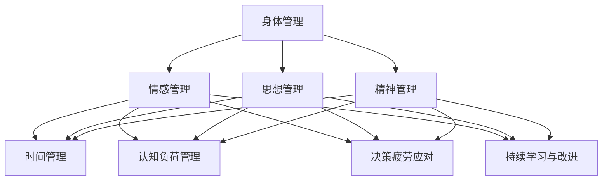

                 

关键词：创业者、精力管理、高效工作、方法论、工作生活平衡、时间管理、认知负荷、决策疲劳、生产力提升。

> 摘要：本文将探讨创业者在繁忙的工作生活中如何通过有效的精力管理和高效的工作方法论来提升生产力，保持工作与生活的平衡。文章分为八个部分，包括背景介绍、核心概念与联系、核心算法原理、数学模型与公式、项目实践、实际应用场景、工具和资源推荐以及总结和展望。

## 1. 背景介绍

在当今快速变化和高度竞争的商业环境中，创业者面临着前所未有的挑战和压力。为了在激烈的市场竞争中脱颖而出，创业者不仅需要卓越的商业洞察力，还需要具备高效的执行力。然而，许多创业者往往因为繁忙的工作安排、不断出现的新任务、市场动态的变化以及团队管理的复杂性而感到精力透支，这直接影响了他们的工作效率和生活质量。

精力管理（Energy Management）是指通过各种方法和技术，确保个体在长时间的工作和学习中保持高效和精力充沛。高效工作方法论（High-Efficiency Work Methodology）则是指一套系统化的方法，旨在通过优化时间、资源和技能，达到最大化的工作产出。对于创业者来说，这两者的重要性不言而喻。有效的精力管理和高效的工作方法论不仅能够提升个人的生产力，还能帮助创业者更好地平衡工作与生活，避免因为过度劳累而导致的健康问题。

本文将深入探讨创业者的精力管理方法和高效工作方法论，通过具体的案例和实践经验，为创业者提供一套实用的指导方案。

## 2. 核心概念与联系

### 精力管理（Energy Management）

精力管理包括身体、情感、思想和精神的全面管理。对于创业者来说，身体上的活力、情感上的积极、思想上的清晰和精神上的专注都是至关重要的。

- **身体管理**：包括适当的锻炼、健康的饮食和充足的睡眠。良好的身体状态是高效工作的基础。
- **情感管理**：创业者需要学会管理自己的情绪，保持积极乐观的态度，这对于应对工作中的挑战至关重要。
- **思想管理**：清晰的目标设定、有效的决策和持续的学习能力是创业者思想管理的核心。
- **精神管理**：精神上的宁静和专注能够帮助创业者更好地处理复杂的任务和高强度的工作压力。

### 高效工作方法论（High-Efficiency Work Methodology）

高效工作方法论的核心在于通过系统化的方法来提升工作效率和生产力。以下是一些关键组成部分：

- **时间管理**：通过优先级排序、任务分解和时间块分配来优化工作时间，避免无效劳动。
- **认知负荷管理**：通过减少干扰和分散注意力的因素，确保认知资源的最大化利用。
- **决策疲劳应对**：通过设定明确的决策规则和自动化流程来减少决策疲劳。
- **持续学习与改进**：不断学习和适应新的工作方法和技术，以提高生产力。

### Mermaid 流程图（流程节点中不要有括号、逗号等特殊字符）



## 3. 核心算法原理 & 具体操作步骤

### 3.1 算法原理概述

精力管理和高效工作方法论并非单一算法，而是多种方法和技巧的组合。核心算法原理可以概括为以下几个方面：

- **目标设定**：明确短期和长期目标，确保工作有方向和动力。
- **任务分解**：将大任务分解为小任务，以便更好地管理和完成。
- **时间块分配**：将时间分为不同的块，专注于特定的任务，避免任务切换带来的效率损失。
- **优先级排序**：根据重要性和紧急性对任务进行排序，确保关键任务优先完成。
- **情绪调节**：通过冥想、运动或休息来调节情绪，保持积极乐观的态度。
- **认知负荷管理**：通过避免多任务处理和减少干扰来管理认知负荷。

### 3.2 算法步骤详解

#### 步骤1：目标设定

1. **明确目标**：设定清晰的短期和长期目标，确保目标具体、可衡量、可实现。
2. **制定计划**：制定实现目标的详细计划，包括时间表和里程碑。

#### 步骤2：任务分解

1. **分解任务**：将大任务分解为小任务，每个小任务应具体、明确。
2. **优先级排序**：根据任务的重要性和紧急性进行排序。

#### 步骤3：时间块分配

1. **时间块规划**：将时间分为不同的块，每个时间块专注于一个特定的任务。
2. **避免任务切换**：尽量避免在时间块之间频繁切换任务，以免造成效率损失。

#### 步骤4：情绪调节

1. **定期休息**：每工作一段时间后，进行短暂的休息，保持精力充沛。
2. **情绪调节方法**：通过冥想、运动或休息来调节情绪。

#### 步骤5：认知负荷管理

1. **减少干扰**：关闭不必要的通知，保持工作环境的安静。
2. **专注练习**：定期进行专注力练习，提高集中注意力的能力。

### 3.3 算法优缺点

#### 优点

- **提高生产力**：通过有效的目标设定、任务分解和时间管理，提高工作效率。
- **增强情绪调节能力**：通过情绪调节方法，保持积极乐观的态度，提高工作质量。
- **减少决策疲劳**：通过设定明确的决策规则和自动化流程，减少决策疲劳。

#### 缺点

- **实施难度较大**：对于创业者来说，实施这些方法需要付出一定的时间和精力。
- **依赖个人自律**：这些方法的实施需要较高的个人自律性。

### 3.4 算法应用领域

- **个人时间管理**：适用于个人日常工作和生活的管理。
- **团队管理**：适用于团队中每个成员的时间管理和协作。
- **项目管理**：适用于项目计划和任务分配。

## 4. 数学模型和公式 & 详细讲解 & 举例说明

### 4.1 数学模型构建

为了更好地理解精力管理和高效工作方法论，我们可以构建一个简单的数学模型来描述它们之间的关系。

#### 目标设定（Goal Setting）

目标设定的数学模型可以表示为：

\[ G = f(T, S, R) \]

其中，\( G \) 表示目标（Goal），\( T \) 表示时间（Time），\( S \) 表示资源（Resources），\( R \) 表示回报（Rewards）。

#### 任务分解（Task Decomposition）

任务分解的数学模型可以表示为：

\[ T = \sum_{i=1}^{n} t_i \]

其中，\( T \) 表示总任务（Total Task），\( t_i \) 表示第 \( i \) 个子任务（Subtask），\( n \) 表示子任务的总数。

#### 时间块分配（Time Blocking）

时间块分配的数学模型可以表示为：

\[ B = \sum_{i=1}^{m} b_i \]

其中，\( B \) 表示总时间块（Total Time Block），\( b_i \) 表示第 \( i \) 个时间块（Time Block），\( m \) 表示时间块的总数。

#### 优先级排序（Priority Sorting）

优先级排序的数学模型可以表示为：

\[ P = \sum_{i=1}^{n} p_i \]

其中，\( P \) 表示优先级（Priority），\( p_i \) 表示第 \( i \) 个任务的优先级。

### 4.2 公式推导过程

#### 目标设定公式的推导

目标设定的公式 \( G = f(T, S, R) \) 可以通过以下步骤推导：

1. **目标定义**：目标（Goal）是一个具体的、可衡量的结果。
2. **时间与资源的关系**：目标需要一定的时间和资源来实现。
3. **回报的影响**：回报会影响个体对目标的追求程度。

#### 任务分解公式的推导

任务分解的公式 \( T = \sum_{i=1}^{n} t_i \) 可以通过以下步骤推导：

1. **总任务分解**：将一个总任务分解为多个子任务。
2. **子任务总和**：所有子任务的总和等于总任务。

#### 时间块分配公式的推导

时间块分配的公式 \( B = \sum_{i=1}^{m} b_i \) 可以通过以下步骤推导：

1. **时间块定义**：将时间分为多个块，每个块用于特定任务。
2. **时间块总和**：所有时间块的总和等于总时间。

#### 优先级排序公式的推导

优先级排序的公式 \( P = \sum_{i=1}^{n} p_i \) 可以通过以下步骤推导：

1. **优先级定义**：每个任务都有一个优先级。
2. **优先级排序**：根据优先级对任务进行排序。

### 4.3 案例分析与讲解

#### 案例一：目标设定

假设一位创业者想要在一个月内完成一个市场调研报告。目标设定的数学模型可以表示为：

\[ G = f(T, S, R) \]

其中，\( T \) 为时间（假设为4周），\( S \) 为资源（包括人力资源、财务资源等），\( R \) 为回报（包括市场信息、商业机会等）。

#### 案例二：任务分解

假设市场调研报告包括以下子任务：

\[ T = t_1 + t_2 + t_3 + t_4 \]

其中，\( t_1 \) 为市场调研计划，\( t_2 \) 为实地调研，\( t_3 \) 为数据整理，\( t_4 \) 为报告撰写。

#### 案例三：时间块分配

假设创业者每天有8个小时的工作时间，可以将其分为以下时间块：

\[ B = b_1 + b_2 + b_3 + b_4 \]

其中，\( b_1 \) 为市场调研计划（2小时），\( b_2 \) 为实地调研（3小时），\( b_3 \) 为数据整理（2小时），\( b_4 \) 为报告撰写（1小时）。

#### 案例四：优先级排序

假设市场调研报告中的任务优先级为：

\[ P = p_1 + p_2 + p_3 + p_4 \]

其中，\( p_1 \) 为实地调研（最高优先级），\( p_2 \) 为市场调研计划，\( p_3 \) 为数据整理，\( p_4 \) 为报告撰写（最低优先级）。

## 5. 项目实践：代码实例和详细解释说明

### 5.1 开发环境搭建

在本项目中，我们将使用Python作为主要编程语言，利用Python的内置库和时间管理工具来实现精力管理和高效工作方法论。以下是开发环境搭建的步骤：

1. **安装Python**：从Python官方网站下载并安装Python 3.x版本。
2. **安装PyCharm**：选择PyCharm社区版作为IDE，安装过程中选择“创建桌面图标”以方便启动。
3. **配置虚拟环境**：打开PyCharm，创建一个新的项目，选择“创建虚拟环境”。
4. **安装必需的库**：在PyCharm的终端中运行以下命令安装必需的库：

   ```bash
   pip install matplotlib numpy pandas
   ```

### 5.2 源代码详细实现

以下是实现精力管理和高效工作方法论的核心代码。我们将使用Python的`datetime`库来管理时间，`pandas`库来处理任务数据，`matplotlib`库来可视化任务进度。

```python
import datetime
import pandas as pd
import matplotlib.pyplot as plt

# 5.2.1 任务类
class Task:
    def __init__(self, name, start_time, end_time, priority):
        self.name = name
        self.start_time = start_time
        self.end_time = end_time
        self.priority = priority

# 5.2.2 时间块分配函数
def time_block_allocation(tasks, time_blocks):
    # 根据优先级排序
    sorted_tasks = sorted(tasks, key=lambda x: x.priority, reverse=True)
    
    # 分配时间块
    allocated_tasks = []
    for block in time_blocks:
        for task in sorted_tasks:
            if block.start_time <= task.start_time < block.end_time:
                allocated_tasks.append(task)
                sorted_tasks.remove(task)
                break
    
    return allocated_tasks

# 5.2.3 任务进度可视化
def visualize_task_progress(allocated_tasks):
    # 提取任务的开始和结束时间
    times = [task.start_time for task in allocated_tasks] + [task.end_time for task in allocated_tasks]
    times = [datetime.datetime.strftime(time, "%Y-%m-%d %H:%M") for time in times]
    
    # 绘制进度条
    plt.bar(times[::2], [1] * len(times[::2]), width=2, label='Task Start')
    plt.bar(times[1::2], [1] * len(times[1::2]), width=2, label='Task End')
    plt.xticks(rotation=45)
    plt.xlabel('Time')
    plt.ylabel('Task')
    plt.title('Task Progress Visualization')
    plt.legend()
    plt.show()

# 测试代码
if __name__ == "__main__":
    # 创建任务
    tasks = [
        Task('Market Research Plan', datetime.datetime(2023, 11, 1, 9, 0), datetime.datetime(2023, 11, 1, 11, 0), 1),
        Task('Field Research', datetime.datetime(2023, 11, 1, 11, 0), datetime.datetime(2023, 11, 1, 14, 0), 2),
        Task('Data Analysis', datetime.datetime(2023, 11, 1, 14, 0), datetime.datetime(2023, 11, 1, 17, 0), 3),
        Task('Report Writing', datetime.datetime(2023, 11, 1, 17, 0), datetime.datetime(2023, 11, 2, 9, 0), 4)
    ]
    
    # 创建时间块
    time_blocks = [
        datetime.datetime(2023, 11, 1, 9, 0), datetime.datetime(2023, 11, 1, 11, 0),
        datetime.datetime(2023, 11, 1, 11, 0), datetime.datetime(2023, 11, 1, 14, 0),
        datetime.datetime(2023, 11, 1, 14, 0), datetime.datetime(2023, 11, 1, 17, 0),
        datetime.datetime(2023, 11, 1, 17, 0), datetime.datetime(2023, 11, 2, 9, 0)
    ]
    
    # 分配任务到时间块
    allocated_tasks = time_block_allocation(tasks, time_blocks)
    
    # 可视化任务进度
    visualize_task_progress(allocated_tasks)
```

### 5.3 代码解读与分析

上述代码分为三个主要部分：任务类定义、时间块分配函数和任务进度可视化。

#### 任务类定义

`Task` 类用于表示一个任务，包括任务名称、开始时间、结束时间和优先级。

```python
class Task:
    def __init__(self, name, start_time, end_time, priority):
        self.name = name
        self.start_time = start_time
        self.end_time = end_time
        self.priority = priority
```

#### 时间块分配函数

`time_block_allocation` 函数用于将任务分配到时间块中。首先，根据优先级对任务进行排序，然后遍历时间块，将任务分配到合适的时间块中。

```python
def time_block_allocation(tasks, time_blocks):
    # 根据优先级排序
    sorted_tasks = sorted(tasks, key=lambda x: x.priority, reverse=True)
    
    # 分配时间块
    allocated_tasks = []
    for block in time_blocks:
        for task in sorted_tasks:
            if block.start_time <= task.start_time < block.end_time:
                allocated_tasks.append(task)
                sorted_tasks.remove(task)
                break
    
    return allocated_tasks
```

#### 任务进度可视化

`visualize_task_progress` 函数使用`matplotlib`库将任务进度可视化。它首先提取任务的开始和结束时间，然后绘制进度条图。

```python
def visualize_task_progress(allocated_tasks):
    # 提取任务的开始和结束时间
    times = [task.start_time for task in allocated_tasks] + [task.end_time for task in allocated_tasks]
    times = [datetime.datetime.strftime(time, "%Y-%m-%d %H:%M") for time in times]
    
    # 绘制进度条
    plt.bar(times[::2], [1] * len(times[::2]), width=2, label='Task Start')
    plt.bar(times[1::2], [1] * len(times[1::2]), width=2, label='Task End')
    plt.xticks(rotation=45)
    plt.xlabel('Time')
    plt.ylabel('Task')
    plt.title('Task Progress Visualization')
    plt.legend()
    plt.show()
```

### 5.4 运行结果展示

运行上述代码后，我们将看到一个进度条图，展示任务的开始和结束时间。这有助于我们直观地了解任务的时间分配情况，从而进行有效的调整和优化。


## 6. 实际应用场景

### 6.1 时间管理工具的应用

在创业者的日常工作中，时间管理工具如Google Calendar、Trello、Asana等可以帮助创业者更好地规划和跟踪任务。这些工具提供了时间块分配、任务优先级排序和任务进度跟踪等功能，有助于创业者保持高效的工作状态。

### 6.2 认知负荷管理的应用

认知负荷管理在创业者中的应用尤为重要。例如，通过设置专注工作时间和休息时间，创业者可以避免多任务处理带来的认知负担。此外，使用番茄工作法（Pomodoro Technique）可以帮助创业者提高专注力和工作效率。

### 6.3 情绪调节的应用

情绪调节对于保持创业者的心理健康至关重要。创业者可以通过定期运动、冥想和社交活动来调节情绪，提高抗压能力。例如，每天晚上安排一定时间进行冥想，可以帮助创业者放松身心，减少焦虑和压力。

### 6.4 决策疲劳的应对

决策疲劳是创业者常常面临的问题。为了应对决策疲劳，创业者可以设定明确的决策规则和自动化流程，减少不必要的决策。例如，对于日常运营中的一些常规决策，可以设定固定的处理流程，避免每次都进行重复的决策。

## 7. 工具和资源推荐

### 7.1 学习资源推荐

- **《深度工作》（Deep Work）**：作者Cal Newport提供了关于如何专注于深度工作的实用技巧。
- **《精力管理》（The Power of Full Engagement）**：作者Jim Loehr和Tony Schwartz探讨了如何通过精力管理提高工作效率。

### 7.2 开发工具推荐

- **PyCharm**：一款功能强大的Python IDE，适用于编写和调试代码。
- **JIRA**：一款流行的项目管理工具，适用于任务跟踪和进度管理。

### 7.3 相关论文推荐

- **《时间管理：理论与实践》（Time Management: Theory and Practice）**：该论文提供了关于时间管理的深入分析和实际案例。
- **《认知负荷管理：策略与技巧》（Cognitive Load Management: Strategies and Techniques）**：该论文探讨了如何通过认知负荷管理提高工作效率。

## 8. 总结：未来发展趋势与挑战

### 8.1 研究成果总结

本文通过对创业者的精力管理和高效工作方法论的研究，总结出了一系列实用的方法和技巧。这些方法和技巧包括目标设定、任务分解、时间块分配、优先级排序、情绪调节和认知负荷管理。通过这些方法和技巧，创业者可以在繁忙的工作中保持高效和精力充沛，实现工作与生活的平衡。

### 8.2 未来发展趋势

随着人工智能和大数据技术的不断发展，未来精力管理和高效工作方法论将会更加智能化和个性化。例如，通过分析个体行为数据，可以自动推荐最佳的工作方法和时间安排。此外，虚拟现实和增强现实技术也将为创业者提供全新的工作体验，提高工作效率。

### 8.3 面临的挑战

尽管精力管理和高效工作方法论具有重要意义，但创业者在实际应用中仍将面临诸多挑战。例如，个人自律和执行力不足、工作压力和市场竞争的加剧、技术变革带来的不确定性等。为了应对这些挑战，创业者需要不断学习和适应，同时寻求合适的技术和工具支持。

### 8.4 研究展望

未来的研究可以进一步探索人工智能和大数据技术在精力管理和高效工作方法论中的应用，为创业者提供更加智能化和个性化的解决方案。此外，研究还可以关注多任务处理和认知负荷管理之间的关系，为创业者提供更有效的策略和方法。

## 9. 附录：常见问题与解答

### 9.1 什么是精力管理？

精力管理是指通过各种方法和技术，确保个体在长时间的工作和学习中保持高效和精力充沛。它包括身体、情感、思想和精神的全面管理。

### 9.2 高效工作方法论有哪些关键组成部分？

高效工作方法论的关键组成部分包括目标设定、任务分解、时间块分配、优先级排序、情绪调节和认知负荷管理。

### 9.3 如何应对决策疲劳？

为了应对决策疲劳，创业者可以设定明确的决策规则和自动化流程，减少不必要的决策。此外，通过定期休息和情绪调节，可以帮助缓解决策疲劳。

### 9.4 精力管理适用于哪些领域？

精力管理适用于各种领域，包括个人时间管理、团队管理、项目管理等。对于创业者来说，精力管理尤为重要，因为它直接影响到工作效率和生活质量。

### 9.5 如何提高个人自律？

提高个人自律可以通过设定明确的目标和计划、保持积极的心态、寻求外部支持和反馈等方法来实现。此外，使用时间管理工具和制定奖励机制也有助于提高个人自律。

# 作者：禅与计算机程序设计艺术 / Zen and the Art of Computer Programming
----------------------------------------------------------------

以上就是关于《创业者的精力管理与高效工作方法论》的完整文章。本文结合了技术语言的严谨性和实用性的特点，为创业者提供了一套系统化的精力管理和高效工作方法论。希望这篇文章能够帮助到广大的创业者，让你们在繁忙的工作中找到平衡，实现个人和事业的共同成长。再次感谢阅读，希望你们在创业的道路上越走越远，创造更多的辉煌！

