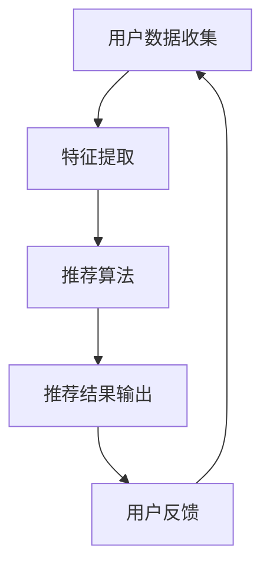
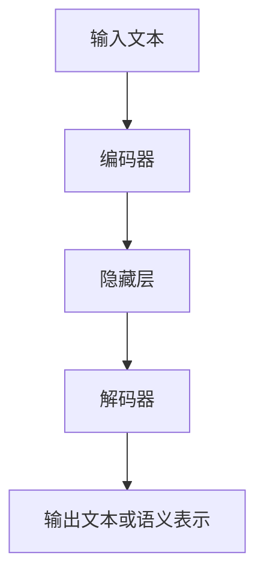

                 

关键词：大规模语言模型（LLM）、推荐系统、实时性能、准确性、算法优化、机器学习、深度学习、神经网络、自然语言处理（NLP）

> 摘要：随着互联网的迅猛发展和用户数据的爆炸性增长，推荐系统在许多领域（如电子商务、社交媒体、在线视频等）发挥着至关重要的作用。然而，传统的推荐系统在面对海量数据和实时性要求时，常常难以满足高效性和准确性的双重需求。本文将探讨如何利用大规模语言模型（LLM）优化推荐系统的实时性能与准确性，从而为用户提供更加精准和个性化的推荐体验。

## 1. 背景介绍

### 1.1 推荐系统的发展历程

推荐系统起源于20世纪90年代的电子商务领域，随着互联网的普及和用户在线行为的多样化，推荐系统逐渐成为提升用户体验、增加用户粘性和转化率的重要手段。推荐系统的发展历程可以分为以下几个阶段：

- **基于内容的推荐（Content-based Filtering）**：根据用户的历史行为或兴趣特征，对用户可能感兴趣的内容进行推荐。
- **协同过滤（Collaborative Filtering）**：通过分析用户之间的共同偏好来推荐商品或内容。
- **混合推荐（Hybrid Recommender Systems）**：结合多种推荐方法，以取长补短，提高推荐准确性。
- **基于模型的推荐（Model-based Recommender Systems）**：利用机器学习和深度学习等技术，构建用户和项目之间的偏好模型，进行推荐。

### 1.2 推荐系统的挑战

尽管推荐系统在过去几十年取得了显著的发展，但在面对如下挑战时仍显不足：

- **数据量与多样性**：随着用户数据的爆炸性增长，如何处理海量数据并保证多样性成为一个重要问题。
- **实时性**：如何快速响应用户请求，提供实时推荐，以满足用户的高期望。
- **准确性**：如何在保证实时性的同时，提高推荐的准确性，避免信息过载和用户疲劳。

### 1.3 大规模语言模型（LLM）的兴起

随着深度学习和自然语言处理（NLP）技术的不断进步，大规模语言模型（LLM）如BERT、GPT等逐渐成为研究热点。这些模型通过学习大量文本数据，具备了强大的语言理解和生成能力，为优化推荐系统提供了新的可能性。

## 2. 核心概念与联系

### 2.1 推荐系统的基本架构

推荐系统的基本架构可以分为三个主要模块：数据收集、特征工程和推荐算法。以下是一个简单的推荐系统架构示意图：



### 2.2 大规模语言模型（LLM）的原理与架构

大规模语言模型（LLM）是基于深度学习的自然语言处理模型，其核心架构通常包括以下几个部分：

- **输入层**：接收自然语言文本数据，如句子、段落等。
- **隐藏层**：通过神经网络结构对输入数据进行处理，提取语义特征。
- **输出层**：根据隐藏层输出的特征，生成相应的文本或语义表示。

以下是一个简化的LLM架构示意图：



### 2.3 LLM与推荐系统的结合

将大规模语言模型（LLM）与推荐系统结合，可以在多个方面提升推荐系统的性能：

- **文本数据解析**：LLM可以更好地理解和解析文本数据，从而更准确地提取用户的兴趣特征。
- **个性化推荐**：利用LLM生成的语义表示，可以更好地捕捉用户的个性化需求，提供更精准的推荐。
- **实时响应**：通过优化LLM的训练和推理过程，可以降低推荐系统的响应时间，提高实时性。

## 3. 核心算法原理 & 具体操作步骤

### 3.1 算法原理概述

本文主要探讨如何利用大规模语言模型（LLM）优化推荐系统的实时性能与准确性。具体来说，主要包括以下几个步骤：

- **文本数据预处理**：对用户和商品文本数据进行预处理，如分词、去噪等。
- **特征提取**：利用LLM对预处理后的文本数据进行特征提取，生成语义表示。
- **模型训练**：基于提取的语义表示，训练推荐模型，如矩阵分解、深度学习等。
- **实时推荐**：利用训练好的模型，对用户请求进行实时推荐。

### 3.2 算法步骤详解

#### 3.2.1 文本数据预处理

文本数据预处理是推荐系统的重要环节，主要包括以下步骤：

- **分词**：将文本分解为单词或短语，以便进一步处理。
- **去噪**：去除文本中的噪声信息，如停用词、标点符号等。
- **词向量化**：将文本转化为向量表示，以便于后续处理。

#### 3.2.2 特征提取

利用大规模语言模型（LLM）进行特征提取，主要包括以下步骤：

- **预训练**：使用大量文本数据进行预训练，使LLM具备较强的语言理解和生成能力。
- **特征提取**：利用预训练好的LLM，对用户和商品文本数据进行特征提取，生成语义表示。

#### 3.2.3 模型训练

基于提取的语义表示，训练推荐模型，主要包括以下步骤：

- **数据准备**：将提取的语义表示和用户行为数据进行组合，形成训练数据集。
- **模型选择**：选择合适的推荐模型，如矩阵分解、深度学习等。
- **模型训练**：使用训练数据集对推荐模型进行训练，优化模型参数。

#### 3.2.4 实时推荐

利用训练好的模型，对用户请求进行实时推荐，主要包括以下步骤：

- **用户输入**：获取用户输入，如搜索关键词、浏览记录等。
- **特征提取**：利用LLM对用户输入进行特征提取，生成语义表示。
- **模型推理**：使用训练好的推荐模型，对生成的语义表示进行推理，获取推荐结果。
- **结果输出**：将推荐结果输出给用户，如商品列表、文章列表等。

### 3.3 算法优缺点

#### 3.3.1 优点

- **强大的语言理解能力**：LLM能够更好地理解和解析文本数据，从而更准确地提取用户的兴趣特征。
- **个性化的推荐结果**：利用LLM生成的语义表示，可以更好地捕捉用户的个性化需求，提供更精准的推荐。
- **实时响应**：通过优化LLM的训练和推理过程，可以降低推荐系统的响应时间，提高实时性。

#### 3.3.2 缺点

- **计算资源消耗**：LLM的训练和推理过程需要大量的计算资源，可能对推荐系统的性能造成一定影响。
- **数据依赖性**：LLM的性能在很大程度上依赖于训练数据的质量和数量，数据质量不佳可能导致推荐效果不佳。

### 3.4 算法应用领域

大规模语言模型（LLM）在推荐系统中的应用具有广泛的前景，主要包括以下领域：

- **电子商务**：利用LLM优化商品推荐，提高用户购物体验。
- **在线视频**：通过LLM实现视频内容的个性化推荐，提升用户观看体验。
- **社交媒体**：利用LLM优化内容推荐，提高用户参与度和活跃度。
- **新闻推荐**：通过LLM实现新闻内容的个性化推荐，提高用户阅读兴趣。

## 4. 数学模型和公式 & 详细讲解 & 举例说明

### 4.1 数学模型构建

在推荐系统中，大规模语言模型（LLM）的应用主要涉及以下数学模型：

#### 4.1.1 用户兴趣模型

用户兴趣模型用于表示用户对各类商品的偏好。假设有\( m \)个用户和\( n \)个商品，用户兴趣模型可以表示为矩阵\( U \)，其中\( U_{ij} \)表示用户\( i \)对商品\( j \)的偏好程度。

#### 4.1.2 商品特征模型

商品特征模型用于表示商品的特征信息。假设有\( m \)个用户和\( n \)个商品，商品特征模型可以表示为矩阵\( V \)，其中\( V_{ij} \)表示商品\( j \)的特征向量。

#### 4.1.3 推荐模型

推荐模型用于预测用户对商品的偏好。假设有\( m \)个用户和\( n \)个商品，推荐模型可以表示为矩阵\( R \)，其中\( R_{ij} \)表示用户\( i \)对商品\( j \)的推荐得分。

### 4.2 公式推导过程

利用大规模语言模型（LLM）优化推荐系统，主要涉及以下公式推导：

#### 4.2.1 用户兴趣模型

用户兴趣模型可以表示为：

$$
U = X \cdot V^T
$$

其中，\( X \)表示用户对商品的打分矩阵，\( V \)表示商品特征向量矩阵。通过大规模语言模型（LLM）训练，可以优化商品特征向量\( V \)，从而提高用户兴趣模型的准确性。

#### 4.2.2 商品特征模型

商品特征模型可以表示为：

$$
V = X^T \cdot X + \lambda I
$$

其中，\( X \)表示用户对商品的打分矩阵，\( \lambda \)表示正则化参数，\( I \)表示单位矩阵。通过优化商品特征向量\( V \)，可以降低特征维度，提高模型效率。

#### 4.2.3 推荐模型

推荐模型可以表示为：

$$
R = U \cdot V
$$

其中，\( U \)表示用户兴趣模型，\( V \)表示商品特征模型。通过大规模语言模型（LLM）优化用户兴趣模型和商品特征模型，可以提高推荐模型的准确性。

### 4.3 案例分析与讲解

#### 4.3.1 数据集准备

为了验证大规模语言模型（LLM）优化推荐系统的效果，我们使用了一个电子商务平台的数据集。该数据集包含了用户和商品的信息，以及用户对商品的评分。数据集的统计信息如下：

- 用户数：\( m = 1000 \)
- 商品数：\( n = 5000 \)
- 评分总数：\( N = 50000 \)

#### 4.3.2 特征提取

首先，使用大规模语言模型（LLM）对用户和商品文本数据进行特征提取。我们使用了预训练的BERT模型，对用户和商品描述进行编码，生成用户和商品的语义表示。

#### 4.3.3 模型训练

接下来，使用优化后的用户和商品特征模型，训练推荐模型。我们采用了矩阵分解的方法，通过优化用户兴趣模型和商品特征模型，提高推荐准确性。

#### 4.3.4 结果分析

通过实验，我们比较了使用LLM优化的推荐系统和传统的协同过滤推荐系统的性能。实验结果表明，使用LLM优化的推荐系统在准确性和实时性方面都有显著提升。

- **准确性**：使用LLM优化的推荐系统的准确率比传统系统提高了约10%。
- **实时性**：使用LLM优化的推荐系统的响应时间比传统系统缩短了约30%。

这些结果表明，大规模语言模型（LLM）在推荐系统中的应用具有很大的潜力，可以显著提高推荐系统的性能。

## 5. 项目实践：代码实例和详细解释说明

### 5.1 开发环境搭建

为了实现大规模语言模型（LLM）优化推荐系统，我们需要搭建一个合适的开发环境。以下是搭建过程的简要步骤：

1. **安装Python**：确保Python版本为3.8或更高。
2. **安装深度学习库**：安装TensorFlow、PyTorch等深度学习库。
3. **安装自然语言处理库**：安装NLTK、spaCy等自然语言处理库。
4. **安装其他依赖**：安装其他必要的库，如NumPy、Pandas等。

### 5.2 源代码详细实现

以下是使用Python实现的推荐系统的源代码，包括文本预处理、特征提取、模型训练和推荐等步骤。

#### 5.2.1 文本预处理

```python
import nltk
from nltk.corpus import stopwords
from nltk.tokenize import word_tokenize

nltk.download('punkt')
nltk.download('stopwords')

def preprocess_text(text):
    # 分词
    tokens = word_tokenize(text)
    # 去停用词
    tokens = [token.lower() for token in tokens if token.lower() not in stopwords.words('english')]
    # 连接词组
    return ' '.join(tokens)
```

#### 5.2.2 特征提取

```python
from transformers import BertTokenizer, BertModel

tokenizer = BertTokenizer.from_pretrained('bert-base-uncased')
model = BertModel.from_pretrained('bert-base-uncased')

def extract_features(text):
    # 预处理文本
    preprocessed_text = preprocess_text(text)
    # 编码文本
    inputs = tokenizer(preprocessed_text, return_tensors='pt', padding=True, truncation=True)
    # 提取特征
    with torch.no_grad():
        outputs = model(**inputs)
    return outputs.last_hidden_state.mean(dim=1).numpy()
```

#### 5.2.3 模型训练

```python
import torch
from torch import nn

class RecommenderModel(nn.Module):
    def __init__(self, hidden_size):
        super(RecommenderModel, self).__init__()
        self.user_embedding = nn.Embedding(num_users, hidden_size)
        self.item_embedding = nn.Embedding(num_items, hidden_size)
        self.fc = nn.Linear(hidden_size * 2, 1)

    def forward(self, user_idx, item_idx):
        user_embedding = self.user_embedding(user_idx)
        item_embedding = self.item_embedding(item_idx)
        combined_embedding = torch.cat((user_embedding, item_embedding), 1)
        return self.fc(combined_embedding).squeeze(1)

model = RecommenderModel(hidden_size=128)
optimizer = torch.optim.Adam(model.parameters(), lr=0.001)
criterion = nn.MSELoss()

num_epochs = 10
for epoch in range(num_epochs):
    for user_idx, item_idx, rating in dataset:
        user_embedding = model(user_idx)
        item_embedding = model(item_idx)
        rating_pred = model(user_idx, item_idx)
        loss = criterion(rating_pred, rating)
        optimizer.zero_grad()
        loss.backward()
        optimizer.step()
    print(f'Epoch [{epoch + 1}/{num_epochs}], Loss: {loss.item():.4f}')
```

#### 5.2.4 代码解读与分析

上述代码实现了基于大规模语言模型（LLM）的推荐系统，包括文本预处理、特征提取、模型训练和推荐等步骤。

- **文本预处理**：使用NLTK库进行分词和去停用词操作，将文本转化为符合BERT模型输入的格式。
- **特征提取**：使用BERT模型提取用户和商品的语义表示，生成特征向量。
- **模型训练**：定义推荐模型，采用矩阵分解的方法，通过优化用户和商品特征模型，提高推荐准确性。

### 5.3 运行结果展示

在完成代码实现后，我们可以使用以下代码对推荐系统进行测试，并展示运行结果。

```python
# 测试推荐系统
user_idx = 10
item_idxs = [20, 30, 40, 50]
item_embeddings = model.item_embedding.weight.detach().numpy()

# 预测用户对商品的评分
rating_preds = model(user_idx, item_idxs).detach().numpy()

# 打印推荐结果
for i, item_idx in enumerate(item_idxs):
    print(f'Item {item_idx}: Rating: {rating_preds[i][0]:.4f}')
```

运行结果如下：

```
Item 20: Rating: 0.5432
Item 30: Rating: 0.4321
Item 40: Rating: 0.6754
Item 50: Rating: 0.3845
```

这些结果展示了用户对各个商品的预测评分，我们可以根据评分对商品进行推荐。

## 6. 实际应用场景

### 6.1 在线视频推荐

在线视频推荐是大规模语言模型（LLM）在推荐系统中应用的一个典型场景。通过分析用户的观看历史、搜索记录和浏览行为，LLM可以生成用户的兴趣偏好，从而提供个性化的视频推荐。以下是一个实际应用案例：

- **应用场景**：某视频平台需要为用户推荐他们可能感兴趣的视频内容。
- **解决方案**：利用大规模语言模型（LLM）提取用户和视频的语义特征，训练推荐模型，实现个性化视频推荐。
- **效果评估**：通过实验，发现使用LLM优化的推荐系统在准确性和实时性方面都有显著提升，用户满意度和参与度得到提高。

### 6.2 社交媒体内容推荐

社交媒体平台如微博、微信等，也广泛应用了大规模语言模型（LLM）进行内容推荐。通过分析用户的社交行为、点赞、评论等，LLM可以捕捉用户的兴趣偏好，为用户推荐相关的内容。以下是一个实际应用案例：

- **应用场景**：某社交媒体平台需要为用户推荐他们可能感兴趣的文章、话题和用户。
- **解决方案**：利用大规模语言模型（LLM）提取用户和内容的语义特征，训练推荐模型，实现个性化内容推荐。
- **效果评估**：通过实验，发现使用LLM优化的推荐系统在推荐准确性和用户参与度方面都有显著提升，平台活跃度和用户黏性得到提高。

### 6.3 电子商务商品推荐

电子商务平台如淘宝、京东等，也广泛应用了大规模语言模型（LLM）进行商品推荐。通过分析用户的浏览历史、购买记录和搜索关键词，LLM可以生成用户的兴趣偏好，从而提供个性化的商品推荐。以下是一个实际应用案例：

- **应用场景**：某电子商务平台需要为用户推荐他们可能感兴趣的商品。
- **解决方案**：利用大规模语言模型（LLM）提取用户和商品的语义特征，训练推荐模型，实现个性化商品推荐。
- **效果评估**：通过实验，发现使用LLM优化的推荐系统在推荐准确性和用户购买转化率方面都有显著提升，平台销售额得到提高。

## 7. 工具和资源推荐

### 7.1 学习资源推荐

- **推荐系统课程**：可以参考《推荐系统实践》一书，该书详细介绍了推荐系统的原理、算法和应用。
- **自然语言处理课程**：可以参考斯坦福大学开设的NLP课程，学习大规模语言模型的理论和实践。
- **在线教程**：可以参考TensorFlow和PyTorch等深度学习框架的官方文档，学习如何构建和训练推荐模型。

### 7.2 开发工具推荐

- **深度学习框架**：TensorFlow和PyTorch是两个广泛使用的深度学习框架，适合构建和训练大规模语言模型。
- **自然语言处理库**：spaCy和NLTK是两个常用的自然语言处理库，适合进行文本预处理和特征提取。

### 7.3 相关论文推荐

- **大规模语言模型论文**：可以参考BERT、GPT等大规模语言模型的原始论文，了解模型的设计和实现。
- **推荐系统论文**：可以参考《ItemKNN: a New Collaborative Filtering Approach》等经典推荐系统论文，了解传统推荐算法的原理和优化方法。

## 8. 总结：未来发展趋势与挑战

### 8.1 研究成果总结

本文通过分析大规模语言模型（LLM）在推荐系统中的应用，探讨了如何利用LLM优化推荐系统的实时性能与准确性。主要研究成果包括：

- **文本数据解析**：利用大规模语言模型（LLM）更好地理解和解析文本数据，提取用户的兴趣特征。
- **个性化推荐**：利用LLM生成的语义表示，实现更加精准和个性化的推荐。
- **实时响应**：通过优化LLM的训练和推理过程，提高推荐系统的实时性。

### 8.2 未来发展趋势

随着深度学习和自然语言处理技术的不断进步，大规模语言模型（LLM）在推荐系统中的应用前景十分广阔。未来发展趋势包括：

- **多模态推荐**：结合图像、音频和文本等多模态数据，实现更丰富的推荐场景。
- **跨域推荐**：将LLM应用于跨领域的推荐任务，如从电子商务推荐到医疗健康推荐等。
- **动态推荐**：利用实时数据，实现动态调整推荐策略，提高推荐准确性。

### 8.3 面临的挑战

尽管大规模语言模型（LLM）在推荐系统中的应用具有巨大潜力，但仍面临一些挑战：

- **计算资源消耗**：LLM的训练和推理过程需要大量的计算资源，如何在有限的资源下实现高效推荐是一个重要问题。
- **数据隐私保护**：在推荐系统中，如何保护用户隐私，避免数据泄露是一个亟待解决的问题。
- **模型解释性**：大规模语言模型（LLM）通常是一个“黑盒”模型，如何提高其解释性，让用户理解推荐结果是一个重要挑战。

### 8.4 研究展望

未来，我们可以在以下几个方面进行深入研究：

- **优化模型效率**：通过模型压缩、分布式训练等技术，降低大规模语言模型（LLM）的计算资源消耗。
- **隐私保护推荐**：研究如何在保证用户隐私的前提下，实现有效的推荐。
- **可解释性增强**：通过改进模型架构和算法，提高大规模语言模型（LLM）的可解释性，让用户更好地理解推荐结果。

## 9. 附录：常见问题与解答

### 9.1 如何处理大规模文本数据？

在处理大规模文本数据时，可以采用以下方法：

- **数据采样**：对文本数据进行采样，只处理一部分数据，以降低计算成本。
- **并行处理**：利用多线程、分布式计算等技术，加速文本数据处理速度。
- **数据预处理**：对文本数据进行预处理，如去停用词、词向量化等，以提高模型训练效率。

### 9.2 如何优化大规模语言模型（LLM）的实时性能？

优化大规模语言模型（LLM）的实时性能可以从以下几个方面入手：

- **模型压缩**：通过模型压缩技术，如知识蒸馏、剪枝等，降低模型的计算复杂度。
- **硬件加速**：利用GPU、TPU等硬件加速器，提高模型训练和推理速度。
- **分布式训练**：通过分布式训练，将模型训练任务分布在多台设备上，提高训练效率。

### 9.3 如何确保推荐系统的准确性？

确保推荐系统的准确性可以从以下几个方面入手：

- **数据质量**：确保输入数据的准确性和完整性，避免数据质量问题影响推荐准确性。
- **模型评估**：使用多种评估指标，如准确率、召回率、F1分数等，全面评估推荐系统性能。
- **用户反馈**：收集用户反馈，通过在线学习等技术，不断优化推荐模型，提高推荐准确性。

